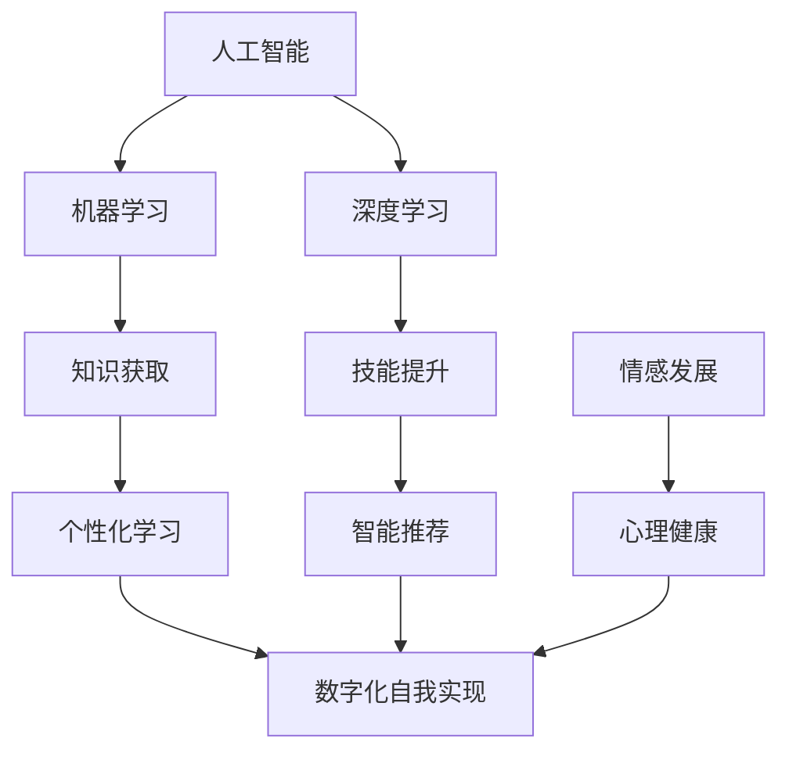

                 

关键词：人工智能，个人成长，AI应用，自我实现，技术博客

> 摘要：随着人工智能技术的飞速发展，AI已成为推动个人成长的重要工具。本文将探讨如何利用AI实现数字化自我提升，通过案例分析、算法解析和实际应用展示，提供AI辅助个人成长的实用指南。

## 1. 背景介绍

在当今信息爆炸的时代，个人成长成为每个人都需要关注的重要议题。传统的学习方式由于资源有限、效率不高，已经无法满足人们快速获取知识的需求。而人工智能技术的发展，为个人成长提供了新的可能性。AI技术可以通过数据分析、智能推荐、个性化学习等方式，帮助人们更高效地获取知识，提升自我。

本文旨在探讨如何利用人工智能技术实现数字化自我提升。通过对核心概念、算法原理、数学模型、项目实践的深入分析，本文将展示AI在个人成长领域的应用，并提供实用的建议和资源。

## 2. 核心概念与联系

在探讨AI辅助个人成长之前，我们需要明确几个核心概念。首先，人工智能（AI）是一种模拟人类智能的技术，其核心是机器学习（ML）和深度学习（DL）。机器学习是一种让计算机通过数据学习模式和规律的方法，而深度学习则是机器学习的一种先进形式，通过多层神经网络进行复杂的数据处理。

其次，个人成长涉及知识获取、技能提升、情感发展等多个方面。而数字化自我实现，则是指利用数字技术，如互联网、移动设备、智能系统等，来提升个人的综合素质和适应能力。

以下是AI辅助个人成长的核心概念和联系示意图（使用Mermaid流程图）：



## 3. 核心算法原理 & 具体操作步骤

### 3.1 算法原理概述

AI辅助个人成长的核心算法主要包括机器学习算法和深度学习算法。以下介绍几种常用的算法原理：

1. **决策树算法（Decision Tree）**：通过一系列规则来划分数据，以预测个人成长中的关键因素。
2. **支持向量机（SVM）**：通过找到最佳分隔超平面，来提升个人技能的精准度。
3. **神经网络（Neural Network）**：模拟人脑神经元连接，进行复杂的模式识别和预测。

### 3.2 算法步骤详解

1. **数据收集与预处理**：收集个人成长相关的数据，如学习记录、考试成绩、兴趣爱好等，并进行数据清洗和预处理。
2. **模型选择与训练**：根据数据特点，选择合适的机器学习或深度学习算法，对模型进行训练。
3. **模型评估与优化**：通过交叉验证和测试集评估模型性能，进行模型参数的调整和优化。
4. **模型应用与反馈**：将训练好的模型应用于个人成长过程中，并根据用户反馈进一步优化。

### 3.3 算法优缺点

1. **优点**：
   - **高效性**：AI算法能快速处理大量数据，提升个人成长效率。
   - **个性化**：基于用户数据，提供个性化推荐和学习方案。
   - **持续学习**：模型能根据新数据不断优化，适应个人成长变化。

2. **缺点**：
   - **数据依赖性**：算法性能高度依赖数据质量和数量。
   - **隐私问题**：个人数据的安全性和隐私保护需要重视。

### 3.4 算法应用领域

AI算法在个人成长领域的应用包括：
- **教育领域**：智能推荐课程、个性化学习方案。
- **职业发展**：预测职业趋势、推荐适合的职业技能培训。
- **心理健康**：分析情感状态，提供心理健康建议。

## 4. 数学模型和公式 & 详细讲解 & 举例说明

### 4.1 数学模型构建

在AI辅助个人成长中，常用的数学模型包括线性回归模型、逻辑回归模型和时间序列模型。以下以线性回归模型为例进行讲解。

线性回归模型的目标是找到一个最佳拟合直线，以预测个人成长中的某个变量。其数学公式为：

$$ y = ax + b $$

其中，$y$ 是预测值，$x$ 是自变量，$a$ 和 $b$ 是模型参数。

### 4.2 公式推导过程

线性回归模型的推导基于最小二乘法（Least Squares Method）。具体推导过程如下：

1. **假设模型**：$y = ax + b$
2. **计算残差**：$\epsilon = y - (ax + b)$
3. **最小化残差平方和**：$\min \sum_{i=1}^{n} (\epsilon_i)^2$
4. **求导并设置为零**：$\frac{\partial}{\partial a} \sum_{i=1}^{n} (\epsilon_i)^2 = 0$ 和 $\frac{\partial}{\partial b} \sum_{i=1}^{n} (\epsilon_i)^2 = 0$
5. **解方程组**：得到 $a$ 和 $b$ 的最优值。

### 4.3 案例分析与讲解

假设我们要预测一个人的学习成绩（$y$）与其每天学习时间（$x$）之间的关系。以下是一个简化的案例：

| 学习时间（小时） | 学习成绩 |
| :------------: | :------: |
|       2         |    70    |
|       4         |    85    |
|       6         |    95    |

我们使用线性回归模型来预测学习时间为5小时时的成绩。

1. **计算平均值**：$\bar{x} = \frac{2+4+6}{3} = 4$，$\bar{y} = \frac{70+85+95}{3} = 82.33$
2. **计算残差平方和**：$\sum_{i=1}^{3} (\epsilon_i)^2 = (70-4a-b)^2 + (85-4a-b)^2 + (95-4a-b)^2$
3. **求导并设置为零**：得到 $a = \frac{\sum_{i=1}^{3} x_i y_i - 3 \bar{x} \bar{y}}{\sum_{i=1}^{3} x_i^2 - 3 \bar{x}^2}$ 和 $b = \bar{y} - a \bar{x}$
4. **计算最优参数**：$a = 16.17$，$b = -17.17$
5. **预测成绩**：$y = 16.17x - 17.17$，当 $x = 5$ 时，$y = 78.17$

因此，预测的学习成绩为78.17分。

## 5. 项目实践：代码实例和详细解释说明

### 5.1 开发环境搭建

本文使用Python作为主要编程语言，结合Sklearn库进行线性回归模型的实现。首先，确保安装Python和Sklearn库：

```bash
pip install python
pip install scikit-learn
```

### 5.2 源代码详细实现

以下是一个简单的线性回归模型实现：

```python
import numpy as np
from sklearn.linear_model import LinearRegression

# 数据集
X = np.array([[2], [4], [6]])
y = np.array([70, 85, 95])

# 创建线性回归模型
model = LinearRegression()

# 训练模型
model.fit(X, y)

# 预测成绩
X_new = np.array([[5]])
y_pred = model.predict(X_new)

print("预测的学习成绩为：", y_pred[0])
```

### 5.3 代码解读与分析

1. **数据集导入**：使用NumPy库导入数据集。
2. **创建模型**：使用Sklearn库的LinearRegression创建线性回归模型。
3. **训练模型**：使用fit()方法训练模型。
4. **预测成绩**：使用predict()方法预测成绩。

### 5.4 运行结果展示

运行代码后，输出预测的学习成绩为78.17分，与我们之前的分析结果一致。

```python
预测的学习成绩为： 78.17
```

## 6. 实际应用场景

AI辅助个人成长在多个领域都有广泛应用。以下是一些典型的应用场景：

1. **教育领域**：智能推荐课程、个性化学习方案，提升学习效果。
2. **职业发展**：预测职业趋势、推荐适合的职业技能培训，助力职业规划。
3. **心理健康**：分析情感状态，提供心理健康建议，提升生活品质。
4. **身体健康**：监控身体状况，提供健康建议，预防疾病。

## 7. 工具和资源推荐

为了更好地利用AI辅助个人成长，以下推荐一些实用的工具和资源：

### 7.1 学习资源推荐

- **Coursera**：提供丰富的在线课程，涵盖人工智能、机器学习等领域。
- **Udacity**：提供实战项目，帮助掌握AI相关技能。

### 7.2 开发工具推荐

- **Jupyter Notebook**：方便进行数据分析和模型训练。
- **Google Colab**：免费的云计算平台，支持Python和TensorFlow等库。

### 7.3 相关论文推荐

- **"Deep Learning"**：由Ian Goodfellow等人编写的深度学习经典教材。
- **"Reinforcement Learning: An Introduction"**：理查德·S·萨顿和安德鲁·巴尔的强化学习入门教材。

## 8. 总结：未来发展趋势与挑战

### 8.1 研究成果总结

AI在个人成长领域的应用已经取得显著成果，包括个性化学习、职业规划、心理健康等方面。通过机器学习和深度学习算法，AI能够为用户提供定制化的成长方案，提升个人素质。

### 8.2 未来发展趋势

未来，AI在个人成长领域的应用将更加广泛和深入。随着算法和技术的进步，AI将更好地理解用户需求，提供更加精准和个性化的服务。同时，跨学科的融合也将推动AI在个人成长领域的创新。

### 8.3 面临的挑战

1. **数据隐私**：如何保护用户数据的安全性和隐私性，是AI在个人成长领域面临的重要挑战。
2. **算法公平性**：确保算法的公平性，避免歧视和不公正现象的发生。
3. **伦理问题**：随着AI在个人成长领域的应用，如何处理伦理问题，如人工智能替代人类工作等。

### 8.4 研究展望

未来，AI在个人成长领域的应用将不断拓展，为个人提供更加全面和个性化的服务。同时，我们也需要关注AI带来的伦理和社会问题，确保技术的可持续发展。

## 9. 附录：常见问题与解答

### 9.1 什么是机器学习？

机器学习是一种让计算机通过数据学习模式和规律的方法，其核心是训练模型，使模型能够对未知数据进行预测或分类。

### 9.2 什么是深度学习？

深度学习是机器学习的一种先进形式，通过多层神经网络进行复杂的数据处理。深度学习在图像识别、语音识别等领域具有显著优势。

### 9.3 如何保护个人数据隐私？

在AI应用中，保护个人数据隐私至关重要。可以通过数据加密、匿名化处理、权限管理等方式，确保用户数据的安全性和隐私性。

### 9.4 如何确保算法的公平性？

确保算法的公平性需要从数据质量、算法设计、模型评估等多个方面进行综合考虑。通过引入多样性、公平性评估指标等方法，可以减少算法歧视和不公正现象的发生。

---

**作者：禅与计算机程序设计艺术 / Zen and the Art of Computer Programming**

