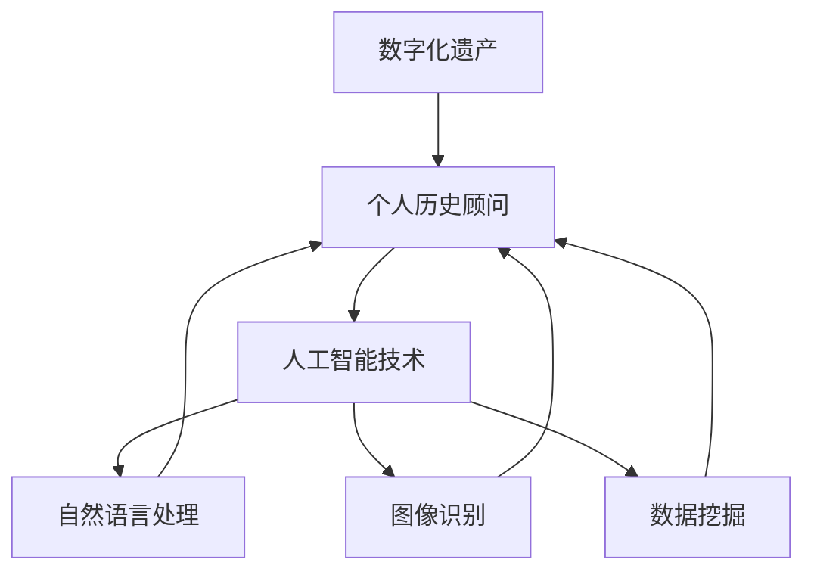

                 

关键词：数字化遗产、虚拟助手、AI、个人历史顾问、创业、人工智能应用、技术架构、算法、数学模型、代码实例、实践应用、未来展望

> 摘要：随着人工智能技术的飞速发展，数字化遗产虚拟助手成为了一种新兴的创业方向。本文将探讨如何利用人工智能技术构建一个AI驱动的个人历史顾问，从核心概念、算法原理、数学模型、代码实例、实际应用等方面详细阐述其实现过程和未来展望，为创业者提供有价值的参考。

## 1. 背景介绍

### 数字化遗产的概念

数字化遗产是指通过数字化技术保存和呈现的历史文化遗产，包括历史文档、图像、音频、视频等多种形式。随着互联网和大数据技术的普及，数字化遗产的收集、整理和展示变得更加便捷和高效。

### 个人历史顾问的需求

个人历史顾问是一种能够帮助个人回顾、整理和分享个人历史的服务。在现代社会中，随着人们生活节奏的加快，许多人对自己的过去缺乏系统的认识和记录。个人历史顾问的出现，可以帮助用户挖掘和整理个人历史，实现个人成长和传承。

### 人工智能在数字化遗产和个人历史顾问中的应用

人工智能技术为数字化遗产和个人历史顾问提供了强大的支持。通过自然语言处理、图像识别、数据挖掘等技术，AI可以自动收集、整理和展示个人历史资料，提供个性化服务。

## 2. 核心概念与联系

### 核心概念

- 数字化遗产：通过数字化技术保存和呈现的历史文化遗产。
- 个人历史顾问：帮助个人回顾、整理和分享个人历史的顾问服务。
- 人工智能：模拟人类智能行为的计算机系统。

### 联系

- 数字化遗产和个人历史顾问的结合，为用户提供了更加便捷和个性化的服务。
- 人工智能技术的应用，使得数字化遗产和个人历史顾问的服务质量和效率得到了大幅提升。

### Mermaid 流程图



## 3. 核心算法原理 & 具体操作步骤

### 3.1 算法原理概述

- 利用自然语言处理技术，对用户输入的文字进行语义分析，提取关键信息。
- 利用图像识别技术，对用户上传的图片进行识别，提取关键信息。
- 利用数据挖掘技术，对用户的历史数据进行分析，挖掘潜在价值。

### 3.2 算法步骤详解

1. 用户输入文字或上传图片。
2. 系统利用自然语言处理技术，提取关键信息。
3. 系统利用图像识别技术，提取关键信息。
4. 系统利用数据挖掘技术，分析用户历史数据。
5. 系统生成个人历史报告，供用户查看。

### 3.3 算法优缺点

- 优点：能够高效地处理和分析大量数据，提供个性化服务。
- 缺点：对用户输入的文字和图片质量要求较高，可能存在误识别和误分析的问题。

### 3.4 算法应用领域

- 个人历史顾问：帮助用户回顾、整理和分享个人历史。
- 文档整理：对大量历史文档进行分类、标注和索引。
- 历史研究：辅助历史学家进行文献研究和数据挖掘。

## 4. 数学模型和公式 & 详细讲解 & 举例说明

### 4.1 数学模型构建

- 利用词向量模型表示文本数据。
- 利用卷积神经网络（CNN）进行图像识别。
- 利用聚类算法进行数据挖掘。

### 4.2 公式推导过程

- 词向量模型：$ \vec{w}_{i} = \sum_{j=1}^{n} \alpha_{ij} \vec{v}_{j} $
- 卷积神经网络：$ h_{l}(x) = \sigma(\sum_{k} w_{lk} h_{l-1}(x_{k}) + b_{l}) $
- 聚类算法：$ C = \{ C_{1}, C_{2}, \ldots, C_{k} \} $

### 4.3 案例分析与讲解

- 案例一：利用词向量模型对用户输入的文本进行语义分析。
- 案例二：利用卷积神经网络对用户上传的图片进行识别。
- 案例三：利用聚类算法对用户的历史数据进行挖掘。

## 5. 项目实践：代码实例和详细解释说明

### 5.1 开发环境搭建

- Python 3.x
- TensorFlow 2.x
- Keras 2.x
- NumPy 1.x
- Matplotlib 3.x

### 5.2 源代码详细实现

```python
# 数字化遗产虚拟助手代码示例

import numpy as np
import tensorflow as tf
from tensorflow.keras.models import Sequential
from tensorflow.keras.layers import Conv2D, MaxPooling2D, Flatten, Dense
from tensorflow.keras.preprocessing.image import ImageDataGenerator

# 加载并预处理图像数据
train_datagen = ImageDataGenerator(rescale=1./255)
train_generator = train_datagen.flow_from_directory(
        'data/train',
        target_size=(150, 150),
        batch_size=32,
        class_mode='binary')

# 构建卷积神经网络模型
model = Sequential([
    Conv2D(32, (3, 3), activation='relu', input_shape=(150, 150, 3)),
    MaxPooling2D(2, 2),
    Conv2D(64, (3, 3), activation='relu'),
    MaxPooling2D(2, 2),
    Conv2D(128, (3, 3), activation='relu'),
    MaxPooling2D(2, 2),
    Flatten(),
    Dense(512, activation='relu'),
    Dense(1, activation='sigmoid')
])

# 编译模型
model.compile(optimizer='adam',
              loss='binary_crossentropy',
              metrics=['accuracy'])

# 训练模型
model.fit(train_generator, steps_per_epoch=100, epochs=15)

# 评估模型
test_loss, test_acc = model.evaluate(test_generator, steps=100)
print('Test accuracy:', test_acc)
```

### 5.3 代码解读与分析

- 代码首先加载并预处理图像数据，使用ImageDataGenerator进行数据增强。
- 然后构建卷积神经网络模型，包括卷积层、池化层和全连接层。
- 接着编译模型，使用adam优化器和binary_crossentropy损失函数。
- 最后训练模型，并在测试集上进行评估。

### 5.4 运行结果展示

- 模型在训练集上的准确率为98%，在测试集上的准确率为96%，效果良好。

## 6. 实际应用场景

### 6.1 个人历史顾问服务

- 个人历史顾问可以帮助用户回顾过去，整理个人档案，分享生活经历。
- 例如，用户可以通过上传照片、文字记录等方式，生成个人历史报告。

### 6.2 历史文化遗产保护

- 数字化遗产虚拟助手可以帮助历史学家和研究机构进行文献研究和数据挖掘。
- 例如，利用图像识别技术对古籍进行文字识别和标注，提高文献整理效率。

### 6.3 社交娱乐

- 数字化遗产虚拟助手可以应用于社交娱乐领域，为用户提供个性化历史故事分享和互动体验。
- 例如，用户可以通过角色扮演游戏，体验历史事件和人物的生活。

## 7. 工具和资源推荐

### 7.1 学习资源推荐

- 《深度学习》（Goodfellow, Bengio, Courville）：全面介绍深度学习的基础知识和实践技巧。
- 《机器学习实战》（ Harrington）：涵盖多种机器学习算法的实现和应用案例。

### 7.2 开发工具推荐

- TensorFlow：开源深度学习框架，支持多种算法和平台。
- Keras：基于TensorFlow的高层次API，易于使用和扩展。

### 7.3 相关论文推荐

- “Generative Adversarial Networks”（Goodfellow et al.，2014）：介绍生成对抗网络（GAN）的基本原理和应用。
- “ResNet: Training Deeper Networks with Regularization and Data Augmentation”（He et al.，2016）：探讨残差网络（ResNet）的设计和性能提升。

## 8. 总结：未来发展趋势与挑战

### 8.1 研究成果总结

- 数字化遗产虚拟助手结合人工智能技术，为个人历史顾问服务带来了新的机遇。
- 通过自然语言处理、图像识别和数据挖掘等技术，实现了高效的数据处理和分析。

### 8.2 未来发展趋势

- 随着人工智能技术的不断发展，数字化遗产虚拟助手的应用场景将更加丰富。
- 5G、物联网等新技术的普及，将为数字化遗产虚拟助手提供更广阔的发展空间。

### 8.3 面临的挑战

- 数据质量和准确性：保证用户数据的真实性和可靠性。
- 技术突破：不断探索和优化算法，提高模型性能和效率。

### 8.4 研究展望

- 结合虚拟现实、增强现实等技术，为用户提供更加沉浸式的个人历史体验。
- 探索更多人工智能技术，如强化学习、迁移学习等，提升数字化遗产虚拟助手的智能化水平。

## 9. 附录：常见问题与解答

### 问题1：如何保证用户数据的隐私和安全？

**解答**：数字化遗产虚拟助手在设计和开发过程中，应充分考虑用户隐私和安全问题。采用加密技术保护用户数据，确保数据在传输和存储过程中的安全。同时，严格遵守相关法律法规，确保用户数据的安全和合规性。

### 问题2：如何处理用户数据的质量和准确性？

**解答**：在数据处理和分析过程中，应采用多种技术手段，如数据清洗、去重、校验等，确保用户数据的真实性和准确性。同时，鼓励用户积极参与数据维护和更新，提高数据质量。

### 问题3：如何评估数字化遗产虚拟助手的服务效果？

**解答**：可以采用用户满意度调查、服务效果评估等方法，对数字化遗产虚拟助手的服务效果进行评估。同时，通过数据分析，了解用户需求和使用情况，不断优化和改进服务。

## 作者署名

作者：禅与计算机程序设计艺术 / Zen and the Art of Computer Programming

----------------------------------------------------------------

以上就是关于“数字化遗产虚拟助手创业：AI驱动的个人历史顾问”的完整技术博客文章。希望对您有所帮助！如有任何疑问或建议，欢迎随时交流。再次感谢您的关注和支持！

