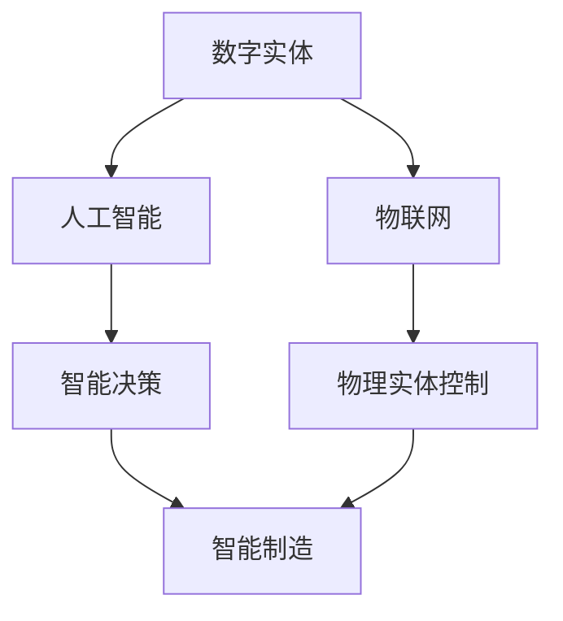

                 

关键词：数字实体、物理实体、自动化发展、人工智能、物联网、智能制造、数字化转型、实体融合。

> 摘要：本文将探讨数字实体与物理实体在自动化发展中的关系，分析人工智能、物联网和智能制造等技术如何推动这两者之间的融合，并展望未来的发展趋势与挑战。

## 1. 背景介绍

随着信息技术的飞速发展，数字世界与物理世界之间的界限逐渐模糊。数字实体（Digital Entity）指的是存在于数字环境中的虚拟对象或概念，如数据、应用程序、网络服务等。物理实体（Physical Entity）则是指我们日常生活中的有形物体，如设备、工具、设施等。这两者之间的关系越来越密切，它们之间的交互和融合正在改变我们的生产方式、生活方式以及经济结构。

自动化发展是现代科技发展的一个重要趋势，其核心在于通过技术手段减少人工干预，提高生产效率和精确度。在数字实体与物理实体的交汇处，自动化发展的重要性尤为突出。如何实现这两者的有机结合，成为了当前科技领域研究的热点。

## 2. 核心概念与联系

### 2.1 数字实体

数字实体是数字世界的基础元素，它们可以是数据、算法、软件组件等。数字实体的特点包括高度抽象、易于复制、快速传播和无限扩展。

### 2.2 物理实体

物理实体则是现实世界的物质载体，它们具有物理形态、空间位置和物理特性。物理实体的特点是具体、有限、有形和受限于物理规律。

### 2.3 人工智能

人工智能（AI）是使数字实体具备智能的关键技术。通过机器学习、深度学习等算法，AI可以模拟人类智能，进行感知、决策、学习等。

### 2.4 物联网

物联网（IoT）是连接物理实体的网络系统，通过传感器、通信模块等设备，物联网可以实现物理实体的数据采集、传输和控制。

### 2.5 智能制造

智能制造是将人工智能和物联网技术应用于生产制造过程，通过智能设备、智能工厂等，实现生产自动化、智能化。

### 2.6 数字实体与物理实体的融合

数字实体与物理实体的融合，即通过人工智能、物联网等技术的应用，使数字世界和现实世界相互影响、相互促进，实现更高效、更智能的生产和生活。以下是一个简化的 Mermaid 流程图，展示了数字实体与物理实体融合的基本过程：



## 3. 核心算法原理 & 具体操作步骤

### 3.1 算法原理概述

数字实体与物理实体的自动化发展，依赖于多种核心算法的支撑。这些算法包括机器学习算法、深度学习算法、优化算法等。以下是对这些算法原理的简要概述：

- **机器学习算法**：通过数据训练模型，使模型具备预测和分类能力。
- **深度学习算法**：基于多层神经网络，通过反向传播算法进行训练。
- **优化算法**：通过寻找最优解，优化系统性能。

### 3.2 算法步骤详解

1. **数据采集**：通过传感器等设备，采集物理实体的数据。
2. **数据预处理**：对采集到的数据进行清洗、转换等处理，使其适合训练模型。
3. **模型训练**：使用机器学习或深度学习算法，对预处理后的数据进行训练。
4. **模型评估**：使用验证数据集，评估模型的性能，并进行调整优化。
5. **模型部署**：将训练好的模型部署到物联网设备中，实现物理实体的智能控制。

### 3.3 算法优缺点

- **优点**：提高了生产效率，降低了人工成本，提升了产品的质量和安全性。
- **缺点**：算法模型的构建和训练需要大量的数据和时间，且在某些场景下，智能决策的结果可能并不完全符合预期。

### 3.4 算法应用领域

- **智能制造**：通过智能算法，实现生产过程的自动化、智能化。
- **智能交通**：利用智能算法，优化交通流量，提高交通效率。
- **智能家居**：通过智能算法，实现家庭设备的自动化控制，提升生活品质。

## 4. 数学模型和公式 & 详细讲解 & 举例说明

### 4.1 数学模型构建

在自动化发展中，数学模型起着关键作用。以下是一个简单的数学模型，用于描述物理实体和数字实体之间的交互关系：

\[ y = f(x) + v \]

其中，\( x \) 表示物理实体的状态，\( y \) 表示数字实体的状态，\( f(x) \) 表示智能算法对物理实体的预测或控制，\( v \) 表示噪声。

### 4.2 公式推导过程

\[ y = f(x) + v \]

假设物理实体 \( x \) 的状态满足以下方程：

\[ x = g(t) \]

其中，\( g(t) \) 是物理实体状态的时间函数。智能算法对物理实体的预测或控制 \( f(x) \) 可以表示为：

\[ f(x) = h(x) \]

其中，\( h(x) \) 是智能算法对物理实体状态的函数。噪声 \( v \) 是一个随机变量，表示系统的不确定性。

### 4.3 案例分析与讲解

假设我们有一个智能工厂，其中包含一个物理实体（如一条生产线）和数字实体（如生产数据管理系统）。我们可以使用上述数学模型来描述两者之间的交互关系。

1. **数据采集**：生产线上的传感器实时采集生产数据 \( x \)。
2. **数据预处理**：对采集到的数据进行预处理，得到 \( x \) 的标准化形式。
3. **模型训练**：使用机器学习算法，对预处理后的数据 \( x \) 进行训练，得到预测模型 \( f(x) \)。
4. **模型部署**：将训练好的模型部署到生产数据管理系统，实现对生产线的智能控制。
5. **运行结果**：生产数据管理系统根据预测模型 \( f(x) \) 和实际生产数据 \( x \)，调整生产计划，提高生产效率。

## 5. 项目实践：代码实例和详细解释说明

### 5.1 开发环境搭建

本文所涉及的代码示例将使用 Python 语言编写，运行环境为 Python 3.8 以上版本。首先，我们需要安装必要的库，如 TensorFlow、Keras 等。

```bash
pip install tensorflow
pip install keras
```

### 5.2 源代码详细实现

以下是一个简单的机器学习模型，用于预测生产线的状态。

```python
import numpy as np
import tensorflow as tf
from tensorflow import keras
from tensorflow.keras import layers

# 生成模拟数据
x_data = np.random.random((1000, 10))
y_data = np.random.random((1000, 1))

# 构建模型
model = keras.Sequential([
    layers.Dense(64, activation='relu', input_shape=(10,)),
    layers.Dense(64, activation='relu'),
    layers.Dense(1)
])

# 编译模型
model.compile(optimizer='adam',
              loss='mse',
              metrics=['mae'])

# 训练模型
model.fit(x_data, y_data, epochs=10)

# 预测
y_pred = model.predict(x_data)

# 打印预测结果
print(y_pred)
```

### 5.3 代码解读与分析

1. **数据生成**：首先，我们使用 `numpy` 生成模拟数据 `x_data` 和 `y_data`。
2. **模型构建**：使用 `keras.Sequential` 构建模型，其中包含两个 `Dense` 层，每层有 64 个神经元，使用 ReLU 激活函数。
3. **模型编译**：使用 `compile` 方法编译模型，指定优化器、损失函数和评价指标。
4. **模型训练**：使用 `fit` 方法训练模型，指定训练数据、训练轮次等。
5. **模型预测**：使用 `predict` 方法对训练数据进行预测。

### 5.4 运行结果展示

运行上述代码，我们可以得到预测结果 `y_pred`。通过分析预测结果，我们可以评估模型的性能，并进行优化。

## 6. 实际应用场景

数字实体与物理实体的自动化发展，已经在各个领域得到了广泛应用。以下是一些典型的应用场景：

- **智能制造**：通过智能算法，实现生产过程的自动化、智能化，提高生产效率。
- **智能交通**：利用智能算法，优化交通流量，提高交通效率，减少拥堵。
- **智能家居**：通过智能算法，实现家庭设备的自动化控制，提升生活品质。

## 7. 工具和资源推荐

### 7.1 学习资源推荐

- **《深度学习》**：Goodfellow, Bengio, Courville 著，是一本经典的深度学习入门教材。
- **《Python机器学习》**：Sebastian Raschka 著，适合初学者了解机器学习在 Python 中的应用。

### 7.2 开发工具推荐

- **TensorFlow**：Google 开发的开源机器学习框架，适合进行深度学习和机器学习项目。
- **Keras**：基于 TensorFlow 的简化和封装，提供了更易于使用的接口。

### 7.3 相关论文推荐

- **“Deep Learning on Physical Systems”**：论文探讨了深度学习在物理系统中的应用，对本文内容有很好的补充。

## 8. 总结：未来发展趋势与挑战

### 8.1 研究成果总结

数字实体与物理实体的自动化发展，已经成为当前科技领域的一个重要趋势。通过人工智能、物联网等技术的应用，我们实现了生产过程的自动化、智能化，提高了生产效率，降低了成本，改善了生活质量。

### 8.2 未来发展趋势

未来，随着技术的不断进步，数字实体与物理实体的融合将更加紧密。我们可能会看到更多基于人工智能和物联网的智能系统，如智能城市、智能医疗等。此外，量子计算、区块链等新兴技术，也将为数字实体与物理实体的自动化发展带来新的机遇。

### 8.3 面临的挑战

然而，数字实体与物理实体的自动化发展也面临着一些挑战。首先，数据安全和隐私保护问题越来越突出。随着数据量的增加，如何确保数据的安全和隐私，成为了一个亟待解决的问题。其次，智能系统的复杂性和不确定性，也给我们带来了新的挑战。如何设计出可靠、高效的智能系统，仍需要我们深入研究和探索。

### 8.4 研究展望

未来，我们需要进一步深化对数字实体与物理实体之间关系的研究，探索新的算法和技术，推动自动化发展的进程。同时，我们也要关注数据安全和隐私保护问题，确保技术的发展不会对人类社会带来负面影响。

## 9. 附录：常见问题与解答

### 9.1 什么是数字实体？

数字实体是指在数字环境中存在的虚拟对象或概念，如数据、应用程序、网络服务等。

### 9.2 物理实体与数字实体的关系是什么？

物理实体与数字实体之间存在着密切的联系。通过物联网、人工智能等技术，数字实体可以对物理实体进行监测、控制和管理，实现自动化发展。

### 9.3 如何实现数字实体与物理实体的融合？

实现数字实体与物理实体的融合，需要依赖于人工智能、物联网等技术的应用。通过构建智能系统，使数字实体具备对物理实体的感知、决策和控制能力，从而实现两者的有机结合。

作者：禅与计算机程序设计艺术 / Zen and the Art of Computer Programming
----------------------------------------------------------------

