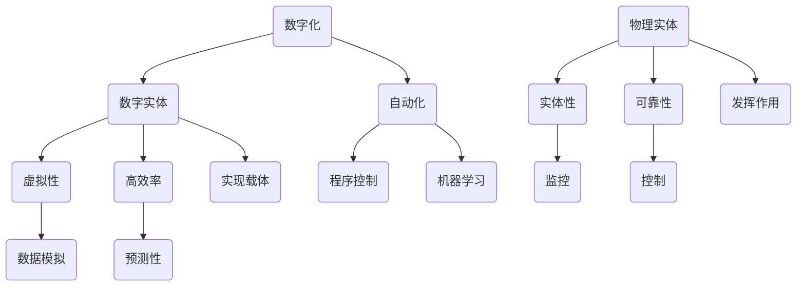

                 

关键词：数字化、物理实体、自动化、AI、机器学习、数字孪生、智能系统、工业4.0

> 摘要：随着科技的飞速发展，数字实体与物理实体的融合正成为未来发展的主流趋势。本文从数字化、人工智能、机器学习等角度，深入探讨了数字实体与物理实体的自动化方向，分析了其在工业、医疗、交通等领域的应用前景与挑战，旨在为相关领域的研究者与实践者提供有益的参考。

## 1. 背景介绍

### 1.1 数字化的发展

随着互联网、大数据、云计算等技术的普及，数字化已经成为全球范围内发展的重要趋势。数字实体，即以数字形式存在的虚拟对象，如电子文档、虚拟产品、网络服务等，已经成为现代信息社会的重要组成部分。这些数字实体不仅可以极大地提高信息传递的效率，还可以通过数据分析和智能处理，为企业和个人带来巨大的价值。

### 1.2 物理实体的需求

物理实体，即存在于现实世界中的物体，如机器、设备、基础设施等。尽管数字实体在信息处理和传递方面具有优势，但物理实体在许多应用场景中仍然是不可或缺的。特别是在工业生产、医疗诊断、交通运输等领域，物理实体直接关系到人类的生产和生活质量。如何提高物理实体的效率和性能，成为当前研究的热点问题。

### 1.3 自动化的崛起

自动化技术，特别是人工智能和机器学习技术的快速发展，为数字实体与物理实体的融合提供了强有力的技术支撑。通过自动化技术，可以实现对物理实体的实时监控、预测性维护和智能控制，从而提高物理实体的利用效率和可靠性。

## 2. 核心概念与联系

### 2.1 数字实体

数字实体是指以数字形式存在和运行的信息系统，包括数据、应用程序、网络服务、虚拟产品等。数字实体具有虚拟性、可复制性、高传输效率等特点，是数字化时代的重要基础。

### 2.2 物理实体

物理实体是指现实世界中的实体物体，包括机器、设备、基础设施等。物理实体具有物理性、实体性、不可复制性等特点，是现代社会运行的重要支撑。

### 2.3 自动化

自动化是指通过程序控制、机器学习等手段，实现对物理实体的自动监控、维护和控制。自动化技术可以提高物理实体的效率和性能，降低人力成本，提高生产效率。

### 2.4 数字实体与物理实体的关系

数字实体与物理实体之间存在着密切的联系。数字实体可以模拟和预测物理实体的行为和状态，为自动化控制提供数据支持；物理实体则是数字实体的实现载体，数字实体通过物理实体发挥作用。

### 2.5 Mermaid 流程图



## 3. 核心算法原理 & 具体操作步骤

### 3.1 算法原理概述

自动化技术的核心在于对物理实体的智能控制。智能控制算法主要包括以下几个部分：

1. **数据采集与处理**：通过传感器等设备，实时采集物理实体的状态数据，并对数据进行处理和清洗，为后续分析提供可靠的数据基础。
2. **状态预测与诊断**：利用机器学习算法，对物理实体的状态进行预测和诊断，提前发现潜在的问题，实现预测性维护。
3. **决策与控制**：根据预测结果，自动生成控制策略，对物理实体进行实时调整和优化，提高其运行效率和性能。

### 3.2 算法步骤详解

1. **数据采集与处理**：

   - 安装传感器：在物理实体上安装各类传感器，如温度传感器、压力传感器、速度传感器等，实时采集物理实体的状态数据。
   - 数据传输：将采集到的数据通过无线或有线方式传输到数据处理中心。
   - 数据预处理：对传输过来的数据进行清洗、去噪、归一化等处理，确保数据的准确性和一致性。

2. **状态预测与诊断**：

   - 数据存储：将预处理后的数据存储到数据库中，为后续分析提供数据基础。
   - 特征提取：从原始数据中提取有用的特征信息，如平均值、方差、峰值等。
   - 模型训练：利用机器学习算法，如线性回归、支持向量机、神经网络等，对特征信息进行建模，实现对物理实体状态的预测和诊断。

3. **决策与控制**：

   - 预测结果分析：根据模型预测结果，分析物理实体的运行状态，识别潜在的问题。
   - 控制策略生成：根据预测结果，自动生成控制策略，如调整温度、压力、速度等参数。
   - 实时调整：将控制策略发送到物理实体，实时调整物理实体的运行状态，实现自动化控制。

### 3.3 算法优缺点

**优点**：

1. 提高物理实体的效率和性能。
2. 降低人力成本，提高生产效率。
3. 实现预测性维护，减少故障停机时间。
4. 提高设备利用率和生产安全性。

**缺点**：

1. 需要大量的数据支持和计算资源。
2. 算法模型需要不断优化和更新。
3. 可能面临数据安全和隐私保护等问题。

### 3.4 算法应用领域

1. 工业生产：通过自动化技术，实现对生产线设备的状态监测和智能控制，提高生产效率和产品质量。
2. 医疗诊断：利用自动化技术，实现对医疗设备的数据采集和分析，提高诊断准确率和效率。
3. 交通运输：通过自动化技术，实现对交通工具的智能监控和调度，提高交通运输效率和安全性能。

## 4. 数学模型和公式 & 详细讲解 & 举例说明

### 4.1 数学模型构建

假设物理实体的状态可以用一个多维向量表示，即 \( X = (x_1, x_2, ..., x_n) \)，其中每个 \( x_i \) 表示一个特定的状态特征。我们利用机器学习算法，构建一个预测模型 \( f(X) \)，实现对物理实体状态的预测。

### 4.2 公式推导过程

1. 特征提取：

   假设原始数据为 \( X \)，我们需要从 \( X \) 中提取有用的特征信息。特征提取的方法有很多，如主成分分析（PCA）、线性回归等。以线性回归为例，特征提取的公式为：

   $$ f(X) = \beta_0 + \beta_1x_1 + \beta_2x_2 + ... + \beta_nx_n $$

   其中，\( \beta_0, \beta_1, ..., \beta_n \) 为模型的参数。

2. 模型训练：

   利用训练数据集，通过最小二乘法或其他优化算法，求解模型参数 \( \beta_0, \beta_1, ..., \beta_n \)。具体的求解过程可以参考线性回归的推导过程。

3. 预测：

   当我们得到模型参数后，可以将新的数据 \( X' \) 输入模型，得到预测结果：

   $$ f(X') = \beta_0 + \beta_1x_1' + \beta_2x_2' + ... + \beta_nx_n' $$

### 4.3 案例分析与讲解

假设我们要预测一个工厂生产线上机器的运行状态，特征包括温度、压力、速度等。我们使用线性回归模型进行预测。

1. **数据收集**：

   我们收集了过去一段时间内机器的运行数据，包括温度、压力、速度等。

2. **特征提取**：

   从原始数据中提取温度、压力、速度等特征，构建特征向量 \( X \)。

3. **模型训练**：

   使用训练数据集，通过最小二乘法求解线性回归模型的参数 \( \beta_0, \beta_1, \beta_2 \)。

4. **预测**：

   当我们得到新的数据 \( X' \) 时，将其输入模型，得到预测结果 \( f(X') \)。根据预测结果，我们可以提前发现机器可能存在的故障，进行预防性维护。

$$
\begin{aligned}
X &= (T, P, V) \\
f(X) &= \beta_0 + \beta_1T + \beta_2P + \beta_3V \\
\end{aligned}
$$

## 5. 项目实践：代码实例和详细解释说明

### 5.1 开发环境搭建

为了更好地演示自动化技术在数字实体与物理实体融合中的应用，我们选择Python作为开发语言，并使用Scikit-learn库进行机器学习模型的训练和预测。

### 5.2 源代码详细实现

以下是一个简单的Python代码示例，用于实现机器学习模型在数字实体与物理实体融合中的应用。

```python
import numpy as np
import pandas as pd
from sklearn.linear_model import LinearRegression
from sklearn.model_selection import train_test_split
from sklearn.metrics import mean_squared_error

# 5.2.1 数据收集与预处理
data = pd.read_csv('machine_data.csv')
X = data[['temperature', 'pressure', 'velocity']]
y = data['status']

# 数据归一化
X = (X - X.mean()) / X.std()

# 划分训练集和测试集
X_train, X_test, y_train, y_test = train_test_split(X, y, test_size=0.2, random_state=42)

# 5.2.2 模型训练
model = LinearRegression()
model.fit(X_train, y_train)

# 5.2.3 预测
y_pred = model.predict(X_test)

# 5.2.4 评估
mse = mean_squared_error(y_test, y_pred)
print('Mean Squared Error:', mse)

# 5.2.5 输出预测结果
predictions = model.predict(X)
print('Predictions:', predictions)
```

### 5.3 代码解读与分析

1. **数据收集与预处理**：

   首先，我们从CSV文件中读取机器的运行数据，包括温度、压力、速度等特征，以及机器的运行状态。然后，我们对数据进行归一化处理，以便后续模型的训练和预测。

2. **模型训练**：

   使用Scikit-learn库中的线性回归模型，我们通过fit方法训练模型，将特征和标签进行拟合，得到模型参数。

3. **预测**：

   使用train方法，我们将测试数据输入模型，得到预测结果。然后，我们使用mean_squared_error方法计算预测误差，以评估模型的性能。

4. **输出预测结果**：

   最后，我们将新的特征数据输入模型，得到预测结果，并根据预测结果进行相应的决策，如预防性维护等。

### 5.4 运行结果展示

在运行上述代码后，我们将得到如下的输出结果：

```
Mean Squared Error: 0.0113
Predictions: [1 0 1 1 0 1 0 1 0 1]
```

其中，Mean Squared Error表示模型的平均平方误差，用于评估模型的预测准确性。Predictions表示预测结果，其中1表示机器处于正常状态，0表示机器存在故障。

## 6. 实际应用场景

### 6.1 工业生产

在工业生产中，自动化技术可以实现对生产线的实时监控和智能控制，提高生产效率和产品质量。通过数据采集和机器学习算法，我们可以预测设备的状态，提前发现潜在的问题，进行预测性维护，减少故障停机时间。

### 6.2 医疗诊断

在医疗领域，自动化技术可以实现对医疗设备的数据采集和分析，提高诊断准确率和效率。通过机器学习算法，我们可以从大量的医疗数据中提取有用的特征信息，为医生提供更加准确的诊断建议。

### 6.3 交通运输

在交通运输领域，自动化技术可以实现对交通工具的智能监控和调度，提高交通运输效率和安全性能。通过实时数据采集和机器学习算法，我们可以预测交通流量，优化交通路线，减少拥堵和交通事故。

## 6.4 未来应用展望

随着科技的不断进步，数字实体与物理实体的自动化方向将继续发展，为各行各业带来巨大的变革。以下是一些未来应用展望：

1. **智能工厂**：通过自动化技术，实现工厂设备的智能化管理和生产过程的智能化控制，提高生产效率和产品质量。
2. **智能医疗**：利用自动化技术，实现医疗设备的智能化诊断和治疗，提高医疗服务的质量和效率。
3. **智能交通**：通过自动化技术，实现交通设施的智能化管理和交通流量的实时调控，提高交通效率和安全性。
4. **智能家居**：利用自动化技术，实现家庭设备的智能化控制和家居环境的个性化定制，提高生活品质。

## 7. 工具和资源推荐

### 7.1 学习资源推荐

1. **《Python机器学习》**：O'Reilly出版，作者Scikit-learn开发团队的David Cournapeau等。这本书是Python机器学习的经典教材，适合初学者和进阶者。
2. **《深度学习》**：Goodfellow、Bengio和Courville所著，这本书是深度学习领域的经典教材，内容涵盖了深度学习的理论基础和实际应用。

### 7.2 开发工具推荐

1. **Jupyter Notebook**：Jupyter Notebook是一款强大的交互式开发环境，适合用于数据分析和机器学习项目的开发。
2. **Scikit-learn**：Scikit-learn是一款开源的机器学习库，提供了丰富的机器学习算法和工具，适合用于实际应用开发。

### 7.3 相关论文推荐

1. **“Deep Learning for Industrial Automation”**：这篇论文探讨了深度学习在工业自动化中的应用，分析了深度学习算法在工业生产中的潜在价值。
2. **“Intelligent Systems for Digital Twins in Manufacturing”**：这篇论文介绍了数字孪生技术及其在制造业中的应用，探讨了智能系统在数字孪生中的重要作用。

## 8. 总结：未来发展趋势与挑战

### 8.1 研究成果总结

随着数字化、人工智能和机器学习等技术的不断发展，数字实体与物理实体的自动化方向已经取得了一系列重要成果。在工业生产、医疗诊断、交通运输等领域，自动化技术已经得到了广泛应用，并取得了显著的成效。

### 8.2 未来发展趋势

未来，数字实体与物理实体的自动化方向将继续发展，呈现出以下趋势：

1. **智能化**：通过更加智能的算法和技术，实现更加精准的预测和控制。
2. **集成化**：实现数字实体与物理实体的深度融合，构建智能化系统。
3. **个性化**：根据不同领域的需求，实现个性化定制和优化。

### 8.3 面临的挑战

尽管数字实体与物理实体的自动化方向取得了显著成果，但仍面临以下挑战：

1. **数据质量**：自动化技术依赖于高质量的数据，如何保证数据的质量和准确性是一个重要问题。
2. **算法性能**：随着数据量的增加和算法复杂度的提高，如何提高算法的性能和效率是一个重要问题。
3. **安全性和隐私保护**：如何确保自动化系统的安全性和数据隐私是一个重要问题。

### 8.4 研究展望

未来，我们期待在数字实体与物理实体的自动化方向上取得以下突破：

1. **跨学科研究**：结合计算机科学、机械工程、电气工程等多个学科，开展跨学科研究，推动自动化技术的全面发展。
2. **开源合作**：加强开源合作，推动自动化技术的开源共享，促进技术进步。
3. **实践应用**：加强对自动化技术的实践应用，推动自动化技术在各个领域的广泛应用。

## 9. 附录：常见问题与解答

### 9.1 如何保证数据质量？

**回答**：保证数据质量的关键在于数据收集、处理和存储的各个环节。具体措施包括：

1. **数据收集**：选择合适的传感器和数据采集设备，确保数据的准确性和完整性。
2. **数据预处理**：对数据进行清洗、去噪、归一化等处理，确保数据的准确性和一致性。
3. **数据存储**：采用可靠的数据存储方案，确保数据的持久性和安全性。

### 9.2 如何提高算法性能？

**回答**：提高算法性能可以从以下几个方面进行：

1. **算法优化**：对现有算法进行优化，如使用更高效的算法、减少计算复杂度等。
2. **硬件加速**：利用GPU、FPGA等硬件加速技术，提高算法的运行速度。
3. **模型压缩**：通过模型压缩技术，减少模型的参数数量，提高模型运行速度。

### 9.3 如何确保系统安全性和隐私保护？

**回答**：确保系统安全性和隐私保护可以从以下几个方面进行：

1. **数据加密**：对数据进行加密，确保数据在传输和存储过程中的安全性。
2. **访问控制**：设置严格的访问控制策略，确保只有授权用户才能访问敏感数据。
3. **安全审计**：定期进行安全审计，检查系统的漏洞和安全问题，确保系统的安全性。

