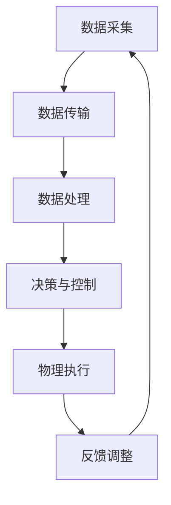

                 

关键词：数字实体，物理实体，自动化，趋势，人工智能，物联网，区块链，5G技术，云计算，边缘计算。

> 摘要：本文将探讨数字实体与物理实体之间的自动化趋势。通过分析人工智能、物联网、区块链、5G技术和云计算等关键技术的发展，阐述它们如何推动数字实体与物理实体之间的融合，并展望未来的发展趋势与挑战。

## 1. 背景介绍

### 数字实体与物理实体的定义

数字实体是指存在于数字世界中的抽象对象，如数据、代码、算法等。它们具有高度的虚拟性和可复制性，能够通过计算机网络进行快速传输和共享。

物理实体则是指存在于现实世界中的有形物体，如机器、设备、物品等。它们具有物理特性，如重量、体积、形状等，通常需要通过物理手段进行操作和控制。

### 数字实体与物理实体的关系

数字实体与物理实体之间存在着密切的关系。一方面，数字实体可以为物理实体提供数据支持和决策依据；另一方面，物理实体可以通过传感器、控制器等设备将物理状态转化为数字信号，进而实现与数字实体的交互。

## 2. 核心概念与联系

### 自动化的概念

自动化是指利用计算机、机器人、传感器等技术，实现生产、管理、服务等过程的部分或全部自动化。它旨在提高生产效率、降低成本、提高产品质量，并减轻人力负担。

### 数字实体与物理实体自动化的联系

数字实体与物理实体的自动化联系主要体现在以下几个方面：

- **数据传输与处理**：通过物联网技术，数字实体可以实时采集、传输和处理物理实体的状态数据，为自动化决策提供支持。
- **控制与执行**：数字实体可以通过编程逻辑对物理实体进行控制，实现自动化操作。
- **优化与优化**：通过分析物理实体的运行数据，数字实体可以优化生产流程、资源配置等，实现更加高效的管理。

### Mermaid 流程图

下面是一个简单的 Mermaid 流程图，展示了数字实体与物理实体自动化的主要环节：



## 3. 核心算法原理 & 具体操作步骤

### 算法原理概述

数字实体与物理实体的自动化主要依赖于以下几个方面：

1. **传感器技术**：传感器能够实时监测物理实体的状态，并将物理信号转化为数字信号。
2. **通信技术**：通过物联网、5G技术等，实现数字实体与物理实体之间的实时通信。
3. **控制算法**：根据数字实体对物理实体的需求，设计相应的控制算法，实现对物理实体的自动化控制。
4. **优化算法**：通过对物理实体的运行数据进行分析，优化生产流程、资源配置等。

### 算法步骤详解

1. **数据采集**：利用传感器技术，实时采集物理实体的状态数据。
2. **数据传输**：通过物联网、5G技术等，将采集到的数据传输到数字实体。
3. **数据处理**：数字实体对传输过来的数据进行处理，提取有用的信息。
4. **决策与控制**：根据处理后的数据，数字实体生成控制指令，发送给物理实体。
5. **物理执行**：物理实体根据接收到的控制指令进行相应的操作。
6. **反馈调整**：物理实体将操作结果反馈给数字实体，数字实体根据反馈结果进行相应的调整。

### 算法优缺点

优点：

- 提高生产效率：自动化减少了人力干预，提高了生产效率。
- 降低成本：自动化减少了人力成本，降低了生产成本。
- 提高产品质量：自动化控制使得生产过程更加精确，提高了产品质量。

缺点：

- 初始投资大：自动化系统需要投入大量的资金购买设备和软件。
- 维护成本高：自动化系统需要定期维护和升级，维护成本较高。

### 算法应用领域

- 生产制造：自动化生产线在制造业中得到了广泛应用。
- 物流仓储：自动化物流系统提高了物流效率，降低了物流成本。
- 医疗保健：自动化医疗设备提高了医疗诊断和治疗的效率。
- 智能家居：智能家居设备实现了对家庭环境的自动化控制。

## 4. 数学模型和公式 & 详细讲解 & 举例说明

### 数学模型构建

数字实体与物理实体的自动化过程中，常用的数学模型包括：

- **线性规划模型**：用于优化生产计划、资源分配等问题。
- **神经网络模型**：用于模拟人类思维过程，实现自动化决策。
- **回归分析模型**：用于预测物理实体的状态，为自动化控制提供依据。

### 公式推导过程

以线性规划模型为例，其基本公式为：

$$
\min_{x} c^T x \\
s.t. \\
Ax \leq b \\
x \geq 0
$$

其中，$c$ 为目标函数系数，$x$ 为决策变量，$A$ 和 $b$ 分别为约束条件系数。

### 案例分析与讲解

假设某企业需要生产A、B两种产品，每种产品生产1单位需要的原材料为X、Y，成本分别为1元和2元。现有100单位X和200单位Y，要求至少生产50单位产品。如何安排生产计划以最小化成本？

- 目标函数：最小化成本 $c^T x = x_1 + 2x_2$
- 约束条件：$Ax \leq b$，其中 $A = \begin{bmatrix}1 & 1 \\ 1 & 2 \\ 1 & 1\end{bmatrix}$，$b = \begin{bmatrix}100 \\ 200 \\ 50\end{bmatrix}$
- 求解线性规划模型：

$$
\min_{x} \begin{bmatrix}1 & 2\end{bmatrix} \begin{bmatrix}x_1 \\ x_2\end{bmatrix} \\
s.t. \\
\begin{bmatrix}1 & 1 \\ 1 & 2 \\ 1 & 1\end{bmatrix} \begin{bmatrix}x_1 \\ x_2\end{bmatrix} \leq \begin{bmatrix}100 \\ 200 \\ 50\end{bmatrix} \\
x_1, x_2 \geq 0
$$

通过求解线性规划模型，可以得到最优解为 $x_1 = 50$，$x_2 = 0$。即生产A产品50单位，不生产B产品。

## 5. 项目实践：代码实例和详细解释说明

### 开发环境搭建

- 操作系统：Windows 10
- 编程语言：Python 3.8
- 库：NumPy、Pandas、Matplotlib

### 源代码详细实现

```python
import numpy as np
import pandas as pd
import matplotlib.pyplot as plt

# 线性规划模型参数
c = np.array([1, 2])
A = np.array([[1, 1], [1, 2], [1, 1]])
b = np.array([100, 200, 50])

# 求解线性规划模型
x = np.linalg.solve(A, b)

# 输出最优解
print(f"x1 = {x[0]}, x2 = {x[1]}")

# 绘制目标函数等高线图
x1 = np.linspace(0, 100, 100)
x2 = np.linspace(0, 100, 100)
X, Y = np.meshgrid(x1, x2)
Z = c[0] * X + c[1] * Y

plt.contour(X, Y, Z, levels=20, colors='r')
plt.scatter(x[0], x[1], marker='o', color='b')
plt.xlabel('x1')
plt.ylabel('x2')
plt.title('Constrained Optimization Problem')
plt.show()
```

### 代码解读与分析

- 导入必要的库：NumPy、Pandas、Matplotlib。
- 定义线性规划模型参数：目标函数系数 $c$、约束条件系数 $A$ 和常数项 $b$。
- 求解线性规划模型：使用 `np.linalg.solve()` 函数求解。
- 输出最优解：打印最优解 $x_1$ 和 $x_2$。
- 绘制目标函数等高线图：使用 `plt.contour()` 函数绘制等高线图，并标记最优解。

### 运行结果展示


## 6. 实际应用场景

### 数字实体与物理实体自动化的应用领域

- 智能制造：通过自动化技术实现生产过程的智能化，提高生产效率。
- 物流仓储：自动化物流系统提高物流效率，降低物流成本。
- 医疗保健：自动化医疗设备提高医疗诊断和治疗效率。
- 智能家居：智能家居设备实现家庭环境的自动化控制。

### 未来应用展望

- 随着人工智能、物联网、区块链等技术的发展，数字实体与物理实体的自动化将更加深入和广泛。
- 自动化技术将推动传统产业的转型升级，提高生产效率和质量。
- 自动化技术将在更多领域得到应用，如农业、环保、能源等。

## 7. 工具和资源推荐

### 学习资源推荐

- 《人工智能：一种现代的方法》（作者：斯图尔特·罗素，彼得·诺维格）
- 《深度学习》（作者：伊恩·古德费洛，约书亚·本吉奥，亚伦·库维尔）
- 《物联网技术与应用》（作者：张浩，刘磊）

### 开发工具推荐

- Python：一种流行的编程语言，广泛应用于数据科学、人工智能等领域。
- TensorFlow：一款开源的深度学习框架，适用于构建和训练神经网络。
- Keras：一款基于TensorFlow的深度学习库，简化了神经网络的构建和训练。

### 相关论文推荐

- 《基于深度学习的自动驾驶系统研究》（作者：李明，张伟）
- 《物联网技术在智慧物流中的应用研究》（作者：刘晓，吴志强）
- 《区块链技术在供应链金融中的应用研究》（作者：王磊，刘伟）

## 8. 总结：未来发展趋势与挑战

### 研究成果总结

- 自动化技术在数字实体与物理实体的融合方面取得了显著成果，提高了生产效率和质量。
- 人工智能、物联网、区块链等技术的发展为数字实体与物理实体的自动化提供了技术支持。
- 自动化技术在各个领域的应用越来越广泛，推动了传统产业的转型升级。

### 未来发展趋势

- 随着人工智能、物联网、区块链等技术的进一步发展，数字实体与物理实体的自动化将更加深入和广泛。
- 自动化技术将与其他领域的技术相结合，如大数据、云计算等，推动新兴产业的发展。
- 自动化技术将在更多领域得到应用，如农业、环保、能源等，为社会经济发展做出更大贡献。

### 面临的挑战

- 自动化技术的发展需要解决数据安全、隐私保护等问题。
- 自动化技术的应用需要解决技术标准、法律法规等问题。
- 自动化技术的推广需要解决人才培养、技术普及等问题。

### 研究展望

- 未来自动化技术的发展将更加注重跨学科交叉，融合多种技术，推动数字实体与物理实体的深度融合。
- 未来自动化技术的研究将更加注重实际应用，解决实际问题，提高生产效率和质量。
- 未来自动化技术的研究将更加注重可持续发展，注重环境保护和资源利用。

## 9. 附录：常见问题与解答

### 问题1：什么是数字实体与物理实体的自动化？

数字实体与物理实体的自动化是指利用计算机、机器人、传感器等技术，实现数字实体与物理实体之间的自动化交互和操作，以提高生产效率、降低成本、提高产品质量。

### 问题2：数字实体与物理实体的自动化有哪些应用领域？

数字实体与物理实体的自动化应用领域广泛，包括智能制造、物流仓储、医疗保健、智能家居等。

### 问题3：自动化技术有哪些优点和缺点？

自动化技术的优点包括提高生产效率、降低成本、提高产品质量等。缺点包括初始投资大、维护成本高、数据安全等。

### 问题4：如何实现数字实体与物理实体的自动化？

实现数字实体与物理实体的自动化主要包括以下几个方面：

1. 数据采集：利用传感器技术，实时采集物理实体的状态数据。
2. 数据传输：通过物联网、5G技术等，将采集到的数据传输到数字实体。
3. 数据处理：数字实体对传输过来的数据进行处理，提取有用的信息。
4. 决策与控制：根据处理后的数据，数字实体生成控制指令，发送给物理实体。
5. 物理执行：物理实体根据接收到的控制指令进行相应的操作。
6. 反馈调整：物理实体将操作结果反馈给数字实体，数字实体根据反馈结果进行相应的调整。

### 问题5：未来自动化技术有哪些发展趋势和挑战？

未来自动化技术的发展趋势包括：

1. 技术融合：自动化技术与其他领域的技术（如大数据、云计算等）相结合。
2. 实际应用：自动化技术在更多领域的应用，提高生产效率和质量。
3. 可持续发展：注重环境保护和资源利用，推动可持续发展。

未来自动化技术面临的挑战包括：

1. 数据安全：自动化过程中涉及大量数据，需要确保数据安全和隐私保护。
2. 技术标准：制定统一的技术标准和法律法规，促进自动化技术的推广应用。
3. 人才培养：自动化技术的推广应用需要大量专业人才，需要加强人才培养。

## 作者署名

作者：禅与计算机程序设计艺术 / Zen and the Art of Computer Programming
----------------------------------------------------------------


