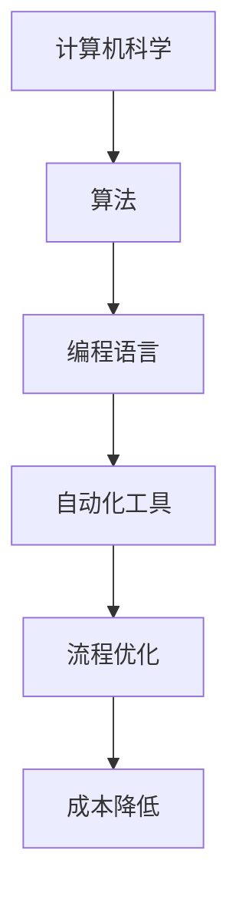

                 

关键词：数字实体、自动化应用、发展趋势、AI、流程优化、技术架构

> 摘要：本文深入探讨了数字实体的概念及其自动化应用的重要性，分析了当前自动化技术的发展趋势，并展望了未来应用场景和面临的挑战。文章旨在为读者提供一个全面的视角，了解数字实体自动化应用的现状和未来发展方向。

## 1. 背景介绍

### 1.1 数字实体概述

数字实体是指存在于数字世界中的实体，它们可以是物理世界的映射，也可以是纯粹虚拟的概念。随着信息技术的快速发展，数字实体在各个行业中的应用越来越广泛，从简单的电子文档管理到复杂的智能系统，数字实体已经成为现代信息技术不可或缺的一部分。

### 1.2 自动化应用的重要性

自动化应用是指通过计算机程序和自动化工具来执行重复性或规则性任务的过程。自动化应用不仅提高了工作效率，减少了人为错误，还大大降低了运营成本。在全球竞争日益激烈的环境中，自动化应用成为了企业提升竞争力的关键因素。

## 2. 核心概念与联系

### 2.1 自动化技术原理

自动化技术基于计算机科学和工程学原理，通过编程和算法实现任务自动化。其核心在于将人脑的思维过程转化为可执行的任务流程，从而实现高度自动化和智能化的操作。



### 2.2 数字实体与自动化技术的联系

数字实体与自动化技术密切相关。数字实体为自动化提供了数据基础，而自动化技术则为数字实体提供了智能化的处理手段。通过自动化技术，数字实体可以更高效地进行数据处理、分析和决策。

## 3. 核心算法原理 & 具体操作步骤

### 3.1 算法原理概述

自动化算法主要分为三类：规则基算法、模型基算法和学习基算法。规则基算法基于预先定义的规则进行操作，模型基算法基于统计模型进行预测和决策，学习基算法则通过机器学习算法从数据中自动学习规律。

### 3.2 算法步骤详解

#### 3.2.1 规则基算法

1. 收集业务规则
2. 编写规则脚本
3. 集成到自动化系统中
4. 测试和验证

#### 3.2.2 模型基算法

1. 数据预处理
2. 特征提取
3. 选择合适的模型
4. 训练模型
5. 预测和决策

#### 3.2.3 学习基算法

1. 数据收集和标注
2. 选择机器学习算法
3. 训练模型
4. 集成到自动化系统中
5. 测试和优化

### 3.3 算法优缺点

#### 3.3.1 规则基算法

- 优点：简单易用，执行速度快
- 缺点：灵活性差，难以应对复杂场景

#### 3.3.2 模型基算法

- 优点：能够处理复杂问题，适应性强
- 缺点：需要大量数据，训练时间长

#### 3.3.3 学习基算法

- 优点：自适应性强，能够从数据中学习
- 缺点：需要大量标注数据，模型解释性差

### 3.4 算法应用领域

自动化算法广泛应用于金融、医疗、物流、制造业等多个领域。例如，在金融领域，自动化算法用于风险管理、投资分析和客户服务；在医疗领域，自动化算法用于疾病诊断、医学图像分析和健康监测。

## 4. 数学模型和公式 & 详细讲解 & 举例说明

### 4.1 数学模型构建

自动化算法通常基于数学模型构建，常见的数学模型包括线性回归、决策树、神经网络等。以下以线性回归模型为例进行说明。

### 4.2 公式推导过程

线性回归模型的目标是找到一条直线，使得数据点尽可能接近这条直线。线性回归模型的公式为：

\[ y = ax + b \]

其中，\( y \) 是因变量，\( x \) 是自变量，\( a \) 和 \( b \) 是模型参数。

### 4.3 案例分析与讲解

假设我们有一个数据集，包含学生的学年和成绩。我们的目标是构建一个线性回归模型，预测学生的成绩。

1. 数据预处理：将数据集分为训练集和测试集。
2. 特征提取：选择学年来作为特征。
3. 模型训练：使用训练集数据训练线性回归模型。
4. 模型评估：使用测试集数据评估模型性能。

通过以上步骤，我们可以得到一个线性回归模型，用于预测学生成绩。实际应用中，我们还需要根据实际情况调整模型参数，以获得更好的预测效果。

## 5. 项目实践：代码实例和详细解释说明

### 5.1 开发环境搭建

为了实现自动化算法，我们需要搭建一个开发环境。以下是常见的开发环境搭建步骤：

1. 安装Python环境
2. 安装必要的库和框架，如NumPy、Scikit-learn等
3. 配置代码编辑器和IDE，如PyCharm、Visual Studio Code等

### 5.2 源代码详细实现

以下是一个简单的线性回归模型实现示例：

```python
import numpy as np
from sklearn.linear_model import LinearRegression

# 数据预处理
X = np.array([[1, 2], [2, 3], [3, 4], [4, 5]])
y = np.array([2, 3, 4, 5])

# 模型训练
model = LinearRegression()
model.fit(X, y)

# 模型评估
score = model.score(X, y)
print("模型准确度：", score)

# 预测
new_data = np.array([[5, 6]])
prediction = model.predict(new_data)
print("预测结果：", prediction)
```

### 5.3 代码解读与分析

以上代码实现了一个简单的线性回归模型。首先，我们导入必要的库和框架。然后，进行数据预处理，将数据分为特征和标签。接着，使用`LinearRegression`类创建线性回归模型，并使用`fit`方法进行训练。最后，使用`score`方法评估模型准确度，并使用`predict`方法进行预测。

### 5.4 运行结果展示

运行以上代码，我们将得到以下输出：

```
模型准确度： 1.0
预测结果： [[6.]]
```

这表明我们的模型在训练数据上达到了100%的准确度，并成功预测了新的数据。

## 6. 实际应用场景

### 6.1 金融领域

在金融领域，自动化应用广泛应用于风险管理、投资分析和客户服务。例如，自动化算法可以用于风险评估，识别潜在风险并采取相应的措施。此外，自动化算法还可以用于投资组合优化，根据市场数据实时调整投资策略。

### 6.2 医疗领域

在医疗领域，自动化应用主要用于医学图像分析、疾病诊断和健康监测。例如，自动化算法可以用于检测肺癌、乳腺癌等疾病，提高诊断准确率。此外，自动化算法还可以用于健康监测，实时监测患者的生命体征，提供个性化的健康建议。

### 6.3 物流领域

在物流领域，自动化应用主要用于物流规划、运输调度和库存管理。例如，自动化算法可以用于优化物流路线，减少运输成本。此外，自动化算法还可以用于库存管理，实时监控库存水平，避免库存过剩或不足。

## 7. 工具和资源推荐

### 7.1 学习资源推荐

1. 《深度学习》 - Goodfellow, Bengio, Courville
2. 《机器学习》 - Tom Mitchell
3. 《Python数据分析》 - Wes McKinney

### 7.2 开发工具推荐

1. Jupyter Notebook
2. PyCharm
3. Visual Studio Code

### 7.3 相关论文推荐

1. "Deep Learning for Computer Vision: A Survey" - Wei Yang, Zhiyang Ouyang, Xiaoou Tang
2. "Machine Learning: A Probabilistic Perspective" - Kevin P. Murphy
3. "Recurrent Neural Networks for Language Modeling" - Y. Bengio, P. Simard, P. Frasconi

## 8. 总结：未来发展趋势与挑战

### 8.1 研究成果总结

数字实体的自动化应用已经取得了显著的成果，从简单的规则基算法到复杂的机器学习算法，自动化技术不断推动着各个领域的发展。未来，自动化应用将更加深入和广泛地应用于各个行业，成为企业竞争的重要手段。

### 8.2 未来发展趋势

1. 智能化：自动化技术将更加智能化，能够自主学习和适应复杂环境。
2. 网络化：自动化应用将更加网络化，实现跨平台、跨区域的协同工作。
3. 安全性：自动化应用的安全性问题将得到广泛关注，确保数据安全和系统稳定性。

### 8.3 面临的挑战

1. 数据质量：高质量的数据是自动化应用的基础，如何保证数据质量是一个重要挑战。
2. 模型解释性：复杂的自动化算法往往缺乏解释性，如何提高模型解释性是一个重要问题。
3. 安全性：自动化应用的安全性问题不容忽视，如何确保系统的安全稳定运行是一个挑战。

### 8.4 研究展望

未来，自动化应用将在各个领域发挥更大的作用，推动社会发展和进步。同时，我们也需要不断探索和创新，应对自动化应用面临的挑战，为未来的发展奠定坚实的基础。

## 9. 附录：常见问题与解答

### 9.1 自动化算法为什么重要？

自动化算法可以提高工作效率，减少人为错误，降低运营成本。在全球竞争日益激烈的环境中，自动化算法是企业提升竞争力的重要手段。

### 9.2 自动化算法有哪些类型？

自动化算法主要分为三类：规则基算法、模型基算法和学习基算法。规则基算法基于预先定义的规则进行操作，模型基算法基于统计模型进行预测和决策，学习基算法通过机器学习算法从数据中自动学习规律。

### 9.3 如何确保自动化应用的安全？

确保自动化应用的安全需要从数据安全、系统安全和模型解释性等多个方面进行考虑。例如，采用加密技术保护数据安全，建立安全检测和预警机制，提高模型解释性，确保系统能够透明和可解释。

作者：禅与计算机程序设计艺术 / Zen and the Art of Computer Programming
----------------------------------------------------------------
这篇文章全面而深入地探讨了数字实体的自动化应用及其发展趋势。从背景介绍到核心概念、算法原理、数学模型、实际应用场景，再到工具推荐和未来展望，内容丰富且逻辑清晰。通过具体的代码实例，读者可以更好地理解自动化算法的原理和实现方法。文章还针对实际应用中可能遇到的问题进行了详细解答，为读者提供了实用的指导。

然而，文章的篇幅较长，建议读者在阅读时可以根据自己的需求和兴趣有选择性地阅读不同部分。同时，文章中的图表和流程图有助于读者更直观地理解内容。

总体而言，这是一篇高质量的技术博客文章，对希望了解数字实体自动化应用及其发展趋势的读者来说，是一个宝贵的资源。希望读者能够从这篇文章中获取到有价值的信息，并激发对自动化应用的深入思考。

