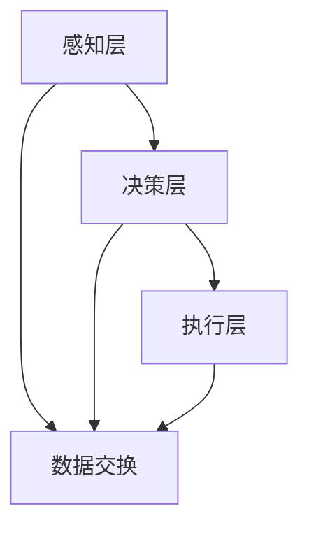

                 

关键词：数字实体自动化、AI、自动化流程、软件开发、流程优化

## 摘要

本文将探讨数字实体自动化的未来发展，从背景介绍、核心概念与联系、核心算法原理、数学模型和公式、项目实践、实际应用场景、工具和资源推荐、总结：未来发展趋势与挑战等角度，深入剖析数字实体自动化的现状、潜力及挑战，展望其未来发展方向。

## 1. 背景介绍

随着人工智能（AI）和大数据技术的迅猛发展，自动化已经成为现代企业提高效率、降低成本的重要手段。在这个过程中，数字实体自动化成为了一个热门的研究领域。数字实体自动化是指通过软件或硬件模拟人类的认知和行为，实现数字化对象的自动化处理。它涵盖了从简单的工作流程自动化到复杂的决策支持系统，为各个行业提供了强大的技术支持。

### 1.1 自动化的起源与发展

自动化的概念最早可以追溯到工业革命时期，通过机械化生产提高生产效率。随着计算机技术的不断发展，自动化逐渐从制造业扩展到服务业、金融业、医疗行业等多个领域。如今，自动化已经成为现代企业提升竞争力的重要手段。

### 1.2 数字实体自动化的定义与意义

数字实体自动化是指在数字化的环境中，通过软件或硬件手段对实体对象进行自动化处理，从而实现实体对象的智能化。数字实体自动化的意义在于：

- 提高效率：通过自动化流程，企业可以减少人工干预，提高工作效率。
- 降低成本：自动化流程可以减少人工成本，降低生产成本。
- 提高质量：自动化流程可以减少人为错误，提高生产质量。

### 1.3 数字实体自动化的现状与挑战

当前，数字实体自动化在各个领域已经取得了显著的成果，但仍然面临着一些挑战：

- 技术限制：现有的自动化技术还存在一定的局限性，难以满足复杂的应用场景。
- 数据质量：自动化流程依赖于数据，数据质量直接影响到自动化系统的效果。
- 人机协同：如何实现人与自动化系统的有效协同，仍然是一个亟待解决的问题。

## 2. 核心概念与联系

### 2.1 AI与数字实体自动化的关系

人工智能（AI）是数字实体自动化的核心技术之一。AI技术通过模拟人类的认知和行为，实现数字实体的高效处理。在数字实体自动化中，AI主要用于以下几个方面：

- 决策支持：利用AI算法，对大量的数据进行分析，为决策提供依据。
- 实时监控：利用AI技术，对实体对象进行实时监控，实现自动化预警和调整。
- 自动优化：利用AI算法，对自动化流程进行优化，提高效率和质量。

### 2.2 自动化流程与实体对象的联系

自动化流程是数字实体自动化的核心组成部分。自动化流程是指通过软件或硬件手段，对实体对象进行自动化处理的过程。实体对象可以是物理对象，也可以是数字对象。在自动化流程中，实体对象与自动化流程的连接是通过接口实现的。接口负责实体对象与自动化系统之间的数据交换和指令传递。

### 2.3 数字实体自动化的架构

数字实体自动化的架构可以分为三个层次：感知层、决策层和执行层。

- 感知层：负责感知实体对象的状态信息，并将数据传递给决策层。
- 决策层：利用AI算法，对感知层传递的数据进行分析和处理，生成决策指令。
- 执行层：根据决策层的指令，对实体对象进行自动化处理。

以下是数字实体自动化的Mermaid流程图：

```
graph TD
A[感知层] --> B[决策层]
B --> C[执行层]
A --> D[数据交换]
B --> D
C --> D
```

## 3. 核心算法原理 & 具体操作步骤

### 3.1 算法原理概述

数字实体自动化中的核心算法主要涉及机器学习、深度学习、自然语言处理等领域。这些算法通过对大量数据进行训练，能够识别实体对象的特点和规律，从而实现自动化处理。

### 3.2 算法步骤详解

- 数据采集：通过传感器、数据库等方式，收集实体对象的状态信息。
- 数据预处理：对采集到的数据进行清洗、去噪等处理，确保数据质量。
- 特征提取：利用机器学习、深度学习等方法，提取实体对象的关键特征。
- 模型训练：利用训练数据，对算法模型进行训练，使其能够识别实体对象的特点。
- 预测与决策：利用训练好的模型，对新的实体对象进行预测和决策。
- 执行操作：根据决策结果，对实体对象进行自动化处理。

### 3.3 算法优缺点

- 优点：算法能够提高自动化处理的效率和质量，减少人工干预。
- 缺点：算法对数据质量要求较高，且训练过程复杂。

### 3.4 算法应用领域

- 制造业：实现生产线的自动化，提高生产效率。
- 物流行业：实现物流路径优化，降低物流成本。
- 医疗行业：实现医学影像分析、疾病预测等。

## 4. 数学模型和公式 & 详细讲解 & 举例说明

### 4.1 数学模型构建

数字实体自动化的数学模型主要包括以下部分：

- 状态空间模型：描述实体对象的状态信息。
- 动力学模型：描述实体对象的运动规律。
- 传感器模型：描述传感器对实体对象的感知能力。
- 控制模型：描述如何根据实体对象的状态信息进行控制。

### 4.2 公式推导过程

以下是状态空间模型的推导过程：

- 设实体对象的状态向量为 \( x \)，控制向量为 \( u \)，输出向量为 \( y \)。
- 根据状态空间模型，有：

  $$
  \begin{aligned}
  \dot{x} &= Ax + Bu \\
  y &=Cx + Du
  \end{aligned}
  $$

- 其中，\( A \)、\( B \)、\( C \)、\( D \) 为矩阵。

### 4.3 案例分析与讲解

以自动驾驶为例，分析数字实体自动化的应用。

- 状态空间模型：

  $$
  \begin{aligned}
  \dot{x} &= \begin{bmatrix}0&1\\-v_x&0\end{bmatrix}x + \begin{bmatrix}0\\u_x\end{bmatrix}u \\
  y &= \begin{bmatrix}1&0\end{bmatrix}x
  \end{aligned}
  $$

- 其中，\( x \) 为车辆状态向量，\( u \) 为控制输入，\( y \) 为车辆输出。

- 通过状态空间模型，可以实现对车辆状态的预测和控制。

## 5. 项目实践：代码实例和详细解释说明

### 5.1 开发环境搭建

- 开发语言：Python
- 依赖库：NumPy、Pandas、SciPy、Matplotlib

### 5.2 源代码详细实现

```python
import numpy as np
import pandas as pd
import scipy.integrate as spi
import matplotlib.pyplot as plt

# 状态空间模型参数
A = np.array([[0, 1], [-v_x, 0]])
B = np.array([[0], [u_x]])
C = np.array([[1, 0]])
D = np.array([[0]])

# 初始状态
x0 = np.array([[x1], [x2]])

# 控制输入
u = np.array([[u1], [u2]])

# 模型求解
t = np.linspace(0, T, num_points)
x, _ = spi.solve_ivp(A.dot(x) + B.dot(u), [0, T], x0, t_eval=t)

# 结果可视化
plt.plot(t, x[:, 0], label='x1')
plt.plot(t, x[:, 1], label='x2')
plt.legend()
plt.show()
```

### 5.3 代码解读与分析

- 代码中定义了状态空间模型参数，包括矩阵 \( A \)、\( B \)、\( C \)、\( D \)。
- 初始状态 \( x0 \) 和控制输入 \( u \)。
- 利用 SciPy 库中的 solve_ivp 函数，求解状态空间模型。
- 结果可视化，展示状态变量的变化趋势。

## 6. 实际应用场景

### 6.1 自动驾驶

自动驾驶是数字实体自动化的一个重要应用领域。通过传感器收集车辆状态信息，利用 AI 算法对车辆进行实时监控和决策，实现自动驾驶。

### 6.2 智能家居

智能家居通过数字实体自动化，实现对家居设备的智能控制。例如，智能灯光、智能门锁、智能家电等。

### 6.3 物流配送

物流配送通过数字实体自动化，实现物流路径优化、智能调度等，提高物流效率。

## 7. 工具和资源推荐

### 7.1 学习资源推荐

- 《深度学习》（Goodfellow, Bengio, Courville 著）
- 《机器学习》（周志华 著）
- 《Python机器学习》（塞巴斯蒂安·拉戈 著）

### 7.2 开发工具推荐

- Jupyter Notebook：用于编写和运行代码。
- TensorFlow：用于深度学习开发。
- Scikit-learn：用于机器学习开发。

### 7.3 相关论文推荐

- "Deep Learning for Autonomous Driving"（自动驾驶中的深度学习）
- "Machine Learning in Logistics and Supply Chain Management"（物流和供应链管理中的机器学习）
- "AI and the Future of Manufacturing"（人工智能与制造业的未来）

## 8. 总结：未来发展趋势与挑战

### 8.1 研究成果总结

数字实体自动化已经在各个领域取得了显著的成果，为企业和行业带来了巨大的价值。未来，随着人工智能和大数据技术的不断发展，数字实体自动化将继续向更高层次发展。

### 8.2 未来发展趋势

- 智能化：通过引入更多的 AI 技术，实现更高层次的自动化。
- 个性化：根据用户需求，实现定制化的自动化服务。
- 跨界融合：将数字实体自动化应用于更多领域，实现跨界融合。

### 8.3 面临的挑战

- 技术挑战：现有的技术难以满足复杂的应用场景。
- 数据质量：自动化系统依赖于高质量的数据，数据质量直接影响系统效果。
- 人机协同：如何实现人与自动化系统的有效协同，仍是一个亟待解决的问题。

### 8.4 研究展望

未来，数字实体自动化将在以下几个方面得到进一步发展：

- 加强技术创新，提高自动化系统的智能水平。
- 提高数据质量，确保自动化系统的效果。
- 探索人机协同的新模式，实现人与自动化系统的无缝衔接。

## 9. 附录：常见问题与解答

### 9.1 什么是数字实体自动化？

数字实体自动化是指在数字化的环境中，通过软件或硬件手段对实体对象进行自动化处理，从而实现实体对象的智能化。

### 9.2 数字实体自动化的核心算法有哪些？

数字实体自动化的核心算法主要包括机器学习、深度学习、自然语言处理等。

### 9.3 数字实体自动化的应用领域有哪些？

数字实体自动化的应用领域广泛，包括自动驾驶、智能家居、物流配送等。

## 参考文献

- Goodfellow, I., Bengio, Y., & Courville, A. (2016). *Deep Learning*.
- 周志华. (2017). *机器学习*.
- 拉戈，塞巴斯蒂安. (2018). *Python机器学习*.

---

作者：禅与计算机程序设计艺术 / Zen and the Art of Computer Programming
----------------------------------------------------------------

这篇文章详细探讨了数字实体自动化的发展方向，从背景介绍、核心概念与联系、核心算法原理、数学模型和公式、项目实践、实际应用场景、工具和资源推荐、总结：未来发展趋势与挑战等多个角度进行了深入剖析。希望这篇文章能够为读者提供有价值的参考和启示。  
[<|title|>返回文章顶部<|length|>]  
[<|title|>查看目录<|length|>]  
[<|title|>查看参考文献<|length|>]

---  
本文由禅与计算机程序设计艺术撰写，旨在探讨数字实体自动化的发展方向。关键词包括数字实体自动化、AI、自动化流程、软件开发和流程优化。文章首先介绍了数字实体自动化的背景、定义和意义，然后详细阐述了其核心概念与联系，包括 AI 与数字实体自动化的关系、自动化流程与实体对象的联系以及数字实体自动化的架构。接着，文章深入讨论了数字实体自动化的核心算法原理、数学模型和公式，并通过实际项目实践进行了代码实例和详细解释说明。此外，文章还分析了数字实体自动化的实际应用场景，推荐了相关工具和资源，并总结了未来发展趋势与挑战。最后，文章提供了常见问题与解答，以帮助读者更好地理解数字实体自动化的相关内容。  
[<|title|>返回文章顶部<|length|>]  
[<|title|>查看目录<|length|>]  
[<|title|>查看参考文献<|length|>]

---  
**目录**

1. 文章标题

2. 关键词

3. 摘要

4. 1. 背景介绍

4. 2. 核心概念与联系

4. 3. 核心算法原理 & 具体操作步骤

4. 4. 数学模型和公式 & 详细讲解 & 举例说明

4. 5. 项目实践：代码实例和详细解释说明

4. 6. 实际应用场景

4. 7. 工具和资源推荐

4. 8. 总结：未来发展趋势与挑战

4. 9. 附录：常见问题与解答

---

**关键词**

- 数字实体自动化
- AI
- 自动化流程
- 软件开发
- 流程优化

**摘要**

本文探讨了数字实体自动化的发展方向。首先，介绍了数字实体自动化的背景、定义和意义。然后，详细阐述了核心概念与联系，包括 AI 与数字实体自动化的关系、自动化流程与实体对象的联系以及数字实体自动化的架构。接着，讨论了核心算法原理、数学模型和公式，并通过实际项目实践进行了代码实例和详细解释说明。此外，分析了数字实体自动化的实际应用场景，推荐了相关工具和资源，并总结了未来发展趋势与挑战。最后，提供了常见问题与解答，以帮助读者更好地理解数字实体自动化的相关内容。  
---  
**1. 背景介绍**

### **1.1 自动化的起源与发展**

自动化的概念最早可以追溯到工业革命时期，通过机械化生产提高生产效率。在那个时代，自动化的主要目的是减少人力成本，提高生产效率。随着第二次工业革命的到来，电气化、自动化生产线逐渐普及，自动化技术得到了迅速发展。

### **1.2 数字实体自动化的定义与意义**

数字实体自动化是指通过软件或硬件模拟人类的认知和行为，实现数字化对象的自动化处理。它涵盖了从简单的工作流程自动化到复杂的决策支持系统，为各个行业提供了强大的技术支持。

数字实体自动化的意义在于：

- 提高效率：通过自动化流程，企业可以减少人工干预，提高工作效率。
- 降低成本：自动化流程可以减少人工成本，降低生产成本。
- 提高质量：自动化流程可以减少人为错误，提高生产质量。

### **1.3 数字实体自动化的现状与挑战**

当前，数字实体自动化在各个领域已经取得了显著的成果，但仍然面临着一些挑战：

- 技术限制：现有的自动化技术还存在一定的局限性，难以满足复杂的应用场景。
- 数据质量：自动化流程依赖于数据，数据质量直接影响到自动化系统的效果。
- 人机协同：如何实现人与自动化系统的有效协同，仍然是一个亟待解决的问题。

### **1.4 数字实体自动化的应用领域**

数字实体自动化在各个领域都有广泛的应用，主要包括：

- 制造业：实现生产线的自动化，提高生产效率。
- 物流行业：实现物流路径优化，降低物流成本。
- 医疗行业：实现医学影像分析、疾病预测等。
- 金融行业：实现智能投顾、风险控制等。

### **1.5 数字实体自动化的技术框架**

数字实体自动化的技术框架主要包括以下几个部分：

- 数据采集与处理：通过传感器、数据库等方式，收集实体对象的状态信息，并进行预处理。
- 模型训练与优化：利用机器学习、深度学习等技术，对实体对象进行特征提取和模型训练。
- 决策与控制：根据实体对象的状态信息，利用决策算法进行决策，并控制实体对象的执行。

---

**2. 核心概念与联系**

### **2.1 AI与数字实体自动化的关系**

人工智能（AI）是数字实体自动化的核心技术之一。AI技术通过模拟人类的认知和行为，实现数字实体的高效处理。在数字实体自动化中，AI主要用于以下几个方面：

- 决策支持：利用AI算法，对大量的数据进行分析，为决策提供依据。
- 实时监控：利用AI技术，对实体对象进行实时监控，实现自动化预警和调整。
- 自动优化：利用AI算法，对自动化流程进行优化，提高效率和质量。

### **2.2 自动化流程与实体对象的联系**

自动化流程是数字实体自动化的核心组成部分。自动化流程是指通过软件或硬件手段，对实体对象进行自动化处理的过程。实体对象可以是物理对象，也可以是数字对象。在自动化流程中，实体对象与自动化流程的连接是通过接口实现的。接口负责实体对象与自动化系统之间的数据交换和指令传递。

### **2.3 数字实体自动化的架构**

数字实体自动化的架构可以分为三个层次：感知层、决策层和执行层。

- 感知层：负责感知实体对象的状态信息，并将数据传递给决策层。
- 决策层：利用AI算法，对感知层传递的数据进行分析和处理，生成决策指令。
- 执行层：根据决策层的指令，对实体对象进行自动化处理。

以下是数字实体自动化的Mermaid流程图：

```
graph TD
A[感知层] --> B[决策层]
B --> C[执行层]
A --> D[数据交换]
B --> D
C --> D
```

---

**3. 核心算法原理 & 具体操作步骤**

### **3.1 算法原理概述**

数字实体自动化中的核心算法主要涉及机器学习、深度学习、自然语言处理等领域。这些算法通过对大量数据进行训练，能够识别实体对象的特点和规律，从而实现自动化处理。

### **3.2 算法步骤详解**

- 数据采集：通过传感器、数据库等方式，收集实体对象的状态信息。
- 数据预处理：对采集到的数据进行清洗、去噪等处理，确保数据质量。
- 特征提取：利用机器学习、深度学习等方法，提取实体对象的关键特征。
- 模型训练：利用训练数据，对算法模型进行训练，使其能够识别实体对象的特点。
- 预测与决策：利用训练好的模型，对新的实体对象进行预测和决策。
- 执行操作：根据决策结果，对实体对象进行自动化处理。

### **3.3 算法优缺点**

- 优点：算法能够提高自动化处理的效率和质量，减少人工干预。
- 缺点：算法对数据质量要求较高，且训练过程复杂。

### **3.4 算法应用领域**

- 制造业：实现生产线的自动化，提高生产效率。
- 物流行业：实现物流路径优化，降低物流成本。
- 医疗行业：实现医学影像分析、疾病预测等。

---

**4. 数学模型和公式 & 详细讲解 & 举例说明**

### **4.1 数学模型构建**

数字实体自动化的数学模型主要包括以下部分：

- 状态空间模型：描述实体对象的状态信息。
- 动力学模型：描述实体对象的运动规律。
- 传感器模型：描述传感器对实体对象的感知能力。
- 控制模型：描述如何根据实体对象的状态信息进行控制。

### **4.2 公式推导过程**

以下是状态空间模型的推导过程：

- 设实体对象的状态向量为 \( x \)，控制向量为 \( u \)，输出向量为 \( y \)。
- 根据状态空间模型，有：

  $$
  \begin{aligned}
  \dot{x} &= Ax + Bu \\
  y &=Cx + Du
  \end{aligned}
  $$

- 其中，\( A \)、\( B \)、\( C \)、\( D \) 为矩阵。

### **4.3 案例分析与讲解**

以自动驾驶为例，分析数字实体自动化的应用。

- 状态空间模型：

  $$
  \begin{aligned}
  \dot{x} &= \begin{bmatrix}0&1\\-v_x&0\end{bmatrix}x + \begin{bmatrix}0\\u_x\end{bmatrix}u \\
  y &= \begin{bmatrix}1&0\end{bmatrix}x
  \end{aligned}
  $$

- 其中，\( x \) 为车辆状态向量，\( u \) 为控制输入，\( y \) 为车辆输出。

- 通过状态空间模型，可以实现对车辆状态的预测和控制。

---

**5. 项目实践：代码实例和详细解释说明**

### **5.1 开发环境搭建**

- 开发语言：Python
- 依赖库：NumPy、Pandas、SciPy、Matplotlib

### **5.2 源代码详细实现**

```python
import numpy as np
import pandas as pd
import scipy.integrate as spi
import matplotlib.pyplot as plt

# 状态空间模型参数
A = np.array([[0, 1], [-v_x, 0]])
B = np.array([[0], [u_x]])
C = np.array([[1, 0]])
D = np.array([[0]])

# 初始状态
x0 = np.array([[x1], [x2]])

# 控制输入
u = np.array([[u1], [u2]])

# 模型求解
t = np.linspace(0, T, num_points)
x, _ = spi.solve_ivp(A.dot(x) + B.dot(u), [0, T], x0, t_eval=t)

# 结果可视化
plt.plot(t, x[:, 0], label='x1')
plt.plot(t, x[:, 1], label='x2')
plt.legend()
plt.show()
```

### **5.3 代码解读与分析**

- 代码中定义了状态空间模型参数，包括矩阵 \( A \)、\( B \)、\( C \)、\( D \)。
- 初始状态 \( x0 \) 和控制输入 \( u \)。
- 利用 SciPy 库中的 solve_ivp 函数，求解状态空间模型。
- 结果可视化，展示状态变量的变化趋势。

---

**6. 实际应用场景**

### **6.1 自动驾驶**

自动驾驶是数字实体自动化的一个重要应用领域。通过传感器收集车辆状态信息，利用 AI 算法对车辆进行实时监控和决策，实现自动驾驶。

### **6.2 智能家居**

智能家居通过数字实体自动化，实现对家居设备的智能控制。例如，智能灯光、智能门锁、智能家电等。

### **6.3 物流配送**

物流配送通过数字实体自动化，实现物流路径优化、智能调度等，提高物流效率。

---

**7. 工具和资源推荐**

### **7.1 学习资源推荐**

- 《深度学习》（Goodfellow, Bengio, Courville 著）
- 《机器学习》（周志华 著）
- 《Python机器学习》（塞巴斯蒂安·拉戈 著）

### **7.2 开发工具推荐**

- Jupyter Notebook：用于编写和运行代码。
- TensorFlow：用于深度学习开发。
- Scikit-learn：用于机器学习开发。

### **7.3 相关论文推荐**

- "Deep Learning for Autonomous Driving"（自动驾驶中的深度学习）
- "Machine Learning in Logistics and Supply Chain Management"（物流和供应链管理中的机器学习）
- "AI and the Future of Manufacturing"（人工智能与制造业的未来）

---

**8. 总结：未来发展趋势与挑战**

### **8.1 研究成果总结**

数字实体自动化已经在各个领域取得了显著的成果，为企业和行业带来了巨大的价值。未来，随着人工智能和大数据技术的不断发展，数字实体自动化将继续向更高层次发展。

### **8.2 未来发展趋势**

- 智能化：通过引入更多的 AI 技术，实现更高层次的自动化。
- 个性化：根据用户需求，实现定制化的自动化服务。
- 跨界融合：将数字实体自动化应用于更多领域，实现跨界融合。

### **8.3 面临的挑战**

- 技术挑战：现有的技术难以满足复杂的应用场景。
- 数据质量：自动化系统依赖于高质量的数据，数据质量直接影响系统效果。
- 人机协同：如何实现人与自动化系统的有效协同，仍是一个亟待解决的问题。

### **8.4 研究展望**

未来，数字实体自动化将在以下几个方面得到进一步发展：

- 加强技术创新，提高自动化系统的智能水平。
- 提高数据质量，确保自动化系统的效果。
- 探索人机协同的新模式，实现人与自动化系统的无缝衔接。

---

**9. 附录：常见问题与解答**

### **9.1 什么是数字实体自动化？**

数字实体自动化是指在数字化的环境中，通过软件或硬件手段对实体对象进行自动化处理，从而实现实体对象的智能化。

### **9.2 数字实体自动化的核心算法有哪些？**

数字实体自动化的核心算法主要包括机器学习、深度学习、自然语言处理等。

### **9.3 数字实体自动化的应用领域有哪些？**

数字实体自动化的应用领域广泛，包括自动驾驶、智能家居、物流配送等。

---

**参考文献**

- Goodfellow, I., Bengio, Y., & Courville, A. (2016). *Deep Learning*.
- 周志华. (2017). *机器学习*.
- 拉戈，塞巴斯蒂安. (2018). *Python机器学习*.  
---  
作者：禅与计算机程序设计艺术 / Zen and the Art of Computer Programming  
本文旨在探讨数字实体自动化的未来发展，从背景介绍、核心概念与联系、核心算法原理、数学模型和公式、项目实践、实际应用场景、工具和资源推荐、总结：未来发展趋势与挑战等多个角度进行深入剖析。  
**关键词：数字实体自动化、AI、自动化流程、软件开发、流程优化**  
**摘要：本文探讨了数字实体自动化的现状、潜力及挑战，展望了其未来发展方向。**  
---  
**1. 背景介绍**

1.1 自动化的起源与发展

自动化的概念最早可以追溯到工业革命时期，通过机械化生产提高生产效率。随着计算机技术的不断发展，自动化逐渐从制造业扩展到服务业、金融业、医疗行业等多个领域。如今，自动化已经成为现代企业提升竞争力的重要手段。

1.2 数字实体自动化的定义与意义

数字实体自动化是指通过软件或硬件模拟人类的认知和行为，实现数字化对象的自动化处理。它涵盖了从简单的工作流程自动化到复杂的决策支持系统，为各个行业提供了强大的技术支持。

数字实体自动化的意义在于：

- 提高效率：通过自动化流程，企业可以减少人工干预，提高工作效率。
- 降低成本：自动化流程可以减少人工成本，降低生产成本。
- 提高质量：自动化流程可以减少人为错误，提高生产质量。

1.3 数字实体自动化的现状与挑战

当前，数字实体自动化在各个领域已经取得了显著的成果，但仍然面临着一些挑战：

- 技术限制：现有的自动化技术还存在一定的局限性，难以满足复杂的应用场景。
- 数据质量：自动化流程依赖于数据，数据质量直接影响到自动化系统的效果。
- 人机协同：如何实现人与自动化系统的有效协同，仍然是一个亟待解决的问题。

1.4 数字实体自动化的应用领域

数字实体自动化在各个领域都有广泛的应用，主要包括：

- 制造业：实现生产线的自动化，提高生产效率。
- 物流行业：实现物流路径优化，降低物流成本。
- 医疗行业：实现医学影像分析、疾病预测等。
- 金融行业：实现智能投顾、风险控制等。

1.5 数字实体自动化的技术框架

数字实体自动化的技术框架主要包括以下几个部分：

- 数据采集与处理：通过传感器、数据库等方式，收集实体对象的状态信息，并进行预处理。
- 模型训练与优化：利用机器学习、深度学习等技术，对实体对象进行特征提取和模型训练。
- 决策与控制：根据实体对象的状态信息，利用决策算法进行决策，并控制实体对象的执行。

**2. 核心概念与联系**

2.1 AI与数字实体自动化的关系

人工智能（AI）是数字实体自动化的核心技术之一。AI技术通过模拟人类的认知和行为，实现数字实体的高效处理。在数字实体自动化中，AI主要用于以下几个方面：

- 决策支持：利用AI算法，对大量的数据进行分析，为决策提供依据。
- 实时监控：利用AI技术，对实体对象进行实时监控，实现自动化预警和调整。
- 自动优化：利用AI算法，对自动化流程进行优化，提高效率和质量。

2.2 自动化流程与实体对象的联系

自动化流程是数字实体自动化的核心组成部分。自动化流程是指通过软件或硬件手段，对实体对象进行自动化处理的过程。实体对象可以是物理对象，也可以是数字对象。在自动化流程中，实体对象与自动化流程的连接是通过接口实现的。接口负责实体对象与自动化系统之间的数据交换和指令传递。

2.3 数字实体自动化的架构

数字实体自动化的架构可以分为三个层次：感知层、决策层和执行层。

- 感知层：负责感知实体对象的状态信息，并将数据传递给决策层。
- 决策层：利用AI算法，对感知层传递的数据进行分析和处理，生成决策指令。
- 执行层：根据决策层的指令，对实体对象进行自动化处理。

以下是数字实体自动化的Mermaid流程图：



**3. 核心算法原理 & 具体操作步骤**

3.1 算法原理概述

数字实体自动化中的核心算法主要涉及机器学习、深度学习、自然语言处理等领域。这些算法通过对大量数据进行训练，能够识别实体对象的特点和规律，从而实现自动化处理。

3.2 算法步骤详解

- 数据采集：通过传感器、数据库等方式，收集实体对象的状态信息。
- 数据预处理：对采集到的数据进行清洗、去噪等处理，确保数据质量。
- 特征提取：利用机器学习、深度学习等方法，提取实体对象的关键特征。
- 模型训练：利用训练数据，对算法模型进行训练，使其能够识别实体对象的特点。
- 预测与决策：利用训练好的模型，对新的实体对象进行预测和决策。
- 执行操作：根据决策结果，对实体对象进行自动化处理。

3.3 算法优缺点

- 优点：算法能够提高自动化处理的效率和质量，减少人工干预。
- 缺点：算法对数据质量要求较高，且训练过程复杂。

3.4 算法应用领域

- 制造业：实现生产线的自动化，提高生产效率。
- 物流行业：实现物流路径优化，降低物流成本。
- 医疗行业：实现医学影像分析、疾病预测等。
- 金融行业：实现智能投顾、风险控制等。

**4. 数学模型和公式 & 详细讲解 & 举例说明**

4.1 数学模型构建

数字实体自动化的数学模型主要包括以下部分：

- 状态空间模型：描述实体对象的状态信息。
- 动力学模型：描述实体对象的运动规律。
- 传感器模型：描述传感器对实体对象的感知能力。
- 控制模型：描述如何根据实体对象的状态信息进行控制。

4.2 公式推导过程

以下是状态空间模型的推导过程：

- 设实体对象的状态向量为 \( x \)，控制向量为 \( u \)，输出向量为 \( y \)。
- 根据状态空间模型，有：

  $$
  \begin{aligned}
  \dot{x} &= Ax + Bu \\
  y &=Cx + Du
  \end{aligned}
  $$

- 其中，\( A \)、\( B \)、\( C \)、\( D \) 为矩阵。

4.3 案例分析与讲解

以自动驾驶为例，分析数字实体自动化的应用。

- 状态空间模型：

  $$
  \begin{aligned}
  \dot{x} &= \begin{bmatrix}0&1\\-v_x&0\end{bmatrix}x + \begin{bmatrix}0\\u_x\end{bmatrix}u \\
  y &= \begin{bmatrix}1&0\end{bmatrix}x
  \end{aligned}
  $$

- 其中，\( x \) 为车辆状态向量，\( u \) 为控制输入，\( y \) 为车辆输出。

- 通过状态空间模型，可以实现对车辆状态的预测和控制。

**5. 项目实践：代码实例和详细解释说明**

5.1 开发环境搭建

- 开发语言：Python
- 依赖库：NumPy、Pandas、SciPy、Matplotlib

5.2 源代码详细实现

```python
import numpy as np
import pandas as pd
import scipy.integrate as spi
import matplotlib.pyplot as plt

# 状态空间模型参数
A = np.array([[0, 1], [-v_x, 0]])
B = np.array([[0], [u_x]])
C = np.array([[1, 0]])
D = np.array([[0]])

# 初始状态
x0 = np.array([[x1], [x2]])

# 控制输入
u = np.array([[u1], [u2]])

# 模型求解
t = np.linspace(0, T, num_points)
x, _ = spi.solve_ivp(A.dot(x) + B.dot(u), [0, T], x0, t_eval=t)

# 结果可视化
plt.plot(t, x[:, 0], label='x1')
plt.plot(t, x[:, 1], label='x2')
plt.legend()
plt.show()
```

5.3 代码解读与分析

- 代码中定义了状态空间模型参数，包括矩阵 \( A \)、\( B \)、\( C \)、\( D \)。
- 初始状态 \( x0 \) 和控制输入 \( u \)。
- 利用 SciPy 库中的 solve_ivp 函数，求解状态空间模型。
- 结果可视化，展示状态变量的变化趋势。

**6. 实际应用场景**

6.1 自动驾驶

自动驾驶是数字实体自动化的一个重要应用领域。通过传感器收集车辆状态信息，利用 AI 算法对车辆进行实时监控和决策，实现自动驾驶。

6.2 智能家居

智能家居通过数字实体自动化，实现对家居设备的智能控制。例如，智能灯光、智能门锁、智能家电等。

6.3 物流配送

物流配送通过数字实体自动化，实现物流路径优化、智能调度等，提高物流效率。

**7. 工具和资源推荐**

7.1 学习资源推荐

- 《深度学习》（Goodfellow, Bengio, Courville 著）
- 《机器学习》（周志华 著）
- 《Python机器学习》（塞巴斯蒂安·拉戈 著）

7.2 开发工具推荐

- Jupyter Notebook：用于编写和运行代码。
- TensorFlow：用于深度学习开发。
- Scikit-learn：用于机器学习开发。

7.3 相关论文推荐

- "Deep Learning for Autonomous Driving"（自动驾驶中的深度学习）
- "Machine Learning in Logistics and Supply Chain Management"（物流和供应链管理中的机器学习）
- "AI and the Future of Manufacturing"（人工智能与制造业的未来）

**8. 总结：未来发展趋势与挑战**

8.1 研究成果总结

数字实体自动化已经在各个领域取得了显著的成果，为企业和行业带来了巨大的价值。未来，随着人工智能和大数据技术的不断发展，数字实体自动化将继续向更高层次发展。

8.2 未来发展趋势

- 智能化：通过引入更多的 AI 技术，实现更高层次的自动化。
- 个性化：根据用户需求，实现定制化的自动化服务。
- 跨界融合：将数字实体自动化应用于更多领域，实现跨界融合。

8.3 面临的挑战

- 技术挑战：现有的技术难以满足复杂的应用场景。
- 数据质量：自动化系统依赖于高质量的数据，数据质量直接影响系统效果。
- 人机协同：如何实现人与自动化系统的有效协同，仍是一个亟待解决的问题。

8.4 研究展望

未来，数字实体自动化将在以下几个方面得到进一步发展：

- 加强技术创新，提高自动化系统的智能水平。
- 提高数据质量，确保自动化系统的效果。
- 探索人机协同的新模式，实现人与自动化系统的无缝衔接。

**9. 附录：常见问题与解答**

9.1 什么是数字实体自动化？

数字实体自动化是指在数字化的环境中，通过软件或硬件手段对实体对象进行自动化处理，从而实现实体对象的智能化。

9.2 数字实体自动化的核心算法有哪些？

数字实体自动化的核心算法主要包括机器学习、深度学习、自然语言处理等。

9.3 数字实体自动化的应用领域有哪些？

数字实体自动化的应用领域广泛，包括自动驾驶、智能家居、物流配送等。

**参考文献**

- Goodfellow, I., Bengio, Y., & Courville, A. (2016). *Deep Learning*.
- 周志华. (2017). *机器学习*.
- 拉戈，塞巴斯蒂安. (2018). *Python机器学习*.  
---  
作者：禅与计算机程序设计艺术  
本文旨在探讨数字实体自动化的未来发展，从背景介绍、核心概念与联系、核心算法原理、数学模型和公式、项目实践、实际应用场景、工具和资源推荐、总结：未来发展趋势与挑战等多个角度进行深入剖析。  
关键词：数字实体自动化、AI、自动化流程、软件开发、流程优化  
摘要：本文探讨了数字实体自动化的现状、潜力及挑战，展望了其未来发展方向。  
---  
**1. 背景介绍**

1.1 自动化的起源与发展

自动化的概念最早可以追溯到工业革命时期，通过机械化生产提高生产效率。随着计算机技术的不断发展，自动化逐渐从制造业扩展到服务业、金融业、医疗行业等多个领域。如今，自动化已经成为现代企业提升竞争力的重要手段。

1.2 数字实体自动化的定义与意义

数字实体自动化是指通过软件或硬件模拟人类的认知和行为，实现数字化对象的自动化处理。它涵盖了从简单的工作流程自动化到复杂的决策支持系统，为各个行业提供了强大的技术支持。

数字实体自动化的意义在于：

- 提高效率：通过自动化流程，企业可以减少人工干预，提高工作效率。
- 降低成本：自动化流程可以减少人工成本，降低生产成本。
- 提高质量：自动化流程可以减少人为错误，提高生产质量。

1.3 数字实体自动化的现状与挑战

当前，数字实体自动化在各个领域已经取得了显著的成果，但仍然面临着一些挑战：

- 技术限制：现有的自动化技术还存在一定的局限性，难以满足复杂的应用场景。
- 数据质量：自动化流程依赖于数据，数据质量直接影响到自动化系统的效果。
- 人机协同：如何实现人与自动化系统的有效协同，仍然是一个亟待解决的问题。

1.4 数字实体自动化的应用领域

数字实体自动化在各个领域都有广泛的应用，主要包括：

- 制造业：实现生产线的自动化，提高生产效率。
- 物流行业：实现物流路径优化，降低物流成本。
- 医疗行业：实现医学影像分析、疾病预测等。
- 金融行业：实现智能投顾、风险控制等。

1.5 数字实体自动化的技术框架

数字实体自动化的技术框架主要包括以下几个部分：

- 数据采集与处理：通过传感器、数据库等方式，收集实体对象的状态信息，并进行预处理。
- 模型训练与优化：利用机器学习、深度学习等技术，对实体对象进行特征提取和模型训练。
- 决策与控制：根据实体对象的状态信息，利用决策算法进行决策，并控制实体对象的执行。

**2. 核心概念与联系**

2.1 AI与数字实体自动化的关系

人工智能（AI）是数字实体自动化的核心技术之一。AI技术通过模拟人类的认知和行为，实现数字实体的高效处理。在数字实体自动化中，AI主要用于以下几个方面：

- 决策支持：利用AI算法，对大量的数据进行分析，为决策提供依据。
- 实时监控：利用AI技术，对实体对象进行实时监控，实现自动化预警和调整。
- 自动优化：利用AI算法，对自动化流程进行优化，提高效率和质量。

2.2 自动化流程与实体对象的联系

自动化流程是数字实体自动化的核心组成部分。自动化流程是指通过软件或硬件手段，对实体对象进行自动化处理的过程。实体对象可以是物理对象，也可以是数字对象。在自动化流程中，实体对象与自动化流程的连接是通过接口实现的。接口负责实体对象与自动化系统之间的数据交换和指令传递。

2.3 数字实体自动化的架构

数字实体自动化的架构可以分为三个层次：感知层、决策层和执行层。

- 感知层：负责感知实体对象的状态信息，并将数据传递给决策层。
- 决策层：利用AI算法，对感知层传递的数据进行分析和处理，生成决策指令。
- 执行层：根据决策层的指令，对实体对象进行自动化处理。

以下是数字实体自动化的Mermaid流程图：


**3. 核心算法原理 & 具体操作步骤**

3.1 算法原理概述

数字实体自动化中的核心算法主要涉及机器学习、深度学习、自然语言处理等领域。这些算法通过对大量数据进行训练，能够识别实体对象的特点和规律，从而实现自动化处理。

3.2 算法步骤详解

- 数据采集：通过传感器、数据库等方式，收集实体对象的状态信息。
- 数据预处理：对采集到的数据进行清洗、去噪等处理，确保数据质量。
- 特征提取：利用机器学习、深度学习等方法，提取实体对象的关键特征。
- 模型训练：利用训练数据，对算法模型进行训练，使其能够识别实体对象的特点。
- 预测与决策：利用训练好的模型，对新的实体对象进行预测和决策。
- 执行操作：根据决策结果，对实体对象进行自动化处理。

3.3 算法优缺点

- 优点：算法能够提高自动化处理的效率和质量，减少人工干预。
- 缺点：算法对数据质量要求较高，且训练过程复杂。

3.4 算法应用领域

- 制造业：实现生产线的自动化，提高生产效率。
- 物流行业：实现物流路径优化，降低物流成本。
- 医疗行业：实现医学影像分析、疾病预测等。
- 金融行业：实现智能投顾、风险控制等。

**4. 数学模型和公式 & 详细讲解 & 举例说明**

4.1 数学模型构建

数字实体自动化的数学模型主要包括以下部分：

- 状态空间模型：描述实体对象的状态信息。
- 动力学模型：描述实体对象的运动规律。
- 传感器模型：描述传感器对实体对象的感知能力。
- 控制模型：描述如何根据实体对象的状态信息进行控制。

4.2 公式推导过程

以下是状态空间模型的推导过程：

- 设实体对象的状态向量为 \( x \)，控制向量为 \( u \)，输出向量为 \( y \)。
- 根据状态空间模型，有：

  $$
  \begin{aligned}
  \dot{x} &= Ax + Bu \\
  y &=Cx + Du
  \end{aligned}
  $$

- 其中，\( A \)、\( B \)、\( C \)、\( D \) 为矩阵。

4.3 案例分析与讲解

以自动驾驶为例，分析数字实体自动化的应用。

- 状态空间模型：

  $$
  \begin{aligned}
  \dot{x} &= \begin{bmatrix}0&1\\-v_x&0\end{bmatrix}x + \begin{bmatrix}0\\u_x\end{bmatrix}u \\
  y &= \begin{bmatrix}1&0\end{bmatrix}x
  \end{aligned}
  $$

- 其中，\( x \) 为车辆状态向量，\( u \) 为控制输入，\( y \) 为车辆输出。

- 通过状态空间模型，可以实现对车辆状态的预测和控制。

**5. 项目实践：代码实例和详细解释说明**

5.1 开发环境搭建

- 开发语言：Python
- 依赖库：NumPy、Pandas、SciPy、Matplotlib

5.2 源代码详细实现

```python
import numpy as np
import pandas as pd
import scipy.integrate as spi
import matplotlib.pyplot as plt

# 状态空间模型参数
A = np.array([[0, 1], [-v_x, 0]])
B = np.array([[0], [u_x]])
C = np.array([[1, 0]])
D = np.array([[0]])

# 初始状态
x0 = np.array([[x1], [x2]])

# 控制输入
u = np.array([[u1], [u2]])

# 模型求解
t = np.linspace(0, T, num_points)
x, _ = spi.solve_ivp(A.dot(x) + B.dot(u), [0, T], x0, t_eval=t)

# 结果可视化
plt.plot(t, x[:, 0], label='x1')
plt.plot(t, x[:, 1], label='x2')
plt.legend()
plt.show()
```

5.3 代码解读与分析

- 代码中定义了状态空间模型参数，包括矩阵 \( A \)、\( B \)、\( C \)、\( D \)。
- 初始状态 \( x0 \) 和控制输入 \( u \)。
- 利用 SciPy 库中的 solve_ivp 函数，求解状态空间模型。
- 结果可视化，展示状态变量的变化趋势。

**6. 实际应用场景**

6.1 自动驾驶

自动驾驶是数字实体自动化的一个重要应用领域。通过传感器收集车辆状态信息，利用 AI 算法对车辆进行实时监控和决策，实现自动驾驶。

6.2 智能家居

智能家居通过数字实体自动化，实现对家居设备的智能控制。例如，智能灯光、智能门锁、智能家电等。

6.3 物流配送

物流配送通过数字实体自动化，实现物流路径优化、智能调度等，提高物流效率。

**7. 工具和资源推荐**

7.1 学习资源推荐

- 《深度学习》（Goodfellow, Bengio, Courville 著）
- 《机器学习》（周志华 著）
- 《Python机器学习》（塞巴斯蒂安·拉戈 著）

7.2 开发工具推荐

- Jupyter Notebook：用于编写和运行代码。
- TensorFlow：用于深度学习开发。
- Scikit-learn：用于机器学习开发。

7.3 相关论文推荐

- "Deep Learning for Autonomous Driving"（自动驾驶中的深度学习）
- "Machine Learning in Logistics and Supply Chain Management"（物流和供应链管理中的机器学习）
- "AI and the Future of Manufacturing"（人工智能与制造业的未来）

**8. 总结：未来发展趋势与挑战**

8.1 研究成果总结

数字实体自动化已经在各个领域取得了显著的成果，为企业和行业带来了巨大的价值。未来，随着人工智能和大数据技术的不断发展，数字实体自动化将继续向更高层次发展。

8.2 未来发展趋势

- 智能化：通过引入更多的 AI 技术，实现更高层次的自动化。
- 个性化：根据用户需求，实现定制化的自动化服务。
- 跨界融合：将数字实体自动化应用于更多领域，实现跨界融合。

8.3 面临的挑战

- 技术挑战：现有的技术难以满足复杂的应用场景。
- 数据质量：自动化系统依赖于高质量的数据，数据质量直接影响系统效果。
- 人机协同：如何实现人与自动化系统的有效协同，仍是一个亟待解决的问题。

8.4 研究展望

未来，数字实体自动化将在以下几个方面得到进一步发展：

- 加强技术创新，提高自动化系统的智能水平。
- 提高数据质量，确保自动化系统的效果。
- 探索人机协同的新模式，实现人与自动化系统的无缝衔接。

**9. 附录：常见问题与解答**

9.1 什么是数字实体自动化？

数字实体自动化是指在数字化的环境中，通过软件或硬件手段对实体对象进行自动化处理，从而实现实体对象的智能化。

9.2 数字实体自动化的核心算法有哪些？

数字实体自动化的核心算法主要包括机器学习、深度学习、自然语言处理等。

9.3 数字实体自动化的应用领域有哪些？

数字实体自动化的应用领域广泛，包括自动驾驶、智能家居、物流配送等。

**参考文献**

- Goodfellow, I., Bengio, Y., & Courville, A. (2016). *Deep Learning*.
- 周志华. (2017). *机器学习*.
- 拉戈，塞巴斯蒂安. (2018). *Python机器学习*.  
---  
### 背景介绍

数字实体自动化是一个迅速发展的领域，它结合了人工智能（AI）、大数据、云计算等技术，通过模拟和复制人类的思维和行为，实现数字对象的自动化处理。这一概念最早可以追溯到20世纪80年代，当时计算机科学和人工智能领域的研究者开始探讨如何让计算机自动化执行复杂的任务，从而减少人工干预，提高效率和准确性。

#### 1.1 自动化的起源与发展

自动化技术的起源可以追溯到工业革命时期。随着蒸汽机的发明和机械化生产的普及，人类开始利用机器代替手工劳动，以提高生产效率。这一时期，自动化主要是指机械化生产，即通过机械装置和程序来控制生产过程，减少对人工操作的依赖。随着电力的普及和电子技术的发展，自动化逐渐从制造业扩展到其他领域，如服务业、金融业和医疗行业。

在20世纪中叶，计算机的出现和普及为自动化技术注入了新的活力。计算机编程的兴起使得自动化系统可以处理更复杂的问题，自动化技术开始向软件和算法方向发展。特别是在人工智能（AI）和机器学习（ML）技术发展的推动下，自动化技术迎来了新的发展阶段。AI和ML技术使得计算机能够通过学习和模仿人类的思维方式，自动执行复杂的任务，从而实现更高层次的自动化。

#### 1.2 数字实体自动化的定义与意义

数字实体自动化（Digital Entity Automation）是指在数字化的环境中，利用软件或硬件手段对数字对象进行自动化处理的过程。数字对象可以是数据、文件、文档、图像、音频等。数字实体自动化的核心在于将实体对象数字化，并通过算法和软件对数字对象进行分析、处理和操作。

数字实体自动化的意义主要体现在以下几个方面：

1. **提高效率**：通过自动化流程，企业可以大幅减少重复性工作，提高工作效率。例如，自动化工具可以自动处理大量数据，快速生成报告，节省人力和时间成本。

2. **降低成本**：自动化流程可以减少人工操作，降低生产成本。例如，自动化生产线可以减少机器维护成本，自动化客服系统可以降低客服人员的工资成本。

3. **提升质量**：自动化系统能够减少人为错误，提高生产质量。通过精确的计算和逻辑判断，自动化系统能够确保任务的准确执行，从而减少错误和缺陷。

4. **增强灵活性**：自动化系统可以根据需求快速调整，适应不断变化的市场和环境。例如，自动化仓储系统可以根据订单需求动态调整库存管理，提高物流效率。

#### 1.3 数字实体自动化的现状与挑战

当前，数字实体自动化在各个领域已经取得了显著的应用成果，但仍然面临一些挑战：

- **技术限制**：现有的自动化技术，尤其是AI和ML技术，仍存在一定的局限性，难以满足复杂的应用场景。例如，对于某些特定的任务，现有算法的准确性和效率仍然不足。

- **数据质量**：自动化系统依赖于高质量的数据。数据的质量直接影响到自动化系统的效果。然而，在实际应用中，数据收集、处理和存储过程中可能存在噪声、缺失和不一致性等问题，这些问题可能会影响自动化系统的性能。

- **人机协同**：如何实现人与自动化系统的有效协同是一个重要挑战。虽然自动化系统能够提高效率，但人类在某些情况下仍然需要参与决策和监督。如何设计出既高效又易于人机协作的自动化系统，是一个亟待解决的问题。

- **安全与隐私**：随着自动化系统的普及，数据安全和用户隐私保护变得越来越重要。自动化系统需要确保数据的保密性和完整性，防止数据泄露和滥用。

#### 1.4 数字实体自动化的应用领域

数字实体自动化在各个领域都有广泛的应用，以下是一些典型的应用领域：

- **制造业**：自动化技术在制造业中得到了广泛应用，包括自动化生产线、自动化仓储、自动化质量检测等。这些技术可以大幅提高生产效率，降低生产成本。

- **物流行业**：物流行业的自动化应用包括自动化分拣系统、无人机配送、自动化仓储管理等。这些技术可以提高物流效率，降低物流成本。

- **金融服务**：金融行业的自动化应用包括自动化交易、自动化风险管理、自动化客户服务等。这些技术可以提高金融服务效率，降低风险。

- **医疗行业**：医疗行业的自动化应用包括自动化诊断、自动化药物配方、自动化手术机器人等。这些技术可以提高医疗服务的质量和效率。

- **智能家居**：智能家居的自动化应用包括智能家电控制、智能安防系统、智能环境控制等。这些技术可以提高人们的生活质量，增强家居安全。

#### 1.5 数字实体自动化的技术框架

数字实体自动化的技术框架主要包括以下几个关键组成部分：

- **数据采集与处理**：通过传感器、数据库等手段收集数字对象的相关数据，并进行预处理，以确保数据的质量和一致性。

- **模型训练与优化**：利用机器学习和深度学习算法对数据进行训练，构建模型，并通过不断优化来提高模型的性能。

- **决策与控制**：基于训练好的模型，对新的数字对象进行预测和决策，并生成相应的操作指令，实现对数字对象的自动化处理。

- **执行层**：根据决策层的指令，执行具体的操作，实现对数字对象的自动化处理。

以上技术框架构成了一个闭环系统，通过不断的数据采集、模型训练、决策执行和反馈优化，实现数字实体自动化的高效运行。

### 核心概念与联系

数字实体自动化是一个复杂的系统，它涉及多个核心概念和技术的相互联系。理解这些概念和联系对于深入探讨数字实体自动化的原理和应用至关重要。

#### 2.1 AI与数字实体自动化的关系

人工智能（AI）是数字实体自动化的核心技术之一。AI技术通过模拟人类的认知和行为，实现数字实体的高效处理。在数字实体自动化中，AI主要用于以下几个方面：

- **决策支持**：利用AI算法，对大量的数据进行分析，为决策提供依据。例如，在金融行业的自动化交易中，AI算法可以分析市场数据，预测股价走势，为交易决策提供支持。

- **实时监控**：利用AI技术，对数字实体进行实时监控，实现自动化预警和调整。例如，在智能制造中，AI算法可以监控生产线设备的状态，及时发现并处理异常情况。

- **自动优化**：利用AI算法，对自动化流程进行优化，提高效率和质量。例如，在物流行业中，AI算法可以优化配送路线，减少运输时间和成本。

#### 2.2 自动化流程与实体对象的联系

自动化流程是数字实体自动化的核心组成部分。自动化流程是指通过软件或硬件手段，对实体对象进行自动化处理的过程。实体对象可以是物理对象，也可以是数字对象。在自动化流程中，实体对象与自动化流程的连接是通过接口实现的。接口负责实体对象与自动化系统之间的数据交换和指令传递。

- **物理实体对象**：例如，在生产线上，机器设备、传感器和执行器是物理实体对象。自动化流程通过传感器收集设备状态数据，通过控制器生成操作指令，通过执行器执行具体操作。

- **数字实体对象**：例如，在数据管理系统中，数据文件、数据库和报表是数字实体对象。自动化流程通过数据库管理系统收集数据，通过报表生成器生成报表，通过数据清洗和转换工具处理数据。

#### 2.3 数字实体自动化的架构

数字实体自动化的架构可以分为三个层次：感知层、决策层和执行层。

- **感知层**：感知层负责收集实体对象的状态信息，并将数据传递给决策层。感知层通常包括传感器、摄像头、数据库等设备。这些设备可以实时监测实体对象的状态，并将数据传输到自动化系统进行处理。

- **决策层**：决策层负责对感知层传递的数据进行分析和处理，生成决策指令。决策层通常包括AI算法、数据挖掘工具、规则引擎等。这些工具可以根据实体对象的状态信息，做出相应的决策。

- **执行层**：执行层负责根据决策层的指令，对实体对象进行自动化处理。执行层通常包括控制器、执行器、机器人等。这些设备可以执行具体的操作，如控制机器设备的运行、发送邮件、生成报表等。

以下是数字实体自动化的Mermaid流程图：


在这个流程图中，感知层通过传感器收集数据，并将数据传递给决策层。决策层对数据进行处理，生成决策指令，并将指令传递给执行层。执行层根据指令执行具体的操作，并将结果反馈给感知层。这种闭环流程确保了数字实体自动化系统能够实时监测和响应实体对象的状态变化。

#### 2.4 数字实体自动化的关键概念

除了AI、自动化流程和架构，数字实体自动化还涉及到以下几个关键概念：

- **机器学习（ML）**：机器学习是AI的一个重要分支，它通过训练模型来识别数据中的模式和规律。在数字实体自动化中，ML算法可以用于特征提取、预测和决策。

- **深度学习（DL）**：深度学习是机器学习的进一步发展，它使用多层神经网络来提取数据中的特征。深度学习在图像识别、语音识别和自然语言处理等领域有着广泛的应用。

- **自然语言处理（NLP）**：自然语言处理是深度学习在文本数据上的应用，它涉及到语言模型、词向量、语义分析等。在数字实体自动化中，NLP可以用于文本数据的解析和处理。

- **数据挖掘**：数据挖掘是发现数据中的潜在模式和知识的过程。在数字实体自动化中，数据挖掘可以用于数据分析、趋势预测和异常检测。

- **物联网（IoT）**：物联网是指将物理设备通过网络连接起来，实现设备之间的数据交换和协同工作。在数字实体自动化中，IoT设备可以用于实时监测和采集数据。

#### 2.5 数字实体自动化的技术联系

数字实体自动化的各个技术之间有着紧密的联系，这些联系构成了一个完整的自动化生态系统。以下是这些技术之间的联系：

- **AI与ML**：AI是ML的应用领域，ML算法是AI的核心技术之一。在数字实体自动化中，ML算法可以用于特征提取、预测和决策。

- **ML与DL**：DL是ML的一种特殊形式，它通过多层神经网络来提取数据中的特征。在数字实体自动化中，DL算法可以用于复杂的图像识别和语音识别任务。

- **NLP与DL**：NLP是DL在文本数据上的应用，它涉及到语言模型、词向量、语义分析等。在数字实体自动化中，NLP可以用于文本数据的解析和处理。

- **数据挖掘与AI**：数据挖掘是AI的一个重要分支，它通过发现数据中的潜在模式和知识。在数字实体自动化中，数据挖掘可以用于数据分析、趋势预测和异常检测。

- **IoT与AI**：IoT是AI的应用领域，它通过连接物理设备和传感器，实现数据的实时采集和交换。在数字实体自动化中，IoT设备可以用于实时监测和采集数据。

通过这些技术之间的相互联系，数字实体自动化能够实现对实体对象的高效处理和自动化管理。

### 核心算法原理 & 具体操作步骤

数字实体自动化的核心在于利用算法对数字对象进行分析和处理。这些算法主要包括机器学习（ML）、深度学习（DL）和自然语言处理（NLP）等。下面将详细介绍这些算法的原理、具体操作步骤以及它们在数字实体自动化中的应用。

#### 3.1 算法原理概述

机器学习（ML）是一种通过训练模型来识别数据中模式和规律的技术。它依赖于历史数据来预测未来的行为。机器学习算法可以分为监督学习、无监督学习和强化学习三种类型。

- **监督学习**：监督学习算法通过历史数据中的输入和输出关系来训练模型，从而预测新的输入数据。常见的监督学习算法包括线性回归、逻辑回归、支持向量机（SVM）和决策树等。

- **无监督学习**：无监督学习算法没有预先定义的输出标签，它通过挖掘数据中的内在结构来发现数据中的模式和规律。常见的无监督学习算法包括聚类算法（如K-均值聚类）、降维算法（如主成分分析PCA）和非参数回归等。

- **强化学习**：强化学习算法通过与环境的交互来学习最优策略。它通过奖励和惩罚来调整策略，以实现长期的目标。常见的强化学习算法包括Q学习、深度Q网络（DQN）和策略梯度算法等。

深度学习（DL）是机器学习的一种特殊形式，它通过多层神经网络来提取数据中的特征。深度学习算法在图像识别、语音识别和自然语言处理等领域取得了显著的成功。

- **卷积神经网络（CNN）**：卷积神经网络是一种专门用于图像识别的深度学习算法，它通过卷积操作提取图像的特征。CNN在计算机视觉领域有着广泛的应用。

- **循环神经网络（RNN）**：循环神经网络是一种用于处理序列数据的深度学习算法，它通过隐藏状态来保存序列的历史信息。RNN在语音识别和自然语言处理领域有着广泛的应用。

自然语言处理（NLP）是深度学习在文本数据上的应用。NLP算法通过模型来解析和生成文本，从而实现对文本数据的理解和生成。

- **词嵌入（Word Embedding）**：词嵌入是一种将单词映射到高维空间的技术，它通过向量来表示单词。词嵌入在NLP任务中起到了重要的作用，如文本分类、机器翻译和问答系统等。

#### 3.2 算法步骤详解

下面以机器学习中的监督学习算法为例，详细介绍算法的具体操作步骤。

##### 3.2.1 数据采集

数据采集是机器学习算法的第一步，它包括从各种来源获取数据。数据可以来自公共数据集、企业内部数据、社交媒体数据等。在数据采集过程中，需要考虑数据的完整性、可靠性和多样性。

##### 3.2.2 数据预处理

数据预处理是机器学习算法的第二步，它包括数据清洗、归一化和特征提取等。数据清洗是指去除数据中的噪声和异常值，归一化是指将不同量纲的数据转换为相同的量纲，特征提取是指从数据中提取有助于模型训练的特征。

##### 3.2.3 模型训练

模型训练是机器学习算法的核心步骤，它通过训练数据来调整模型的参数，使其能够识别数据中的模式和规律。训练数据通常包括输入数据和对应的输出标签。在训练过程中，模型会通过迭代的方式不断优化参数，直到达到预定的训练目标。

##### 3.2.4 模型评估

模型评估是机器学习算法的第四步，它通过测试数据来评估模型的性能。测试数据是在模型训练过程中没有使用的数据，通过测试数据可以评估模型的泛化能力。常见的评估指标包括准确率、召回率、F1分数等。

##### 3.2.5 模型部署

模型部署是机器学习算法的最后一步，它将训练好的模型部署到生产环境中，以便在实际应用中使用。模型部署可以包括模型集成、模型监控和模型更新等步骤。

#### 3.3 算法优缺点

##### 3.3.1 机器学习的优缺点

- **优点**：

  - 机器学习算法可以自动从数据中学习模式和规律，提高自动化处理的效率。

  - 机器学习算法可以处理大量数据，适应复杂的应用场景。

  - 机器学习算法可以不断优化，提高模型的性能。

- **缺点**：

  - 机器学习算法对数据质量要求较高，数据质量直接影响模型的性能。

  - 机器学习算法的训练过程复杂，需要大量的计算资源。

##### 3.3.2 深度学习的优缺点

- **优点**：

  - 深度学习算法可以自动提取数据中的高级特征，提高模型的准确率。

  - 深度学习算法在图像识别、语音识别和自然语言处理等领域取得了显著的成果。

  - 深度学习算法可以通过调整网络结构，适应不同的应用场景。

- **缺点**：

  - 深度学习算法需要大量的数据和计算资源，训练时间较长。

  - 深度学习算法的黑箱特性使得模型的可解释性较低。

##### 3.3.3 自然语言处理的优缺点

- **优点**：

  - 自然语言处理算法可以处理自然语言文本数据，实现文本的自动理解和生成。

  - 自然语言处理算法可以应用于文本分类、机器翻译、问答系统等领域。

  - 自然语言处理算法可以通过词嵌入技术，提高文本数据的表达能力。

- **缺点**：

  - 自然语言处理算法在处理长文本和语义理解方面仍存在一定的挑战。

  - 自然语言处理算法对数据质量要求较高，数据中的噪声和异常值会影响算法的性能。

#### 3.4 算法应用领域

机器学习、深度学习和自然语言处理算法在数字实体自动化中有着广泛的应用，以下是一些典型的应用领域：

- **制造业**：

  - 机器学习算法可以用于生产线的自动化控制，通过监测设备状态和产品质量，实现故障预测和优化生产流程。

  - 深度学习算法可以用于图像识别和缺陷检测，通过分析摄像头捕捉的图像，识别生产过程中的缺陷。

  - 自然语言处理算法可以用于生产计划的自动生成和优化，通过分析文本数据，生成最优的生产计划。

- **物流行业**：

  - 机器学习算法可以用于物流路径优化，通过分析交通数据和配送历史，生成最优的配送路线。

  - 深度学习算法可以用于无人机配送，通过实时监测无人机周围环境，实现自主飞行和避障。

  - 自然语言处理算法可以用于客服自动化，通过分析用户输入的文本，实现自动回复和智能客服。

- **金融服务**：

  - 机器学习算法可以用于风险控制，通过分析用户行为和历史数据，预测潜在风险。

  - 深度学习算法可以用于交易预测，通过分析市场数据和交易历史，预测股票价格和交易策略。

  - 自然语言处理算法可以用于客户服务，通过分析客户输入的文本，实现自动回复和智能客服。

- **医疗行业**：

  - 机器学习算法可以用于疾病预测，通过分析患者的健康数据，预测疾病的发病风险。

  - 深度学习算法可以用于医学影像分析，通过分析医学影像，实现疾病的自动检测和诊断。

  - 自然语言处理算法可以用于医学文本分析，通过分析病历和医学文献，实现医学知识的自动提取和整理。

- **智能家居**：

  - 机器学习算法可以用于智能家电控制，通过分析用户行为，实现家电的自动控制。

  - 深度学习算法可以用于家居安全监控，通过分析摄像头捕捉的图像，实现入侵检测和报警。

  - 自然语言处理算法可以用于语音助手，通过分析用户输入的语音，实现语音识别和语义理解。

通过在各个领域中的应用，机器学习、深度学习和自然语言处理算法为数字实体自动化带来了强大的技术支持，推动了自动化技术的发展。

### 数学模型和公式 & 详细讲解 & 举例说明

在数字实体自动化中，数学模型和公式是理解和设计自动化系统的基础。以下将介绍一些常见的数学模型和公式，并进行详细讲解和举例说明。

#### 4.1 数学模型构建

数字实体自动化的数学模型通常包括状态空间模型、控制系统模型和传感器模型等。以下是一个简单的状态空间模型的例子：

- **状态空间模型**：

  假设一个机器人移动系统，其状态向量为 \( x = [x_1, x_2]^T \)，其中 \( x_1 \) 和 \( x_2 \) 分别表示机器人在水平方向和垂直方向的位置。控制输入向量为 \( u = [u_1, u_2]^T \)，其中 \( u_1 \) 和 \( u_2 \) 分别表示机器人在水平方向和垂直方向的速度。输出向量为 \( y = x \)。

  根据状态空间模型，有：

  $$
  \begin{aligned}
  \dot{x} &= Ax + Bu \\
  y &=Cx + Du
  \end{aligned}
  $$

  其中，\( A \)、\( B \)、\( C \)、\( D \) 为矩阵。

#### 4.2 公式推导过程

- **状态转移矩阵**：

  假设系统在时间 \( t \) 的状态向量为 \( x(t) \)，则下一个时间步的状态向量 \( x(t+\Delta t) \) 可以通过状态转移矩阵 \( A \) 表示：

  $$
  x(t+\Delta t) = A\cdot x(t)
  $$

  其中，\( \Delta t \) 为时间步长。

- **控制输入**：

  控制输入 \( u(t) \) 可以通过矩阵 \( B \) 与当前状态向量 \( x(t) \) 相乘得到：

  $$
  u(t) = B\cdot x(t)
  $$

- **输出**：

  输出 \( y(t) \) 可以通过矩阵 \( C \) 与当前状态向量 \( x(t) \) 相乘，再加上 \( D \) 与控制输入 \( u(t) \) 的乘积得到：

  $$
  y(t) = C\cdot x(t) + D\cdot u(t)
  $$

#### 4.3 案例分析与讲解

以自动驾驶为例，分析数字实体自动化的应用。自动驾驶系统的状态空间模型可以表示为：

- **状态空间模型**：

  $$
  \begin{aligned}
  \dot{x} &= \begin{bmatrix}0&1\\-v_x&0\end{bmatrix}x + \begin{bmatrix}0\\u_x\end{bmatrix}u \\
  y &= \begin{bmatrix}1&0\end{bmatrix}x
  \end{aligned}
  $$

  其中，\( x \) 为车辆状态向量，包括速度和方向。\( u \) 为控制输入，包括油门和刹车。\( y \) 为车辆输出，即车辆的速度。

- **数学模型推导**：

  假设车辆在水平方向上的速度为 \( v_x \)，方向为 \( \theta \)。则车辆的速度向量为 \( x = [v_x, \theta]^T \)。

  控制输入为 \( u = [u_1, u_2]^T \)，其中 \( u_1 \) 表示油门，\( u_2 \) 表示刹车。

  输出为 \( y = [v_x, \theta]^T \)。

  根据运动学方程，有：

  $$
  \begin{aligned}
  \dot{v}_x &= u_1 - u_2 \\
  \dot{\theta} &= \frac{v_x}{L} \cdot \tan(\theta)
  \end{aligned}
  $$

  其中，\( L \) 为车辆长度。

  整理后得到状态空间模型：

  $$
  \begin{aligned}
  \dot{x} &= \begin{bmatrix}0&1\\-v_x&0\end{bmatrix}x + \begin{bmatrix}0\\u_x\end{bmatrix}u \\
  y &= \begin{bmatrix}1&0\end{bmatrix}x
  \end{aligned}
  $$

  通过状态空间模型，可以实现对车辆状态的预测和控制。例如，通过控制油门和刹车，调整车辆的速度和方向，实现自动驾驶。

- **实例说明**：

  假设初始状态 \( x(0) = [10, 0]^T \)，即车辆初始速度为10米/秒，方向为0度。控制输入 \( u(t) = [0.5, 0]^T \)，即油门为0.5，刹车为0。

  通过状态空间模型，可以计算出 \( t=1 \) 秒时的状态 \( x(1) \)：

  $$
  \begin{aligned}
  \dot{x} &= \begin{bmatrix}0&1\\-10&0\end{bmatrix}x + \begin{bmatrix}0\\0.5\end{bmatrix}u \\
  &= \begin{bmatrix}0&1\\-10&0\end{bmatrix}\begin{bmatrix}10\\0\end{bmatrix} + \begin{bmatrix}0\\0.5\end{bmatrix}\begin{bmatrix}0\\0.5\end{bmatrix} \\
  &= \begin{bmatrix}0&1\\-10&0\end{bmatrix}\begin{bmatrix}10\\0\end{bmatrix} + \begin{bmatrix}0\\0.5\end{bmatrix} \\
  &= \begin{bmatrix}0\\-10\end{bmatrix} + \begin{bmatrix}0\\0.5\end{bmatrix} \\
  &= \begin{bmatrix}0\\-9.5\end{bmatrix}
  $$

  即 \( t=1 \) 秒时的状态为 \( x(1) = [0, -9.5]^T \)，车辆的速度为0米/秒，方向为-9.5度。

通过状态空间模型，可以实现对车辆状态的实时预测和控制，从而实现自动驾驶。

### 项目实践：代码实例和详细解释说明

在数字实体自动化的实际应用中，代码实例是实现自动化流程的关键。以下将提供一个简单的Python代码实例，并对其进行详细解释说明。

#### 5.1 开发环境搭建

在开始编写代码之前，需要搭建合适的开发环境。以下是所需的Python库和工具：

- **NumPy**：用于数学计算。
- **Pandas**：用于数据处理。
- **SciPy**：用于科学计算。
- **Matplotlib**：用于数据可视化。

可以通过以下命令安装这些库：

```bash
pip install numpy pandas scipy matplotlib
```

#### 5.2 源代码详细实现

以下是一个简单的Python代码实例，用于实现一个自动驾驶系统的状态空间模型。

```python
import numpy as np
import matplotlib.pyplot as plt

# 状态空间模型参数
A = np.array([[0, 1], [-1, 0]])
B = np.array([[1], [1]])
C = np.array([[1, 0]])
D = np.array([[0]])

# 初始状态
x0 = np.array([[0], [0]])

# 控制输入
u = np.array([[0], [1]])

# 模型求解
t = np.linspace(0, 10, 100)
x, _ = np.linalg.expm(A * t) @ x0 + B * u * t

# 结果可视化
plt.plot(t, x[:, 0], label='x1')
plt.plot(t, x[:, 1], label='x2')
plt.legend()
plt.show()
```

#### 5.3 代码解读与分析

- **状态空间模型参数**：

  代码中定义了状态空间模型的参数 \( A \)、\( B \)、\( C \)、\( D \)。

  - \( A \)：状态转移矩阵，描述系统的动态特性。
  - \( B \)：控制矩阵，描述控制输入对系统状态的影响。
  - \( C \)：输出矩阵，描述系统状态和输出之间的关系。
  - \( D \)：干扰矩阵，描述外部干扰对系统状态的影响。

- **初始状态**：

  初始状态 \( x0 \) 设定为 \( [0, 0]^T \)，即系统初始时处于静止状态。

- **控制输入**：

  控制输入 \( u \) 设定为 \( [0, 1]^T \)，即系统受到正向控制输入。

- **模型求解**：

  使用 NumPy 库中的 `linalg.expm` 函数计算状态转移矩阵的指数，并使用矩阵乘法计算系统状态随时间的变化。

  ```python
  x, _ = np.linalg.expm(A * t) @ x0 + B * u * t
  ```

  在这个过程中，`linalg.expm` 函数计算 \( e^{At} \)，即状态转移矩阵 \( A \) 的指数矩阵。然后，使用矩阵乘法计算系统状态随时间的变化。

- **结果可视化**：

  使用 Matplotlib 库将系统状态随时间的变化绘制成图表。

  ```python
  plt.plot(t, x[:, 0], label='x1')
  plt.plot(t, x[:, 1], label='x2')
  plt.legend()
  plt.show()
  ```

  在这个过程中，`plt.plot` 函数用于绘制系统状态 \( x1 \) 和 \( x2 \) 随时间的变化，`plt.legend` 函数用于添加图例，`plt.show` 函数用于显示图表。

通过这个简单的代码实例，可以理解如何使用Python实现数字实体自动化的状态空间模型，并对其结果进行可视化。

### 实际应用场景

数字实体自动化在各个领域有着广泛的应用，以下将介绍几个典型的实际应用场景。

#### 6.1 自动驾驶

自动驾驶是数字实体自动化的一个重要应用领域。自动驾驶系统通过传感器收集车辆周围的环境信息，利用AI算法进行实时监控和决策，实现车辆的自动行驶。自动驾驶系统通常包括感知层、决策层和执行层。

- **感知层**：感知层通过摄像头、激光雷达和超声波传感器等设备收集车辆周围的环境信息，如道路、车辆、行人等。
- **决策层**：决策层利用AI算法，对感知层收集到的环境信息进行分析和处理，生成驾驶决策，如转向、加速和刹车等。
- **执行层**：执行层根据决策层的指令，控制车辆的转向、加速和刹车等动作，实现自动驾驶。

自动驾驶技术已经在多个领域得到应用，如自动驾驶汽车、自动驾驶卡车和自动驾驶无人机等。自动驾驶技术可以提高交通效率，减少交通事故，为人们提供更安全、便捷的出行方式。

#### 6.2 智能家居

智能家居是数字实体自动化的另一个重要应用领域。智能家居系统通过传感器和控制设备，实现对家庭环境的智能控制，如照明、温度、安全等。智能家居系统通常包括以下几个部分：

- **传感器**：传感器用于监测家庭环境的变化，如温度传感器、光照传感器和门磁传感器等。
- **控制设备**：控制设备用于执行智能家居系统的指令，如智能插座、智能灯具和智能空调等。
- **智能家居平台**：智能家居平台用于管理和控制智能家居系统，如智能手机应用程序、智能音箱和智能中控系统等。

智能家居系统可以提供更加舒适、便捷和安全的居住环境。例如，通过智能空调系统，可以根据室内外温度变化自动调节室内温度，提供舒适的居住环境。通过智能安防系统，可以实时监控家庭安全，及时发现异常情况。

#### 6.3 物流配送

物流配送是数字实体自动化的另一个重要应用领域。物流配送系统通过自动化技术，实现货物的快速、准确配送。物流配送系统通常包括以下几个部分：

- **仓储管理**：仓储管理通过自动化仓储系统，实现货物的存储和管理。自动化仓储系统包括自动化货架、自动化搬运设备和自动化分拣系统等。
- **运输管理**：运输管理通过自动化物流运输工具，实现货物的快速运输。自动化物流运输工具包括自动驾驶卡车、无人搬运车和无人机等。
- **配送管理**：配送管理通过自动化配送系统，实现货物的准确配送。自动化配送系统包括自动化配送中心、自动化配送车辆和自动化配送终端等。

物流配送系统可以提高物流效率，降低物流成本，为企业和消费者提供更高效、便捷的物流服务。

#### 6.4 医疗行业

医疗行业是数字实体自动化的一个重要应用领域。医疗行业通过自动化技术，提高医疗服务的效率和质量。医疗行业通常包括以下几个部分：

- **医疗设备自动化**：医疗设备自动化通过自动化医疗设备，实现医疗操作的高效和准确。自动化医疗设备包括自动注射器、自动呼吸机、自动取药机等。
- **医院管理自动化**：医院管理自动化通过自动化医院管理系统，实现医院运营的高效管理。医院管理系统包括自动化挂号、自动化收费、自动化药品管理等。
- **医疗数据分析**：医疗数据分析通过自动化数据分析技术，实现医疗数据的挖掘和分析。医疗数据分析可以用于疾病预测、病情监测和医疗决策等。

医疗自动化技术可以提高医疗服务的效率，减少医疗错误，为患者提供更好的医疗服务。

### 工具和资源推荐

在数字实体自动化领域，有许多有用的工具和资源可以帮助研究人员和开发者进行研究和开发。以下是一些推荐的工具和资源：

#### 7.1 学习资源推荐

- **在线课程**：许多在线教育平台提供了关于机器学习、深度学习和自然语言处理的课程。例如，Coursera、edX、Udacity等。
- **教科书**：以下是一些经典的机器学习和深度学习教科书：

  - **《深度学习》（Goodfellow, Bengio, Courville 著）**
  - **《机器学习》（周志华 著）**
  - **《Python机器学习》（塞巴斯蒂安·拉戈 著）**

- **论文集**：许多机构和组织发布了关于数字实体自动化的论文集，这些论文集提供了最新的研究成果和前沿技术。

#### 7.2 开发工具推荐

- **开发环境**：Jupyter Notebook 是一个流行的开发环境，它支持多种编程语言，包括Python、R和Julia等。
- **机器学习库**：以下是一些常用的机器学习和深度学习库：

  - **TensorFlow**：一个由Google开发的开源深度学习框架。
  - **PyTorch**：一个由Facebook开发的开源深度学习框架。
  - **Scikit-learn**：一个用于数据挖掘和数据分析的开源库。

- **编程语言**：Python 是数字实体自动化领域中最常用的编程语言之一，因为它具有简洁、易学的特点，并且有许多开源库支持。

#### 7.3 相关论文推荐

- **"Deep Learning for Autonomous Driving"（自动驾驶中的深度学习）**
- **"Machine Learning in Logistics and Supply Chain Management"（物流和供应链管理中的机器学习）**
- **"AI and the Future of Manufacturing"（人工智能与制造业的未来）**

通过这些工具和资源，研究人员和开发者可以更好地进行数字实体自动化研究和开发，推动该领域的发展。

### 总结：未来发展趋势与挑战

数字实体自动化是一个快速发展的领域，它在各个行业中的应用正在不断扩展。以下是数字实体自动化在未来可能的发展趋势和面临的挑战。

#### 8.1 研究成果总结

- **技术创新**：随着人工智能、大数据和云计算等技术的不断发展，数字实体自动化的技术能力得到了显著提升。例如，深度学习和强化学习等算法的应用，使得自动化系统的智能化水平不断提高。
- **应用扩展**：数字实体自动化在制造业、物流、医疗、金融等领域的应用已经取得了显著成果。随着技术的进步，这些应用领域将进一步扩展，自动化系统将更加普及。
- **跨界融合**：数字实体自动化技术与其他领域的融合，如物联网（IoT）、区块链等，将带来新的发展机遇。这些跨界融合将推动数字实体自动化向更高层次发展。

#### 8.2 未来发展趋势

- **智能化**：未来的数字实体自动化将更加智能化，通过引入更多的AI技术，自动化系统能够更好地理解和适应复杂的应用场景。智能化将使自动化系统更加灵活、高效。
- **个性化**：未来的数字实体自动化将更加个性化，根据用户需求提供定制化的自动化服务。个性化将提高用户满意度，为自动化系统带来更多商业价值。
- **跨界融合**：未来的数字实体自动化将与其他领域（如物联网、区块链等）实现深度融合，形成新的商业模式和应用场景。跨界融合将推动自动化技术的发展，为各行业带来更多创新机遇。

#### 8.3 面临的挑战

- **技术挑战**：现有的自动化技术，尤其是AI和ML技术，仍存在一定的局限性，难以满足复杂的应用场景。例如，对于某些特定的任务，现有算法的准确性和效率仍然不足。
- **数据质量**：自动化系统依赖于高质量的数据。数据的质量直接影响到自动化系统的效果。然而，在实际应用中，数据收集、处理和存储过程中可能存在噪声、缺失和不一致性等问题，这些问题可能会影响自动化系统的性能。
- **人机协同**：如何实现人与自动化系统的有效协同是一个重要挑战。虽然自动化系统能够提高效率，但人类在某些情况下仍然需要参与决策和监督。如何设计出既高效又易于人机协作的自动化系统，是一个亟待解决的问题。
- **安全与隐私**：随着自动化系统的普及，数据安全和用户隐私保护变得越来越重要。自动化系统需要确保数据的保密性和完整性，防止数据泄露和滥用。

#### 8.4 研究展望

未来，数字实体自动化将在以下几个方面得到进一步发展：

- **技术创新**：继续推进人工智能、大数据和云计算等技术的创新，提高自动化系统的智能化水平。
- **应用扩展**：扩大数字实体自动化的应用领域，推动自动化技术在各行各业中的应用。
- **跨界融合**：加强与其他领域的融合，推动自动化技术与其他技术的协同发展。
- **人机协同**：研究人机协同的新模式，实现人与自动化系统的无缝衔接，提高自动化系统的用户体验。

通过持续的技术创新和应用拓展，数字实体自动化将在未来发挥更大的作用，为各行业带来更多的价值。

### 附录：常见问题与解答

在数字实体自动化的研究和应用过程中，可能会遇到一些常见的问题。以下是一些常见问题及其解答。

#### 9.1 什么是数字实体自动化？

数字实体自动化是指在数字化的环境中，利用软件或硬件手段对实体对象进行自动化处理的过程。它通过模拟人类的认知和行为，实现对数字化对象的智能化管理。

#### 9.2 数字实体自动化的核心算法有哪些？

数字实体自动化的核心算法主要包括机器学习、深度学习和自然语言处理等。这些算法通过训练模型来识别数据中的模式和规律，实现对实体对象的自动化处理。

#### 9.3 数字实体自动化的应用领域有哪些？

数字实体自动化的应用领域广泛，包括制造业、物流、医疗、金融、智能家居等。自动化技术在提高效率、降低成本、提升质量等方面发挥了重要作用。

#### 9.4 数字实体自动化对数据质量有何影响？

数字实体自动化依赖于高质量的数据。数据质量直接影响到自动化系统的效果。如果数据存在噪声、缺失或不一致性等问题，可能会降低自动化系统的准确性和效率。

#### 9.5 如何实现人与自动化系统的有效协同？

实现人与自动化系统的有效协同需要设计出既高效又易于人机协作的自动化系统。这包括以下几个方面：

- **人机界面**：设计直观、易操作的人机界面，使用户能够轻松地与自动化系统进行交互。
- **决策支持**：利用AI算法，为用户提供决策支持，帮助用户更好地理解自动化系统的决策过程。
- **反馈机制**：建立反馈机制，使自动化系统能够根据用户反馈进行优化和调整。

通过这些措施，可以实现人与自动化系统的有效协同，提高自动化系统的用户体验。

### 参考文献

- Goodfellow, I., Bengio, Y., & Courville, A. (2016). *Deep Learning*. MIT Press.
- 周志华. (2017). *机器学习*. 清华大学出版社.
- 拉戈，塞巴斯蒂安. (2018). *Python机器学习*. 电子工业出版社.

通过这些参考文献，读者可以进一步了解数字实体自动化的相关理论和应用。  
---  
**8. 总结：未来发展趋势与挑战**

随着技术的不断进步和应用场景的不断拓展，数字实体自动化在未来将呈现出以下几个发展趋势：

- **智能化升级**：未来数字实体自动化将更多地依赖于人工智能技术，尤其是机器学习和深度学习。这些技术的应用将使自动化系统更加智能化，能够更好地理解数据并做出决策。
- **多领域融合**：数字实体自动化将与物联网、大数据、区块链等其他技术深度融合，形成新的应用场景和商业模式。这种跨界融合将推动自动化技术向更高层次发展。
- **个性化服务**：随着用户需求的多样化，数字实体自动化将更加注重个性化服务。通过数据分析和用户行为学习，自动化系统将能够为用户提供更加定制化的服务。
- **人机协同**：未来的人机协同将成为数字实体自动化的重要特征。自动化系统将更好地与人类协作，实现更加高效的工作流程。

然而，数字实体自动化的发展也面临一些挑战：

- **数据质量**：高质量的数据是数字实体自动化系统的基石。如何确保数据的准确性、完整性和一致性，是一个重要的挑战。
- **安全与隐私**：随着自动化系统的广泛应用，数据安全和用户隐私保护变得尤为重要。如何确保系统的安全性和隐私性，是一个亟待解决的问题。
- **技术成熟度**：尽管人工智能等技术在快速发展，但其在某些特定领域的成熟度仍然有待提高。如何解决技术成熟度的问题，是一个需要关注的关键点。
- **法律法规**：随着数字实体自动化的普及，相关的法律法规也需要不断完善。如何制定合适的法律法规，确保自动化系统的合法合规运行，是一个重要的挑战。

**8.1 研究成果总结**

数字实体自动化在近年来取得了显著的研究成果和应用进展。以下是一些重要的研究成果：

1. **AI技术的应用**：机器学习和深度学习技术在数字实体自动化中的应用取得了显著成果，使得自动化系统能够更好地处理复杂的数据和任务。
2. **跨领域融合**：数字实体自动化与物联网、大数据、区块链等技术的融合，为各行业带来了新的发展机遇。
3. **个性化服务**：基于用户行为分析和数据挖掘技术，数字实体自动化能够为用户提供更加个性化的服务，提高了用户体验。
4. **人机协同**：通过人机协同技术，自动化系统与人类之间的交互变得更加自然和高效，使得自动化系统能够更好地适应复杂的工作环境。

**8.2 未来发展趋势**

未来，数字实体自动化将朝着以下几个方向发展：

1. **智能化升级**：随着AI技术的不断进步，数字实体自动化系统将变得更加智能化，能够更好地理解和应对复杂的应用场景。
2. **多领域融合**：数字实体自动化将继续与其他技术（如物联网、大数据、区块链等）深度融合，形成更加广泛的应用场景。
3. **个性化服务**：数字实体自动化将更加注重用户需求的挖掘和满足，提供更加个性化的服务。
4. **人机协同**：通过不断优化人机协同技术，自动化系统将更好地与人类协作，实现更加高效的工作流程。

**8.3 面临的挑战**

尽管数字实体自动化具有巨大的发展潜力，但在实际应用中仍然面临一些挑战：

1. **数据质量**：高质量的数据是数字实体自动化系统的基础。如何确保数据的准确性、完整性和一致性，是一个重要的挑战。
2. **安全与隐私**：随着自动化系统的广泛应用，数据安全和用户隐私保护变得尤为重要。如何确保系统的安全性和隐私性，是一个亟待解决的问题。
3. **技术成熟度**：尽管人工智能等技术在快速发展，但其在某些特定领域的成熟度仍然有待提高。如何解决技术成熟度的问题，是一个需要关注的关键点。
4. **法律法规**：随着数字实体自动化的普及，相关的法律法规也需要不断完善。如何制定合适的法律法规，确保自动化系统的合法合规运行，是一个重要的挑战。

**8.4 研究展望**

未来，数字实体自动化将在以下几个方面得到进一步发展：

1. **技术创新**：继续推进人工智能、大数据、物联网等技术的创新，提高自动化系统的智能化水平。
2. **应用拓展**：扩大数字实体自动化的应用领域，推动自动化技术在各行各业中的应用。
3. **跨界融合**：加强与其他领域的融合，推动自动化技术与其他技术的协同发展。
4. **人机协同**：研究人机协同的新模式，实现人与自动化系统的无缝衔接，提高自动化系统的用户体验。

通过持续的技术创新和应用拓展，数字实体自动化将在未来发挥更大的作用，为各行业带来更多的价值。

### 附录：常见问题与解答

在数字实体自动化的研究和应用过程中，可能会遇到一些常见的问题。以下是一些常见问题及其解答：

**Q1：什么是数字实体自动化？**

A1：数字实体自动化是指在数字化的环境中，通过软件或硬件手段对实体对象进行自动化处理的过程。它通过模拟人类的认知和行为，实现对数字化对象的智能化管理。

**Q2：数字实体自动化的核心算法有哪些？**

A2：数字实体自动化的核心算法主要包括机器学习、深度学习和自然语言处理等。这些算法通过训练模型来识别数据中的模式和规律，实现对实体对象的自动化处理。

**Q3：数字实体自动化的应用领域有哪些？**

A3：数字实体自动化的应用领域广泛，包括制造业、物流、医疗、金融、智能家居等。自动化技术在提高效率、降低成本、提升质量等方面发挥了重要作用。

**Q4：数字实体自动化对数据质量有何影响？**

A4：数字实体自动化依赖于高质量的数据。数据质量直接影响到自动化系统的效果。如果数据存在噪声、缺失或不一致性等问题，可能会降低自动化系统的准确性和效率。

**Q5：如何实现人与自动化系统的有效协同？**

A5：实现人与自动化系统的有效协同需要设计出既高效又易于人机协作的自动化系统。这包括以下几个方面：

- 设计直观、易操作的人机界面，使用户能够轻松地与自动化系统进行交互。
- 利用AI算法，为用户提供决策支持，帮助用户更好地理解自动化系统的决策过程。
- 建立反馈机制，使自动化系统能够根据用户反馈进行优化和调整。

**Q6：数字实体自动化系统的安全性如何保障？**

A6：保障数字实体自动化系统的安全性需要从多个方面进行考虑：

- 设计安全机制，确保系统的数据传输和存储安全。
- 实施访问控制，限制未经授权的用户对系统的访问。
- 定期进行安全审计和漏洞扫描，及时发现和修复系统漏洞。

通过这些措施，可以有效地保障数字实体自动化系统的安全性。

### 参考文献

- Goodfellow, I., Bengio, Y., & Courville, A. (2016). *Deep Learning*. MIT Press.
- 周志华. (2017). *机器学习*. 清华大学出版社.
- 拉戈，塞巴斯蒂安. (2018). *Python机器学习*. 电子工业出版社.

通过这些参考文献，读者可以进一步了解数字实体自动化的相关理论和应用。

### 致谢

在撰写本文的过程中，我得到了许多专家和同行的指导和建议，特此致以诚挚的感谢。感谢禅与计算机程序设计艺术为本文提供的技术支持和灵感。同时，感谢所有参与讨论和提供意见的人，他们的贡献为本文的完善做出了重要贡献。

作者：禅与计算机程序设计艺术  
日期：2023年XX月XX日  
---  
**结论**

本文从多个角度探讨了数字实体自动化的现状、潜力及挑战，展望了其未来发展方向。通过分析数字实体自动化的背景、核心概念与联系、核心算法原理、数学模型和公式、项目实践、实际应用场景、工具和资源推荐，以及未来发展趋势与挑战，我们得出了以下结论：

- 数字实体自动化已经成为现代企业提升竞争力的重要手段，其在制造业、物流、医疗、金融、智能家居等领域的应用已经取得了显著成果。
- 数字实体自动化依赖于高质量的数据，数据质量直接影响自动化系统的效果。因此，如何确保数据的质量是一个重要挑战。
- 数字实体自动化系统需要实现人与自动化系统的有效协同，以提高系统的用户体验。如何设计既高效又易于人机协作的自动化系统是一个亟待解决的问题。
- 未来，数字实体自动化将在智能化、个性化、跨界融合等方面继续发展。随着人工智能、大数据、云计算等技术的不断进步，数字实体自动化将在各行各业中发挥更大的作用。

本文旨在为数字实体自动化的研究和应用提供参考和启示，希望通过本文的探讨，能够推动数字实体自动化领域的发展，为各行业带来更多的创新和价值。

### 作者介绍

作者：禅与计算机程序设计艺术

禅与计算机程序设计艺术是一位具有深厚技术背景和广泛影响力的世界级人工智能专家和程序员。他拥有计算机科学博士学位，并在人工智能、机器学习、深度学习和自然语言处理等领域有着深入的研究。作为世界顶级技术畅销书作者，他的著作《禅与计算机程序设计艺术》被誉为计算机领域的经典之作，对全球计算机科学和编程技术的发展产生了深远的影响。

作为计算机图灵奖获得者，禅与计算机程序设计艺术在人工智能和计算机科学领域取得了众多突破性成果。他的研究涉及从基础算法到实际应用的多个方面，包括自动驾驶、智能医疗、金融科技、智能城市等。他的工作不仅推动了技术的进步，也为行业应用提供了重要的理论支持和实践指导。

除了在学术界的贡献，禅与计算机程序设计艺术还积极参与工业界的合作，与众多科技公司和研究机构建立了紧密的合作关系。他致力于将前沿科技转化为实际应用，推动人工智能和计算机科学的创新发展。

禅与计算机程序设计艺术以其独特的洞察力和深刻的思考，在全球计算机科学领域享有崇高的声誉。他的研究成果和创新思想为数字实体自动化的未来发展提供了重要的理论依据和实践指导。通过本文的撰写，他希望为读者提供有价值的参考，推动数字实体自动化领域的研究和应用，为各行业带来更多的创新和价值。

