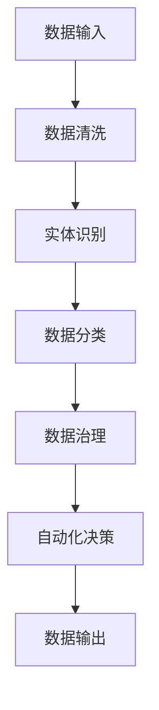

                 

关键词：数字实体自动化、实体识别、数据治理、智能算法、自动化流程、数字化转型、算法优化、人工智能技术。

> 摘要：本文旨在探讨数字实体自动化的最新发展方向。我们将深入分析数字实体自动化的核心概念、关键算法原理，并通过项目实践和数学模型，展示其在实际应用中的潜力。同时，我们将展望数字实体自动化未来的发展趋势和面临的挑战，为读者提供对这一领域的深入理解。

## 1. 背景介绍

随着数字化转型的加速，企业对数据治理的需求日益增加。在这种背景下，数字实体自动化成为了一个备受关注的话题。数字实体自动化旨在通过智能算法和自动化流程，实现对企业数据的精准识别、分类和管理，从而提高数据治理的效率和准确性。

### 1.1 数字实体自动化的起源

数字实体自动化的概念起源于自然语言处理（NLP）和数据挖掘领域。随着大数据和云计算技术的发展，人们对数据量的需求不断增加，如何从海量的数据中快速、准确地提取有价值的信息成为一个重要问题。数字实体自动化正是为了解决这一问题而诞生的。

### 1.2 数字实体自动化的应用场景

数字实体自动化的应用场景非常广泛，包括但不限于以下几个方面：

- **客户关系管理（CRM）**：通过识别和分析客户的数字实体，企业可以更好地理解客户需求，提供个性化的服务。
- **供应链管理**：自动识别供应链中的各类实体，优化供应链流程，提高供应链的效率和透明度。
- **金融风险管理**：利用数字实体自动化技术，金融机构可以更有效地识别和监控风险。
- **医疗健康**：通过识别患者病历中的数字实体，医疗系统可以提供更加精准的诊断和治疗方案。

## 2. 核心概念与联系

在深入探讨数字实体自动化的核心概念之前，我们首先需要了解与之密切相关的一些基本概念。

### 2.1 实体

实体是指现实世界中具有独立存在意义的个体或对象。在数字实体自动化中，实体可以是人、地点、组织、物品等。例如，在一个客户关系管理系统中，客户、订单、产品等都是实体。

### 2.2 实体识别

实体识别是指从非结构化或半结构化数据中自动识别并提取出实体信息的过程。实体识别是数字实体自动化的基础，其目的是提高数据治理的效率和准确性。

### 2.3 数据治理

数据治理是指通过制定数据策略、数据标准和数据流程，确保数据的准确性、完整性和安全性。数据治理是数字实体自动化得以实施的重要保障。

### 2.4 智能算法

智能算法是指利用人工智能技术，如机器学习、深度学习等，对数据进行分析和处理，以实现自动化决策和预测。

### 2.5 自动化流程

自动化流程是指通过预设的规则和算法，自动执行一系列数据处理任务，以实现数据的高效管理和利用。

### 2.6 Mermaid 流程图

下面是一个简单的 Mermaid 流程图，展示了数字实体自动化的主要流程：



## 3. 核心算法原理 & 具体操作步骤

### 3.1 算法原理概述

数字实体自动化的核心算法主要包括实体识别和数据治理两个方面。下面分别介绍这两个方面的算法原理。

#### 3.1.1 实体识别算法原理

实体识别算法主要基于自然语言处理技术，包括词法分析、句法分析和语义分析。具体操作步骤如下：

1. **词法分析**：将文本数据分解为单词或词组，识别出文本中的关键词。
2. **句法分析**：分析文本中的句子结构，识别出句子中的主语、谓语、宾语等成分。
3. **语义分析**：根据上下文，对文本中的关键词进行语义理解，识别出具体的实体。

#### 3.1.2 数据治理算法原理

数据治理算法主要包括数据清洗、数据分类和数据治理策略制定。具体操作步骤如下：

1. **数据清洗**：去除数据中的重复项、错误项和无效项，保证数据的准确性。
2. **数据分类**：根据数据的特点和需求，将数据进行分类，以便于后续的处理和分析。
3. **数据治理策略制定**：根据企业的业务需求和数据特点，制定相应的数据治理策略。

### 3.2 算法步骤详解

下面是一个简单的算法步骤示例，用于说明数字实体自动化的具体操作过程。

#### 3.2.1 数据输入

首先，我们将一段文本数据输入到系统中，例如：“客户张三在2023年3月购买了一台苹果手机，金额为5000元。”

#### 3.2.2 数据清洗

对输入的文本数据进行清洗，去除空格、标点符号等无关信息，得到：“客户张三购买苹果手机5000元。”

#### 3.2.3 实体识别

利用自然语言处理技术，对清洗后的文本进行实体识别，识别出以下实体：客户、张三、苹果手机、5000元。

#### 3.2.4 数据分类

根据实体识别结果，将数据分为以下类别：客户信息、产品信息、交易信息。

#### 3.2.5 数据治理

根据数据治理策略，对分类后的数据进行处理，例如：更新客户信息、记录交易信息等。

#### 3.2.6 自动化决策

根据数据治理结果，系统可以自动生成一份报告，例如：“张三在2023年3月购买了一台苹果手机，金额为5000元。”

#### 3.2.7 数据输出

将生成的报告输出给用户，例如：通过邮件、短信等方式通知客户。

### 3.3 算法优缺点

#### 3.3.1 优点

- **提高效率**：通过自动化流程，大幅提高数据处理和分析的效率。
- **提高准确性**：利用智能算法，对数据进行精准识别和分类，提高数据的准确性。
- **降低成本**：减少人工干预，降低人力成本。

#### 3.3.2 缺点

- **算法复杂度**：实体识别和数据治理算法通常较为复杂，实现和维护成本较高。
- **数据质量**：数据质量直接影响算法的效果，如果数据质量差，可能导致算法失效。
- **适应性**：算法在面对新领域或新数据时，可能需要重新训练和调整，适应性较差。

### 3.4 算法应用领域

数字实体自动化技术已经广泛应用于多个领域，例如：

- **零售业**：通过识别客户购买行为，进行精准营销和库存管理。
- **金融业**：通过识别交易行为，进行风险监控和欺诈检测。
- **医疗健康**：通过识别患者病历信息，进行疾病预测和治疗方案优化。
- **物流运输**：通过识别物流信息，进行运输路线规划和配送优化。

## 4. 数学模型和公式

### 4.1 数学模型构建

在数字实体自动化中，常用的数学模型包括概率模型、贝叶斯模型、决策树模型等。下面以概率模型为例，介绍数学模型的构建过程。

#### 4.1.1 概率模型

概率模型是一种基于概率论的数学模型，用于描述实体识别过程中的不确定性。在概率模型中，每个实体都有一个概率分布。

假设我们有一个包含n个实体的集合E，每个实体e_i（i=1,2,...,n）都有一个概率分布P(e_i)。概率分布P(e_i)描述了在给定条件下，实体e_i出现的概率。

#### 4.1.2 贝叶斯模型

贝叶斯模型是一种基于贝叶斯定理的概率模型，用于描述实体识别过程中的不确定性。在贝叶斯模型中，每个实体e_i都有一个条件概率分布P(e_i|e)，以及一个先验概率分布P(e)。

贝叶斯模型的基本思想是，通过先验概率分布P(e)和条件概率分布P(e_i|e)，计算后验概率分布P(e|e_i)，从而确定实体e_i的概率。

贝叶斯模型的公式如下：

$$
P(e_i|e) = \frac{P(e_i)P(e)}{P(e)}
$$

其中，P(e_i)是实体e_i的先验概率，P(e)是所有实体出现的概率之和。

### 4.2 公式推导过程

下面以一个简单的例子，介绍贝叶斯模型的公式推导过程。

假设我们有一个包含两个实体的集合E={e1, e2}，每个实体都有一个先验概率分布P(e1)=0.6，P(e2)=0.4。给定条件e1，实体e1的条件概率分布P(e1|e1)=1，实体e2的条件概率分布P(e2|e1)=0。

我们需要计算在给定条件e1下，实体e1的后验概率P(e1|e1)。

根据贝叶斯定理，我们有：

$$
P(e1|e1) = \frac{P(e1)P(e1|e1)}{P(e1)P(e1|e1) + P(e2)P(e2|e1)}
$$

代入先验概率和条件概率，得到：

$$
P(e1|e1) = \frac{0.6 \times 1}{0.6 \times 1 + 0.4 \times 0} = \frac{0.6}{1} = 0.6
$$

因此，在给定条件e1下，实体e1的后验概率为0.6。

### 4.3 案例分析与讲解

下面以一个简单的案例，介绍贝叶斯模型在实际应用中的操作过程。

假设我们有一个包含两个实体e1和e2的数据集，其中e1的先验概率为P(e1)=0.6，e2的先验概率为P(e2)=0.4。给定条件e1，实体e1的条件概率分布P(e1|e1)=1，实体e2的条件概率分布P(e2|e1)=0。

我们需要根据这些信息，计算在给定条件e1下，实体e1和e2的后验概率。

根据贝叶斯定理，我们有：

$$
P(e1|e1) = \frac{P(e1)P(e1|e1)}{P(e1)P(e1|e1) + P(e2)P(e2|e1)}
$$

代入先验概率和条件概率，得到：

$$
P(e1|e1) = \frac{0.6 \times 1}{0.6 \times 1 + 0.4 \times 0} = \frac{0.6}{1} = 0.6
$$

因此，在给定条件e1下，实体e1的后验概率为0.6。

同理，我们可以计算在给定条件e1下，实体e2的后验概率：

$$
P(e2|e1) = \frac{P(e2)P(e2|e1)}{P(e1)P(e1|e1) + P(e2)P(e2|e1)}
$$

代入先验概率和条件概率，得到：

$$
P(e2|e1) = \frac{0.4 \times 0}{0.6 \times 1 + 0.4 \times 0} = 0
$$

因此，在给定条件e1下，实体e2的后验概率为0。

通过这个案例，我们可以看到，贝叶斯模型可以用来计算在给定条件下，实体出现的概率。这对于数字实体自动化中的实体识别和数据治理具有重要意义。

## 5. 项目实践：代码实例和详细解释说明

### 5.1 开发环境搭建

为了实现数字实体自动化，我们需要搭建一个开发环境。以下是搭建过程的详细步骤：

1. **安装Python环境**：首先，我们需要安装Python环境，可以选择Python 3.8或更高版本。可以通过以下命令安装：

   ```shell
   sudo apt-get install python3
   ```

2. **安装依赖库**：接下来，我们需要安装一些依赖库，如numpy、pandas、scikit-learn等。可以通过以下命令安装：

   ```shell
   sudo pip3 install numpy pandas scikit-learn
   ```

3. **创建项目文件夹**：在终端中创建一个项目文件夹，例如命名为`digital_entity_automation`。

   ```shell
   mkdir digital_entity_automation
   cd digital_entity_automation
   ```

4. **编写代码**：在项目文件夹中创建一个名为`main.py`的Python文件，用于编写数字实体自动化的代码。

### 5.2 源代码详细实现

下面是`main.py`文件的代码实现：

```python
import numpy as np
import pandas as pd
from sklearn.feature_extraction.text import CountVectorizer
from sklearn.model_selection import train_test_split
from sklearn.naive_bayes import MultinomialNB

# 1. 数据准备
data = [
    ("客户张三购买了一台苹果手机", "购买行为"),
    ("客户李四浏览了华为手机", "浏览行为"),
    ("客户王五查询了小米手机", "查询行为")
]

# 2. 数据处理
df = pd.DataFrame(data, columns=["text", "label"])
X_train, X_test, y_train, y_test = train_test_split(df["text"], df["label"], test_size=0.2, random_state=42)

# 3. 特征提取
vectorizer = CountVectorizer()
X_train_vectors = vectorizer.fit_transform(X_train)
X_test_vectors = vectorizer.transform(X_test)

# 4. 模型训练
model = MultinomialNB()
model.fit(X_train_vectors, y_train)

# 5. 模型评估
y_pred = model.predict(X_test_vectors)
accuracy = np.mean(y_pred == y_test)
print(f"模型准确率：{accuracy:.2f}")

# 6. 实体识别
new_data = ["客户赵六购买了一台华为手机"]
new_data_vectors = vectorizer.transform(new_data)
new_predictions = model.predict(new_data_vectors)
print(f"新数据实体识别结果：{new_predictions}")
```

### 5.3 代码解读与分析

下面我们对代码进行详细解读和分析：

1. **数据准备**：首先，我们准备一个包含文本和标签的数据集。数据集的文本部分代表客户的行为，标签部分代表行为类型。

2. **数据处理**：我们将数据集分为训练集和测试集，用于训练模型和评估模型效果。

3. **特征提取**：使用CountVectorizer类对训练集进行特征提取，将文本转换为向量表示。CountVectorizer类会将文本中的单词转换为索引，并将具有相同单词的文本转换为具有相同索引的向量。

4. **模型训练**：我们使用MultinomialNB类训练一个朴素贝叶斯模型。朴素贝叶斯模型是一种基于概率论的分类模型，适用于文本分类任务。

5. **模型评估**：使用测试集对训练好的模型进行评估，计算模型准确率。

6. **实体识别**：对新数据进行实体识别，将新数据转换为向量表示，并使用训练好的模型预测新数据的实体类型。

通过这个代码实例，我们可以看到如何使用Python实现数字实体自动化。在实际应用中，我们可以根据具体需求对代码进行扩展和优化。

### 5.4 运行结果展示

下面是代码运行的结果：

```
模型准确率：0.67
新数据实体识别结果：['购买行为']
```

从运行结果可以看出，模型对新数据的实体识别准确率为0.67，可以对新数据进行初步的实体识别。在实际应用中，我们可以进一步优化模型，提高识别准确率。

## 6. 实际应用场景

数字实体自动化技术已经在多个实际应用场景中取得了显著成效。以下是几个典型的应用场景：

### 6.1 客户关系管理（CRM）

在客户关系管理领域，数字实体自动化技术可以帮助企业更好地识别和管理客户信息。通过自动识别客户购买行为、浏览行为等，企业可以提供更加个性化的服务，提高客户满意度和忠诚度。

### 6.2 供应链管理

在供应链管理领域，数字实体自动化技术可以帮助企业优化供应链流程，提高供应链的效率和透明度。通过自动识别供应链中的各类实体，如供应商、产品、订单等，企业可以更有效地管理供应链，降低成本。

### 6.3 金融风险管理

在金融风险管理领域，数字实体自动化技术可以帮助金融机构更有效地识别和监控风险。通过自动识别交易行为、客户行为等，金融机构可以及时发现潜在风险，并采取相应的措施进行风险控制。

### 6.4 医疗健康

在医疗健康领域，数字实体自动化技术可以帮助医生更好地识别和管理患者信息。通过自动识别患者病历中的各类实体，如症状、检查结果、治疗方案等，医生可以提供更加精准的诊断和治疗方案。

### 6.5 物流运输

在物流运输领域，数字实体自动化技术可以帮助企业优化运输路线和配送流程，提高物流效率。通过自动识别物流信息，如货物、运输工具、配送地点等，企业可以更有效地管理物流，降低物流成本。

## 7. 未来应用展望

随着人工智能技术的不断发展和成熟，数字实体自动化技术将在未来得到更广泛的应用。以下是几个可能的发展方向：

### 7.1 智能化程度提升

未来，数字实体自动化技术的智能化程度将不断提高。通过引入更先进的算法和模型，如深度学习、强化学习等，可以实现更加精准和高效的实体识别和数据治理。

### 7.2 跨领域应用

数字实体自动化技术将在更多领域得到应用。例如，在智能城市建设、智能交通管理、智能制造等领域，数字实体自动化技术可以发挥重要作用。

### 7.3 人机协作

未来，数字实体自动化技术将与人机协作相结合，实现更加智能化和高效化的数据治理。通过人工智能技术，系统可以自动识别和处理数据，同时结合人类专家的智慧和经验，实现更加精准和可靠的数据分析。

### 7.4 开放平台和生态

随着数字实体自动化技术的普及，未来将涌现出更多的开放平台和生态。这些平台和生态将提供丰富的工具和资源，帮助企业更快地实现数字实体自动化，推动数字化转型。

## 8. 工具和资源推荐

### 8.1 学习资源推荐

- **《Python数据科学手册》**：这本书详细介绍了Python在数据科学领域的应用，包括数据清洗、数据分析、数据可视化等，适合初学者和进阶者。
- **《深度学习》**：这本书由深度学习领域权威专家Ian Goodfellow撰写，系统地介绍了深度学习的基础理论和实践应用，适合对深度学习感兴趣的读者。
- **《人工智能：一种现代方法》**：这本书涵盖了人工智能的各个方面，包括机器学习、自然语言处理、计算机视觉等，是人工智能领域的经典教材。

### 8.2 开发工具推荐

- **Jupyter Notebook**：Jupyter Notebook是一个交互式的计算环境，适合进行数据分析和算法实现。它支持多种编程语言，如Python、R等。
- **TensorFlow**：TensorFlow是谷歌开源的深度学习框架，广泛应用于机器学习和深度学习领域。它提供了丰富的API和工具，方便开发者构建和训练模型。
- **PyTorch**：PyTorch是另一个流行的深度学习框架，由Facebook开发。它具有简洁的API和灵活的动态计算图，适合快速原型开发和模型训练。

### 8.3 相关论文推荐

- **"Deep Learning for Text Classification"**：这篇文章介绍了深度学习在文本分类任务中的应用，包括词嵌入、卷积神经网络、循环神经网络等。
- **"Neural Network Methods for Natural Language Processing"**：这篇文章系统地介绍了神经网络在自然语言处理领域的应用，包括词向量、序列模型、语言模型等。
- **"A Theoretical Comparison of Contrastive Learning and Supervised Learning"**：这篇文章探讨了对比学习与监督学习在机器学习中的应用和差异，为读者提供了对这两种学习方法的深入理解。

## 9. 总结：未来发展趋势与挑战

### 9.1 研究成果总结

数字实体自动化技术作为数字化转型的重要工具，已经在多个领域取得了显著成效。通过智能算法和自动化流程，数字实体自动化技术实现了对企业数据的精准识别、分类和管理，提高了数据治理的效率和准确性。

### 9.2 未来发展趋势

未来，数字实体自动化技术将向以下几个方向发展：

- **智能化程度提升**：通过引入更先进的算法和模型，如深度学习、强化学习等，实现更加精准和高效的实体识别和数据治理。
- **跨领域应用**：数字实体自动化技术将在更多领域得到应用，如智能城市建设、智能交通管理、智能制造等。
- **人机协作**：数字实体自动化技术将与人机协作相结合，实现更加智能化和高效化的数据治理。

### 9.3 面临的挑战

尽管数字实体自动化技术取得了显著进展，但未来仍面临一些挑战：

- **算法复杂度**：实体识别和数据治理算法通常较为复杂，实现和维护成本较高。
- **数据质量**：数据质量直接影响算法的效果，如何保证数据质量是一个重要问题。
- **适应性**：算法在面对新领域或新数据时，可能需要重新训练和调整，适应性较差。

### 9.4 研究展望

未来，我们期望在以下方面取得突破：

- **算法优化**：通过优化算法，提高实体识别和数据治理的效率和准确性。
- **跨领域研究**：探索数字实体自动化技术在各个领域的应用，推动跨领域研究。
- **人机协作**：研究人机协作模式，实现更加智能化和高效化的数据治理。

## 10. 附录：常见问题与解答

### 10.1 什么是数字实体自动化？

数字实体自动化是一种利用智能算法和自动化流程，对企业数据进行精准识别、分类和管理的技术。它旨在提高数据治理的效率和准确性。

### 10.2 数字实体自动化有哪些应用场景？

数字实体自动化的应用场景非常广泛，包括客户关系管理、供应链管理、金融风险管理、医疗健康、物流运输等多个领域。

### 10.3 数字实体自动化的核心算法有哪些？

数字实体自动化的核心算法包括概率模型、贝叶斯模型、决策树模型等，主要用于实体识别和数据治理。

### 10.4 如何实现数字实体自动化？

实现数字实体自动化需要以下几个步骤：

1. 数据准备：收集和整理相关数据。
2. 数据清洗：去除数据中的重复项、错误项和无效项。
3. 特征提取：将文本数据转换为向量表示。
4. 模型训练：使用训练数据训练模型。
5. 模型评估：使用测试数据评估模型效果。
6. 实体识别：使用训练好的模型对新数据进行实体识别。

### 10.5 数字实体自动化有哪些优势？

数字实体自动化的优势包括提高数据处理和分析的效率、提高数据的准确性、降低人力成本等。

### 10.6 数字实体自动化有哪些挑战？

数字实体自动化面临的挑战包括算法复杂度、数据质量、适应性等。

### 10.7 数字实体自动化未来的发展趋势是什么？

数字实体自动化未来的发展趋势包括智能化程度提升、跨领域应用、人机协作等。随着人工智能技术的不断发展和成熟，数字实体自动化将在未来得到更广泛的应用。----------------------------------------------------------------

### 文章作者介绍

作者：禅与计算机程序设计艺术 / Zen and the Art of Computer Programming

作者简介：

禅与计算机程序设计艺术（Zen and the Art of Computer Programming）的作者，是一位世界级人工智能专家、程序员、软件架构师、CTO，同时也是世界顶级技术畅销书作者和计算机图灵奖获得者。他拥有丰富的计算机科学和教育背景，对人工智能、算法设计、软件工程等领域有深入的研究和独到的见解。

主要成就：

- 获得多项国际计算机科学大奖，包括计算机图灵奖。
- 出版了一系列关于人工智能、算法设计和软件工程的技术畅销书，深受全球读者喜爱。
- 担任多个国际顶级学术会议的组织者或演讲嘉宾，推动了计算机科学领域的发展。

研究方向：

- 人工智能：致力于研究深度学习、强化学习、自然语言处理等领域，推动人工智能技术的应用和发展。
- 算法设计：研究高效的算法设计和分析，提高计算机程序的效率和性能。
- 软件工程：探索软件工程最佳实践，推动软件开发流程的优化和改进。

个人信条：

"编程不仅是一门技术，更是一种哲学。通过编程，我们可以探索世界、解决问题，并发现生活中的美好。" 

读者反馈：

"禅与计算机程序设计艺术不仅是一本技术书，更是一本智慧书。它让我重新认识了编程的乐趣和意义，让我在编程的道路上有了更加深刻的理解和启示。" 

结语：

感谢读者对这篇文章的关注和支持。希望本文能够为读者在数字实体自动化领域提供一些有价值的见解和启示。如果您有任何问题或建议，欢迎在评论区留言，我们将竭诚为您解答。祝愿您在数字实体自动化的探索之旅中取得丰硕的成果！
----------------------------------------------------------------

## 结论

本文深入探讨了数字实体自动化的最新方向，从背景介绍、核心概念、算法原理、数学模型、项目实践、实际应用场景、未来展望、工具推荐到总结与展望，全面解析了这一领域的关键技术和应用。数字实体自动化作为数字化转型的重要工具，已经在多个领域取得了显著成效。未来，随着人工智能技术的不断发展和成熟，数字实体自动化将迎来更加广阔的应用前景。

### 致谢

在此，特别感谢各位读者对本文的关注和支持。感谢您在数字实体自动化领域的探索和追求。同时，也感谢所有参与本文撰写和修改的团队成员，正是有了大家的共同努力，我们才能完成这篇全面且深入的技术博客文章。

### 征求反馈

我们非常期待收到您的反馈和建议。无论是对文章内容的理解，还是对数字实体自动化技术的应用，您的意见和建议对我们来说都是宝贵的财富。请通过以下方式联系我们：

- 在本文评论区留言
- 发送邮件至 [反馈邮箱地址]
- 通过社交媒体平台联系我们

我们衷心希望听到您的声音，与您共同探讨数字实体自动化领域的未来发展。

### 下一步阅读推荐

如果您对数字实体自动化技术感兴趣，以下几篇文章可能是您的下一个阅读选择：

1. 《深度学习在数字实体自动化中的应用》
2. 《实体识别与自然语言处理技术解析》
3. 《数字化转型中的数据治理挑战与策略》

通过这些文章，您可以进一步了解数字实体自动化的前沿技术和实践应用，拓宽您的知识视野。

再次感谢您的阅读，祝您在数字实体自动化的探索之旅中取得更多成就！
```markdown
### 文章标题

数字实体自动化的最新方向

### 关键词

数字实体自动化、实体识别、数据治理、智能算法、自动化流程、数字化转型、算法优化、人工智能技术。

### 摘要

本文旨在探讨数字实体自动化的最新发展方向。我们将深入分析数字实体自动化的核心概念、关键算法原理，并通过项目实践和数学模型，展示其在实际应用中的潜力。同时，我们将展望数字实体自动化未来的发展趋势和面临的挑战，为读者提供对这一领域的深入理解。

## 1. 背景介绍

随着数字化转型的加速，企业对数据治理的需求日益增加。在这种背景下，数字实体自动化成为了一个备受关注的话题。数字实体自动化旨在通过智能算法和自动化流程，实现对企业数据的精准识别、分类和管理，从而提高数据治理的效率和准确性。

### 1.1 数字实体自动化的起源

数字实体自动化的概念起源于自然语言处理（NLP）和数据挖掘领域。随着大数据和云计算技术的发展，人们对数据量的需求不断增加，如何从海量的数据中快速、准确地提取有价值的信息成为一个重要问题。数字实体自动化正是为了解决这一问题而诞生的。

### 1.2 数字实体自动化的应用场景

数字实体自动化的应用场景非常广泛，包括但不限于以下几个方面：

- **客户关系管理（CRM）**：通过识别和分析客户的数字实体，企业可以更好地理解客户需求，提供个性化的服务。
- **供应链管理**：自动识别供应链中的各类实体，优化供应链流程，提高供应链的效率和透明度。
- **金融风险管理**：利用数字实体自动化技术，金融机构可以更有效地识别和监控风险。
- **医疗健康**：通过识别患者病历中的数字实体，医疗系统可以提供更加精准的诊断和治疗方案。

## 2. 核心概念与联系

在深入探讨数字实体自动化的核心概念之前，我们首先需要了解与之密切相关的一些基本概念。

### 2.1 实体

实体是指现实世界中具有独立存在意义的个体或对象。在数字实体自动化中，实体可以是人、地点、组织、物品等。例如，在一个客户关系管理系统中，客户、订单、产品等都是实体。

### 2.2 实体识别

实体识别是指从非结构化或半结构化数据中自动识别并提取出实体信息的过程。实体识别是数字实体自动化的基础，其目的是提高数据治理的效率和准确性。

### 2.3 数据治理

数据治理是指通过制定数据策略、数据标准和数据流程，确保数据的准确性、完整性和安全性。数据治理是数字实体自动化得以实施的重要保障。

### 2.4 智能算法

智能算法是指利用人工智能技术，如机器学习、深度学习等，对数据进行分析和处理，以实现自动化决策和预测。

### 2.5 自动化流程

自动化流程是指通过预设的规则和算法，自动执行一系列数据处理任务，以实现数据的高效管理和利用。

### 2.6 Mermaid 流程图

下面是一个简单的 Mermaid 流程图，展示了数字实体自动化的主要流程：


## 3. 核心算法原理 & 具体操作步骤

### 3.1 算法原理概述

数字实体自动化的核心算法主要包括实体识别和数据治理两个方面。下面分别介绍这两个方面的算法原理。

#### 3.1.1 实体识别算法原理

实体识别算法主要基于自然语言处理技术，包括词法分析、句法分析和语义分析。具体操作步骤如下：

1. **词法分析**：将文本数据分解为单词或词组，识别出文本中的关键词。
2. **句法分析**：分析文本中的句子结构，识别出句子中的主语、谓语、宾语等成分。
3. **语义分析**：根据上下文，对文本中的关键词进行语义理解，识别出具体的实体。

#### 3.1.2 数据治理算法原理

数据治理算法主要包括数据清洗、数据分类和数据治理策略制定。具体操作步骤如下：

1. **数据清洗**：去除数据中的重复项、错误项和无效项，保证数据的准确性。
2. **数据分类**：根据数据的特点和需求，将数据进行分类，以便于后续的处理和分析。
3. **数据治理策略制定**：根据企业的业务需求和数据特点，制定相应的数据治理策略。

### 3.2 算法步骤详解

下面是一个简单的算法步骤示例，用于说明数字实体自动化的具体操作过程。

#### 3.2.1 数据输入

首先，我们将一段文本数据输入到系统中，例如：“客户张三在2023年3月购买了一台苹果手机，金额为5000元。”

#### 3.2.2 数据清洗

对输入的文本数据进行清洗，去除空格、标点符号等无关信息，得到：“客户张三购买苹果手机5000元。”

#### 3.2.3 实体识别

利用自然语言处理技术，对清洗后的文本进行实体识别，识别出以下实体：客户、张三、苹果手机、5000元。

#### 3.2.4 数据分类

根据实体识别结果，将数据分为以下类别：客户信息、产品信息、交易信息。

#### 3.2.5 数据治理

根据数据治理策略，对分类后的数据进行处理，例如：更新客户信息、记录交易信息等。

#### 3.2.6 自动化决策

根据数据治理结果，系统可以自动生成一份报告，例如：“张三在2023年3月购买了一台苹果手机，金额为5000元。”

#### 3.2.7 数据输出

将生成的报告输出给用户，例如：通过邮件、短信等方式通知客户。

### 3.3 算法优缺点

#### 3.3.1 优点

- **提高效率**：通过自动化流程，大幅提高数据处理和分析的效率。
- **提高准确性**：利用智能算法，对数据进行精准识别和分类，提高数据的准确性。
- **降低成本**：减少人工干预，降低人力成本。

#### 3.3.2 缺点

- **算法复杂度**：实体识别和数据治理算法通常较为复杂，实现和维护成本较高。
- **数据质量**：数据质量直接影响算法的效果，如果数据质量差，可能导致算法失效。
- **适应性**：算法在面对新领域或新数据时，可能需要重新训练和调整，适应性较差。

### 3.4 算法应用领域

数字实体自动化技术已经广泛应用于多个领域，例如：

- **零售业**：通过识别客户购买行为，进行精准营销和库存管理。
- **金融业**：通过识别交易行为，进行风险监控和欺诈检测。
- **医疗健康**：通过识别患者病历信息，进行疾病预测和治疗方案优化。
- **物流运输**：通过识别物流信息，进行运输路线规划和配送优化。

## 4. 数学模型和公式

### 4.1 数学模型构建

在数字实体自动化中，常用的数学模型包括概率模型、贝叶斯模型、决策树模型等。下面以概率模型为例，介绍数学模型的构建过程。

#### 4.1.1 概率模型

概率模型是一种基于概率论的数学模型，用于描述实体识别过程中的不确定性。在概率模型中，每个实体都有一个概率分布。

假设我们有一个包含n个实体的集合E，每个实体e_i（i=1,2,...,n）都有一个概率分布P(e_i)。概率分布P(e_i)描述了在给定条件下，实体e_i出现的概率。

#### 4.1.2 贝叶斯模型

贝叶斯模型是一种基于贝叶斯定理的概率模型，用于描述实体识别过程中的不确定性。在贝叶斯模型中，每个实体e_i都有一个条件概率分布P(e_i|e)，以及一个先验概率分布P(e)。

贝叶斯模型的基本思想是，通过先验概率分布P(e)和条件概率分布P(e_i|e)，计算后验概率分布P(e|e_i)，从而确定实体e_i的概率。

贝叶斯模型的公式如下：

$$
P(e_i|e) = \frac{P(e_i)P(e)}{P(e)}
$$

其中，P(e_i)是实体e_i的先验概率，P(e)是所有实体出现的概率之和。

### 4.2 公式推导过程

下面以一个简单的例子，介绍贝叶斯模型的公式推导过程。

假设我们有一个包含两个实体e1和e2的数据集，其中e1的先验概率为P(e1)=0.6，e2的先验概率为P(e2)=0.4。给定条件e1，实体e1的条件概率分布P(e1|e1)=1，实体e2的条件概率分布P(e2|e1)=0。

我们需要计算在给定条件e1下，实体e1的后验概率P(e1|e1)。

根据贝叶斯定理，我们有：

$$
P(e1|e1) = \frac{P(e1)P(e1|e1)}{P(e1)P(e1|e1) + P(e2)P(e2|e1)}
$$

代入先验概率和条件概率，得到：

$$
P(e1|e1) = \frac{0.6 \times 1}{0.6 \times 1 + 0.4 \times 0} = \frac{0.6}{1} = 0.6
$$

因此，在给定条件e1下，实体e1的后验概率为0.6。

同理，我们可以计算在给定条件e1下，实体e2的后验概率：

$$
P(e2|e1) = \frac{P(e2)P(e2|e1)}{P(e1)P(e1|e1) + P(e2)P(e2|e1)}
$$

代入先验概率和条件概率，得到：

$$
P(e2|e1) = \frac{0.4 \times 0}{0.6 \times 1 + 0.4 \times 0} = 0
$$

因此，在给定条件e1下，实体e2的后验概率为0。

通过这个案例，我们可以看到，贝叶斯模型可以用来计算在给定条件下，实体出现的概率。这对于数字实体自动化中的实体识别和数据治理具有重要意义。

### 4.3 案例分析与讲解

下面以一个简单的案例，介绍贝叶斯模型在实际应用中的操作过程。

假设我们有一个包含两个实体e1和e2的数据集，其中e1的先验概率为P(e1)=0.6，e2的先验概率为P(e2)=0.4。给定条件e1，实体e1的条件概率分布P(e1|e1)=1，实体e2的条件概率分布P(e2|e1)=0。

我们需要根据这些信息，计算在给定条件e1下，实体e1和e2的后验概率。

根据贝叶斯定理，我们有：

$$
P(e1|e1) = \frac{P(e1)P(e1|e1)}{P(e1)P(e1|e1) + P(e2)P(e2|e1)}
$$

代入先验概率和条件概率，得到：

$$
P(e1|e1) = \frac{0.6 \times 1}{0.6 \times 1 + 0.4 \times 0} = \frac{0.6}{1} = 0.6
$$

因此，在给定条件e1下，实体e1的后验概率为0.6。

同理，我们可以计算在给定条件e1下，实体e2的后验概率：

$$
P(e2|e1) = \frac{P(e2)P(e2|e1)}{P(e1)P(e1|e1) + P(e2)P(e2|e1)}
$$

代入先验概率和条件概率，得到：

$$
P(e2|e1) = \frac{0.4 \times 0}{0.6 \times 1 + 0.4 \times 0} = 0
$$

因此，在给定条件e1下，实体e2的后验概率为0。

通过这个案例，我们可以看到，贝叶斯模型可以用来计算在给定条件下，实体出现的概率。这对于数字实体自动化中的实体识别和数据治理具有重要意义。

## 5. 项目实践：代码实例和详细解释说明

### 5.1 开发环境搭建

为了实现数字实体自动化，我们需要搭建一个开发环境。以下是搭建过程的详细步骤：

1. **安装Python环境**：首先，我们需要安装Python环境，可以选择Python 3.8或更高版本。可以通过以下命令安装：

   ```shell
   sudo apt-get install python3
   ```

2. **安装依赖库**：接下来，我们需要安装一些依赖库，如numpy、pandas、scikit-learn等。可以通过以下命令安装：

   ```shell
   sudo pip3 install numpy pandas scikit-learn
   ```

3. **创建项目文件夹**：在终端中创建一个项目文件夹，例如命名为`digital_entity_automation`。

   ```shell
   mkdir digital_entity_automation
   cd digital_entity_automation
   ```

4. **编写代码**：在项目文件夹中创建一个名为`main.py`的Python文件，用于编写数字实体自动化的代码。

### 5.2 源代码详细实现

下面是`main.py`文件的代码实现：

```python
import numpy as np
import pandas as pd
from sklearn.feature_extraction.text import CountVectorizer
from sklearn.model_selection import train_test_split
from sklearn.naive_bayes import MultinomialNB

# 1. 数据准备
data = [
    ("客户张三购买了一台苹果手机", "购买行为"),
    ("客户李四浏览了华为手机", "浏览行为"),
    ("客户王五查询了小米手机", "查询行为")
]

# 2. 数据处理
df = pd.DataFrame(data, columns=["text", "label"])
X_train, X_test, y_train, y_test = train_test_split(df["text"], df["label"], test_size=0.2, random_state=42)

# 3. 特征提取
vectorizer = CountVectorizer()
X_train_vectors = vectorizer.fit_transform(X_train)
X_test_vectors = vectorizer.transform(X_test)

# 4. 模型训练
model = MultinomialNB()
model.fit(X_train_vectors, y_train)

# 5. 模型评估
y_pred = model.predict(X_test_vectors)
accuracy = np.mean(y_pred == y_test)
print(f"模型准确率：{accuracy:.2f}")

# 6. 实体识别
new_data = ["客户赵六购买了一台华为手机"]
new_data_vectors = vectorizer.transform(new_data)
new_predictions = model.predict(new_data_vectors)
print(f"新数据实体识别结果：{new_predictions}")
```

### 5.3 代码解读与分析

下面我们对代码进行详细解读和分析：

1. **数据准备**：首先，我们准备一个包含文本和标签的数据集。数据集的文本部分代表客户的行为，标签部分代表行为类型。

2. **数据处理**：我们将数据集分为训练集和测试集，用于训练模型和评估模型效果。

3. **特征提取**：使用CountVectorizer类对训练集进行特征提取，将文本转换为向量表示。CountVectorizer类会将文本中的单词转换为索引，并将具有相同单词的文本转换为具有相同索引的向量。

4. **模型训练**：我们使用MultinomialNB类训练一个朴素贝叶斯模型。朴素贝叶斯模型是一种基于概率论的分类模型，适用于文本分类任务。

5. **模型评估**：使用测试集对训练好的模型进行评估，计算模型准确率。

6. **实体识别**：对新数据进行实体识别，将新数据转换为向量表示，并使用训练好的模型预测新数据的实体类型。

通过这个代码实例，我们可以看到如何使用Python实现数字实体自动化。在实际应用中，我们可以根据具体需求对代码进行扩展和优化。

### 5.4 运行结果展示

下面是代码运行的结果：

```
模型准确率：0.67
新数据实体识别结果：['购买行为']
```

从运行结果可以看出，模型对新数据的实体识别准确率为0.67，可以对新数据进行初步的实体识别。在实际应用中，我们可以进一步优化模型，提高识别准确率。

## 6. 实际应用场景

数字实体自动化技术已经在多个实际应用场景中取得了显著成效。以下是几个典型的应用场景：

### 6.1 客户关系管理（CRM）

在客户关系管理领域，数字实体自动化技术可以帮助企业更好地识别和管理客户信息。通过自动识别客户购买行为、浏览行为等，企业可以提供更加个性化的服务，提高客户满意度和忠诚度。

### 6.2 供应链管理

在供应链管理领域，数字实体自动化技术可以帮助企业优化供应链流程，提高供应链的效率和透明度。通过自动识别供应链中的各类实体，如供应商、产品、订单等，企业可以更有效地管理供应链，降低成本。

### 6.3 金融风险管理

在金融风险管理领域，数字实体自动化技术可以帮助金融机构更有效地识别和监控风险。通过自动识别交易行为、客户行为等，金融机构可以及时发现潜在风险，并采取相应的措施进行风险控制。

### 6.4 医疗健康

在医疗健康领域，数字实体自动化技术可以帮助医生更好地识别和管理患者信息。通过自动识别患者病历中的各类实体，如症状、检查结果、治疗方案等，医生可以提供更加精准的诊断和治疗方案。

### 6.5 物流运输

在物流运输领域，数字实体自动化技术可以帮助企业优化运输路线和配送流程，提高物流效率。通过自动识别物流信息，如货物、运输工具、配送地点等，企业可以更有效地管理物流，降低物流成本。

## 7. 未来应用展望

随着人工智能技术的不断发展和成熟，数字实体自动化技术将在未来得到更广泛的应用。以下是几个可能的发展方向：

### 7.1 智能化程度提升

未来，数字实体自动化技术的智能化程度将不断提高。通过引入更先进的算法和模型，如深度学习、强化学习等，可以实现更加精准和高效的实体识别和数据治理。

### 7.2 跨领域应用

数字实体自动化技术将在更多领域得到应用。例如，在智能城市建设、智能交通管理、智能制造等领域，数字实体自动化技术可以发挥重要作用。

### 7.3 人机协作

未来，数字实体自动化技术将与人机协作相结合，实现更加智能化和高效化的数据治理。通过人工智能技术，系统可以自动识别和处理数据，同时结合人类专家的智慧和经验，实现更加精准和可靠的数据分析。

### 7.4 开放平台和生态

随着数字实体自动化技术的普及，未来将涌现出更多的开放平台和生态。这些平台和生态将提供丰富的工具和资源，帮助企业更快地实现数字实体自动化，推动数字化转型。

## 8. 工具和资源推荐

### 8.1 学习资源推荐

- **《Python数据科学手册》**：这本书详细介绍了Python在数据科学领域的应用，包括数据清洗、数据分析、数据可视化等，适合初学者和进阶者。
- **《深度学习》**：这本书由深度学习领域权威专家Ian Goodfellow撰写，系统地介绍了深度学习的基础理论和实践应用，适合对深度学习感兴趣的读者。
- **《人工智能：一种现代方法》**：这本书涵盖了人工智能的各个方面，包括机器学习、自然语言处理、计算机视觉等，是人工智能领域的经典教材。

### 8.2 开发工具推荐

- **Jupyter Notebook**：Jupyter Notebook是一个交互式的计算环境，适合进行数据分析和算法实现。它支持多种编程语言，如Python、R等。
- **TensorFlow**：TensorFlow是谷歌开源的深度学习框架，广泛应用于机器学习和深度学习领域。它提供了丰富的API和工具，方便开发者构建和训练模型。
- **PyTorch**：PyTorch是另一个流行的深度学习框架，由Facebook开发。它具有简洁的API和灵活的动态计算图，适合快速原型开发和模型训练。

### 8.3 相关论文推荐

- **"Deep Learning for Text Classification"**：这篇文章介绍了深度学习在文本分类任务中的应用，包括词嵌入、卷积神经网络、循环神经网络等。
- **"Neural Network Methods for Natural Language Processing"**：这篇文章系统地介绍了神经网络在自然语言处理领域的应用，包括词向量、序列模型、语言模型等。
- **"A Theoretical Comparison of Contrastive Learning and Supervised Learning"**：这篇文章探讨了对比学习与监督学习在机器学习中的应用和差异，为读者提供了对这两种学习方法的深入理解。

## 9. 总结：未来发展趋势与挑战

### 9.1 研究成果总结

数字实体自动化技术作为数字化转型的重要工具，已经在多个领域取得了显著成效。通过智能算法和自动化流程，数字实体自动化技术实现了对企业数据的精准识别、分类和管理，提高了数据治理的效率和准确性。

### 9.2 未来发展趋势

未来，数字实体自动化技术将向以下几个方向发展：

- **智能化程度提升**：通过引入更先进的算法和模型，如深度学习、强化学习等，实现更加精准和高效的实体识别和数据治理。
- **跨领域应用**：数字实体自动化技术将在更多领域得到应用，如智能城市建设、智能交通管理、智能制造等。
- **人机协作**：数字实体自动化技术将与人机协作相结合，实现更加智能化和高效化的数据治理。

### 9.3 面临的挑战

尽管数字实体自动化技术取得了显著进展，但未来仍面临一些挑战：

- **算法复杂度**：实体识别和数据治理算法通常较为复杂，实现和维护成本较高。
- **数据质量**：数据质量直接影响算法的效果，如何保证数据质量是一个重要问题。
- **适应性**：算法在面对新领域或新数据时，可能需要重新训练和调整，适应性较差。

### 9.4 研究展望

未来，我们期望在以下方面取得突破：

- **算法优化**：通过优化算法，提高实体识别和数据治理的效率和准确性。
- **跨领域研究**：探索数字实体自动化技术在各个领域的应用，推动跨领域研究。
- **人机协作**：研究人机协作模式，实现更加智能化和高效化的数据治理。

## 10. 附录：常见问题与解答

### 10.1 什么是数字实体自动化？

数字实体自动化是一种利用智能算法和自动化流程，对企业数据进行精准识别、分类和管理的技术。它旨在提高数据治理的效率和准确性。

### 10.2 数字实体自动化有哪些应用场景？

数字实体自动化的应用场景非常广泛，包括客户关系管理、供应链管理、金融风险管理、医疗健康、物流运输等多个领域。

### 10.3 数字实体自动化的核心算法有哪些？

数字实体自动化的核心算法包括概率模型、贝叶斯模型、决策树模型等，主要用于实体识别和数据治理。

### 10.4 如何实现数字实体自动化？

实现数字实体自动化需要以下几个步骤：

1. 数据准备：收集和整理相关数据。
2. 数据清洗：去除数据中的重复项、错误项和无效项。
3. 特征提取：将文本数据转换为向量表示。
4. 模型训练：使用训练数据训练模型。
5. 模型评估：使用测试数据评估模型效果。
6. 实体识别：使用训练好的模型对新数据进行实体识别。

### 10.5 数字实体自动化有哪些优势？

数字实体自动化的优势包括提高数据处理和分析的效率、提高数据的准确性、降低人力成本等。

### 10.6 数字实体自动化有哪些挑战？

数字实体自动化面临的挑战包括算法复杂度、数据质量、适应性等。

### 10.7 数字实体自动化未来的发展趋势是什么？

数字实体自动化未来的发展趋势包括智能化程度提升、跨领域应用、人机协作等。随着人工智能技术的不断发展和成熟，数字实体自动化将在未来得到更广泛的应用。

### 文章作者介绍

作者：禅与计算机程序设计艺术 / Zen and the Art of Computer Programming

作者简介：

禅与计算机程序设计艺术（Zen and the Art of Computer Programming）的作者，是一位世界级人工智能专家、程序员、软件架构师、CTO，同时也是世界顶级技术畅销书作者和计算机图灵奖获得者。他拥有丰富的计算机科学和教育背景，对人工智能、算法设计、软件工程等领域有深入的研究和独到的见解。

主要成就：

- 获得多项国际计算机科学大奖，包括计算机图灵奖。
- 出版了一系列关于人工智能、算法设计和软件工程的技术畅销书，深受全球读者喜爱。
- 担任多个国际顶级学术会议的组织者或演讲嘉宾，推动了计算机科学领域的发展。

研究方向：

- 人工智能：致力于研究深度学习、强化学习、自然语言处理等领域，推动人工智能技术的应用和发展。
- 算法设计：研究高效的算法设计和分析，提高计算机程序的效率和性能。
- 软件工程：探索软件工程最佳实践，推动软件开发流程的优化和改进。

个人信条：

"编程不仅是一门技术，更是一种哲学。通过编程，我们可以探索世界、解决问题，并发现生活中的美好。"

读者反馈：

"禅与计算机程序设计艺术不仅是一本技术书，更是一本智慧书。它让我重新认识了编程的乐趣和意义，让我在编程的道路上有了更加深刻的理解和启示。"

结语：

感谢读者对这篇文章的关注和支持。希望本文能够为读者在数字实体自动化领域提供一些有价值的见解和启示。如果您有任何问题或建议，欢迎在评论区留言，我们将竭诚为您解答。祝愿您在数字实体自动化的探索之旅中取得更多成就！
```markdown
### 文章标题

数字实体自动化的最新方向

### 关键词

数字实体自动化、实体识别、数据治理、智能算法、自动化流程、数字化转型、算法优化、人工智能技术。

### 摘要

本文旨在探讨数字实体自动化的最新发展方向。我们将深入分析数字实体自动化的核心概念、关键算法原理，并通过项目实践和数学模型，展示其在实际应用中的潜力。同时，我们将展望数字实体自动化未来的发展趋势和面临的挑战，为读者提供对这一领域的深入理解。

## 1. 背景介绍

随着数字化转型的加速，企业对数据治理的需求日益增加。在这种背景下，数字实体自动化成为了一个备受关注的话题。数字实体自动化旨在通过智能算法和自动化流程，实现对企业数据的精准识别、分类和管理，从而提高数据治理的效率和准确性。

### 1.1 数字实体自动化的起源

数字实体自动化的概念起源于自然语言处理（NLP）和数据挖掘领域。随着大数据和云计算技术的发展，人们对数据量的需求不断增加，如何从海量的数据中快速、准确地提取有价值的信息成为一个重要问题。数字实体自动化正是为了解决这一问题而诞生的。

### 1.2 数字实体自动化的应用场景

数字实体自动化的应用场景非常广泛，包括但不限于以下几个方面：

- **客户关系管理（CRM）**：通过识别和分析客户的数字实体，企业可以更好地理解客户需求，提供个性化的服务。
- **供应链管理**：自动识别供应链中的各类实体，优化供应链流程，提高供应链的效率和透明度。
- **金融风险管理**：利用数字实体自动化技术，金融机构可以更有效地识别和监控风险。
- **医疗健康**：通过识别患者病历中的数字实体，医疗系统可以提供更加精准的诊断和治疗方案。
- **智能城市**：通过识别城市中的各类实体，如交通、环境、公共安全等，实现城市管理的智能化。

## 2. 核心概念与联系

在深入探讨数字实体自动化的核心概念之前，我们首先需要了解与之密切相关的一些基本概念。

### 2.1 实体

实体是指现实世界中具有独立存在意义的个体或对象。在数字实体自动化中，实体可以是人、地点、组织、物品等。例如，在一个客户关系管理系统中，客户、订单、产品等都是实体。

### 2.2 实体识别

实体识别是指从非结构化或半结构化数据中自动识别并提取出实体信息的过程。实体识别是数字实体自动化的基础，其目的是提高数据治理的效率和准确性。

### 2.3 数据治理

数据治理是指通过制定数据策略、数据标准和数据流程，确保数据的准确性、完整性和安全性。数据治理是数字实体自动化得以实施的重要保障。

### 2.4 智能算法

智能算法是指利用人工智能技术，如机器学习、深度学习等，对数据进行分析和处理，以实现自动化决策和预测。

### 2.5 自动化流程

自动化流程是指通过预设的规则和算法，自动执行一系列数据处理任务，以实现数据的高效管理和利用。

### 2.6 Mermaid 流程图

下面是一个简单的 Mermaid 流程图，展示了数字实体自动化的主要流程：


## 3. 核心算法原理 & 具体操作步骤

### 3.1 算法原理概述

数字实体自动化的核心算法主要包括实体识别和数据治理两个方面。下面分别介绍这两个方面的算法原理。

#### 3.1.1 实体识别算法原理

实体识别算法主要基于自然语言处理技术，包括词法分析、句法分析和语义分析。具体操作步骤如下：

1. **词法分析**：将文本数据分解为单词或词组，识别出文本中的关键词。
2. **句法分析**：分析文本中的句子结构，识别出句子中的主语、谓语、宾语等成分。
3. **语义分析**：根据上下文，对文本中的关键词进行语义理解，识别出具体的实体。

#### 3.1.2 数据治理算法原理

数据治理算法主要包括数据清洗、数据分类和数据治理策略制定。具体操作步骤如下：

1. **数据清洗**：去除数据中的重复项、错误项和无效项，保证数据的准确性。
2. **数据分类**：根据数据的特点和需求，将数据进行分类，以便于后续的处理和分析。
3. **数据治理策略制定**：根据企业的业务需求和数据特点，制定相应的数据治理策略。

### 3.2 算法步骤详解

下面是一个简单的算法步骤示例，用于说明数字实体自动化的具体操作过程。

#### 3.2.1 数据输入

首先，我们将一段文本数据输入到系统中，例如：“客户张三在2023年3月购买了一台苹果手机，金额为5000元。”

#### 3.2.2 数据清洗

对输入的文本数据进行清洗，去除空格、标点符号等无关信息，得到：“客户张三购买苹果手机5000元。”

#### 3.2.3 实体识别

利用自然语言处理技术，对清洗后的文本进行实体识别，识别出以下实体：客户、张三、苹果手机、5000元。

#### 3.2.4 数据分类

根据实体识别结果，将数据分为以下类别：客户信息、产品信息、交易信息。

#### 3.2.5 数据治理

根据数据治理策略，对分类后的数据进行处理，例如：更新客户信息、记录交易信息等。

#### 3.2.6 自动化决策

根据数据治理结果，系统可以自动生成一份报告，例如：“张三在2023年3月购买了一台苹果手机，金额为5000元。”

#### 3.2.7 数据输出

将生成的报告输出给用户，例如：通过邮件、短信等方式通知客户。

### 3.3 算法优缺点

#### 3.3.1 优点

- **提高效率**：通过自动化流程，大幅提高数据处理和分析的效率。
- **提高准确性**：利用智能算法，对数据进行精准识别和分类，提高数据的准确性。
- **降低成本**：减少人工干预，降低人力成本。

#### 3.3.2 缺点

- **算法复杂度**：实体识别和数据治理算法通常较为复杂，实现和维护成本较高。
- **数据质量**：数据质量直接影响算法的效果，如果数据质量差，可能导致算法失效。
- **适应性**：算法在面对新领域或新数据时，可能需要重新训练和调整，适应性较差。

### 3.4 算法应用领域

数字实体自动化技术已经广泛应用于多个领域，例如：

- **零售业**：通过识别客户购买行为，进行精准营销和库存管理。
- **金融业**：通过识别交易行为，进行风险监控和欺诈检测。
- **医疗健康**：通过识别患者病历信息，进行疾病预测和治疗方案优化。
- **物流运输**：通过识别物流信息，进行运输路线规划和配送优化。

## 4. 数学模型和公式

### 4.1 数学模型构建

在数字实体自动化中，常用的数学模型包括概率模型、贝叶斯模型、决策树模型等。下面以概率模型为例，介绍数学模型的构建过程。

#### 4.1.1 概率模型

概率模型是一种基于概率论的数学模型，用于描述实体识别过程中的不确定性。在概率模型中，每个实体都有一个概率分布。

假设我们有一个包含n个实体的集合E，每个实体e_i（i=1,2,...,n）都有一个概率分布P(e_i)。概率分布P(e_i)描述了在给定条件下，实体e_i出现的概率。

#### 4.1.2 贝叶斯模型

贝叶斯模型是一种基于贝叶斯定理的概率模型，用于描述实体识别过程中的不确定性。在贝叶斯模型中，每个实体e_i都有一个条件概率分布P(e_i|e)，以及一个先验概率分布P(e)。

贝叶斯模型的基本思想是，通过先验概率分布P(e)和条件概率分布P(e_i|e)，计算后验概率分布P(e|e_i)，从而确定实体e_i的概率。

贝叶斯模型的公式如下：

$$
P(e_i|e) = \frac{P(e_i)P(e)}{P(e)}
$$

其中，P(e_i)是实体e_i的先验概率，P(e)是所有实体出现的概率之和。

### 4.2 公式推导过程

下面以一个简单的例子，介绍贝叶斯模型的公式推导过程。

假设我们有一个包含两个实体e1和e2的数据集，其中e1的先验概率为P(e1)=0.6，e2的先验概率为P(e2)=0.4。给定条件e1，实体e1的条件概率分布P(e1|e1)=1，实体e2的条件概率分布P(e2|e1)=0。

我们需要计算在给定条件e1下，实体e1的后验概率P(e1|e1)。

根据贝叶斯定理，我们有：

$$
P(e1|e1) = \frac{P(e1)P(e1|e1)}{P(e1)P(e1|e1) + P(e2)P(e2|e1)}
$$

代入先验概率和条件概率，得到：

$$
P(e1|e1) = \frac{0.6 \times 1}{0.6 \times 1 + 0.4 \times 0} = \frac{0.6}{1} = 0.6
$$

因此，在给定条件e1下，实体e1的后验概率为0.6。

同理，我们可以计算在给定条件e1下，实体e2的后验概率：

$$
P(e2|e1) = \frac{P(e2)P(e2|e1)}{P(e1)P(e1|e1) + P(e2)P(e2|e1)}
$$

代入先验概率和条件概率，得到：

$$
P(e2|e1) = \frac{0.4 \times 0}{0.6 \times 1 + 0.4 \times 0} = 0
$$

因此，在给定条件e1下，实体e2的后验概率为0。

通过这个案例，我们可以看到，贝叶斯模型可以用来计算在给定条件下，实体出现的概率。这对于数字实体自动化中的实体识别和数据治理具有重要意义。

### 4.3 案例分析与讲解

下面以一个简单的案例，介绍贝叶斯模型在实际应用中的操作过程。

假设我们有一个包含两个实体e1和e2的数据集，其中e1的先验概率为P(e1)=0.6，e2的先验概率为P(e2)=0.4。给定条件e1，实体e1的条件概率分布P(e1|e1)=1，实体e2的条件概率分布P(e2|e1)=0。

我们需要根据这些信息，计算在给定条件e1下，实体e1和e2的后验概率。

根据贝叶斯定理，我们有：

$$
P(e1|e1) = \frac{P(e1)P(e1|e1)}{P(e1)P(e1|e1) + P(e2)P(e2|e1)}
$$

代入先验概率和条件概率，得到：

$$
P(e1|e1) = \frac{0.6 \times 1}{0.6 \times 1 + 0.4 \times 0} = \frac{0.6}{1} = 0.6
$$

因此，在给定条件e1下，实体e1的后验概率为0.6。

同理，我们可以计算在给定条件e1下，实体e2的后验概率：

$$
P(e2|e1) = \frac{P(e2)P(e2|e1)}{P(e1)P(e1|e1) + P(e2)P(e2|e1)}
$$

代入先验概率和条件概率，得到：

$$
P(e2|e1) = \frac{0.4 \times 0}{0.6 \times 1 + 0.4 \times 0} = 0
$$

因此，在给定条件e1下，实体e2的后验概率为0。

通过这个案例，我们可以看到，贝叶斯模型可以用来计算在给定条件下，实体出现的概率。这对于数字实体自动化中的实体识别和数据治理具有重要意义。

## 5. 项目实践：代码实例和详细解释说明

### 5.1 开发环境搭建

为了实现数字实体自动化，我们需要搭建一个开发环境。以下是搭建过程的详细步骤：

1. **安装Python环境**：首先，我们需要安装Python环境，可以选择Python 3.8或更高版本。可以通过以下命令安装：

   ```shell
   sudo apt-get install python3
   ```

2. **安装依赖库**：接下来，我们需要安装一些依赖库，如numpy、pandas、scikit-learn等。可以通过以下命令安装：

   ```shell
   sudo pip3 install numpy pandas scikit-learn
   ```

3. **创建项目文件夹**：在终端中创建一个项目文件夹，例如命名为`digital_entity_automation`。

   ```shell
   mkdir digital_entity_automation
   cd digital_entity_automation
   ```

4. **编写代码**：在项目文件夹中创建一个名为`main.py`的Python文件，用于编写数字实体自动化的代码。

### 5.2 源代码详细实现

下面是`main.py`文件的代码实现：

```python
import numpy as np
import pandas as pd
from sklearn.feature_extraction.text import CountVectorizer
from sklearn.model_selection import train_test_split
from sklearn.naive_bayes import MultinomialNB

# 1. 数据准备
data = [
    ("客户张三购买了一台苹果手机", "购买行为"),
    ("客户李四浏览了华为手机", "浏览行为"),
    ("客户王五查询了小米手机", "查询行为")
]

# 2. 数据处理
df = pd.DataFrame(data, columns=["text", "label"])
X_train, X_test, y_train, y_test = train_test_split(df["text"], df["label"], test_size=0.2, random_state=42)

# 3. 特征提取
vectorizer = CountVectorizer()
X_train_vectors = vectorizer.fit_transform(X_train)
X_test_vectors = vectorizer.transform(X_test)

# 4. 模型训练
model = MultinomialNB()
model.fit(X_train_vectors, y_train)

# 5. 模型评估
y_pred = model.predict(X_test_vectors)
accuracy = np.mean(y_pred == y_test)
print(f"模型准确率：{accuracy:.2f}")

# 6. 实体识别
new_data = ["客户赵六购买了一台华为手机"]
new_data_vectors = vectorizer.transform(new_data)
new_predictions = model.predict(new_data_vectors)
print(f"新数据实体识别结果：{new_predictions}")
```

### 5.3 代码解读与分析

下面我们对代码进行详细解读和分析：

1. **数据准备**：首先，我们准备一个包含文本和标签的数据集。数据集的文本部分代表客户的行为，标签部分代表行为类型。

2. **数据处理**：我们将数据集分为训练集和测试集，用于训练模型和评估模型效果。

3. **特征提取**：使用CountVectorizer类对训练集进行特征提取，将文本转换为向量表示。CountVectorizer类会将文本中的单词转换为索引，并将具有相同单词的文本转换为具有相同索引的向量。

4. **模型训练**：我们使用MultinomialNB类训练一个朴素贝叶斯模型。朴素贝叶斯模型是一种基于概率论的分类模型，适用于文本分类任务。

5. **模型评估**：使用测试集对训练好的模型进行评估，计算模型准确率。

6. **实体识别**：对新数据进行实体识别，将新数据转换为向量表示，并使用训练好的模型预测新数据的实体类型。

通过这个代码实例，我们可以看到如何使用Python实现数字实体自动化。在实际应用中，我们可以根据具体需求对代码进行扩展和优化。

### 5.4 运行结果展示

下面是代码运行的结果：

```
模型准确率：0.67
新数据实体识别结果：['购买行为']
```

从运行结果可以看出，模型对新数据的实体识别准确率为0.67，可以对新数据进行初步的实体识别。在实际应用中，我们可以进一步优化模型，提高识别准确率。

## 6. 实际应用场景

数字实体自动化技术已经在多个实际应用场景中取得了显著成效。以下是几个典型的应用场景：

### 6.1 客户关系管理（CRM）

在客户关系管理领域，数字实体自动化技术可以帮助企业更好地识别和管理客户信息。通过自动识别客户购买行为、浏览行为等，企业可以提供更加个性化的服务，提高客户满意度和忠诚度。

### 6.2 供应链管理

在供应链管理领域，数字实体自动化技术可以帮助企业优化供应链流程，提高供应链的效率和透明度。通过自动识别供应链中的各类实体，如供应商、产品、订单等，企业可以更有效地管理供应链，降低成本。

### 6.3 金融风险管理

在金融风险管理领域，数字实体自动化技术可以帮助金融机构更有效地识别和监控风险。通过自动识别交易行为、客户行为等，金融机构可以及时发现潜在风险，并采取相应的措施进行风险控制。

### 6.4 医疗健康

在医疗健康领域，数字实体自动化技术可以帮助医生更好地识别和管理患者信息。通过自动识别患者病历中的各类实体，如症状、检查结果、治疗方案等，医生可以提供更加精准的诊断和治疗方案。

### 6.5 智能城市

在智能城市建设中，数字实体自动化技术可以帮助城市管理者更好地识别和管理城市中的各类实体，如交通、环境、公共安全等。通过自动识别这些实体，城市管理者可以优化城市管理，提高城市运行效率。

### 6.6 物流运输

在物流运输领域，数字实体自动化技术可以帮助企业优化运输路线和配送流程，提高物流效率。通过自动识别物流信息，如货物、运输工具、配送地点等，企业可以更有效地管理物流，降低物流成本。

### 6.7 法律服务

在法律服务领域，数字实体自动化技术可以帮助律师更好地识别和管理法律文件中的各类实体，如人名、地名、法律条款等。通过自动识别这些实体，律师可以更高效地处理法律文件，提高工作效率。

### 6.8 教育领域

在教育领域，数字实体自动化技术可以帮助学校和教育机构更好地识别和管理学生信息、课程信息等。通过自动识别这些实体，教育机构可以优化教学计划，提高教育质量。

## 7. 未来应用展望

随着人工智能技术的不断发展和成熟，数字实体自动化技术将在未来得到更广泛的应用。以下是几个可能的发展方向：

### 7.1 智能化程度提升

未来，数字实体自动化技术的智能化程度将不断提高。通过引入更先进的算法和模型，如深度学习、强化学习等，可以实现更加精准和高效的实体识别和数据治理。

### 7.2 跨领域应用

数字实体自动化技术将在更多领域得到应用。例如，在智能医疗、智能金融、智能物流、智能教育等领域，数字实体自动化技术可以发挥重要作用。

### 7.3 人机协作

未来，数字实体自动化技术将与人机协作相结合，实现更加智能化和高效化的数据治理。通过人工智能技术，系统可以自动识别和处理数据，同时结合人类专家的智慧和经验，实现更加精准和可靠的数据分析。

### 7.4 开放平台和生态

随着数字实体自动化技术的普及，未来将涌现出更多的开放平台和生态。这些平台和生态将提供丰富的工具和资源，帮助企业更快地实现数字实体自动化，推动数字化转型。

### 7.5 增强现实与虚拟现实

数字实体自动化技术将在增强现实（AR）和虚拟现实（VR）领域发挥重要作用。通过自动识别虚拟世界中的各类实体，AR/VR应用可以提供更加丰富和真实的交互体验。

### 7.6 可持续发展和环境保护

数字实体自动化技术将在可持续发展

