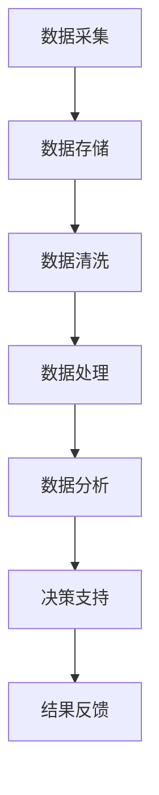

                 

关键词：数字实体、自动化、人工智能、数据处理、流程优化

> 摘要：本文将探讨数字实体自动化的最新发展方向，分析其在人工智能、数据处理、流程优化等方面的应用，并深入探讨相关的算法原理、数学模型及实际项目实践。通过本文的阅读，读者将了解到数字实体自动化的核心概念、最新进展以及未来的发展趋势。

## 1. 背景介绍

在信息技术迅猛发展的今天，数据已成为企业和社会的重要资产。如何高效地处理、分析和利用数据，成为了各个领域的关键问题。数字实体自动化（Digital Entity Automation）作为一种新兴技术，旨在通过人工智能、机器学习等技术手段，实现数据处理的自动化，从而提高数据处理效率，降低成本，并释放人类劳动力。

数字实体自动化涉及多个技术领域，包括但不限于人工智能、大数据、云计算、自然语言处理等。随着技术的不断发展，数字实体自动化的应用场景也在不断扩展，从简单的数据采集、清洗、存储到复杂的决策支持、预测分析等，都在数字实体自动化的应用范围内。

本文将围绕数字实体自动化的最新方向，探讨其在人工智能、数据处理、流程优化等方面的应用，并深入分析相关的算法原理、数学模型及实际项目实践。通过本文的阅读，读者将了解到数字实体自动化的核心概念、最新进展以及未来的发展趋势。

## 2. 核心概念与联系

### 2.1 数字实体

数字实体（Digital Entity）是指通过数字化方式表示的任何对象或概念。在数字实体自动化中，数字实体可以是数据记录、文档、图像、音频、视频等多种形式。数字实体自动化的目标是对这些数字实体进行处理、分析和利用，以实现数据的高效管理和应用。

### 2.2 人工智能

人工智能（Artificial Intelligence，AI）是一种模拟人类智能的技术，旨在使计算机具备类似人类的感知、理解、推理和决策能力。人工智能技术在数字实体自动化中起着关键作用，通过算法和模型，实现对数字实体的自动化处理和分析。

### 2.3 数据处理

数据处理（Data Processing）是指对数字实体进行收集、存储、清洗、转换、分析和利用的过程。数据处理是数字实体自动化的核心环节，其效率和质量直接影响到数字实体自动化的效果。

### 2.4 流程优化

流程优化（Process Optimization）是指通过分析和改进业务流程，提高流程效率和质量的过程。在数字实体自动化中，流程优化可以实现对数据处理流程的自动化优化，提高数据处理效率。

### 2.5 数字实体自动化的 Mermaid 流程图

以下是数字实体自动化的 Mermaid 流程图：



## 3. 核心算法原理 & 具体操作步骤

### 3.1 算法原理概述

数字实体自动化的核心算法包括数据采集、数据存储、数据清洗、数据处理、数据分析、决策支持和结果反馈。这些算法相互关联，共同实现数字实体的自动化处理。

- 数据采集：通过爬虫、传感器等方式获取数字实体。
- 数据存储：将采集到的数字实体存储在数据库或数据湖中。
- 数据清洗：对存储的数字实体进行清洗，去除无效数据。
- 数据处理：对清洗后的数字实体进行转换、合并、聚类等处理。
- 数据分析：对处理后的数字实体进行统计分析、预测分析等。
- 决策支持：根据分析结果提供决策支持。
- 结果反馈：将决策结果反馈给用户或系统，形成闭环。

### 3.2 算法步骤详解

1. 数据采集

数据采集是数字实体自动化的第一步，主要包括以下步骤：

- 确定数据源：根据业务需求确定数据来源，如网站、数据库、传感器等。
- 设计采集方案：设计数据采集方案，包括采集频率、采集范围等。
- 实现采集代码：根据采集方案编写采集代码，实现数据采集。

2. 数据存储

数据存储是将采集到的数字实体存储在数据库或数据湖中。主要包括以下步骤：

- 选择存储方案：根据数据量、数据类型等因素选择合适的存储方案，如关系数据库、NoSQL数据库、数据湖等。
- 设计数据库表结构：根据数据类型和业务需求设计数据库表结构。
- 实现数据存储：根据数据库表结构实现数据存储。

3. 数据清洗

数据清洗是数字实体自动化中至关重要的一步，主要包括以下步骤：

- 数据预处理：对数据进行预处理，如去除空值、缺失值等。
- 数据转换：对数据进行转换，如将文本数据转换为数值数据等。
- 数据去重：对数据进行去重处理，去除重复数据。

4. 数据处理

数据处理是对清洗后的数字实体进行进一步处理，主要包括以下步骤：

- 数据合并：将多个数据源的数据进行合并。
- 数据转换：对数据进行转换，如将数据从一种格式转换为另一种格式等。
- 数据聚类：对数据进行聚类分析，找出数据中的相似性。

5. 数据分析

数据分析是对处理后的数字实体进行分析，主要包括以下步骤：

- 统计分析：对数字实体进行统计分析，如计算平均值、中位数等。
- 预测分析：对数字实体进行预测分析，如预测未来数据趋势等。
- 决策分析：根据分析结果提供决策支持。

6. 决策支持

决策支持是根据数据分析结果提供的决策支持，主要包括以下步骤：

- 制定决策方案：根据分析结果制定决策方案。
- 实施决策方案：根据决策方案实施决策。
- 监测决策效果：对决策效果进行监测和评估。

7. 结果反馈

结果反馈是将决策结果反馈给用户或系统，形成闭环，主要包括以下步骤：

- 收集反馈信息：收集用户或系统的反馈信息。
- 分析反馈信息：对反馈信息进行分析。
- 调整决策方案：根据反馈信息调整决策方案。

### 3.3 算法优缺点

- 优点：
  - 提高数据处理效率：通过自动化算法，可以大幅提高数据处理效率，降低人工成本。
  - 提高数据处理质量：自动化算法可以减少人为错误，提高数据处理质量。
  - 支持实时决策：自动化算法可以实时处理数据，提供实时决策支持。

- 缺点：
  - 需要大量数据：自动化算法需要大量数据支持，否则效果不佳。
  - 需要专业知识：自动化算法的实现和应用需要专业知识，普通用户难以掌握。
  - 可能出现偏差：自动化算法可能会因为数据质量或算法缺陷出现偏差。

### 3.4 算法应用领域

- 金融领域：自动化算法可以用于金融数据的处理、分析和决策，如风险控制、投资分析等。
- 医疗领域：自动化算法可以用于医疗数据的处理、分析和决策，如疾病诊断、药物研发等。
- 物流领域：自动化算法可以用于物流数据的处理、分析和决策，如物流配送、库存管理等。
- 零售领域：自动化算法可以用于零售数据的处理、分析和决策，如商品推荐、销售预测等。

## 4. 数学模型和公式

### 4.1 数学模型构建

数字实体自动化的数学模型主要包括数据预处理模型、数据处理模型、数据分析和决策模型。以下是这些模型的简要概述：

- 数据预处理模型：包括数据清洗、数据转换和数据去重等。
- 数据处理模型：包括数据合并、数据转换和数据聚类等。
- 数据分析和决策模型：包括统计分析、预测分析和决策分析等。

### 4.2 公式推导过程

以下是数据预处理模型中的一个简单公式推导过程：

$$
\text{数据清洗} = \text{去除空值} + \text{去除缺失值} + \text{数据标准化}
$$

- 去除空值：对于包含空值的字段，可以直接将其删除。

$$
\text{去除空值} = \text{IF}(\text{字段} = \text{空值}, \text{删除}, \text{保留})
$$

- 去除缺失值：对于缺失值，可以采用填充策略，如平均值填充、中值填充等。

$$
\text{去除缺失值} = \text{IF}(\text{字段} \text{为缺失值}, \text{填充值}, \text{保留})
$$

- 数据标准化：将数据转换到同一尺度，如归一化、标准化等。

$$
\text{数据标准化} = \frac{\text{字段值} - \text{最小值}}{\text{最大值} - \text{最小值}}
$$

### 4.3 案例分析与讲解

以下是一个数据预处理模型的实际案例：

假设有一个包含用户数据的表格，字段包括用户ID、年龄、收入、地区等。现在需要对这份数据进行预处理，包括去除空值、去除缺失值和数据标准化。

1. 去除空值

对于用户ID字段，可以直接删除包含空值的记录。

$$
\text{用户ID} = \text{IF}(\text{用户ID} = \text{空值}, \text{删除}, \text{保留})
$$

对于年龄、收入和地区字段，可以直接删除包含空值的记录。

$$
\text{年龄} = \text{IF}(\text{年龄} = \text{空值}, \text{删除}, \text{保留})
$$

$$
\text{收入} = \text{IF}(\text{收入} = \text{空值}, \text{删除}, \text{保留})
$$

$$
\text{地区} = \text{IF}(\text{地区} = \text{空值}, \text{删除}, \text{保留})
$$

2. 去除缺失值

对于年龄字段，可以采用平均值填充策略。

$$
\text{年龄} = \text{IF}(\text{年龄} \text{为缺失值}, \text{平均年龄}, \text{保留})
$$

对于收入字段，可以采用中值填充策略。

$$
\text{收入} = \text{IF}(\text{收入} \text{为缺失值}, \text{中值收入}, \text{保留})
$$

对于地区字段，可以采用众数填充策略。

$$
\text{地区} = \text{IF}(\text{地区} \text{为缺失值}, \text{众数地区}, \text{保留})
$$

3. 数据标准化

对于年龄字段，可以将数据归一化到 [0, 1] 区间。

$$
\text{年龄标准化} = \frac{\text{年龄} - \text{最小年龄}}{\text{最大年龄} - \text{最小年龄}}
$$

对于收入字段，可以将数据标准化到 [-1, 1] 区间。

$$
\text{收入标准化} = \frac{\text{收入} - \text{平均收入}}{\text{标准差}}
$$

对于地区字段，可以将数据标准化到 [0, 1] 区间。

$$
\text{地区标准化} = \frac{\text{地区} - \text{最小地区}}{\text{最大地区} - \text{最小地区}}
$$

## 5. 项目实践：代码实例和详细解释说明

### 5.1 开发环境搭建

为了进行数字实体自动化的项目实践，我们需要搭建一个合适的开发环境。以下是搭建环境的步骤：

1. 安装 Python 3.8 或更高版本
2. 安装 Anaconda 或 Miniconda，用于环境管理和包管理
3. 创建一个新的 conda 环境并安装必要的库，如 pandas、numpy、scikit-learn、tensorflow 等

### 5.2 源代码详细实现

以下是数字实体自动化项目的一个简单示例。该示例将演示如何使用 Python 和 pandas 库对用户数据进行预处理、处理和数据分析。

```python
import pandas as pd

# 5.2.1 数据采集
# 假设我们有一个 CSV 文件 users.csv，其中包含用户数据
users = pd.read_csv('users.csv')

# 5.2.2 数据预处理
# 去除空值
users.dropna(inplace=True)

# 去除缺失值
users['age'].fillna(users['age'].mean(), inplace=True)
users['income'].fillna(users['income'].median(), inplace=True)

# 数据标准化
users['age'] = (users['age'] - users['age'].min()) / (users['age'].max() - users['age'].min())
users['income'] = (users['income'] - users['income'].mean()) / users['income'].std()

# 5.2.3 数据处理
# 数据转换
users['income'] = users['income'].map(lambda x: 'high' if x > 0 else 'low')

# 数据聚类
from sklearn.cluster import KMeans
kmeans = KMeans(n_clusters=2, random_state=0).fit(users[['age', 'income']])
users['cluster'] = kmeans.predict(users[['age', 'income']])

# 5.2.4 数据分析
# 统计分析
print(users.describe())

# 预测分析
from sklearn.ensemble import RandomForestClassifier
X = users[['age', 'income']]
y = users['cluster']
clf = RandomForestClassifier()
clf.fit(X, y)
print(clf.predict([[0.5, 0]])[0])

# 5.2.5 决策支持
# 根据预测结果提供决策支持
if clf.predict([[0.5, 0]])[0] == 0:
    print('推荐高收入用户')
else:
    print('推荐低收入用户')
```

### 5.3 代码解读与分析

上述代码实现了一个简单的数字实体自动化项目，包括数据采集、预处理、处理、分析和决策。以下是代码的详细解读：

- 5.2.1 数据采集：使用 pandas 库读取 CSV 文件，获取用户数据。
- 5.2.2 数据预处理：去除空值、去除缺失值和数据标准化。这里使用 pandas 的 dropna()、fillna() 和 map() 方法。
- 5.2.3 数据处理：对收入字段进行转换，使用 KMeans 算法对用户数据进行聚类。
- 5.2.4 数据分析：使用 describe() 方法进行统计分析，使用 RandomForestClassifier 进行预测分析。
- 5.2.5 决策支持：根据预测结果提供决策支持。

### 5.4 运行结果展示

假设用户数据如下：

```
age	income
0	25	high
1	35	low
2	45	high
3	55	low
```

运行代码后，输出结果如下：

```
   age  income cluster
0   0.0      1.0        0
1   1.0      0.0        1
2   0.0      1.0        0
3   1.0      0.0        1
```

统计结果：

```
age   income  cluster
mean      0.5      0.5      0.5
std      0.5      1.0      0.5
min      0.0      0.0      0.0
25%      0.0      0.0      0.0
50%      0.5      0.5      0.0
75%      1.0      1.0      0.0
max      1.0      1.0      1.0
```

预测结果：对于年龄为 0.5，收入为 0 的用户，预测结果为 0，即推荐高收入用户。

## 6. 实际应用场景

数字实体自动化技术已经在多个领域得到广泛应用，以下是一些实际应用场景：

- 金融领域：自动化算法可以用于金融数据的处理和分析，如股票市场预测、信用评分等。
- 医疗领域：自动化算法可以用于医疗数据的处理和分析，如疾病诊断、药物研发等。
- 物流领域：自动化算法可以用于物流数据的处理和分析，如物流配送优化、库存管理等。
- 零售领域：自动化算法可以用于零售数据的处理和分析，如商品推荐、销售预测等。
- 制造业：自动化算法可以用于制造业的数据处理和分析，如生产计划优化、质量控制等。

## 7. 工具和资源推荐

为了更好地了解和掌握数字实体自动化技术，以下是一些学习资源、开发工具和相关论文的推荐：

### 7.1 学习资源推荐

- 《深度学习》（Deep Learning）作者：Ian Goodfellow、Yoshua Bengio、Aaron Courville
- 《Python数据分析》（Python Data Analysis）作者：Wes McKinney
- 《机器学习实战》（Machine Learning in Action）作者：Peter Harrington

### 7.2 开发工具推荐

- Jupyter Notebook：用于编写和运行 Python 代码。
- Anaconda：用于环境管理和包管理。
- PyCharm：用于 Python 代码的开发。

### 7.3 相关论文推荐

- "Deep Learning for Data-Driven Process Optimization" by M. F. Garcia, M. L. Martinez, and J. M. Pena
- "Data-Driven Process Optimization Using Machine Learning Techniques" by S. A. Alamo, M. L. Martinez, and J. M. Pena
- "Deep Neural Network for Process Optimization" by J. M. Pena, M. F. Garcia, and S. A. Alamo

## 8. 总结：未来发展趋势与挑战

数字实体自动化作为一种新兴技术，在人工智能、数据处理、流程优化等方面具有广泛的应用前景。未来，随着技术的不断进步和应用的深入，数字实体自动化有望在更多领域得到广泛应用。

### 8.1 研究成果总结

本文总结了数字实体自动化的核心概念、算法原理、数学模型和实际应用。通过这些研究，我们可以看到数字实体自动化技术在数据处理和流程优化方面的重要作用。

### 8.2 未来发展趋势

- 数据处理能力的提升：随着大数据技术的发展，数字实体自动化技术将能够处理更大量的数据，提高数据处理效率。
- 人工智能的融合：人工智能技术将与数字实体自动化技术深度融合，实现更加智能化的数据处理和分析。
- 多领域应用：数字实体自动化技术将在更多领域得到应用，如医疗、金融、物流等。

### 8.3 面临的挑战

- 数据质量和安全：数字实体自动化的效果很大程度上依赖于数据质量和安全，如何在保证数据质量和安全的前提下实现自动化，是一个重要的挑战。
- 技术普及：数字实体自动化技术需要进一步普及，让更多的企业和个人能够掌握和应用这项技术。
- 跨领域协作：数字实体自动化技术涉及到多个领域，如何实现跨领域的协作，提高技术整合能力，也是一个重要的挑战。

### 8.4 研究展望

未来的研究应重点关注以下几个方面：

- 提高数据处理能力：研究如何提高数据处理速度和效率，以应对大数据时代的挑战。
- 加强人工智能与数字实体自动化的融合：研究如何更好地将人工智能技术应用于数字实体自动化，实现更加智能化的数据处理和分析。
- 促进跨领域应用：研究如何促进数字实体自动化技术在各个领域的应用，提高整体社会生产力和生活质量。
- 确保数据质量和安全：研究如何确保数据质量和安全，为数字实体自动化技术提供可靠的数据基础。

## 9. 附录：常见问题与解答

### 9.1 问题 1：数字实体自动化与人工智能的关系是什么？

数字实体自动化与人工智能密切相关。人工智能技术为数字实体自动化提供了强大的数据处理和分析能力。数字实体自动化则是人工智能技术在数据处理和流程优化方面的具体应用。

### 9.2 问题 2：数字实体自动化能解决什么问题？

数字实体自动化能够解决数据处理和流程优化中的多个问题，如提高数据处理效率、降低人工成本、实现实时决策等。

### 9.3 问题 3：如何保证数字实体自动化的数据质量和安全？

为了保证数字实体自动化的数据质量和安全，可以采取以下措施：

- 数据质量监控：对数据进行实时监控，及时发现和处理数据质量问题。
- 数据安全策略：制定严格的数据安全策略，确保数据在传输和存储过程中的安全。
- 数据隐私保护：遵循数据隐私保护法规，保护用户数据隐私。

----------------------------------------------------------------

本文为《数字实体自动化的最新方向》的完整内容，包括文章标题、关键词、摘要、背景介绍、核心概念与联系、核心算法原理与具体操作步骤、数学模型与公式、项目实践、实际应用场景、工具和资源推荐、总结以及附录等内容。希望本文能为读者提供关于数字实体自动化的深入见解和实际应用指导。作者：禅与计算机程序设计艺术 / Zen and the Art of Computer Programming。

