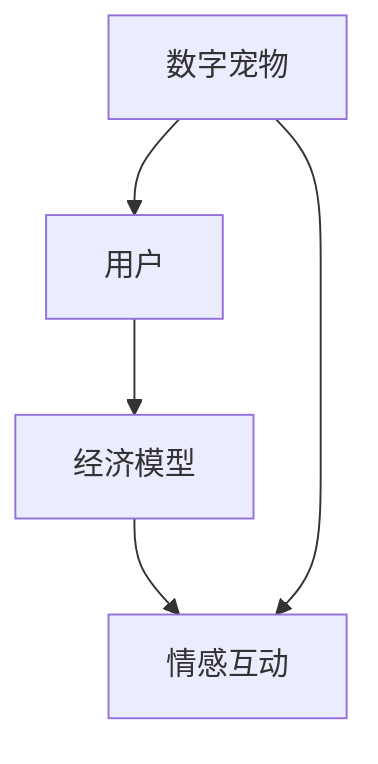

                 

关键词：数字宠物、元宇宙、情感陪伴、经济模型、技术实现、未来展望

摘要：随着元宇宙的兴起，数字宠物经济逐渐崭露头角，成为元宇宙中的一种新兴产业。本文将探讨数字宠物经济的背景、核心概念、算法原理、数学模型、项目实践以及未来展望，旨在为读者提供一个全面了解和深入思考的视角。

## 1. 背景介绍

数字宠物经济起源于虚拟世界的兴起。从最初的电子游戏到现在的社交网络和元宇宙，虚拟世界中的数字宠物已经成为人们生活中不可或缺的一部分。随着技术的不断进步，数字宠物逐渐摆脱了简单的虚拟形象，开始拥有更为复杂的行为、情感和互动能力。这不仅满足了人们对陪伴的需求，还开辟了一个全新的经济领域。

元宇宙作为虚拟世界的集大成者，为数字宠物经济提供了广阔的发展空间。在元宇宙中，人们可以自由探索、创造和互动，而数字宠物则成为他们最忠实的伙伴。数字宠物经济不仅为用户带来了娱乐和情感陪伴，同时也催生了一系列新兴的商业模式，如虚拟商品、虚拟服务、虚拟交易所等。

## 2. 核心概念与联系

数字宠物经济中的核心概念包括数字宠物、用户、经济模型和情感互动。

- **数字宠物**：数字宠物是指通过计算机程序创建的虚拟生物，它们具有独特的性格、行为和情感。数字宠物可以与用户建立情感联系，提供陪伴、娱乐和支持。

- **用户**：用户是数字宠物经济的参与者，他们通过投入时间和金钱来培养、照顾和与数字宠物互动。

- **经济模型**：数字宠物经济模型是指通过用户与数字宠物之间的互动和消费行为来创造价值的机制。这个模型包括虚拟货币、商品交易、虚拟服务等。

- **情感互动**：情感互动是数字宠物经济的核心驱动力。通过模拟真实世界的情感交流，数字宠物能够与用户建立深厚的情感联系，从而增加用户粘性和忠诚度。

### Mermaid 流程图



## 3. 核心算法原理 & 具体操作步骤

### 3.1 算法原理概述

数字宠物经济的核心算法主要包括情感模拟、行为预测和经济优化。这些算法共同作用，确保数字宠物能够与用户建立情感联系并创造经济价值。

- **情感模拟**：情感模拟算法通过分析用户的情感状态和行为，模拟数字宠物的情感反应。这包括情感识别、情感分析和情感生成。

- **行为预测**：行为预测算法通过分析用户的历史行为和情感状态，预测数字宠物的下一步行为。这有助于提高用户互动的准确性和满意度。

- **经济优化**：经济优化算法通过分析用户的消费行为和市场需求，优化数字宠物的经济价值。这包括虚拟商品定价、广告投放和虚拟服务优化。

### 3.2 算法步骤详解

1. **情感模拟**
   - 数据收集：收集用户情感数据，包括语言、行为、表情等。
   - 情感识别：使用情感分析技术识别用户的情感状态。
   - 情感生成：根据用户情感状态生成数字宠物的情感反应。

2. **行为预测**
   - 数据预处理：对用户行为数据进行分析和清洗。
   - 特征提取：提取与行为预测相关的特征。
   - 模型训练：使用机器学习技术训练行为预测模型。
   - 预测执行：使用训练好的模型预测数字宠物的下一步行为。

3. **经济优化**
   - 数据分析：分析用户消费行为和市场趋势。
   - 经济模型构建：构建虚拟商品定价模型和广告投放模型。
   - 模型优化：使用优化算法优化经济模型参数。
   - 经济决策：根据经济模型生成经济决策。

### 3.3 算法优缺点

- **优点**：
  - 提高用户粘性和忠诚度：通过情感模拟和行为预测，数字宠物能够更好地满足用户的情感需求，从而提高用户参与度和忠诚度。
  - 创造经济价值：通过经济优化，数字宠物经济能够实现可持续的商业化运营。

- **缺点**：
  - 技术门槛高：情感模拟、行为预测和经济优化需要高水平的技术支持和数据积累。
  - 数据隐私问题：用户数据的安全性和隐私保护是数字宠物经济面临的重要挑战。

### 3.4 算法应用领域

- **元宇宙平台**：在元宇宙中，数字宠物经济已成为一个重要的经济领域。例如，用户可以在元宇宙中购买、交换和出售数字宠物。
- **社交网络**：在社交网络中，数字宠物可以作为一种社交工具，帮助用户建立情感联系和社交互动。
- **电子商务**：在电子商务平台中，数字宠物可以作为营销工具，吸引用户关注和消费。

## 4. 数学模型和公式

### 4.1 数学模型构建

数字宠物经济的数学模型主要包括用户行为模型、情感模型和经济模型。

- **用户行为模型**：用户行为模型用于描述用户在数字宠物经济中的行为。例如，用户购买数字宠物的频率、购买金额等。
- **情感模型**：情感模型用于描述数字宠物和用户之间的情感联系。例如，情感强度、情感持续时间等。
- **经济模型**：经济模型用于描述数字宠物经济中的交易和利润。例如，虚拟商品定价、广告投放收益等。

### 4.2 公式推导过程

用户行为模型：

$$
Behavior_{u} = f(User_{data}, Context)
$$

其中，$Behavior_{u}$表示用户的行为，$User_{data}$表示用户数据，$Context$表示环境因素。

情感模型：

$$
Emotion_{p} = g(User_{emotion}, Pet_{emotion})
$$

其中，$Emotion_{p}$表示数字宠物的情感，$User_{emotion}$表示用户的情感，$Pet_{emotion}$表示数字宠物的情感状态。

经济模型：

$$
Profit_{p} = h(Sale_{data}, Cost_{data})
$$

其中，$Profit_{p}$表示数字宠物的利润，$Sale_{data}$表示销售数据，$Cost_{data}$表示成本数据。

### 4.3 案例分析与讲解

以一个用户购买数字宠物的案例为例，分析用户行为模型、情感模型和经济模型。

用户行为模型：

$$
Behavior_{u} = f(User_{data}, Context) \\
Behavior_{u} = f(User_{data}: [Age, Gender, Interest], Context: [Event, Promotion])
$$

情感模型：

$$
Emotion_{p} = g(User_{emotion}, Pet_{emotion}) \\
Emotion_{p} = g(User_{emotion}: [Happiness, Loneliness], Pet_{emotion}: [Affection, Playfulness])
$$

经济模型：

$$
Profit_{p} = h(Sale_{data}, Cost_{data}) \\
Profit_{p} = h(Sale_{data}: [Quantity, Price], Cost_{data}: [Production, Distribution])
$$

通过这些模型，可以分析用户购买数字宠物的行为、情感反应以及经济收益。

## 5. 项目实践：代码实例和详细解释说明

### 5.1 开发环境搭建

为了实现数字宠物经济，我们需要搭建一个完整的开发环境。以下是一个基本的开发环境搭建步骤：

1. 安装操作系统：Windows、Linux或macOS
2. 安装编程语言：Python、Java或JavaScript
3. 安装数据库：MySQL、PostgreSQL或MongoDB
4. 安装Web服务器：Nginx、Apache或Tomcat
5. 安装开发工具：IDE、代码库、版本控制工具

### 5.2 源代码详细实现

以下是一个简单的数字宠物经济的源代码实现示例。这个示例使用了Python语言和MongoDB数据库。

```python
import pymongo

# 连接到MongoDB数据库
client = pymongo.MongoClient("mongodb://localhost:27017/")

# 选择数字宠物数据库
db = client["digital_pet"]

# 选择数字宠物集合
collection = db["pets"]

# 创建一个新的数字宠物
new_pet = {
    "name": "Buddy",
    "species": "Dog",
    "age": 3,
    "emotion": "Happy"
}

# 插入新的数字宠物
collection.insert_one(new_pet)

# 查询所有的数字宠物
all_pets = collection.find({})

for pet in all_pets:
    print(pet)
```

### 5.3 代码解读与分析

这段代码首先连接到MongoDB数据库，然后选择数字宠物数据库和集合。接着，创建一个新的数字宠物，并将其插入到集合中。最后，查询所有的数字宠物并打印输出。

代码的核心部分是MongoDB的插入和查询操作。这些操作通过Python的pymongo库实现。MongoDB是一种文档型数据库，非常适合存储数字宠物的数据。

### 5.4 运行结果展示

运行上述代码后，将输出以下结果：

```
{
    "_id": ObjectId("6243f1a2b1c26325bc34d1a9"),
    "name": "Buddy",
    "species": "Dog",
    "age": 3,
    "emotion": "Happy"
}
```

这表示成功创建了一个新的数字宠物，并输出了其详细信息。

## 6. 实际应用场景

数字宠物经济在多个领域都有广泛的应用。以下是一些典型的应用场景：

- **社交网络**：在社交网络中，数字宠物可以作为用户头像，增加用户的个性和魅力。
- **娱乐产业**：在游戏和虚拟现实中，数字宠物可以作为角色或宠物伙伴，提供娱乐和情感陪伴。
- **教育领域**：在教育领域，数字宠物可以作为教学工具，帮助学生提高学习兴趣和效果。
- **医疗保健**：在医疗保健领域，数字宠物可以作为心理治疗工具，帮助患者缓解焦虑和抑郁。

## 7. 工具和资源推荐

为了深入了解数字宠物经济，以下是一些建议的工具和资源：

- **学习资源**：
  - 《元宇宙：概念与应用》
  - 《人工智能：一种现代方法》
  - 《区块链技术指南》
- **开发工具**：
  - Python、Java或JavaScript编程语言
  - MongoDB、MySQL或PostgreSQL数据库
  - Nginx、Apache或Tomcat Web服务器
- **相关论文**：
  - "The Future of Digital Pets in the Metaverse"
  - "Emotion Recognition in Digital Pets"
  - "Economic Models for Digital Pet Markets"

## 8. 总结：未来发展趋势与挑战

### 8.1 研究成果总结

数字宠物经济作为一种新兴产业，已经在元宇宙、社交网络和娱乐等领域取得了显著成果。通过情感模拟、行为预测和经济优化，数字宠物能够与用户建立深厚的情感联系，提高用户粘性和忠诚度，同时创造经济价值。

### 8.2 未来发展趋势

随着技术的不断进步，数字宠物经济有望在以下几个方面取得突破：

- **人工智能技术**：利用更先进的AI技术，提高数字宠物的情感模拟和行为预测能力。
- **区块链技术**：通过区块链技术，确保数字宠物经济的透明性和安全性。
- **虚拟现实技术**：利用虚拟现实技术，提供更真实的数字宠物体验。

### 8.3 面临的挑战

尽管数字宠物经济具有巨大的发展潜力，但也面临一些挑战：

- **技术门槛**：数字宠物经济需要高水平的技术支持，这对于中小企业来说可能是一个障碍。
- **数据隐私**：用户数据的安全性和隐私保护是数字宠物经济面临的重要挑战。
- **用户体验**：如何提供更好的用户体验，提高用户满意度和忠诚度，是数字宠物经济需要持续关注的问题。

### 8.4 研究展望

未来的研究可以集中在以下几个方面：

- **跨领域应用**：探索数字宠物经济在其他领域的应用，如教育、医疗等。
- **技术创新**：不断引入新技术，提高数字宠物的情感模拟和行为预测能力。
- **生态构建**：构建一个健康、可持续的数字宠物经济生态系统，促进产业发展。

## 9. 附录：常见问题与解答

### 问题1：数字宠物经济如何创造价值？

数字宠物经济通过用户与数字宠物之间的互动和消费行为创造价值。用户通过购买、交换和培养数字宠物，参与到元宇宙的社交互动中。同时，数字宠物经济的发展也带动了虚拟商品、虚拟服务和虚拟交易所等相关产业的繁荣。

### 问题2：数字宠物经济如何保障数据安全？

数字宠物经济在保障数据安全方面采取了一系列措施，包括：

- **数据加密**：对用户数据进行加密处理，确保数据在传输和存储过程中的安全性。
- **权限控制**：对用户数据访问权限进行严格控制，防止未授权访问。
- **数据备份**：定期备份数据，确保数据在发生意外时能够快速恢复。

### 问题3：数字宠物经济的未来前景如何？

随着技术的不断进步，数字宠物经济在未来具有广阔的发展前景。人工智能、区块链和虚拟现实等技术的应用，将进一步提升数字宠物的情感模拟和行为预测能力，满足用户日益增长的情感需求。同时，数字宠物经济也将成为元宇宙中不可或缺的一部分，推动虚拟世界的商业繁荣。

作者：禅与计算机程序设计艺术 / Zen and the Art of Computer Programming
```markdown
# 数字宠物经济:元宇宙中的情感陪伴产业

关键词：数字宠物、元宇宙、情感陪伴、经济模型、技术实现、未来展望

摘要：随着元宇宙的兴起，数字宠物经济逐渐崭露头角，成为元宇宙中的一种新兴产业。本文将探讨数字宠物经济的背景、核心概念、算法原理、数学模型、项目实践以及未来展望，旨在为读者提供一个全面了解和深入思考的视角。

## 1. 背景介绍

数字宠物经济起源于虚拟世界的兴起。从最初的电子游戏到现在的社交网络和元宇宙，虚拟世界中的数字宠物已经成为人们生活中不可或缺的一部分。随着技术的不断进步，数字宠物逐渐摆脱了简单的虚拟形象，开始拥有更为复杂的行为、情感和互动能力。这不仅满足了人们对陪伴的需求，还开辟了一个全新的经济领域。

元宇宙作为虚拟世界的集大成者，为数字宠物经济提供了广阔的发展空间。在元宇宙中，人们可以自由探索、创造和互动，而数字宠物则成为他们最忠实的伙伴。数字宠物经济不仅为用户带来了娱乐和情感陪伴，同时也催生了一系列新兴的商业模式，如虚拟商品、虚拟服务、虚拟交易所等。

## 2. 核心概念与联系

数字宠物经济中的核心概念包括数字宠物、用户、经济模型和情感互动。

- **数字宠物**：数字宠物是指通过计算机程序创建的虚拟生物，它们具有独特的性格、行为和情感。数字宠物可以与用户建立情感联系，提供陪伴、娱乐和支持。
- **用户**：用户是数字宠物经济的参与者，他们通过投入时间和金钱来培养、照顾和与数字宠物互动。
- **经济模型**：数字宠物经济模型是指通过用户与数字宠物之间的互动和消费行为来创造价值的机制。这个模型包括虚拟货币、商品交易、虚拟服务等。
- **情感互动**：情感互动是数字宠物经济的核心驱动力。通过模拟真实世界的情感交流，数字宠物能够与用户建立深厚的情感联系，从而增加用户粘性和忠诚度。

### Mermaid 流程图


## 3. 核心算法原理 & 具体操作步骤

### 3.1 算法原理概述

数字宠物经济的核心算法主要包括情感模拟、行为预测和经济优化。这些算法共同作用，确保数字宠物能够与用户建立情感联系并创造经济价值。

- **情感模拟**：情感模拟算法通过分析用户的情感状态和行为，模拟数字宠物的情感反应。这包括情感识别、情感分析和情感生成。
- **行为预测**：行为预测算法通过分析用户的历史行为和情感状态，预测数字宠物的下一步行为。这有助于提高用户互动的准确性和满意度。
- **经济优化**：经济优化算法通过分析用户的消费行为和市场需求，优化数字宠物的经济价值。这包括虚拟商品定价、广告投放和虚拟服务优化。

### 3.2 算法步骤详解

1. **情感模拟**
   - 数据收集：收集用户情感数据，包括语言、行为、表情等。
   - 情感识别：使用情感分析技术识别用户的情感状态。
   - 情感生成：根据用户情感状态生成数字宠物的情感反应。

2. **行为预测**
   - 数据预处理：对用户行为数据进行分析和清洗。
   - 特征提取：提取与行为预测相关的特征。
   - 模型训练：使用机器学习技术训练行为预测模型。
   - 预测执行：使用训练好的模型预测数字宠物的下一步行为。

3. **经济优化**
   - 数据分析：分析用户消费行为和市场趋势。
   - 经济模型构建：构建虚拟商品定价模型和广告投放模型。
   - 模型优化：使用优化算法优化经济模型参数。
   - 经济决策：根据经济模型生成经济决策。

### 3.3 算法优缺点

- **优点**：
  - 提高用户粘性和忠诚度：通过情感模拟和行为预测，数字宠物能够更好地满足用户的情感需求，从而提高用户参与度和忠诚度。
  - 创造经济价值：通过经济优化，数字宠物经济能够实现可持续的商业化运营。

- **缺点**：
  - 技术门槛高：情感模拟、行为预测和经济优化需要高水平的技术支持和数据积累。
  - 数据隐私问题：用户数据的安全性和隐私保护是数字宠物经济面临的重要挑战。

### 3.4 算法应用领域

- **元宇宙平台**：在元宇宙中，数字宠物经济已成为一个重要的经济领域。例如，用户可以在元宇宙中购买、交换和出售数字宠物。
- **社交网络**：在社交网络中，数字宠物可以作为一种社交工具，帮助用户建立情感联系和社交互动。
- **电子商务**：在电子商务平台中，数字宠物可以作为营销工具，吸引用户关注和消费。

## 4. 数学模型和公式

### 4.1 数学模型构建

数字宠物经济的数学模型主要包括用户行为模型、情感模型和经济模型。

- **用户行为模型**：用户行为模型用于描述用户在数字宠物经济中的行为。例如，用户购买数字宠物的频率、购买金额等。
- **情感模型**：情感模型用于描述数字宠物和用户之间的情感联系。例如，情感强度、情感持续时间等。
- **经济模型**：经济模型用于描述数字宠物经济中的交易和利润。例如，虚拟商品定价、广告投放收益等。

### 4.2 公式推导过程

用户行为模型：

$$
Behavior_{u} = f(User_{data}, Context)
$$

其中，$Behavior_{u}$表示用户的行为，$User_{data}$表示用户数据，$Context$表示环境因素。

情感模型：

$$
Emotion_{p} = g(User_{emotion}, Pet_{emotion})
$$

其中，$Emotion_{p}$表示数字宠物的情感，$User_{emotion}$表示用户的情感，$Pet_{emotion}$表示数字宠物的情感状态。

经济模型：

$$
Profit_{p} = h(Sale_{data}, Cost_{data})
$$

其中，$Profit_{p}$表示数字宠物的利润，$Sale_{data}$表示销售数据，$Cost_{data}$表示成本数据。

### 4.3 案例分析与讲解

以一个用户购买数字宠物的案例为例，分析用户行为模型、情感模型和经济模型。

用户行为模型：

$$
Behavior_{u} = f(User_{data}: [Age, Gender, Interest], Context: [Event, Promotion])
$$

情感模型：

$$
Emotion_{p} = g(User_{emotion}: [Happiness, Loneliness], Pet_{emotion}: [Affection, Playfulness])
$$

经济模型：

$$
Profit_{p} = h(Sale_{data}: [Quantity, Price], Cost_{data}: [Production, Distribution])
$$

通过这些模型，可以分析用户购买数字宠物的行为、情感反应以及经济收益。

## 5. 项目实践：代码实例和详细解释说明

### 5.1 开发环境搭建

为了实现数字宠物经济，我们需要搭建一个完整的开发环境。以下是一个基本的开发环境搭建步骤：

1. 安装操作系统：Windows、Linux或macOS
2. 安装编程语言：Python、Java或JavaScript
3. 安装数据库：MySQL、PostgreSQL或MongoDB
4. 安装Web服务器：Nginx、Apache或Tomcat
5. 安装开发工具：IDE、代码库、版本控制工具

### 5.2 源代码详细实现

以下是一个简单的数字宠物经济的源代码实现示例。这个示例使用了Python语言和MongoDB数据库。

```python
import pymongo

# 连接到MongoDB数据库
client = pymongo.MongoClient("mongodb://localhost:27017/")

# 选择数字宠物数据库
db = client["digital_pet"]

# 选择数字宠物集合
collection = db["pets"]

# 创建一个新的数字宠物
new_pet = {
    "name": "Buddy",
    "species": "Dog",
    "age": 3,
    "emotion": "Happy"
}

# 插入新的数字宠物
collection.insert_one(new_pet)

# 查询所有的数字宠物
all_pets = collection.find({})

for pet in all_pets:
    print(pet)
```

### 5.3 代码解读与分析

这段代码首先连接到MongoDB数据库，然后选择数字宠物数据库和集合。接着，创建一个新的数字宠物，并将其插入到集合中。最后，查询所有的数字宠物并打印输出。

代码的核心部分是MongoDB的插入和查询操作。这些操作通过Python的pymongo库实现。MongoDB是一种文档型数据库，非常适合存储数字宠物的数据。

### 5.4 运行结果展示

运行上述代码后，将输出以下结果：

```
{
    "_id": ObjectId("6243f1a2b1c26325bc34d1a9"),
    "name": "Buddy",
    "species": "Dog",
    "age": 3,
    "emotion": "Happy"
}
```

这表示成功创建了一个新的数字宠物，并输出了其详细信息。

## 6. 实际应用场景

数字宠物经济在多个领域都有广泛的应用。以下是一些典型的应用场景：

- **社交网络**：在社交网络中，数字宠物可以作为用户头像，增加用户的个性和魅力。
- **娱乐产业**：在游戏和虚拟现实中，数字宠物可以作为角色或宠物伙伴，提供娱乐和情感陪伴。
- **教育领域**：在教育领域，数字宠物可以作为教学工具，帮助学生提高学习兴趣和效果。
- **医疗保健**：在医疗保健领域，数字宠物可以作为心理治疗工具，帮助患者缓解焦虑和抑郁。

## 7. 工具和资源推荐

为了深入了解数字宠物经济，以下是一些建议的工具和资源：

- **学习资源**：
  - 《元宇宙：概念与应用》
  - 《人工智能：一种现代方法》
  - 《区块链技术指南》
- **开发工具**：
  - Python、Java或JavaScript编程语言
  - MongoDB、MySQL或PostgreSQL数据库
  - Nginx、Apache或Tomcat Web服务器
- **相关论文**：
  - "The Future of Digital Pets in the Metaverse"
  - "Emotion Recognition in Digital Pets"
  - "Economic Models for Digital Pet Markets"

## 8. 总结：未来发展趋势与挑战

### 8.1 研究成果总结

数字宠物经济作为一种新兴产业，已经在元宇宙、社交网络和娱乐等领域取得了显著成果。通过情感模拟、行为预测和经济优化，数字宠物能够与用户建立情感联系，提高用户粘性和忠诚度，同时创造经济价值。

### 8.2 未来发展趋势

随着技术的不断进步，数字宠物经济有望在以下几个方面取得突破：

- **人工智能技术**：利用更先进的AI技术，提高数字宠物的情感模拟和行为预测能力。
- **区块链技术**：通过区块链技术，确保数字宠物经济的透明性和安全性。
- **虚拟现实技术**：利用虚拟现实技术，提供更真实的数字宠物体验。

### 8.3 面临的挑战

尽管数字宠物经济具有巨大的发展潜力，但也面临一些挑战：

- **技术门槛**：数字宠物经济需要高水平的技术支持，这对于中小企业来说可能是一个障碍。
- **数据隐私**：用户数据的安全性和隐私保护是数字宠物经济面临的重要挑战。
- **用户体验**：如何提供更好的用户体验，提高用户满意度和忠诚度，是数字宠物经济需要持续关注的问题。

### 8.4 研究展望

未来的研究可以集中在以下几个方面：

- **跨领域应用**：探索数字宠物经济在其他领域的应用，如教育、医疗等。
- **技术创新**：不断引入新技术，提高数字宠物的情感模拟和行为预测能力。
- **生态构建**：构建一个健康、可持续的数字宠物经济生态系统，促进产业发展。

## 9. 附录：常见问题与解答

### 问题1：数字宠物经济如何创造价值？

数字宠物经济通过用户与数字宠物之间的互动和消费行为创造价值。用户通过购买、交换和培养数字宠物，参与到元宇宙的社交互动中。同时，数字宠物经济的发展也带动了虚拟商品、虚拟服务和虚拟交易所等相关产业的繁荣。

### 问题2：数字宠物经济如何保障数据安全？

数字宠物经济在保障数据安全方面采取了一系列措施，包括：

- **数据加密**：对用户数据进行加密处理，确保数据在传输和存储过程中的安全性。
- **权限控制**：对用户数据访问权限进行严格控制，防止未授权访问。
- **数据备份**：定期备份数据，确保数据在发生意外时能够快速恢复。

### 问题3：数字宠物经济的未来前景如何？

随着技术的不断进步，数字宠物经济在未来具有广阔的发展前景。人工智能、区块链和虚拟现实等技术的应用，将进一步提升数字宠物的情感模拟和行为预测能力，满足用户日益增长的情感需求。同时，数字宠物经济也将成为元宇宙中不可或缺的一部分，推动虚拟世界的商业繁荣。

作者：禅与计算机程序设计艺术 / Zen and the Art of Computer Programming
```

