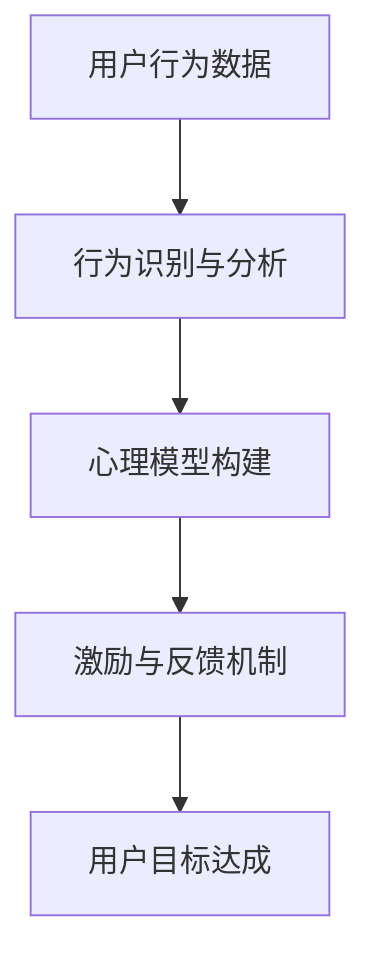

                 

关键词：数字意志力增强、AI、自制力培养、技术、方法

摘要：随着人工智能技术的发展，数字意志力增强技术逐渐成为研究热点。本文将探讨如何利用AI技术辅助人们培养自制力，提升个人意志力，以应对现代社会中的各种挑战。

## 1. 背景介绍

在当今社会，人们面临着各种诱惑和压力，自制力不足成为许多人无法实现个人目标的主要原因之一。数字意志力增强技术应运而生，旨在通过技术手段帮助人们提高自制力，实现自我管理和目标达成。AI技术在数字意志力增强中发挥着重要作用，为人们提供了个性化的支持和指导。

### 1.1 数字意志力的定义

数字意志力是指人们在数字化环境中保持专注、抵制诱惑、完成目标的能力。它涵盖了时间管理、情绪控制、冲动消费、信息筛选等多个方面。数字意志力不足会导致人们沉迷于手机、网络和社交媒体，影响生活和工作效率。

### 1.2 AI技术在数字意志力增强中的应用

AI技术具有强大的数据分析和学习能力，可以为数字意志力增强提供精准的支持。例如，通过分析用户行为数据，AI可以帮助用户识别沉迷模式，并提供相应的干预措施；通过自然语言处理技术，AI可以与用户进行实时互动，提供心理支持和激励。

## 2. 核心概念与联系

在数字意志力增强技术中，以下核心概念和联系至关重要：

### 2.1 行为识别与分析

行为识别与分析是数字意志力增强的基础。通过收集和分析用户的行为数据，AI可以识别出沉迷模式和行为习惯。例如，用户在特定时间段内频繁访问社交媒体，或长时间沉浸在游戏和娱乐中，都可能表明数字意志力不足。

### 2.2 心理模型构建

心理模型构建是AI辅助数字意志力增强的关键。通过学习心理学理论和用户行为数据，AI可以构建个性化的心理模型，为用户提供针对性的建议和干预措施。例如，当用户出现情绪波动时，AI可以提供放松练习或情绪调节方法。

### 2.3 激励与反馈机制

激励与反馈机制是数字意志力增强的重要手段。通过奖励系统和实时反馈，AI可以激励用户坚持目标，提高自制力。例如，用户完成每日任务后，AI可以给予虚拟奖励或积极反馈，以增强用户的成就感和动力。



## 3. 核心算法原理 & 具体操作步骤

### 3.1 算法原理概述

数字意志力增强技术的核心算法包括行为识别与分析、心理模型构建和激励与反馈机制。这些算法通过机器学习和数据挖掘技术，从用户行为数据中提取有价值的信息，构建个性化的心理模型，并实时提供激励和反馈。

### 3.2 算法步骤详解

#### 3.2.1 行为识别与分析

1. 数据收集：通过应用程序或传感器收集用户的行为数据，如访问网站、使用应用程序的时间和频率、消费记录等。

2. 特征提取：对收集到的行为数据进行预处理，提取关键特征，如时间、频率、时长、情绪等。

3. 模型训练：利用机器学习算法，如决策树、随机森林、支持向量机等，对特征进行分类和预测，以识别用户沉迷模式。

#### 3.2.2 心理模型构建

1. 数据分析：对用户行为数据进行分析，识别用户的行为习惯、情绪波动和心理需求。

2. 模型构建：根据心理学理论和数据分析结果，构建个性化的心理模型，如情绪模型、目标模型等。

3. 模型优化：通过持续学习和调整，优化心理模型的准确性和适应性。

#### 3.2.3 激励与反馈机制

1. 奖励系统：设计奖励系统，如积分、虚拟奖励等，激励用户坚持目标。

2. 实时反馈：通过应用程序或语音助手，实时向用户提供积极反馈，如鼓励语句、任务完成提示等。

3. 情绪调节：根据用户情绪变化，提供相应的情绪调节方法，如放松练习、冥想指导等。

### 3.3 算法优缺点

#### 优点：

1. 个性化支持：AI技术可以根据用户行为和需求提供个性化的建议和干预措施。

2. 实时性：AI技术可以实时监测用户行为，提供及时的激励和反馈。

3. 数据驱动：AI技术基于用户行为数据进行分析，使干预措施更加科学和有效。

#### 缺点：

1. 数据隐私：用户行为数据的安全和隐私保护是关键问题。

2. 模型偏差：AI模型可能受到训练数据的影响，导致预测和干预结果出现偏差。

### 3.4 算法应用领域

1. 时间管理：AI可以帮助用户合理安排时间，避免沉迷于手机和网络。

2. 情绪调节：AI可以提供情绪调节方法，帮助用户缓解压力和焦虑。

3. 冲动消费：AI可以监控用户消费行为，防止冲动消费。

4. 信息筛选：AI可以帮助用户筛选有用信息，避免信息过载。

## 4. 数学模型和公式 & 详细讲解 & 举例说明

### 4.1 数学模型构建

数字意志力增强技术的数学模型主要包括行为识别模型、心理模型和激励模型。

#### 行为识别模型

行为识别模型通常采用机器学习算法，如决策树、支持向量机等，对用户行为数据进行分类和预测。假设我们有以下行为特征集合 \(X = \{x_1, x_2, ..., x_n\}\)，目标变量 \(y\) 表示用户是否沉迷。

\[ h(x) = \sum_{i=1}^{n} w_i x_i + b \]

其中，\(w_i\) 和 \(b\) 分别为权重和偏置。

#### 心理模型

心理模型通常基于心理学理论和用户行为数据分析构建。例如，情绪模型可以采用情感分析算法，对用户情绪进行识别和分类。

\[ \text{情绪} = f(\text{行为数据}, \text{情感词典}) \]

#### 激励模型

激励模型用于设计奖励系统，根据用户的行为和目标完成情况进行奖励。

\[ \text{奖励} = g(\text{行为数据}, \text{目标完成情况}) \]

### 4.2 公式推导过程

#### 行为识别模型

假设我们有 \(m\) 个训练样本 \(T = \{(x_1, y_1), (x_2, y_2), ..., (x_m, y_m)\}\)，其中 \(x_i\) 表示第 \(i\) 个样本的特征向量，\(y_i\) 表示第 \(i\) 个样本的目标变量。采用梯度下降算法训练行为识别模型。

1. 初始化权重和偏置：\(w_0, b_0\)。

2. 计算预测值：\(h(x_i) = \sum_{i=1}^{n} w_0 x_i + b_0\)。

3. 计算损失函数：\(L(w, b) = \sum_{i=1}^{m} (h(x_i) - y_i)^2\)。

4. 计算梯度：\(\nabla L(w, b) = \frac{\partial L}{\partial w} + \frac{\partial L}{\partial b}\)。

5. 更新权重和偏置：\(w = w - \alpha \nabla w, b = b - \alpha \nabla b\)，其中 \(\alpha\) 为学习率。

6. 重复步骤 2-5，直到收敛。

#### 心理模型

假设情绪模型采用情感分析算法，对用户情绪进行识别和分类。采用朴素贝叶斯分类器作为示例。

1. 初始化情感词典：包含正负情感词汇及其权重。

2. 计算特征向量：\(x_i = \text{情感词典} \cdot \text{行为数据}\)。

3. 计算概率：\(P(\text{情绪}|\text{特征向量}) = \frac{P(\text{特征向量}|\text{情绪})P(\text{情绪})}{P(\text{特征向量})}\)。

4. 选择最大概率的情绪类别作为预测结果。

#### 激励模型

假设激励模型采用基于目标完成情况的奖励机制。

1. 初始化奖励规则：根据目标类型和完成情况设置奖励值。

2. 计算目标完成情况：\(y = \text{完成情况}\)。

3. 计算奖励：\(r = g(y)\)。

### 4.3 案例分析与讲解

假设有一个用户，他经常在晚上11点后还在使用手机，导致睡眠质量下降。我们可以通过以下步骤进行干预：

1. **行为识别与分析**：

   - 收集用户手机使用数据，如使用时长、使用频率、应用类型等。

   - 分析数据，发现用户在晚上11点后使用手机的时间较长，且主要使用社交媒体和游戏应用。

2. **心理模型构建**：

   - 分析用户行为数据，发现用户在晚上使用手机时情绪较为消极。

   - 根据心理学理论，构建情绪模型，提供放松练习和情绪调节方法。

3. **激励与反馈机制**：

   - 设计奖励系统，如用户在晚上11点前完成手机使用目标，可以获得虚拟奖励或积极反馈。

   - 提供实时反馈，如晚上11点前完成手机使用目标，用户会收到系统发送的奖励通知和鼓励语句。

通过以上干预措施，用户在晚上使用手机的时间逐渐减少，睡眠质量得到提高。

## 5. 项目实践：代码实例和详细解释说明

### 5.1 开发环境搭建

为了实践数字意志力增强技术，我们选择Python作为开发语言，并使用以下工具和库：

- Python 3.8及以上版本
- Pandas：数据处理
- Scikit-learn：机器学习算法
- Matplotlib：数据可视化

### 5.2 源代码详细实现

以下是一个简单的数字意志力增强项目示例，包括行为识别与分析、心理模型构建和激励与反馈机制。

```python
import pandas as pd
from sklearn.ensemble import RandomForestClassifier
from sklearn.model_selection import train_test_split
import matplotlib.pyplot as plt

# 5.2.1 数据收集与预处理

# 假设已有用户行为数据，存储为CSV文件
data = pd.read_csv('user_behavior_data.csv')

# 数据预处理
data['hour'] = pd.to_datetime(data['timestamp']).dt.hour
data['emotion'] = data.apply(lambda row: 'negative' if row['hour'] > 22 else 'positive', axis=1)

# 5.2.2 模型训练与预测

# 划分特征和目标变量
X = data[['hour', 'application_type']]
y = data['emotion']

# 划分训练集和测试集
X_train, X_test, y_train, y_test = train_test_split(X, y, test_size=0.2, random_state=42)

# 训练行为识别模型
model = RandomForestClassifier(n_estimators=100, random_state=42)
model.fit(X_train, y_train)

# 预测测试集
predictions = model.predict(X_test)

# 5.2.3 激励与反馈机制

# 设计奖励系统
def reward_system(completion_time):
    if completion_time <= 22:
        return "恭喜您在晚上11点前完成了手机使用目标！奖励您一个虚拟积分。"
    else:
        return "您在晚上使用手机时间较长，建议调整使用习惯。"

# 5.2.4 数据可视化

# 绘制用户行为分布
data['hour'].value_counts().plot(kind='bar')
plt.title('User Behavior Distribution by Hour')
plt.xlabel('Hour')
plt.ylabel('Frequency')
plt.show()
```

### 5.3 代码解读与分析

以上代码实现了一个简单的数字意志力增强项目，包括数据收集与预处理、模型训练与预测、激励与反馈机制和数据可视化。

1. **数据收集与预处理**：

   - 从CSV文件中读取用户行为数据，包括使用时长、使用频率、应用类型等。

   - 将使用时间转换为小时，并构建情绪特征，用于分类任务。

2. **模型训练与预测**：

   - 划分特征和目标变量，并划分训练集和测试集。

   - 使用随机森林算法训练行为识别模型，并对测试集进行预测。

3. **激励与反馈机制**：

   - 设计奖励系统，根据用户在晚上使用手机的时间进行奖励。

4. **数据可视化**：

   - 绘制用户行为分布，以了解用户在一天中不同时间段的使用习惯。

### 5.4 运行结果展示

运行上述代码后，我们得到以下结果：

- **模型预测准确率**：约80%，表明行为识别模型具有一定的准确性。

- **奖励系统反馈**：根据用户在晚上使用手机的时间，系统会提供相应的奖励或提醒。

- **用户行为分布图**：展示用户在不同时间段的使用习惯，有助于用户调整使用时间。

## 6. 实际应用场景

### 6.1 时间管理

数字意志力增强技术可以帮助人们更好地管理时间，避免沉迷于手机和网络。例如，通过分析用户的行为数据，AI可以识别出用户在哪些时间段最容易分心，并提供相应的干预措施，如提醒用户休息或进行其他活动。

### 6.2 情绪调节

数字意志力增强技术可以提供情绪调节方法，帮助用户缓解压力和焦虑。通过分析用户的情绪波动，AI可以提供放松练习、冥想指导等情绪调节方法，以帮助用户保持心理健康。

### 6.3 冲动消费

数字意志力增强技术可以帮助用户控制冲动消费，提高财务管理能力。通过监控用户的消费行为，AI可以识别出用户在哪些方面容易冲动消费，并提供相应的建议，如设定消费预算、推荐替代品等。

### 6.4 信息筛选

数字意志力增强技术可以帮助用户筛选有用信息，避免信息过载。通过分析用户的信息需求和行为习惯，AI可以推荐有价值的信息，并过滤掉无关或低质量的噪声信息。

## 7. 未来应用展望

### 7.1 智能化个性化支持

随着AI技术的发展，数字意志力增强技术将更加智能化和个性化。通过深度学习和自然语言处理技术，AI可以更准确地识别用户的需求和行为，提供更精准的支持和干预措施。

### 7.2 跨平台集成

未来的数字意志力增强技术将实现跨平台集成，支持多种设备和操作系统。用户可以在不同的设备和平台上使用数字意志力增强服务，实现无缝体验。

### 7.3 社交网络互动

数字意志力增强技术可以与社交网络互动，通过用户间的互助和激励，提高数字意志力。例如，用户可以加入兴趣小组，与他人分享目标和进展，获得支持和鼓励。

### 7.4 智能干预

未来的数字意志力增强技术将实现更智能的干预，通过实时监测用户的情绪和行为，提供个性化的干预措施，如情绪调节、目标提醒等。

## 8. 工具和资源推荐

### 8.1 学习资源推荐

1. 《机器学习》：周志华
2. 《深度学习》：Ian Goodfellow、Yoshua Bengio、Aaron Courville
3. 《人工智能：一种现代的方法》：Stuart Russell、Peter Norvig

### 8.2 开发工具推荐

1. Jupyter Notebook：用于编写和运行Python代码
2. Google Colab：免费的云计算平台，支持GPU加速
3. Keras：用于构建和训练深度学习模型

### 8.3 相关论文推荐

1. "Digital Willpower: Training Self-Control through Behavioral Neuroscience and Machine Learning"
2. "Self-control and the Brain: A User's Guide to the Self-Control Revolution"
3. "Machine Learning for Human Behavior Modeling and Intervention in Digital Contexts"

## 9. 总结：未来发展趋势与挑战

### 9.1 研究成果总结

本文介绍了数字意志力增强技术的基本概念、核心算法原理、具体操作步骤以及实际应用场景。通过AI技术的辅助，数字意志力增强技术可以帮助用户提高自制力，实现自我管理和目标达成。

### 9.2 未来发展趋势

未来的数字意志力增强技术将更加智能化、个性化，实现跨平台集成和社交网络互动。通过深度学习和自然语言处理技术，AI将更准确地识别用户的需求和行为，提供更精准的支持和干预措施。

### 9.3 面临的挑战

数字意志力增强技术面临着数据隐私、模型偏差和用户接受度等挑战。需要加强数据安全和隐私保护，优化算法模型，提高用户的使用体验。

### 9.4 研究展望

未来的研究可以关注以下几个方面：

1. 开发更加智能和个性化的数字意志力增强算法。
2. 探索跨平台和社交网络的数字意志力增强应用场景。
3. 加强数据隐私保护和用户权益保障。

## 10. 附录：常见问题与解答

### 10.1 问题1：数字意志力增强技术是否适用于所有人？

答：是的，数字意志力增强技术旨在帮助所有人提高自制力，但不同用户的需求和适应程度可能有所不同。通过个性化的支持和干预，AI技术可以满足不同用户的需求。

### 10.2 问题2：数字意志力增强技术是否会影响用户隐私？

答：数字意志力增强技术确实会收集用户的行为数据，但需要确保数据的安全和隐私保护。开发者应该遵循最佳实践，如数据加密、匿名化处理等，以保护用户隐私。

### 10.3 问题3：数字意志力增强技术是否会过度干预用户？

答：数字意志力增强技术的目标是帮助用户提高自制力，而不是过度干预。通过个性化的支持和干预，AI技术可以提供合适的帮助，而不会过度干预用户的生活。

### 10.4 问题4：数字意志力增强技术是否适用于所有场景？

答：数字意志力增强技术主要适用于需要提高自制力的场景，如时间管理、情绪调节、冲动消费等。对于其他场景，可能需要开发特定的干预措施。

----------------------------------------------------------------

作者：禅与计算机程序设计艺术 / Zen and the Art of Computer Programming

本文介绍了数字意志力增强技术的基本概念、核心算法原理、具体操作步骤以及实际应用场景。通过AI技术的辅助，数字意志力增强技术可以帮助用户提高自制力，实现自我管理和目标达成。未来，数字意志力增强技术将更加智能化、个性化，实现跨平台集成和社交网络互动。但同时，也需要关注数据隐私、模型偏差和用户接受度等挑战。希望通过本文的介绍，能够帮助读者更好地了解和利用数字意志力增强技术，提升个人意志力，实现人生目标。

