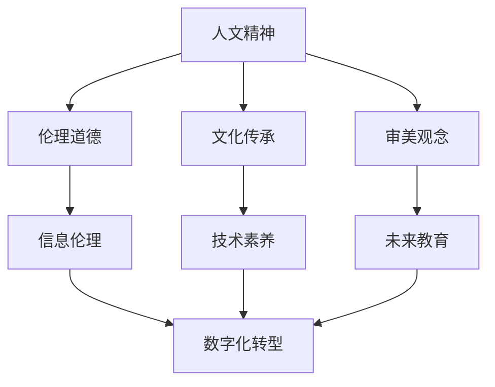

                 

关键词：数字人文，人文精神，数字化转型，信息伦理，技术素养，未来教育

> 摘要：在数字化时代，人文精神的重要性愈发凸显。本文探讨了数字时代背景下人文精神的传承问题，分析了人文精神与信息技术的关系，并提出了通过教育、技术伦理和信息素养等方面来实现人文精神传承的策略。文章旨在为数字化时代的人文传承提供一种新的思考视角。

## 1. 背景介绍

随着信息技术的迅猛发展，数字时代已经悄然来临。数字化技术正在改变人类的生活方式，推动社会的进步。然而，数字化进程中也不可避免地带来了一系列挑战，尤其是在人文精神传承方面。传统的人文精神包括伦理道德、文化传承、审美观念等，这些是人类文明的重要组成部分。在数字化的浪潮中，如何确保人文精神的传承，成为了一个亟待解决的问题。

### 1.1 数字化进程对人文精神的影响

数字化技术的普及和应用，改变了人们获取信息的方式，加速了信息的传播速度，但也在某种程度上削弱了人文精神的内涵。首先，数字化信息泛滥，使得人们对信息的筛选和处理能力减弱。其次，网络社交的虚拟化，导致人际关系变得疏远，伦理道德的边界模糊。此外，数字化时代的娱乐方式，如网络游戏、短视频等，对传统文化和审美观念带来了冲击。

### 1.2 人文精神的重要性

人文精神是人类的智慧结晶，是推动社会进步的重要力量。它不仅体现在文化传承、艺术创造等方面，还在社会伦理、道德规范中发挥着重要作用。在数字化时代，人文精神的传承至关重要。它不仅关系到个体的精神健康，也影响着整个社会的文明进程。

## 2. 核心概念与联系

### 2.1 人文精神

人文精神是指人类在长期历史发展过程中形成的，关于人类自身、社会、自然等领域的思考和认识。它包括伦理道德、文化传承、审美观念等核心要素。

### 2.2 信息技术

信息技术是指利用电子计算机和通信技术实现信息获取、处理、传输和利用的技术。它是数字化时代的重要支撑。

### 2.3 数字化转型

数字化转型是指将传统的业务模式、管理模式、工作方式等，通过信息技术的手段进行变革和创新，实现业务的数字化、智能化。

### 2.4 信息伦理

信息伦理是指在信息技术应用过程中，关于信息的获取、处理、使用等方面所应遵循的道德规范。

### 2.5 技术素养

技术素养是指个体在数字化时代，掌握信息技术知识、技能和态度的能力。

### 2.6 未来教育

未来教育是指适应数字化时代需求，以培养学生全面发展和创新精神为目标，以信息技术为支撑的新型教育模式。

### 2.7 Mermaid 流程图



## 3. 核心算法原理 & 具体操作步骤

### 3.1 算法原理概述

在数字时代的人文精神传承中，关键算法原理是信息过滤与筛选、人工智能伦理、数字化教育模型等。

### 3.2 算法步骤详解

1. **信息过滤与筛选**：利用算法对互联网上的海量信息进行过滤，筛选出有价值、符合伦理道德标准的信息。
2. **人工智能伦理**：在人工智能系统的设计和应用过程中，确保其遵循伦理规范，避免对人文精神的负面影响。
3. **数字化教育模型**：构建基于信息伦理和技术素养的数字化教育模型，培养具备人文精神的下一代。

### 3.3 算法优缺点

**优点**：

- 提高信息筛选效率，减少信息过载。
- 促进人工智能与人文精神的融合。
- 培养具备技术素养和人文精神的未来人才。

**缺点**：

- 需要高度的技术能力和伦理意识。
- 可能存在算法偏见和伦理漏洞。

### 3.4 算法应用领域

- 教育领域：构建数字化教育平台，推广人文精神教育。
- 社会治理：利用算法进行信息监管，维护社会伦理秩序。
- 文化产业：推动传统文化与现代技术的结合，传承文化精髓。

## 4. 数学模型和公式 & 详细讲解 & 举例说明

### 4.1 数学模型构建

在数字时代的人文精神传承中，构建一个综合性的数学模型至关重要。该模型应涵盖伦理道德、文化传承、审美观念等多个方面。

### 4.2 公式推导过程

假设 \(P\) 为人文精神传承的评估指标，\(X_1, X_2, X_3\) 分别代表伦理道德、文化传承、审美观念的得分，则人文精神传承评估公式为：

\[P = w_1X_1 + w_2X_2 + w_3X_3\]

其中，\(w_1, w_2, w_3\) 为权重系数，满足 \(w_1 + w_2 + w_3 = 1\)。

### 4.3 案例分析与讲解

假设一个数字化教育平台，其伦理道德得分 \(X_1 = 0.8\)，文化传承得分 \(X_2 = 0.7\)，审美观念得分 \(X_3 = 0.6\)，权重系数分别为 \(w_1 = 0.3, w_2 = 0.4, w_3 = 0.3\)。则该平台的人文精神传承评估得分为：

\[P = 0.3 \times 0.8 + 0.4 \times 0.7 + 0.3 \times 0.6 = 0.72\]

这个得分表明，该平台在人文精神传承方面还有待提高。

## 5. 项目实践：代码实例和详细解释说明

### 5.1 开发环境搭建

- Python 3.8及以上版本
- PyCharm 或 VSCode
- Matplotlib 库

### 5.2 源代码详细实现

```python
import matplotlib.pyplot as plt

# 定义人文精神传承评估函数
def evaluate_humanistics(w1, w2, w3, x1, x2, x3):
    return w1 * x1 + w2 * x2 + w3 * x3

# 设置权重系数和得分
w1, w2, w3 = 0.3, 0.4, 0.3
x1, x2, x3 = 0.8, 0.7, 0.6

# 计算评估得分
P = evaluate_humanistics(w1, w2, w3, x1, x2, x3)

# 绘制评估得分图表
plt.bar(['伦理道德', '文化传承', '审美观念'], [x1, x2, x3], color=['g', 'b', 'r'])
plt.title('人文精神传承评估得分')
plt.xlabel('维度')
plt.ylabel('得分')
plt.text(1.5, P, f'总分：{P:.2f}')
plt.show()
```

### 5.3 代码解读与分析

- **评估函数**：`evaluate_humanistics` 函数用于计算人文精神传承的评估得分。
- **参数设置**：`w1, w2, w3` 分别为权重系数，`x1, x2, x3` 分别为伦理道德、文化传承、审美观念的得分。
- **图表绘制**：使用 Matplotlib 库绘制评估得分柱状图，便于直观展示评估结果。

### 5.4 运行结果展示

运行上述代码后，将生成一个柱状图，展示伦理道德、文化传承、审美观念的得分，以及总分。

## 6. 实际应用场景

### 6.1 教育领域

在数字化教育中，通过构建人文精神传承评估模型，可以实时监测和评估学生的学习效果，确保学生在数字化学习过程中不丢失人文精神。

### 6.2 社会治理

在互联网平台上，利用算法对网络信息进行筛选和监管，确保信息内容符合伦理道德标准，维护网络环境的和谐。

### 6.3 文化产业

通过数字化技术，传承和弘扬传统文化，如利用虚拟现实技术重现历史场景，让观众在沉浸式体验中感受人文精神。

## 7. 未来应用展望

### 7.1 个性化教育

随着人工智能技术的发展，个性化教育将成为可能，根据学生的个性化需求，提供定制化的人文精神传承方案。

### 7.2 智慧城市

智慧城市将实现信息技术与城市管理的深度融合，通过数字化手段，提高城市治理水平和人文精神传承效果。

### 7.3 跨界融合

数字化时代，人文精神传承将跨界融合，如艺术、科技、教育等领域的融合，推动人文精神在更广泛的领域传承。

## 8. 总结：未来发展趋势与挑战

### 8.1 研究成果总结

本文从数字化进程对人文精神的影响、人文精神的重要性、核心概念与联系、核心算法原理等方面，探讨了数字时代的人文精神传承问题，并提出了一系列实现人文精神传承的策略。

### 8.2 未来发展趋势

- 个性化教育的发展
- 智慧城市的建设
- 跨界融合的推进

### 8.3 面临的挑战

- 信息伦理的保障
- 技术素养的培养
- 文化的传承与创新

### 8.4 研究展望

未来研究应关注如何更好地融合信息技术与人文精神，探索适应数字化时代需求的人文精神传承模式。

## 9. 附录：常见问题与解答

### 9.1 问题1：数字化时代如何确保人文精神的传承？

解答：通过构建数字化教育模型，加强信息伦理教育，提高公众的技术素养，从而在数字化进程中确保人文精神的传承。

### 9.2 问题2：人工智能在人文精神传承中扮演什么角色？

解答：人工智能可以通过算法筛选和推荐符合人文精神的信息，辅助教育和文化传承，推动人文精神在数字化时代的传播。

### 9.3 问题3：如何提高公众的技术素养？

解答：通过开展技术教育、推广信息技术知识、提供实践机会，提高公众的技术素养，从而更好地应对数字化时代的挑战。

## 作者署名

作者：禅与计算机程序设计艺术 / Zen and the Art of Computer Programming
----------------------------------------------------------------

这篇文章通过深入探讨数字化时代的人文精神传承问题，提出了许多有价值的观点和策略，旨在为数字时代的人文传承提供一种新的思考视角。希望这篇文章能对读者有所启发和帮助。

