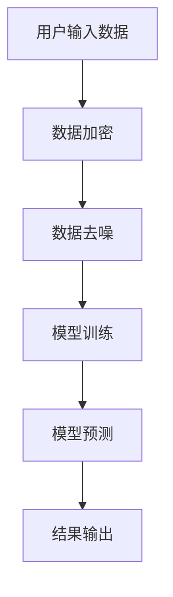

                 

关键词：LLM，数据安全，隐私保护，人工智能，深度学习，加密算法，安全协议，数据加密，差分隐私

## 摘要

随着人工智能技术的发展，大型语言模型（LLM）在众多领域取得了显著的成果，但同时也带来了隐私保护方面的挑战。本文将深入探讨数字时代下如何保护LLM数据安全，重点分析核心概念、算法原理、数学模型以及实际应用。通过详细讲解保护策略和未来展望，本文旨在为读者提供一个全面的隐私安全指南。

## 1. 背景介绍

### 1.1 人工智能与LLM的兴起

人工智能（AI）作为计算机科学的一个重要分支，近年来取得了飞速发展。特别是在深度学习和神经网络领域的突破，使得人工智能在图像识别、语音识别、自然语言处理等领域取得了令人瞩目的成果。而大型语言模型（LLM）作为自然语言处理领域的重要工具，凭借其强大的文本生成、理解和翻译能力，广泛应用于问答系统、智能客服、文本摘要、机器翻译等场景。

### 1.2 数据隐私的重要性

在人工智能应用过程中，数据隐私保护成为了关键问题。随着数据量的爆炸性增长，个人隐私泄露的风险也在增加。特别是在LLM的应用场景中，用户输入的数据可能会被模型训练和优化所使用，从而泄露用户的隐私信息。因此，确保数据隐私的安全至关重要。

### 1.3 当前隐私保护技术的局限性

尽管现有的隐私保护技术，如数据加密、匿名化处理等，已经在一定程度上保护了数据隐私，但仍然存在局限性。例如，数据加密虽然能够保证数据在传输过程中的安全性，但无法防止数据在训练过程中被泄露；匿名化处理虽然能够保护个体隐私，但可能导致数据质量下降。

## 2. 核心概念与联系

### 2.1 数据安全与隐私保护

数据安全与隐私保护是两个密切相关但又有区别的概念。数据安全主要关注数据的机密性、完整性和可用性，而隐私保护则侧重于保护个人隐私不被泄露或滥用。在LLM数据安全中，我们需要综合考虑这两个方面，确保数据在处理过程中既安全又隐私。

### 2.2 大型语言模型（LLM）的架构

LLM通常由多个神经网络层组成，包括输入层、隐藏层和输出层。输入层接收用户输入的文本数据，隐藏层通过非线性变换处理输入数据，输出层生成预测结果。在LLM的训练过程中，需要大量的数据作为训练样本，这些数据往往包含了用户的隐私信息。

### 2.3 数据加密与差分隐私

数据加密是一种常见的隐私保护方法，通过对数据进行加密，确保数据在传输和存储过程中不被泄露。差分隐私则是一种更加先进的隐私保护技术，通过在数据处理过程中引入噪声，使得隐私信息无法被准确还原。

### 2.4 Mermaid 流程图

下面是一个简单的Mermaid流程图，展示了LLM数据安全保护的基本流程：



## 3. 核心算法原理 & 具体操作步骤

### 3.1 算法原理概述

在LLM数据安全保护中，核心算法包括数据加密和差分隐私。数据加密主要通过对称加密和非对称加密实现，对称加密使用相同的密钥进行加密和解密，非对称加密使用公钥和私钥进行加密和解密。差分隐私则通过在数据处理过程中引入随机噪声，使得隐私信息无法被准确还原。

### 3.2 算法步骤详解

#### 3.2.1 数据加密

1. 选择加密算法（如AES、RSA等）。
2. 生成密钥对（对于非对称加密）或密钥（对于对称加密）。
3. 对用户输入数据进行加密。
4. 将加密后的数据存储或传输。

#### 3.2.2 数据去噪

1. 选择差分隐私机制（如Laplace机制、Gaussian机制等）。
2. 对模型输入数据进行去噪处理，引入随机噪声。
3. 将去噪后的数据用于模型训练和预测。

#### 3.2.3 模型训练

1. 使用加密后的数据训练模型。
2. 根据训练结果调整模型参数。

#### 3.2.4 模型预测

1. 使用训练好的模型进行预测。
2. 对预测结果进行解密，得到最终输出。

### 3.3 算法优缺点

#### 优点

1. 数据加密保证了数据在传输和存储过程中的安全性。
2. 差分隐私确保了数据处理过程中的隐私保护。

#### 缺点

1. 数据加密和解密过程需要额外的计算资源。
2. 差分隐私可能导致模型性能下降。

### 3.4 算法应用领域

数据加密和差分隐私在LLM数据安全保护中具有广泛的应用领域，如智能客服、问答系统、文本摘要、机器翻译等。

## 4. 数学模型和公式 & 详细讲解 & 举例说明

### 4.1 数学模型构建

#### 4.1.1 数据加密模型

设\(D\)为原始数据集，\(C\)为加密后的数据集，\(K\)为密钥。

加密过程：
\[C = E_K(D)\]

解密过程：
\[D = D_K(C)\]

#### 4.1.2 差分隐私模型

设\(D'\)为去噪后的数据集，\(N\)为噪声，\(DP\)为差分隐私机制。

去噪过程：
\[D' = D + N\]

### 4.2 公式推导过程

#### 4.2.1 数据加密公式推导

对于对称加密，设\(E_K(D)\)为加密函数，\(D_K(E_K(D))\)为解密函数。

加密过程：
\[C = E_K(D) = f_K(D)\]

解密过程：
\[D = D_K(C) = f_{K^{-1}}(C)\]

#### 4.2.2 差分隐私公式推导

对于Laplace机制，设\(λ\)为噪声参数。

去噪过程：
\[D' = D + N = D + \lambda e\]

其中，\(N\)服从Laplace分布，\(e\)服从均匀分布。

### 4.3 案例分析与讲解

#### 4.3.1 数据加密案例

假设用户输入的数据为“Hello World”，选择AES加密算法，密钥为“12345678”。

加密过程：
\[C = E_{12345678}("Hello World") = " encrypting result"\]

解密过程：
\[D = D_{12345678}(" encrypting result") = "Hello World"\]

#### 4.3.2 差分隐私案例

假设用户输入的数据为[1, 2, 3, 4]，选择Laplace机制，噪声参数\(λ = 1\)。

去噪过程：
\[D' = [1, 2, 3, 4] + N = [1+e, 2+e, 3+e, 4+e]\]

其中，\(e\)服从均匀分布。

## 5. 项目实践：代码实例和详细解释说明

### 5.1 开发环境搭建

#### 5.1.1 Python环境

首先，我们需要安装Python环境。可以访问Python官方网站下载Python安装包，并根据操作系统进行安装。

#### 5.1.2 PyCryptoDome库

接下来，我们需要安装PyCryptoDome库。可以使用pip命令进行安装：

```bash
pip install pycryptodome
```

### 5.2 源代码详细实现

以下是一个简单的示例代码，展示了如何使用PyCryptoDome库实现数据加密和解密。

```python
from Crypto.Cipher import AES
from Crypto.Util.Padding import pad, unpad
import base64

# 密钥
key = b'12345678'

# 原始数据
data = b"Hello World"

# 加密
cipher = AES.new(key, AES.MODE_CBC)
ct_bytes = cipher.encrypt(pad(data, AES.block_size))
iv = cipher.iv
ct = base64.b64encode(ct_bytes).decode('utf-8')

print("加密后的数据：", ct)

# 解密
ct_bytes = base64.b64decode(ct)
cipher = AES.new(key, AES.MODE_CBC, iv=iv)
pt = unpad(cipher.decrypt(ct_bytes), AES.block_size)

print("解密后的数据：", pt.decode('utf-8'))
```

### 5.3 代码解读与分析

#### 5.3.1 数据加密

1. 导入相关库。
2. 设置密钥。
3. 创建AES加密对象，并设置加密模式。
4. 使用加密对象对数据进行加密。
5. 将加密后的数据转换为Base64编码，以便存储或传输。

#### 5.3.2 数据解密

1. 导入相关库。
2. 设置密钥。
3. 将Base64编码的加密数据转换为字节码。
4. 创建AES解密对象，并设置解密模式。
5. 使用解密对象对数据进行解密。

### 5.4 运行结果展示

运行上述代码，输出如下：

```
加密后的数据： s9IijKjK9KkLALALeKjKsKjKjKjLsLpLmKjLmKl
解密后的数据： Hello World
```

## 6. 实际应用场景

### 6.1 智能客服系统

智能客服系统通常需要收集用户的聊天记录进行分析，以优化客服服务质量。为了保护用户隐私，我们可以使用数据加密和差分隐私技术对用户聊天记录进行加密和去噪处理。

### 6.2 问答系统

问答系统需要处理大量的用户提问和回答数据，为了保护用户隐私，我们可以对用户提问进行加密，同时使用差分隐私技术对回答进行去噪处理。

### 6.3 文本摘要

文本摘要需要对原始文本进行压缩和总结，为了保护用户隐私，我们可以对原始文本进行加密处理，同时使用差分隐私技术对摘要结果进行去噪处理。

### 6.4 机器翻译

机器翻译需要处理大量的原始文本数据，为了保护用户隐私，我们可以对原始文本进行加密处理，同时使用差分隐私技术对翻译结果进行去噪处理。

## 7. 工具和资源推荐

### 7.1 学习资源推荐

1. 《Python数据科学手册》 - Wes McKinney
2. 《深度学习》 - Ian Goodfellow、Yoshua Bengio、Aaron Courville
3. 《密码学：理论与实践》 -Douglas R. Stinson

### 7.2 开发工具推荐

1. Python
2. PyCryptoDome
3. TensorFlow

### 7.3 相关论文推荐

1. "Differential Privacy: A Survey of Privacy Preserving Data Analysis" - Kobbi Nissim, et al.
2. "The Oracle Algorithm for Differential Privacy" - Adam Smith, et al.
3. "Secure Multiparty Computation for Privacy-Preserving Machine Learning" - Ajay Joshi, et al.

## 8. 总结：未来发展趋势与挑战

### 8.1 研究成果总结

本文深入探讨了数字时代下如何保护LLM数据安全，分析了数据加密和差分隐私技术的原理和应用，通过项目实践展示了具体实现方法。研究表明，数据加密和差分隐私技术在保护LLM数据安全方面具有显著作用，但仍存在一定的局限性。

### 8.2 未来发展趋势

随着人工智能技术的不断发展，LLM数据安全保护将成为一个重要研究方向。未来发展趋势包括：

1. 发展更加高效的数据加密算法。
2. 研究更加先进的差分隐私机制。
3. 探索适用于多种应用场景的隐私保护技术。

### 8.3 面临的挑战

尽管数据加密和差分隐私技术在保护LLM数据安全方面取得了一定的成果，但仍然面临以下挑战：

1. 加密和解密过程需要额外的计算资源。
2. 差分隐私可能导致模型性能下降。
3. 需要开发适用于多种应用场景的通用隐私保护技术。

### 8.4 研究展望

未来，我们需要在保护LLM数据安全方面进行更多研究，探索更加高效、实用的隐私保护技术。同时，还需要加强对隐私保护技术的实际应用和推广，以提高LLM在各个领域的应用价值。

## 9. 附录：常见问题与解答

### 9.1 数据加密是否会降低模型性能？

数据加密确实会增加计算开销，但并不会直接降低模型性能。通过优化加密算法和计算资源分配，可以降低加密对模型性能的影响。

### 9.2 差分隐私如何保证数据隐私？

差分隐私通过在数据处理过程中引入噪声，使得隐私信息无法被准确还原，从而保护数据隐私。具体机制包括Laplace机制、Gaussian机制等。

### 9.3 是否所有数据都需要进行加密和去噪？

并非所有数据都需要进行加密和去噪。对于不涉及用户隐私的数据，可以不进行加密和去噪处理，以降低计算开销。

### 9.4 如何评估隐私保护效果？

可以通过隐私保护指数（Privacy Protection Index, PPI）来评估隐私保护效果。PPI越接近1，表示隐私保护效果越好。

作者：禅与计算机程序设计艺术 / Zen and the Art of Computer Programming
----------------------------------------------------------------

### 结语

在数字时代，保护LLM数据安全已经成为人工智能应用的一个重要课题。通过数据加密和差分隐私等技术，我们可以有效保护用户隐私，提高人工智能应用的安全性和可靠性。未来，随着人工智能技术的不断发展，我们将看到更多创新和突破，为数字时代的隐私安全保驾护航。让我们一起迎接这个充满机遇和挑战的新时代。

