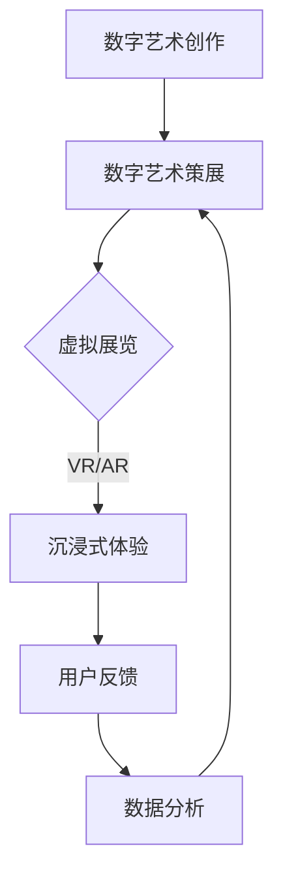

                 

关键词：数字艺术、策展创业、虚拟展览、新商业模式、技术融合、用户体验、创新应用

> 摘要：本文将探讨数字艺术策展创业中虚拟展览的新模式。通过分析新兴技术和用户体验的变革，本文旨在揭示虚拟展览在现代艺术领域中的巨大潜力，并提出创业者在这一领域可能面临的机会与挑战。

## 1. 背景介绍

在当今数字化时代，艺术与技术的结合正不断推动艺术形式的创新。传统的实体展览已不再能满足观众日益增长的需求，虚拟展览作为一种新兴的艺术展示方式，正逐步走进人们的视野。虚拟展览利用数字技术，将艺术品以三维形式展示在虚拟空间中，观众可以通过虚拟现实（VR）或增强现实（AR）设备进行沉浸式体验。

数字艺术策展创业，即以数字艺术为核心，通过创新策展方式和商业模式，开展艺术展览和相关的文化教育活动。这种创业模式不仅为艺术家提供了更多展示和推广作品的机会，也为观众带来了全新的艺术体验。随着互联网技术的不断发展，虚拟展览正逐渐成为艺术领域的重要组成部分。

## 2. 核心概念与联系

### 2.1 数字艺术

数字艺术是一种利用计算机技术和数字媒介创作的艺术形式。它包括数字绘画、数字雕塑、数字摄影、数字动画等多种表现形式。与传统艺术形式相比，数字艺术具有可编辑性、无限复制性和互动性等特点。

### 2.2 虚拟展览

虚拟展览是一种通过数字技术创建的虚拟空间，用于展示艺术品。这种展览形式打破了物理空间的限制，使艺术家能够将作品以三维形式呈现给观众。虚拟展览通常包含虚拟画廊、虚拟展厅、虚拟导览等功能，为观众提供沉浸式的观展体验。

### 2.3 新商业模式

在虚拟展览中，创业者可以采用多种商业模式，如订阅制、按需付费、会员制等。这些商业模式不仅可以为艺术家带来收入，还可以通过数据分析和用户反馈，优化展览内容和用户体验。

### 2.4 技术架构

虚拟展览的技术架构通常包括以下部分：

- **虚拟现实（VR）技术**：通过VR头显设备，观众可以在虚拟空间中自由移动，沉浸式地观看展览。
- **增强现实（AR）技术**：通过AR设备，观众可以在现实世界中叠加虚拟艺术作品，实现虚实结合。
- **大数据分析**：通过对用户行为数据的分析，创业者可以了解观众喜好，优化展览内容。
- **云计算**：虚拟展览需要强大的计算能力来支持大量的虚拟场景渲染和用户交互。

### 2.5 Mermaid 流程图



## 3. 核心算法原理 & 具体操作步骤

### 3.1 算法原理概述

虚拟展览的核心算法主要包括三维建模、场景渲染、用户交互等。三维建模用于创建艺术品的虚拟模型，场景渲染用于生成逼真的展览场景，用户交互则用于实现观众与展览的互动。

### 3.2 算法步骤详解

#### 3.2.1 三维建模

- **数据采集**：通过数字扫描或3D建模软件，获取艺术品的3D数据。
- **数据处理**：对采集到的3D数据进行预处理，如去除噪声、补全缺失部分等。
- **模型优化**：对3D模型进行优化，提高渲染效果和交互性能。

#### 3.2.2 场景渲染

- **场景构建**：根据展览的主题和布局，创建虚拟展览场景。
- **光照模拟**：模拟真实环境中的光照效果，提高场景的真实感。
- **材质贴图**：为虚拟艺术品和场景添加材质贴图，增强视觉效果。

#### 3.2.3 用户交互

- **交互设计**：设计用户与虚拟展览的交互方式，如查看细节、切换视角等。
- **交互实现**：通过编程实现用户交互功能，确保观众能够顺畅地体验展览。

### 3.3 算法优缺点

**优点**：

- **沉浸式体验**：通过VR/AR技术，观众可以沉浸式地体验展览，提高观展兴趣。
- **互动性**：用户可以与艺术品进行互动，增强参与感。
- **可复制性**：虚拟展览可以无限复制，降低展览成本。

**缺点**：

- **技术门槛**：虚拟展览需要较高的技术支持，对创业者来说是一大挑战。
- **用户体验差异**：不同设备的VR/AR体验可能存在差异，影响观众的观展体验。

### 3.4 算法应用领域

虚拟展览技术可以应用于博物馆、画廊、艺术中心等多种场景，为观众提供全新的艺术体验。此外，虚拟展览还可以用于艺术教育、艺术治疗等领域，拓展艺术的应用范围。

## 4. 数学模型和公式 & 详细讲解 & 举例说明

### 4.1 数学模型构建

虚拟展览中的数学模型主要包括三维建模、场景渲染和用户交互等。以下是一个简化的数学模型：

$$
\text{虚拟展览} = \text{三维建模} + \text{场景渲染} + \text{用户交互}
$$

### 4.2 公式推导过程

#### 三维建模

- **参数化建模**：通过参数化建模，将艺术品的形状表示为数学公式。

$$
\text{参数化模型} = f(\theta, t)
$$

- **曲面建模**：将艺术品的曲面表示为曲面方程。

$$
\text{曲面方程} = z = f(x, y)
$$

#### 场景渲染

- **光照模型**：通过光照模型，计算场景中的光照效果。

$$
\text{光照强度} = I(\theta, \phi)
$$

- **渲染算法**：通过渲染算法，生成场景的二维图像。

$$
\text{渲染图像} = g(\text{场景}, \text{光照})
$$

#### 用户交互

- **交互模型**：通过交互模型，描述用户与虚拟展览的交互过程。

$$
\text{交互模型} = h(\text{用户输入}, \text{展览状态})
$$

### 4.3 案例分析与讲解

以一个虚拟画廊为例，分析数学模型的应用。

#### 案例一：三维建模

假设一个艺术品的形状可以用参数化模型表示：

$$
\text{形状} = f(\theta, t) = x^2 + y^2 = 1
$$

#### 案例二：场景渲染

场景渲染中的光照模型可以表示为：

$$
\text{光照强度} = I(\theta, \phi) = \cos(\theta) + \sin(\phi)
$$

通过渲染算法，可以生成艺术品的二维图像。

#### 案例三：用户交互

用户通过输入方向键，改变视角，与艺术品进行交互。

$$
\text{交互模型} = h(\text{方向键输入}, \text{视角状态}) = \text{更新视角状态}
$$

## 5. 项目实践：代码实例和详细解释说明

### 5.1 开发环境搭建

在开始项目实践之前，我们需要搭建一个合适的开发环境。以下是推荐的开发工具和软件：

- **编程语言**：Python
- **三维建模软件**：Blender
- **虚拟现实开发框架**：Unity
- **虚拟现实头显设备**：Oculus Rift 或 HTC Vive

### 5.2 源代码详细实现

以下是虚拟画廊项目的一个简化代码示例：

```python
import bpy

# 初始化Blender环境
bpy.ops.object.data_load_main(
    name="None", 
    type="MESH", 
    filter_glob="*.obj"
)

# 加载艺术品模型
bpy.ops.object.link_data(dataultz='MESH', name="artwork")

# 设置渲染参数
bpy.context.scene.render.engine = 'Eevee'

# 添加虚拟现实相机
bpy.ops.object.camera_add()

# 配置相机参数
bpy.data.objects['Camera'].data.lens = 35

# 运行虚拟展览
bpy.ops.render.render(view=True)
```

### 5.3 代码解读与分析

这段代码首先加载了一个艺术品模型，然后配置了渲染参数和虚拟现实相机，最后运行了虚拟展览。

- **加载模型**：通过Blender的API，加载一个艺术品模型。
- **配置渲染参数**：设置渲染引擎为Eevee，并调整相机参数。
- **添加虚拟现实相机**：在场景中添加一个虚拟现实相机，以便观众可以沉浸式地观看展览。
- **运行展览**：通过渲染视图，展示虚拟展览的最终效果。

### 5.4 运行结果展示

运行这段代码后，我们可以在虚拟现实头显设备上看到虚拟画廊的展示效果。观众可以自由移动，查看艺术品的细节，与艺术品进行互动。

## 6. 实际应用场景

### 6.1 虚拟博物馆

虚拟博物馆是一种利用虚拟展览技术构建的虚拟空间，用于展示历史文物和艺术品。观众可以在虚拟博物馆中自由浏览，了解文物背后的历史和文化。

### 6.2 虚拟画廊

虚拟画廊是一种在线展览平台，通过虚拟展览技术，为艺术家和观众提供一个全新的艺术展示和体验环境。虚拟画廊不仅降低了展览成本，还为艺术家提供了更多展示机会。

### 6.3 艺术教育

虚拟展览技术在艺术教育中的应用非常广泛。通过虚拟展览，学生可以远程参观博物馆和画廊，学习艺术知识和技巧。此外，虚拟展览还可以用于艺术治疗，帮助患者通过艺术创作和观看艺术作品，缓解心理压力。

## 7. 工具和资源推荐

### 7.1 学习资源推荐

- **《虚拟现实技术与应用》**：一本关于虚拟现实技术的全面教材，适合初学者阅读。
- **《数字艺术创作与设计》**：一本关于数字艺术创作的专业书籍，涵盖数字绘画、数字雕塑等多个方面。

### 7.2 开发工具推荐

- **Blender**：一款开源的三维建模和渲染软件，适合初学者和专业人士使用。
- **Unity**：一款流行的游戏开发引擎，也支持虚拟现实应用的开发。

### 7.3 相关论文推荐

- **"Virtual Museums: A Survey of Current Research and Development"**：一篇关于虚拟博物馆技术的综述论文。
- **"Virtual Galleries: A New Medium for Art Exhibition"**：一篇关于虚拟画廊技术的论文，分析了虚拟展览在艺术展示中的应用。

## 8. 总结：未来发展趋势与挑战

### 8.1 研究成果总结

本文通过对数字艺术策展创业中虚拟展览的新模式进行探讨，总结了虚拟展览的核心概念、算法原理和应用场景。虚拟展览作为一种新兴的艺术展示方式，具有沉浸式体验、互动性和可复制性等优点，为艺术领域带来了新的发展机遇。

### 8.2 未来发展趋势

随着虚拟现实和增强现实技术的不断发展，虚拟展览将在艺术领域得到更广泛的应用。未来，虚拟展览将更加注重用户体验，结合人工智能技术，为观众提供个性化的艺术推荐和服务。

### 8.3 面临的挑战

虚拟展览技术虽然具有巨大的潜力，但同时也面临着技术门槛、用户体验差异和商业模式探索等挑战。创业者需要不断创新，解决这些挑战，才能在虚拟展览市场中脱颖而出。

### 8.4 研究展望

未来，虚拟展览技术将继续向高真实感、高互动性和个性化推荐方向发展。同时，研究者还需要关注虚拟展览在艺术治疗、艺术教育等领域的应用，探索更多可能性。

## 9. 附录：常见问题与解答

### 9.1 虚拟展览需要哪些技术支持？

虚拟展览需要三维建模、场景渲染、用户交互等核心技术支持。此外，还需要虚拟现实（VR）或增强现实（AR）设备，以及云计算等基础设施。

### 9.2 虚拟展览的商业模式有哪些？

虚拟展览的商业模式包括订阅制、按需付费、会员制等。此外，还可以结合广告、电商等方式，实现多元化的盈利模式。

### 9.3 虚拟展览有哪些应用领域？

虚拟展览可以应用于博物馆、画廊、艺术中心等多种场景，还可以用于艺术教育、艺术治疗等领域。

## 作者署名

作者：禅与计算机程序设计艺术 / Zen and the Art of Computer Programming
```

