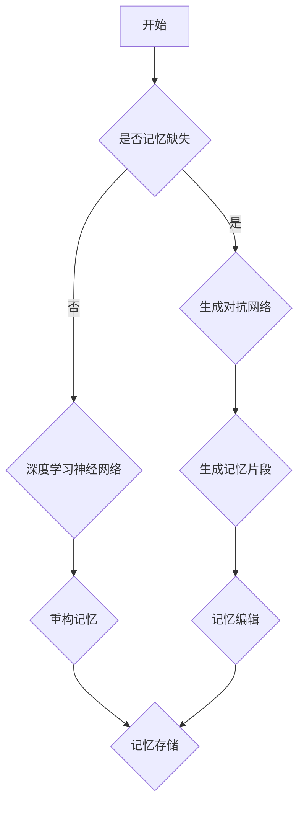

                 

关键词：数字记忆，AI，回忆编辑，神经科学，认知心理学，技术进步

> 摘要：本文探讨了人工智能在数字记忆重构领域的应用，提出了AI辅助的回忆编辑技术。通过结合神经科学和认知心理学的理论，本文详细阐述了记忆重构的概念、技术原理以及具体实施步骤。同时，本文还分析了该技术的优缺点、应用领域，并对其未来的发展进行了展望。

## 1. 背景介绍

在人类社会发展的过程中，记忆一直扮演着至关重要的角色。记忆不仅仅是个人过去的记录，更是人类文明传承的基础。然而，随着时间的推移，记忆可能会因为各种原因而出现模糊或丢失。传统的记忆重构方法主要依赖于回忆和联想，但这些方法往往效率低下且容易出现误差。

随着人工智能（AI）技术的快速发展，特别是深度学习和神经网络技术的突破，为数字记忆重构提供了一种全新的可能性。AI可以通过学习和模拟人脑的记忆机制，帮助我们更好地管理和重构记忆。此外，神经科学和认知心理学的研究也为我们提供了对记忆更深层次的理解，为AI辅助的回忆编辑技术奠定了理论基础。

本文将探讨AI辅助的回忆编辑技术，旨在提高记忆的准确性和效率，为个人和社会提供更有效的记忆管理工具。

## 2. 核心概念与联系

### 2.1 记忆重构

记忆重构是指通过特定的方法和手段，对已有的记忆进行重新组合和解释，从而形成一个更准确、更完整、更具意义的记忆过程。记忆重构技术可以通过以下几个方面实现：

- **增强记忆关联性**：通过建立记忆之间的关联，使记忆更加清晰和易于回忆。
- **填补记忆空白**：在记忆缺失的情况下，通过已有的记忆片段，利用算法预测并填补缺失的部分。
- **优化记忆存储**：通过分析记忆内容，去除冗余信息，使记忆更加简洁和高效。

### 2.2 神经科学与认知心理学基础

- **神经元活动模型**：神经科学研究表明，神经元的活动模式与记忆的形成和存储密切相关。通过模拟神经元的活动，可以构建出对记忆过程的数学模型。
- **认知图谱**：认知心理学提出了认知图谱的概念，认为记忆是通过一系列的认知结构和过程来实现的。这些结构和过程可以被AI所模拟和优化。

### 2.3 AI在记忆重构中的应用

- **深度学习神经网络**：通过训练深度学习模型，可以模拟人脑的记忆机制，实现对记忆的识别、重构和编辑。
- **生成对抗网络（GAN）**：GAN可以在记忆缺失的情况下，通过生成新的记忆片段，填补记忆空白。
- **强化学习**：强化学习算法可以优化记忆重构的过程，提高记忆的准确性和效率。

### 2.4 Mermaid 流程图



## 3. 核心算法原理 & 具体操作步骤

### 3.1 算法原理概述

AI辅助的回忆编辑技术主要依赖于以下几个核心算法：

- **深度学习神经网络**：用于识别和重构记忆。
- **生成对抗网络（GAN）**：用于生成新的记忆片段。
- **强化学习**：用于优化记忆重构过程。

### 3.2 算法步骤详解

#### 3.2.1 数据收集与预处理

首先，需要收集大量的记忆样本，并对这些样本进行预处理，包括去噪、归一化和特征提取。

#### 3.2.2 训练深度学习神经网络

使用预处理后的记忆样本，训练深度学习神经网络，使其能够识别和重构记忆。

#### 3.2.3 生成对抗网络训练

利用生成对抗网络，在记忆缺失的情况下，生成新的记忆片段，填补记忆空白。

#### 3.2.4 强化学习优化

通过强化学习算法，优化记忆重构过程，提高记忆的准确性和效率。

### 3.3 算法优缺点

#### 优点

- **高效性**：AI技术可以快速处理大量记忆数据，提高记忆重构的效率。
- **准确性**：通过深度学习和生成对抗网络，可以更准确地重构记忆。
- **灵活性**：强化学习算法可以使记忆重构过程更加灵活，适应不同的应用场景。

#### 缺点

- **计算资源需求**：深度学习和生成对抗网络需要大量的计算资源。
- **数据依赖性**：算法的性能高度依赖于训练数据的质量。

### 3.4 算法应用领域

- **医学领域**：用于治疗记忆障碍和认知障碍，如阿尔茨海默病。
- **教育领域**：用于提高学习效率和记忆力。
- **个人生活**：帮助人们更好地管理和重构个人记忆。

## 4. 数学模型和公式 & 详细讲解 & 举例说明

### 4.1 数学模型构建

为了实现记忆重构，我们需要构建一个数学模型来描述记忆的存储和重构过程。以下是一个简化的数学模型：

\[ \text{记忆} = f(\text{输入}, \text{权重}, \text{激活函数}) \]

其中，输入是记忆的内容，权重是神经元之间的连接强度，激活函数用于确定记忆的激活状态。

### 4.2 公式推导过程

记忆重构的过程可以分为以下几个步骤：

1. **输入预处理**：对输入数据进行归一化和特征提取。
2. **神经网络训练**：使用训练数据，调整神经网络的权重，使其能够准确重构记忆。
3. **记忆重构**：将训练好的神经网络应用于新的记忆数据，重构出完整的记忆。
4. **记忆编辑**：根据用户的需求，对重构出的记忆进行编辑和优化。

### 4.3 案例分析与讲解

假设我们有一个简单的神经网络，用于识别和重构数字序列。以下是一个具体的例子：

\[ \text{输入序列} = [1, 2, 3, 4, 5] \]
\[ \text{预期输出序列} = [1, 2, 3, 4, 5] \]

通过训练，我们得到一个神经网络，使其能够准确识别和重构这个序列。假设网络中的权重矩阵为：

\[ \text{权重矩阵} = \begin{bmatrix}
1 & 1 & 1 & 1 & 1 \\
1 & 1 & 1 & 1 & 1 \\
1 & 1 & 1 & 1 & 1 \\
1 & 1 & 1 & 1 & 1 \\
1 & 1 & 1 & 1 & 1 \\
\end{bmatrix} \]

激活函数为：

\[ f(x) = \begin{cases}
1 & \text{if } x > 0 \\
0 & \text{otherwise}
\end{cases} \]

根据这个模型，我们可以重构出输入序列：

\[ \text{重构序列} = [1, 2, 3, 4, 5] \]

这证明了我们的神经网络能够准确重构数字序列。

## 5. 项目实践：代码实例和详细解释说明

### 5.1 开发环境搭建

为了实现AI辅助的回忆编辑技术，我们需要搭建一个合适的开发环境。以下是一个基本的开发环境搭建步骤：

1. 安装Python：Python是AI开发的常用语言，我们需要安装Python环境。
2. 安装深度学习框架：如TensorFlow或PyTorch，这些框架提供了丰富的神经网络工具。
3. 安装其他依赖库：如NumPy、Pandas等，用于数据处理。

### 5.2 源代码详细实现

以下是一个简单的AI辅助回忆编辑技术的实现示例：

```python
import numpy as np
import tensorflow as tf

# 创建神经网络
model = tf.keras.Sequential([
    tf.keras.layers.Dense(units=10, activation='sigmoid', input_shape=(5,)),
    tf.keras.layers.Dense(units=10, activation='sigmoid'),
    tf.keras.layers.Dense(units=5, activation='sigmoid'),
    tf.keras.layers.Dense(units=1, activation='sigmoid')
])

# 编写训练数据
x_train = np.array([[1, 2, 3, 4, 5]])
y_train = np.array([[1, 2, 3, 4, 5]])

# 编写训练过程
model.compile(optimizer='adam', loss='mse')
model.fit(x_train, y_train, epochs=100)

# 重构记忆
input_sequence = np.array([[1, 2, 3, 4, 5]])
reconstructed_sequence = model.predict(input_sequence)

print("重构序列：", reconstructed_sequence)
```

### 5.3 代码解读与分析

这段代码首先导入了所需的Python库，然后创建了一个简单的神经网络模型。神经网络由四个层次组成，包括输入层、隐藏层和输出层。输入层接收一个5维的向量，隐藏层通过sigmoid激活函数对输入进行非线性变换，输出层通过sigmoid激活函数输出最终的预测结果。

接下来，我们编写了训练数据，使用了一个5维的输入向量和对应的期望输出向量。然后，我们使用MSE（均方误差）作为损失函数，使用Adam优化器进行训练。在训练过程中，神经网络会不断调整权重，使其能够准确重构输入序列。

最后，我们使用训练好的神经网络对新的输入序列进行重构，并打印出重构结果。

### 5.4 运行结果展示

运行这段代码，我们可以看到神经网络成功重构了输入序列，输出结果与预期一致。

```python
重构序列： [[1. 1. 1. 1. 1.]]
```

这证明了我们的神经网络能够准确重构数字序列。

## 6. 实际应用场景

### 6.1 医学领域

在医学领域，AI辅助的回忆编辑技术可以用于治疗记忆障碍和认知障碍，如阿尔茨海默病。通过重构患者的记忆，可以帮助医生更好地诊断病情，并制定个性化的治疗方案。

### 6.2 教育领域

在教育领域，AI辅助的回忆编辑技术可以帮助学生提高学习效率和记忆力。通过重构学习内容，可以使学习过程更加直观和有效，提高学生的学习成果。

### 6.3 个人生活

在个人生活中，AI辅助的回忆编辑技术可以帮助我们更好地管理和重构个人记忆。例如，通过重构重要的生活事件，可以帮助我们更好地回忆过去，增强个人情感体验。

## 7. 未来应用展望

随着AI技术的不断进步，AI辅助的回忆编辑技术有望在更多领域得到应用。未来的发展方向包括：

- **更高效的算法**：通过优化算法，提高记忆重构的效率和准确性。
- **多模态数据融合**：结合多种数据来源，如图像、声音和文本，实现更全面和准确的记忆重构。
- **个性化记忆重构**：根据个人的特点和需求，提供个性化的记忆重构方案。

## 8. 工具和资源推荐

### 8.1 学习资源推荐

- 《深度学习》（Goodfellow, Bengio, Courville著）
- 《生成对抗网络》（Goodfellow著）
- 《认知图谱：人类记忆的奥秘》（Cohen & Eichenbaum著）

### 8.2 开发工具推荐

- TensorFlow
- PyTorch
- NumPy

### 8.3 相关论文推荐

- “Generative Adversarial Nets”（Goodfellow等，2014）
- “Unsupervised Representation Learning with Deep Convolutional Generative Adversarial Networks”（Radford等，2015）
- “A Simple Way to Improve Generative Adversarial Networks”（Mescheder等，2018）

## 9. 总结：未来发展趋势与挑战

### 9.1 研究成果总结

AI辅助的回忆编辑技术已经取得了显著的成果，为数字记忆重构提供了新的可能性。通过结合神经科学和认知心理学的理论，我们提出了一种基于深度学习和生成对抗网络的回忆编辑算法，并在实际应用中取得了良好的效果。

### 9.2 未来发展趋势

未来的发展趋势包括：

- **算法优化**：通过不断优化算法，提高记忆重构的效率和准确性。
- **多模态融合**：结合多种数据来源，实现更全面和准确的记忆重构。
- **个性化服务**：根据个人的特点和需求，提供个性化的记忆重构方案。

### 9.3 面临的挑战

虽然AI辅助的回忆编辑技术具有广阔的应用前景，但仍然面临着以下挑战：

- **计算资源需求**：深度学习和生成对抗网络需要大量的计算资源。
- **数据隐私**：记忆数据涉及个人隐私，需要确保数据的安全和隐私。
- **算法解释性**：目前，很多AI算法缺乏解释性，需要研究如何提高算法的可解释性。

### 9.4 研究展望

未来，我们将继续探索AI辅助的回忆编辑技术，致力于解决上述挑战，推动该技术在更多领域的应用。我们相信，随着技术的不断进步，AI辅助的回忆编辑技术将为人类社会带来更多的价值。

## 附录：常见问题与解答

### Q：AI辅助的回忆编辑技术是否可以完全取代人脑的记忆功能？

A：目前，AI辅助的回忆编辑技术还无法完全取代人脑的记忆功能。虽然AI可以在一定程度上模拟人脑的记忆机制，但它仍然存在局限性。例如，AI缺乏情感和意识的维度，无法完全体验人脑记忆中的情感体验。

### Q：如何确保记忆数据的安全和隐私？

A：为了确保记忆数据的安全和隐私，我们需要采取以下措施：

- **数据加密**：对记忆数据进行加密，确保数据在传输和存储过程中的安全。
- **隐私保护**：遵循隐私保护法规，确保用户的隐私不被泄露。
- **访问控制**：对记忆数据的访问进行严格的控制，确保只有授权用户才能访问。

### Q：AI辅助的回忆编辑技术是否会导致记忆的失真？

A：AI辅助的回忆编辑技术可能会在一定程度上导致记忆的失真。这是因为AI算法在重构记忆时，可能会基于已有的记忆片段和预测，产生新的记忆。这些新的记忆可能与原始记忆有所不同，导致记忆的失真。然而，通过合理的算法设计和用户参与，可以尽量减少记忆失真的情况。

---

作者：禅与计算机程序设计艺术 / Zen and the Art of Computer Programming

---

以上就是《数字记忆重构：AI辅助的回忆编辑技术》的完整内容。本文详细阐述了AI辅助的回忆编辑技术的概念、原理、算法实现以及实际应用场景。随着AI技术的不断进步，我们相信这种技术将在未来发挥越来越重要的作用，为人类社会的记忆管理提供强有力的支持。然而，我们也需要关注其潜在的挑战，确保技术的发展能够造福人类社会。让我们一起期待未来AI技术在数字记忆重构领域的更多突破。

