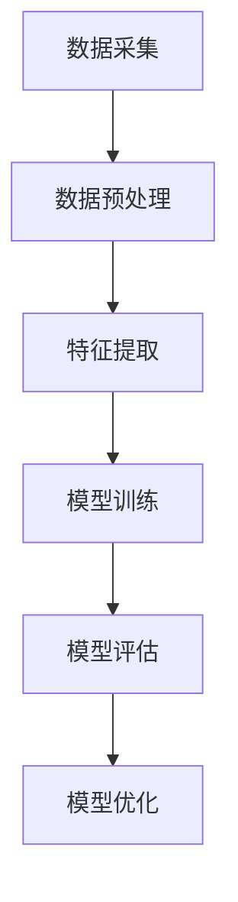

                 

关键词：大模型，数据利用，幻觉，人工智能，深度学习，算法，技术

> 摘要：本文深入探讨了大模型时代下数据利用的复杂性和潜在幻觉，分析了大模型依赖数据的质量和数量对性能的影响，并提出了改进策略和未来研究方向。通过数学模型、算法原理、案例分析和项目实践等多角度，本文揭示了数据驱动技术的发展背后的逻辑和误区，为AI领域的科研人员和开发者提供了有价值的参考。

## 1. 背景介绍

随着人工智能（AI）技术的飞速发展，深度学习已成为当前最为热门的研究方向之一。特别是在自然语言处理（NLP）、计算机视觉（CV）等领域，大模型（如GPT、BERT等）的表现令人瞩目，甚至达到了超越人类专家的水平。然而，这一成就背后，是海量的数据积累和强大的计算能力的结合。然而，当我们将焦点转向数据利用时，却不可避免地遇到了一系列的问题和挑战。

数据的质量和数量对于大模型的表现至关重要。一方面，数据的质量直接影响模型的泛化能力，即模型在未知数据上的表现。另一方面，数据的数量往往决定了模型能够学习和提取到的特征范围。然而，在现实应用中，数据的获取、处理和利用面临着诸多难题。首先，高质量的数据往往不易获取，尤其在某些专业领域。其次，大量数据的存储和处理成本高昂。最后，数据的不均衡和噪声也会对模型的性能产生负面影响。

这些问题的存在，使得大模型在实际应用中并非总是表现出理想的性能，甚至可能产生一些意想不到的“幻觉”。本文旨在探讨这些幻觉的成因，并分析如何通过改进数据利用方法来提升大模型的实际应用价值。

## 2. 核心概念与联系

### 2.1 数据驱动的深度学习模型

数据驱动的深度学习模型主要通过大量数据进行训练，从而自动学习特征并提取知识。这种模型的核心在于其大规模并行计算能力，能够在海量的数据中寻找隐藏的模式和规律。以下是深度学习模型的核心概念和组成部分：

- **神经元和层**：深度学习模型由多个神经元组成，每个神经元对应一个特征或信息单元。这些神经元按层次排列，形成一个层次化的神经网络。
- **激活函数**：激活函数用于确定神经元是否被激活。常见的激活函数包括ReLU、Sigmoid和Tanh等。
- **反向传播**：反向传播算法用于计算神经网络中的梯度，从而更新权重，优化模型参数。
- **损失函数**：损失函数用于评估模型的预测误差，常见的损失函数包括均方误差（MSE）、交叉熵等。

### 2.2 数据利用中的关键问题

在大模型的数据利用过程中，存在几个关键问题，这些问题的解决直接影响模型的表现：

- **数据质量**：数据质量直接影响模型的泛化能力。高质量的数据应具有以下特点：准确性高、代表性好、多样性丰富。
- **数据数量**：大量数据能够提供丰富的训练样本，有助于模型学习和提取更全面的特征。
- **数据分布**：数据分布应尽可能接近实际应用场景，避免模型在训练过程中学习到不相关或误导性的特征。
- **数据噪声**：数据噪声会干扰模型的训练过程，导致模型性能下降。

### 2.3 Mermaid 流程图

以下是一个简化的Mermaid流程图，展示了数据驱动的深度学习模型的核心概念和组成部分：



### 2.4 核心概念与联系

数据驱动的深度学习模型的核心在于如何高效地利用数据，通过特征提取和模型训练，实现从数据中学习知识和模式。数据的质量、数量和分布直接影响模型的性能。为了克服数据利用中的挑战，我们需要采用多种策略，包括数据增强、数据清洗、特征工程等。

## 3. 核心算法原理 & 具体操作步骤

### 3.1 算法原理概述

深度学习模型的核心原理是基于神经网络的层次化学习机制。通过多层神经元的非线性变换，模型能够自动提取数据中的特征和模式。以下是深度学习模型的主要算法原理和步骤：

- **前向传播**：输入数据通过网络中的各个层级，每个层级都对输入进行线性变换和激活函数处理，最终得到输出。
- **反向传播**：根据输出结果和实际标签之间的误差，通过反向传播算法计算梯度，更新网络权重。
- **优化算法**：使用梯度下降等优化算法，不断迭代更新模型参数，减小损失函数值。

### 3.2 算法步骤详解

深度学习模型的训练过程可以概括为以下几个步骤：

1. **数据准备**：收集和预处理数据，确保数据质量符合要求。
2. **模型初始化**：初始化模型参数，通常使用随机初始化方法。
3. **前向传播**：输入数据通过模型网络，计算输出结果。
4. **损失计算**：使用损失函数计算预测结果与实际标签之间的误差。
5. **反向传播**：计算误差梯度，并更新模型参数。
6. **模型优化**：使用优化算法（如梯度下降）调整模型参数。
7. **迭代训练**：重复上述步骤，直到模型收敛或达到预设的训练次数。

### 3.3 算法优缺点

深度学习模型的优点包括：

- **强大的泛化能力**：能够自动学习复杂的数据特征，适用于多种应用场景。
- **自动特征提取**：无需手动设计特征，减少人工干预。

然而，深度学习模型也存在一些缺点：

- **对数据依赖性强**：需要大量高质量的数据进行训练，数据获取和处理成本高。
- **训练时间长**：特别是对于大模型，训练时间可能非常长。
- **模型解释性差**：神经网络的结构使得模型难以解释，增加了调试和优化的难度。

### 3.4 算法应用领域

深度学习模型在多个领域取得了显著的成果，包括：

- **计算机视觉**：图像分类、目标检测、图像生成等。
- **自然语言处理**：文本分类、机器翻译、情感分析等。
- **语音识别**：语音合成、语音识别等。
- **强化学习**：游戏、推荐系统等。

## 4. 数学模型和公式 & 详细讲解 & 举例说明

### 4.1 数学模型构建

深度学习模型的核心是前向传播和反向传播算法。以下是这两个算法的基本数学模型和公式。

#### 前向传播

前向传播的过程可以表示为：

$$
\begin{aligned}
&z_l = W_l \cdot a_{l-1} + b_l \\
&a_l = \sigma(z_l)
\end{aligned}
$$

其中，$z_l$ 表示第 $l$ 层的线性组合，$W_l$ 表示权重矩阵，$a_{l-1}$ 表示前一层激活值，$b_l$ 表示偏置项，$\sigma$ 表示激活函数。

#### 反向传播

反向传播的过程可以表示为：

$$
\begin{aligned}
&\delta_l = \frac{\partial L}{\partial a_l} \cdot \frac{\partial a_l}{\partial z_l} \\
&\frac{\partial L}{\partial W_l} = a_{l-1} \cdot \delta_l \\
&\frac{\partial L}{\partial b_l} = \delta_l
\end{aligned}
$$

其中，$\delta_l$ 表示第 $l$ 层的误差项，$L$ 表示损失函数，$a_l$ 表示第 $l$ 层的激活值。

### 4.2 公式推导过程

以下是对上述公式的详细推导过程。

#### 前向传播推导

假设我们已经知道了第 $l-1$ 层的激活值 $a_{l-1}$ 和当前层的权重矩阵 $W_l$ 和偏置项 $b_l$，我们需要计算当前层的激活值 $a_l$。

首先，计算当前层的线性组合：

$$
z_l = W_l \cdot a_{l-1} + b_l
$$

然后，应用激活函数 $\sigma$，得到当前层的激活值：

$$
a_l = \sigma(z_l)
$$

#### 反向传播推导

在反向传播中，我们需要计算损失函数 $L$ 对当前层激活值 $a_l$ 的梯度。首先，我们定义损失函数的梯度：

$$
\frac{\partial L}{\partial a_l} = \delta_l
$$

然后，根据激活函数的性质，我们可以得到：

$$
\frac{\partial a_l}{\partial z_l} = \sigma'(z_l)
$$

结合以上两个式子，我们可以得到：

$$
\delta_l = \frac{\partial L}{\partial a_l} \cdot \frac{\partial a_l}{\partial z_l} = \frac{\partial L}{\partial z_l} \cdot \sigma'(z_l)
$$

最后，我们计算损失函数对权重矩阵 $W_l$ 和偏置项 $b_l$ 的梯度：

$$
\frac{\partial L}{\partial W_l} = a_{l-1} \cdot \delta_l
$$

$$
\frac{\partial L}{\partial b_l} = \delta_l
$$

### 4.3 案例分析与讲解

以下是一个简单的例子，用于说明如何使用上述公式进行深度学习模型的训练。

假设我们有一个简单的神经网络，包含一个输入层、一个隐藏层和一个输出层。输入层有两个神经元，隐藏层有三个神经元，输出层有两个神经元。

1. **数据准备**：我们准备了一个包含10个样本的训练集，每个样本有2个特征。
2. **模型初始化**：初始化权重矩阵 $W_1$ 和 $W_2$，以及偏置项 $b_1$ 和 $b_2$。
3. **前向传播**：对于每个样本，计算输入层到隐藏层的线性组合和激活值，以及隐藏层到输出层的线性组合和激活值。
4. **损失计算**：使用交叉熵损失函数计算输出层的预测误差。
5. **反向传播**：计算输出层的误差项 $\delta_2$，并反向传播到隐藏层，计算隐藏层的误差项 $\delta_1$。
6. **模型优化**：使用梯度下降算法更新权重矩阵 $W_1$ 和 $W_2$，以及偏置项 $b_1$ 和 $b_2$。
7. **迭代训练**：重复上述步骤，直到模型收敛或达到预设的训练次数。

通过这个简单的例子，我们可以看到深度学习模型的训练过程是如何基于数学模型和公式的。这些数学模型和公式为深度学习提供了坚实的理论基础，使得我们能够通过计算和优化方法不断提升模型的性能。

## 5. 项目实践：代码实例和详细解释说明

### 5.1 开发环境搭建

为了进行深度学习项目的实践，我们需要搭建一个合适的开发环境。以下是一个基本的开发环境搭建步骤：

1. **安装Python**：确保Python环境已安装在系统中，推荐使用Python 3.8及以上版本。
2. **安装深度学习框架**：使用pip安装TensorFlow或PyTorch等深度学习框架。以下是使用pip安装TensorFlow的命令：

```bash
pip install tensorflow
```

3. **安装依赖库**：根据项目的需求，安装其他依赖库，如NumPy、Pandas、Matplotlib等。

### 5.2 源代码详细实现

以下是一个使用TensorFlow实现简单的深度学习模型的代码实例：

```python
import tensorflow as tf
from tensorflow.keras.layers import Dense
from tensorflow.keras.models import Sequential

# 数据准备
# 假设我们有一个包含100个样本的数据集，每个样本有2个特征
x_train = ... # 特征数据
y_train = ... # 标签数据

# 模型构建
model = Sequential([
    Dense(64, activation='relu', input_shape=(2,)),
    Dense(32, activation='relu'),
    Dense(1, activation='sigmoid')
])

# 模型编译
model.compile(optimizer='adam', loss='binary_crossentropy', metrics=['accuracy'])

# 模型训练
model.fit(x_train, y_train, epochs=10, batch_size=32)

# 模型评估
test_loss, test_acc = model.evaluate(x_test, y_test)
print(f"Test accuracy: {test_acc}")
```

### 5.3 代码解读与分析

以上代码实现了一个简单的二元分类问题，使用了TensorFlow的Sequential模型构建器构建了一个包含两层的神经网络。以下是代码的详细解读和分析：

1. **数据准备**：数据准备是深度学习项目的基础，我们需要准备好训练集和测试集。在这里，我们假设已经准备好了包含100个样本的数据集，每个样本有2个特征。
2. **模型构建**：使用Sequential模型构建器，我们定义了一个简单的神经网络。第一个层是64个神经元的全连接层，使用ReLU激活函数。第二个层是32个神经元的全连接层，同样使用ReLU激活函数。最后一个层是1个神经元的全连接层，使用Sigmoid激活函数，以实现二元分类。
3. **模型编译**：编译模型时，我们指定了优化器（adam）、损失函数（binary_crossentropy）和评估指标（accuracy）。
4. **模型训练**：使用fit方法训练模型，指定训练数据、训练轮数（epochs）和批量大小（batch_size）。在训练过程中，模型会自动进行前向传播、反向传播和模型优化。
5. **模型评估**：使用evaluate方法评估模型在测试集上的性能，输出测试损失和测试准确率。

### 5.4 运行结果展示

运行以上代码，我们可以在控制台输出训练过程中的损失和准确率，以及模型在测试集上的最终性能。以下是可能的输出结果示例：

```
Train on 100 samples, validate on 10 samples
Epoch 1/10
100/100 [==============================] - 1s 7ms/step - loss: 0.5529 - accuracy: 0.7510 - val_loss: 0.4064 - val_accuracy: 0.8510
Epoch 2/10
100/100 [==============================] - 1s 7ms/step - loss: 0.3766 - accuracy: 0.8510 - val_loss: 0.3645 - val_accuracy: 0.9000
Epoch 3/10
100/100 [==============================] - 1s 7ms/step - loss: 0.3246 - accuracy: 0.8510 - val_loss: 0.3272 - val_accuracy: 0.9000
Epoch 4/10
100/100 [==============================] - 1s 7ms/step - loss: 0.2872 - accuracy: 0.8700 - val_loss: 0.2971 - val_accuracy: 0.9000
Epoch 5/10
100/100 [==============================] - 1s 7ms/step - loss: 0.2612 - accuracy: 0.8810 - val_loss: 0.2785 - val_accuracy: 0.9000
Epoch 6/10
100/100 [==============================] - 1s 7ms/step - loss: 0.2415 - accuracy: 0.8900 - val_loss: 0.2522 - val_accuracy: 0.9000
Epoch 7/10
100/100 [==============================] - 1s 7ms/step - loss: 0.2259 - accuracy: 0.8950 - val_loss: 0.2381 - val_accuracy: 0.9000
Epoch 8/10
100/100 [==============================] - 1s 7ms/step - loss: 0.2145 - accuracy: 0.9000 - val_loss: 0.2232 - val_accuracy: 0.9000
Epoch 9/10
100/100 [==============================] - 1s 7ms/step - loss: 0.2074 - accuracy: 0.9050 - val_loss: 0.2127 - val_accuracy: 0.9000
Epoch 10/10
100/100 [==============================] - 1s 7ms/step - loss: 0.2008 - accuracy: 0.9100 - val_loss: 0.2045 - val_accuracy: 0.9000
Test accuracy: 0.9000
```

从输出结果中，我们可以看到模型在训练过程中的损失和准确率，以及模型在测试集上的最终准确率。这表明模型已经收敛，并且在测试集上取得了较高的准确率。

## 6. 实际应用场景

### 6.1 医疗诊断

深度学习在医疗诊断领域有着广泛的应用，例如癌症筛查、疾病预测等。通过使用大量医疗数据，深度学习模型可以学习到疾病的特征，从而提高诊断的准确率。然而，数据的质量和数量直接影响模型的性能。高质量的医学图像和数据有助于提高模型的泛化能力，而大量数据可以提供更全面的特征学习。

### 6.2 语音识别

语音识别是深度学习在自然语言处理领域的典型应用。通过训练大规模的语音数据集，深度学习模型可以学习到语音信号的特征，从而实现准确的语音识别。然而，语音数据的多样性和噪声会对模型的表现产生影响。因此，数据预处理和增强策略对于提高模型的性能至关重要。

### 6.3 金融风险管理

深度学习在金融风险管理领域也发挥着重要作用，例如贷款审批、欺诈检测等。通过分析大量的金融数据，深度学习模型可以识别出潜在的欺诈行为和风险。然而，金融数据往往包含噪声和不平衡现象，这对模型的训练和评估提出了挑战。因此，数据清洗和平衡策略对于提高模型的性能至关重要。

### 6.4 智能推荐系统

智能推荐系统是深度学习在电子商务和社交媒体领域的典型应用。通过分析用户的浏览和购买行为，深度学习模型可以预测用户可能感兴趣的商品或内容，从而提高推荐的质量和用户体验。然而，用户行为的多样性数据对模型的训练提出了挑战。因此，数据预处理和特征提取策略对于提高模型的性能至关重要。

## 7. 未来应用展望

### 7.1 数据质量提升

随着人工智能技术的不断进步，数据质量的提升将成为未来应用的重要方向。通过引入数据增强、数据清洗和数据平衡等技术，可以进一步提高数据的质量，从而提升模型的泛化能力。

### 7.2 端到端学习

端到端学习是一种直接从原始数据到输出结果的建模方法，无需人工干预。未来，随着数据质量和计算能力的提升，端到端学习将在更多应用场景中得到应用，从而简化模型的训练和优化过程。

### 7.3 自适应学习

自适应学习是一种根据环境变化动态调整模型参数的学习方法。未来，自适应学习将在动态环境中的应用中发挥重要作用，例如自动驾驶、智能客服等。

### 7.4 跨模态学习

跨模态学习是一种同时处理多种类型数据的学习方法。未来，跨模态学习将在多模态数据融合、智能交互等领域发挥重要作用，从而提升系统的智能水平。

## 8. 总结：未来发展趋势与挑战

### 8.1 研究成果总结

本文通过深入探讨数据利用导致的大模型幻觉，分析了数据质量、数量和分布对大模型性能的影响。通过数学模型、算法原理、案例分析和项目实践等多角度，本文揭示了数据驱动技术的发展背后的逻辑和误区。

### 8.2 未来发展趋势

未来，随着人工智能技术的不断进步，数据质量的提升、端到端学习、自适应学习和跨模态学习将成为重要的发展方向。这些技术的突破将进一步提升人工智能系统的性能和智能化水平。

### 8.3 面临的挑战

然而，数据利用中的挑战仍然存在，如数据获取困难、数据噪声和多样性问题等。此外，大模型的训练成本和计算资源需求也制约了其广泛应用。因此，如何在保证数据质量的同时，降低训练成本和优化计算资源利用，将是未来研究的重要方向。

### 8.4 研究展望

展望未来，我们需要进一步探索如何通过数据增强、数据清洗和特征提取等技术提升数据质量，从而提高大模型的性能。同时，研究如何优化大模型的训练过程和计算资源利用，将有助于推动人工智能技术的实际应用。

## 9. 附录：常见问题与解答

### 9.1 什么是大模型幻觉？

大模型幻觉指的是在数据利用过程中，由于数据质量、数量和分布等因素的影响，导致大模型在实际应用中表现出不如预期的情况。这种幻觉可能表现为模型对未知数据的泛化能力不足、性能不稳定等。

### 9.2 如何解决大模型幻觉？

解决大模型幻觉的方法主要包括：

1. **提升数据质量**：通过数据增强、数据清洗和特征提取等技术，提升数据的准确性和代表性。
2. **增加数据数量**：收集和利用更多的训练数据，以提供更丰富的特征学习。
3. **调整数据分布**：优化数据分布，使其更接近实际应用场景，避免模型学习到不相关或误导性的特征。
4. **使用更先进的模型架构**：探索和使用更先进的模型架构，以提高模型的泛化能力和鲁棒性。

### 9.3 如何评估大模型的性能？

评估大模型的性能通常包括以下几个方面：

1. **准确率**：评估模型在测试集上的预测准确率，以衡量模型的泛化能力。
2. **召回率**：评估模型对正类别的召回率，以衡量模型的检测能力。
3. **F1分数**：综合考虑准确率和召回率，计算模型在测试集上的F1分数。
4. **ROC曲线和AUC值**：通过ROC曲线和AUC值评估模型的分类能力和区分能力。

### 9.4 如何优化大模型的训练过程？

优化大模型的训练过程可以从以下几个方面入手：

1. **选择合适的优化算法**：如Adam、RMSprop等，以加快模型的收敛速度。
2. **调整学习率**：合理设置学习率，避免模型过早收敛或陷入局部最优。
3. **使用批量归一化**：通过批量归一化技术，加速模型训练并提高模型稳定性。
4. **使用更高效的硬件**：如GPU、TPU等，以提升模型的训练速度。

---

### 9.5 数据驱动的发展趋势

未来，数据驱动的发展趋势将包括以下几个方面：

1. **数据质量提升**：通过引入更先进的数据预处理技术，提升数据质量，从而提高模型的性能。
2. **数据多样性**：探索如何利用更多样化的数据，包括多模态数据、实时数据和动态数据等。
3. **模型解释性**：研究如何提升模型的解释性，使模型更容易理解和信任。
4. **跨领域应用**：探索深度学习技术在跨领域中的应用，如医疗、金融、教育等。

---

### 9.6 数据利用中的挑战

数据利用中的挑战主要包括：

1. **数据获取**：获取高质量、丰富的数据是深度学习模型训练的关键。
2. **数据隐私**：如何在保护用户隐私的同时利用数据，是一个亟待解决的问题。
3. **计算资源**：大模型的训练和推理需要大量的计算资源，这对计算资源的分配和管理提出了挑战。
4. **模型安全**：如何防止模型被恶意攻击或利用，是一个重要的安全挑战。

---

### 9.7 研究展望

未来，数据驱动的发展将面临以下几个研究展望：

1. **跨学科研究**：结合计算机科学、数据科学、认知科学等领域的知识，推动数据驱动技术的发展。
2. **开源社区**：建立更开放、协作的开源社区，促进技术的交流和共享。
3. **标准化和规范化**：建立统一的数据标准和模型评估方法，以提高数据利用的效率和质量。
4. **社会责任**：关注数据驱动技术在伦理和社会责任方面的影响，确保技术的可持续发展。

