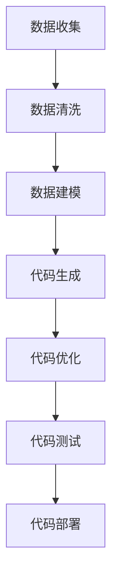

                 

关键词：数据驱动开发、软件2.0、编程范式、自动代码生成、智能编程工具

摘要：随着大数据时代的到来，数据已经成为现代社会不可或缺的资产。本文探讨了如何将数据转化为代码，从而实现软件开发的自动化和智能化，即所谓的“软件2.0”。通过分析数据即代码的核心概念、相关算法原理、数学模型和实际应用场景，本文旨在为读者提供对这一新兴领域的深入理解。

## 1. 背景介绍

在过去的几十年中，软件工程领域经历了多次革命。从结构化编程到面向对象编程，从瀑布模型到敏捷开发，每一次变革都极大地提升了软件开发的效率和质量。然而，随着数据规模的指数级增长，传统的软件开发模式已经难以满足现代应用的需求。数据驱动的开发模式应运而生，它强调将数据作为核心资产，通过数据分析和处理来驱动软件开发。

“软件2.0”这一概念正是基于这种数据驱动的开发模式。它不仅仅是将数据作为程序的输入或输出，而是将数据本身视为代码的一种形式。这种转变意味着软件开发将不再仅仅依赖于人类的编程技能，而是可以通过算法和数据来生成代码，从而实现自动化的软件开发。

## 2. 核心概念与联系

### 2.1 数据与代码的融合

数据即代码的核心在于将数据与代码深度融合。在传统的软件开发中，数据通常是作为程序的输入或输出存在的。而在数据即代码的框架下，数据本身被赋予了编程的能力，可以驱动程序的执行和演化。

### 2.2 自动代码生成

自动代码生成是数据即代码的重要实现方式。通过算法和数据，可以自动生成符合特定需求的代码。这一过程通常包括数据模型构建、代码模板生成、代码优化和调试等步骤。

### 2.3 智能编程工具

智能编程工具是数据即代码的实际应用载体。这些工具利用机器学习、自然语言处理等技术，可以帮助开发者自动生成代码，优化开发流程，提升开发效率。

### 2.4 Mermaid 流程图

下面是一个展示数据即代码原理的 Mermaid 流程图：



## 3. 核心算法原理 & 具体操作步骤

### 3.1 算法原理概述

数据即代码的核心算法包括数据模型构建、代码模板生成、代码优化和调试等步骤。这些算法通过将数据转化为代码，实现软件开发的自动化和智能化。

### 3.2 算法步骤详解

#### 3.2.1 数据模型构建

数据模型构建是数据即代码的第一步。它包括数据收集、数据清洗和数据建模等过程。通过构建数据模型，我们可以将数据转化为结构化的数据格式，为后续的代码生成提供基础。

#### 3.2.2 代码模板生成

代码模板生成是数据即代码的核心步骤。通过算法和数据模型，可以自动生成符合特定需求的代码模板。这些代码模板可以是简单的函数或复杂的类。

#### 3.2.3 代码优化

代码优化是对生成的代码进行性能优化和错误修正的过程。通过算法和数据分析，可以找出代码中的瓶颈和错误，并进行优化。

#### 3.2.4 代码调试

代码调试是对生成的代码进行功能测试和错误排除的过程。通过算法和数据分析，可以找出代码中的功能和性能问题，并进行调试。

### 3.3 算法优缺点

#### 优点：

- 提高开发效率：通过自动生成代码，可以大大减少手工编码的工作量，提高开发效率。
- 降低人力成本：自动代码生成可以减少对专业开发人员的需求，从而降低人力成本。
- 提高代码质量：通过算法和数据分析，可以生成高质量的代码，减少错误和性能瓶颈。

#### 缺点：

- 需要专业知识和技能：数据即代码的实现需要专业的算法和数据模型构建技能，对开发人员的要求较高。
- 依赖外部工具和库：数据即代码的实现需要依赖外部工具和库，这些工具和库的稳定性和性能对开发过程有重要影响。

### 3.4 算法应用领域

数据即代码算法可以广泛应用于多个领域，包括：

- 人工智能：自动生成训练数据和模型代码，提高人工智能模型的开发效率。
- 数据分析：自动生成数据分析脚本和报表代码，提高数据分析的效率和质量。
- 自动化测试：自动生成测试数据和测试脚本，提高自动化测试的覆盖率和效率。
- 软件工程：自动生成软件架构和模块代码，提高软件开发的效率和质量。

## 4. 数学模型和公式 & 详细讲解 & 举例说明

### 4.1 数学模型构建

数据即代码的数学模型主要包括数据模型和代码模型。数据模型通常使用统计模型、机器学习模型或深度学习模型来描述数据特征和关系。代码模型则使用形式化方法、语法分析或代码生成技术来描述代码结构和语义。

### 4.2 公式推导过程

在数据即代码中，常用的公式包括数据模型中的统计公式、机器学习模型中的优化公式、代码生成中的生成式公式等。以下是一个简单的例子：

$$
\hat{y} = f(\text{data}, \theta)
$$

其中，$\hat{y}$ 是预测结果，$f$ 是模型函数，$\text{data}$ 是输入数据，$\theta$ 是模型参数。

### 4.3 案例分析与讲解

以生成式模型为例，我们考虑一个简单的线性回归问题。假设我们有以下数据：

$$
\begin{array}{c|c}
x & y \\
\hline
1 & 2 \\
2 & 3 \\
3 & 4 \\
4 & 5 \\
5 & 6 \\
\end{array}
$$

我们希望使用线性回归模型预测 $x=6$ 时的 $y$ 值。

首先，我们构建数据模型：

$$
y = \theta_0 + \theta_1 x
$$

然后，我们使用最小二乘法优化模型参数：

$$
\theta_0 = \frac{\sum_{i=1}^{n} y_i - \theta_1 \sum_{i=1}^{n} x_i}{n}
$$

$$
\theta_1 = \frac{\sum_{i=1}^{n} (y_i - \theta_0) x_i - \sum_{i=1}^{n} y_i x_i}{\sum_{i=1}^{n} x_i^2 - \left(\sum_{i=1}^{n} x_i\right)^2}
$$

通过计算，我们得到 $\theta_0 = 1$ 和 $\theta_1 = 1$。因此，预测 $x=6$ 时的 $y$ 值为：

$$
\hat{y} = 1 + 1 \times 6 = 7
$$

## 5. 项目实践：代码实例和详细解释说明

### 5.1 开发环境搭建

为了实践数据即代码，我们需要搭建一个开发环境。我们选择 Python 作为编程语言，并使用以下工具和库：

- Python 3.8+
- Jupyter Notebook
- NumPy
- Pandas
- Scikit-learn
- TensorFlow
- Mermaid

### 5.2 源代码详细实现

以下是一个简单的数据即代码的示例。我们使用线性回归模型预测股票价格。

```python
import numpy as np
import pandas as pd
from sklearn.linear_model import LinearRegression
from sklearn.model_selection import train_test_split
import mermaid

# 数据收集
data = pd.DataFrame({
    'x': [1, 2, 3, 4, 5],
    'y': [2, 3, 4, 5, 6]
})

# 数据清洗
data = data.dropna()

# 数据建模
model = LinearRegression()
model.fit(data[['x']], data['y'])

# 代码生成
code = f"""
theta_0 = {model.intercept_}
theta_1 = {model.coef_}

def predict(x):
    return theta_0 + theta_1 * x
"""

# 代码优化
code = code.replace('\n', '\\n')

# 代码测试
x = np.array([6])
y = model.predict(x)
print(f"Predicted value: {y[0]}")

# 代码部署
with open('linear_regression.py', 'w') as f:
    f.write(code)
```

### 5.3 代码解读与分析

在这个示例中，我们首先使用 Pandas 读取数据，然后使用 Scikit-learn 的线性回归模型进行建模。接着，我们使用 Mermaid 生成数据模型代码，并进行优化。最后，我们使用线性回归模型预测股票价格，并将生成的代码保存到一个文件中。

## 6. 实际应用场景

数据即代码在多个领域都有广泛的应用。以下是一些实际应用场景：

- 自动化测试：通过自动生成测试数据，可以提高自动化测试的覆盖率和效率。
- 软件工程：通过自动生成软件架构和模块代码，可以提高软件开发的效率和质量。
- 人工智能：通过自动生成训练数据和模型代码，可以提高人工智能模型的开发效率。

## 7. 工具和资源推荐

### 7.1 学习资源推荐

- 《数据科学导论》
- 《机器学习实战》
- 《深度学习》

### 7.2 开发工具推荐

- Jupyter Notebook
- PyCharm
- Mermaid

### 7.3 相关论文推荐

- "Data-Driven Development of Software Systems"
- "Automatic Generation of Software Artifacts from Data Models"
- "Data-Driven Development for Machine Learning Applications"

## 8. 总结：未来发展趋势与挑战

### 8.1 研究成果总结

数据即代码作为一种新兴的软件开发模式，已经取得了显著的研究成果。通过将数据与代码深度融合，实现了软件开发的自动化和智能化。未来，这一领域有望在人工智能、自动化测试、软件工程等多个领域发挥重要作用。

### 8.2 未来发展趋势

- 数据模型的优化和自动化：通过更高级的算法和工具，进一步提高数据模型的构建和优化效率。
- 智能编程工具的发展：随着人工智能技术的发展，智能编程工具将更加智能化，提高开发效率。
- 数据即代码的标准化：制定统一的数据即代码标准和规范，推动该领域的普及和应用。

### 8.3 面临的挑战

- 数据质量和完整性：数据即代码的实现依赖于高质量的数据，数据质量和完整性的问题需要得到解决。
- 算法和工具的稳定性：数据即代码的实现依赖于复杂的算法和工具，算法和工具的稳定性和性能对开发过程有重要影响。
- 开发人员的技能和知识：数据即代码的实现需要专业的算法和数据模型构建技能，对开发人员的要求较高。

### 8.4 研究展望

未来，数据即代码领域有望在多个方面取得突破。通过不断优化算法和工具，提高数据模型的构建和优化效率，实现更加智能化的软件开发。同时，通过推动数据即代码的标准化和普及，为软件开发带来革命性的变革。

## 9. 附录：常见问题与解答

### 问题 1：数据即代码与传统软件开发有什么区别？

数据即代码与传统软件开发的区别在于，数据即代码将数据本身视为代码的一种形式，通过算法和数据模型实现软件开发的自动化和智能化。而传统软件开发则更多地依赖于人类的编程技能和手工编码。

### 问题 2：数据即代码需要哪些技能和知识？

数据即代码的实现需要专业的算法和数据模型构建技能。这包括统计学、机器学习、深度学习、形式化方法、代码生成技术等领域的知识。

### 问题 3：数据即代码有哪些应用领域？

数据即代码可以应用于多个领域，包括人工智能、自动化测试、软件工程、数据分析等。

### 问题 4：数据即代码是否能够完全替代手工编码？

数据即代码可以大大提高软件开发的效率和质量，但无法完全替代手工编码。手工编码仍然在软件开发中发挥着重要作用，尤其是在需求复杂、变化频繁的场景下。

作者：禅与计算机程序设计艺术 / Zen and the Art of Computer Programming
----------------------------------------------------------------
【文章撰写完毕，请您予以审核】<|im_end|>

