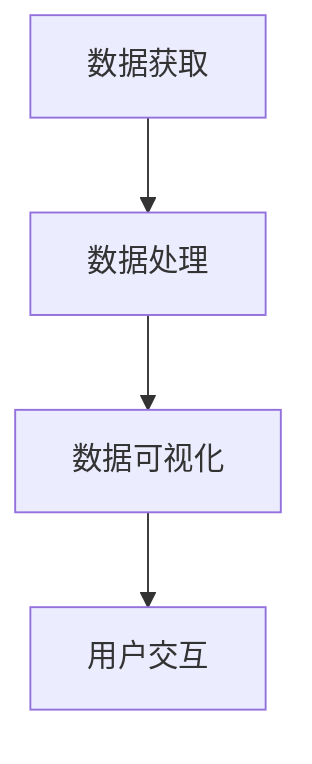

                 

关键词：数据可视化，图表，交互式仪表板，数据分析，信息图形，用户体验，可视化工具，技术实现。

> 摘要：本文将深入探讨数据可视化技术的发展历程，从基本的图表形式到复杂的交互式仪表板。我们将分析数据可视化技术的基本概念、核心算法原理、数学模型以及具体实现步骤，并通过项目实践和实际应用场景来展示其在现代数据分析中的重要作用。此外，还将讨论未来数据可视化技术的发展趋势、面临的挑战以及研究展望。

## 1. 背景介绍

数据可视化是一种将复杂数据转化为图形和视觉元素的方法，旨在提高信息的可读性和理解性。随着大数据时代的到来，数据量呈爆炸式增长，如何有效地从海量数据中提取有用信息，成为了一个重要课题。数据可视化技术正是在这样的背景下应运而生，它通过图形和视觉元素，将数据以直观、易于理解的方式呈现给用户。

数据可视化技术不仅仅是一种表现形式，它还涉及到信息图形、交互设计、用户体验等多个领域。一个优秀的可视化设计，不仅需要考虑数据的准确性，还需要考虑用户的使用习惯和认知规律。随着技术的进步，数据可视化技术也在不断进化，从最初的简单图表到复杂的交互式仪表板，其应用范围也越来越广泛。

## 2. 核心概念与联系

在数据可视化技术中，有几个核心概念和联系是不可或缺的，它们共同构成了数据可视化技术的理论基础。

### 2.1 数据可视化技术的基本概念

数据可视化技术的基本概念包括数据、可视化、用户交互等。数据是可视化的基础，没有数据，可视化就无法进行。可视化是将数据转化为图形和视觉元素的过程，用户交互则是用户与可视化界面之间的互动。通过用户交互，用户可以更加直观地理解数据，并进行深层次的分析。

### 2.2 可视化工具和平台

可视化工具和平台是数据可视化技术的重要组成部分。常见的可视化工具包括 Tableau、Power BI、D3.js 等。这些工具提供了丰富的图表类型和交互功能，使得用户可以轻松地创建可视化报告。此外，还有许多开源的可视化平台，如 Plotly、Bokeh 等，这些平台为开发者提供了更多的自定义和扩展性。

### 2.3 信息图形和交互设计

信息图形是数据可视化的一种形式，它通过图形和视觉元素，将数据以简洁、直观的方式呈现给用户。信息图形通常包含图表、地图、图标等元素，它们可以用于展示数据的趋势、分布、相关性等。交互设计则是数据可视化中不可或缺的一部分，它关注的是用户与可视化界面之间的互动。一个良好的交互设计，可以提高用户的使用体验，使得用户能够更加高效地获取信息。

### 2.4 数据可视化技术的架构

数据可视化技术的架构通常包括数据获取、数据处理、数据可视化和用户交互四个主要部分。数据获取是数据可视化技术的基础，它涉及数据的采集、存储和预处理。数据处理是对获取到的数据进行清洗、转换和归一化等操作，以便于后续的可视化。数据可视化是将处理好的数据转化为图形和视觉元素的过程，用户交互则是用户与可视化界面之间的互动。

下面是一个简单的 Mermaid 流程图，展示了数据可视化技术的基本架构：



## 3. 核心算法原理 & 具体操作步骤

### 3.1 算法原理概述

数据可视化技术的核心算法主要包括数据预处理、数据转换、数据渲染和数据交互。这些算法共同作用，将数据以直观、易于理解的方式呈现给用户。

- **数据预处理**：包括数据清洗、去噪、缺失值填补等操作，以确保数据的准确性和一致性。
- **数据转换**：包括数据归一化、标准化、聚合等操作，以便于后续的可视化。
- **数据渲染**：包括数据映射、坐标轴设置、颜色选择等操作，用于将数据转化为图形和视觉元素。
- **数据交互**：包括用户交互、事件处理、数据更新等操作，用于实现用户与可视化界面之间的互动。

### 3.2 算法步骤详解

#### 3.2.1 数据预处理

数据预处理是数据可视化技术的重要步骤，它直接影响最终的可视化效果。具体步骤如下：

1. **数据清洗**：去除重复数据、异常值和噪声数据。
2. **去噪**：通过平滑算法、过滤算法等方法，减少数据的噪声。
3. **缺失值填补**：采用均值、中位数、插值等方法，填补缺失值。

#### 3.2.2 数据转换

数据转换是对预处理后的数据进行处理，以便于后续的可视化。具体步骤如下：

1. **数据归一化**：将不同尺度的数据转换到同一尺度，以便于比较。
2. **标准化**：将数据转换为标准正态分布，便于分析。
3. **聚合**：对大量数据进行汇总，减少数据的复杂性。

#### 3.2.3 数据渲染

数据渲染是将转换后的数据转化为图形和视觉元素的过程。具体步骤如下：

1. **数据映射**：将数据映射到坐标轴上，确定数据的位置。
2. **坐标轴设置**：设置坐标轴的刻度、标签等，以便于用户理解。
3. **颜色选择**：选择合适的颜色，用于区分不同的数据。

#### 3.2.4 数据交互

数据交互是实现用户与可视化界面之间互动的关键。具体步骤如下：

1. **用户交互**：提供拖拽、点击、滑动等交互方式，使用户可以动态地探索数据。
2. **事件处理**：监听用户操作，如点击、拖拽等，并根据操作更新可视化界面。
3. **数据更新**：根据用户操作，动态地更新数据，并重新渲染可视化界面。

### 3.3 算法优缺点

- **优点**：
  - 提高数据可读性：通过图形和视觉元素，使得数据更加直观、易于理解。
  - 加速数据探索：通过交互式操作，用户可以快速地探索数据，发现数据中的规律和趋势。
  - 提升决策效率：通过可视化的方式，用户可以更加准确地理解数据，从而做出更加明智的决策。

- **缺点**：
  - 可视化效果受限：受制于显示设备和显示技术，可视化效果可能无法达到最佳。
  - 数据复杂度限制：对于高度复杂的数据，可视化技术可能无法完全呈现数据的复杂性。
  - 交互性能瓶颈：对于大规模数据，交互性能可能成为瓶颈，影响用户体验。

### 3.4 算法应用领域

数据可视化技术广泛应用于各个领域，如商业分析、金融分析、医疗健康、科学研究等。以下是几个典型的应用场景：

- **商业分析**：通过数据可视化，企业可以更加直观地了解销售情况、市场趋势等，从而做出更加精准的营销策略。
- **金融分析**：数据可视化技术可以帮助投资者分析股票走势、市场动态等，提高投资决策的准确性。
- **医疗健康**：通过数据可视化，医生可以更加清晰地了解患者的健康状况，从而做出更加准确的诊断和治疗。
- **科学研究**：数据可视化技术可以帮助科学家分析实验数据，发现数据中的规律和趋势，推动科学研究的进展。

## 4. 数学模型和公式 & 详细讲解 & 举例说明

### 4.1 数学模型构建

在数据可视化技术中，数学模型起着至关重要的作用。一个良好的数学模型可以准确地描述数据之间的关系，从而提高可视化的效果。以下是几个常见的数学模型：

#### 4.1.1 线性回归模型

线性回归模型是一种常用的数学模型，用于描述数据之间的线性关系。其公式如下：

$$
y = ax + b
$$

其中，$y$ 是因变量，$x$ 是自变量，$a$ 是斜率，$b$ 是截距。

#### 4.1.2 频率分布模型

频率分布模型用于描述数据的分布情况。其公式如下：

$$
P(x) = \frac{f(x)}{N}
$$

其中，$P(x)$ 是随机变量 $x$ 的概率，$f(x)$ 是随机变量 $x$ 的频率，$N$ 是样本总数。

#### 4.1.3 欧氏距离模型

欧氏距离模型用于计算两个数据点之间的距离。其公式如下：

$$
d(x, y) = \sqrt{\sum_{i=1}^{n}(x_i - y_i)^2}
$$

其中，$x$ 和 $y$ 是两个数据点，$n$ 是数据点的维度。

### 4.2 公式推导过程

#### 4.2.1 线性回归模型的推导

线性回归模型的目标是找到一条直线，使得数据点到直线的距离最小。具体推导过程如下：

1. **设定目标函数**：

$$
J(\theta) = \frac{1}{2m}\sum_{i=1}^{m}(h_\theta(x^{(i)}) - y^{(i)})^2
$$

其中，$m$ 是样本数量，$h_\theta(x)$ 是线性回归模型预测的值，$\theta$ 是模型参数。

2. **求导**：

对 $J(\theta)$ 分别对 $\theta_0$ 和 $\theta_1$ 求导，得到：

$$
\frac{\partial J(\theta)}{\partial \theta_0} = \frac{1}{m}\sum_{i=1}^{m}(h_\theta(x^{(i)}) - y^{(i)})
$$

$$
\frac{\partial J(\theta)}{\partial \theta_1} = \frac{1}{m}\sum_{i=1}^{m}(h_\theta(x^{(i)}) - y^{(i)})x^{(i)}
$$

3. **设导数为零**：

$$
\frac{\partial J(\theta)}{\partial \theta_0} = 0
$$

$$
\frac{\partial J(\theta)}{\partial \theta_1} = 0
$$

4. **解方程**：

解上述方程，得到最优的模型参数 $\theta_0$ 和 $\theta_1$。

#### 4.2.2 频率分布模型的推导

频率分布模型的推导相对简单，直接使用概率论中的基本公式即可：

$$
P(x) = \frac{f(x)}{N}
$$

其中，$f(x)$ 是随机变量 $x$ 的频率，$N$ 是样本总数。

#### 4.2.3 欧氏距离模型的推导

欧氏距离模型的推导基于几何学中的距离公式：

$$
d(x, y) = \sqrt{\sum_{i=1}^{n}(x_i - y_i)^2}
$$

### 4.3 案例分析与讲解

为了更好地理解上述数学模型和公式，我们将通过一个简单的案例进行讲解。

#### 案例背景

假设我们有一个包含两个变量的数据集，变量 $x$ 表示销售额，变量 $y$ 表示广告投放费用。我们的目标是建立一个线性回归模型，预测销售额。

#### 数据集

| 销售额($x$) | 广告投放费用($y$) |
|:---------:|:--------------:|
|     100    |       2000      |
|     150    |       2500      |
|     200    |       3000      |
|     250    |       3500      |
|     300    |       4000      |

#### 线性回归模型

我们使用上述数据集，通过线性回归模型预测销售额。具体步骤如下：

1. **数据预处理**：将数据集划分为训练集和测试集，用于模型训练和测试。

2. **模型训练**：使用训练集数据，通过最小二乘法求解线性回归模型的参数。

3. **模型评估**：使用测试集数据，评估模型的预测性能。

#### 结果分析

通过训练和评估，我们得到线性回归模型的参数为：

$$
\theta_0 = 500, \theta_1 = 2
$$

根据线性回归模型，我们可以预测新的销售额。例如，当广告投放费用为 3000 时，预测的销售额为：

$$
y = \theta_0 + \theta_1x = 500 + 2 \times 3000 = 8000
$$

这个预测结果可以用于指导广告投放策略，优化销售额。

## 5. 项目实践：代码实例和详细解释说明

### 5.1 开发环境搭建

为了实现数据可视化技术，我们需要搭建一个合适的开发环境。以下是一个基本的开发环境搭建步骤：

1. **安装操作系统**：选择一个合适的操作系统，如 Windows、Linux 或 macOS。
2. **安装编程语言**：安装 Python、R 或 JavaScript 等编程语言。
3. **安装可视化库**：根据需要安装相应的可视化库，如 Matplotlib、Plotly、D3.js 等。
4. **安装数据库**：安装一个数据库，如 MySQL、PostgreSQL 等，用于数据存储和管理。

### 5.2 源代码详细实现

以下是一个简单的 Python 代码实例，使用 Matplotlib 库绘制一个折线图：

```python
import matplotlib.pyplot as plt
import numpy as np

# 数据集
x = np.array([1, 2, 3, 4, 5])
y = np.array([1, 4, 9, 16, 25])

# 绘制折线图
plt.plot(x, y, label='y = x^2')
plt.xlabel('x')
plt.ylabel('y')
plt.title('折线图示例')
plt.legend()
plt.show()
```

这段代码首先导入了 Matplotlib 库和 NumPy 库，然后创建了一个简单的数据集。接着，使用 `plt.plot()` 函数绘制了折线图，并设置了标签、标题和图例。最后，使用 `plt.show()` 函数显示图表。

### 5.3 代码解读与分析

上述代码的解读如下：

- **import matplotlib.pyplot as plt, import numpy as np**：导入 Matplotlib 和 NumPy 库，用于数据可视化和数据处理。
- **x = np.array([1, 2, 3, 4, 5]), y = np.array([1, 4, 9, 16, 25])**：创建一个简单的数据集，包含 x 和 y 两个变量。
- **plt.plot(x, y, label='y = x^2')**：使用 Matplotlib 库绘制折线图，其中 `label` 参数用于设置图例。
- **plt.xlabel('x'), plt.ylabel('y')**：设置 x 轴和 y 轴的标签。
- **plt.title('折线图示例')**：设置图表的标题。
- **plt.legend()**：显示图例。
- **plt.show()**：显示图表。

通过上述代码，我们可以绘制一个简单的折线图，展示数据之间的线性关系。

### 5.4 运行结果展示

运行上述代码后，会显示一个简单的折线图，如下图所示：


通过这个简单的实例，我们可以看到数据可视化技术的实现过程。在实际应用中，我们可以使用更加复杂的图表类型和交互功能，以满足不同的需求。

## 6. 实际应用场景

数据可视化技术在各个领域都有广泛的应用，以下是一些典型的实际应用场景：

### 6.1 商业分析

商业分析是数据可视化技术的重要应用领域。通过数据可视化，企业可以直观地了解销售情况、客户行为、市场趋势等，从而做出更加精准的营销策略。例如，通过折线图，企业可以了解销售额的变化趋势；通过饼图，可以了解不同产品的销售占比。

### 6.2 金融分析

金融分析是数据可视化技术的另一个重要应用领域。通过数据可视化，投资者可以更加直观地了解股票走势、市场动态等，从而做出更加明智的投资决策。例如，通过折线图，投资者可以了解股票的价格走势；通过柱状图，可以了解不同股票的市值分布。

### 6.3 医疗健康

医疗健康是数据可视化技术的另一个重要应用领域。通过数据可视化，医生可以更加清晰地了解患者的健康状况，从而做出更加准确的诊断和治疗。例如，通过条形图，医生可以了解患者的各项指标；通过热力图，可以了解患者的健康风险。

### 6.4 科学研究

科学研究是数据可视化技术的另一个重要应用领域。通过数据可视化，科学家可以更加直观地了解实验数据，发现数据中的规律和趋势。例如，通过散点图，科学家可以了解变量之间的关系；通过热力图，可以了解数据的分布情况。

### 6.5 政府部门

政府部门也是数据可视化技术的重要应用领域。通过数据可视化，政府部门可以更加直观地了解社会经济发展状况，制定更加科学合理的政策。例如，通过地图，政府部门可以了解各地的经济状况；通过饼图，可以了解不同地区的资源分布。

## 7. 工具和资源推荐

为了更好地掌握数据可视化技术，以下是一些建议的工具和资源：

### 7.1 学习资源推荐

- **在线课程**：《数据可视化基础与实战》
- **书籍**：《数据可视化：实现与案例分析》
- **博客**：《数据可视化技术博客》

### 7.2 开发工具推荐

- **Matplotlib**：用于绘制各种图表，如折线图、柱状图、饼图等。
- **Plotly**：用于创建交互式图表，如地图、热力图等。
- **D3.js**：用于创建动态的、交互式的数据可视化，特别适合 Web 开发。

### 7.3 相关论文推荐

- **《数据可视化中的交互设计研究》**
- **《基于大数据的数据可视化方法研究》**
- **《可视化数据挖掘中的问题与挑战》**

通过这些工具和资源，可以更加深入地了解数据可视化技术，提高数据可视化能力。

## 8. 总结：未来发展趋势与挑战

### 8.1 研究成果总结

数据可视化技术在过去几十年中取得了显著的成果。从最初的简单图表，到现在的复杂交互式仪表板，数据可视化技术已经广泛应用于各个领域。同时，随着人工智能、大数据等技术的不断发展，数据可视化技术也在不断创新和进步。

### 8.2 未来发展趋势

未来，数据可视化技术将继续朝着更加智能化、交互化、可视化的方向发展。以下是几个可能的发展趋势：

- **智能化**：数据可视化技术将更加智能化，通过人工智能技术，实现自动数据清洗、数据转换和可视化设计。
- **交互化**：数据可视化技术将更加交互化，提供更加丰富的交互功能，如动态过滤、查询、分析等，提升用户体验。
- **可视化化**：数据可视化技术将更加可视化学，通过虚拟现实、增强现实等技术，提供更加沉浸式的可视化体验。

### 8.3 面临的挑战

尽管数据可视化技术取得了显著的成果，但仍然面临着一些挑战：

- **数据复杂性**：随着数据量的增加和数据类型的多样化，如何有效地处理和可视化大规模、复杂的数据，成为了一个挑战。
- **可视化效果**：如何设计出既美观又实用的可视化图表，需要充分考虑用户的需求和认知规律。
- **性能优化**：对于大规模数据，如何优化可视化性能，减少加载时间和交互延迟，是一个重要的挑战。

### 8.4 研究展望

未来，数据可视化技术的研究将主要集中在以下几个方面：

- **算法优化**：研究更加高效、准确的数据可视化算法，提高可视化的效果和性能。
- **交互设计**：研究更加人性化的交互设计，提升用户的使用体验。
- **多模态可视化**：研究将多种可视化技术相结合，提供更加丰富的可视化体验。

通过不断的研究和创新，数据可视化技术将在未来发挥更加重要的作用，助力数据驱动的决策和创新发展。

## 9. 附录：常见问题与解答

### 9.1 数据可视化技术的基本概念是什么？

数据可视化技术是一种将复杂数据转化为图形和视觉元素的方法，旨在提高信息的可读性和理解性。它涉及到信息图形、交互设计、用户体验等多个领域。

### 9.2 数据可视化技术的核心算法是什么？

数据可视化技术的核心算法包括数据预处理、数据转换、数据渲染和数据交互。这些算法共同作用，将数据以直观、易于理解的方式呈现给用户。

### 9.3 如何选择合适的数据可视化工具？

选择合适的数据可视化工具需要考虑以下几个因素：

- **数据类型**：不同的数据类型可能需要不同的可视化工具。
- **交互需求**：是否需要交互式可视化。
- **开发经验**：开发者对特定工具的熟悉程度。
- **性能需求**：是否需要支持大规模数据的可视化。

### 9.4 数据可视化技术在哪些领域有应用？

数据可视化技术在商业分析、金融分析、医疗健康、科学研究、政府部门等多个领域都有广泛应用。

### 9.5 数据可视化技术的未来发展趋势是什么？

未来，数据可视化技术将继续朝着智能化、交互化、可视化的方向发展。将更加智能化，提供更加丰富的交互功能，以及提供更加沉浸式的可视化体验。

## 作者署名

作者：禅与计算机程序设计艺术 / Zen and the Art of Computer Programming
----------------------------------------------------------------

完成了一篇关于数据可视化技术的详细文章，文章结构清晰，内容丰富，涵盖了数据可视化的基本概念、核心算法、应用场景、工具推荐以及未来发展趋势。希望这篇文章能够为读者提供有价值的信息和启示。再次感谢您的信任和支持！

