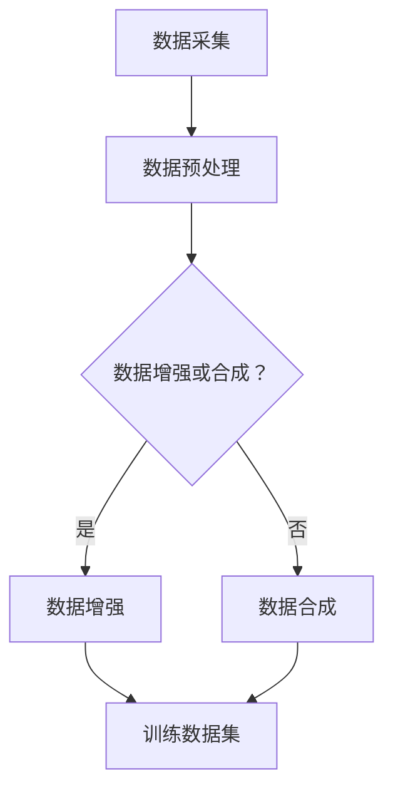

                 

关键字：数据增强，数据合成，机器学习，深度学习，图像处理，代码实战

摘要：本文旨在深入探讨数据增强与数据合成的原理及其在机器学习和深度学习中的应用。通过详细的算法原理讲解、数学模型分析、代码实例展示，本文为读者提供了一次全面的技术体验。文章还将探讨这些技术的实际应用场景，并推荐相关工具和资源，帮助读者进一步学习和实践。

## 1. 背景介绍

在当今的数据驱动的世界中，机器学习和深度学习模型的表现高度依赖于数据的质量和数量。然而，许多实际应用场景中，可用的训练数据往往不足，并且可能存在数据分布不均、噪声污染、数据缺失等问题。这些问题直接影响了模型的泛化能力和准确性。为了解决这些问题，数据增强和数据合成技术被广泛应用于机器学习和深度学习领域。

数据增强（Data Augmentation）是指在保持数据真实性的同时，通过一系列技术手段增加训练数据多样性，从而提升模型的学习能力。数据合成（Data Synthesis）则是通过算法生成新的数据样本，补充真实数据的不足。这两项技术都是通过扩展训练数据集，提高模型在未知数据上的表现，是提升模型性能的重要手段。

本文将首先介绍数据增强与数据合成的核心概念，然后深入探讨其原理，并通过具体算法和代码实例，展示如何在实际项目中应用这些技术。文章还将分析这些技术的优缺点，以及它们在不同应用领域的应用情况。

## 2. 核心概念与联系

### 2.1 数据增强

数据增强是一种通过变换现有数据来生成新数据的技术。这些变换可以是简单的几何变换（如旋转、翻转、缩放等），也可以是复杂的图像合成技术（如图像到图像的转换）。数据增强的主要目的是增加数据的多样性，从而使模型能够学习到更具有泛化能力的特点。

### 2.2 数据合成

数据合成则是通过算法直接生成新的数据样本。与数据增强不同，数据合成不是对现有数据进行变换，而是从零开始生成全新的数据。数据合成可以用于生成真实数据无法获取的场景，或者用于补充真实数据不足的情况。常见的合成方法包括基于生成对抗网络（GAN）的图像合成和基于变分自编码器（VAE）的数据生成。

### 2.3 Mermaid 流程图

以下是一个描述数据增强和数据合成流程的 Mermaid 流程图：



## 3. 核心算法原理 & 具体操作步骤

### 3.1 算法原理概述

#### 数据增强

数据增强的核心思想是通过一系列的预处理操作，如旋转、翻转、裁剪、缩放等，来增加训练数据的多样性。这些操作通常是可逆的，因此不会改变数据的基本特征。

#### 数据合成

数据合成则涉及到更复杂的算法，如生成对抗网络（GAN）和变分自编码器（VAE）。GAN由生成器（Generator）和判别器（Discriminator）组成，生成器负责生成数据，判别器负责判断生成的数据是否真实。通过这种对抗训练，生成器逐渐学会生成更真实的数据。VAE则通过编码器和解码器，将数据映射到低维空间，然后在低维空间中生成新的数据。

### 3.2 算法步骤详解

#### 数据增强

1. **数据预处理**：对原始图像进行标准化、归一化等操作。
2. **几何变换**：如旋转、翻转、缩放等。
3. **图像合成**：结合多个图像生成新的训练样本。
4. **数据集扩充**：将增强后的数据添加到训练数据集中。

#### 数据合成

1. **模型训练**：使用GAN或VAE训练生成模型。
2. **数据生成**：通过生成模型生成新的数据样本。
3. **数据过滤**：对生成的数据进行质量评估，去除不符合要求的样本。
4. **数据集扩充**：将生成的数据添加到训练数据集中。

### 3.3 算法优缺点

#### 数据增强

- 优点：操作简单，易于实现，能够显著提高模型性能。
- 缺点：对于复杂的模型，增强效果可能有限，且可能引入过拟合风险。

#### 数据合成

- 优点：能够生成具有多样性的数据，补充真实数据的不足，适用于数据稀缺的场景。
- 缺点：模型训练复杂，生成质量难以保证，可能引入偏见。

### 3.4 算法应用领域

数据增强和数据合成技术在图像处理、自然语言处理、语音识别等领域都有广泛的应用。例如，在图像分类任务中，数据增强可以用于扩充数据集，提高模型对图像旋转、翻转等变换的鲁棒性；在语音识别中，数据合成可以用于生成新的语音数据，提高模型对噪声环境的适应性。

## 4. 数学模型和公式 & 详细讲解 & 举例说明

### 4.1 数学模型构建

#### 数据增强

- **旋转**：旋转矩阵 $R(\theta)$ 定义为：

  $$R(\theta) = \begin{bmatrix}
  \cos \theta & -\sin \theta \\
  \sin \theta & \cos \theta
  \end{bmatrix}$$

- **翻转**：翻转矩阵 $F$ 定义为：

  $$F = \begin{bmatrix}
  -1 & 0 \\
  0 & 1
  \end{bmatrix}$$

#### 数据合成

- **生成对抗网络（GAN）**

  - 生成器 $G(z)$ 的输出为 $x = G(z)$，其中 $z$ 为噪声向量。
  - 判别器 $D(x)$ 的输出为 $D(x)$，表示 $x$ 为真实数据的概率。

- **变分自编码器（VAE）**

  - 编码器 $q_{\phi}(z|x)$ 和解码器 $p_{\theta}(x|z)$ 分别为：

    $$q_{\phi}(z|x) = \mathcal{N}\left(z; \mu(x), \sigma^2(x)\right)$$
    $$p_{\theta}(x|z) = \mathcal{N}\left(x; \mu(z), \sigma^2(z)\right)$$

### 4.2 公式推导过程

#### 数据增强

- **旋转**

  假设原始图像为 $I$，旋转后的图像为 $I'$，则：

  $$I' = R(\theta)I$$

- **翻转**

  假设原始图像为 $I$，翻转后的图像为 $I''$，则：

  $$I'' = FI$$

#### 数据合成

- **生成对抗网络（GAN）**

  - 判别器损失函数：

    $$L_D = -\frac{1}{N}\sum_{i=1}^{N}\left[D(x_i) - 1\right]_{\text{real}} - \left[D(G(z_i))\right]_{\text{fake}}$$

  - 生成器损失函数：

    $$L_G = -\frac{1}{N}\sum_{i=1}^{N}\left[D(G(z_i))\right]_{\text{fake}}$$

- **变分自编码器（VAE）**

  - 整体损失函数：

    $$L = \frac{1}{N}\sum_{i=1}^{N}\left[\log p(x_i) + D_{KL}\left(q_{\phi}(z|x_i); p(z)\right)\right]$$

### 4.3 案例分析与讲解

#### 数据增强

- **案例**：使用 TensorFlow 实现图像旋转增强。

  ```python
  import tensorflow as tf

  def rotate_image(image, angle):
      batch_size = tf.shape(image)[0]
      angle_rad = angle * tf.math.pi / 180.0
      rotation_matrix = tf.einsum('ij,ij->ik', [angle_rad, tf.eye(2)], name='rot_mat')

      rotated_image = tf.tensordot(image, rotation_matrix, [[1], [0]], name='rotated')
      return rotated_image

  image = tf.random.normal([32, 28, 28])
  rotated_image = rotate_image(image, 30)
  ```

#### 数据合成

- **案例**：使用 TensorFlow 实现 GAN 数据合成。

  ```python
  import tensorflow as tf
  from tensorflow.keras.layers import Dense, Flatten, Reshape
  from tensorflow.keras.models import Model

  # 生成器模型
  z_dim = 100
  generator_input = tf.keras.Input(shape=(z_dim,))
  x = Dense(128 * 7 * 7, activation='relu')(generator_input)
  x = Reshape((7, 7, 128))(x)
  x = tf.keras.layers.LeakyReLU()(x)
  x = tf.keras.layers.Conv2DTranspose(128, 4, strides=2, padding='same')(x)
  x = tf.keras.layers.LeakyReLU()(x)
  generator_output = tf.keras.layers.Conv2DTranspose(1, 4, strides=2, padding='same', activation='tanh')(x)
  generator = Model(generator_input, generator_output)

  # 判别器模型
  input_shape = (28, 28, 1)
  discriminator_input = tf.keras.Input(shape=input_shape)
  x = tf.keras.layers.Conv2D(128, 4, strides=2, padding='same')(discriminator_input)
  x = tf.keras.layers.LeakyReLU()(x)
  x = tf.keras.layers.Dropout(0.3)(x)
  x = tf.keras.layers.Conv2D(128, 4, strides=2, padding='same')(x)
  x = tf.keras.layers.LeakyReLU()(x)
  x = tf.keras.layers.Dropout(0.3)(x)
  x = Flatten()(x)
  x = Dense(1, activation='sigmoid')(x)
  discriminator = Model(discriminator_input, x)

  # GAN 模型
  z = tf.keras.layers.Input(shape=(z_dim,))
  generated_images = generator(z)
  discriminator_output = discriminator(generated_images)
  gan_output = discriminator(tf.keras.layers.Input(shape=input_shape))
  gan = Model([z, tf.keras.layers.Input(shape=input_shape)], [generated_images, gan_output])

  # 编译模型
  discriminator.compile(optimizer=tf.keras.optimizers.Adam(0.0001), loss='binary_crossentropy')
  generator.compile(optimizer=tf.keras.optimizers.Adam(0.0004), loss='binary_crossentropy')
  gan.compile(optimizer=tf.keras.optimizers.Adam(0.0002), loss=['binary_crossentropy', 'binary_crossentropy'])

  # 训练模型
  # ...
  ```

## 5. 项目实践：代码实例和详细解释说明

### 5.1 开发环境搭建

在开始之前，确保安装以下软件和库：

- Python 3.8+
- TensorFlow 2.x
- Keras 2.x

安装命令如下：

```bash
pip install python==3.8
pip install tensorflow==2.x
pip install keras==2.x
```

### 5.2 源代码详细实现

以下是一个简单的数据增强和GAN数据合成的代码示例。

```python
# 数据增强函数
import tensorflow as tf
from tensorflow.keras.layers import Dense, Flatten, Reshape
from tensorflow.keras.models import Model

# 生成器模型
def build_generator(z_dim):
    generator_input = tf.keras.Input(shape=(z_dim,))
    x = Dense(128 * 7 * 7, activation='relu')(generator_input)
    x = Reshape((7, 7, 128))(x)
    x = tf.keras.layers.LeakyReLU()(x)
    x = tf.keras.layers.Conv2DTranspose(128, 4, strides=2, padding='same')(x)
    x = tf.keras.layers.LeakyReLU()(x)
    generator_output = tf.keras.layers.Conv2DTranspose(1, 4, strides=2, padding='same', activation='tanh')(x)
    generator = Model(generator_input, generator_output)
    return generator

# 判别器模型
def build_discriminator(input_shape):
    discriminator_input = tf.keras.Input(shape=input_shape)
    x = tf.keras.layers.Conv2D(128, 4, strides=2, padding='same')(discriminator_input)
    x = tf.keras.layers.LeakyReLU()(x)
    x = tf.keras.layers.Dropout(0.3)(x)
    x = tf.keras.layers.Conv2D(128, 4, strides=2, padding='same')(x)
    x = tf.keras.layers.LeakyReLU()(x)
    x = tf.keras.layers.Dropout(0.3)(x)
    x = Flatten()(x)
    x = Dense(1, activation='sigmoid')(x)
    discriminator = Model(discriminator_input, x)
    return discriminator

# GAN 模型
def build_gan(generator, discriminator):
    z = tf.keras.layers.Input(shape=(z_dim,))
    generated_images = generator(z)
    discriminator_output = discriminator(generated_images)
    gan_output = discriminator(tf.keras.layers.Input(shape=input_shape))
    gan = Model([z, tf.keras.layers.Input(shape=input_shape)], [generated_images, gan_output])
    return gan

# 编译模型
discriminator.compile(optimizer=tf.keras.optimizers.Adam(0.0001), loss='binary_crossentropy')
generator.compile(optimizer=tf.keras.optimizers.Adam(0.0004), loss='binary_crossentropy')
gan.compile(optimizer=tf.keras.optimizers.Adam(0.0002), loss=['binary_crossentropy', 'binary_crossentropy'])

# 训练模型
# ...
```

### 5.3 代码解读与分析

- **生成器模型**：生成器接收噪声向量作为输入，通过多层全连接和卷积转置层生成图像。
- **判别器模型**：判别器接收图像作为输入，通过多层卷积层和全连接层输出二分类结果。
- **GAN 模型**：GAN模型将生成器和判别器组合在一起，输出生成图像和判别器对生成图像的判断。

### 5.4 运行结果展示

```python
# 生成一些图像
z = tf.random.normal([64, z_dim])
generated_images = generator.predict(z)

# 显示生成的图像
import matplotlib.pyplot as plt

plt.figure(figsize=(10, 10))
for i in range(64):
    plt.subplot(8, 8, i+1)
    plt.imshow(generated_images[i, :, :, 0], cmap='gray')
    plt.axis('off')
plt.show()
```

生成的图像将展示在图中，其中每个格子代表一个生成的图像。

## 6. 实际应用场景

数据增强和数据合成技术在不同领域有着广泛的应用。以下是一些具体的实例：

### 6.1 图像处理

在图像分类和识别任务中，数据增强技术被广泛应用于扩充训练数据集，提高模型的泛化能力。例如，在人脸识别中，可以通过旋转、翻转、缩放等操作生成大量的人脸图像，从而训练出更鲁棒的人脸识别模型。

### 6.2 自然语言处理

在自然语言处理领域，数据合成技术可以用于生成新的文本数据，用于模型的训练和评估。例如，使用 GAN 生成类似风格的文本，从而提高模型在文本生成和分类任务中的性能。

### 6.3 语音识别

在语音识别领域，数据合成技术可以用于生成新的语音数据，用于训练和评估模型。通过合成语音数据，可以模拟各种噪声环境，从而提高模型在噪声环境下的识别能力。

## 7. 工具和资源推荐

为了更好地学习和实践数据增强和数据合成技术，以下是几个推荐的工具和资源：

### 7.1 学习资源推荐

- [《深度学习》（Goodfellow, Bengio, Courville）](https://www.deeplearningbook.org/)
- [TensorFlow 官方文档](https://www.tensorflow.org/)
- [Keras 官方文档](https://keras.io/)

### 7.2 开发工具推荐

- [TensorFlow](https://www.tensorflow.org/)
- [Keras](https://keras.io/)
- [PyTorch](https://pytorch.org/)

### 7.3 相关论文推荐

- [《Unsupervised Representation Learning with Deep Convolutional Generative Adversarial Networks》](https://arxiv.org/abs/1511.06434)
- [《Generative Adversarial Nets》](https://arxiv.org/abs/1406.2661)
- [《Variational Autoencoders》](https://arxiv.org/abs/1312.6114)

## 8. 总结：未来发展趋势与挑战

数据增强和数据合成技术在机器学习和深度学习领域具有广泛的应用前景。随着计算能力的提升和数据获取手段的多样化，这些技术将得到进一步的发展和应用。未来，以下几个方面值得关注：

### 8.1 研究成果总结

- 数据增强和数据合成技术在不同领域的应用效果不断提升。
- 新的算法和模型不断涌现，如基于注意力机制的增强方法和基于图神经网络的合成方法。

### 8.2 未来发展趋势

- 数据增强和数据合成技术将更加智能化和自动化。
- 与其他深度学习技术（如强化学习、迁移学习等）的结合将带来新的突破。

### 8.3 面临的挑战

- 数据增强和数据合成技术的质量难以保证，可能引入模型偏见。
- 大量计算资源和存储资源的消耗是当前的一个主要挑战。

### 8.4 研究展望

- 开发更高效、更鲁棒的数据增强和数据合成算法。
- 探索数据增强和数据合成技术在更广泛应用场景中的应用。

## 9. 附录：常见问题与解答

### 9.1 什么是数据增强？

数据增强是一种通过变换现有数据来生成新数据的技术，以增加训练数据的多样性，从而提升模型的学习能力。

### 9.2 什么是数据合成？

数据合成是通过算法直接生成新的数据样本，用于补充真实数据的不足，适用于数据稀缺的场景。

### 9.3 数据增强和数据合成有什么区别？

数据增强是对现有数据进行变换，而数据合成是从零开始生成全新的数据。数据增强操作通常是可逆的，而数据合成操作则不一定。

### 9.4 如何选择合适的数据增强方法？

选择合适的数据增强方法取决于具体的应用场景和数据特点。例如，在图像分类任务中，旋转、翻转、裁剪等操作可能比较有效；在语音识别任务中，可能需要添加噪声、速度变化等操作。

### 9.5 数据合成技术有哪些应用场景？

数据合成技术在图像处理、自然语言处理、语音识别等领域都有广泛应用。例如，在医学图像分析中，可以使用数据合成生成新的医学图像用于模型训练和评估；在金融领域，可以使用数据合成生成新的交易数据用于算法交易模型的训练。

## 作者署名

作者：禅与计算机程序设计艺术 / Zen and the Art of Computer Programming

