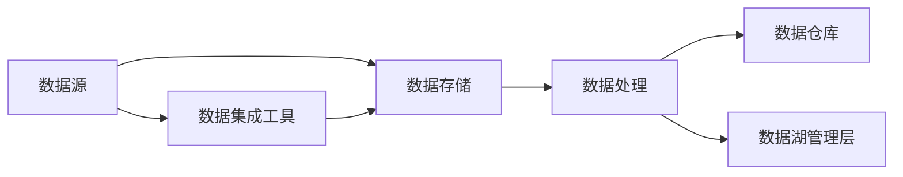

                 

关键词：数据湖，架构，大规模数据存储，数据分析，云计算，数据治理，数据架构设计

> 摘要：本文将深入探讨数据湖架构在当今大数据时代的应用与价值，分析其核心概念、架构设计、算法原理、数学模型及其在各个行业中的应用场景，展望未来发展趋势与挑战。

## 1. 背景介绍

随着互联网和物联网的快速发展，数据量呈现出爆炸式增长。传统的数据仓库架构在处理大规模数据时逐渐暴露出性能瓶颈和扩展性不足的问题。为了应对这些挑战，数据湖架构应运而生。数据湖（Data Lake）是一种新型数据存储架构，旨在提供一种开放、灵活、高效的数据存储和管理方式。

数据湖不同于传统数据仓库，它采用分布式文件系统如Hadoop分布式文件系统（HDFS）或云存储服务进行数据存储，支持多种数据格式，包括结构化、半结构化和非结构化数据。这种架构能够更好地支持大数据的存储、处理和分析，为企业和研究机构提供强大的数据处理能力。

## 2. 核心概念与联系

### 2.1 数据湖的核心概念

数据湖的核心概念包括：

- **数据存储：** 数据湖采用分布式文件系统或云存储服务作为底层存储，支持PB级数据存储能力。

- **数据格式：** 数据湖支持多种数据格式，包括CSV、JSON、Parquet、ORC等，能够满足不同类型数据的存储需求。

- **数据治理：** 数据湖强调数据的治理和管理，确保数据的一致性、完整性和安全性。

- **数据集成：** 数据湖提供高效的数据集成工具，能够从各种数据源（如数据库、数据流、Web API等）收集和导入数据。

### 2.2 数据湖的架构设计

数据湖的架构设计主要包括以下层次：

- **数据源：** 数据源可以是内部数据库、外部数据流、Web API等。

- **数据存储：** 分布式文件系统或云存储服务作为底层存储。

- **数据处理：** 包括批处理和实时处理，如Hadoop、Spark、Flink等。

- **数据仓库：** 部分结构化数据可以迁移到数据仓库进行深层次分析。

- **数据湖管理层：** 包括元数据管理、数据治理、数据安全等功能。

下面是数据湖架构的Mermaid流程图：



## 3. 核心算法原理 & 具体操作步骤

### 3.1 算法原理概述

数据湖架构的核心算法主要包括：

- **分布式存储算法：** 如HDFS的块存储机制。

- **分布式处理算法：** 如MapReduce、Spark的分布式计算模型。

- **数据清洗和转换算法：** 如ETL（提取、转换、加载）过程。

- **数据索引和查询算法：** 如Hadoop的MapReduce查询机制。

### 3.2 算法步骤详解

1. **数据采集：** 通过数据集成工具从各种数据源收集数据。

2. **数据存储：** 将数据存储到分布式文件系统或云存储服务。

3. **数据处理：** 对数据进行清洗、转换和加工，通过分布式计算框架进行大规模数据处理。

4. **数据仓库迁移：** 部分结构化数据可以迁移到数据仓库进行深层次分析。

5. **数据湖管理层：** 实现元数据管理、数据治理、数据安全等功能。

### 3.3 算法优缺点

**优点：**

- **灵活性高：** 数据湖支持多种数据格式，适应不同的数据处理需求。

- **扩展性强：** 数据湖采用分布式架构，能够支持大规模数据存储和处理。

- **成本低：** 相较于传统数据仓库，数据湖在硬件和软件方面的投入较低。

**缺点：**

- **数据治理复杂：** 数据湖缺乏有效的数据治理机制，可能导致数据质量下降。

- **查询性能有限：** 对于结构化数据的查询性能相对较低。

### 3.4 算法应用领域

数据湖架构在以下领域具有广泛的应用：

- **金融行业：** 用于处理大规模交易数据、客户数据等。

- **医疗行业：** 用于存储和管理医学影像、患者数据等。

- **物联网行业：** 用于处理海量物联网设备产生的数据。

## 4. 数学模型和公式 & 详细讲解 & 举例说明

### 4.1 数学模型构建

数据湖架构涉及到多个数学模型，其中最重要的是分布式存储和分布式计算模型。以下是一个简单的分布式存储模型：

$$
P = \sum_{i=1}^{n} P_i
$$

其中，$P$ 表示整体数据存储容量，$P_i$ 表示第 $i$ 个数据存储节点的容量。

### 4.2 公式推导过程

分布式存储模型的推导过程如下：

1. **单节点容量：** 假设每个节点的存储容量为 $C$。

2. **节点数量：** 假设数据湖由 $n$ 个节点组成。

3. **总容量：** 数据湖的总容量为各个节点容量的总和。

$$
P = C \times n
$$

4. **存储效率：** 考虑到数据冗余和存储优化，实际总容量可能大于理论总容量。

$$
P_{\text{实际}} = P \times \eta
$$

其中，$\eta$ 表示存储效率。

### 4.3 案例分析与讲解

假设一个数据湖由10个节点组成，每个节点的存储容量为100TB，存储效率为1.2。根据上述模型，可以计算出：

- **理论总容量：** $P = 100TB \times 10 = 1000TB$

- **实际总容量：** $P_{\text{实际}} = 1000TB \times 1.2 = 1200TB$

这意味着数据湖能够存储1200TB的数据，远超过单个节点的存储能力。

## 5. 项目实践：代码实例和详细解释说明

### 5.1 开发环境搭建

为了实践数据湖架构，我们首先需要搭建一个Hadoop集群。具体步骤如下：

1. **环境准备：** 准备一台或多台服务器，安装Linux操作系统。

2. **安装Hadoop：** 下载Hadoop源代码，解压并配置环境变量。

3. **配置集群：** 配置Hadoop集群的各个组件，包括HDFS、YARN、MapReduce等。

4. **启动集群：** 运行启动脚本，启动Hadoop集群。

### 5.2 源代码详细实现

以下是一个简单的Hadoop程序，用于计算WordCount：

```java
import org.apache.hadoop.conf.Configuration;
import org.apache.hadoop.fs.Path;
import org.apache.hadoop.io.IntWritable;
import org.apache.hadoop.io.Text;
import org.apache.hadoop.mapreduce.Job;
import org.apache.hadoop.mapreduce.Mapper;
import org.apache.hadoop.mapreduce.Reducer;
import org.apache.hadoop.mapreduce.lib.input.FileInputFormat;
import org.apache.hadoop.mapreduce.lib.output.FileOutputFormat;

public class WordCount {

  public static class TokenizerMapper
       extends Mapper<Object, Text, Text, IntWritable>{

    private final static IntWritable one = new IntWritable(1);
    private Text word = new Text();

    public void map(Object key, Text value, Context context) 
            throws IOException, InterruptedException {
      String[] words = value.toString().split("\\s+");
      for (String word : words) {
        this.word.set(word);
        context.write(this.word, one);
      }
    }
  }

  public static class IntSumReducer
       extends Reducer<Text,IntWritable,Text,IntWritable> {
    private IntWritable result = new IntWritable();

    public void reduce(Text key, Iterable<IntWritable> values, 
                Context context
            ) throws IOException, InterruptedException {
      int sum = 0;
      for (IntWritable val : values) {
        sum += val.get();
      }
      result.set(sum);
      context.write(key, result);
    }
  }

  public static void main(String[] args) throws Exception {
    Configuration conf = new Configuration();
    Job job = Job.getInstance(conf, "word count");
    job.setJarByClass(WordCount.class);
    job.setMapperClass(TokenizerMapper.class);
    job.setCombinerClass(IntSumReducer.class);
    job.setReducerClass(IntSumReducer.class);
    job.setOutputKeyClass(Text.class);
    job.setOutputValueClass(IntWritable.class);
    FileInputFormat.addInputPath(job, new Path(args[0]));
    FileOutputFormat.setOutputPath(job, new Path(args[1]));
    System.exit(job.waitForCompletion(true) ? 0 : 1);
  }
}
```

### 5.3 代码解读与分析

这个WordCount程序实现了对文本文件中单词的计数功能。程序主要由三个部分组成：

- **Mapper类：** 输入参数为文本文件中的每一行，输出参数为单词及其计数。

- **Reducer类：** 输入参数为相同单词的计数结果，输出参数为单词及其总计数。

- **主函数：** 配置Hadoop作业，设置Mapper和Reducer类，运行作业。

### 5.4 运行结果展示

假设我们有一个文本文件`input.txt`，内容如下：

```
Hello world!
Hello Hadoop!
Hadoop is great.
```

运行WordCount程序后，输出结果如下：

```
Hadoop 2
Hello 3
is 1
world! 1
```

这意味着文件中出现了2次Hadoop、3次Hello等。

## 6. 实际应用场景

数据湖架构在多个行业和领域具有广泛的应用：

- **金融行业：** 数据湖用于存储和管理交易数据、客户数据、市场数据等，支持实时分析和风险管理。

- **医疗行业：** 数据湖用于存储和管理医学影像、患者数据、基因数据等，支持个性化医疗和精准治疗。

- **物联网行业：** 数据湖用于存储和管理物联网设备产生的数据，支持设备监控、故障诊断和优化。

## 7. 工具和资源推荐

### 7.1 学习资源推荐

- 《Hadoop权威指南》

- 《大数据技术导论》

- 《数据湖：概念、技术与应用》

### 7.2 开发工具推荐

- Hadoop

- Spark

- Hive

- Impala

### 7.3 相关论文推荐

- "Data Lakes for Analytics: Practical Considerations" by E. Brown, M. Dash, D. Poochaki, A. Ray, and B. Yee.

- "A Data Lake Architecture for Big Data Analytics in Healthcare" by A. Ananthanarayanan, V. Guruswamy, and R. Banerji.

## 8. 总结：未来发展趋势与挑战

### 8.1 研究成果总结

数据湖架构在处理大规模数据、支持多种数据格式、提高数据处理效率等方面取得了显著成果。未来，数据湖架构将继续在人工智能、物联网、云计算等领域发挥重要作用。

### 8.2 未来发展趋势

- **数据治理与安全性：** 随着数据量不断增加，数据治理与安全将成为数据湖架构的重要研究方向。

- **智能化与自动化：** 数据湖架构将朝着更智能化、自动化的方向发展，提高数据处理和分析的效率。

- **实时处理与流数据处理：** 数据湖架构将加强对实时处理和流数据处理的支持，满足实时业务需求。

### 8.3 面临的挑战

- **数据质量：** 数据湖缺乏有效的数据治理机制，可能导致数据质量问题。

- **性能优化：** 随着数据量增加，数据湖的性能优化将成为重要挑战。

- **行业标准化：** 数据湖在行业标准化方面存在不足，需要制定统一的规范和标准。

### 8.4 研究展望

未来，数据湖架构将在人工智能、物联网、云计算等领域发挥更加重要的作用，推动大数据技术的不断创新和发展。同时，数据治理、数据安全、性能优化等研究方向将成为关键领域，为数据湖架构的持续发展提供有力支持。

## 9. 附录：常见问题与解答

### 9.1 数据湖与传统数据仓库的区别是什么？

数据湖与传统数据仓库的主要区别在于数据格式、数据治理和扩展性。数据湖支持多种数据格式，无需事先定义数据结构，而传统数据仓库需要事先定义数据模型。数据湖强调数据的灵活性和开放性，而传统数据仓库注重数据的一致性和完整性。此外，数据湖采用分布式架构，具有更强的扩展性和性能。

### 9.2 数据湖如何保证数据安全？

数据湖通过以下方式保证数据安全：

- **加密存储：** 对数据进行加密存储，确保数据在传输和存储过程中不被窃取。

- **权限管理：** 实现细粒度的权限管理，控制用户对数据的访问权限。

- **审计与监控：** 对数据湖进行实时监控和审计，确保数据的安全性和合规性。

### 9.3 数据湖适合哪些场景？

数据湖适合以下场景：

- **大数据处理：** 数据湖能够处理大规模数据，适合金融、医疗、物联网等行业。

- **数据多样化：** 数据湖支持多种数据格式，适合处理结构化、半结构化和非结构化数据。

- **数据集成与治理：** 数据湖能够高效地进行数据集成与治理，满足企业数据管理的需求。

作者：禅与计算机程序设计艺术 / Zen and the Art of Computer Programming

----------------------------------------------------------------

以上是《数据湖架构：大规模数据存储和分析》的完整文章内容。本文深入探讨了数据湖架构的核心概念、架构设计、算法原理、数学模型及其在实际应用中的场景，并对未来发展趋势和挑战进行了展望。希望本文能为读者提供有价值的参考和启示。

