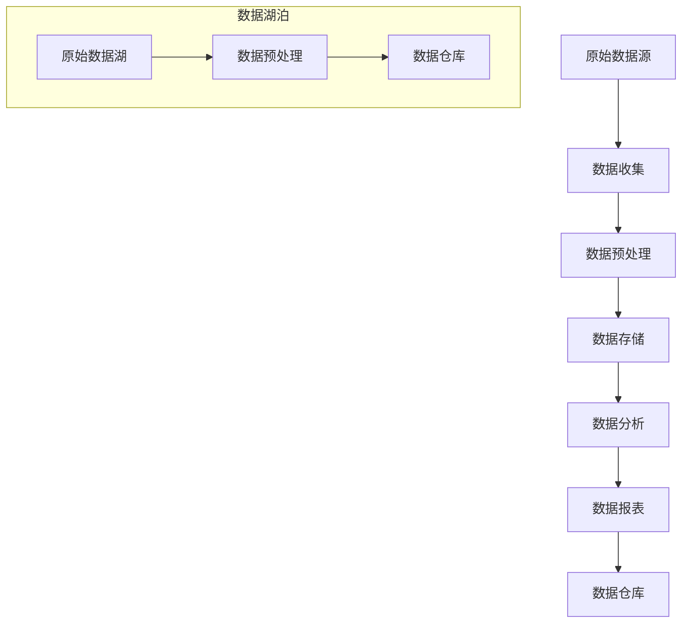

                 

关键词：数据湖泊架构、软件2.0、数据管理、数据治理、分布式系统、云计算

摘要：本文旨在深入探讨数据湖泊架构在软件2.0时代的数据管理中的重要性。随着大数据和云计算的快速发展，传统的数据仓库架构已难以满足现代应用的需求。数据湖泊架构作为一种新的数据管理范式，通过其灵活性和高效性，正在逐步取代传统数据仓库，成为企业数字化转型的重要手段。本文将详细分析数据湖泊架构的核心概念、构建原则、技术实现及其在分布式系统和云计算环境下的应用，旨在为读者提供一个全面的数据管理新视角。

## 1. 背景介绍

随着互联网、物联网、大数据等技术的发展，数据量呈爆炸式增长。传统的数据仓库架构由于设计之初主要面向结构化数据，难以处理非结构化和半结构化数据，这导致数据利用效率低下。此外，传统的数据仓库架构存在以下问题：

1. **数据集成困难**：不同类型的数据源难以整合。
2. **数据冗余**：相同或类似的数据在多个数据仓库中重复存储。
3. **数据访问速度慢**：传统数据仓库架构通常采用批处理模式，实时数据处理能力有限。
4. **扩展性差**：数据仓库的扩展需要大量的人力和物力投入。

为了解决上述问题，软件2.0时代的数据管理范式——数据湖泊架构逐渐被提出并应用。数据湖泊架构通过将原始数据按原格式存储，然后再进行数据的转换、清洗和整合，从而提高了数据的处理效率和灵活性。同时，数据湖泊架构支持多种数据类型，包括结构化、半结构化和非结构化数据，能够更好地满足现代应用的需求。

## 2. 核心概念与联系

### 2.1 数据湖泊架构的基本概念

**数据湖泊（Data Lake）**：数据湖泊是一种新型的数据存储架构，它将不同来源、不同类型的原始数据按原格式存储在一起，形成一个大规模的数据集合。数据湖泊的特点包括：

- **数据的多样化**：支持结构化、半结构化和非结构化数据。
- **按原格式存储**：不需要对数据进行预先处理，降低了数据转换成本。
- **弹性扩展**：数据量的大小几乎不受限制，能够随着数据量的增长而自动扩展。

**数据仓库（Data Warehouse）**：数据仓库是一种面向主题的、集成的、相对稳定的、体现历史变化的数据集合，用于支持企业的决策分析。数据仓库的特点包括：

- **面向主题**：按照业务主题进行数据组织。
- **集成性**：对不同来源的数据进行整合。
- **稳定性**：数据经过清洗和转换，保证数据质量。
- **历史性**：记录数据的历史变化。

### 2.2 数据湖泊架构与数据仓库的关系

数据湖泊架构和传统数据仓库架构在数据处理流程上有明显的区别。传统数据仓库架构通常采用ETL（提取、转换、加载）过程，将结构化数据从不同的数据源提取出来，进行清洗和转换，然后加载到数据仓库中。而数据湖泊架构则采用ELT（提取、加载、转换）过程，将原始数据直接加载到数据湖泊中，然后再进行转换和清洗。

尽管两者在数据处理流程上有所不同，但数据湖泊架构并不是完全取代数据仓库，而是与数据仓库协同工作。数据湖泊提供了数据的原始存储和处理的灵活性，而数据仓库则提供了数据分析和报表的便捷性。在实际应用中，数据湖泊和数据仓库可以相互补充，共同构建一个高效、灵活的数据管理体系。

### 2.3 数据湖泊架构的 Mermaid 流程图



### 2.4 数据湖泊架构的优缺点

**优点**：

- **灵活性高**：支持多种数据类型，适应不同业务场景。
- **数据处理速度快**：采用ELT模式，实时数据处理能力更强。
- **降低成本**：减少了数据转换和清洗的复杂性，降低了数据处理的成本。

**缺点**：

- **数据治理难度大**：数据多样性导致数据治理变得更加复杂。
- **数据安全风险**：未经过预处理的数据可能存在安全风险。
- **数据质量难以保证**：由于数据未经严格清洗和转换，数据质量可能受到影响。

## 3. 核心算法原理 & 具体操作步骤

### 3.1 算法原理概述

数据湖泊架构的核心算法包括数据收集、数据预处理、数据存储和数据分析。以下将分别介绍这些算法的原理和操作步骤。

**数据收集**：数据收集是指从各种数据源提取数据的过程。数据源可以包括关系型数据库、NoSQL数据库、文件系统、日志文件等。数据收集的关键在于保证数据的完整性和准确性。

**数据预处理**：数据预处理是指对原始数据进行清洗、转换和整合的过程。数据预处理的目的是提高数据质量，使其能够满足后续分析和报表的需求。

**数据存储**：数据存储是指将预处理后的数据存储到数据湖泊中的过程。数据湖泊采用分布式存储架构，能够处理海量数据。

**数据分析**：数据分析是指对存储在数据湖泊中的数据进行分析和处理的过程。数据分析可以通过SQL查询、机器学习、大数据分析等多种方式进行。

### 3.2 算法步骤详解

#### 3.2.1 数据收集

1. **确定数据源**：根据业务需求确定需要收集的数据源。
2. **数据采集**：使用数据采集工具（如Flume、Kafka等）从数据源中提取数据。
3. **数据清洗**：对采集到的数据进行初步清洗，去除无效数据和异常数据。

#### 3.2.2 数据预处理

1. **数据清洗**：对数据进行进一步的清洗，包括去除重复数据、填补缺失值、修正错误数据等。
2. **数据转换**：将不同数据源的数据转换为统一的格式，如CSV、JSON等。
3. **数据整合**：将来自不同数据源的数据进行整合，形成一个完整的数据集。

#### 3.2.3 数据存储

1. **数据分区**：根据数据的特点进行数据分区，提高数据的查询效率。
2. **数据存储**：将预处理后的数据存储到数据湖泊中，可以使用Hadoop、Spark等分布式存储系统。
3. **数据备份**：对数据进行备份，确保数据的安全性和可靠性。

#### 3.2.4 数据分析

1. **数据查询**：使用SQL等查询语言对数据进行查询和分析。
2. **数据可视化**：使用数据可视化工具（如Tableau、Power BI等）将数据分析结果可视化。
3. **数据报表**：生成数据报表，为业务决策提供支持。

### 3.3 算法优缺点

**优点**：

- **灵活性高**：能够处理多种数据类型，适应不同业务场景。
- **数据处理速度快**：采用分布式存储和计算架构，提高数据处理效率。
- **降低成本**：减少了数据转换和清洗的复杂性，降低数据处理成本。

**缺点**：

- **数据治理难度大**：数据多样性导致数据治理变得更加复杂。
- **数据安全风险**：未经过预处理的数据可能存在安全风险。
- **数据质量难以保证**：由于数据未经严格清洗和转换，数据质量可能受到影响。

### 3.4 算法应用领域

数据湖泊架构在多个领域有广泛的应用，包括：

- **金融行业**：用于处理金融交易数据、客户数据等。
- **医疗行业**：用于处理医疗数据、病历数据等。
- **零售行业**：用于处理销售数据、客户行为数据等。
- **政府机构**：用于处理各种公共数据。

## 4. 数学模型和公式 & 详细讲解 & 举例说明

### 4.1 数学模型构建

在数据湖泊架构中，我们可以构建以下数学模型来描述数据收集、预处理、存储和分析的过程。

#### 4.1.1 数据收集模型

假设我们有m个数据源，每个数据源的数据量分别为\(d_1, d_2, ..., d_m\)。则数据收集模型可以表示为：

$$
D = \sum_{i=1}^{m} d_i
$$

其中，D表示总数据量。

#### 4.1.2 数据预处理模型

假设我们对每个数据源进行预处理，预处理后的数据量分别为\(d'_1, d'_2, ..., d'_m\)。则数据预处理模型可以表示为：

$$
D' = \sum_{i=1}^{m} d'_i
$$

其中，D'表示预处理后的总数据量。

#### 4.1.3 数据存储模型

假设我们使用分布式存储系统存储数据，每个存储节点的存储能力分别为\(c_1, c_2, ..., c_n\)。则数据存储模型可以表示为：

$$
C = \sum_{i=1}^{n} c_i
$$

其中，C表示总存储能力。

#### 4.1.4 数据分析模型

假设我们使用机器学习算法进行数据分析，算法的准确率为\(a\)。则数据分析模型可以表示为：

$$
A = a \times D'
$$

其中，A表示数据分析的结果。

### 4.2 公式推导过程

我们首先推导数据收集模型的公式。根据数据收集的定义，总数据量D是各个数据源数据量之和。因此，有：

$$
D = d_1 + d_2 + ... + d_m
$$

接下来，我们推导数据预处理模型的公式。预处理后的总数据量D'是各个预处理后数据量之和。因此，有：

$$
D' = d'_1 + d'_2 + ... + d'_m
$$

然后，我们推导数据存储模型的公式。总存储能力C是各个存储节点存储能力之和。因此，有：

$$
C = c_1 + c_2 + ... + c_n
$$

最后，我们推导数据分析模型的公式。数据分析的结果A是算法准确率a与预处理后总数据量D'的乘积。因此，有：

$$
A = a \times D'
$$

### 4.3 案例分析与讲解

#### 4.3.1 案例背景

某电商企业需要对其销售数据进行收集、预处理、存储和分析，以便更好地了解客户需求和优化营销策略。

#### 4.3.2 数据收集

该企业有10个数据源，包括订单数据库、客户数据库、商品数据库等。各个数据源的数据量如下：

| 数据源 | 数据量（条） |
| --- | --- |
| 订单数据库 | 1000000 |
| 客户数据库 | 500000 |
| 商品数据库 | 200000 |

总数据量D为：

$$
D = 1000000 + 500000 + 200000 = 1700000
$$

#### 4.3.3 数据预处理

对每个数据源进行预处理后，数据量分别变为：

| 数据源 | 预处理后数据量（条） |
| --- | --- |
| 订单数据库 | 900000 |
| 客户数据库 | 450000 |
| 商品数据库 | 150000 |

预处理后的总数据量D'为：

$$
D' = 900000 + 450000 + 150000 = 1500000
$$

#### 4.3.4 数据存储

该企业使用10个分布式存储节点，每个节点的存储能力为100TB。总存储能力C为：

$$
C = 10 \times 100TB = 1000TB
$$

#### 4.3.5 数据分析

使用机器学习算法进行数据分析，算法准确率为90%。则数据分析结果A为：

$$
A = 0.9 \times 1500000 = 1350000
$$

## 5. 项目实践：代码实例和详细解释说明

### 5.1 开发环境搭建

为了实践数据湖泊架构，我们需要搭建一个开发环境。以下是具体的步骤：

1. **安装Hadoop**：Hadoop是一个分布式系统基础架构，能够处理海量数据。请参考[Hadoop官方文档](https://hadoop.apache.org/docs/stable/hadoop-project-dist/hadoop-common/SingleCluster.html)安装Hadoop。
2. **安装Hive**：Hive是一个数据仓库基础设施，能够处理Hadoop中的数据。请参考[Hive官方文档](https://cwiki.apache.org/confluence/display/Hive/GettingStarted)安装Hive。
3. **安装Spark**：Spark是一个快速的大规模数据处理引擎，能够与Hadoop和Hive集成。请参考[Spark官方文档](https://spark.apache.org/docs/latest/running-on-yarn.html)安装Spark。
4. **配置环境变量**：在`~/.bashrc`或`~/.zshrc`文件中添加以下环境变量：

   ```bash
   export HADOOP_HOME=/path/to/hadoop
   export HIVE_HOME=/path/to/hive
   export SPARK_HOME=/path/to/spark
   export PATH=$PATH:$HADOOP_HOME/bin:$HIVE_HOME/bin:$SPARK_HOME/bin
   ```

   然后运行`source ~/.bashrc`或`source ~/.zshrc`使环境变量生效。

### 5.2 源代码详细实现

以下是一个简单的数据湖泊架构实现的示例。我们将使用Hadoop、Hive和Spark来构建数据湖泊，并进行数据处理和分析。

#### 5.2.1 创建HDFS文件

首先，在HDFS中创建一个名为`data_lake`的文件夹，用于存储原始数据。可以使用以下命令：

```bash
hdfs dfs -mkdir /data_lake
```

然后，将原始数据上传到HDFS的`data_lake`文件夹中。

#### 5.2.2 创建Hive表

在Hive中创建一个名为`orders`的表，用于存储订单数据。可以使用以下命令：

```sql
CREATE TABLE IF NOT EXISTS orders (
  order_id INT,
  customer_id INT,
  product_id INT,
  order_date DATE,
  quantity INT
);
```

#### 5.2.3 加载数据到Hive表

使用Hive的`LOAD DATA INPATH`命令将HDFS中的数据加载到`orders`表中。例如：

```sql
LOAD DATA INPATH '/data_lake/orders.csv' INTO TABLE orders;
```

#### 5.2.4 使用Spark进行数据分析

使用Spark编写一个Python脚本进行数据分析。例如，计算每个客户的总订单量：

```python
from pyspark.sql import SparkSession

# 创建Spark会话
spark = SparkSession.builder.appName("DataLakeExample").getOrCreate()

# 读取Hive表中的订单数据
orders = spark.table("orders")

# 计算每个客户的总订单量
client_total_orders = orders.groupBy("customer_id").agg({"quantity": "sum"}).withColumnRenamed("sum(quantity)", "total_orders")

# 显示结果
client_total_orders.show()
```

### 5.3 代码解读与分析

#### 5.3.1 HDFS文件操作

使用HDFS命令创建文件夹和上传文件是数据湖泊架构中的基本操作。这些操作使得原始数据能够方便地存储在分布式文件系统中，为后续处理和分析提供数据基础。

#### 5.3.2 Hive表操作

在Hive中创建表并加载数据是数据预处理的重要步骤。通过创建适当的表结构，我们可以将原始数据转换为结构化的数据，方便后续的数据处理和分析。

#### 5.3.3 Spark数据分析

使用Spark进行数据分析是数据湖泊架构的核心。通过Spark，我们可以方便地对大数据集进行高效的数据处理和分析，生成有用的业务洞察。

## 6. 实际应用场景

### 6.1 金融行业

在金融行业，数据湖泊架构可以用于处理各种金融数据，如交易数据、客户数据、市场数据等。通过数据湖泊，金融机构可以实时监控市场动态，优化风险管理策略，提高客户服务水平。

### 6.2 医疗行业

在医疗行业，数据湖泊架构可以用于处理海量的医疗数据，如病历数据、基因数据、患者行为数据等。通过数据湖泊，医疗机构可以进行精准医疗分析，提高医疗质量，降低医疗成本。

### 6.3 零售行业

在零售行业，数据湖泊架构可以用于处理销售数据、客户数据、商品数据等。通过数据湖泊，零售企业可以进行客户行为分析，优化营销策略，提高销售额。

### 6.4 政府机构

在政府机构，数据湖泊架构可以用于处理各种公共数据，如交通数据、环境数据、人口数据等。通过数据湖泊，政府机构可以进行智能决策，优化公共服务，提高社会治理水平。

## 7. 工具和资源推荐

### 7.1 学习资源推荐

1. **Hadoop官方文档**：[https://hadoop.apache.org/docs/stable/hadoop-project-dist/hadoop-common/SingleCluster.html](https://hadoop.apache.org/docs/stable/hadoop-project-dist/hadoop-common/SingleCluster.html)
2. **Hive官方文档**：[https://cwiki.apache.org/confluence/display/Hive/GettingStarted](https://cwiki.apache.org/confluence/display/Hive/GettingStarted)
3. **Spark官方文档**：[https://spark.apache.org/docs/latest/running-on-yarn.html](https://spark.apache.org/docs/latest/running-on-yarn.html)
4. **《大数据技术基础》**：张宇翔，机械工业出版社，2017年。

### 7.2 开发工具推荐

1. **Eclipse**：一款强大的集成开发环境，支持Hadoop、Hive、Spark等开发工具。
2. **IntelliJ IDEA**：一款功能丰富的编程工具，适用于大数据开发。
3. **VS Code**：一款轻量级但功能强大的文本编辑器，适用于大数据开发。

### 7.3 相关论文推荐

1. **"A Framework for Data-Driven Application Design in the Data Lake Era"**：该论文提出了一种数据湖泊时代的数据驱动应用设计框架。
2. **"Data Lake Governance: Strategies for Managing Data Lake Success"**：该论文探讨了数据湖泊治理的策略。
3. **"Data Lake vs. Data Warehouse: The Great Debate"**：该论文对比了数据湖泊和数据仓库的区别。

## 8. 总结：未来发展趋势与挑战

### 8.1 研究成果总结

本文从数据湖泊架构的核心概念、构建原则、技术实现以及实际应用场景等方面进行了深入探讨。通过分析数据湖泊架构与传统数据仓库架构的区别，本文指出了数据湖泊架构在灵活性、数据处理速度和降低成本等方面的优势。同时，本文还介绍了数据湖泊架构在金融、医疗、零售和政府等行业的应用场景。

### 8.2 未来发展趋势

随着大数据和云计算技术的不断发展，数据湖泊架构将继续在数据管理领域发挥重要作用。未来的发展趋势包括：

- **数据治理更加完善**：随着数据量的不断增加，数据治理将变得更加重要。数据治理工具和策略将得到进一步优化。
- **更高效的数据处理算法**：新的数据处理算法和技术将不断涌现，提高数据湖泊架构的处理效率和性能。
- **跨平台的数据集成**：数据湖泊架构将能够更好地集成不同类型的数据平台，实现数据的统一管理和处理。

### 8.3 面临的挑战

尽管数据湖泊架构具有许多优势，但在实际应用中也面临着一些挑战：

- **数据治理难度大**：数据湖泊架构支持多种数据类型，导致数据治理变得更加复杂。
- **数据安全风险**：未经过预处理的数据可能存在安全风险，需要加强数据安全保护。
- **数据质量难以保证**：数据湖泊架构中的数据未经严格清洗和转换，可能导致数据质量受到影响。

### 8.4 研究展望

未来，数据湖泊架构的研究方向将包括：

- **数据治理工具和策略的优化**：研究和开发更加高效、自动化的数据治理工具和策略，降低数据治理难度。
- **数据安全保护技术**：研究数据加密、访问控制等数据安全保护技术，提高数据安全性。
- **数据质量监控与评估**：研究数据质量监控与评估方法，确保数据湖泊中的数据质量。

## 9. 附录：常见问题与解答

### 9.1 什么是数据湖泊架构？

数据湖泊架构是一种新型的数据存储架构，将不同来源、不同类型的原始数据按原格式存储在一起，形成一个大规模的数据集合。数据湖泊架构通过灵活性和高效性，提高了数据的处理效率和利用率。

### 9.2 数据湖泊架构与传统数据仓库架构的区别是什么？

数据湖泊架构与传统数据仓库架构的主要区别在于数据处理流程和数据存储方式。传统数据仓库架构采用ETL（提取、转换、加载）过程，将结构化数据从不同数据源提取出来，进行清洗和转换，然后加载到数据仓库中。而数据湖泊架构采用ELT（提取、加载、转换）过程，将原始数据直接加载到数据湖泊中，然后再进行转换和清洗。

### 9.3 数据湖泊架构的优点和缺点是什么？

数据湖泊架构的优点包括：灵活性高、数据处理速度快、降低成本等。缺点包括：数据治理难度大、数据安全风险、数据质量难以保证等。

### 9.4 数据湖泊架构在哪些行业有应用？

数据湖泊架构在金融、医疗、零售和政府等众多行业有广泛应用。通过数据湖泊架构，这些行业可以更好地处理和管理海量数据，提高业务决策的效率和准确性。

---

本文旨在为读者提供一个关于数据湖泊架构的全面了解。随着技术的不断进步，数据湖泊架构将不断发展和完善，为数据管理领域带来更多创新和变革。作者：禅与计算机程序设计艺术 / Zen and the Art of Computer Programming。

