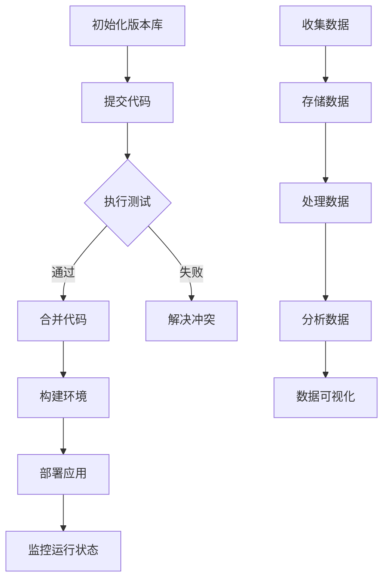

                 

 

> 关键词：数据版本控制、数据管理、Git、版本库、分布式系统、分布式版本控制系统、版本合并、代码质量、协作开发、源代码管理、持续集成、持续交付、DevOps、Docker、Kubernetes、数学模型、公式推导、案例分析、Python、Java、GitLab、GitHub、Docker Compose、Kubernetes Deployment。

> 摘要：本文深入探讨数据版本控制与数据管理的基本原理和实践方法。通过介绍Git的运作机制、分布式版本控制系统的优势，以及数据管理在软件开发中的重要性，本文将带领读者掌握从理论到实践的全方位知识。文章将通过代码实战案例，展示如何使用Git进行版本控制，以及如何在分布式环境中管理数据，包括代码合并、冲突解决、持续集成和持续交付等实战技巧。此外，本文还将探讨数据管理的未来趋势和挑战，为读者提供前瞻性的视野。

## 1. 背景介绍

在软件开发领域，版本控制和数据管理是两个核心概念。版本控制用于跟踪代码或文档的变更历史，确保开发过程中不丢失重要修改。而数据管理则涵盖了从数据收集、存储、处理到使用的全过程，确保数据的质量和一致性。

随着项目规模的扩大和团队协作的增多，版本控制和数据管理的重要性愈发凸显。错误的代码更改可能导致功能失效，而数据不一致则可能影响系统的稳定性。因此，理解并掌握版本控制和数据管理的基本原理和方法，对于提高开发效率、保证代码质量和数据完整性至关重要。

本文旨在通过深入剖析数据版本控制与数据管理的原理，结合实际案例讲解，帮助读者理解这些关键概念，并掌握相关的实战技巧。

## 2. 核心概念与联系

### 2.1. 版本控制概念

版本控制是一种跟踪文件或文档变更历史的方法。在软件开发中，版本控制主要用于跟踪代码的变更，确保每个版本的代码都是可追溯和可复现的。常见的版本控制系统包括Git、SVN和Mercurial等。

### 2.2. 数据管理概念

数据管理是确保数据的质量、完整性和安全性的过程。它包括数据收集、存储、处理、访问和使用等多个环节。数据管理不仅关注数据的存储，还涉及数据的定义、标准化、维护和归档。

### 2.3. 版本控制与数据管理的联系

版本控制和数据管理在软件开发中紧密相连。版本控制确保代码或文档的变更历史清晰可追溯，而数据管理则确保数据的准确性和一致性。两者结合，可以确保整个开发过程的高效和可靠。

### 2.4. 分布式版本控制系统

分布式版本控制系统（DVCS）如Git，允许每个开发者在本地维护一个完整的版本库。这种系统在协作开发中具有优势，因为它可以快速进行分支和合并操作，同时减少了中央服务器的负载。

### 2.5. Mermaid 流程图

以下是使用Mermaid绘制的版本控制和数据管理流程图：



## 3. 核心算法原理 & 具体操作步骤

### 3.1. 算法原理概述

版本控制的核心算法是树的存储和操作，每个提交都是一个树节点，它引用了之前的提交和文件。在合并操作中，算法需要检测冲突并尝试自动解决或提示用户解决。

### 3.2. 算法步骤详解

#### 3.2.1. 提交代码

1. 开发者将更改提交到本地仓库。
2. 提交时，Git创建一个新的树对象，代表当前的文件状态。
3. 新树对象引用上一个提交，形成提交链。

#### 3.2.2. 执行测试

1. 提交后，执行单元测试和集成测试，确保代码质量。
2. 测试通过，进入合并流程；测试失败，返回修改代码。

#### 3.2.3. 合并代码

1. 当多个开发者的工作需要合并时，Git会创建一个合并提交。
2. Git尝试自动合并更改，但如果存在冲突，则需要手动解决。

#### 3.2.4. 解决冲突

1. 冲突检测到后，Git会标记冲突区域。
2. 开发者查看冲突区域，手动合并或选择一个版本。
3. 保存合并后的代码，并提交新的修改。

#### 3.2.5. 构建环境

1. 合并后，构建系统根据新代码构建环境。
2. 构建过程中，运行自动化测试确保环境一致性。

#### 3.2.6. 部署应用

1. 构建成功后，部署新版本的应用。
2. 部署过程中，监控系统运行状态，确保应用正常运行。

### 3.3. 算法优缺点

#### 优点：

- **灵活性和快速迭代**：开发者可以在本地分支上进行实验，然后合并回主分支。
- **分布式协作**：每个开发者都有自己的完整副本，可以独立工作，减少中央服务器的压力。
- **版本可追溯性**：每个提交都有详细的日志，可以追溯历史变更。

#### 缺点：

- **复杂性**：对于初学者来说，理解和使用Git可能需要一定时间。
- **冲突管理**：在多人协作时，冲突管理是一个挑战，需要开发者具备良好的沟通和协作能力。

### 3.4. 算法应用领域

版本控制算法广泛应用于软件开发、文档管理、数据库变更等场景。特别是在现代DevOps实践中，Git和版本控制已经成为不可或缺的工具。

## 4. 数学模型和公式 & 详细讲解 & 举例说明

### 4.1. 数学模型构建

在版本控制中，可以使用图论模型来表示提交历史。每个提交可以看作一个节点，而提交之间的引用关系则可以看作边。

定义：提交历史图 \( G(V, E) \)，其中 \( V \) 表示节点集合，\( E \) 表示边集合。

### 4.2. 公式推导过程

假设有两个提交 \( A \) 和 \( B \)，它们分别代表了两个不同的分支。合并 \( A \) 和 \( B \) 的过程中，可以使用以下公式来计算合并点：

\[ \text{merge-point}(A, B) = \text{LCA}(A, B) \]

其中，LCA表示最近公共祖先（Lowest Common Ancestor）。

### 4.3. 案例分析与讲解

假设有一个项目，开发者A和开发者B分别提交了两个分支，分别称为Branch-A和Branch-B。他们的提交历史如下：

- **Branch-A**：A1 -> A2 -> A3
- **Branch-B**：B1 -> B2 -> B3

要合并这两个分支，我们需要找到它们的最近公共祖先。根据提交历史，我们可以看出A1和B1都是它们的祖先。因此，最近公共祖先为A1。

使用Git命令进行合并：

```bash
git merge Branch-A
```

此时，Git会自动合并提交，并生成一个新的合并提交。

## 5. 项目实践：代码实例和详细解释说明

### 5.1. 开发环境搭建

在开始实践之前，确保安装了Git和Docker。以下是安装步骤：

#### Git安装：

```bash
# macOS 和 Linux
sudo apt-get install git

# Windows
https://git-scm.com/downloads
```

#### Docker安装：

```bash
# macOS 和 Linux
sudo apt-get install docker

# Windows
https://docs.docker.com/docker-for-windows/install/
```

### 5.2. 源代码详细实现

以下是一个简单的Python项目，用于演示Git的基本操作。

```python
# main.py
def hello(name):
    return f"Hello, {name}!"

if __name__ == "__main__":
    print(hello("World"))
```

### 5.3. 代码解读与分析

在这个例子中，我们创建了一个简单的Python程序，它包含了一个函数 `hello` 和一个主程序。函数用于输出问候语，主程序调用这个函数并打印结果。

### 5.4. 运行结果展示

在命令行中，我们可以执行以下操作：

```bash
# 初始化Git仓库
git init

# 添加文件到暂存区
git add main.py

# 提交代码
git commit -m "Initial commit"

# 查看仓库状态
git status

# 创建新分支
git checkout -b feature-branch

# 修改代码
echo "def hello(name): return f'Hello, {name}!' if name == 'Alice' else 'Hello, World!'" > main.py

# 提交修改
git commit -m "Update greeting for Alice"

# 切换回主分支
git checkout main

# 合并feature-branch
git merge feature-branch

# 解决冲突并提交
git status
git add main.py
git commit -m "Merge feature-branch"
```

通过这些命令，我们可以看到如何使用Git进行版本控制。这个例子涵盖了初始化仓库、提交代码、创建分支、修改代码、合并分支等基本操作。

## 6. 实际应用场景

### 6.1. 跨团队合作

在跨团队合作中，版本控制是确保代码一致性和协作效率的关键。开发者可以在各自的分支上工作，并在准备好时合并代码。Git提供了强大的分支和合并机制，使得多人协作变得更加简单和高效。

### 6.2. 项目管理

项目管理者可以利用Git的分支管理和标签功能来管理不同版本的项目。例如，可以使用分支来管理开发、测试和生产环境，使用标签来标记重要的里程碑。

### 6.3. 自动化构建和部署

结合Docker和Kubernetes，可以构建和部署高度自动化的应用。Git中的提交可以触发Docker镜像的构建，而Kubernetes则用于部署和管理工作负载。

### 6.4. 未来应用展望

随着技术的发展，版本控制和数据管理将继续融合到更多的开发流程和工具中。例如，智能合并算法、分布式数据管理、区块链等新兴技术，将为版本控制和数据管理带来更多的创新和应用场景。

## 7. 工具和资源推荐

### 7.1. 学习资源推荐

- 《Pro Git》：全面介绍Git的理论和实践。
- 《版本控制工作流程》：涵盖多种版本控制系统的最佳实践。

### 7.2. 开发工具推荐

- GitLab：自托管的Git服务，提供代码托管、CI/CD等功能。
- GitHub：全球最大的代码托管平台，支持开源项目。

### 7.3. 相关论文推荐

- "A Fresh Approach to Distributed Version Control"：介绍Git的原理和设计。
- "Distributed Version Control with Git"：Git的官方文档。

## 8. 总结：未来发展趋势与挑战

### 8.1. 研究成果总结

版本控制和数据管理已经经历了多年的发展，取得了显著的研究成果。分布式版本控制系统如Git已经成为开发者的首选工具，自动化构建和部署技术也在不断进步。

### 8.2. 未来发展趋势

- 智能化版本控制：利用机器学习和人工智能技术，提高版本合并的效率和准确性。
- 分布式数据管理：解决跨地域、跨云的数据一致性和访问速度问题。
- 集成开发环境（IDE）集成：增强IDE对版本控制和数据管理的支持，提高开发者的生产力。

### 8.3. 面临的挑战

- 冲突管理：在多人协作时，如何高效地管理版本冲突是一个挑战。
- 数据安全：在分布式环境中，如何确保数据的安全性和隐私性。
- 开发者培训：如何确保开发者具备足够的版本控制和数据管理技能。

### 8.4. 研究展望

随着技术的不断发展，版本控制和数据管理将继续演进。未来，我们将看到更多创新的应用场景和解决方案，为软件开发带来更多便利和效率。

## 9. 附录：常见问题与解答

### 9.1. 如何解决Git中的冲突？

解决Git中的冲突通常需要以下步骤：

1. **查看冲突区域**：使用 `git status` 命令查看冲突文件。
2. **手动编辑冲突区域**：打开冲突文件，手动编辑解决冲突。
3. **标记冲突已解决**：使用 `git add` 命令标记文件已解决。
4. **提交解决**：使用 `git commit` 命令提交解决后的代码。

### 9.2. 什么是分布式版本控制系统？

分布式版本控制系统（DVCS）是一种允许每个用户在本地维护完整版本库的版本控制系统。这种系统与中央化版本控制系统（如SVN）不同，它具有更高的灵活性和可靠性，适合多人协作和分布式开发。

### 9.3. 数据管理的重要性是什么？

数据管理的重要性体现在多个方面：

1. **确保数据质量**：通过数据清洗、标准化等手段，确保数据的准确性、完整性和一致性。
2. **支持业务决策**：高质量的数据是业务决策的重要依据，有助于提高决策的准确性和效率。
3. **降低风险**：良好的数据管理可以减少数据泄露、丢失等风险，确保企业的信息安全。

---

以上便是关于数据版本控制与数据管理原理及代码实战案例的详细讲解。希望本文能帮助读者深入理解这些关键概念，并在实际项目中应用它们，提升开发效率和质量。作者：禅与计算机程序设计艺术 / Zen and the Art of Computer Programming。

