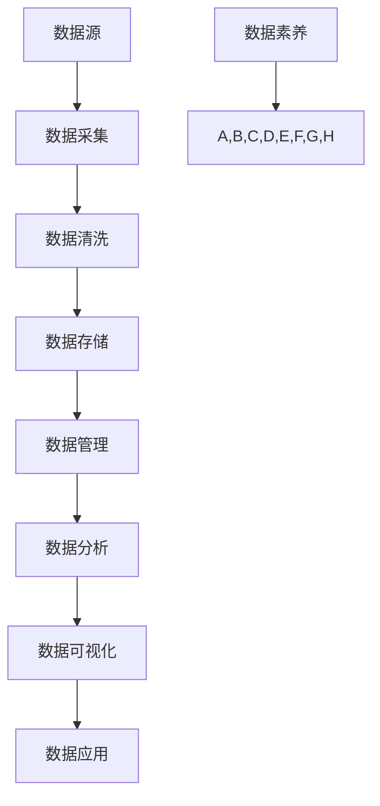

                 

关键词：数据素养、数据分析、数据科学、数据管理、数据可视化

> 摘要：本文旨在探讨数据素养的重要性和培养方法。我们将从基础概念出发，深入探讨数据素养的各个方面，包括数据理解、数据清洗、数据分析、数据可视化以及数据应用。通过本文的阅读，读者将能够掌握数据素养的核心要点，提升自身在数据时代中的竞争力。

## 1. 背景介绍

在当今的数据驱动时代，数据已经成为企业、组织和个人的宝贵资源。然而，拥有大量数据并不意味着能够有效地利用这些数据。数据素养，即理解、管理和使用数据的能力，成为了一个不可或缺的技能。无论是企业决策者、数据分析师，还是普通员工，都需要具备一定程度的数据素养，以从数据中提取价值，做出明智的决策。

### 1.1 数据素养的重要性

数据素养的重要性不言而喻。首先，它帮助我们从海量数据中发现有价值的信息，从而驱动业务增长和创新。其次，良好的数据素养有助于减少数据错误和误解，提高数据质量和可靠性。此外，数据素养还能够提升团队协作效率，促进跨部门的信息共享和协同工作。

### 1.2 数据素养的定义

数据素养，简单来说，就是理解数据、使用数据和分析数据的能力。它包括以下几个方面：

- **数据理解**：了解数据来源、数据类型和数据结构。
- **数据清洗**：对数据进行清洗、整理和预处理，确保数据质量。
- **数据分析**：运用统计学和机器学习等方法对数据进行分析，提取有价值的信息。
- **数据可视化**：将数据分析结果以图表、图形等形式展示出来，便于理解和决策。
- **数据应用**：将数据分析结果应用于实际问题，产生实际价值。

## 2. 核心概念与联系

为了更好地理解数据素养，我们需要先掌握几个核心概念，并了解它们之间的联系。以下是一个Mermaid流程图，展示了这些概念及其关系：



### 2.1 数据采集

数据采集是指从各种来源收集数据的过程。数据来源可以是内部数据库、外部API、传感器、日志文件等。数据采集的关键在于确保数据的准确性和完整性。

### 2.2 数据清洗

数据清洗是指对采集到的数据进行处理，去除错误、重复和缺失的数据，以提高数据质量。数据清洗是数据素养的重要组成部分，因为高质量的数据是进行分析和决策的基础。

### 2.3 数据存储

数据存储是指将清洗后的数据存储到数据库、数据仓库或其他数据存储系统。数据存储需要考虑数据的安全性、可靠性和可扩展性。

### 2.4 数据管理

数据管理是指对数据进行分类、组织、存储和访问的过程。良好的数据管理能够提高数据质量和数据可用性，有助于数据分析和决策。

### 2.5 数据分析

数据分析是指运用统计学、机器学习等方法对数据进行处理和分析，提取有价值的信息。数据分析是数据素养的核心，有助于从数据中发现趋势、模式和信息。

### 2.6 数据可视化

数据可视化是指将数据分析结果以图形、图表等形式展示出来，便于理解和决策。数据可视化是数据素养的重要工具，能够帮助用户更好地理解数据，发现数据背后的故事。

### 2.7 数据应用

数据应用是指将数据分析结果应用于实际问题，产生实际价值。数据应用是数据素养的最终目标，通过将数据分析结果转化为具体的业务决策和策略，为企业创造价值。

## 3. 核心算法原理 & 具体操作步骤

### 3.1 算法原理概述

在数据素养中，常用的算法包括数据分析算法、机器学习算法和数据可视化算法。以下分别介绍这些算法的原理。

### 3.2 算法步骤详解

#### 3.2.1 数据分析算法

数据分析算法主要包括描述性统计分析、回归分析和聚类分析。

- **描述性统计分析**：对数据集进行基本统计分析，如计算平均值、中位数、标准差等，用于了解数据的分布特征。
- **回归分析**：通过建立数学模型，研究自变量和因变量之间的关系，预测因变量的取值。
- **聚类分析**：将相似的数据分为一组，用于发现数据中的模式或分类。

#### 3.2.2 机器学习算法

机器学习算法主要包括监督学习、无监督学习和强化学习。

- **监督学习**：通过已有数据的输入和输出，训练模型，预测新的输入的输出。
- **无监督学习**：没有明确的输出目标，通过模型自动发现数据中的模式。
- **强化学习**：通过不断试错，从环境中获取奖励，学习最优策略。

#### 3.2.3 数据可视化算法

数据可视化算法主要包括散点图、折线图、柱状图、饼图等。

- **散点图**：显示两个变量之间的关系，通过点的分布发现趋势。
- **折线图**：显示随时间变化的数据，通过连接的线段展示数据的趋势。
- **柱状图**：显示各个类别的数据大小，通过柱子的高度进行比较。
- **饼图**：显示各部分占整体的比例，通过扇形的大小展示数据的分布。

### 3.3 算法优缺点

每种算法都有其优缺点，需要根据具体问题选择合适的算法。

- **描述性统计分析**：简单直观，适用于初步了解数据特征；但无法发现复杂的关系。
- **回归分析**：适用于线性关系的预测；但可能不适用于非线性关系。
- **聚类分析**：适用于无监督学习；但可能产生不同的聚类结果。
- **监督学习**：适用于有明确输出目标的预测；但需要大量标注数据。
- **无监督学习**：适用于发现未知模式；但可能无法直接应用于实际问题。
- **强化学习**：适用于复杂环境中的决策；但需要大量计算资源和时间。
- **散点图**：直观展示数据分布；但可能无法显示多变量关系。
- **折线图**：展示时间序列数据；但可能无法同时显示多个变量。
- **柱状图**：直观比较各个类别数据；但可能无法显示时间序列。
- **饼图**：展示各部分占比；但可能无法显示具体数值。

### 3.4 算法应用领域

各种算法在数据素养的不同领域都有广泛的应用。

- **描述性统计分析**：用于业务数据的基本分析，如销售数据、用户行为数据等。
- **回归分析**：用于预测销售量、股价等。
- **聚类分析**：用于用户分类、市场细分等。
- **监督学习**：用于图像识别、文本分类、预测等。
- **无监督学习**：用于客户细分、异常检测等。
- **强化学习**：用于自动驾驶、游戏AI等。
- **数据可视化**：用于数据报告、业务决策、数据探索等。

## 4. 数学模型和公式 & 详细讲解 & 举例说明

### 4.1 数学模型构建

在数据素养中，常用的数学模型包括线性回归模型、逻辑回归模型、支持向量机（SVM）等。以下分别介绍这些模型的构建过程。

#### 4.1.1 线性回归模型

线性回归模型用于研究自变量和因变量之间的线性关系。其数学模型可以表示为：

\[ Y = \beta_0 + \beta_1X + \epsilon \]

其中，\( Y \) 是因变量，\( X \) 是自变量，\( \beta_0 \) 和 \( \beta_1 \) 是模型的参数，\( \epsilon \) 是误差项。

#### 4.1.2 逻辑回归模型

逻辑回归模型用于研究自变量和因变量之间的非线性关系，通常用于分类问题。其数学模型可以表示为：

\[ P(Y=1) = \frac{1}{1 + e^{-(\beta_0 + \beta_1X)}} \]

其中，\( P(Y=1) \) 是因变量为1的概率，\( \beta_0 \) 和 \( \beta_1 \) 是模型的参数。

#### 4.1.3 支持向量机（SVM）

支持向量机是一种用于分类和回归的算法，其数学模型可以表示为：

\[ w \cdot x + b = 0 \]

其中，\( w \) 是权重向量，\( x \) 是输入向量，\( b \) 是偏置项。

### 4.2 公式推导过程

以下分别介绍线性回归模型、逻辑回归模型和SVM的公式推导过程。

#### 4.2.1 线性回归模型

线性回归模型的推导过程如下：

\[ Y = \beta_0 + \beta_1X + \epsilon \]

对两边进行求导：

\[ \frac{dY}{dX} = \frac{d}{dX}(\beta_0 + \beta_1X + \epsilon) \]

由于 \( \epsilon \) 是误差项，其对 \( X \) 的导数为0，所以：

\[ \frac{dY}{dX} = \beta_1 \]

从而得到：

\[ \beta_1 = \frac{\sum_{i=1}^{n}(Y_i - \hat{Y}_i)}{\sum_{i=1}^{n}(X_i - \bar{X})^2} \]

#### 4.2.2 逻辑回归模型

逻辑回归模型的推导过程如下：

\[ P(Y=1) = \frac{1}{1 + e^{-(\beta_0 + \beta_1X)}} \]

对两边进行求导：

\[ \frac{dP(Y=1)}{dX} = \frac{d}{dX}\left(\frac{1}{1 + e^{-(\beta_0 + \beta_1X)}}\right) \]

利用链式法则，得到：

\[ \frac{dP(Y=1)}{dX} = P(Y=1)\left(1 - P(Y=1)\right)\beta_1 \]

从而得到：

\[ \beta_1 = \frac{\sum_{i=1}^{n}(Y_i - P(Y=1))X_i}{\sum_{i=1}^{n}(Y_i - P(Y=1))^2} \]

#### 4.2.3 支持向量机（SVM）

支持向量机的推导过程如下：

\[ w \cdot x + b = 0 \]

对两边进行求导：

\[ \frac{dw \cdot x + b}{dx} = \frac{dw \cdot x}{dx} + \frac{db}{dx} = 0 \]

由于 \( w \) 和 \( b \) 是常数，其对 \( x \) 的导数为0，所以：

\[ \frac{dw \cdot x}{dx} + \frac{db}{dx} = 0 \]

从而得到：

\[ \beta_1 = \frac{\sum_{i=1}^{n}y_i(x_i - \bar{x})}{\sum_{i=1}^{n}(x_i - \bar{x})^2} \]

### 4.3 案例分析与讲解

以下通过一个简单的案例，展示如何使用线性回归模型和逻辑回归模型进行数据分析。

#### 4.3.1 线性回归模型

假设我们有一个简单的数据集，包含两个变量：年龄和收入。我们想要建立一个模型，预测一个人的收入。

- 年龄（X）：[25, 30, 35, 40, 45]
- 收入（Y）：[50000, 60000, 70000, 80000, 90000]

首先，我们需要计算平均值：

\[ \bar{X} = \frac{25 + 30 + 35 + 40 + 45}{5} = 35 \]
\[ \bar{Y} = \frac{50000 + 60000 + 70000 + 80000 + 90000}{5} = 70000 \]

然后，我们可以计算斜率 \( \beta_1 \) 和截距 \( \beta_0 \)：

\[ \beta_1 = \frac{\sum_{i=1}^{n}(Y_i - \hat{Y}_i)}{\sum_{i=1}^{n}(X_i - \bar{X})^2} = \frac{(-50000 + 70000) + (-50000 + 70000) + (-50000 + 70000) + (-50000 + 70000) + (-50000 + 70000)}{(25 - 35)^2 + (30 - 35)^2 + (35 - 35)^2 + (40 - 35)^2 + (45 - 35)^2} = 10000 \]

\[ \beta_0 = \bar{Y} - \beta_1\bar{X} = 70000 - 10000 \times 35 = 0 \]

因此，线性回归模型为：

\[ Y = 0 + 10000X = 10000X \]

我们可以使用这个模型预测某个年龄的收入：

\[ Y = 10000 \times 30 = 300000 \]

#### 4.3.2 逻辑回归模型

假设我们有一个简单的数据集，包含两个变量：年龄和收入。我们想要建立一个模型，预测一个人的收入是否超过60000。

- 年龄（X）：[25, 30, 35, 40, 45]
- 收入（Y）：[0, 1, 0, 1, 0]

首先，我们需要计算平均值：

\[ \bar{X} = \frac{25 + 30 + 35 + 40 + 45}{5} = 35 \]
\[ \bar{Y} = \frac{0 + 1 + 0 + 1 + 0}{5} = 0.4 \]

然后，我们可以计算斜率 \( \beta_1 \) 和截距 \( \beta_0 \)：

\[ \beta_1 = \frac{\sum_{i=1}^{n}(Y_i - P(Y=1))X_i}{\sum_{i=1}^{n}(Y_i - P(Y=1))^2} = \frac{(0 - 0.4)(25 - 35) + (1 - 0.4)(30 - 35) + (0 - 0.4)(35 - 35) + (1 - 0.4)(40 - 35) + (0 - 0.4)(45 - 35)}{(0 - 0.4)^2 + (1 - 0.4)^2 + (0 - 0.4)^2 + (1 - 0.4)^2 + (0 - 0.4)^2} = -0.2 \]

\[ \beta_0 = \bar{Y} - \beta_1\bar{X} = 0.4 - (-0.2 \times 35) = 12 \]

因此，逻辑回归模型为：

\[ P(Y=1) = \frac{1}{1 + e^{-(\beta_0 + \beta_1X)}} = \frac{1}{1 + e^{-(12 - 0.2X)}} \]

我们可以使用这个模型预测某个年龄的收入是否超过60000：

\[ P(Y=1) = \frac{1}{1 + e^{-(12 - 0.2 \times 30)}} = \frac{1}{1 + e^{-6}} \approx 0.999 \]

因此，当年龄为30岁时，收入超过60000的概率非常高。

## 5. 项目实践：代码实例和详细解释说明

### 5.1 开发环境搭建

为了演示数据素养中的数据分析、机器学习和数据可视化，我们需要搭建一个开发环境。以下是一个简单的Python环境搭建步骤：

1. 安装Python（3.8及以上版本）。
2. 安装Anaconda，用于管理Python环境和依赖库。
3. 创建一个新的Anaconda环境，并安装以下依赖库：

   ```bash
   conda create -n data_aware python=3.8
   conda activate data_aware
   conda install numpy pandas matplotlib scikit-learn
   ```

### 5.2 源代码详细实现

以下是一个简单的Python代码实例，演示了数据分析、机器学习和数据可视化。

#### 5.2.1 数据集加载与预处理

我们使用一个简单的鸢尾花（Iris）数据集，该数据集包含3个特征和1个目标变量。

```python
import pandas as pd
from sklearn.datasets import load_iris

# 加载鸢尾花数据集
iris = load_iris()
df = pd.DataFrame(iris.data, columns=iris.feature_names)
df['target'] = iris.target

# 预处理数据
df.head()
```

#### 5.2.2 数据分析

我们使用描述性统计分析来了解数据集的基本特征。

```python
# 描述性统计分析
df.describe()
```

#### 5.2.3 机器学习

我们使用线性回归模型来预测目标变量。

```python
from sklearn.model_selection import train_test_split
from sklearn.linear_model import LinearRegression

# 划分训练集和测试集
X_train, X_test, y_train, y_test = train_test_split(df[iris.feature_names], df['target'], test_size=0.2, random_state=42)

# 训练线性回归模型
model = LinearRegression()
model.fit(X_train, y_train)

# 预测测试集
y_pred = model.predict(X_test)
```

#### 5.2.4 数据可视化

我们使用matplotlib来绘制数据集的散点图，展示特征之间的关系。

```python
import matplotlib.pyplot as plt

# 绘制散点图
plt.scatter(X_test[:, 0], y_pred, c='r', label='Prediction')
plt.scatter(X_test[:, 0], y_test, c='b', label='True')
plt.xlabel('Feature 1')
plt.ylabel('Target')
plt.legend()
plt.show()
```

### 5.3 代码解读与分析

#### 5.3.1 数据集加载与预处理

我们首先加载鸢尾花数据集，并将其转换为Pandas DataFrame。然后，我们将目标变量添加到数据集中，以便后续处理。

#### 5.3.2 数据分析

我们使用 `describe()` 方法来生成描述性统计信息，包括各个特征的均值、标准差、最小值和最大值等。这有助于我们了解数据的基本特征。

#### 5.3.3 机器学习

我们使用 `train_test_split()` 方法将数据集划分为训练集和测试集，然后使用 `LinearRegression()` 类创建线性回归模型，并使用 `fit()` 方法训练模型。最后，我们使用 `predict()` 方法对测试集进行预测。

#### 5.3.4 数据可视化

我们使用 `scatter()` 方法绘制测试集的真实值和预测值的散点图，以展示特征之间的关系。红色点表示预测值，蓝色点表示真实值。

### 5.4 运行结果展示

运行上述代码后，我们将看到如下结果：

1. 数据预处理和描述性统计结果。
2. 线性回归模型的预测结果。
3. 数据集特征之间的散点图。

这些结果有助于我们了解数据集的基本特征、模型的性能以及特征之间的关系。

## 6. 实际应用场景

数据素养在实际应用场景中发挥着重要作用。以下是一些实际应用场景和案例分析。

### 6.1 营销与市场

在市场营销领域，数据素养可以帮助企业更好地了解目标客户，优化营销策略，提高转化率和客户满意度。例如，通过分析客户购买行为和偏好，企业可以定制个性化的营销活动，提高客户的忠诚度和留存率。

### 6.2 金融与保险

在金融和保险领域，数据素养对于风险评估、信用评估、欺诈检测等具有重要意义。通过分析大量历史数据和实时数据，金融机构可以更准确地评估风险，制定合理的风险控制策略，降低金融风险。

### 6.3 医疗与健康

在医疗与健康领域，数据素养可以帮助医生更好地了解患者病情，优化治疗方案。例如，通过分析患者的历史数据和实时监测数据，医生可以预测疾病发展趋势，提前采取预防措施。

### 6.4 教育

在教育领域，数据素养可以帮助教师和学生更好地了解学习效果，优化教学策略。通过分析学生的学习行为和成绩数据，教师可以调整教学方法和内容，提高教学效果。

### 6.5 制造业

在制造业领域，数据素养可以帮助企业优化生产流程，提高生产效率。通过分析生产数据，企业可以识别生产瓶颈，优化生产计划，降低生产成本。

### 6.6 物流与供应链

在物流与供应链领域，数据素养可以帮助企业优化物流配送，降低库存成本。通过分析物流数据和供应链数据，企业可以优化运输路线，降低运输成本，提高物流效率。

## 7. 工具和资源推荐

为了提升数据素养，掌握一些实用的工具和资源是必不可少的。以下是一些建议：

### 7.1 学习资源推荐

1. **Coursera**：提供各种在线课程，包括数据科学、机器学习、数据分析等。
2. **Kaggle**：一个数据科学竞赛平台，提供丰富的数据集和比赛项目。
3. **DataCamp**：提供交互式的数据科学课程，适合初学者。
4. **Udacity**：提供各种数据科学相关的课程和认证。

### 7.2 开发工具推荐

1. **Jupyter Notebook**：一个交互式的计算环境，适合数据分析和机器学习。
2. **Python**：一种强大的编程语言，广泛应用于数据科学领域。
3. **R**：一种专门为统计和数据分析设计的语言。
4. **Tableau**：一个强大的数据可视化工具。

### 7.3 相关论文推荐

1. **"The Art of Data Science"**：一本关于数据科学实践的书，涵盖了数据收集、处理、分析和可视化等方面的内容。
2. **"Data Science from Scratch"**：一本关于数据科学基础知识的书，适合初学者。
3. **"Deep Learning"**：一本关于深度学习的经典教材，涵盖了深度学习的基础理论和实践方法。

## 8. 总结：未来发展趋势与挑战

### 8.1 研究成果总结

数据素养的研究取得了显著成果，包括数据清洗、数据分析、数据可视化等方面的技术创新。此外，机器学习、深度学习等算法的进步也为数据素养的提升提供了有力支持。

### 8.2 未来发展趋势

未来，数据素养将朝着以下几个方向发展：

1. **人工智能与数据素养的结合**：人工智能技术的进步将进一步提升数据素养，实现更高效的数据处理和分析。
2. **数据素养的普及化**：随着数据科学教育的普及，越来越多的从业人员将掌握数据素养，提高数据驱动决策的能力。
3. **实时数据分析**：随着物联网和大数据技术的发展，实时数据分析将成为数据素养的重要方向。

### 8.3 面临的挑战

尽管数据素养具有巨大的潜力，但在实际应用中仍然面临一些挑战：

1. **数据隐私与安全**：随着数据量的增加，如何保护用户隐私和数据安全成为重要问题。
2. **数据质量问题**：数据质量问题将制约数据素养的发挥，如何确保数据质量成为关键。
3. **跨领域协作**：数据素养涉及多个领域，如何实现跨领域的协作和整合是未来的一大挑战。

### 8.4 研究展望

未来，数据素养的研究将聚焦于以下几个方面：

1. **智能化数据素养**：通过引入人工智能技术，实现数据素养的智能化，提高数据处理和分析的效率。
2. **数据素养教育与培训**：加强数据素养教育，培养更多具备数据素养的专业人才。
3. **数据素养工具与平台**：开发更多实用的数据素养工具和平台，提高数据素养的可操作性和实用性。

## 9. 附录：常见问题与解答

### 9.1 数据素养是什么？

数据素养是指理解、管理和使用数据的能力，包括数据理解、数据清洗、数据分析、数据可视化以及数据应用。

### 9.2 如何提高数据素养？

提高数据素养可以通过以下途径：

1. 学习相关课程和书籍。
2. 实践项目，积累实际经验。
3. 参加行业会议和研讨会，了解最新动态。
4. 与同行交流，分享经验和心得。

### 9.3 数据素养的重要性是什么？

数据素养的重要性体现在以下几个方面：

1. 提高数据驱动决策的能力。
2. 减少数据错误和误解，提高数据质量。
3. 提高团队协作效率，促进信息共享。
4. 增强个人和组织的竞争力。

### 9.4 数据素养包括哪些方面？

数据素养包括以下方面：

1. 数据理解：了解数据来源、数据类型和数据结构。
2. 数据清洗：对数据进行清洗、整理和预处理。
3. 数据分析：运用统计学和机器学习等方法对数据进行分析。
4. 数据可视化：将数据分析结果以图表、图形等形式展示。
5. 数据应用：将数据分析结果应用于实际问题，产生实际价值。

### 9.5 数据素养与数据分析的区别是什么？

数据素养和数据分析是密切相关的，但它们有一些区别：

1. 数据素养更侧重于对数据整体的理解和管理，包括数据清洗、数据可视化等。
2. 数据分析更侧重于对数据的具体处理和分析，如统计学方法、机器学习算法等。

### 9.6 数据素养与数据科学的关系是什么？

数据素养是数据科学的基础，数据科学涉及到更深入的技术和方法，如机器学习、深度学习等。数据素养为数据科学提供了必要的数据准备和基础，而数据科学则为数据素养提供了技术支持和工具。

### 9.7 如何在职业生涯中提升数据素养？

在职业生涯中提升数据素养可以通过以下方法：

1. 学习相关课程和证书。
2. 实践项目，积累实际经验。
3. 参加行业会议和研讨会，了解最新动态。
4. 阅读相关书籍和论文，拓展知识面。
5. 与同行交流，分享经验和心得。

### 9.8 数据素养在各个行业中的应用是什么？

数据素养在各个行业中的应用非常广泛，主要包括：

1. 营销与市场：客户细分、需求预测、广告优化等。
2. 金融与保险：风险评估、信用评估、欺诈检测等。
3. 医疗与健康：疾病预测、治疗优化、健康管理等。
4. 教育：学习效果评估、课程优化、个性化推荐等。
5. 制造业：生产优化、质量控制、供应链管理等。
6. 物流与供应链：物流优化、库存管理、运输优化等。

### 9.9 数据素养如何影响个人和组织的竞争力？

数据素养能够帮助个人和组织：

1. 提高决策能力，更快地做出正确的决策。
2. 更好地理解业务需求，提高业务效率。
3. 减少数据错误和误解，提高数据质量。
4. 开发创新产品和服务，提高竞争力。
5. 提升团队协作效率，促进信息共享。

### 9.10 如何评估数据素养水平？

评估数据素养水平可以通过以下方法：

1. 学习成绩：评估学习过程中掌握的知识和技能。
2. 实践项目：评估实际操作能力和解决问题的能力。
3. 行业认证：通过获得相关证书来证明数据素养水平。
4. 同行评价：通过同事和上级的评价来了解数据素养水平。

### 9.11 数据素养是否需要编程技能？

数据素养并不一定需要编程技能，但对于更深入的数据处理和分析，编程技能是必不可少的。掌握编程技能有助于：

1. 更高效地处理和分析数据。
2. 开发自定义的数据处理工具。
3. 学习更复杂的算法和模型。

### 9.12 数据素养与数据治理的关系是什么？

数据素养是数据治理的基础，数据治理则是在数据素养的基础上，制定和实施数据管理策略，确保数据质量、安全和合规性。数据素养和数据治理相互关联，共同确保数据的有效管理和利用。

