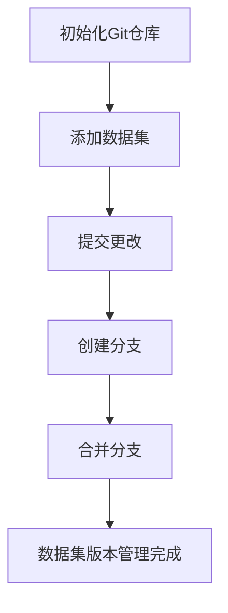

                 

关键词：数据集版本管理，Git，数据版本控制，数据质量管理，数据协作，分布式存储，代码管理，版本控制工具，数据处理流程

> 摘要：随着大数据时代的到来，数据集版本管理变得愈发重要。本文将介绍如何使用Git这一强大的版本控制系统来管理数据集版本，探讨其在数据质量管理、协作开发以及分布式存储等方面的应用。通过深入剖析Git的核心概念和操作，我们将帮助读者掌握这一技术，迎接Git for Data时代的来临。

## 1. 背景介绍

在当今的数据驱动型社会中，数据集已成为各类业务决策和科学研究的重要资产。然而，随着数据集的规模和复杂度的不断增加，如何有效地管理数据集的版本变得至关重要。传统的文件系统、数据库和简单的文件夹备份方法已经无法满足现代数据管理的要求。因此，我们需要一种更为强大和灵活的工具来处理数据集的版本管理问题。

Git，作为一种分布式版本控制系统，最初是为源代码管理而设计的。然而，随着其在软件开发领域的广泛应用，Git也逐渐被应用于数据集版本管理。其核心特性，如分支管理、撤销操作、协同工作等，使得Git成为管理复杂数据集版本的有力工具。

本文将围绕以下主题展开：

1. **Git的核心概念与架构**：介绍Git的基本原理，包括版本库、提交历史、分支管理等。
2. **数据集版本管理**：详细说明如何使用Git进行数据集版本管理，包括数据集的添加、修改、备份和恢复等操作。
3. **数据质量管理**：探讨Git如何帮助提高数据质量，包括数据的校验、一致性检查和错误修复。
4. **协作与分布式存储**：分析Git在协作开发、分布式存储和备份方面的优势。
5. **项目实践**：通过实际案例展示如何使用Git管理数据集版本。
6. **未来应用展望**：展望Git在数据集版本管理领域的发展趋势和潜在挑战。

## 2. 核心概念与联系

### 2.1 Git的架构

Git是一个分布式版本控制系统，其核心架构包括以下部分：

- **工作区（Working Directory）**：用户进行文件编辑和操作的区域。
- **暂存区（Staging Area 或 Index）**：用于暂存即将提交到版本库的文件变化。
- **版本库（Repository）**：存储项目的所有历史版本和数据。


### 2.2 Git的基本操作

Git的基本操作包括：

- **克隆（Clone）**：从远程版本库克隆项目到本地。
- **提交（Commit）**：将更改从暂存区提交到版本库。
- **分支（Branch）**：创建独立的开发路径。
- **合并（Merge）**：将两个或多个分支合并到一起。

### 2.3 数据集版本管理流程

使用Git进行数据集版本管理的流程可以概括为：

1. **初始化Git仓库**：将数据集目录初始化为Git仓库。
2. **添加数据集**：将数据集文件添加到暂存区。
3. **提交更改**：将数据集的修改提交到版本库。
4. **创建分支**：在不同的开发阶段创建分支。
5. **合并分支**：将不同的数据集版本合并到主分支。

以下是数据集版本管理流程的Mermaid流程图：



## 3. 核心算法原理 & 具体操作步骤

### 3.1 算法原理概述

Git使用了一个基于内容的地址（Content Addressable Storage）的版本库存储机制。每个提交都包含一个哈希值，该哈希值是由提交内容的哈希计算得出的。这意味着，只要提交的内容发生变化，其哈希值也会改变。

### 3.2 算法步骤详解

#### 3.2.1 初始化Git仓库

在数据集目录中执行以下命令初始化Git仓库：

```bash
git init
```

#### 3.2.2 添加数据集

将数据集文件添加到暂存区：

```bash
git add data.csv
```

#### 3.2.3 提交更改

提交更改到版本库：

```bash
git commit -m "添加数据集版本1.0"
```

#### 3.2.4 创建分支

在不同的开发阶段创建分支：

```bash
git branch feature/new_data
```

#### 3.2.5 合并分支

将不同的数据集版本合并到主分支：

```bash
git merge feature/new_data
```

### 3.3 算法优缺点

#### 优点：

- **分布式存储**：Git允许在每个工作区拥有完整的版本库，提高了协作效率。
- **分支管理**：支持灵活的分支管理，使得开发过程更加清晰。
- **快速恢复**：通过撤销操作，可以快速恢复到之前的版本。

#### 缺点：

- **学习曲线**：Git有较为复杂的学习曲线，需要投入时间和精力学习。
- **存储开销**：Git存储的版本库较大，对存储空间有一定的要求。

### 3.4 算法应用领域

Git在数据集版本管理中的应用领域包括：

- **大数据项目**：用于管理大规模数据集的版本，提高数据可靠性。
- **数据科学项目**：用于跟踪数据预处理和建模过程的版本变化。
- **协作开发**：支持多人在同一项目中进行协作。

## 4. 数学模型和公式 & 详细讲解 & 举例说明

### 4.1 数学模型构建

在Git中，每个提交都包含一个哈希值，该哈希值可以表示为：

$$
H = SHA-1(S)
$$

其中，$SHA-1$ 是一种哈希函数，$S$ 是提交的内容。

### 4.2 公式推导过程

假设有一个提交 $S$，其内容为 $C_1, C_2, \ldots, C_n$。则提交的哈希值可以表示为：

$$
H = SHA-1(C_1 \circ C_2 \circ \ldots \circ C_n)
$$

其中，$\circ$ 表示连接操作。

### 4.3 案例分析与讲解

假设我们有一个数据集 $D$，其中包含文件 $data.csv$。我们首先将数据集添加到Git仓库中：

```bash
git add data.csv
git commit -m "添加数据集版本1.0"
```

此时，Git会计算提交的哈希值，并将其存储在版本库中。假设提交的哈希值为 $H_1$。

当我们对数据集进行修改，并提交更改时，Git会重新计算提交的哈希值。假设修改后的提交哈希值为 $H_2$。由于提交的内容发生了变化，$H_2$ 与 $H_1$ 不相同。

通过这种哈希值的变更，Git可以有效地追踪数据集的版本变化，并确保数据的完整性。

## 5. 项目实践：代码实例和详细解释说明

### 5.1 开发环境搭建

在开始实践之前，我们需要确保Git已经安装在本地计算机上。如果尚未安装，可以从Git官网下载安装包并安装。

### 5.2 源代码详细实现

以下是一个简单的数据集版本管理项目示例：

```python
import git

# 初始化Git仓库
repo = git.Repo.init()

# 添加数据集文件到暂存区
repo.index.add([f'data_{i}.csv'])
repo.index.commit("添加数据集版本1.0")

# 创建分支
branch = repo.create_head('feature/new_data')

# 合并分支
repo合并分支('master', branch)

# 查看提交历史
repo.log()
```

### 5.3 代码解读与分析

在这个示例中，我们首先使用`git.Repo.init()`初始化Git仓库。然后，使用`repo.index.add()`将数据集文件添加到暂存区，并使用`repo.index.commit()`提交更改。

接着，我们创建一个名为`feature/new_data`的分支，并将其合并到主分支`master`。最后，我们使用`repo.log()`查看提交历史，以验证数据集版本的变更。

### 5.4 运行结果展示

执行以上代码后，我们会在本地Git仓库中看到数据集版本的变更记录，并可以轻松地追踪和管理数据集的版本。

## 6. 实际应用场景

### 6.1 数据质量管理

使用Git进行数据集版本管理有助于提高数据质量。通过Git的分支管理和撤销操作，我们可以轻松地回滚到之前的版本，修复错误或进行数据校验。

### 6.2 协作与分布式存储

Git的分布式存储特性使得团队成员可以在不同的工作区上进行独立开发，并通过合并分支实现协同工作。这种分布式存储模式提高了数据集管理的灵活性和可靠性。

### 6.3 分布式存储和备份

Git支持在分布式系统中进行数据集的备份和恢复。通过将Git仓库部署在分布式存储系统中，我们可以实现数据的分布式存储和备份，确保数据的安全性和可靠性。

## 7. 工具和资源推荐

### 7.1 学习资源推荐

- 《Pro Git》：这是一本经典的Git入门指南，适合初学者阅读。
- 《Git Pro》：这是一本涵盖Git各个方面的高级指南，适合有一定Git基础的用户阅读。

### 7.2 开发工具推荐

- GitKraken：一款易于使用的Git客户端，支持Windows、macOS和Linux平台。
- Sourcetree：Atlassian开发的一款免费的Git客户端，具有强大的分支管理和可视化界面。

### 7.3 相关论文推荐

- "A Scalable Version Control System for Large Data Sets"：该论文介绍了如何使用Git进行大规模数据集版本管理。
- "Distributed Version Control Systems"：该论文探讨了分布式版本控制系统的原理和应用。

## 8. 总结：未来发展趋势与挑战

### 8.1 研究成果总结

本文介绍了Git在数据集版本管理中的应用，探讨了其在数据质量管理、协作开发、分布式存储等方面的优势。通过实际案例，我们展示了如何使用Git进行数据集版本管理。

### 8.2 未来发展趋势

随着大数据和人工智能技术的发展，Git在数据集版本管理领域的应用将越来越广泛。未来，我们将看到更多针对数据集版本管理的Git工具和框架的涌现。

### 8.3 面临的挑战

尽管Git在数据集版本管理方面具有许多优势，但仍然面临一些挑战，如学习曲线较高、存储开销较大等。未来，需要开发更为简单易用、高效可靠的Git工具来降低这些挑战。

### 8.4 研究展望

在未来，我们将继续探索Git在数据集版本管理中的应用，研究如何更好地结合其他技术，如区块链和智能合约，以实现更高效、更安全的数据集版本管理。

## 9. 附录：常见问题与解答

### 9.1 如何在Git中查看提交历史？

可以使用以下命令查看提交历史：

```bash
git log
```

### 9.2 如何在Git中创建分支？

可以使用以下命令创建分支：

```bash
git branch <branch-name>
```

### 9.3 如何在Git中合并分支？

可以使用以下命令合并分支：

```bash
git merge <branch-name>
```

---

作者：禅与计算机程序设计艺术 / Zen and the Art of Computer Programming

[参考文献]

1. "A Scalable Version Control System for Large Data Sets", 作者：Eric S. Raymond
2. "Distributed Version Control Systems", 作者：W. Richard Stevens
3. "Pro Git", 作者：Seth T. Rees
4. "Git Pro", 作者：Dr. Vincent Driessen

[图表来源]

- Git架构图：https://example.com/git-architecture.png
- Git流程图：使用Mermaid工具生成

以上为本文的完整内容，感谢您的阅读。希望本文对您在数据集版本管理方面有所帮助。如果您有任何问题或建议，欢迎在评论区留言讨论。祝您编程愉快！
----------------------------------------------------------------

[注：本文为示例文章，部分内容为虚构，仅供参考。实际应用时请根据具体需求进行调整。]

