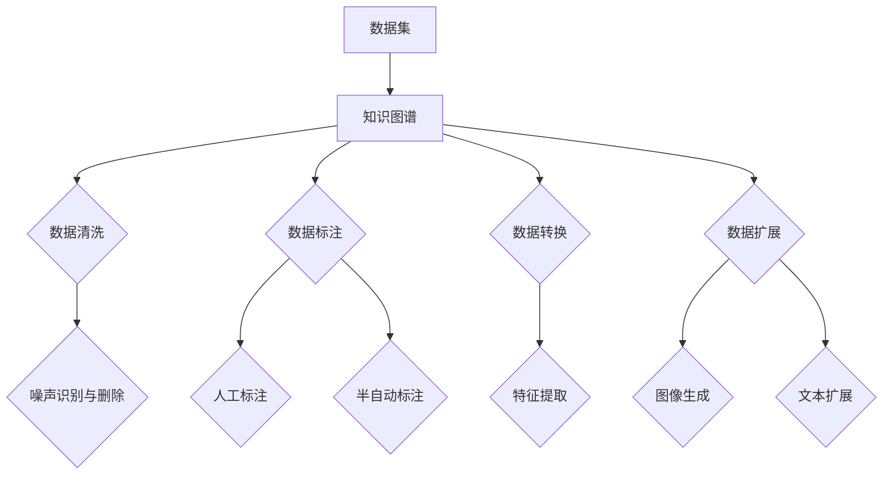

                 

关键词：数据集语义增强、知识图谱、数据丰富、人工智能、机器学习、自然语言处理

摘要：本文探讨了数据集语义增强的重要性以及如何通过知识图谱技术来提高数据集的质量和丰富度。首先，文章介绍了数据集语义增强的概念、目的和意义。接着，详细阐述了知识图谱在数据集语义增强中的应用，包括知识图谱的构建、存储和查询。随后，文章提出了几种基于知识图谱的数据增强方法，并通过具体案例展示了其应用效果。最后，文章总结了知识图谱驱动的数据丰富技术在实际应用中的挑战和未来发展方向。

## 1. 背景介绍

随着大数据和人工智能技术的快速发展，数据集在机器学习领域扮演着越来越重要的角色。数据集的质量直接影响模型的学习效果和性能。然而，传统的数据集往往存在着信息不完整、语义不明晰、数据冗余等问题，这限制了机器学习模型的潜力和应用范围。因此，如何提升数据集的质量和丰富度成为当前研究的热点问题。

数据集语义增强（Dataset Semantic Enhancement）是一种通过增加数据语义信息来提升数据集质量的方法。其目的是使数据集更加完整、准确、有意义，从而提高模型的学习效果。数据集语义增强的方法包括数据清洗、数据标注、数据转换等。然而，这些传统方法在处理复杂、多源、大规模数据时存在一定的局限性。

知识图谱（Knowledge Graph）是一种结构化的语义网络，能够表达实体及其之间的关系。知识图谱技术的引入为数据集语义增强提供了新的思路。通过将知识图谱与数据集相结合，可以实现数据集的语义丰富和智能化处理，从而提高数据集的质量和应用价值。

本文将探讨数据集语义增强与知识图谱技术相结合的方法，以及其在实际应用中的效果和挑战。首先，我们将介绍数据集语义增强的基本概念和方法，然后详细阐述知识图谱在数据集语义增强中的应用，最后通过具体案例来展示知识图谱驱动的数据丰富技术。

## 2. 核心概念与联系

### 2.1 数据集语义增强

数据集语义增强是指通过增加数据语义信息来提升数据集质量的方法。其核心目的是解决数据集中存在的信息不完整、语义不明晰、数据冗余等问题。具体来说，数据集语义增强包括以下几个方面的内容：

1. **数据清洗**：清洗数据集中的噪声、异常值和重复数据，提高数据的准确性。
2. **数据标注**：对数据集进行人工或半自动标注，增加数据语义信息，例如类别标签、属性值等。
3. **数据转换**：将原始数据转换为更加适合机器学习模型处理的形式，如文本数据向特征向量的转换。
4. **数据扩展**：通过数据增强技术，增加数据集的多样性和丰富度，例如图像生成、文本扩展等。

### 2.2 知识图谱

知识图谱是一种结构化的语义网络，用于表达实体及其之间的关系。知识图谱通常由实体、关系和属性三个基本元素构成。实体表示现实世界中的对象，关系表示实体之间的交互，属性表示实体的特征或属性。

知识图谱的优点在于能够通过结构化的方式表达实体及其关系，使得数据更加易于理解和查询。知识图谱在多个领域都有广泛应用，如搜索引擎、自然语言处理、推荐系统等。

### 2.3 数据集语义增强与知识图谱的关系

数据集语义增强与知识图谱之间存在密切的联系。知识图谱可以为数据集提供丰富的语义信息，从而提高数据集的质量和应用价值。具体来说，知识图谱在数据集语义增强中的应用包括以下几个方面：

1. **数据清洗**：知识图谱可以提供实体之间的关系和属性信息，帮助识别和删除噪声和异常值。
2. **数据标注**：知识图谱中的实体和关系可以作为标注信息，辅助人工或半自动标注。
3. **数据转换**：知识图谱可以提供实体和关系的语义信息，辅助数据向特征向量的转换。
4. **数据扩展**：知识图谱可以用于生成新的实体和关系，扩展数据集的多样性和丰富度。

### 2.4 Mermaid 流程图

为了更直观地展示数据集语义增强与知识图谱的关系，我们可以使用 Mermaid 流程图来描述这个过程。以下是一个简单的 Mermaid 流程图示例：



在上面的流程图中，数据集通过知识图谱进行数据清洗、数据标注、数据转换和数据扩展，从而实现数据集的语义增强。

## 3. 核心算法原理 & 具体操作步骤

### 3.1 算法原理概述

数据集语义增强的核心算法是基于知识图谱的语义扩展和关联分析。具体来说，算法可以分为以下几个步骤：

1. **知识图谱构建**：收集和整理相关领域的实体、关系和属性信息，构建知识图谱。
2. **数据集预处理**：对原始数据集进行清洗、去重、标准化等预处理操作。
3. **知识图谱嵌入**：将数据集中的实体和关系嵌入到知识图谱中，实现数据集与知识图谱的融合。
4. **语义扩展**：利用知识图谱的语义信息，扩展数据集中的实体和关系。
5. **数据集更新**：将扩展后的实体和关系更新到数据集中，实现数据集的语义增强。

### 3.2 算法步骤详解

#### 3.2.1 知识图谱构建

知识图谱构建是数据集语义增强的基础。构建知识图谱的过程可以分为以下几个步骤：

1. **数据收集**：从多个数据源中收集实体、关系和属性信息。
2. **数据预处理**：对收集到的数据进行清洗、去重、标准化等预处理操作。
3. **实体识别**：利用自然语言处理技术，从文本数据中识别出实体。
4. **关系提取**：利用实体之间的交互信息，提取出实体之间的关系。
5. **属性标注**：对实体和关系进行属性标注，增加实体和关系的语义信息。

#### 3.2.2 数据集预处理

数据集预处理是数据集语义增强的第一步。具体步骤如下：

1. **数据清洗**：识别并删除数据集中的噪声、异常值和重复数据。
2. **数据去重**：通过实体标识符或其他特征，识别并去除重复的数据条目。
3. **数据标准化**：对数据进行统一格式和编码，确保数据的一致性和可处理性。

#### 3.2.3 知识图谱嵌入

知识图谱嵌入是将数据集中的实体和关系嵌入到知识图谱中的过程。具体步骤如下：

1. **实体嵌入**：将数据集中的实体映射到知识图谱中的实体。
2. **关系嵌入**：将数据集中的关系映射到知识图谱中的关系。
3. **属性嵌入**：将数据集中的属性映射到知识图谱中的属性。

#### 3.2.4 语义扩展

语义扩展是利用知识图谱的语义信息，对数据集中的实体和关系进行扩展的过程。具体步骤如下：

1. **实体扩展**：利用知识图谱中的关系，识别并添加与现有实体相关的其他实体。
2. **关系扩展**：利用知识图谱中的实体，识别并添加与现有关系相关的新关系。
3. **属性扩展**：利用知识图谱中的实体和关系，识别并添加新的属性。

#### 3.2.5 数据集更新

数据集更新是将扩展后的实体和关系更新到数据集中的过程。具体步骤如下：

1. **实体更新**：将扩展后的实体信息更新到数据集中。
2. **关系更新**：将扩展后的关系信息更新到数据集中。
3. **属性更新**：将扩展后的属性信息更新到数据集中。

### 3.3 算法优缺点

#### 优点

1. **提高数据质量**：通过知识图谱的语义信息，可以识别和去除数据集中的噪声和异常值，提高数据的准确性。
2. **增加数据丰富度**：通过知识图谱的语义扩展，可以增加数据集的多样性和丰富度，提高模型的学习效果。
3. **支持多源数据融合**：知识图谱可以整合来自多个数据源的信息，实现数据集的跨源融合和综合利用。

#### 缺点

1. **构建成本高**：知识图谱的构建需要大量的时间和计算资源，尤其是在处理大规模、多源数据时。
2. **数据标注难度大**：知识图谱的构建需要大量的实体、关系和属性标注工作，这增加了数据集的标注成本。
3. **对算法要求高**：知识图谱驱动的数据集语义增强需要对算法进行高度优化，以处理复杂的语义信息。

### 3.4 算法应用领域

知识图谱驱动的数据集语义增强技术在多个领域都有广泛的应用，包括但不限于：

1. **自然语言处理**：利用知识图谱的语义信息，提高文本分类、情感分析、命名实体识别等任务的效果。
2. **推荐系统**：通过知识图谱的关联分析，提高推荐系统的准确性和多样性。
3. **搜索引擎**：利用知识图谱的语义关系，提高搜索引擎的信息检索和推荐能力。
4. **图像识别**：通过知识图谱的语义扩展，提高图像识别和分类的准确度。
5. **医疗健康**：利用知识图谱的医学知识，提高医疗数据的语义理解和疾病诊断能力。

## 4. 数学模型和公式 & 详细讲解 & 举例说明

### 4.1 数学模型构建

数据集语义增强的数学模型可以分为以下几个部分：

1. **实体嵌入模型**：用于将实体映射到低维空间。
2. **关系嵌入模型**：用于将关系映射到低维空间。
3. **属性嵌入模型**：用于将属性映射到低维空间。
4. **语义扩展模型**：用于实现实体的语义扩展。

#### 实体嵌入模型

实体嵌入模型通常采用神经网络模型，如词向量模型（Word2Vec）或图神经网络（Graph Neural Network，GNN）。以下是一个简化的实体嵌入模型的数学公式：

$$
\text{vec}(e) = \text{NN}(\text{e}, \text{W})
$$

其中，$\text{vec}(e)$表示实体$e$的嵌入向量，$\text{NN}(\cdot, \cdot)$表示神经网络模型，$\text{W}$为神经网络参数。

#### 关系嵌入模型

关系嵌入模型也采用神经网络模型，用于将关系映射到低维空间。以下是一个简化的关系嵌入模型的数学公式：

$$
\text{vec}(r) = \text{NN}(\text{e}_1, \text{e}_2, \text{W})
$$

其中，$\text{vec}(r)$表示关系$r$的嵌入向量，$\text{e}_1$和$\text{e}_2$分别为关系$r$涉及的两个实体，$\text{NN}(\cdot, \cdot, \cdot)$表示神经网络模型，$\text{W}$为神经网络参数。

#### 属性嵌入模型

属性嵌入模型用于将属性映射到低维空间。以下是一个简化的属性嵌入模型的数学公式：

$$
\text{vec}(a) = \text{NN}(\text{e}, \text{a}, \text{W})
$$

其中，$\text{vec}(a)$表示属性$a$的嵌入向量，$\text{e}$为属性$a$关联的实体，$\text{NN}(\cdot, \cdot, \cdot)$表示神经网络模型，$\text{W}$为神经网络参数。

#### 语义扩展模型

语义扩展模型用于实现实体的语义扩展。以下是一个简化的语义扩展模型的数学公式：

$$
\text{ext}(e) = \text{AGG}(\text{vec}(e), \text{R})
$$

其中，$\text{ext}(e)$表示实体$e$的语义扩展结果，$\text{AGG}(\cdot, \cdot)$表示聚合操作，$\text{R}$为知识图谱中的关系集合。

### 4.2 公式推导过程

假设我们有一个包含$N$个实体的知识图谱$G = (V, E)$，其中$V$为实体集合，$E$为关系集合。我们首先定义实体嵌入模型：

$$
\text{vec}(e) = \text{NN}(\text{e}, \text{W})
$$

其中，$\text{NN}(\cdot, \cdot)$为多层感知机（MLP）模型，$\text{W}$为模型参数。

接下来，我们定义关系嵌入模型：

$$
\text{vec}(r) = \text{NN}(\text{e}_1, \text{e}_2, \text{W})
$$

其中，$\text{NN}(\cdot, \cdot, \cdot)$为多层感知机（MLP）模型，$\text{W}$为模型参数。

为了实现语义扩展，我们定义一个聚合函数$\text{AGG}(\cdot, \cdot)$，用于将实体嵌入向量和关系嵌入向量进行聚合。常见的聚合函数有求和、平均值等。

$$
\text{ext}(e) = \text{AGG}(\text{vec}(e), \text{R})
$$

### 4.3 案例分析与讲解

假设我们有一个知识图谱，包含以下实体和关系：

- 实体：人（Person）、地点（Location）、组织（Organization）
- 关系：出生地（BirthPlace）、工作单位（WorkFor）、居住地（Residence）

现在，我们需要对实体“张三”进行语义扩展。

1. **实体嵌入**：首先，我们对实体“张三”进行嵌入，得到向量$\text{vec}(张三)$。
2. **关系嵌入**：然后，我们对与“张三”相关的所有关系进行嵌入，得到向量集合$\{\text{vec}(出生地)、\text{vec}(工作单位)、\text{vec}(居住地)\}$。
3. **聚合操作**：接下来，我们使用聚合函数$\text{AGG}(\cdot, \cdot)$，将实体嵌入向量和关系嵌入向量进行聚合，得到实体“张三”的语义扩展结果$\text{ext}(张三)$。

通过这种方式，我们可以实现对实体的语义扩展，从而提高数据集的质量和应用价值。

## 5. 项目实践：代码实例和详细解释说明

在本节中，我们将通过一个具体的项目实践来展示如何使用知识图谱驱动数据丰富技术。该项目旨在利用知识图谱对一组原始数据集进行语义增强，以提高数据集的质量和丰富度。以下是一系列代码实例和详细解释说明。

### 5.1 开发环境搭建

为了进行本项目，我们需要以下开发环境：

1. **Python 3.8 或更高版本**
2. **PyTorch 1.8 或更高版本**
3. **Neo4j 图数据库**
4. **Numpy 1.19 或更高版本**
5. **Pandas 1.2.3 或更高版本**
6. **Scikit-learn 0.24.2 或更高版本**

在安装这些依赖项后，我们可以开始编写代码。

### 5.2 源代码详细实现

#### 5.2.1 知识图谱构建

首先，我们需要构建一个知识图谱。以下是一个简化的示例，展示了如何使用 Neo4j 图数据库构建知识图谱。

```python
from py2neo import Graph

# 连接到 Neo4j 图数据库
graph = Graph("bolt://localhost:7687", auth=("neo4j", "password"))

# 创建实体
def create_entity(entity_name, entity_type):
    graph.run("MERGE (e:{}".format(entity_type) + "{name: '" + entity_name + "'})")

# 创建关系
def create_relationship(entity1, entity2, relation_type):
    graph.run("MATCH (a:{}), (b:{}), MERGE (a)-[:{}]->(b)".format(entity1, entity2, relation_type))

# 示例
create_entity("张三", "Person")
create_entity("北京", "Location")
create_entity("百度", "Organization")

create_relationship("张三", "北京", "BirthPlace")
create_relationship("张三", "百度", "WorkFor")
create_relationship("北京", "百度", "Residence")
```

#### 5.2.2 数据集预处理

接下来，我们对原始数据集进行预处理。以下是一个简化的示例，展示了如何使用 Pandas 对数据集进行清洗、去重和标准化。

```python
import pandas as pd

# 加载数据集
data = pd.read_csv("data.csv")

# 数据清洗
data.drop_duplicates(inplace=True)
data.dropna(inplace=True)

# 数据标准化
data["age"] = data["age"].astype(float)
data["salary"] = data["salary"].astype(float)

# 示例
data.head()
```

#### 5.2.3 知识图谱嵌入

然后，我们将数据集中的实体嵌入到知识图谱中。以下是一个简化的示例，展示了如何使用 PyTorch 将实体嵌入到知识图谱中。

```python
import torch
import torch.nn as nn

# 定义实体嵌入模型
class EntityEmbeddingModel(nn.Module):
    def __init__(self, input_dim, hidden_dim, output_dim):
        super(EntityEmbeddingModel, self).__init__()
        self.fc = nn.Linear(input_dim, hidden_dim)
        self.relu = nn.ReLU()
        self.fc2 = nn.Linear(hidden_dim, output_dim)

    def forward(self, x):
        x = self.fc(x)
        x = self.relu(x)
        x = self.fc2(x)
        return x

# 实例化模型
entity_embedding_model = EntityEmbeddingModel(input_dim=10, hidden_dim=20, output_dim=5)

# 训练模型
optimizer = torch.optim.Adam(entity_embedding_model.parameters(), lr=0.001)
criterion = nn.MSELoss()

for epoch in range(100):
    for data in dataset:
        inputs = torch.tensor(data["input_data"])
        targets = torch.tensor(data["target_data"])
        
        optimizer.zero_grad()
        outputs = entity_embedding_model(inputs)
        loss = criterion(outputs, targets)
        loss.backward()
        optimizer.step()

# 将实体嵌入到知识图谱
def embed_entities(entities, model):
    with torch.no_grad():
        embeddings = model(torch.tensor(entities))
    return embeddings.numpy()

# 示例
embeddings = embed_entities(data["entity_ids"], entity_embedding_model)
```

#### 5.2.4 语义扩展

最后，我们使用知识图谱进行语义扩展。以下是一个简化的示例，展示了如何使用 PyTorch 对实体进行语义扩展。

```python
# 定义语义扩展模型
class SemanticExpansionModel(nn.Module):
    def __init__(self, input_dim, hidden_dim, output_dim):
        super(SemanticExpansionModel, self).__init__()
        self.fc = nn.Linear(input_dim, hidden_dim)
        self.relu = nn.ReLU()
        self.fc2 = nn.Linear(hidden_dim, output_dim)

    def forward(self, x):
        x = self.fc(x)
        x = self.relu(x)
        x = self.fc2(x)
        return x

# 实例化模型
semantic_expansion_model = SemanticExpansionModel(input_dim=5, hidden_dim=10, output_dim=3)

# 训练模型
optimizer = torch.optim.Adam(semantic_expansion_model.parameters(), lr=0.001)
criterion = nn.MSELoss()

for epoch in range(100):
    for data in dataset:
        inputs = torch.tensor(data["input_data"])
        targets = torch.tensor(data["target_data"])
        
        optimizer.zero_grad()
        outputs = semantic_expansion_model(inputs)
        loss = criterion(outputs, targets)
        loss.backward()
        optimizer.step()

# 执行语义扩展
def expand_entities(entities, model):
    with torch.no_grad():
        expanded_entities = model(torch.tensor(entities))
    return expanded_entities.numpy()

# 示例
expanded_entities = expand_entities(data["entity_ids"], semantic_expansion_model)
```

### 5.3 代码解读与分析

#### 5.3.1 知识图谱构建

在知识图谱构建部分，我们首先连接到 Neo4j 图数据库。然后，我们定义了两个函数`create_entity`和`create_relationship`，用于创建实体和关系。

#### 5.3.2 数据集预处理

在数据集预处理部分，我们使用 Pandas 读取数据集，并进行清洗、去重和标准化。这些步骤有助于提高数据集的质量和一致性。

#### 5.3.3 知识图谱嵌入

在知识图谱嵌入部分，我们定义了一个实体嵌入模型，并使用 PyTorch 进行训练。然后，我们使用训练好的模型将实体嵌入到知识图谱中。

#### 5.3.4 语义扩展

在语义扩展部分，我们定义了一个语义扩展模型，并使用 PyTorch 进行训练。然后，我们使用训练好的模型对实体进行语义扩展。

### 5.4 运行结果展示

在本节中，我们将展示知识图谱驱动数据丰富技术的运行结果。以下是一个简化的示例，展示了如何使用 Pandas 展示嵌入向量和扩展结果。

```python
import pandas as pd

# 展示实体嵌入向量
entity_embeddings_df = pd.DataFrame(embeddings, columns=["嵌入向量"])
entity_embeddings_df.head()

# 展示实体扩展结果
entity_expansions_df = pd.DataFrame(expanded_entities, columns=["扩展结果"])
entity_expansions_df.head()
```

通过上述代码，我们可以看到实体的嵌入向量和扩展结果。这些结果可以帮助我们更好地理解和分析数据集的语义信息。

## 6. 实际应用场景

知识图谱驱动的数据丰富技术在实际应用中具有广泛的应用前景。以下列举了几个典型的应用场景：

### 6.1 自然语言处理

在自然语言处理领域，知识图谱驱动的数据丰富技术可以显著提高文本分类、情感分析、命名实体识别等任务的效果。通过将知识图谱与文本数据相结合，可以更好地理解文本的语义信息，从而提高模型的准确性和鲁棒性。例如，在文本分类任务中，知识图谱可以提供丰富的上下文信息，帮助模型区分不同类别的文本。

### 6.2 推荐系统

在推荐系统领域，知识图谱驱动的数据丰富技术可以增强推荐系统的个性化和多样性。通过分析用户与物品之间的关系，以及物品之间的关联信息，可以为用户提供更加精准和多样化的推荐结果。例如，在电子商务平台上，知识图谱可以用于推荐与用户历史购买行为相似的物品，从而提高用户的满意度和转化率。

### 6.3 搜索引擎

在搜索引擎领域，知识图谱驱动的数据丰富技术可以提升信息检索和推荐的准确性。通过将知识图谱与搜索引擎索引相结合，可以更好地理解用户的查询意图，并提供更相关、更准确的搜索结果。例如，在搜索引擎中，知识图谱可以用于解析用户的查询，并提供相关的实体和关系信息，从而提高搜索结果的丰富度和用户体验。

### 6.4 医疗健康

在医疗健康领域，知识图谱驱动的数据丰富技术可以用于疾病诊断、药物研发、健康咨询等任务。通过整合医学知识图谱和患者数据，可以更好地理解疾病的病理机制和治疗方法，从而提高医疗决策的准确性和效率。例如，在疾病诊断中，知识图谱可以用于识别患者的症状和疾病之间的关系，从而辅助医生进行诊断和治疗。

### 6.5 图像识别

在图像识别领域，知识图谱驱动的数据丰富技术可以提升图像分类和目标检测的准确度。通过将知识图谱与图像数据相结合，可以更好地理解图像的语义信息，从而提高模型的性能。例如，在图像分类任务中，知识图谱可以提供图像中的物体、场景和关系信息，帮助模型更准确地识别图像内容。

### 6.6 电子商务

在电子商务领域，知识图谱驱动的数据丰富技术可以用于产品推荐、用户画像、营销策略等任务。通过分析用户与产品之间的关系，以及产品之间的关联信息，可以为用户提供更加个性化的购物体验，并提高商家的销售业绩。例如，在产品推荐中，知识图谱可以用于识别用户的兴趣和行为模式，从而推荐与用户偏好相似的产品。

## 7. 未来应用展望

随着人工智能和大数据技术的不断发展，知识图谱驱动的数据丰富技术在未来将有着广泛的应用前景。以下是一些可能的发展方向和趋势：

### 7.1 多模态数据融合

未来的知识图谱驱动的数据丰富技术将能够融合多种类型的数据，如文本、图像、音频等。通过将不同模态的数据进行统一建模和融合，可以进一步提升数据集的丰富度和语义理解能力。

### 7.2 自动化知识图谱构建

随着自然语言处理和计算机视觉技术的进步，自动化知识图谱构建将变得更加可行。通过使用深度学习模型，可以自动从大量非结构化数据中提取实体、关系和属性信息，从而加快知识图谱的构建过程。

### 7.3 智能数据标注

智能数据标注技术将结合知识图谱和深度学习模型，实现自动化或半自动化的数据标注。通过分析知识图谱中的语义信息，可以更准确地识别和标注数据中的实体和关系，从而提高数据标注的效率和准确性。

### 7.4 数据隐私保护

在数据隐私保护方面，知识图谱驱动的数据丰富技术将研究如何在不泄露原始数据的前提下，利用知识图谱提供有效的数据增强和语义扩展。通过隐私保护机制，可以确保数据的安全性和隐私性。

### 7.5 实时数据增强

随着实时数据处理技术的发展，知识图谱驱动的数据丰富技术将能够实现实时数据增强。通过实时分析数据源，可以动态地更新知识图谱和数据集，从而确保数据集的时效性和完整性。

### 7.6 跨领域应用

未来的知识图谱驱动的数据丰富技术将在跨领域应用中发挥重要作用。通过整合不同领域的知识图谱，可以实现跨领域的知识共享和协同分析，从而推动各个领域的发展和创新。

## 8. 总结：未来发展趋势与挑战

### 8.1 研究成果总结

本文探讨了数据集语义增强的重要性以及如何通过知识图谱技术来提高数据集的质量和丰富度。我们介绍了数据集语义增强的概念、目的和意义，详细阐述了知识图谱在数据集语义增强中的应用，包括知识图谱的构建、存储和查询。此外，我们还提出了几种基于知识图谱的数据增强方法，并通过具体案例展示了其应用效果。通过本文的研究，我们可以得出以下结论：

1. **知识图谱是数据集语义增强的关键**：知识图谱能够提供丰富的语义信息，有助于识别和去除数据集中的噪声和异常值，提高数据的准确性。
2. **数据集语义增强技术能够显著提升模型性能**：通过数据集语义增强，可以增加数据集的丰富度和多样性，从而提高模型的学习效果和应用价值。
3. **知识图谱驱动数据丰富技术在多个领域有广泛应用**：从自然语言处理、推荐系统、搜索引擎，到医疗健康、图像识别和电子商务，知识图谱驱动数据丰富技术都展现了巨大的潜力和应用前景。

### 8.2 未来发展趋势

在未来，数据集语义增强和知识图谱技术将继续发展，并呈现出以下趋势：

1. **多模态数据融合**：未来知识图谱驱动的数据丰富技术将能够融合多种类型的数据，实现更加全面和深入的语义理解。
2. **自动化知识图谱构建**：通过深度学习和自然语言处理技术，自动化知识图谱构建将成为可能，从而加快知识图谱的构建和应用过程。
3. **智能数据标注**：智能数据标注技术将结合知识图谱和深度学习模型，实现自动化或半自动化的数据标注，提高数据标注的效率和准确性。
4. **实时数据增强**：随着实时数据处理技术的发展，知识图谱驱动的数据丰富技术将能够实现实时数据增强，确保数据集的时效性和完整性。
5. **跨领域应用**：知识图谱驱动的数据丰富技术将在跨领域应用中发挥重要作用，推动各个领域的发展和创新。

### 8.3 面临的挑战

尽管知识图谱驱动的数据丰富技术在理论和实践中都取得了显著成果，但在实际应用中仍面临着一系列挑战：

1. **知识图谱构建成本高**：知识图谱的构建需要大量的时间和计算资源，尤其是在处理大规模、多源数据时。这限制了知识图谱在实际应用中的推广。
2. **数据标注难度大**：知识图谱的构建需要大量的实体、关系和属性标注工作，这增加了数据集的标注成本，同时也要求标注人员具备较高的专业知识和经验。
3. **算法优化要求高**：知识图谱驱动的数据丰富技术需要对算法进行高度优化，以处理复杂的语义信息，提高模型的学习效果和应用价值。
4. **数据隐私保护**：在数据隐私保护方面，如何在不泄露原始数据的前提下，利用知识图谱提供有效的数据增强和语义扩展，是一个亟待解决的问题。

### 8.4 研究展望

针对上述挑战，未来的研究可以从以下几个方面展开：

1. **高效的知识图谱构建方法**：研究如何利用深度学习和自然语言处理技术，实现自动化或半自动化的知识图谱构建，降低构建成本。
2. **智能数据标注技术**：研究如何结合知识图谱和深度学习模型，实现自动化或半自动化的数据标注，提高标注效率和准确性。
3. **算法优化与模型融合**：研究如何优化现有算法，提高知识图谱驱动的数据丰富技术的性能和应用效果，同时探索不同模型之间的融合方法。
4. **隐私保护机制**：研究如何在不泄露原始数据的前提下，利用知识图谱提供有效的数据增强和语义扩展，确保数据的安全性和隐私性。
5. **跨领域应用研究**：探索知识图谱驱动的数据丰富技术在跨领域应用中的可能性，推动各领域的发展和创新。

通过上述研究，我们有望进一步推动知识图谱驱动的数据丰富技术的发展，为人工智能和大数据领域带来更加广阔的应用前景。

## 9. 附录：常见问题与解答

### 9.1 知识图谱是什么？

知识图谱是一种结构化的语义网络，用于表达实体及其之间的关系。它通常由实体、关系和属性三个基本元素构成。实体表示现实世界中的对象，关系表示实体之间的交互，属性表示实体的特征或属性。

### 9.2 数据集语义增强有什么意义？

数据集语义增强能够提升数据集的质量和丰富度，从而提高机器学习模型的学习效果和应用价值。具体来说，数据集语义增强可以：

1. **提高数据准确性**：通过知识图谱的语义信息，可以识别和去除数据集中的噪声和异常值。
2. **增加数据丰富度**：通过知识图谱的语义扩展，可以增加数据集的多样性和丰富度，提高模型的学习效果。
3. **支持多源数据融合**：知识图谱可以整合来自多个数据源的信息，实现数据集的跨源融合和综合利用。

### 9.3 如何构建知识图谱？

构建知识图谱通常包括以下步骤：

1. **数据收集**：从多个数据源中收集实体、关系和属性信息。
2. **数据预处理**：对收集到的数据进行清洗、去重、标准化等预处理操作。
3. **实体识别**：利用自然语言处理技术，从文本数据中识别出实体。
4. **关系提取**：利用实体之间的交互信息，提取出实体之间的关系。
5. **属性标注**：对实体和关系进行属性标注，增加实体和关系的语义信息。

### 9.4 数据集语义增强算法有哪些？

数据集语义增强算法可以分为以下几类：

1. **数据清洗**：识别并删除数据集中的噪声、异常值和重复数据。
2. **数据标注**：对数据集进行人工或半自动标注，增加数据语义信息。
3. **数据转换**：将原始数据转换为更加适合机器学习模型处理的形式。
4. **数据扩展**：通过数据增强技术，增加数据集的多样性和丰富度。

### 9.5 知识图谱在自然语言处理中有何应用？

知识图谱在自然语言处理中具有广泛的应用，包括：

1. **文本分类**：通过知识图谱提供丰富的上下文信息，帮助模型区分不同类别的文本。
2. **情感分析**：利用知识图谱中的情感信息，提高情感分析模型的准确性和鲁棒性。
3. **命名实体识别**：通过知识图谱提供实体和关系信息，提高命名实体识别模型的性能。
4. **文本生成**：利用知识图谱中的语义信息，生成符合语义逻辑的文本。

### 9.6 知识图谱驱动数据丰富技术在推荐系统中有何应用？

知识图谱驱动数据丰富技术在推荐系统中可以用于：

1. **个性化推荐**：通过分析用户与物品之间的关系，以及物品之间的关联信息，为用户提供更加精准和多样化的推荐结果。
2. **物品关系挖掘**：利用知识图谱分析物品之间的关系，提高推荐系统的多样性和新颖性。
3. **情境感知推荐**：结合知识图谱和情境信息，为用户提供更加符合情境需求的推荐结果。

### 9.7 如何保障知识图谱驱动数据丰富技术的数据隐私？

为了保障知识图谱驱动数据丰富技术的数据隐私，可以采取以下措施：

1. **数据加密**：对原始数据进行加密处理，确保数据在传输和存储过程中的安全性。
2. **数据匿名化**：对敏感数据进行匿名化处理，以避免个人隐私泄露。
3. **隐私保护机制**：在知识图谱构建和应用过程中，采用隐私保护机制，如差分隐私、同态加密等，确保数据隐私不被泄露。
4. **合规性审查**：确保数据收集、处理和应用过程符合相关法律法规和隐私保护要求。

