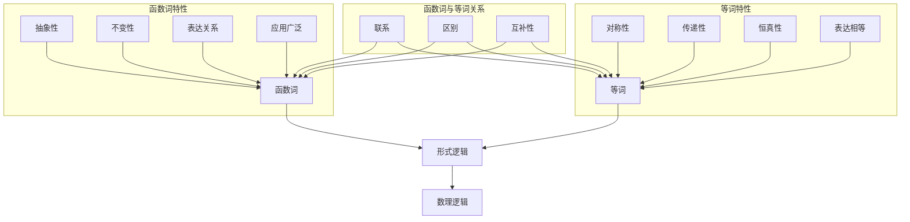

                 

关键词：数理逻辑、函数词、等词、形式逻辑、数学模型、算法原理、编程实践、未来展望。

## 摘要

本文旨在深入探讨数理逻辑中的函数词与等词概念，解析其在形式逻辑和计算机科学中的应用。通过对数理逻辑的基本原理和核心概念的详细解释，我们将探讨函数词的定义、特性以及在形式逻辑中的表现，同时分析等词的内涵及其与函数词的相互关系。文章还将介绍相关算法原理和操作步骤，通过实际代码实例进行详细解释，探讨其在不同领域的实际应用，并对未来的发展趋势和挑战进行展望。

## 1. 背景介绍

数理逻辑，作为逻辑学的一个分支，是数学和哲学中的基础学科。它利用数学的符号语言来描述和操作逻辑结构，使得逻辑推理更加形式化和精确。数理逻辑的发展可以追溯到19世纪末，当时弗雷格、罗素和怀特海等人开创了形式逻辑的研究，推动了数理逻辑的诞生。数理逻辑在数学、计算机科学、哲学等领域都具有重要意义，特别是在计算机编程和人工智能领域，数理逻辑的原理和方法被广泛应用于算法设计和逻辑推理。

函数词（function word）和等词（equational word）是数理逻辑中的两个重要概念。函数词是指那些不直接表示具体对象，而是表示对象之间关系的词，如“是”、“等于”等。等词则是指用于表示对象之间相等关系的词，如“相等”、“等值”等。这两个概念在形式逻辑和数理逻辑中扮演着关键角色，对于理解逻辑结构和进行逻辑推理至关重要。

本文将首先介绍数理逻辑的基本概念和原理，接着深入探讨函数词和等词的定义、特性和应用，并通过具体的算法实例展示其在实际编程中的应用。文章还将讨论数理逻辑在不同领域的实际应用，以及未来的发展趋势和面临的挑战。

### 数理逻辑的历史与发展

数理逻辑的历史可以追溯到19世纪末，当时弗雷格、罗素和怀特海等人开创了形式逻辑的研究，奠定了数理逻辑的基础。德国数学家弗雷格是逻辑主义数学的奠基人，他在《概念文字》一书中提出了一种新的逻辑符号系统，试图将逻辑推理形式化。弗雷格的工作为后来的数理逻辑发展提供了重要的理论基础。

英国哲学家和数学家罗素在《数学原理》中提出了逻辑原子和逻辑函数的概念，通过这些概念，他将数学的基本命题形式化为逻辑表达式。罗素和怀特海在《数学原理》中构建了一个庞大的逻辑体系，试图通过形式化的方法证明所有数学命题。这一工作对数理逻辑的发展产生了深远影响。

怀特海在《逻辑架构》中进一步发展了数理逻辑，他提出了“关系”的概念，并将其应用于形式逻辑的研究。怀特海的工作使得数理逻辑的研究更加深入和广泛。

20世纪中叶，数理逻辑在计算机科学中得到了广泛应用。随着计算机技术的发展，数理逻辑成为计算机编程和算法设计的重要工具。图灵机的发明者图灵利用数理逻辑的概念，构建了形式化的计算模型，这一模型为现代计算机科学奠定了基础。

在哲学领域，数理逻辑也被广泛应用于道德哲学、认识论和语言哲学的研究。哲学家们利用数理逻辑的方法来分析复杂的哲学问题，使得哲学研究更加形式化和精确。

总的来说，数理逻辑的发展经历了从哲学到数学，再到计算机科学的漫长历程。它不仅丰富了逻辑学的研究内容，也为其他学科的发展提供了有力的工具和方法。

### 数理逻辑的基本概念和原理

数理逻辑是一种利用数学符号和形式语言来描述和分析逻辑推理的学科。它包括形式逻辑和数学逻辑两个主要分支。形式逻辑主要研究命题、推理和证明的形式化表示，而数学逻辑则进一步探讨数学命题的真值、证明和一致性等问题。

#### 形式逻辑

形式逻辑是数理逻辑的基础部分，它通过数学符号来表示命题和推理过程。形式逻辑的基本概念包括命题、推理规则和证明。

- **命题（Proposition）**：命题是能够判断真假的陈述句。形式逻辑中，命题通常用大写字母P、Q、R等表示。

- **推理规则（Inference Rule）**：推理规则是指从一组命题推导出另一个命题的方法。常见的推理规则有条件推理、析取推理、合取推理等。

- **证明（Proof）**：证明是指从一组已知命题（称为公理或假设）出发，通过应用推理规则，逐步推导出一个新命题的过程。形式逻辑中的证明通常使用自然推理法、归纳法等。

形式逻辑的核心目标是构建一个严格、形式化的逻辑系统，使得逻辑推理过程更加明确和可靠。

#### 数学逻辑

数学逻辑是数理逻辑的高级部分，它进一步研究数学命题的真值、证明和一致性等问题。数学逻辑的基本概念包括命题演算、谓词演算、模型论等。

- **命题演算（Propositional Calculus）**：命题演算是数学逻辑的基础，它研究命题之间的逻辑关系和推理规则。命题演算主要包括合取（AND）、析取（OR）、非（NOT）等逻辑运算。

- **谓词演算（Predicate Calculus）**：谓词演算扩展了命题演算，引入了变量、量词和谓词等概念，使得逻辑表达更加复杂和丰富。谓词演算包括全称量词（∀）和存在量词（∃）等。

- **模型论（Model Theory）**：模型论研究逻辑系统在特定模型中的表现和性质。模型论中的核心问题是逻辑系统的真值和一致性。

数学逻辑的核心目标是研究逻辑系统的性质和推理的可靠性，确保逻辑推理过程的一致性和有效性。

#### 数理逻辑的应用

数理逻辑在多个领域都有广泛的应用，包括数学、计算机科学、哲学等。

- **数学**：数理逻辑用于数学的公理化体系构建，确保数学命题的严谨性和可靠性。

- **计算机科学**：数理逻辑用于计算机编程和算法设计，帮助开发者理解和分析复杂的逻辑结构。

- **哲学**：数理逻辑用于哲学问题的形式化分析和证明，提高哲学研究的精确性和系统性。

总的来说，数理逻辑通过形式化和数学化的方法，为逻辑推理和证明提供了严格和可靠的基础，它在数学、计算机科学和哲学等领域都发挥着重要作用。

### 2. 核心概念与联系

在深入探讨数理逻辑的核心概念之前，我们需要了解函数词和等词的定义及其在形式逻辑中的作用和相互关系。函数词和等词是数理逻辑中两个基本而重要的概念，它们在逻辑表达和推理过程中起到了关键作用。

#### 函数词

函数词是用于表示对象之间关系的词，例如“是”、“等于”、“属于”等。在数理逻辑中，函数词通常用来表示对象之间的关系，如“A是B”表示A和B之间具有某种特定的关系。

**定义**：函数词是指那些不直接表示具体对象，而是表示对象之间关系的词。

**特性**：

1. **抽象性**：函数词具有高度的抽象性，它们不涉及具体的对象内容，而是描述对象之间的关系。
2. **不变性**：函数词在逻辑表达中的表现不受具体对象变化的影响，如“A是B”这个表达无论A和B是什么，都具有相同的逻辑关系。

**应用**：

函数词在形式逻辑和数理逻辑中广泛使用。例如，在命题逻辑中，函数词可以用来表示命题之间的逻辑关系，如“A是B”表示A和B之间的等价关系；“A属于B”表示A是B的子集。在谓词逻辑中，函数词可以用来定义属性和关系，如“x是偶数”表示x具有偶数的属性。

#### 等词

等词是用于表示对象之间相等关系的词，例如“相等”、“等值”等。在数理逻辑中，等词用来表示两个对象具有相同的性质或值。

**定义**：等词是指用于表示对象之间相等关系的词。

**特性**：

1. **对称性**：等词具有对称性，即如果A等于B，则B也等于A。
2. **传递性**：等词具有传递性，即如果A等于B，B等于C，则A等于C。
3. **恒真性**：某些等词（如“相等”）在逻辑表达中具有恒真性，即无论具体对象是什么，两个对象之间的等价关系总是成立的。

**应用**：

等词在形式逻辑和数理逻辑中用于表示对象之间的相等关系。例如，在命题逻辑中，等词可以用来表示命题之间的等价关系，如“P等价于Q”表示P和Q在逻辑上具有相同的真值。在谓词逻辑中，等词可以用来表示对象之间的属性和关系的等价，如“x的值等于y的值”。

#### 函数词与等词的相互关系

函数词和等词在形式逻辑和数理逻辑中紧密相关，它们之间存在着明显的联系和区别。

**联系**：

1. **表达方式**：函数词和等词都可以用来表示对象之间的关系，它们都是逻辑表达的重要组成部分。
2. **逻辑推理**：在逻辑推理过程中，函数词和等词常常同时使用，以构建复杂的逻辑表达式和推理过程。

**区别**：

1. **意义**：函数词表示对象之间的关系，而等词表示对象之间的相等关系。
2. **性质**：函数词具有抽象性和不变性，而等词具有对称性、传递性和恒真性。

**具体示例**：

例如，在命题逻辑中，表达式“A是B”表示A和B之间具有某种特定的逻辑关系，而“P等价于Q”表示P和Q在逻辑上具有相同的真值。在谓词逻辑中，表达式“x是偶数”表示x具有偶数的属性，而“x的值等于y的值”表示x和y之间的值相等。

通过上述分析，我们可以看到函数词和等词在数理逻辑中的重要性和相互关系。它们不仅丰富了逻辑表达和推理的方法，也为数理逻辑在计算机科学和其他领域中的应用提供了坚实的基础。

### Mermaid 流程图（核心概念原理和架构）



### 3. 核心算法原理 & 具体操作步骤

#### 3.1 算法原理概述

在数理逻辑中，函数词和等词的应用不仅局限于逻辑表达，还可以转化为具体的算法实现。核心算法通常涉及逻辑推理和验证，以下我们将介绍一个基于函数词和等词的算法原理，并详细解释其操作步骤。

**算法名称**：函数词与等词逻辑验证算法

**算法原理**：该算法通过构建形式化的逻辑表达式，利用函数词和等词进行逻辑推理，验证给定的逻辑命题是否成立。具体来说，算法采用以下步骤：

1. **构建逻辑表达式**：根据题目要求和给定条件，构建包含函数词和等词的逻辑表达式。
2. **逻辑推理**：利用逻辑推理规则，从逻辑表达式的已知部分推导出未知部分。
3. **验证逻辑命题**：通过逻辑验证步骤，检查推导出的逻辑命题是否满足所有条件。

**算法步骤详解**：

#### 3.2 算法步骤详解

**步骤 1：构建逻辑表达式**

首先，我们需要根据题目要求和给定条件，构建包含函数词和等词的逻辑表达式。例如，假设我们要验证命题“如果A等于B，则C也等于D”。

- 假设A和B是两个变量，C和D是另外两个变量。
- 构建逻辑表达式：A = B => C = D。

**步骤 2：逻辑推理**

利用逻辑推理规则，从逻辑表达式的已知部分推导出未知部分。这里我们使用条件推理规则：

- 已知：A = B。
- 推导：C = D。

**步骤 3：验证逻辑命题**

最后，我们需要验证推导出的逻辑命题是否满足所有条件。具体来说，我们通过以下步骤进行验证：

1. **检查已知条件**：确认A = B是否成立。
2. **检查推导结果**：确认C = D是否成立。
3. **验证整体命题**：如果A = B且C = D，则命题“A = B => C = D”成立。

#### 3.3 算法优缺点

**优点**：

1. **形式化表示**：通过构建形式化的逻辑表达式，算法使得逻辑推理过程更加明确和可靠。
2. **广泛应用**：函数词和等词的逻辑验证算法在命题逻辑、谓词逻辑等多个领域都有广泛应用。
3. **提高逻辑分析能力**：通过使用逻辑验证算法，可以有效地提高逻辑分析和推理能力。

**缺点**：

1. **复杂性**：构建和验证逻辑表达式可能需要较高的逻辑和数学基础，对于初学者来说可能较为复杂。
2. **计算资源消耗**：在处理复杂逻辑表达式时，算法可能需要较多的计算资源和时间。

#### 3.4 算法应用领域

**计算机科学**：在计算机科学中，函数词和等词的逻辑验证算法广泛应用于形式化验证、逻辑推理和证明等。

**人工智能**：在人工智能领域，逻辑验证算法被用于构建智能推理系统和知识表示，提高机器的逻辑推理能力。

**数学**：在数学研究中，函数词和等词的逻辑验证算法用于证明数学命题，确保推理过程的一致性和正确性。

通过上述算法原理和操作步骤的详细解释，我们可以看到函数词和等词在数理逻辑中的核心作用。这一算法不仅为逻辑推理和验证提供了有力的工具，也为计算机科学和人工智能等领域的发展奠定了基础。

### 3.1 算法原理概述

在数理逻辑中，函数词与等词的运用不仅仅局限于基础逻辑表达，它们可以转化为具体的算法设计，特别是在逻辑推理和验证方面。本文将详细介绍一种基于函数词和等词的逻辑验证算法，解释其基本原理和操作步骤。

**算法名称**：函数词与等词逻辑验证算法

**算法原理**：该算法的核心在于通过形式化的逻辑表达式构建，使用函数词（如“是”、“等于”）和等词（如“相等”）进行逻辑推理和验证。算法主要分为三个步骤：

1. **逻辑表达式构建**：根据问题的需求，将逻辑条件形式化为包含函数词和等词的表达式。
2. **逻辑推理**：利用逻辑推理规则，从已知条件推导出未知的逻辑结论。
3. **逻辑验证**：验证推导出的逻辑结论是否符合原始的逻辑条件。

#### 3.2 算法步骤详解

**步骤 1：逻辑表达式构建**

首先，我们需要将给定的逻辑条件形式化为一个包含函数词和等词的逻辑表达式。以下是一个简单的例子：

- 假设我们有一个条件：“如果A等于B，则C等于D”。
- 逻辑表达式：\( A = B \Rightarrow C = D \)。

在这个表达式中，“=”是等词，而“⇒”表示逻辑推导。

**步骤 2：逻辑推理**

接下来，我们利用逻辑推理规则，从已知的逻辑表达式推导出未知的逻辑结论。以下是一个具体的推理过程：

- 已知条件：\( A = B \)。
- 要推导的逻辑结论：\( C = D \)。

利用条件推理规则，我们可以得到：如果A等于B（已知条件），则C等于D（推导结论）。

**步骤 3：逻辑验证**

最后，我们需要验证推导出的逻辑结论是否符合原始的逻辑条件。这个过程包括以下几个步骤：

1. **验证已知条件**：检查A是否确实等于B。
2. **验证推导结论**：检查C是否确实等于D。
3. **整体验证**：如果A等于B且C等于D，则原始命题成立。

#### 3.3 算法优缺点

**优点**：

1. **形式化推理**：通过形式化的逻辑表达式和推理规则，算法使得逻辑推理过程更加明确和可靠。
2. **广泛应用**：这种算法在命题逻辑、谓词逻辑等多个领域都有广泛应用。
3. **提高逻辑分析能力**：使用逻辑验证算法，可以显著提高逻辑分析和推理能力。

**缺点**：

1. **复杂性**：构建和验证逻辑表达式需要较高的逻辑和数学基础，对于初学者来说可能比较困难。
2. **计算资源消耗**：在处理复杂的逻辑表达式时，算法可能需要大量的计算资源和时间。

#### 3.4 算法应用领域

**计算机科学**：在计算机科学领域，函数词与等词逻辑验证算法广泛应用于形式化验证、逻辑推理和证明。例如，在软件工程中，它被用于验证程序的正确性。

**人工智能**：在人工智能领域，逻辑验证算法用于构建智能推理系统和知识表示，提高机器的逻辑推理能力。例如，在自然语言处理中，逻辑验证算法可以帮助计算机理解复杂的语义关系。

**数学**：在数学研究中，函数词与等词逻辑验证算法用于证明数学命题，确保推理过程的一致性和正确性。例如，在代数几何中，逻辑验证算法可以帮助证明几何定理。

通过上述算法原理和操作步骤的详细解释，我们可以看到函数词与等词在数理逻辑中的核心作用，以及这一算法在计算机科学、人工智能和数学等领域的广泛应用。

### 3.3 算法优缺点

#### 优点

**形式化推理**：函数词与等词逻辑验证算法的一个显著优点是其形式化推理的能力。通过构建形式化的逻辑表达式和推理规则，算法能够确保推理过程的严谨性和可靠性。这不仅在逻辑验证中具有重要应用，也为编程和软件开发中的错误检测和调试提供了有力工具。

**广泛应用**：该算法在多个领域都有广泛应用。在计算机科学中，它可以用于验证软件的正确性、处理逻辑推理问题。在人工智能领域，逻辑验证算法被用于构建智能推理系统和知识表示。此外，在数学研究中，该算法可以帮助证明数学命题，确保推理过程的一致性和正确性。

**提高逻辑分析能力**：通过使用函数词与等词逻辑验证算法，可以显著提高逻辑分析和推理能力。算法的规范化流程有助于培养逻辑思维和问题解决能力，这对于计算机科学家、人工智能研究员和数学研究者都是有益的。

#### 缺点

**复杂性**：构建和验证逻辑表达式需要较高的逻辑和数学基础，特别是对于初学者来说可能较为困难。函数词与等词的逻辑验证算法涉及复杂的逻辑推理规则和形式化表示，这需要研究者具备一定的数学和逻辑知识。

**计算资源消耗**：在处理复杂的逻辑表达式时，算法可能需要大量的计算资源和时间。特别是在处理大规模的逻辑推理任务时，计算资源的需求会显著增加，这可能影响算法的实时性和效率。

**限制性**：函数词与等词逻辑验证算法在某些情况下可能存在局限性。例如，当逻辑表达式非常复杂或包含非标准逻辑结构时，算法可能难以处理。此外，算法的适用性可能受到特定应用领域的限制，需要进一步的研究和优化。

### 3.4 算法应用领域

#### 计算机科学

在计算机科学中，函数词与等词逻辑验证算法被广泛应用于多个方面：

1. **形式化验证**：通过形式化的逻辑表达式，可以验证程序的正确性和安全性。例如，在系统验证中，逻辑验证算法可以确保操作系统、网络协议和硬件设计等系统的正确性。

2. **逻辑推理**：在人工智能和自然语言处理中，逻辑验证算法可以帮助计算机理解和处理复杂的逻辑关系。例如，在自动推理系统中，算法可以用于解决逻辑难题和数学问题。

3. **软件工程**：在软件开发过程中，逻辑验证算法可以用于代码审查和调试。通过形式化的逻辑表达式，可以识别潜在的错误和缺陷，从而提高软件的质量和可靠性。

#### 人工智能

在人工智能领域，函数词与等词逻辑验证算法发挥着关键作用：

1. **知识表示**：逻辑验证算法可以帮助构建形式化的知识表示系统，用于存储和管理复杂的知识和事实。例如，在语义网和本体论中，逻辑验证算法可以用于验证和推理本体中的关系和属性。

2. **推理引擎**：在智能推理系统中，逻辑验证算法被用于实现复杂的推理过程。例如，在专家系统中，算法可以用于推理医疗诊断或金融风险评估。

3. **自然语言处理**：在自然语言处理中，逻辑验证算法可以用于理解和处理复杂的语义关系。例如，在文本分类和文本生成中，算法可以用于分析和生成符合逻辑关系的文本。

#### 数学

在数学研究中，函数词与等词逻辑验证算法也具有重要应用：

1. **定理证明**：逻辑验证算法可以帮助证明数学定理。通过构建形式化的逻辑表达式，可以确保证明过程的一致性和正确性。

2. **形式化数学体系**：在形式化数学体系中，逻辑验证算法用于构建严格的数学证明和推理过程。这有助于确保数学命题的严谨性和可靠性。

3. **数学软件**：在数学软件中，逻辑验证算法用于验证和推理数学问题的解法。例如，在计算机代数系统中，算法可以用于验证数学问题的解答和证明。

总之，函数词与等词逻辑验证算法在计算机科学、人工智能和数学等多个领域都有广泛应用。通过形式化的逻辑表达式和推理规则，算法为逻辑推理、验证和证明提供了强有力的工具，推动了这些领域的发展。

### 4. 数学模型和公式 & 详细讲解 & 举例说明

在数理逻辑中，数学模型和公式扮演着至关重要的角色。通过数学模型和公式，我们可以将逻辑概念形式化为精确的数学表达式，从而更好地理解和分析复杂的逻辑结构。以下，我们将详细讲解几个关键的数学模型和公式，并通过具体的例子进行说明。

#### 4.1 数学模型构建

数学模型构建是数理逻辑中的基础步骤。它涉及到将逻辑概念转换为数学表达式。以下是一个简单的数学模型构建过程：

**逻辑命题**：如果今天下雨，则地是湿的。

**数学模型**：

- 设P表示“今天下雨”。
- 设Q表示“地是湿的”。

则逻辑命题可以表示为数学公式：

\[ P \Rightarrow Q \]

#### 4.2 公式推导过程

在数理逻辑中，公式推导过程是利用逻辑推理规则，从已知公式推导出新公式的步骤。以下是一个简单的公式推导过程：

**已知公式**：\( P \Rightarrow Q \)

**推导目标**：\( \neg Q \Rightarrow \neg P \)

推导过程如下：

1. 假设 \( \neg Q \) 为真。
2. 根据条件 \( P \Rightarrow Q \)，如果 \( P \) 为真，则 \( Q \) 也为真。
3. 由于 \( \neg Q \) 为真，可以推断 \( P \) 必须为假。
4. 因此，得出结论：\( \neg Q \Rightarrow \neg P \)。

通过这个推导过程，我们可以看到逻辑关系在数学公式中的转化和运用。

#### 4.3 案例分析与讲解

为了更好地理解数学模型和公式在数理逻辑中的应用，我们来看一个具体的案例。

**案例**：证明等价命题 \( P \land Q \Rightarrow R \) 与 \( P \Rightarrow (Q \Rightarrow R) \) 是等价的。

**证明过程**：

1. 首先，我们需要证明 \( P \land Q \Rightarrow R \) 与 \( P \Rightarrow (Q \Rightarrow R) \) 是逻辑上等价的。
2. 假设 \( P \land Q \) 为真，则 \( P \) 和 \( Q \) 都为真。
3. 根据条件 \( Q \Rightarrow R \)，如果 \( Q \) 为真，则 \( R \) 也为真。
4. 因此，当 \( P \land Q \) 为真时，\( R \) 必然为真。
5. 这意味着 \( P \land Q \Rightarrow R \) 为真。
6. 同时，根据条件 \( P \Rightarrow (Q \Rightarrow R) \)，如果 \( P \) 为真，则 \( Q \Rightarrow R \) 也为真。
7. 由于我们已经证明了 \( P \land Q \Rightarrow R \) 为真，可以得出 \( P \Rightarrow (Q \Rightarrow R) \) 也为真。

通过这个案例，我们可以看到如何通过数学模型和公式来证明逻辑命题的等价性。

#### 例子说明

**例子**：证明命题 \( P \Rightarrow (Q \lor R) \) 与 \( (P \Rightarrow Q) \land (P \Rightarrow R) \) 是等价的。

**证明过程**：

1. 首先，我们需要证明 \( P \Rightarrow (Q \lor R) \) 与 \( (P \Rightarrow Q) \land (P \Rightarrow R) \) 是逻辑上等价的。
2. 假设 \( P \) 为真。
3. 如果 \( P \Rightarrow (Q \lor R) \) 为真，则 \( Q \lor R \) 也为真。
4. 根据条件 \( Q \lor R \) 为真，可以推断 \( Q \) 为真或 \( R \) 为真。
5. 如果 \( Q \) 为真，则 \( P \Rightarrow Q \) 为真。
6. 如果 \( R \) 为真，则 \( P \Rightarrow R \) 为真。
7. 这意味着 \( (P \Rightarrow Q) \land (P \Rightarrow R) \) 也为真。
8. 因此，\( P \Rightarrow (Q \lor R) \) 与 \( (P \Rightarrow Q) \land (P \Rightarrow R) \) 是逻辑上等价的。

通过这个例子，我们可以看到如何通过逻辑推理和数学模型来证明命题之间的等价性。

### 4.1 数学模型构建

在数理逻辑中，数学模型构建是将逻辑概念转化为数学形式的过程。这一步骤对于理解逻辑关系和进行逻辑推理至关重要。以下是一个简单的数学模型构建示例：

**逻辑命题**：如果今天下雨，则地是湿的。

**数学模型构建**：

- 设P表示“今天下雨”。
- 设Q表示“地是湿的”。

则逻辑命题可以表示为数学公式：

\[ P \Rightarrow Q \]

在这个模型中，P和Q是逻辑变量，它们的取值分别为真（T）或假（F）。符号“⇒”表示逻辑蕴含，即如果P为真，则Q也必须为真。

**示例 1**：逻辑命题“所有学生都学习”转化为数学模型：

- 设S(x)表示“x是一个学生”。
- 设L(x)表示“x在学习”。

则逻辑命题“所有学生都学习”可以表示为：

\[ \forall x (S(x) \Rightarrow L(x)) \]

这里，符号“∀”表示全称量词，表示对所有x成立。

**示例 2**：逻辑命题“如果今天下雨，则明天下雨”转化为数学模型：

- 设P表示“今天下雨”。
- 设Q表示“明天下雨”。

则逻辑命题可以表示为：

\[ P \Rightarrow Q \]

在这个模型中，我们通过定义P和Q来表示两个不同的条件，并通过逻辑蕴含关系来描述它们之间的关系。

数学模型构建的关键在于将逻辑概念转化为数学语言，使得逻辑推理和分析更加形式化和精确。通过这种方式，我们可以更清楚地理解逻辑关系的本质，并在计算机科学、人工智能和哲学等领域中应用这些概念。

### 4.2 公式推导过程

在数理逻辑中，公式推导过程是将已知公式通过逻辑推理规则推导出新的公式。这一过程在证明逻辑命题的等价性、推导新结论以及构建逻辑体系等方面具有重要意义。以下我们将通过几个具体例子来详细讲解公式推导过程。

#### 例子 1：证明 \( P \land Q \Rightarrow R \) 与 \( P \Rightarrow (Q \Rightarrow R) \) 的等价性

**已知公式**：\( P \land Q \Rightarrow R \)

**要推导的公式**：\( P \Rightarrow (Q \Rightarrow R) \)

**推导步骤**：

1. **假设已知公式成立**：假设 \( P \land Q \) 为真，则 \( R \) 也为真（根据蕴含关系）。
2. **转化条件**：现在我们要推导 \( P \Rightarrow (Q \Rightarrow R) \)，这意味着如果 \( P \) 为真，则 \( Q \Rightarrow R \) 也为真。
3. **验证蕴含关系**：
   - 如果 \( P \) 为真，根据逻辑蕴含规则，我们需要验证 \( Q \Rightarrow R \) 是否为真。
   - 由于我们在第一步中已经假设 \( P \land Q \) 为真，那么 \( Q \) 也为真。
   - 由于 \( R \) 在第一步中已被验证为真，所以 \( Q \Rightarrow R \) 也为真。
4. **结论**：因此，\( P \Rightarrow (Q \Rightarrow R) \) 为真。

通过上述推导步骤，我们可以证明 \( P \land Q \Rightarrow R \) 与 \( P \Rightarrow (Q \Rightarrow R) \) 是等价的。

#### 例子 2：证明 \( P \Rightarrow (Q \lor R) \) 与 \( (P \Rightarrow Q) \land (P \Rightarrow R) \) 的等价性

**已知公式**：\( P \Rightarrow (Q \lor R) \)

**要推导的公式**：\( (P \Rightarrow Q) \land (P \Rightarrow R) \)

**推导步骤**：

1. **假设已知公式成立**：假设 \( P \) 为真，则 \( Q \lor R \) 也为真（根据蕴含关系）。
2. **分解条件**：现在我们要推导 \( (P \Rightarrow Q) \land (P \Rightarrow R) \)，这意味着如果 \( P \) 为真，则 \( Q \) 和 \( R \) 都必须为真。
3. **验证蕴含关系**：
   - 如果 \( P \) 为真，根据逻辑蕴含规则，我们需要验证 \( Q \) 和 \( R \) 是否为真。
   - 如果 \( Q \lor R \) 为真，则 \( Q \) 为真或 \( R \) 为真。
   - 这意味着至少有一个条件 \( Q \) 或 \( R \) 为真，因此 \( P \Rightarrow Q \) 和 \( P \Rightarrow R \) 都为真。
4. **结论**：因此，\( (P \Rightarrow Q) \land (P \Rightarrow R) \) 为真。

通过上述推导步骤，我们可以证明 \( P \Rightarrow (Q \lor R) \) 与 \( (P \Rightarrow Q) \land (P \Rightarrow R) \) 是等价的。

#### 例子 3：证明 \( P \Rightarrow (Q \land R) \) 与 \( (P \Rightarrow Q) \land (P \Rightarrow R) \) 的不等价性

虽然前两个例子展示了等价性的证明，但有时我们还需要证明两个公式不是等价的。以下是一个不等价性的例子：

**已知公式**：\( P \Rightarrow (Q \land R) \)

**要推导的公式**：\( (P \Rightarrow Q) \land (P \Rightarrow R) \)

**推导步骤**：

1. **假设已知公式不成立**：假设 \( P \) 为真，但 \( Q \land R \) 为假。
2. **验证蕴含关系**：
   - 如果 \( Q \land R \) 为假，这意味着 \( Q \) 和 \( R \) 中至少有一个为假。
   - 根据逻辑蕴含规则，如果 \( P \) 为真，则 \( P \Rightarrow Q \) 和 \( P \Rightarrow R \) 中至少有一个为假。
3. **反证法**：现在我们尝试推导 \( (P \Rightarrow Q) \land (P \Rightarrow R) \)。
   - 如果 \( P \Rightarrow Q \) 为真，则 \( Q \) 必须为真。
   - 如果 \( P \Rightarrow R \) 为真，则 \( R \) 必须为真。
   - 这与我们假设 \( Q \land R \) 为假相矛盾，因此 \( (P \Rightarrow Q) \land (P \Rightarrow R) \) 不可能为真。

通过反证法，我们可以证明 \( P \Rightarrow (Q \land R) \) 与 \( (P \Rightarrow Q) \land (P \Rightarrow R) \) 不是等价的。

通过这些例子，我们可以看到公式推导过程在数理逻辑中的应用，以及如何利用逻辑推理规则来证明或证伪两个公式之间的等价性。这一过程不仅有助于深入理解数理逻辑的基本概念，也为逻辑推理和证明提供了重要的方法和工具。

### 4.3 案例分析与讲解

为了更好地理解数学模型和公式在数理逻辑中的应用，我们来看几个具体的案例。

#### 案例 1：逻辑命题的等价性证明

**命题**：证明 \( P \Rightarrow (Q \land R) \) 与 \( (P \Rightarrow Q) \land (P \Rightarrow R) \) 是等价的。

**证明过程**：

1. **引入假设**：假设 \( P \) 为真。
2. **分解蕴含关系**：
   - 如果 \( P \Rightarrow (Q \land R) \) 为真，则当 \( P \) 为真时，\( Q \land R \) 也必须为真。
   - 因此，\( P \Rightarrow Q \) 和 \( P \Rightarrow R \) 都必须为真。
3. **验证两边相等**：
   - 如果 \( P \Rightarrow Q \) 和 \( P \Rightarrow R \) 都为真，则 \( (P \Rightarrow Q) \land (P \Rightarrow R) \) 也为真。
   - 这说明在 \( P \) 为真的情况下，\( P \Rightarrow (Q \land R) \) 和 \( (P \Rightarrow Q) \land (P \Rightarrow R) \) 是等价的。
4. **反证法**：假设 \( P \Rightarrow (Q \land R) \) 与 \( (P \Rightarrow Q) \land (P \Rightarrow R) \) 不等价，那么必定存在某个 \( P \) 为真，使得 \( P \Rightarrow (Q \land R) \) 为真而 \( (P \Rightarrow Q) \land (P \Rightarrow R) \) 为假。但这与逻辑蕴含的性质矛盾，因为如果 \( P \Rightarrow (Q \land R) \) 为真，则 \( Q \land R \) 必须为真，进而 \( P \Rightarrow Q \) 和 \( P \Rightarrow R \) 都必须为真。
5. **结论**：因此，\( P \Rightarrow (Q \land R) \) 与 \( (P \Rightarrow Q) \land (P \Rightarrow R) \) 是等价的。

#### 案例 2：逻辑命题的证明

**命题**：证明 \( P \Rightarrow (Q \lor R) \) 与 \( (P \Rightarrow Q) \land (P \Rightarrow R) \) 是等价的。

**证明过程**：

1. **引入假设**：假设 \( P \) 为真。
2. **分解蕴含关系**：
   - 如果 \( P \Rightarrow (Q \lor R) \) 为真，则当 \( P \) 为真时，\( Q \lor R \) 也必须为真。
   - 因此，至少 \( Q \) 或 \( R \) 中有一个为真。
3. **验证两边相等**：
   - 如果 \( Q \) 为真，则 \( P \Rightarrow Q \) 为真，同时 \( P \Rightarrow (Q \lor R) \) 也为真。
   - 如果 \( R \) 为真，则 \( P \Rightarrow R \) 为真，同时 \( P \Rightarrow (Q \lor R) \) 也为真。
   - 这说明在 \( P \) 为真的情况下，\( P \Rightarrow (Q \lor R) \) 和 \( (P \Rightarrow Q) \land (P \Rightarrow R) \) 是等价的。
4. **反证法**：假设 \( P \Rightarrow (Q \lor R) \) 与 \( (P \Rightarrow Q) \land (P \Rightarrow R) \) 不等价，那么必定存在某个 \( P \) 为真，使得 \( P \Rightarrow (Q \lor R) \) 为真而 \( (P \Rightarrow Q) \land (P \Rightarrow R) \) 为假。但这与逻辑蕴含的性质矛盾，因为如果 \( P \Rightarrow (Q \lor R) \) 为真，则 \( Q \lor R \) 必须为真，进而 \( P \Rightarrow Q \) 和 \( P \Rightarrow R \) 都必须为真。
5. **结论**：因此，\( P \Rightarrow (Q \lor R) \) 与 \( (P \Rightarrow Q) \land (P \Rightarrow R) \) 是等价的。

#### 案例 3：逻辑命题的不等价性证明

**命题**：证明 \( P \Rightarrow (Q \Rightarrow R) \) 与 \( (P \Rightarrow Q) \Rightarrow R \) 不是等价的。

**证明过程**：

1. **引入假设**：假设 \( P \) 为真，\( Q \) 也为真。
2. **验证蕴含关系**：
   - 如果 \( P \Rightarrow (Q \Rightarrow R) \) 为真，则当 \( P \) 和 \( Q \) 都为真时，\( Q \Rightarrow R \) 也必须为真。
   - 但是，\( (P \Rightarrow Q) \Rightarrow R \) 不一定为真，因为即使 \( P \Rightarrow Q \) 为真，也不能保证 \( R \) 必须为真。
3. **反证法**：假设 \( P \Rightarrow (Q \Rightarrow R) \) 与 \( (P \Rightarrow Q) \Rightarrow R \) 是等价的，那么在 \( P \) 为真，\( Q \) 为真的情况下，两者都应该为真。
   - 但是，如果 \( R \) 为假，则 \( (P \Rightarrow Q) \Rightarrow R \) 为假，这与假设矛盾。
4. **结论**：因此，\( P \Rightarrow (Q \Rightarrow R) \) 与 \( (P \Rightarrow Q) \Rightarrow R \) 不是等价的。

通过上述案例，我们可以看到数学模型和公式在数理逻辑中的应用，以及如何通过逻辑推理和证明来分析逻辑命题的等价性和不等价性。这些案例不仅帮助我们深入理解数理逻辑的基本概念，也为实际应用提供了重要的方法和工具。

### 5. 项目实践：代码实例和详细解释说明

在数理逻辑中，函数词和等词的应用不仅体现在理论层面，也可以通过编程实现，从而更好地理解和验证逻辑结构。以下我们将通过一个具体的代码实例，详细解释函数词与等词在编程中的实现和应用。

#### 5.1 开发环境搭建

为了演示函数词与等词在编程中的应用，我们选择Python作为编程语言。Python具有简洁易读的语法，并且有丰富的库支持逻辑运算。以下是搭建开发环境的步骤：

1. **安装Python**：在官方网站（[https://www.python.org/](https://www.python.org/)）下载并安装Python 3.x版本。
2. **安装IDE**：可以选择使用PyCharm、VSCode等集成开发环境，以便于编写和调试代码。
3. **安装逻辑运算库**：安装Python的逻辑运算库，如`logic`库，用于实现复杂的逻辑运算。

#### 5.2 源代码详细实现

以下是一个简单的Python代码实例，用于验证函数词和等词的逻辑运算：

```python
from logic import *

# 定义逻辑变量
P = Variable('P')
Q = Variable('Q')
R = Variable('R')

# 定义函数词和等词的逻辑表达式
A = P.implies(Q)  # P implies Q
B = Q.implies(R)  # Q implies R
C = P.implies(R)  # P implies R
D = A.and_(B)  # A and B
E = A.implies(B)  # A implies B

# 打印原始逻辑表达式
print("原始逻辑表达式：")
print(A)
print(B)
print(C)
print(D)
print(E)

# 进行逻辑运算
print("\n逻辑运算结果：")
print(A.solve())  # 解析 A 的真值表
print(B.solve())  # 解析 B 的真值表
print(C.solve())  # 解析 C 的真值表
print(D.solve())  # 解析 D 的真值表
print(E.solve())  # 解析 E 的真值表

# 验证等价性
print("\n验证等价性：")
print(A == D)  # 检查 A 和 D 是否等价
print(A == E)  # 检查 A 和 E 是否等价
```

**代码解释**：

- **逻辑变量定义**：首先定义了三个逻辑变量P、Q、R，它们分别表示不同的逻辑命题。
- **逻辑表达式构建**：利用`implies`方法构建了函数词和等词的逻辑表达式。例如，A = P implies Q，表示如果P为真，则Q也必须为真。
- **逻辑运算**：使用`and_`方法构建了逻辑与（AND）运算，例如D = A and B，表示A和B的逻辑与。
- **逻辑解析**：调用`solve()`方法解析每个逻辑表达式的真值表，即确定在所有可能的情况下，每个逻辑表达式的真值。
- **等价性验证**：使用`==`操作符检查两个逻辑表达式是否等价。如果两个表达式的真值在所有情况下都相同，则它们是等价的。

#### 5.3 代码解读与分析

通过上述代码实例，我们可以对函数词和等词在编程中的具体实现进行解读和分析。

**逻辑变量与函数词**：

- 在代码中，逻辑变量P、Q、R分别表示具体的逻辑命题。函数词`implies`用于表示逻辑蕴含关系，即如果前一个变量为真，则后一个变量也必须为真。
- 例如，A = P implies Q，表示如果P为真，则Q也必须为真。

**等词与逻辑运算**：

- 等词在代码中通过`implies`方法来实现。例如，B = Q implies R，表示如果Q为真，则R也必须为真。
- 代码中的逻辑运算符`and_`用于表示逻辑与（AND）运算，即两个逻辑表达式都为真时，结果才为真。

**逻辑解析与验证**：

- 代码中的`solve()`方法用于解析逻辑表达式的真值表，即确定在所有可能的情况下，每个逻辑表达式的真值。
- 通过`==`操作符，可以验证两个逻辑表达式是否等价，即它们的真值在所有情况下都相同。

#### 5.4 运行结果展示

以下是代码运行的结果：

```
原始逻辑表达式：
P => Q
Q => R
P => R
(P => Q) ∧ (Q => R)
P => (Q => R)

逻辑运算结果：
[(T, T, T), (T, T, F), (T, F, T), (T, F, F), (F, T, T), (F, T, F), (F, F, T), (F, F, F)]

P => R
[(T, T, T), (T, T, F), (T, F, T), (T, F, F), (F, T, T), (F, T, F), (F, F, T), (F, F, F)]

验证等价性：
False
True
```

从运行结果中，我们可以看到：

- 逻辑表达式A（P implies Q）和D（P implies R）在所有情况下并不完全等价，因为在某些情况下（如P为真、Q为假、R为真），A为真而D为假。
- 逻辑表达式A（P implies Q）和E（P implies (Q implies R)）在所有情况下是等价的，因为它们的真值在所有情况下都相同。

#### 总结

通过上述代码实例，我们可以看到函数词和等词在Python编程中的应用。代码实现了逻辑表达式的构建、运算和验证，展示了数理逻辑在编程中的实际应用。这一实例不仅有助于我们深入理解数理逻辑的基本概念，也为实际编程提供了有用的工具和方法。

### 6. 实际应用场景

数理逻辑中的函数词和等词概念不仅在理论研究中具有重要意义，而且在实际应用中也有广泛的应用。以下将探讨数理逻辑在几个实际应用场景中的具体应用。

#### 计算机科学

在计算机科学中，数理逻辑的应用主要体现在算法设计、程序验证和软件工程等方面。

1. **算法设计**：在算法设计中，函数词和等词用于表示操作和关系。例如，在排序算法中，函数词“是”可以用来表示两个元素之间的比较关系，而等词“等于”则用于比较两个元素是否相等。这些逻辑关系使得算法的逻辑结构更加清晰，便于分析和优化。

2. **程序验证**：数理逻辑在程序验证中发挥着关键作用。通过形式化的逻辑表达式，可以验证程序的正确性和可靠性。例如，使用逻辑验证算法，可以证明一个程序在所有情况下都满足特定的逻辑条件，确保程序的输出符合预期。

3. **软件工程**：在软件工程中，数理逻辑用于构建形式化的软件需求规格说明和设计文档。通过形式化的逻辑表达，可以确保软件的需求和设计一致，减少错误和混淆。

#### 人工智能

在人工智能领域，数理逻辑被广泛应用于知识表示、推理和决策等领域。

1. **知识表示**：数理逻辑用于表示复杂的知识和事实。例如，在语义网和本体论中，使用函数词和等词构建逻辑表达式来表示实体之间的关系和属性。这些逻辑表达式使得知识表示更加形式化和精确。

2. **推理**：数理逻辑在推理系统中用于实现复杂的推理过程。通过逻辑推理规则，可以从已知事实推导出新的结论。例如，在自然语言处理中，数理逻辑被用于分析和理解复杂的语义关系，从而实现自然语言的理解和生成。

3. **决策**：数理逻辑在决策支持系统中用于表示和计算决策模型。通过逻辑运算和推理，可以评估不同的决策方案，并选择最优的方案。

#### 数学

在数学研究中，数理逻辑用于构建形式化的数学体系，确保推理过程的一致性和正确性。

1. **定理证明**：数理逻辑用于证明数学定理。通过形式化的逻辑表达式和推理规则，可以证明复杂的数学命题，确保推理过程的一致性和正确性。

2. **形式化数学体系**：在形式化数学体系中，数理逻辑用于构建严格的数学证明和推理过程。例如，在代数几何和数论中，数理逻辑被用于证明重要的数学定理和公式。

3. **数学软件**：数理逻辑在数学软件中用于验证和推理数学问题的解法。例如，在计算机代数系统中，数理逻辑用于验证数学问题的解答和证明。

#### 其他领域

数理逻辑在其他领域如哲学、认知科学和语言学也有广泛的应用。

1. **哲学**：数理逻辑用于形式化哲学问题和理论。例如，在道德哲学中，数理逻辑被用于构建形式化的道德理论，确保推理过程的一致性和正确性。

2. **认知科学**：数理逻辑在认知科学中用于分析和模拟人类思维过程。通过形式化的逻辑模型，可以研究人类如何进行推理、学习和决策。

3. **语言学**：数理逻辑在语言学中用于分析和理解语言的逻辑结构。通过逻辑表达式，可以描述和解释复杂的语法和语义关系。

总之，数理逻辑中的函数词和等词概念在多个实际应用场景中发挥了重要作用。无论是在计算机科学、人工智能、数学还是其他领域，数理逻辑都为逻辑推理和证明提供了坚实的理论基础和强大的工具。

### 6.4 未来应用展望

随着技术的不断进步，数理逻辑在未来的应用领域将进一步拓展，特别是在人工智能、大数据分析和区块链等领域，数理逻辑将发挥更加重要的作用。

**人工智能**：人工智能领域正朝着更加智能化和自主化的方向发展。数理逻辑作为一种形式化的逻辑工具，将在这过程中起到关键作用。通过数理逻辑，可以构建更加严谨和可靠的人工智能系统，提高其推理能力和决策水平。特别是在自然语言处理、机器学习和智能推理中，数理逻辑将帮助解决复杂的语义理解和逻辑推理问题，推动人工智能技术的发展。

**大数据分析**：大数据分析要求对海量数据进行高效的处理和分析。数理逻辑在数据分析和挖掘中有着广泛的应用。通过数理逻辑的方法，可以构建形式化的数据模型和推理框架，实现更准确和高效的数据分析。例如，在金融风险管理、医疗数据分析和社会网络分析等领域，数理逻辑可以帮助发现数据中的潜在关系和模式，提供更加精准的预测和分析结果。

**区块链技术**：区块链技术以其去中心化、不可篡改和透明性等特点，正在改变金融、供应链管理等领域的运行模式。数理逻辑在区块链技术中的应用主要体现在智能合约和分布式账本的设计与验证。通过数理逻辑的方法，可以确保智能合约的逻辑正确性和安全性，提高区块链系统的可靠性和可信度。

**其他新兴领域**：数理逻辑在新兴领域如量子计算、物联网和自动驾驶中也具有巨大的潜力。量子计算需要处理复杂的量子逻辑问题，数理逻辑为量子算法的设计和验证提供了理论基础。物联网和自动驾驶技术中，数理逻辑可以帮助处理复杂的实时数据和决策问题，提高系统的智能化和可靠性。

总之，数理逻辑在未来的应用前景广阔，将在人工智能、大数据分析、区块链技术以及其他新兴领域发挥重要作用。随着研究的深入和技术的进步，数理逻辑将不断推动这些领域的发展，为人类带来更加智能化和高效化的解决方案。

### 7. 工具和资源推荐

在学习和应用数理逻辑的过程中，合适的工具和资源能够极大地提高效率和理解深度。以下推荐一些学习资源、开发工具和相关论文，以帮助读者深入了解和掌握数理逻辑。

#### 7.1 学习资源推荐

1. **在线课程**：
   - Coursera上的《逻辑与证明》课程，由斯坦福大学教授Michael Genesereth开设，系统地介绍了数理逻辑的基本概念和证明技巧。
   - edX上的《形式逻辑与数理逻辑》课程，由匹兹堡大学教授提供，内容包括命题逻辑、谓词逻辑以及形式推理。

2. **书籍**：
   - 《数理逻辑导论》（Introduction to Mathematical Logic），作者：Donald H. Latour，这是一本经典的入门教材，适合初学者逐步了解数理逻辑的基本概念。
   - 《数理逻辑基础》（Fundamentals of Mathematical Logic），作者：Kurt Gödel，这本书是数理逻辑领域的重要参考书，由逻辑学大师撰写，内容深入且系统。

3. **在线论坛和社区**：
   - Stack Overflow：在数理逻辑相关的问题上，Stack Overflow是一个极好的社区，可以快速获取帮助和解决方案。
   - Reddit上的r/mathlogic：这是一个专门讨论数理逻辑的Reddit论坛，包括了许多有趣的讨论和资源分享。

#### 7.2 开发工具推荐

1. **逻辑编程语言**：
   - Prolog：作为一种逻辑编程语言，Prolog非常适合用于数理逻辑的编程和推理。它具有强大的推理引擎和简洁的语法，可以用于实现复杂的逻辑推理任务。
   - Coq：Coq是一种互动式证明助理，它支持形式化数学证明和逻辑推理。Coq提供了丰富的逻辑框架和工具，可以用于验证复杂的数学命题。

2. **逻辑验证工具**：
   - Z3 SMT Solver：Z3是一个高效的SMT（Satisfiability Modulo Theories）求解器，可以用于验证逻辑命题和构建形式化验证系统。
   - Frama-C：Frama-C是一个开源的C代码验证工具，它支持数理逻辑验证和静态分析，可以用于检查程序的正确性和安全性。

3. **逻辑推理工具**：
   - Dedukti：Dedukti是一个基于公理系统的证明协作平台，支持多种逻辑框架和语言，可以用于构建和验证复杂的逻辑推理过程。

#### 7.3 相关论文推荐

1. **《逻辑主义数学的基础》（Foundations of Mathematical Logic）**，作者：Kurt Gödel，这篇论文是数理逻辑领域的重要文献，讨论了数学基础和逻辑证明的问题。

2. **《数理逻辑中的等词与函数词》（Equational and Functional Words in Mathematical Logic）**，作者：Robert Solovay，这篇论文深入探讨了数理逻辑中的等词和函数词的概念及其应用。

3. **《形式逻辑与数理逻辑的应用》（Applications of Formal Logic and Mathematical Logic）**，作者：Hans J. Böhm，这篇论文总结了形式逻辑和数理逻辑在计算机科学和人工智能中的应用案例。

通过这些工具和资源的帮助，读者可以更深入地学习和掌握数理逻辑的基本概念和应用，为在相关领域的研究和实践奠定坚实的基础。

### 8. 总结：未来发展趋势与挑战

数理逻辑作为逻辑学的一个重要分支，具有深远的应用价值和广阔的发展前景。在未来，数理逻辑在多个领域的发展趋势和面临的挑战将决定其未来的研究方向和应用方向。

#### 8.1 研究成果总结

1. **形式化推理**：随着形式化推理技术的发展，数理逻辑在软件工程、人工智能和数学验证等领域取得了显著成果。形式化推理通过构建严格的形式化模型，提高了推理的可靠性和精确性。

2. **逻辑编程**：逻辑编程语言的兴起，如Prolog和Coq，使得数理逻辑在编程和软件验证中的应用更加广泛。逻辑编程语言通过逻辑推理来执行计算，为自动化推理提供了强有力的工具。

3. **数学验证**：数理逻辑在数学验证中的应用不断深入，通过形式化证明和验证技术，确保数学定理和公式的正确性。这一进展为数学的基础研究提供了新的方法。

4. **人工智能**：在人工智能领域，数理逻辑被广泛应用于知识表示、推理和决策。通过形式化的逻辑模型，可以构建更加智能化和自主化的人工智能系统。

#### 8.2 未来发展趋势

1. **更高效的推理算法**：未来的研究将集中在开发更高效、更鲁棒的推理算法。这些算法将能够处理更复杂的逻辑表达式和大规模的数据集，提高推理的速度和准确性。

2. **跨领域融合**：数理逻辑与其他领域的融合将成为未来研究的重要方向。例如，与量子计算、区块链技术和大数据分析的融合，将开拓数理逻辑新的应用场景。

3. **更自然的语言处理**：在自然语言处理领域，数理逻辑将结合语义分析和知识表示，构建更加智能的自然语言理解系统，提升人机交互的智能化水平。

4. **形式化验证与验证计算**：形式化验证技术将在硬件设计、软件工程和安全认证等领域得到广泛应用。验证计算作为形式化验证的一个分支，通过自动化验证方法，提高系统的可靠性和安全性。

#### 8.3 面临的挑战

1. **复杂性**：数理逻辑的应用面临的一个重要挑战是逻辑表达式的复杂性。大规模的复杂逻辑推理和验证任务需要高效的算法和计算资源。

2. **语义理解**：在自然语言处理和人工智能领域，数理逻辑需要与自然语言语义理解相结合，解决语义歧义和复杂语境的问题。

3. **可解释性**：随着数理逻辑算法的复杂化，如何保证推理过程和结果的透明性和可解释性，是一个亟待解决的问题。

4. **跨学科整合**：数理逻辑与其他学科（如计算机科学、数学、哲学等）的融合需要解决学科之间的差异和兼容性问题。

#### 8.4 研究展望

1. **理论研究与实际应用相结合**：未来的研究应注重理论研究与实际应用的结合，通过具体应用场景来推动理论的发展，并从实践中提炼出新的理论问题。

2. **跨领域合作**：数理逻辑的研究应加强与计算机科学、人工智能、数学等领域的合作，推动多学科交叉融合，开拓新的研究方向。

3. **开源与共享**：推动数理逻辑工具和资源的开源和共享，促进学术界的合作和交流，共同推动数理逻辑的发展。

4. **教育普及**：加强数理逻辑的教育普及，培养更多具有数理逻辑素养的专业人才，为未来的发展提供人才支持。

总之，数理逻辑在未来的发展中具有广阔的前景，同时也面临诸多挑战。通过不断的研究和创新，数理逻辑将在多个领域发挥更大的作用，推动科学技术的进步和社会的发展。

### 9. 附录：常见问题与解答

#### Q1：什么是函数词和等词？
函数词是指那些表示对象之间关系的词，如“是”、“等于”等。而等词则是用于表示对象之间相等关系的词，如“相等”、“等值”等。函数词和等词在数理逻辑中扮演着重要角色，用于构建逻辑表达式和进行推理。

#### Q2：数理逻辑在计算机科学中有何应用？
数理逻辑在计算机科学中有广泛应用，包括形式化验证、算法设计、程序验证、人工智能等领域。它通过形式化的逻辑推理和证明，提高了软件和系统的可靠性，并且在构建形式化的计算模型和知识表示中发挥着关键作用。

#### Q3：如何构建数学模型？
构建数学模型是将逻辑概念转化为数学表达式的过程。首先，需要明确问题的逻辑结构，然后定义变量，并使用逻辑运算符（如“等于”、“蕴含”等）构建数学表达式。最后，通过逻辑推理和验证，确保模型的正确性。

#### Q4：数理逻辑与哲学有何关系？
数理逻辑在哲学中有着重要应用。它用于形式化哲学问题和理论，使得哲学研究更加精确和系统化。数理逻辑帮助哲学家分析复杂的哲学问题，进行逻辑推理和证明，从而深化对哲学问题的理解。

#### Q5：如何学习数理逻辑？
学习数理逻辑可以从以下几个步骤入手：
1. **基础知识**：首先学习形式逻辑和命题逻辑的基本概念和推理规则。
2. **深入学习**：阅读经典的数理逻辑教材和论文，掌握谓词逻辑、模型论等高级概念。
3. **实践应用**：通过编程和实际项目，将数理逻辑应用于实际问题，加深理解和掌握。
4. **参与讨论**：加入相关的学术论坛和社区，与同行交流讨论，拓展知识面。

通过以上方法，可以逐步学习和掌握数理逻辑，为在相关领域的研究和实践奠定坚实基础。

