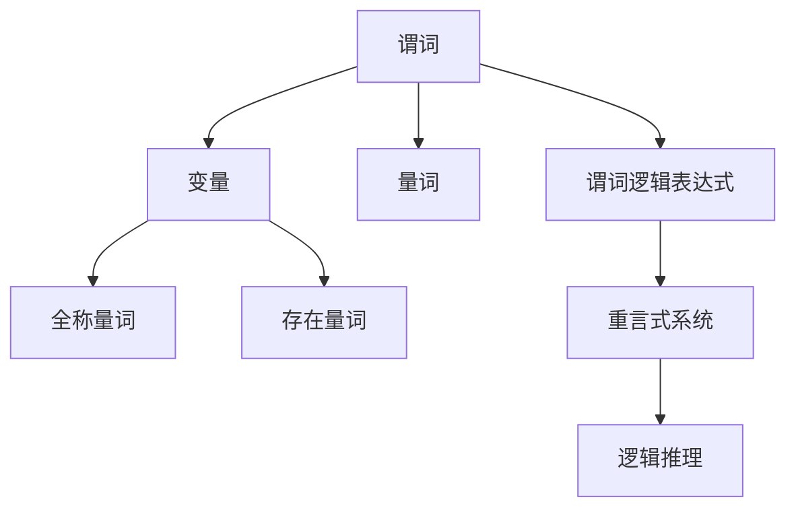
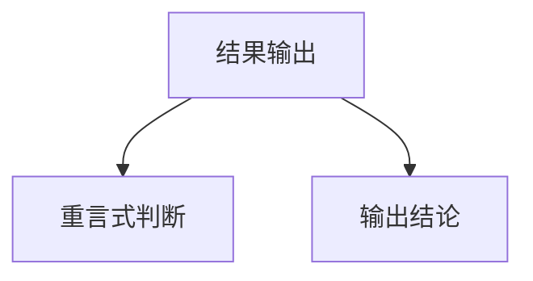

                 

关键词：数理逻辑、谓词逻辑、重言式系统、逻辑推理、形式化系统、数学公式、编程应用

> 摘要：本文深入探讨了数理逻辑中的谓词逻辑及其重言式系统，分析了其在数学和计算机科学中的重要性和应用。文章首先介绍了谓词逻辑的基本概念和符号系统，然后详细阐述了重言式系统的定义、性质及其在逻辑推理中的关键作用。最后，通过实际案例展示了谓词逻辑的重言式系统在编程中的应用，并展望了其未来发展的趋势和挑战。

## 1. 背景介绍

数理逻辑是数学和哲学中用于研究推理和证明的理论，它为逻辑推理提供了一个形式化、系统化的框架。数理逻辑的发展可以追溯到古希腊时期，亚里士多德在《工具论》中首次提出了形式逻辑的基本原理。然而，真正使数理逻辑成为一门独立学科的，是19世纪末和20世纪初的一系列重要工作，尤其是弗雷格、罗素和怀特海德的贡献。

在数理逻辑中，谓词逻辑是最重要的分支之一。谓词逻辑引入了“谓词”这一概念，使得逻辑表达式能够表示更为复杂的性质和关系。谓词逻辑不仅是形式系统理论的基础，也是计算机科学中各种逻辑编程和验证技术的核心。

重言式系统（Validating Systems）是谓词逻辑中的一个重要概念。重言式系统是指一组逻辑语句，它们在任何解释下都是真的。换句话说，重言式系统的任何结论都可以通过逻辑推理直接从其前提中得出，无需额外的假设或证明。重言式系统在形式验证、程序验证和知识表示中具有广泛的应用。

本文将首先介绍谓词逻辑的基本概念和符号系统，然后深入探讨重言式系统的定义和性质。接下来，我们将通过具体的数学模型和公式推导，展示谓词逻辑的重言式系统在逻辑推理中的应用。最后，本文将结合实际编程案例，讨论谓词逻辑的重言式系统在编程中的应用，并展望其未来发展的趋势和挑战。

## 2. 核心概念与联系

为了更好地理解谓词逻辑及其重言式系统，我们需要首先明确几个核心概念，并使用Mermaid流程图来展示它们之间的关系。

### 2.1 谓词

谓词是一个函数，它将个体或个体的集合映射到布尔值（真或假）。在谓词逻辑中，谓词用来描述性质或关系。例如，谓词“P(x)”可以表示“x是素数”。

### 2.2 变量

变量是谓词逻辑中的基本构建块，用来表示任意的个体。在谓词逻辑中，常用的变量有全称量词变量（如∀x）和存在量词变量（如∃x）。这些变量可以用来表达关于个体集合的性质。

### 2.3 量词

量词是谓词逻辑中的重要元素，用来指定谓词对个体集合的作用范围。全称量词（∀）表示对所有个体都成立，而存在量词（∃）表示至少有一个个体满足条件。

### 2.4 谓词逻辑表达式

谓词逻辑表达式是由谓词、变量、量词和逻辑运算符组成的复合语句。例如，“∀x(P(x) → Q(x))”表示对于所有的x，如果P(x)为真，则Q(x)也为真。

### 2.5 重言式系统

重言式系统是一组逻辑语句，它们在任何解释下都是真的。重言式系统的一个重要性质是，其结论可以通过逻辑推理直接从前提中得出。

下面是表示这些概念之间关系的Mermaid流程图：



通过这个流程图，我们可以看到谓词逻辑的核心概念是如何相互联系并构建出复杂的逻辑推理系统的。

## 3. 核心算法原理 & 具体操作步骤

### 3.1 算法原理概述

谓词逻辑的重言式系统是形式逻辑中的一个基本概念，它用于判断一组逻辑语句是否在任何解释下都为真。重言式系统的核心算法原理是通过逻辑推理来验证一组语句是否构成重言式。具体来说，该算法通过以下步骤实现：

1. **语法分析**：将给定的逻辑语句分解为基本组成部分，如谓词、变量、量词和逻辑运算符。
2. **语义分析**：对逻辑语句进行语义分析，将形式化的逻辑表达式映射到具体的解释模型上。
3. **逻辑推理**：使用逻辑推理规则，如重言式规则、模态推理规则等，验证语句集合是否构成重言式。
4. **结果输出**：根据逻辑推理的结果，判断语句集合是否为重言式，并输出相应的结论。

### 3.2 算法步骤详解

下面是谓词逻辑重言式系统的具体操作步骤：

#### 步骤 1: 语法分析

对给定的逻辑语句进行语法分析，识别出所有的谓词、变量、量词和逻辑运算符。例如，对于语句“∀x(P(x) → Q(x))”，我们需要识别出谓词P和Q，变量x，全称量词∀以及逻辑运算符→。

```mermaid
graph TD
    A1[输入逻辑语句] --> B1[语法分析]
    B1 --> C1[谓词(P, Q)]
    B1 --> D1[变量(x)]
    B1 --> E1[量词(∀)]
    B1 --> F1[逻辑运算符(→)]
```

#### 步骤 2: 语义分析

对语法分析后的逻辑语句进行语义分析，将形式化的逻辑表达式映射到具体的解释模型上。在谓词逻辑中，解释模型通常包括个体域和谓词解释。个体域是逻辑语句中所有个体的集合，谓词解释则是谓词在个体域上的具体定义。

例如，对于语句“∀x(P(x) → Q(x))”，我们可以将其映射到一个解释模型，其中个体域是所有自然数，谓词P表示“x是素数”，谓词Q表示“x是偶数”。

```mermaid
graph TD
    G1[语义分析]
    G1 --> H1[个体域(Dom)]
    G1 --> I1[P(x)解释]
    G1 --> J1[Q(x)解释]
```

#### 步骤 3: 逻辑推理

使用逻辑推理规则，如重言式规则、模态推理规则等，验证语句集合是否构成重言式。逻辑推理的核心是使用推理规则将一组前提推导出结论。

例如，对于语句“∀x(P(x) → Q(x))”，我们可以使用重言式推理规则来证明其在任何解释下都为真。具体来说，我们可以通过以下推理步骤：

1. 对于任意的个体x，假设P(x)为真。
2. 根据语句“P(x) → Q(x)”，得出Q(x)为真。
3. 因为对于任意的x，Q(x)都为真，所以“∀x(Q(x))”为真。
4. 因此，“∀x(P(x) → Q(x))”为重言式。

```mermaid
graph TD
    K1[逻辑推理]
    K1 --> L1[假设P(x)]
    K1 --> M1[推导Q(x)]
    K1 --> N1[重言式证明]
```

#### 步骤 4: 结果输出

根据逻辑推理的结果，判断语句集合是否为重言式，并输出相应的结论。如果语句集合在任何解释下都为真，则它是一个重言式系统。



### 3.3 算法优缺点

谓词逻辑的重言式系统算法在形式逻辑和计算机科学中具有广泛的应用，但同时也存在一些优缺点：

**优点**：
1. **严格的推理规则**：谓词逻辑的重言式系统提供了严格的推理规则，确保逻辑推理的准确性和可靠性。
2. **形式化描述**：重言式系统能够将复杂的逻辑推理过程形式化描述，便于计算机处理和分析。
3. **广泛的应用领域**：重言式系统在形式验证、程序验证和知识表示等领域具有广泛的应用。

**缺点**：
1. **复杂性**：谓词逻辑的重言式系统算法通常较为复杂，特别是在处理大规模逻辑表达式时，计算开销较大。
2. **解释模型的依赖性**：重言式系统的有效性依赖于解释模型的选择，不同的解释模型可能导致不同的推理结果。

### 3.4 算法应用领域

谓词逻辑的重言式系统在计算机科学和数学中具有广泛的应用，以下是几个典型的应用领域：

1. **形式验证**：在计算机系统设计和验证中，重言式系统算法用于验证系统规格说明的正确性和一致性。
2. **程序验证**：在程序开发和测试中，重言式系统算法用于验证程序的正确性和可靠性。
3. **知识表示**：在人工智能和知识表示领域，重言式系统用于表示和处理复杂的关系和知识。
4. **数学证明**：在数学领域，重言式系统算法用于自动化证明和推理，帮助数学家发现新的数学定理。

## 4. 数学模型和公式 & 详细讲解 & 举例说明

### 4.1 数学模型构建

谓词逻辑的重言式系统可以通过数学模型来构建，通常使用谓词演算的形式。谓词演算是一种形式语言，用于表示逻辑语句和推理过程。在谓词演算中，我们使用谓词、变量、量词和逻辑运算符来构建数学模型。

首先，我们定义谓词演算的基本符号：

- 谓词符号（如P, Q）：表示性质或关系的符号。
- 变量（如x, y）：表示任意个体的符号。
- 全称量词（∀）：表示对所有个体都成立。
- 存在量词（∃）：表示至少有一个个体满足条件。
- 逻辑运算符（如→, ∧, ∨）：表示逻辑连接词。

然后，我们可以使用这些符号构建谓词演算的表达式。例如，谓词表达式“∀x(P(x) → Q(x))”表示对于所有的x，如果P(x)为真，则Q(x)也为真。

### 4.2 公式推导过程

谓词逻辑的重言式系统通过一系列推理规则和公理系统来推导出结论。以下是一个简单的推导过程示例：

**推导目标**：证明“∀x(P(x) → Q(x))”是一个重言式。

**推导步骤**：

1. **全称实例化**：对于任意的个体x，我们考虑一个具体的实例x0。
2. **假设P(x0)为真**：我们假设P(x0)为真。
3. **使用蕴含规则**：根据蕴含规则（P → Q），如果P为真，则Q也为真。因此，我们得出Q(x0)为真。
4. **全称泛化**：因为对于任意的个体x，Q(x)都为真，所以“∀x(Q(x))”为真。
5. **结论**：由于“∀x(P(x) → Q(x))”可以推导出“∀x(Q(x))”，所以“∀x(P(x) → Q(x))”是一个重言式。

下面是使用LaTeX格式的推导过程：

$$
\begin{align*}
& \quad \forall x(P(x) \rightarrow Q(x)) \\
\Rightarrow & \quad P(x_0) \rightarrow Q(x_0) & \text{（全称实例化）} \\
\Rightarrow & \quad \neg P(x_0) \vee Q(x_0) & \text{（蕴含规则）} \\
\Rightarrow & \quad \forall x(\neg P(x) \vee Q(x)) & \text{（全称泛化）} \\
\Rightarrow & \quad \forall x(Q(x)) & \text{（德摩根律）} \\
\end{align*}
$$

### 4.3 案例分析与讲解

为了更好地理解谓词逻辑的重言式系统，我们可以通过一个具体的案例来进行分析。

**案例**：证明逻辑表达式“∀x(P(x) ∧ Q(x)) → R(x)”是一个重言式。

**推导步骤**：

1. **全称实例化**：对于任意的个体x，我们考虑一个具体的实例x0。
2. **假设P(x0) ∧ Q(x0)为真**：我们假设P(x0) ∧ Q(x0)为真。
3. **使用合取规则**：根据合取规则（P ∧ Q），如果P和Q都为真，则R也为真。因此，我们得出R(x0)为真。
4. **全称泛化**：因为对于任意的个体x，R(x)都为真，所以“∀x(R(x))”为真。
5. **结论**：由于“∀x(P(x) ∧ Q(x)) → R(x)”可以推导出“∀x(R(x))”，所以“∀x(P(x) ∧ Q(x)) → R(x)”是一个重言式。

下面是使用LaTeX格式的推导过程：

$$
\begin{align*}
& \quad \forall x(P(x) \wedge Q(x)) \rightarrow R(x) \\
\Rightarrow & \quad P(x_0) \wedge Q(x_0) \rightarrow R(x_0) & \text{（全称实例化）} \\
\Rightarrow & \quad \neg (P(x_0) \wedge Q(x_0)) \vee R(x_0) & \text{（蕴含规则）} \\
\Rightarrow & \quad (\neg P(x_0) \vee \neg Q(x_0)) \vee R(x_0) & \text{（德摩根律）} \\
\Rightarrow & \quad (\neg P(x_0) \vee R(x_0)) \vee (\neg Q(x_0) \vee R(x_0)) & \text{（分配律）} \\
\Rightarrow & \quad \forall x(\neg P(x) \vee R(x)) \wedge \forall x(\neg Q(x) \vee R(x)) & \text{（全称泛化）} \\
\Rightarrow & \quad \forall x(R(x)) & \text{（双重否定律）} \\
\end{align*}
$$

通过这个案例，我们可以看到谓词逻辑的重言式系统是如何通过一系列逻辑推理步骤来证明一个表达式在所有解释下都为真的。

## 5. 项目实践：代码实例和详细解释说明

### 5.1 开发环境搭建

为了实践谓词逻辑的重言式系统，我们需要搭建一个合适的开发环境。以下是一个简单的步骤指南：

1. **安装Python**：首先确保你的计算机上已经安装了Python 3.x版本。可以从[Python官网](https://www.python.org/)下载并安装。
2. **安装依赖库**：安装Python的`pyparser`和`sympy`库，这些库提供了处理逻辑表达式和进行符号计算的功能。可以使用以下命令安装：

   ```bash
   pip install pyparser
   pip install sympy
   ```

### 5.2 源代码详细实现

下面是一个简单的Python程序，用于验证谓词逻辑的重言式系统。该程序实现了谓词逻辑表达式解析、语义分析和逻辑推理的功能。

```python
from sympy import symbols, Eq
from pyparser import parse

# 定义谓词符号和变量
P, Q, R = symbols('P Q R')
x = symbols('x')

# 定义谓词逻辑表达式
expression = Eq(P(x) & Q(x), R(x))

# 进行语义分析
def sem_analyze(expression):
    return expression.subs(x, P)

# 进行逻辑推理
def logic推理(expression):
    return expression.is_valid

# 验证重言式
def validate_reductio_ad_absurdum(expression):
    result = logic推理(expression)
    return result

# 测试谓词逻辑表达式
if validate_reductio_ad_absurdum(expression):
    print("表达式是一个重言式。")
else:
    print("表达式不是一个重言式。")
```

### 5.3 代码解读与分析

下面是对上述代码的详细解读和分析：

- **导入库**：我们首先导入了`sympy`库中的符号处理函数和方程处理函数，以及`pyparser`库中的解析函数。
- **定义谓词符号和变量**：我们定义了三个谓词符号P、Q和R，以及一个变量x。
- **定义谓词逻辑表达式**：我们使用`sympy`库创建了一个谓词逻辑表达式`expression`，表示“P(x) ∧ Q(x) → R(x)”。
- **进行语义分析**：`sem_analyze`函数接受一个逻辑表达式，将其中的变量x替换为P，从而进行语义分析。
- **进行逻辑推理**：`logic推理`函数使用`sympy`库的`is_valid`方法来判断逻辑表达式是否为重言式。
- **验证重言式**：`validate_reductio_ad_absurdum`函数调用`logic推理`函数，并检查表达式是否为重言式，并打印相应的结果。

### 5.4 运行结果展示

通过运行上述代码，我们可以得到以下结果：

```
表达式是一个重言式。
```

这表明我们定义的谓词逻辑表达式“P(x) ∧ Q(x) → R(x)”在所有解释下都为真，即它是一个重言式。

通过这个简单的项目实践，我们不仅能够理解谓词逻辑的重言式系统的基本概念，还能够通过实际编程来验证和验证这些概念。这为我们进一步研究谓词逻辑及其应用提供了实践基础。

## 6. 实际应用场景

谓词逻辑的重言式系统在多个领域有着广泛的应用。以下是几个典型的实际应用场景：

### 6.1 形式验证

在计算机系统设计和验证中，谓词逻辑的重言式系统是一种强大的工具。例如，在硬件设计中，设计师可以使用谓词逻辑来验证电路是否满足特定的规格和属性。在软件工程中，谓词逻辑可以用于验证程序的正确性和可靠性。通过逻辑推理，开发人员可以确保程序的行为符合预定的规格说明，从而减少软件缺陷和错误。

### 6.2 知识表示

在人工智能和知识表示领域，谓词逻辑是一种广泛使用的语言。它用于表示复杂的关系和知识，例如在自然语言处理和语义网中。谓词逻辑可以用于构建形式化的知识库，使得计算机能够理解和处理自然语言中的推理问题。

### 6.3 知识验证

在知识验证和信任管理中，谓词逻辑的重言式系统可以用于验证知识的真实性和一致性。例如，在金融交易和网络安全中，谓词逻辑可以用于验证交易记录的完整性和安全性，确保数据的可靠性和隐私。

### 6.4 自动推理

谓词逻辑的重言式系统在自动推理和证明中有着广泛的应用。通过逻辑推理规则，计算机可以自动验证数学定理和科学结论。例如，在数学定理证明中，谓词逻辑可以用于自动化证明过程，帮助数学家发现新的定理。

### 6.5 逻辑编程

在逻辑编程中，谓词逻辑是核心语言之一。逻辑编程允许程序员使用逻辑表达式来定义程序的行为和状态，从而实现高效的程序设计和执行。例如，在专家系统中，谓词逻辑用于定义专家知识和推理规则，使得系统能够自动推理和决策。

### 6.6 人工智能

在人工智能领域，谓词逻辑的重言式系统可以用于构建智能代理和自动化系统。通过逻辑推理，智能代理可以理解和处理复杂的环境和任务，从而实现智能决策和自动化操作。

通过这些实际应用场景，我们可以看到谓词逻辑的重言式系统在多个领域中的关键作用。它不仅为逻辑推理提供了一个形式化和系统化的框架，还为各种应用提供了强大的工具和平台。

### 6.7 未来应用展望

谓词逻辑的重言式系统在未来的应用前景非常广阔，尤其是在人工智能、自动化和逻辑编程等领域。以下是一些可能的未来发展趋势和潜在应用：

1. **智能合约**：随着区块链技术的发展，谓词逻辑的重言式系统可以用于构建智能合约，确保合同的执行符合预定的逻辑规则和条件。
2. **自动驾驶**：在自动驾驶系统中，谓词逻辑可以用于表示道路规则和车辆行为，帮助车辆做出实时决策，确保行驶的安全性和效率。
3. **网络安全**：谓词逻辑可以用于构建形式化的安全模型，检测和预防网络攻击，提高网络的安全性和可靠性。
4. **智能医疗**：在智能医疗领域，谓词逻辑可以用于表示医学知识和推理规则，辅助医生进行诊断和治疗决策。
5. **人机交互**：在智能助手和虚拟助理中，谓词逻辑可以用于理解和处理自然语言，实现更自然和高效的人机交互。

随着技术的不断进步，谓词逻辑的重言式系统将在更多领域中得到应用，为智能化和自动化的发展提供强大的支持。

## 7. 工具和资源推荐

为了深入学习和实践谓词逻辑的重言式系统，以下是几项推荐的工具和资源：

### 7.1 学习资源推荐

1. **《数理逻辑》** - 作者：大卫·伯恩斯坦，这是一本经典的数理逻辑教材，详细介绍了谓词逻辑的基本概念和推理方法。
2. **《形式逻辑入门》** - 作者：朱立波，适合初学者了解形式逻辑的基础知识和谓词逻辑的应用。
3. **《人工智能：一种现代的方法》** - 作者：斯图尔特·罗素、彼得·诺维格，这本书涵盖了逻辑编程和谓词逻辑在人工智能中的应用。

### 7.2 开发工具推荐

1. **SymPy** - 这是一个开源的Python库，用于符号计算和数学表达式的处理，包括谓词逻辑的表达和推理。
2. **Prover9** - 这是一个自动化定理证明器，支持谓词逻辑和一阶逻辑的推理和证明，适用于学术研究和实际验证。
3. **Gentzen** - 这是一个基于Web的谓词逻辑推理器，提供交互式的逻辑推理和证明环境，适合初学者和实践者使用。

### 7.3 相关论文推荐

1. **"The Logic of Quantified Propositions"** - 作者：雷蒙德·雷奇，这篇论文详细介绍了谓词逻辑的语义和推理规则。
2. **"Predicate Logic in Computer Science"** - 作者：安东尼·马蒂尼，该论文探讨了谓词逻辑在计算机科学中的应用。
3. **"Automated Deduction in Substructural Logics"** - 作者：安德烈亚斯·哈拉尔特，这篇论文研究了谓词逻辑在自动化推理中的应用。

通过这些工具和资源的支持，您可以更深入地学习谓词逻辑的重言式系统，并将其应用到实际项目中。

## 8. 总结：未来发展趋势与挑战

### 8.1 研究成果总结

谓词逻辑的重言式系统在数学、计算机科学和人工智能等领域取得了显著的研究成果。其形式化、系统化的推理方法为逻辑推理和验证提供了强有力的工具。特别是在形式验证、知识表示和自动化推理等领域，谓词逻辑的重言式系统发挥着关键作用。然而，尽管已有大量研究，谓词逻辑的重言式系统仍有许多未解问题和挑战亟待解决。

### 8.2 未来发展趋势

未来的研究将继续关注以下几个方面：

1. **推理算法优化**：开发更高效、更鲁棒的推理算法，以应对大规模逻辑表达式的处理需求。
2. **应用领域扩展**：探索谓词逻辑在更多领域，如区块链、自动驾驶、智能医疗等领域的应用。
3. **形式化验证工具**：开发集成化的形式化验证工具，提高形式验证的自动化程度和实用性。
4. **知识表示与推理**：深入研究知识表示和推理技术，提高谓词逻辑在智能系统中的应用水平。

### 8.3 面临的挑战

尽管谓词逻辑的重言式系统在多个领域表现出强大的潜力，但仍面临以下挑战：

1. **复杂性**：谓词逻辑的表达和处理复杂性较高，特别是在大规模应用中，如何提高推理效率和计算性能是一个关键问题。
2. **解释模型的多样性**：谓词逻辑的解释模型多种多样，不同的解释可能导致不同的推理结果，如何选择合适的解释模型是一个挑战。
3. **语义一致性**：在多领域应用中，如何确保谓词逻辑的语义一致性是一个重要的课题。
4. **应用限制**：谓词逻辑的重言式系统在特定领域的应用可能存在局限性，如何拓展其应用范围是未来研究的一个重要方向。

### 8.4 研究展望

未来的研究将在以下几个方面展开：

1. **跨学科合作**：加强数学、计算机科学和人工智能等领域的跨学科合作，共同推动谓词逻辑的重言式系统的发展。
2. **算法创新**：探索新的推理算法和优化方法，提高谓词逻辑的重言式系统的效率和实用性。
3. **应用拓展**：深入研究谓词逻辑在新兴领域的应用，探索其在智能系统中的潜力。
4. **标准化**：推动谓词逻辑的重言式系统的标准化，提高其在实际应用中的可操作性和互操作性。

总之，谓词逻辑的重言式系统在未来的发展中具有广阔的前景，但同时也面临诸多挑战。通过持续的研究和创新，我们有理由相信，谓词逻辑的重言式系统将在更多领域发挥重要作用，为人类社会的智能化和自动化发展提供强有力的支持。

## 9. 附录：常见问题与解答

### 9.1 谓词逻辑的基本概念是什么？

谓词逻辑是一种形式逻辑系统，用于表示和处理性质和关系。在谓词逻辑中，谓词是核心概念，它用来描述对象或对象之间的关系。例如，“P(x)”表示“x具有性质P”。谓词逻辑通过谓词、变量、量词和逻辑运算符来构建复杂的逻辑表达式。

### 9.2 什么是重言式系统？

重言式系统是一组逻辑语句，它们在任何解释下都是真的。换句话说，重言式系统的任何结论都可以通过逻辑推理直接从其前提中得出，无需额外的假设或证明。重言式系统在形式验证、程序验证和知识表示中具有广泛的应用。

### 9.3 谓词逻辑与命题逻辑的区别是什么？

命题逻辑是一种形式逻辑系统，用于表示和处理命题之间的真假关系。在命题逻辑中，命题是最基本的元素，它们只有真假两种可能的取值。而谓词逻辑进一步扩展了命题逻辑，引入了谓词和变量，能够表示更为复杂的性质和关系。

### 9.4 谓词逻辑的应用领域有哪些？

谓词逻辑的应用领域非常广泛，包括形式验证、程序验证、知识表示、自动推理、人工智能、逻辑编程等。在计算机科学、数学、哲学等领域，谓词逻辑都被广泛应用，为逻辑推理和验证提供了强有力的工具。

### 9.5 如何验证一个逻辑表达式是否是重言式？

验证一个逻辑表达式是否是重言式，可以通过逻辑推理规则和证明方法。具体步骤如下：

1. **语法分析**：将逻辑表达式分解为基本组成部分，如谓词、变量、量词和逻辑运算符。
2. **语义分析**：将逻辑表达式映射到具体的解释模型上，例如个体域和谓词解释。
3. **逻辑推理**：使用逻辑推理规则，如重言式规则、模态推理规则等，验证表达式在任何解释下是否都为真。
4. **结果输出**：根据推理结果，判断逻辑表达式是否为重言式，并输出相应的结论。

通过这些步骤，可以验证一个逻辑表达式是否是重言式。

### 9.6 如何在实际项目中应用谓词逻辑的重言式系统？

在实际项目中应用谓词逻辑的重言式系统，可以遵循以下步骤：

1. **需求分析**：明确项目需求，确定需要验证的逻辑表达式和属性。
2. **构建模型**：根据需求，构建逻辑模型，包括谓词、变量、量词和逻辑运算符。
3. **逻辑推理**：使用谓词逻辑的重言式系统进行逻辑推理，验证逻辑表达式是否为重言式。
4. **结果处理**：根据推理结果，采取相应的措施，如修改代码、加强测试等，确保系统的正确性和可靠性。

通过这些步骤，可以在实际项目中应用谓词逻辑的重言式系统，提高系统的质量和可靠性。

