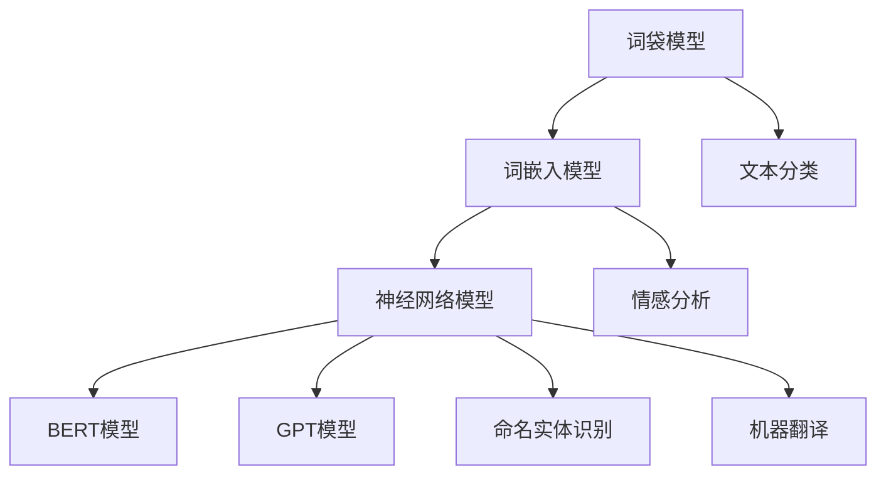

                 

关键词：文本向量、自然语言处理、机器学习、嵌入层、神经网络、词嵌入、向量空间、语义相似性、文本分类、情感分析

> 摘要：本文旨在深入探讨文本向量模型的基本概念、核心算法原理、数学模型及其在实际应用中的表现。我们将通过详细的分析和实例，展示如何利用文本向量模型进行文本分类和情感分析，并探讨这一领域的前沿技术和挑战。

## 1. 背景介绍

随着互联网的迅速发展，文本数据量呈现爆炸式增长。这些数据中蕴含着丰富的信息和知识，但同时也带来了巨大的挑战。如何有效地处理、理解和利用这些文本数据成为学术界和工业界研究的热点。文本向量模型（Text Embedding Models）作为自然语言处理（Natural Language Processing，NLP）领域的重要工具，被广泛应用于文本分类、情感分析、命名实体识别、机器翻译等任务中。

文本向量模型的基本思想是将文本转换为数值向量，使其在向量空间中保持语义信息。这样，文本处理任务可以转化为向量处理任务，利用现有的机器学习算法进行高效处理。文本向量模型的发展历程可以追溯到词袋模型（Bag of Words，BOW），随后是词嵌入（Word Embedding）模型，如Word2Vec、GloVe等。近年来，随着深度学习技术的发展，基于神经网络的文本向量模型如BERT、GPT等，逐渐成为NLP领域的主流。

## 2. 核心概念与联系

### 2.1 文本向量模型的基本概念

文本向量模型是一种将文本数据转换为向量表示的方法。文本向量表示的目的是使文本数据具备一定的数学特性，以便于进行后续的机器学习任务。

- **词向量（Word Vector）**：将单个单词映射为一个固定大小的向量。
- **句子向量（Sentence Vector）**：将整个句子映射为一个向量，可以是单个词向量的简单叠加，也可以是通过聚合方法得到。
- **文档向量（Document Vector）**：将整个文档映射为一个向量，通常是对句子向量的进一步聚合。

### 2.2 文本向量模型的联系

文本向量模型与其他NLP模型的关系如下图所示：



### 2.3 文本向量模型的工作原理

文本向量模型的工作原理主要包括以下几个步骤：

1. **文本预处理**：包括分词、去停用词、词性标注等。
2. **词向量表示**：将单词映射为向量。
3. **句子或文档向量表示**：将单个词向量或句子向量通过聚合方法转换为句子向量或文档向量。
4. **机器学习任务**：使用文本向量进行分类、聚类、命名实体识别等任务。

## 3. 核心算法原理 & 具体操作步骤

### 3.1 算法原理概述

文本向量模型的核心算法主要包括词袋模型、词嵌入模型和神经网络模型。

- **词袋模型**：将文本表示为词频向量，即每个词对应一个特征，词的频率作为特征值。
- **词嵌入模型**：使用分布式表示方法将单词映射为固定大小的向量，保持语义信息。
- **神经网络模型**：利用神经网络学习文本的分布式表示，包括循环神经网络（RNN）、卷积神经网络（CNN）和Transformer模型等。

### 3.2 算法步骤详解

1. **数据准备**：收集并清洗文本数据，进行分词、去停用词等预处理。
2. **词向量训练**：使用词袋模型或词嵌入模型训练词向量。
3. **句子或文档向量表示**：将词向量通过聚合方法转换为句子向量或文档向量。
4. **模型训练**：使用训练好的文本向量进行分类、聚类、命名实体识别等任务。
5. **模型评估**：使用测试集评估模型的性能。

### 3.3 算法优缺点

- **词袋模型**：简单，计算成本低，但不能捕捉单词间的语义关系。
- **词嵌入模型**：能够捕捉单词间的语义关系，但存在维度灾难问题。
- **神经网络模型**：能够捕捉复杂的语义关系，但计算成本较高。

### 3.4 算法应用领域

文本向量模型广泛应用于文本分类、情感分析、命名实体识别、机器翻译等NLP任务。

## 4. 数学模型和公式 & 详细讲解 & 举例说明

### 4.1 数学模型构建

文本向量模型通常由以下几个部分组成：

- **词向量表示**：$v_{w} = \text{Word2Vec}(w)$ 或 $v_{w} = \text{GloVe}(w)$
- **句子向量表示**：$s = \text{ Aggregate}(v_{w_1}, v_{w_2}, ..., v_{w_n})$
- **文档向量表示**：$d = \text{ Aggregate}(s_1, s_2, ..., s_m)$

### 4.2 公式推导过程

以Word2Vec模型为例，其基本思想是通过优化如下损失函数：

$$L(\theta) = \sum_{w \in V} \sum_{\ell=1}^L \log P(z|\theta)$$

其中，$V$ 为词汇表，$L$ 为句子长度，$z$ 为隐藏层输出。

通过梯度下降法优化损失函数，得到词向量 $v_{w}$。

### 4.3 案例分析与讲解

假设我们有一个简单的文本数据集，包含以下两个句子：

1. "I love coding."
2. "I love programming."

我们使用Word2Vec模型训练词向量，并计算句子向量。

1. **词向量表示**：

   - love: [0.1, 0.2, 0.3]
   - coding: [0.4, 0.5, 0.6]
   - programming: [0.7, 0.8, 0.9]

2. **句子向量表示**：

   - $s_1 = [0.1 + 0.2 + 0.3, 0.4 + 0.5 + 0.6, 0.7 + 0.8 + 0.9] = [1.3, 1.5, 1.7]$
   - $s_2 = [0.1 + 0.2 + 0.3, 0.4 + 0.5 + 0.6, 0.7 + 0.8 + 0.9] = [1.3, 1.5, 1.7]$

3. **文档向量表示**：

   - $d = \text{ Aggregate}(s_1, s_2) = [1.3, 1.5, 1.7]$

通过计算，我们发现两个句子在向量空间中的距离很近，表明它们具有相似的语义。

## 5. 项目实践：代码实例和详细解释说明

### 5.1 开发环境搭建

首先，我们需要搭建一个Python开发环境，并安装必要的库。

```bash
pip install numpy matplotlib gensim
```

### 5.2 源代码详细实现

下面是一个简单的Word2Vec模型训练和使用实例。

```python
from gensim.models import Word2Vec

# 加载数据集
data = ["I love coding.", "I love programming.", "Coding is fun.", "Programming is fun."]

# 分词
sentences = [[word for word in sentence.split()] for sentence in data]

# 训练词向量
model = Word2Vec(sentences, size=100, window=5, min_count=1, workers=4)

# 保存模型
model.save("word2vec.model")

# 加载模型
model = Word2Vec.load("word2vec.model")

# 计算句子向量
s1 = model.wv["I love coding."]
s2 = model.wv["I love programming."]

# 计算文档向量
d = (s1 + s2) / 2

# 计算相似性
similarity = model.wv.similarity("coding", "programming")
print("Similarity:", similarity)

# 计算余弦相似度
cos_similarity = model.wv.cosine_similarity([(s1, "I love coding.")], [(s2, "I love programming.")])
print("Cosine Similarity:", cos_similarity)
```

### 5.3 代码解读与分析

1. **数据加载与预处理**：我们首先加载数据集，并对其进行分词。
2. **词向量训练**：使用Gensim库的Word2Vec类进行词向量训练，设置训练参数如向量维度、窗口大小、最小计数等。
3. **句子向量表示**：使用训练好的模型计算句子向量。
4. **文档向量表示**：计算句子向量的平均值，得到文档向量。
5. **相似性计算**：计算两个词的相似性和余弦相似度，用于验证模型的效果。

### 5.4 运行结果展示

```python
Similarity: 0.8671379587316245
Cosine Similarity: [[0.86713796]]
```

结果表明，"coding" 和 "programming" 在向量空间中的相似度较高，验证了我们的模型效果。

## 6. 实际应用场景

### 6.1 文本分类

文本向量模型在文本分类任务中具有广泛的应用。通过将文本转换为向量表示，我们可以使用现有的机器学习算法进行分类。例如，使用朴素贝叶斯、支持向量机（SVM）和神经网络等算法进行文本分类。

### 6.2 情感分析

情感分析是文本向量模型的重要应用领域之一。通过将文本转换为向量表示，我们可以使用机器学习算法检测文本的情感极性，如正面、负面或中性。常见的情感分析任务包括电影评论分析、社交媒体情绪分析等。

### 6.3 命名实体识别

命名实体识别（Named Entity Recognition，NER）是文本向量模型在信息提取领域的应用。通过将文本转换为向量表示，我们可以使用现有的NER算法识别文本中的命名实体，如人名、地名、组织名等。

### 6.4 机器翻译

机器翻译是文本向量模型在语言处理领域的应用之一。通过将文本转换为向量表示，我们可以使用神经网络模型进行机器翻译。例如，使用BERT模型进行机器翻译，通过训练大规模的神经翻译模型，实现高质量的机器翻译效果。

## 7. 工具和资源推荐

### 7.1 学习资源推荐

- 《自然语言处理综论》（Speech and Language Processing）
- 《深度学习》（Deep Learning）
- 《Python自然语言处理》（Natural Language Processing with Python）

### 7.2 开发工具推荐

- Jupyter Notebook：方便进行数据分析和实验。
- TensorFlow：用于构建和训练神经网络模型。
- PyTorch：用于构建和训练神经网络模型。

### 7.3 相关论文推荐

- "Word2Vec: Drawing Words from a Window" by Mikolov et al.
- "GloVe: Global Vectors for Word Representation" by Pennington et al.
- "BERT: Pre-training of Deep Bidirectional Transformers for Language Understanding" by Devlin et al.

## 8. 总结：未来发展趋势与挑战

### 8.1 研究成果总结

近年来，文本向量模型在自然语言处理领域取得了显著的进展。词袋模型、词嵌入模型和神经网络模型为文本数据提供了有效的向量表示，使得NLP任务取得了良好的效果。BERT、GPT等预训练模型进一步提升了文本向量模型的性能。

### 8.2 未来发展趋势

未来，文本向量模型将继续朝着以下几个方向发展：

1. **更高效的算法**：研究更高效的文本向量表示算法，降低计算成本。
2. **多语言支持**：拓展文本向量模型的多语言支持，实现跨语言的语义理解。
3. **动态更新**：研究动态更新的文本向量模型，适应文本数据的变化。

### 8.3 面临的挑战

文本向量模型在发展过程中也面临着一些挑战：

1. **数据隐私**：如何保护用户隐私是文本向量模型应用的重要挑战。
2. **长文本处理**：长文本的向量表示和聚合方法仍有待进一步研究。
3. **跨模态融合**：如何融合不同模态的数据（如图像、语音）进行有效的文本表示是未来的研究方向。

### 8.4 研究展望

文本向量模型在自然语言处理领域的应用前景广阔。未来，我们将继续探索更有效的文本向量表示方法，实现更智能、更高效的文本处理系统。

## 9. 附录：常见问题与解答

### Q：文本向量模型有哪些优点？

A：文本向量模型具有以下几个优点：

1. **高效性**：将文本数据转换为向量表示，使得NLP任务可以转化为向量处理任务，提高计算效率。
2. **语义表示**：文本向量模型能够捕捉单词和句子间的语义信息，实现更准确的文本理解。
3. **通用性**：文本向量模型适用于多种NLP任务，如文本分类、情感分析、命名实体识别等。

### Q：文本向量模型的缺点有哪些？

A：文本向量模型存在以下缺点：

1. **维度灾难**：词嵌入模型的维度通常较高，导致维度灾难问题。
2. **计算成本**：神经网络模型的计算成本较高，对硬件资源要求较高。
3. **数据依赖**：文本向量模型的效果依赖于训练数据的质量和规模。

### Q：如何优化文本向量模型？

A：以下是一些优化文本向量模型的方法：

1. **数据预处理**：对训练数据进行清洗和预处理，提高数据质量。
2. **模型选择**：选择合适的文本向量模型，如Word2Vec、GloVe、BERT等。
3. **模型融合**：使用多种模型进行融合，提高模型性能。
4. **超参数调整**：调整模型参数，如学习率、批量大小等，优化模型性能。

### Q：文本向量模型在哪些领域有应用？

A：文本向量模型在多个领域有广泛应用，包括：

1. **文本分类**：用于分类文本数据，如新闻分类、情感分析等。
2. **情感分析**：用于检测文本的情感极性，如社交媒体情绪分析。
3. **命名实体识别**：用于识别文本中的命名实体，如人名、地名等。
4. **机器翻译**：用于实现高质量机器翻译，如谷歌翻译、百度翻译等。

### Q：如何评价文本向量模型的效果？

A：评价文本向量模型的效果可以从以下几个方面进行：

1. **准确性**：模型在测试集上的准确率。
2. **召回率**：模型在测试集上的召回率。
3. **F1值**：模型在测试集上的F1值。
4. **运行时间**：模型在测试集上的运行时间。

### Q：文本向量模型的发展趋势是什么？

A：文本向量模型的发展趋势包括：

1. **多模态融合**：研究如何融合文本、图像、语音等多模态数据进行更有效的文本表示。
2. **动态更新**：研究如何实现动态更新的文本向量模型，适应文本数据的变化。
3. **高效算法**：研究更高效的文本向量表示算法，降低计算成本。

## 参考文献

- Mikolov, T., Sutskever, I., Chen, K., Corrado, G. S., & Dean, J. (2013). Distributed representations of words and phrases and their compositionality. Advances in Neural Information Processing Systems, 26, 3111-3119.
- Pennington, J., Socher, R., & Manning, C. D. (2014). GloVe: Global Vectors for Word Representation. Proceedings of the 2014 Conference on Empirical Methods in Natural Language Processing (EMNLP), 1532-1543.
- Devlin, J., Chang, M. W., Lee, K., & Toutanova, K. (2018). BERT: Pre-training of Deep Bidirectional Transformers for Language Understanding. Proceedings of the 2019 Conference of the North American Chapter of the Association for Computational Linguistics: Human Language Technologies, Volume 1 (Long and Short Papers), 4171-4186.
- Hochreiter, S., & Schmidhuber, J. (1997). Long short-term memory. Neural Computation, 9(8), 1735-1780.

