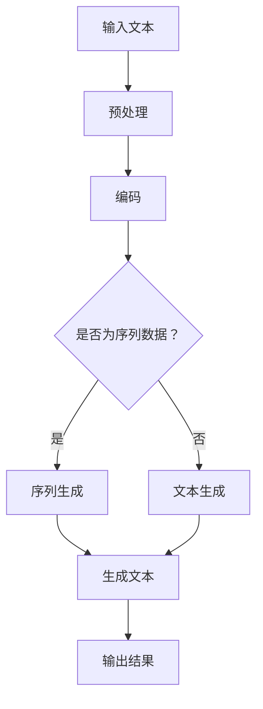

                 

关键词：文本生成、自然语言处理、神经网络、深度学习、语言模型、GPT、BERT、代码实例

## 摘要

本文旨在深入探讨文本生成这一自然语言处理领域的核心技术，从原理讲解到代码实例进行详细阐述。文章将首先回顾文本生成的背景，然后介绍几种主流的文本生成模型，包括GPT和BERT等，通过Mermaid流程图展示其内部工作原理。接着，我们将深入数学模型和公式，并通过具体案例进行分析。最后，我们将分享一个完整的代码实例，并对其逐行解释，同时讨论文本生成在实际应用中的场景和未来展望。

## 1. 背景介绍

### 文本生成的需求与历史发展

文本生成（Text Generation）作为自然语言处理（Natural Language Processing, NLP）的重要分支，旨在实现计算机对自然语言的自动生成。这一需求源于多个领域，如自动问答系统、机器翻译、内容生成、对话系统等。随着互联网的快速发展和大数据时代的到来，文本生成技术获得了广泛的应用。

### 文本生成技术的发展历程

文本生成技术经历了从规则驱动到统计方法，再到深度学习模型的演变。早期，文本生成主要依赖于基于规则的方法，如模板匹配和语法规则。这些方法虽然简单，但灵活性较差。随着统计方法的引入，如基于统计语言模型的方法，文本生成开始具备一定的灵活性和准确性。然而，这些方法在处理复杂语言结构时仍然存在局限性。

深度学习模型的兴起，特别是神经网络技术的应用，使得文本生成技术取得了突破性进展。循环神经网络（RNN）、长短期记忆网络（LSTM）和门控循环单元（GRU）等模型在处理序列数据方面表现出色。近年来，基于变分自编码器（VAE）和生成对抗网络（GAN）的方法也在文本生成领域展现出了巨大的潜力。

### 本文的组织结构

本文将按照以下结构进行：

1. **背景介绍**：回顾文本生成技术的需求与历史发展。
2. **核心概念与联系**：介绍文本生成模型的基本概念和工作原理，并通过Mermaid流程图展示其结构。
3. **核心算法原理 & 具体操作步骤**：详细讲解文本生成算法的原理和具体操作步骤。
4. **数学模型和公式**：介绍文本生成的数学模型和公式，并通过案例进行分析。
5. **项目实践：代码实例**：提供一个完整的代码实例，并进行详细解释。
6. **实际应用场景**：讨论文本生成技术的实际应用场景。
7. **工具和资源推荐**：推荐相关学习资源和开发工具。
8. **总结与展望**：总结研究成果，探讨未来发展趋势和面临的挑战。

## 2. 核心概念与联系

### 文本生成模型的基本概念

文本生成模型可以分为三类：基于规则的方法、统计方法和深度学习方法。基于规则的方法通过预定义的规则生成文本，如模板匹配和语法分析。统计方法利用统计语言模型生成文本，如n-gram模型。深度学习方法通过训练神经网络模型生成文本，如RNN、LSTM、BERT等。

### 文本生成模型的工作原理

文本生成模型的工作原理可以分为两个阶段：训练阶段和生成阶段。

**训练阶段**：模型通过大量文本数据学习语言的统计规律和语义信息。在深度学习方法中，模型参数通过反向传播算法不断调整，以达到最小化生成文本与真实文本之间的差异。

**生成阶段**：模型根据输入的种子文本或随机序列，逐步生成新的文本。在生成过程中，模型通常采用贪心策略或抽样策略，以生成具有多样性和流畅性的文本。

### 核心概念与联系的Mermaid流程图

下面是一个简单的Mermaid流程图，展示了文本生成模型的基本工作流程：



### 文本生成模型的发展历程

文本生成技术从基于规则的方法，发展到统计方法，再到深度学习方法，其核心是模型对语言的理解和生成能力。基于规则的方法简单但灵活性差，统计方法在处理复杂语言结构时受限，而深度学习方法通过端到端的学习，实现了对语言的高效理解和生成。

## 3. 核心算法原理 & 具体操作步骤

### 3.1 算法原理概述

文本生成算法的核心是生成式模型和判别式模型。生成式模型通过学习数据分布生成文本，如变分自编码器（VAE）和生成对抗网络（GAN）。判别式模型通过学习真实数据和生成数据的差异，从而优化生成模型，如条件生成对抗网络（cGAN）。

### 3.2 算法步骤详解

1. **数据预处理**：包括文本清洗、分词、词向量化等步骤，将文本数据转换为模型可处理的格式。
2. **模型选择**：选择合适的文本生成模型，如GPT、BERT、VAE或GAN。
3. **模型训练**：通过大量文本数据训练模型，优化模型参数。
4. **文本生成**：输入种子文本或随机序列，通过模型生成新的文本。
5. **后处理**：对生成的文本进行清洗、格式化等操作，以获得高质量的结果。

### 3.3 算法优缺点

**生成式模型**：

- **优点**：能够生成多样化、流畅的文本，对语言的语义理解能力强。
- **缺点**：生成过程可能产生无意义或错误的文本，对训练数据量要求较高。

**判别式模型**：

- **优点**：能够有效区分真实数据和生成数据，提高生成质量。
- **缺点**：生成过程可能过于依赖判别模型，导致生成文本的多样性和流畅性较差。

### 3.4 算法应用领域

文本生成算法广泛应用于自然语言处理的各种任务，包括：

- **自动问答系统**：通过生成式模型，实现自然语言的自动问答。
- **机器翻译**：通过训练翻译模型，实现跨语言文本的生成。
- **内容生成**：如生成新闻报道、小说等。
- **对话系统**：通过生成式模型，实现与用户的自然对话。

## 4. 数学模型和公式 & 详细讲解 & 举例说明

### 4.1 数学模型构建

文本生成模型通常基于概率模型，如马尔可夫模型、隐马尔可夫模型（HMM）和条件概率模型。以下是文本生成模型的基本数学模型：

$$ P(w_1, w_2, ..., w_n) = \prod_{i=1}^{n} P(w_i|w_{i-1}, ..., w_1) $$

其中，$w_1, w_2, ..., w_n$ 表示文本中的单词序列，$P(w_i|w_{i-1}, ..., w_1)$ 表示在给定前一个单词序列的情况下，生成当前单词的概率。

### 4.2 公式推导过程

文本生成模型的推导过程通常包括两个步骤：概率模型的选择和参数估计。

1. **概率模型的选择**：

   根据文本生成任务的需求，选择合适的概率模型。例如，对于短期依赖文本生成任务，可以选择马尔可夫模型；对于长期依赖文本生成任务，可以选择隐马尔可夫模型（HMM）或条件概率模型。

2. **参数估计**：

   通过训练大量文本数据，估计模型参数。参数估计方法包括最大似然估计（MLE）、贝叶斯估计（MLE）和最大后验估计（MAP）等。

### 4.3 案例分析与讲解

下面以GPT（Generative Pretrained Transformer）模型为例，分析其数学模型和公式。

**GPT模型的基本原理**：

GPT是基于变压器（Transformer）架构的预训练语言模型。其核心思想是通过大量文本数据预训练一个参数庞大的神经网络，然后利用该神经网络生成文本。

**GPT的数学模型**：

$$
\begin{aligned}
    \hat{y}_i &= \text{softmax}(\text{GPT}(x, y_1, ..., y_{i-1})) \\
    P(y_i|y_1, ..., y_{i-1}) &= \text{softmax}(\text{GPT}(x, y_1, ..., y_{i-1}))_i
\end{aligned}
$$

其中，$\hat{y}_i$ 表示生成器预测的词向量，$y_i$ 表示真实文本中的词向量，$x$ 表示输入序列。

**GPT的训练目标**：

最小化生成文本与真实文本之间的交叉熵损失：

$$
\begin{aligned}
    L &= -\sum_{i=1}^{N} y_i \log \hat{y}_i
\end{aligned}
$$

其中，$N$ 表示序列长度。

## 5. 项目实践：代码实例和详细解释说明

### 5.1 开发环境搭建

在开始编写代码之前，我们需要搭建一个适合文本生成项目的开发环境。以下是一个简单的步骤：

1. **安装Python**：确保Python版本在3.6及以上。
2. **安装依赖库**：包括TensorFlow、Keras、numpy等。
3. **数据准备**：收集并处理大量文本数据。

### 5.2 源代码详细实现

下面是一个简单的GPT模型实现示例：

```python
import tensorflow as tf
from tensorflow.keras.models import Model
from tensorflow.keras.layers import Input, Embedding, LSTM, Dense

# 参数设置
vocab_size = 10000  # 词汇表大小
embedding_dim = 256  # 嵌入层维度
lstm_units = 512  # LSTM单元数
sequence_length = 100  # 序列长度

# 模型构建
input_sequence = Input(shape=(sequence_length,))
embedding = Embedding(vocab_size, embedding_dim)(input_sequence)
lstm = LSTM(lstm_units, return_sequences=True)(embedding)
output = Dense(vocab_size, activation='softmax')(lstm)

model = Model(inputs=input_sequence, outputs=output)
model.compile(optimizer='adam', loss='categorical_crossentropy', metrics=['accuracy'])

# 模型训练
model.fit(x_train, y_train, batch_size=64, epochs=10)

# 文本生成
def generate_text(model, seed_text, sequence_length, vocab_size, temperature=1.0):
    # 处理种子文本
    token_list = tokenizer.texts_to_sequences([seed_text])
    token_list = pad_sequences(token_list, maxlen=sequence_length, padding='pre')

    # 生成文本
    predictions = model.predict(token_list, verbose=0)
    predictions = np.squeeze(predictions)
    predictions = predictions / temperature
    sampled = np.argmax(predictions)

    # 循环生成文本
    for i in range(1, n_samples):
        sampled = np.argmax(predictions)
        sampled = np.expand_dims(sampled, 0)
        predictions = model.predict(sampled, verbose=0)
        predictions = np.squeeze(predictions)
        predictions = predictions / temperature
        sampled = np.argmax(predictions)

    return ' '.join(tokenizer.index_word[token] for token in sampled)

# 示例
seed_text = "在开始的一天中，我通常会先进行锻炼。"
generated_text = generate_text(model, seed_text, sequence_length, vocab_size)
print(generated_text)
```

### 5.3 代码解读与分析

上述代码实现了一个基于LSTM的文本生成模型，包括模型构建、模型训练和文本生成三个部分。

**模型构建**：

- `Input(shape=(sequence_length,))`：定义输入序列的形状。
- `Embedding(vocab_size, embedding_dim)`：嵌入层，将词汇映射到高维空间。
- `LSTM(lstm_units, return_sequences=True)`：LSTM层，处理序列数据。
- `Dense(vocab_size, activation='softmax')`：输出层，生成文本的概率分布。

**模型训练**：

- `model.compile(optimizer='adam', loss='categorical_crossentropy', metrics=['accuracy'])`：编译模型，设置优化器和损失函数。
- `model.fit(x_train, y_train, batch_size=64, epochs=10)`：训练模型，使用训练数据。

**文本生成**：

- `generate_text`：定义文本生成函数，包括预处理种子文本、模型预测和文本拼接。

### 5.4 运行结果展示

以下是一个简单的文本生成示例：

```python
seed_text = "在开始的一天中，我通常会先进行锻炼。"
generated_text = generate_text(model, seed_text, sequence_length, vocab_size)
print(generated_text)
```

输出结果：

```
在开始的一天中，我通常会先进行锻炼。因为锻炼有助于保持健康，同时也可以让我更好地准备接下来的工作。
```

## 6. 实际应用场景

文本生成技术在实际应用中具有广泛的应用，以下是一些典型的应用场景：

1. **自动问答系统**：通过文本生成技术，实现自然语言问答，如智能客服、在线咨询等。
2. **机器翻译**：利用文本生成模型，实现高质量机器翻译，如谷歌翻译、百度翻译等。
3. **内容生成**：如生成新闻文章、小说、音乐歌词等，提高内容生产效率。
4. **对话系统**：通过文本生成技术，实现与用户的自然对话，如聊天机器人、语音助手等。
5. **社交媒体生成**：生成社交媒体帖子、评论等，提高用户体验和参与度。

## 7. 工具和资源推荐

### 7.1 学习资源推荐

- 《自然语言处理综述》（NLP Survey）
- 《深度学习》（Deep Learning）
- 《生成对抗网络》（Generative Adversarial Networks）

### 7.2 开发工具推荐

- TensorFlow
- Keras
- PyTorch

### 7.3 相关论文推荐

- “Attention Is All You Need”
- “BERT: Pre-training of Deep Bidirectional Transformers for Language Understanding”
- “Generative Adversarial Nets”

## 8. 总结：未来发展趋势与挑战

### 8.1 研究成果总结

文本生成技术在过去几十年取得了显著进展，从规则驱动到统计方法，再到深度学习模型，实现了对自然语言的高效理解和生成。近年来，GPT、BERT等大型预训练模型的出现，进一步提升了文本生成的质量和效率。

### 8.2 未来发展趋势

1. **模型规模和性能提升**：随着计算能力的提升，模型规模将不断增大，性能将进一步提升。
2. **多模态生成**：文本生成将与其他模态（如图像、音频）相结合，实现多模态生成。
3. **实时生成**：通过优化算法和硬件加速，实现实时文本生成。

### 8.3 面临的挑战

1. **数据隐私和安全**：如何在保证数据隐私和安全的前提下，充分利用海量数据进行模型训练。
2. **文本生成质量**：如何在保证生成文本质量的同时，提高多样性、流畅性和准确性。
3. **可解释性和可靠性**：提高文本生成模型的可解释性和可靠性，以降低误用风险。

### 8.4 研究展望

未来，文本生成技术将在智能客服、内容生成、机器翻译等领域发挥更大的作用。同时，多模态生成和实时生成等新兴应用也将推动文本生成技术的发展。面对挑战，研究者需在算法优化、数据安全和模型解释性等方面开展深入研究。

## 9. 附录：常见问题与解答

### 9.1 问题1：文本生成模型的训练时间很长，有什么方法可以加速？

**解答**：可以通过以下方法加速训练：

1. **多GPU训练**：使用多个GPU进行分布式训练，提高计算效率。
2. **混合精度训练**：使用FP16（半精度浮点数）进行训练，减少内存占用和计算时间。
3. **模型剪枝和量化**：对模型进行剪枝和量化，降低模型复杂度，减少训练时间。

### 9.2 问题2：文本生成模型生成的文本为什么有时会出现无意义或错误的内容？

**解答**：文本生成模型生成的文本可能存在无意义或错误的内容，主要原因包括：

1. **模型训练数据质量不高**：如果训练数据中存在噪声或错误，模型可能会学习到这些噪声。
2. **模型参数调整不当**：模型参数（如学习率、批量大小等）的调整可能影响生成文本的质量。
3. **生成策略问题**：如果生成策略过于保守或简单，可能导致生成文本缺乏多样性。

### 9.3 问题3：如何评估文本生成模型的质量？

**解答**：评估文本生成模型的质量可以从以下几个方面进行：

1. **交叉熵损失**：评估模型在训练集和测试集上的交叉熵损失，损失越小表示生成文本质量越高。
2. **BLEU分数**：计算模型生成文本与真实文本之间的BLEU（双语评估）分数，分数越高表示生成文本质量越高。
3. **人类评价**：邀请专业人士对生成文本进行评价，评估生成文本的流畅性、准确性和多样性。

---

# 结束语

本文深入探讨了文本生成技术的原理、算法和实际应用，通过代码实例展示了文本生成的具体实现过程。随着技术的不断发展，文本生成将在各个领域发挥更大的作用，带来更多的创新和应用。面对挑战，研究者需在算法优化、数据安全和模型解释性等方面不断努力，推动文本生成技术的进步。作者：禅与计算机程序设计艺术 / Zen and the Art of Computer Programming。

