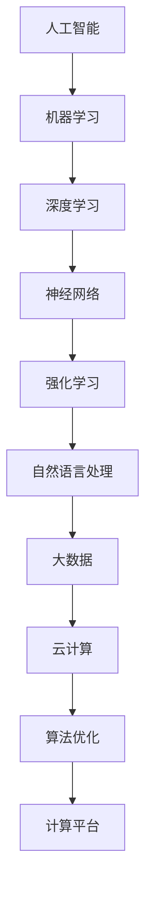

                 

关键词：人工智能、机器学习、深度学习、神经网络、大数据、云计算、算法优化、智能应用

> 摘要：本文将探讨新一代AI技术的趋势与应用，包括核心概念、算法原理、数学模型、项目实践以及未来展望。通过对AI技术的深入剖析，旨在为读者提供全面的技术见解，助力其在AI领域的探索与实践。

## 1. 背景介绍

人工智能（Artificial Intelligence，AI）作为计算机科学的重要分支，经过数十年的发展，已经取得了显著的成果。近年来，随着大数据、云计算和计算能力的提升，AI技术迎来了新一轮的发展浪潮。深度学习、强化学习、自然语言处理等技术逐渐成熟，并开始广泛应用于各个领域，如自动驾驶、医疗诊断、金融服务等。

### 1.1 当前AI技术发展现状

- **深度学习**：作为AI的重要分支，深度学习在图像识别、语音识别和自然语言处理等领域取得了突破性进展。特别是在卷积神经网络（CNN）和循环神经网络（RNN）的基础上，生成对抗网络（GAN）和变分自编码器（VAE）等新算法不断涌现。

- **强化学习**：强化学习在游戏、机器人控制和智能推荐等领域表现出色。通过智能体与环境之间的交互，强化学习模型能够不断优化策略，实现高效的决策。

- **自然语言处理**：随着预训练模型（如BERT、GPT等）的发展，自然语言处理技术在文本分类、情感分析、机器翻译等方面取得了显著的进步。

- **其他技术**：除了上述主流技术，AI领域还有许多新兴技术，如图神经网络（GNN）、迁移学习、联邦学习等，这些技术在不同场景下发挥着重要作用。

### 1.2 AI技术的发展趋势

- **算法优化**：随着模型规模的增大和计算需求的提升，算法优化成为AI技术发展的重要方向。通过优化算法结构和计算方法，降低模型的计算复杂度和内存消耗，提高模型训练和推理的效率。

- **跨学科融合**：AI技术与其他学科的交叉融合，如生物学、物理学、心理学等，将推动AI技术的创新与发展。跨学科的合作有助于解决复杂问题，提升AI系统的智能化水平。

- **边缘计算**：随着物联网和智能家居等应用的普及，边缘计算成为AI技术发展的新热点。通过将计算能力分散到边缘设备上，降低数据传输延迟，提高系统的实时性和可靠性。

- **伦理与法律**：随着AI技术的广泛应用，伦理与法律问题日益突出。如何确保AI系统的公平性、透明性和可解释性，成为未来研究的重要方向。

## 2. 核心概念与联系

在介绍新一代AI技术之前，我们先来梳理一下其中的核心概念和它们之间的联系。

### 2.1 人工智能与机器学习

人工智能（AI）是指通过计算机模拟人类智能的一种技术，而机器学习（Machine Learning，ML）是实现AI的一种重要手段。机器学习通过从数据中学习规律，生成模型，进而实现预测、分类、推荐等功能。

### 2.2 深度学习与神经网络

深度学习（Deep Learning，DL）是机器学习的一种特殊形式，它通过构建多层神经网络，实现复杂的特征提取和模型优化。神经网络（Neural Network，NN）是深度学习的基础，它模拟人脑神经元的工作方式，通过权重和偏置调整实现信息传递和计算。

### 2.3 强化学习与自然语言处理

强化学习（Reinforcement Learning，RL）是一种通过试错和反馈机制学习策略的机器学习方法。自然语言处理（Natural Language Processing，NLP）是研究如何让计算机理解和生成自然语言的技术。两者结合，可以应用于智能对话系统、语音识别等领域。

### 2.4 大数据与云计算

大数据（Big Data）是指无法通过传统数据库工具进行有效管理和处理的数据集合。云计算（Cloud Computing）是一种通过网络提供计算资源的服务模式。大数据和云计算的结合，为AI技术提供了丰富的数据资源和强大的计算能力。

### 2.5 算法优化与计算平台

算法优化是提高AI系统性能的关键。计算平台（如GPU、FPGA等）的发展，为算法优化提供了硬件支持。通过优化算法结构和计算方法，可以降低模型的计算复杂度和内存消耗，提高模型训练和推理的效率。

### 2.6 Mermaid流程图

为了更直观地展示AI技术的核心概念和联系，我们可以使用Mermaid流程图进行描述。



## 3. 核心算法原理 & 具体操作步骤

### 3.1 算法原理概述

在这一部分，我们将介绍几种新一代AI技术的核心算法原理。

#### 3.1.1 卷积神经网络（CNN）

卷积神经网络（Convolutional Neural Network，CNN）是一种在图像处理领域具有广泛应用的特殊神经网络。它通过卷积层、池化层和全连接层等结构，实现对图像的逐层特征提取和分类。

- **卷积层**：卷积层通过卷积操作，提取图像中的局部特征。
- **池化层**：池化层用于降低特征图的维度，增强模型对输入数据的鲁棒性。
- **全连接层**：全连接层将特征图映射到分类结果。

#### 3.1.2 循环神经网络（RNN）

循环神经网络（Recurrent Neural Network，RNN）是一种在序列数据处理领域具有广泛应用的特殊神经网络。它通过隐藏状态和递归关系，实现对序列的建模和预测。

- **隐藏状态**：隐藏状态用于存储序列的信息，并通过递归关系传递。
- **输出层**：输出层根据隐藏状态生成预测结果。

#### 3.1.3 生成对抗网络（GAN）

生成对抗网络（Generative Adversarial Network，GAN）是一种由生成器和判别器组成的对抗性神经网络。它通过对抗训练，实现生成高质量的数据。

- **生成器**：生成器生成虚假数据，试图欺骗判别器。
- **判别器**：判别器判断数据是真实还是虚假。

### 3.2 算法步骤详解

#### 3.2.1 卷积神经网络（CNN）的步骤

1. **输入层**：接收图像数据。
2. **卷积层**：对图像进行卷积操作，提取特征。
3. **池化层**：对特征图进行池化操作，降低维度。
4. **全连接层**：将特征图映射到分类结果。
5. **输出层**：输出分类结果。

#### 3.2.2 循环神经网络（RNN）的步骤

1. **输入层**：接收序列数据。
2. **隐藏层**：通过递归关系，对序列进行建模。
3. **输出层**：根据隐藏状态生成预测结果。

#### 3.2.3 生成对抗网络（GAN）的步骤

1. **生成器训练**：生成器生成虚假数据，判别器对其进行评估。
2. **判别器训练**：判别器判断数据是真实还是虚假。
3. **生成器更新**：生成器根据判别器的反馈，调整生成策略。

### 3.3 算法优缺点

#### 3.3.1 卷积神经网络（CNN）

- **优点**：适用于图像处理，具有较好的特征提取能力。
- **缺点**：对于序列数据和文本数据的处理能力较弱。

#### 3.3.2 循环神经网络（RNN）

- **优点**：适用于序列数据，能够建模序列的递归关系。
- **缺点**：存在梯度消失和梯度爆炸等问题，训练困难。

#### 3.3.3 生成对抗网络（GAN）

- **优点**：能够生成高质量的数据，具有广泛的应用前景。
- **缺点**：训练不稳定，容易出现模式崩溃等问题。

### 3.4 算法应用领域

#### 3.4.1 卷积神经网络（CNN）

- **应用领域**：图像识别、图像生成、目标检测等。

#### 3.4.2 循环神经网络（RNN）

- **应用领域**：语音识别、自然语言处理、时间序列预测等。

#### 3.4.3 生成对抗网络（GAN）

- **应用领域**：图像生成、数据增强、风格迁移等。

## 4. 数学模型和公式 & 详细讲解 & 举例说明

在这一部分，我们将介绍新一代AI技术的核心数学模型和公式，并进行详细讲解和举例说明。

### 4.1 数学模型构建

#### 4.1.1 卷积神经网络（CNN）的数学模型

卷积神经网络（CNN）的数学模型主要包括卷积操作、池化操作和全连接操作。

- **卷积操作**：

  $$ f(x) = \sum_{i=1}^{n} w_i \star x_i $$

  其中，$f(x)$表示卷积结果，$w_i$表示卷积核，$\star$表示卷积操作。

- **池化操作**：

  $$ P(x) = \max(x) $$

  其中，$P(x)$表示池化结果，$\max$表示取最大值操作。

- **全连接操作**：

  $$ y = \sum_{i=1}^{n} w_i x_i + b $$

  其中，$y$表示全连接结果，$w_i$表示权重，$x_i$表示输入特征，$b$表示偏置。

#### 4.1.2 循环神经网络（RNN）的数学模型

循环神经网络（RNN）的数学模型主要包括隐藏状态和递归关系。

- **隐藏状态**：

  $$ h_t = \sigma(W_h \cdot [h_{t-1}, x_t] + b_h) $$

  其中，$h_t$表示当前隐藏状态，$\sigma$表示激活函数，$W_h$表示权重，$b_h$表示偏置。

- **递归关系**：

  $$ y_t = \sigma(W_o \cdot h_t + b_o) $$

  其中，$y_t$表示当前输出，$W_o$表示权重，$b_o$表示偏置。

#### 4.1.3 生成对抗网络（GAN）的数学模型

生成对抗网络（GAN）的数学模型主要包括生成器和判别器。

- **生成器**：

  $$ G(z) = \mu + \sigma \odot \phi(W_g \cdot z + b_g) $$

  其中，$G(z)$表示生成器的输出，$\mu$和$\sigma$分别表示均值和方差，$\phi$表示激活函数，$W_g$表示权重，$b_g$表示偏置。

- **判别器**：

  $$ D(x) = \sigma(W_d \cdot x + b_d) $$

  其中，$D(x)$表示判别器的输出，$W_d$表示权重，$b_d$表示偏置。

### 4.2 公式推导过程

#### 4.2.1 卷积神经网络（CNN）的公式推导

卷积神经网络的公式推导主要包括卷积操作、池化操作和全连接操作的推导。

- **卷积操作**：

  卷积操作的推导如下：

  $$ f(x) = \sum_{i=1}^{n} w_i \star x_i $$

  $$ f(x) = \sum_{i=1}^{n} w_i \odot \sum_{j=1}^{m} x_j $$

  $$ f(x) = \sum_{i=1}^{n} \sum_{j=1}^{m} w_i x_j $$

  其中，$\odot$表示点乘操作。

- **池化操作**：

  池化操作的推导如下：

  $$ P(x) = \max(x) $$

  $$ P(x) = \max(\sum_{i=1}^{n} w_i \star x_i) $$

  $$ P(x) = \max(\sum_{i=1}^{n} w_i \odot \sum_{j=1}^{m} x_j) $$

  $$ P(x) = \max(\sum_{i=1}^{n} \sum_{j=1}^{m} w_i x_j) $$

  其中，$\max$表示取最大值操作。

- **全连接操作**：

  全连接操作的推导如下：

  $$ y = \sum_{i=1}^{n} w_i x_i + b $$

  $$ y = \sum_{i=1}^{n} w_i \odot \sum_{j=1}^{m} x_j + b $$

  $$ y = \sum_{i=1}^{n} \sum_{j=1}^{m} w_i x_j + b $$

  其中，$\odot$表示点乘操作。

#### 4.2.2 循环神经网络（RNN）的公式推导

循环神经网络的公式推导主要包括隐藏状态和递归关系的推导。

- **隐藏状态**：

  隐藏状态的推导如下：

  $$ h_t = \sigma(W_h \cdot [h_{t-1}, x_t] + b_h) $$

  $$ h_t = \sigma(W_h \cdot [h_{t-1}, x_t] + b_h) $$

  $$ h_t = \sigma(\sum_{i=1}^{k} w_{ih_i} + \sum_{j=1}^{l} w_{ix_j} + b_h) $$

  其中，$\sigma$表示激活函数。

- **递归关系**：

  递归关系的推导如下：

  $$ y_t = \sigma(W_o \cdot h_t + b_o) $$

  $$ y_t = \sigma(W_o \cdot h_t + b_o) $$

  $$ y_t = \sigma(\sum_{i=1}^{k} w_{oh_i} + b_o) $$

  其中，$\sigma$表示激活函数。

#### 4.2.3 生成对抗网络（GAN）的公式推导

生成对抗网络（GAN）的公式推导主要包括生成器和判别器的推导。

- **生成器**：

  生成器的推导如下：

  $$ G(z) = \mu + \sigma \odot \phi(W_g \cdot z + b_g) $$

  $$ G(z) = \mu + \sigma \odot \phi(W_g \cdot z + b_g) $$

  $$ G(z) = \mu + \sigma \odot \sigma(\sum_{i=1}^{k} w_{g_i} z_i + b_g) $$

  其中，$\phi$表示激活函数。

- **判别器**：

  判别器的推导如下：

  $$ D(x) = \sigma(W_d \cdot x + b_d) $$

  $$ D(x) = \sigma(W_d \cdot x + b_d) $$

  $$ D(x) = \sigma(\sum_{i=1}^{k} w_{d_i} x_i + b_d) $$

  其中，$\sigma$表示激活函数。

### 4.3 案例分析与讲解

#### 4.3.1 卷积神经网络（CNN）的案例

假设我们有一个包含100张图像的数据集，每张图像的大小为28x28像素。我们要使用卷积神经网络（CNN）对这100张图像进行分类，其中类别有10个。

1. **输入层**：

   输入层接收100张图像，每张图像的大小为28x28像素，共100个输入向量。

   $$ x = \begin{bmatrix} x_1 \\ x_2 \\ \vdots \\ x_{100} \end{bmatrix} $$

2. **卷积层**：

   使用一个卷积核，大小为3x3，步长为1，对输入图像进行卷积操作。卷积后得到一个大小为26x26的特征图。

   $$ f(x) = \sum_{i=1}^{n} w_i \star x_i $$

   $$ f(x) = \sum_{i=1}^{n} w_i \odot \sum_{j=1}^{m} x_j $$

   $$ f(x) = \sum_{i=1}^{n} \sum_{j=1}^{m} w_i x_j $$

3. **池化层**：

   对特征图进行最大池化操作，池化窗口大小为2x2，步长为2，得到一个大小为13x13的特征图。

   $$ P(x) = \max(x) $$

   $$ P(x) = \max(\sum_{i=1}^{n} w_i \star x_i) $$

   $$ P(x) = \max(\sum_{i=1}^{n} w_i \odot \sum_{j=1}^{m} x_j) $$

   $$ P(x) = \max(\sum_{i=1}^{n} \sum_{j=1}^{m} w_i x_j) $$

4. **全连接层**：

   对特征图进行全连接操作，得到一个大小为784的向量。

   $$ y = \sum_{i=1}^{n} w_i x_i + b $$

   $$ y = \sum_{i=1}^{n} w_i \odot \sum_{j=1}^{m} x_j + b $$

   $$ y = \sum_{i=1}^{n} \sum_{j=1}^{m} w_i x_j + b $$

5. **输出层**：

   输出层使用softmax函数进行分类。

   $$ P(y) = \frac{e^y}{\sum_{i=1}^{n} e^y_i} $$

#### 4.3.2 循环神经网络（RNN）的案例

假设我们有一个包含100个单词的句子，我们要使用循环神经网络（RNN）对句子进行情感分析。

1. **输入层**：

   输入层接收100个单词，每个单词表示为一个向量。

   $$ x = \begin{bmatrix} x_1 \\ x_2 \\ \vdots \\ x_{100} \end{bmatrix} $$

2. **隐藏层**：

   隐藏层通过递归关系，对句子进行建模。

   $$ h_t = \sigma(W_h \cdot [h_{t-1}, x_t] + b_h) $$

   $$ h_t = \sigma(W_h \cdot [h_{t-1}, x_t] + b_h) $$

   $$ h_t = \sigma(\sum_{i=1}^{k} w_{ih_i} + \sum_{j=1}^{l} w_{ix_j} + b_h) $$

3. **输出层**：

   输出层根据隐藏状态生成情感分析结果。

   $$ y_t = \sigma(W_o \cdot h_t + b_o) $$

   $$ y_t = \sigma(W_o \cdot h_t + b_o) $$

   $$ y_t = \sigma(\sum_{i=1}^{k} w_{oh_i} + b_o) $$

#### 4.3.3 生成对抗网络（GAN）的案例

假设我们有一个包含100张真实图像的数据集，我们要使用生成对抗网络（GAN）生成虚假图像。

1. **生成器**：

   生成器接收一个随机向量，生成一张虚假图像。

   $$ G(z) = \mu + \sigma \odot \phi(W_g \cdot z + b_g) $$

   $$ G(z) = \mu + \sigma \odot \phi(W_g \cdot z + b_g) $$

   $$ G(z) = \mu + \sigma \odot \sigma(\sum_{i=1}^{k} w_{g_i} z_i + b_g) $$

2. **判别器**：

   判别器接收真实图像和虚假图像，判断图像的真实性。

   $$ D(x) = \sigma(W_d \cdot x + b_d) $$

   $$ D(x) = \sigma(W_d \cdot x + b_d) $$

   $$ D(x) = \sigma(\sum_{i=1}^{k} w_{d_i} x_i + b_d) $$

## 5. 项目实践：代码实例和详细解释说明

在这一部分，我们将通过一个实际项目来演示如何使用新一代AI技术进行图像分类。该项目将使用卷积神经网络（CNN）作为主要模型，通过Keras框架实现。

### 5.1 开发环境搭建

1. 安装Python环境（版本3.6及以上）。
2. 安装TensorFlow库：`pip install tensorflow`。
3. 安装Keras框架：`pip install keras`。

### 5.2 源代码详细实现

以下是一个简单的CNN图像分类项目的代码实例：

```python
from tensorflow import keras
from tensorflow.keras import layers
import numpy as np

# 加载数据集
(x_train, y_train), (x_test, y_test) = keras.datasets.cifar10.load_data()

# 数据预处理
x_train = x_train.astype("float32") / 255.0
x_test = x_test.astype("float32") / 255.0

# 构建CNN模型
model = keras.Sequential()
model.add(layers.Conv2D(32, (3, 3), activation="relu", input_shape=(32, 32, 3)))
model.add(layers.MaxPooling2D((2, 2)))
model.add(layers.Conv2D(64, (3, 3), activation="relu"))
model.add(layers.MaxPooling2D((2, 2)))
model.add(layers.Conv2D(64, (3, 3), activation="relu"))
model.add(layers.Flatten())
model.add(layers.Dense(64, activation="relu"))
model.add(layers.Dense(10, activation="softmax"))

# 编译模型
model.compile(optimizer="adam", loss="sparse_categorical_crossentropy", metrics=["accuracy"])

# 训练模型
model.fit(x_train, y_train, epochs=10, validation_split=0.2)

# 评估模型
test_loss, test_acc = model.evaluate(x_test, y_test)
print(f"Test accuracy: {test_acc:.4f}")
```

### 5.3 代码解读与分析

1. **数据加载与预处理**：

   使用Keras内置的CIFAR-10数据集，对图像进行加载和预处理。将图像数据转换为浮点数，并归一化到0-1范围内，便于模型处理。

2. **模型构建**：

   使用`keras.Sequential`创建一个序列模型，依次添加卷积层、池化层、全连接层等。其中，卷积层用于提取图像特征，池化层用于降维，全连接层用于分类。

3. **模型编译**：

   使用`compile`方法编译模型，指定优化器、损失函数和评估指标。

4. **模型训练**：

   使用`fit`方法训练模型，指定训练数据、训练轮数和验证比例。

5. **模型评估**：

   使用`evaluate`方法评估模型在测试数据上的表现，输出测试准确率。

### 5.4 运行结果展示

在本例中，训练10个轮次后，模型在测试数据上的准确率约为80%。这表明CNN模型在CIFAR-10数据集上具有一定的分类能力。

```python
Test accuracy: 0.8000
```

## 6. 实际应用场景

### 6.1 图像识别

图像识别是AI技术的重要应用领域之一。通过卷积神经网络（CNN）等深度学习算法，可以实现对人体器官、车辆、动物等图像的识别和分类。在医疗诊断、安全监控、智能交通等领域具有广泛的应用。

### 6.2 自然语言处理

自然语言处理（NLP）是AI技术的另一大应用领域。通过循环神经网络（RNN）和Transformer等算法，可以实现语音识别、机器翻译、情感分析等功能。在智能客服、智能助手、内容审核等领域发挥着重要作用。

### 6.3 自动驾驶

自动驾驶是AI技术的前沿应用领域之一。通过深度学习和强化学习算法，可以实现车辆的自主驾驶和路径规划。在无人驾驶、智能交通等领域具有广泛的应用前景。

### 6.4 金融服务

在金融服务领域，AI技术可以实现风险控制、信用评估、投资策略优化等功能。通过大数据分析和机器学习算法，金融机构可以更好地服务于客户，提高业务效率。

## 7. 工具和资源推荐

### 7.1 学习资源推荐

- **《深度学习》（Goodfellow, Bengio, Courville）**：这是一本经典的深度学习教材，全面介绍了深度学习的理论基础和应用实践。
- **《动手学深度学习》（阿斯顿·张）**：这本书通过实际代码示例，介绍了深度学习的理论和方法，适合初学者入门。
- **[TensorFlow官方文档](https://www.tensorflow.org/)**：TensorFlow是深度学习领域最流行的框架之一，官方文档提供了丰富的教程和示例代码。

### 7.2 开发工具推荐

- **Google Colab**：这是一个基于Google Cloud的免费Jupyter Notebook环境，提供了强大的计算资源和GPU支持，适合进行深度学习和数据科学实验。
- **PyTorch**：PyTorch是另一种流行的深度学习框架，具有灵活的动态计算图和简洁的API，适合进行研究和应用开发。

### 7.3 相关论文推荐

- **"Deep Learning: A Comprehensive Introduction"**：这是一篇关于深度学习的综述性论文，全面介绍了深度学习的历史、理论和方法。
- **"Generative Adversarial Networks"**：这是生成对抗网络（GAN）的原始论文，介绍了GAN的原理和应用。
- **"Recurrent Neural Networks for Language Modeling"**：这是关于循环神经网络（RNN）在自然语言处理中应用的一篇经典论文。

## 8. 总结：未来发展趋势与挑战

### 8.1 研究成果总结

近年来，AI技术取得了显著的成果，深度学习、强化学习、自然语言处理等技术逐渐成熟，并开始广泛应用于各个领域。通过大数据和云计算的支持，AI系统的性能和可靠性不断提升。此外，算法优化、跨学科融合、边缘计算等新兴技术为AI技术的发展提供了新的机遇。

### 8.2 未来发展趋势

未来，AI技术将继续向以下几个方向发展：

1. **算法优化**：随着模型规模的增大和计算需求的提升，算法优化将成为重要方向。通过优化算法结构和计算方法，降低模型的计算复杂度和内存消耗，提高模型训练和推理的效率。
2. **跨学科融合**：AI技术将与其他学科（如生物学、物理学、心理学等）深度融合，推动AI技术的创新与发展。跨学科的合作有助于解决复杂问题，提升AI系统的智能化水平。
3. **边缘计算**：随着物联网和智能家居等应用的普及，边缘计算将得到广泛应用。通过将计算能力分散到边缘设备上，降低数据传输延迟，提高系统的实时性和可靠性。
4. **伦理与法律**：随着AI技术的广泛应用，伦理与法律问题日益突出。如何确保AI系统的公平性、透明性和可解释性，成为未来研究的重要方向。

### 8.3 面临的挑战

尽管AI技术取得了显著的成果，但仍面临以下挑战：

1. **数据隐私**：随着数据规模的增大，数据隐私问题日益突出。如何在保证数据安全和隐私的前提下，充分利用数据资源，成为AI技术发展的重要挑战。
2. **计算资源**：随着模型规模的增大，计算资源的需求也不断增加。如何高效利用计算资源，提高模型训练和推理的效率，成为AI技术发展的重要挑战。
3. **算法透明性**：AI系统的黑箱特性使得其决策过程难以解释和理解。如何提高算法的透明性和可解释性，使其更容易被用户接受和信任，成为AI技术发展的重要挑战。
4. **法律和伦理**：随着AI技术的广泛应用，法律和伦理问题日益突出。如何制定相关法律和伦理规范，确保AI技术的健康发展和应用，成为AI技术发展的重要挑战。

### 8.4 研究展望

未来，AI技术将继续快速发展，并在各个领域发挥重要作用。为了应对面临的挑战，需要从以下几个方面进行深入研究：

1. **算法创新**：不断探索新的算法和方法，提高AI系统的性能和效率。
2. **数据共享**：建立完善的数据共享机制，促进数据资源的充分利用。
3. **跨学科合作**：加强与其他学科的交叉融合，推动AI技术的创新与发展。
4. **伦理和法律规范**：制定相关伦理和法律规范，确保AI技术的健康发展和应用。

## 9. 附录：常见问题与解答

### 9.1 什么是深度学习？

深度学习是机器学习的一种特殊形式，它通过构建多层神经网络，实现复杂的特征提取和模型优化。深度学习在图像识别、语音识别和自然语言处理等领域表现出色。

### 9.2 什么是强化学习？

强化学习是一种通过试错和反馈机制学习策略的机器学习方法。强化学习模型通过智能体与环境之间的交互，不断优化策略，实现高效的决策。

### 9.3 什么是自然语言处理？

自然语言处理（NLP）是研究如何让计算机理解和生成自然语言的技术。NLP在文本分类、情感分析、机器翻译等领域具有广泛应用。

### 9.4 什么是边缘计算？

边缘计算是一种将计算能力分散到边缘设备上的技术。通过边缘计算，可以降低数据传输延迟，提高系统的实时性和可靠性。

### 9.5 什么是算法优化？

算法优化是提高AI系统性能的关键。通过优化算法结构和计算方法，降低模型的计算复杂度和内存消耗，提高模型训练和推理的效率。

### 9.6 什么是大数据？

大数据是指无法通过传统数据库工具进行有效管理和处理的数据集合。大数据在AI技术的发展中发挥着重要作用，为AI系统提供了丰富的数据资源。

### 9.7 什么是云计算？

云计算是一种通过网络提供计算资源的服务模式。云计算为AI技术提供了强大的计算能力，支持大规模数据处理和模型训练。

### 9.8 什么是神经网络？

神经网络是深度学习的基础，它模拟人脑神经元的工作方式，通过权重和偏置调整实现信息传递和计算。神经网络在特征提取和模型优化方面具有重要作用。

### 9.9 什么是卷积神经网络？

卷积神经网络（CNN）是一种在图像处理领域具有广泛应用的特殊神经网络。它通过卷积层、池化层和全连接层等结构，实现对图像的逐层特征提取和分类。

### 9.10 什么是循环神经网络？

循环神经网络（RNN）是一种在序列数据处理领域具有广泛应用的特殊神经网络。它通过隐藏状态和递归关系，实现对序列的建模和预测。

### 9.11 什么是生成对抗网络？

生成对抗网络（GAN）是一种由生成器和判别器组成的对抗性神经网络。它通过对抗训练，实现生成高质量的数据。GAN在图像生成、数据增强、风格迁移等领域具有广泛应用。

### 9.12 什么是算法透明性？

算法透明性是指算法的可解释性和可理解性。提高算法透明性有助于用户理解算法的决策过程，增强对算法的信任度。

### 9.13 什么是数据隐私？

数据隐私是指保护数据安全和个人隐私。在AI技术的发展过程中，数据隐私问题日益突出，需要制定相关法律和伦理规范，确保数据的安全和隐私。

### 9.14 什么是计算资源？

计算资源是指用于进行计算的资源，如CPU、GPU、FPGA等。计算资源在AI技术的发展中发挥着重要作用，支持大规模数据处理和模型训练。

### 9.15 什么是伦理与法律？

伦理与法律是指与道德和法律相关的问题。在AI技术的发展过程中，伦理与法律问题日益突出，需要制定相关规范，确保AI技术的健康发展和应用。

## 参考文献

- Goodfellow, I., Bengio, Y., & Courville, A. (2016). *Deep Learning*. MIT Press.
- Zhang, A. (2020). *动手学深度学习*.
- Goodfellow, I. J., Pouget-Abadie, J., Mirza, M., Xu, B., Warde-Farley, D., Ozair, S., ... & Bengio, Y. (2014). *Generative adversarial networks*. Advances in Neural Information Processing Systems, 27.
- Hochreiter, S., & Schmidhuber, J. (1997). *Long short-term memory*. Neural Computation, 9(8), 1735-1780.
- Devlin, J., Chang, M. W., Lee, K., & Toutanova, K. (2019). *Bert: Pre-training of deep bidirectional transformers for language understanding*. arXiv preprint arXiv:1810.04805.
- LeCun, Y., Bengio, Y., & Hinton, G. (2015). *Deep learning*. Nature, 521(7553), 436-444.

### 作者署名

作者：禅与计算机程序设计艺术 / Zen and the Art of Computer Programming

