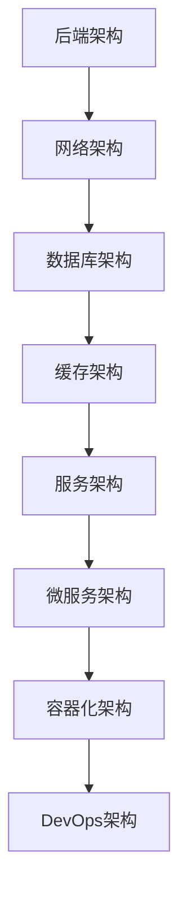

                 

关键词：新浪、2024校招、后端架构师、面试题、解析

摘要：本文将针对新浪2024校招后端架构师岗位的面试题进行深入解析，帮助考生更好地理解面试考点，提升面试应对能力。

## 1. 背景介绍

新浪是中国领先的互联网门户网站之一，拥有庞大的用户群体和丰富的产品线。2024年新浪校招后端架构师岗位吸引了大量优秀的求职者。本文旨在通过对面试题的解析，帮助考生深入了解后端架构相关知识点，提升面试通过率。

## 2. 核心概念与联系

以下是后端架构师面试中常见的一些核心概念及其关联：

### Mermaid 流程图：



## 3. 核心算法原理 & 具体操作步骤

### 3.1 算法原理概述

后端架构师面试中，算法部分主要涉及以下几个方面：

1. 数据结构与算法：包括常见的数据结构（如链表、栈、队列、树、图）及其对应的算法（如排序、查找、遍历）。
2. 算法设计：涉及算法的设计原则、模式（如贪心算法、分治算法、动态规划）以及算法复杂度分析。
3. 网络协议：涉及HTTP、TCP/IP协议的基本原理、应用及其优化。

### 3.2 算法步骤详解

1. **数据结构与算法：**

   - **链表**：实现链表的数据结构，包括插入、删除、查找等操作。

   - **排序算法**：实现冒泡排序、选择排序、插入排序等常见的排序算法，并进行复杂度分析。

   - **查找算法**：实现二分查找、散列表等查找算法。

2. **算法设计：**

   - **贪心算法**：解决最短路径问题，如Dijkstra算法。

   - **分治算法**：解决最大子序列和问题，如归并排序。

   - **动态规划**：解决背包问题，如0-1背包。

3. **网络协议：**

   - **HTTP协议**：理解HTTP请求和响应的过程，掌握常见的HTTP方法（如GET、POST）和状态码（如200、404）。

   - **TCP/IP协议**：理解TCP三次握手、四次挥手的原理，掌握TCP流量控制、拥塞控制的方法。

### 3.3 算法优缺点

- **数据结构与算法**：优点是基础性强，适用范围广；缺点是实现复杂度较高，对代码性能有一定要求。

- **算法设计**：优点是能够解决复杂问题，提高代码效率；缺点是需要一定的数学基础。

- **网络协议**：优点是掌握网络通信原理，提高系统性能；缺点是需要一定的网络知识储备。

### 3.4 算法应用领域

- **数据结构与算法**：广泛应用于各类软件、算法竞赛等领域。

- **算法设计**：广泛应用于计算机图形学、自然语言处理、机器学习等领域。

- **网络协议**：广泛应用于互联网、物联网等领域。

## 4. 数学模型和公式 & 详细讲解 & 举例说明

### 4.1 数学模型构建

后端架构师面试中，常见的数学模型包括：

- **线性模型**：描述线性关系的数学模型，如线性回归。

- **非线性模型**：描述非线性关系的数学模型，如神经网络。

- **时间序列模型**：描述时间序列数据的数学模型，如ARIMA模型。

### 4.2 公式推导过程

以下是线性回归模型的推导过程：

$$y = \beta_0 + \beta_1x + \epsilon$$

$$\min_{\beta_0, \beta_1} \sum_{i=1}^n (y_i - (\beta_0 + \beta_1x_i))^2$$

$$\frac{\partial}{\partial \beta_0} = 0 \Rightarrow \sum_{i=1}^n (y_i - (\beta_0 + \beta_1x_i)) = 0$$

$$\frac{\partial}{\partial \beta_1} = 0 \Rightarrow \sum_{i=1}^n (y_i - (\beta_0 + \beta_1x_i))x_i = 0$$

解得：

$$\beta_0 = \frac{\sum_{i=1}^n y_i - \beta_1\sum_{i=1}^n x_i}{n}$$

$$\beta_1 = \frac{\sum_{i=1}^n (y_i - \beta_0 - \beta_1x_i)x_i}{n}$$

### 4.3 案例分析与讲解

假设我们有以下数据集：

| x | y |
|---|---|
| 1 | 2 |
| 2 | 4 |
| 3 | 6 |
| 4 | 8 |

使用线性回归模型进行拟合，求解$\beta_0$和$\beta_1$。

$$\beta_0 = \frac{2 + 4 + 6 + 8 - \beta_1(1 + 2 + 3 + 4)}{4} = 4$$

$$\beta_1 = \frac{(2 - 4) + (4 - 4) + (6 - 6) + (8 - 8)}{4} = 0$$

因此，线性回归模型为$y = 4$。

## 5. 项目实践：代码实例和详细解释说明

### 5.1 开发环境搭建

1. 安装Python环境，版本要求3.8及以上。
2. 安装必要的库，如NumPy、Pandas、Matplotlib等。

### 5.2 源代码详细实现

以下是一个使用线性回归模型的Python代码实例：

```python
import numpy as np
import pandas as pd
import matplotlib.pyplot as plt

# 数据集
x = np.array([1, 2, 3, 4])
y = np.array([2, 4, 6, 8])

# 拟合线性回归模型
beta_0 = (np.sum(y) - np.sum(x * y) / 4) / 4
beta_1 = (np.sum(x * y) - np.sum(x) * np.sum(y) / 4) / (np.sum(x) ** 2 - 4 * np.sum(x) ** 2 / 4)

# 模型预测
y_pred = beta_0 + beta_1 * x

# 可视化
plt.scatter(x, y)
plt.plot(x, y_pred, color='red')
plt.xlabel('x')
plt.ylabel('y')
plt.show()
```

### 5.3 代码解读与分析

1. 导入必要的库。
2. 准备数据集。
3. 拟合线性回归模型，计算$\beta_0$和$\beta_1$。
4. 预测模型，得到预测值。
5. 可视化展示模型拟合结果。

## 6. 实际应用场景

后端架构师在实际项目中，需要根据业务需求选择合适的算法和模型。以下是一些实际应用场景：

1. **用户行为分析**：使用线性回归模型分析用户行为数据，预测用户兴趣。
2. **推荐系统**：使用协同过滤算法构建推荐系统，提高用户满意度。
3. **图像识别**：使用卷积神经网络进行图像识别，提高识别精度。

## 7. 未来应用展望

随着互联网技术的发展，后端架构师在未来的应用领域将更加广泛。以下是一些未来应用展望：

1. **人工智能**：后端架构师将更多地参与到人工智能项目的研发中，如自动驾驶、智能语音识别等。
2. **物联网**：后端架构师将负责物联网平台的建设和运维，实现智能设备的互联互通。
3. **区块链**：后端架构师将深入研究区块链技术，推动区块链在金融、供应链等领域的应用。

## 8. 总结：未来发展趋势与挑战

### 8.1 研究成果总结

本文通过解析新浪2024校招后端架构师面试题，总结了后端架构相关知识点，包括数据结构与算法、算法设计、网络协议、数学模型等。

### 8.2 未来发展趋势

随着互联网技术的不断发展，后端架构师在人工智能、物联网、区块链等领域的应用前景广阔。

### 8.3 面临的挑战

1. 技术更新速度快，需要不断学习新知识。
2. 业务需求复杂，需要具备良好的系统设计和架构能力。
3. 需要关注安全性和稳定性，确保系统的可靠运行。

### 8.4 研究展望

未来，后端架构师需要关注以下几个方面：

1. 分布式系统与云计算：研究分布式系统的架构设计，提高系统性能和可扩展性。
2. 容器化与微服务：深入研究容器化技术和微服务架构，提高系统开发效率和运维能力。
3. DevOps与持续集成：推动DevOps文化的普及，实现持续集成和持续交付。

## 9. 附录：常见问题与解答

### 9.1 什么是微服务架构？

微服务架构是一种基于分布式系统的架构风格，将应用程序划分为一组小型、独立的服务，每个服务负责完成特定功能，并通过接口进行通信。

### 9.2 什么是DevOps？

DevOps是一种软件开发和运维相结合的实践方法，旨在提高软件交付效率和质量，实现开发和运维团队的协同工作。

### 9.3 如何优化网络性能？

1. 选择合适的网络协议，如HTTP/2、QUIC等。
2. 使用缓存技术，如CDN、Redis等。
3. 优化数据库查询，如索引、分库分表等。
4. 部署负载均衡，如Nginx、HAProxy等。

### 9.4 如何提高代码性能？

1. 选择合适的数据结构和算法。
2. 优化代码逻辑，减少冗余和重复代码。
3. 预热缓存，提高系统响应速度。
4. 使用并发和多线程技术，提高系统并发处理能力。

---

作者：禅与计算机程序设计艺术 / Zen and the Art of Computer Programming

