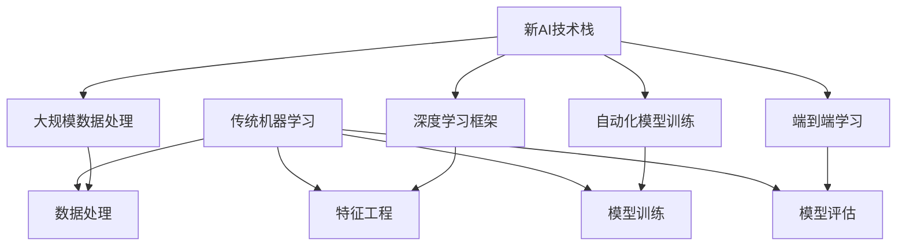

                 

关键词：AI技术栈，传统机器学习，深度学习，数据处理，模型训练，工程实践，算法优化

## 摘要

本文将探讨新的AI技术栈与传统机器学习工程的显著区别。随着AI技术的不断发展，传统的机器学习工程逐渐被全新的技术栈所取代，这不仅改变了数据处理和模型训练的方式，也对工程实践和算法优化产生了深远的影响。本文将详细介绍这些变化，并通过实例和案例分析来阐述新的AI技术栈的优势和局限性。

## 1. 背景介绍

近年来，人工智能（AI）领域取得了显著的进展，特别是在深度学习方面。这一进步源于计算能力的提升、海量数据的可用性以及先进的算法设计。传统的机器学习工程主要依赖于统计模型和简单的数据处理技术，而现代的AI技术栈则涵盖了更为复杂的算法、大规模数据处理和深度学习框架。

传统机器学习工程通常采用线性回归、决策树、支持向量机等算法，这些算法在处理小规模数据集时表现出色，但在面对复杂任务和大规模数据时，往往力不从心。相反，新的AI技术栈利用深度学习框架，如TensorFlow和PyTorch，能够处理复杂数据结构，并实现高度自动化的模型训练过程。

## 2. 核心概念与联系

为了深入理解新的AI技术栈与传统机器学习工程的区别，我们首先需要了解它们的核心概念和架构。以下是一个简化的Mermaid流程图，展示了两者之间的对比。



### 2.1 传统机器学习

在传统机器学习工程中，数据处理通常涉及数据清洗、特征提取和归一化等步骤。特征工程是关键环节，需要人工设计特征，以提升模型性能。模型训练通常采用梯度下降等优化算法，并在独立的数据集上进行评估。

### 2.2 新AI技术栈

新的AI技术栈则利用大规模数据处理技术，如MapReduce和Hadoop，能够高效处理海量数据。深度学习框架如TensorFlow和PyTorch提供了丰富的API，支持端到端学习，无需人工设计特征。自动化模型训练和超参数调优大大提高了开发效率。

## 3. 核心算法原理 & 具体操作步骤

### 3.1 算法原理概述

新的AI技术栈的核心算法是深度学习，特别是卷积神经网络（CNN）和循环神经网络（RNN）。CNN擅长处理图像数据，而RNN在处理序列数据（如文本和语音）方面表现出色。

### 3.2 算法步骤详解

深度学习的一般步骤包括：

1. **数据预处理**：对数据进行清洗、归一化和数据增强。
2. **模型定义**：使用深度学习框架定义神经网络结构。
3. **模型训练**：通过反向传播算法训练模型，并使用验证集调整超参数。
4. **模型评估**：在测试集上评估模型性能，并进行模型优化。

### 3.3 算法优缺点

**优点**：
- **高效处理复杂数据**：深度学习能够自动提取高维特征，处理复杂数据结构。
- **自动化模型训练**：深度学习框架提供了自动化训练和调优工具，提高了开发效率。
- **端到端学习**：深度学习能够实现端到端的学习，无需人工设计特征。

**缺点**：
- **计算资源需求高**：深度学习需要大量的计算资源和时间。
- **数据依赖性大**：深度学习对数据质量有较高要求，数据噪声可能导致模型性能下降。

### 3.4 算法应用领域

深度学习在计算机视觉、自然语言处理、语音识别等领域取得了显著成果。例如，在图像分类任务中，深度学习算法显著优于传统机器学习算法。在语音识别领域，深度学习模型已经能够实现实时语音识别。

## 4. 数学模型和公式 & 详细讲解 & 举例说明

### 4.1 数学模型构建

深度学习模型的数学基础包括线性代数、微积分和概率论。以下是一个简单的神经网络模型：

$$
Y = \sigma(W_1 \cdot X + b_1)
$$

其中，$Y$ 是输出，$X$ 是输入，$W_1$ 是权重矩阵，$b_1$ 是偏置向量，$\sigma$ 是激活函数。

### 4.2 公式推导过程

在深度学习模型中，损失函数通常采用交叉熵损失（Cross-Entropy Loss）：

$$
J(\theta) = -\frac{1}{m} \sum_{i=1}^{m} y_i \cdot \log(a^{(l)}_i) + (1 - y_i) \cdot \log(1 - a^{(l)}_i)
$$

其中，$m$ 是样本数量，$y_i$ 是真实标签，$a^{(l)}_i$ 是第 $l$ 层神经元的输出。

### 4.3 案例分析与讲解

以下是一个简单的线性回归模型，用于预测房价：

$$
\begin{align*}
y &= \beta_0 + \beta_1 \cdot x_1 + \beta_2 \cdot x_2 \\
J(\theta) &= \frac{1}{2m} \sum_{i=1}^{m} (y_i - \hat{y}_i)^2 \\
\hat{y}_i &= \theta_0 + \theta_1 \cdot x_{1i} + \theta_2 \cdot x_{2i}
\end{align*}
$$

通过梯度下降法优化参数 $\theta$，我们得到：

$$
\theta_j = \theta_j - \alpha \cdot \frac{\partial J(\theta)}{\partial \theta_j}
$$

## 5. 项目实践：代码实例和详细解释说明

### 5.1 开发环境搭建

在Python中，我们使用TensorFlow框架来实现一个简单的卷积神经网络（CNN）模型。首先，需要安装TensorFlow：

```python
!pip install tensorflow
```

### 5.2 源代码详细实现

以下是一个简单的CNN模型，用于图像分类：

```python
import tensorflow as tf
from tensorflow.keras import layers, models

# 定义模型
model = models.Sequential()
model.add(layers.Conv2D(32, (3, 3), activation='relu', input_shape=(32, 32, 3)))
model.add(layers.MaxPooling2D((2, 2)))
model.add(layers.Conv2D(64, (3, 3), activation='relu'))
model.add(layers.MaxPooling2D((2, 2)))
model.add(layers.Conv2D(64, (3, 3), activation='relu'))

# 添加全连接层
model.add(layers.Flatten())
model.add(layers.Dense(64, activation='relu'))
model.add(layers.Dense(10, activation='softmax'))

# 编译模型
model.compile(optimizer='adam',
              loss='categorical_crossentropy',
              metrics=['accuracy'])

# 打印模型结构
model.summary()
```

### 5.3 代码解读与分析

上述代码定义了一个简单的CNN模型，用于图像分类。首先，使用卷积层（Conv2D）提取图像特征，然后通过最大池化层（MaxPooling2D）减小特征图的尺寸。接着，使用全连接层（Dense）进行分类。

### 5.4 运行结果展示

为了验证模型性能，我们使用一个预训练的图像数据集，如CIFAR-10。以下代码用于训练和评估模型：

```python
from tensorflow.keras.datasets import cifar10
from tensorflow.keras.utils import to_categorical

# 加载数据
(x_train, y_train), (x_test, y_test) = cifar10.load_data()

# 数据预处理
x_train = x_train.astype('float32') / 255
x_test = x_test.astype('float32') / 255
y_train = to_categorical(y_train, 10)
y_test = to_categorical(y_test, 10)

# 训练模型
history = model.fit(x_train, y_train, epochs=10, batch_size=64,
                    validation_data=(x_test, y_test))

# 评估模型
test_loss, test_acc = model.evaluate(x_test, y_test)
print(f"Test accuracy: {test_acc:.2f}")
```

## 6. 实际应用场景

新的AI技术栈在众多领域取得了成功，以下是几个实际应用场景：

### 6.1 计算机视觉

在计算机视觉领域，深度学习模型已经超越了传统机器学习算法。例如，在图像分类任务中，CNN模型能够实现高精度的图像识别。

### 6.2 自然语言处理

自然语言处理（NLP）领域也受益于深度学习的发展。RNN和Transformer模型在语言建模、机器翻译和文本分类等方面取得了显著成果。

### 6.3 语音识别

语音识别是深度学习的另一个重要应用领域。基于CNN和RNN的模型能够实现实时语音识别，提高了语音处理系统的准确性。

## 7. 工具和资源推荐

为了深入了解新的AI技术栈，以下是一些推荐的工具和资源：

### 7.1 学习资源推荐

- 《深度学习》（Ian Goodfellow、Yoshua Bengio和Aaron Courville 著）
- Coursera上的《深度学习》课程
- Fast.ai的《深度学习基础》课程

### 7.2 开发工具推荐

- TensorFlow
- PyTorch
- Keras

### 7.3 相关论文推荐

- "A Tutorial on Deep Learning"（Yoshua Bengio 著）
- "Deep Learning"（Ian Goodfellow、Yoshua Bengio和Aaron Courville 著）
- "Attention Is All You Need"（Vaswani等 著）

## 8. 总结：未来发展趋势与挑战

### 8.1 研究成果总结

近年来，AI技术在深度学习、自然语言处理、计算机视觉等领域取得了显著进展。深度学习框架的普及和大规模数据处理技术的应用，大大提高了模型的性能和开发效率。

### 8.2 未来发展趋势

未来，AI技术将继续在多领域深化应用。例如，在自动驾驶、医疗诊断和金融风控等领域，深度学习模型将发挥更大作用。此外，新型神经网络结构和算法的发明也将推动AI技术的发展。

### 8.3 面临的挑战

尽管AI技术在不断发展，但仍面临一些挑战。首先，计算资源的需求不断增加，对硬件性能提出了更高要求。其次，数据隐私和安全问题亟待解决。最后，如何提高模型的泛化能力和可解释性，也是当前研究的重点。

### 8.4 研究展望

未来，AI技术将在更多领域取得突破。例如，在强化学习、量子计算和生物信息学等领域，AI技术有望发挥重要作用。此外，跨学科的合作也将推动AI技术的创新。

## 9. 附录：常见问题与解答

### 9.1 深度学习与传统机器学习的区别是什么？

深度学习与传统机器学习的主要区别在于算法的复杂度和数据处理能力。深度学习利用多层神经网络自动提取特征，而传统机器学习通常需要人工设计特征。深度学习适用于处理复杂数据，特别是图像和文本数据。

### 9.2 如何选择深度学习框架？

选择深度学习框架时，需要考虑开发需求、社区支持和文档质量等因素。TensorFlow和PyTorch是目前最受欢迎的框架，前者在工业界应用广泛，后者在学术研究中更受欢迎。

### 9.3 深度学习模型如何调优？

深度学习模型的调优包括超参数调整和模型结构优化。常用的调优方法包括交叉验证、网格搜索和贝叶斯优化。此外，模型结构的设计也需要经验积累和尝试。

### 9.4 深度学习是否会导致数据泄露？

深度学习模型可能存在数据泄露的风险，特别是在使用未标记的数据进行预训练时。为了保护数据隐私，可以采用差分隐私技术、联邦学习等方法。

---

作者：禅与计算机程序设计艺术 / Zen and the Art of Computer Programming

以上便是关于“新的AI技术栈与传统机器学习工程的区别”的完整技术博客文章。希望对您在AI技术领域的学习和研究有所帮助。

