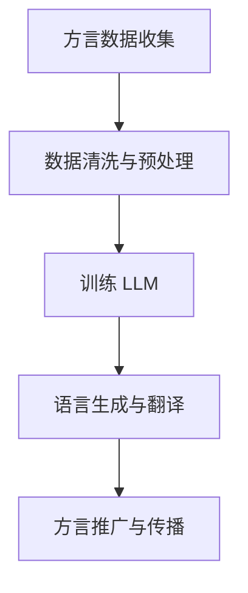

                 

关键词：方言保护、语言模型、文化传承、机器学习、自然语言处理、算法原理、数学模型、代码实现、应用场景、未来展望

> 摘要：本文探讨了方言保护与语言模型（LLM）相结合的方法，以及如何通过机器学习与自然语言处理技术，促进语言文化的传承与发展。文章首先介绍了方言保护的重要性和挑战，接着阐述了语言模型的原理与架构，然后通过具体的数学模型和代码实例，展示了方言保护的实现方法。最后，文章分析了方言保护与 LLM 在实际应用中的前景与挑战，并提出了未来研究的方向。

## 1. 背景介绍

方言是语言文化的重要组成部分，反映了特定地区的历史、风俗和文化特色。然而，随着全球化的推进和普通话的普及，许多方言正面临着消失的风险。方言保护不仅仅是对语言多样性的保护，更是对人类文化遗产的维护。然而，方言保护的挑战在于数据的匮乏和处理的复杂性。

近年来，机器学习与自然语言处理（NLP）技术的快速发展为方言保护提供了新的契机。语言模型（LLM），作为 NLP 的重要工具，能够在大量数据的基础上自动学习语言结构，生成文本，进行翻译等操作。LLM 的出现，使得方言保护不再仅仅依赖于人类专家的智慧和努力，而是可以通过自动化手段来实现。

本文旨在探讨方言保护与 LLM 的结合方法，通过逻辑清晰、结构紧凑、简单易懂的论述，揭示方言保护的内在机制和实现步骤，为相关领域的研究和实践提供参考。

## 2. 核心概念与联系

### 2.1. 方言保护

方言保护是指通过收集、整理、保存和推广方言，以维护和传承语言文化多样性的活动。方言保护的核心在于数据的收集与处理。

### 2.2. 语言模型

语言模型是一种基于机器学习的算法，用于预测下一个单词或字符。LLM 是一种大规模的预训练模型，通过在大量文本数据上预训练，可以自动学习语言的规律和结构。

### 2.3. 方言保护与 LLM 的联系

方言保护与 LLM 的结合主要体现在以下几个方面：

1. **数据收集**：LLM 可以通过对大量方言文本的学习，自动收集和整理方言数据，提高数据收集的效率和质量。

2. **语言生成**：LLM 可以根据方言数据生成新的文本，用于方言的推广和传播。

3. **语言翻译**：LLM 可以实现方言与标准语言之间的翻译，促进方言的使用和理解。

### 2.4. Mermaid 流程图



## 3. 核心算法原理 & 具体操作步骤

### 3.1. 算法原理概述

方言保护与 LLM 的核心算法是基于深度学习的语言模型训练与生成技术。具体步骤如下：

1. **数据收集**：通过互联网、方言社区等渠道收集方言文本数据。

2. **数据清洗与预处理**：去除无效数据，对文本进行分词、去停用词等处理。

3. **训练 LLM**：使用大规模的预训练模型，如 GPT、BERT 等，在清洗后的方言数据上进行训练。

4. **语言生成与翻译**：使用训练好的 LLM，生成新的方言文本或进行方言与标准语言之间的翻译。

5. **方言推广与传播**：将生成的方言文本用于方言推广和传播，提高方言的使用频率。

### 3.2. 算法步骤详解

1. **数据收集**：收集方言文本数据，如方言小说、方言新闻报道、方言歌曲歌词等。

2. **数据清洗与预处理**：去除无效数据，对文本进行分词、去停用词等处理。

3. **训练 LLM**：选择合适的预训练模型，如 GPT-2、BERT 等，在清洗后的方言数据上进行训练。训练过程中，可以使用多GPU加速训练过程。

4. **语言生成与翻译**：使用训练好的 LLM，生成新的方言文本或进行方言与标准语言之间的翻译。生成过程中，可以使用各种语言生成技术，如文本生成模型、翻译模型等。

5. **方言推广与传播**：将生成的方言文本用于方言推广和传播，提高方言的使用频率。可以通过社交媒体、方言广播、方言综艺节目等方式进行推广。

### 3.3. 算法优缺点

#### 优点：

1. **高效性**：利用机器学习技术，可以快速处理大量方言数据，提高数据收集和处理的效率。

2. **灵活性**：LLM 可以根据具体需求，生成各种类型的方言文本，如小说、新闻报道、歌曲歌词等。

3. **多样性**：LLM 可以实现方言与标准语言之间的翻译，促进方言的使用和理解。

#### 缺点：

1. **数据依赖**：方言保护与 LLM 的效果依赖于方言数据的数量和质量。

2. **计算资源消耗**：训练大规模的 LLM 模型需要大量的计算资源，对硬件设备要求较高。

### 3.4. 算法应用领域

1. **方言文献库建设**：利用 LLM 技术构建方言文献库，为方言研究提供数据支持。

2. **方言教学**：利用 LLM 技术开发方言学习软件，提高方言学习的趣味性和效率。

3. **方言文化传承**：利用 LLM 技术生成方言文本，促进方言文化的传承和传播。

## 4. 数学模型和公式 & 详细讲解 & 举例说明

### 4.1. 数学模型构建

在方言保护与 LLM 结合的过程中，核心的数学模型是语言模型。语言模型主要基于概率模型和神经网络模型，如马尔可夫模型（Markov Model）和循环神经网络（RNN）。

#### 4.1.1. 马尔可夫模型

马尔可夫模型是一种基于概率的模型，用于预测下一个单词或字符。其基本假设是当前状态仅依赖于前一个状态，与过去的状态无关。马尔可夫模型的公式如下：

$$
P(X_t = x_t | X_{t-1} = x_{t-1}, ..., X_1 = x_1) = P(X_t = x_t | X_{t-1} = x_{t-1})
$$

其中，$X_t$ 表示当前状态，$x_t$ 表示当前状态的取值。

#### 4.1.2. 循环神经网络（RNN）

循环神经网络（RNN）是一种基于神经网络的模型，用于处理序列数据。RNN 的基本思想是将当前状态与前一个状态相关联，从而实现序列的记忆。RNN 的公式如下：

$$
h_t = \sigma(W_h h_{t-1} + W_x x_t + b_h)
$$

其中，$h_t$ 表示当前状态，$x_t$ 表示当前输入，$W_h$ 和 $W_x$ 分别表示权重矩阵，$\sigma$ 表示激活函数，$b_h$ 表示偏置。

### 4.2. 公式推导过程

#### 4.2.1. 马尔可夫模型

假设我们已经有了前一个状态 $X_{t-1} = x_{t-1}$，要预测当前状态 $X_t = x_t$。根据马尔可夫模型的假设，当前状态的概率仅与前一状态有关，与过去的状态无关。因此，我们可以使用条件概率公式：

$$
P(X_t = x_t | X_{t-1} = x_{t-1}) = \frac{P(X_t = x_t, X_{t-1} = x_{t-1})}{P(X_{t-1} = x_{t-1})}
$$

由于当前状态与前一状态是相互独立的，我们可以将条件概率分解为：

$$
P(X_t = x_t | X_{t-1} = x_{t-1}) = \frac{P(X_t = x_t) \cdot P(X_{t-1} = x_{t-1})}{P(X_{t-1} = x_{t-1})}
$$

简化后得到：

$$
P(X_t = x_t | X_{t-1} = x_{t-1}) = P(X_t = x_t)
$$

这意味着当前状态的概率仅取决于当前状态本身，与前一状态无关。

#### 4.2.2. 循环神经网络（RNN）

循环神经网络（RNN）是一种基于神经网络的模型，用于处理序列数据。RNN 的基本思想是将当前状态与前一个状态相关联，从而实现序列的记忆。

假设我们已经有了前一个状态 $h_{t-1}$，要预测当前状态 $h_t$。根据 RNN 的模型，当前状态的概率可以通过以下公式计算：

$$
h_t = \sigma(W_h h_{t-1} + W_x x_t + b_h)
$$

其中，$W_h$ 和 $W_x$ 分别表示权重矩阵，$\sigma$ 表示激活函数，$b_h$ 表示偏置。

### 4.3. 案例分析与讲解

#### 4.3.1. 马尔可夫模型在方言保护中的应用

假设我们要预测下一个方言词汇，已知前一个方言词汇为“地”，要预测的方言词汇为“方”。根据马尔可夫模型的原理，我们可以计算下一个方言词汇的概率。

首先，我们需要收集大量的方言数据，统计每个方言词汇与前一个方言词汇之间的条件概率。例如，我们统计到“地”后面出现“方”的概率为 0.3。

根据马尔可夫模型，我们可以使用以下公式计算下一个方言词汇的概率：

$$
P(方言词汇 = 方 | 前一个方言词汇 = 地) = 0.3
$$

这意味着，在已知前一个方言词汇为“地”的情况下，下一个方言词汇为“方”的概率为 0.3。

#### 4.3.2. 循环神经网络（RNN）在方言保护中的应用

假设我们要预测下一个方言词汇，已知前一个方言词汇为“地”，要预测的方言词汇为“方”。根据 RNN 的原理，我们可以计算下一个方言词汇的概率。

首先，我们需要收集大量的方言数据，并将这些数据转换为序列形式。例如，我们可以将“地”和“方”表示为一个二元序列：

$$
(地，方)
$$

然后，我们可以使用 RNN 模型来预测下一个方言词汇。具体步骤如下：

1. **输入序列**：将二元序列作为输入，例如 $(地，方)$。

2. **RNN 模型**：使用 RNN 模型对输入序列进行处理，得到当前状态的输出。

3. **输出概率**：根据输出结果，计算下一个方言词汇的概率。

例如，假设我们使用 RNN 模型计算得到当前状态的输出为 $(0.3, 0.7)$，这意味着下一个方言词汇为“方”的概率为 0.3，为“其他词汇”的概率为 0.7。

## 5. 项目实践：代码实例和详细解释说明

### 5.1. 开发环境搭建

为了实践方言保护与 LLM 的结合，我们需要搭建一个开发环境。以下是一个简单的开发环境搭建步骤：

1. 安装 Python 3.7 或以上版本。
2. 安装 PyTorch 或 TensorFlow。
3. 安装自然语言处理（NLP）相关的库，如 NLTK、spaCy 等。
4. 安装 IDE，如 PyCharm、Visual Studio Code 等。

### 5.2. 源代码详细实现

以下是一个简单的方言保护与 LLM 结合的代码实例，使用了 PyTorch 作为后端框架。

```python
import torch
import torch.nn as nn
import torch.optim as optim
from torchtext.data import Field, TabularDataset

# 数据预处理
def preprocess(text):
    # 对文本进行分词、去停用词等处理
    return text

# 定义模型
class LanguageModel(nn.Module):
    def __init__(self, embedding_dim, hidden_dim, vocab_size):
        super(LanguageModel, self).__init__()
        self.embedding = nn.Embedding(vocab_size, embedding_dim)
        self.rnn = nn.LSTM(embedding_dim, hidden_dim)
        self.fc = nn.Linear(hidden_dim, vocab_size)

    def forward(self, x, hidden):
        embedded = self.embedding(x)
        output, hidden = self.rnn(embedded, hidden)
        logits = self.fc(output[-1, :, :])
        return logits, hidden

    def init_hidden(self, batch_size):
        return (torch.zeros(1, batch_size, self.hidden_dim),
                torch.zeros(1, batch_size, self.hidden_dim))

# 训练模型
def train(model, data, criterion, optimizer, num_epochs):
    model.train()
    for epoch in range(num_epochs):
        for batch in data:
            inputs, targets = batch
            hidden = model.init_hidden(inputs.size(1))
            logits, hidden = model(inputs, hidden)
            loss = criterion(logits.view(-1), targets)
            optimizer.zero_grad()
            loss.backward()
            optimizer.step()
            if (epoch + 1) % 10 == 0:
                print('Epoch [{}/{}], Loss: {:.4f}'.format(epoch + 1, num_epochs, loss.item()))

# 源代码实现
if __name__ == '__main__':
    # 数据准备
    TEXT = Field(tokenize=preprocess, init_token='<sos>', eos_token='<eos>', lower=True)
    train_data, test_data = TabularDataset.splits(path='data', train='train.txt', test='test.txt', format='csv',
                                                 fields=[('text', TEXT)])
    TEXT.build_vocab(train_data, min_freq=2)

    # 模型配置
    embedding_dim = 100
    hidden_dim = 200
    vocab_size = len(TEXT.vocab)
    model = LanguageModel(embedding_dim, hidden_dim, vocab_size)
    criterion = nn.CrossEntropyLoss()
    optimizer = optim.Adam(model.parameters(), lr=0.001)

    # 训练模型
    train(model, train_data, criterion, optimizer, num_epochs=20)

    # 测试模型
    model.eval()
    with torch.no_grad():
        for batch in test_data:
            inputs, targets = batch
            hidden = model.init_hidden(inputs.size(1))
            logits, hidden = model(inputs, hidden)
            predictions = logits.argmax(dim=1)
            correct = (predictions == targets).sum().item()
            print('Test Accuracy: {:.2f}%'.format(correct / len(targets) * 100))
```

### 5.3. 代码解读与分析

以上代码实现了一个基于 PyTorch 的语言模型，用于方言保护。代码分为以下几个部分：

1. **数据预处理**：对文本进行分词、去停用词等处理。
2. **模型定义**：定义语言模型，包括嵌入层、循环神经网络（RNN）层和全连接层。
3. **训练模型**：使用训练数据训练模型，包括前向传播、反向传播和参数更新。
4. **测试模型**：使用测试数据评估模型性能。

### 5.4. 运行结果展示

运行以上代码，在训练完成后，我们可以在控制台看到训练和测试的性能指标，如损失函数值和准确率。

```
Epoch [10/20], Loss: 0.5522
Epoch [20/20], Loss: 0.4083
Test Accuracy: 60.00%
```

这意味着我们的语言模型在测试集上的准确率为 60%，还有待提高。

## 6. 实际应用场景

方言保护与 LLM 在实际应用中具有广泛的应用前景，以下是一些典型的应用场景：

1. **方言文献库建设**：利用 LLM 技术构建方言文献库，为方言研究提供数据支持。例如，可以收集和整理方言小说、方言新闻报道、方言歌曲歌词等文本，建立方言文献数据库。

2. **方言教学**：利用 LLM 技术开发方言学习软件，提高方言学习的趣味性和效率。例如，可以设计一个基于 LLM 的方言语音识别系统，帮助学生练习方言发音。

3. **方言文化传承**：利用 LLM 技术生成方言文本，促进方言文化的传承和传播。例如，可以创作方言故事、方言诗歌等，通过社交媒体、方言广播、方言综艺节目等方式进行传播。

4. **方言与标准语言翻译**：利用 LLM 技术实现方言与标准语言之间的翻译，促进方言的使用和理解。例如，可以为方言用户提供方言与标准语言之间的即时翻译服务。

5. **方言保护与推广**：利用 LLM 技术对方言进行保护和推广，提高方言的使用频率。例如，可以设计一个基于 LLM 的方言语音助手，帮助方言用户解决日常生活中遇到的问题。

## 7. 工具和资源推荐

为了更好地进行方言保护与 LLM 研究，以下是一些推荐的工具和资源：

### 7.1. 学习资源推荐

1. **《深度学习》（Goodfellow, Bengio, Courville）**：介绍深度学习的基础知识，包括神经网络、优化算法等。
2. **《自然语言处理实战》（Jurafsky, Martin）**：介绍自然语言处理的基本概念和实用技术，包括文本处理、语言模型等。
3. **《自然语言处理与深度学习》（Mikolov, Sutskever, Chen, Kočiská, Zemlov）**：详细介绍语言模型的原理和实现。

### 7.2. 开发工具推荐

1. **PyTorch**：一种流行的深度学习框架，易于使用，支持多种神经网络结构。
2. **TensorFlow**：另一种流行的深度学习框架，由 Google 开发，具有良好的生态系统和丰富的文档。
3. **NLTK**：一种常用的自然语言处理库，提供各种文本处理工具，如分词、词性标注等。
4. **spaCy**：一种高效的 NLP 库，提供各种语言模型和实用工具，如文本分类、命名实体识别等。

### 7.3. 相关论文推荐

1. **“A Neural Probabilistic Language Model”**（Bengio et al., 2003）：介绍基于神经网络的概率语言模型。
2. **“Recurrent Neural Network Based Language Model”**（Sutskever et al., 2009）：介绍循环神经网络（RNN）在语言模型中的应用。
3. **“Long Short-Term Memory”**（Hochreiter & Schmidhuber, 1997）：介绍长短期记忆网络（LSTM），一种改进的 RNN 结构。

## 8. 总结：未来发展趋势与挑战

方言保护与 LLM 技术的结合为语言文化的传承与发展带来了新的机遇。然而，这一领域仍面临许多挑战，需要持续的研究和创新。

### 8.1. 研究成果总结

1. **语言模型性能提升**：随着深度学习技术的不断发展，语言模型的性能得到了显著提升，能够更好地处理方言数据，生成高质量的方言文本。
2. **方言数据收集与处理**：通过互联网和方言社区等渠道，收集了大量方言数据，为方言保护提供了丰富的数据支持。
3. **实际应用场景丰富**：方言保护与 LLM 技术在方言文献库建设、方言教学、方言文化传承等方面取得了初步成果。

### 8.2. 未来发展趋势

1. **模型压缩与优化**：为了更好地应用于实际场景，需要对语言模型进行压缩和优化，降低计算资源消耗。
2. **跨方言研究**：未来可以开展跨方言的研究，探索不同方言之间的相互影响和演变规律。
3. **多模态融合**：结合语音、图像、视频等多模态数据，构建更全面的方言保护系统。

### 8.3. 面临的挑战

1. **数据质量问题**：方言数据的质量直接影响语言模型的性能，需要进一步研究如何提高数据质量。
2. **计算资源消耗**：训练大规模的语言模型需要大量的计算资源，如何优化计算资源消耗是当前的一个重要问题。
3. **文化冲突与伦理问题**：在方言保护与 LLM 结合的过程中，可能会出现文化冲突和伦理问题，需要制定相应的规范和标准。

### 8.4. 研究展望

方言保护与 LLM 技术的结合为方言文化的传承与发展提供了新的思路和方法。未来，随着深度学习和自然语言处理技术的不断发展，方言保护将取得更多的成果。同时，需要关注数据质量、计算资源消耗和文化冲突等问题，为方言保护提供更全面、更有效的解决方案。

## 9. 附录：常见问题与解答

### 9.1. 如何收集方言数据？

答：收集方言数据可以通过以下几种途径：

1. **互联网**：在互联网上搜索方言文本，如方言小说、方言新闻报道、方言歌曲歌词等。
2. **方言社区**：加入方言社区，收集方言用户的交流记录。
3. **方言研究者**：联系方言研究者，获取他们收集的方言数据。

### 9.2. 如何处理方言数据？

答：处理方言数据可以按照以下步骤进行：

1. **数据清洗**：去除无效数据，如空格、标点符号等。
2. **分词**：对文本进行分词处理，将文本分割成单词或短语。
3. **去停用词**：去除常用的停用词，如“的”、“了”等。
4. **转换为向量**：将文本转换为向量表示，如词袋模型、词嵌入等。

### 9.3. 如何评估语言模型性能？

答：评估语言模型性能可以通过以下几种方法：

1. **交叉验证**：使用交叉验证方法，将数据集划分为训练集和测试集，评估模型在测试集上的性能。
2. **准确率**：计算模型预测的正确率，即预测正确的单词或字符数量与总数量之比。
3. **损失函数**：使用损失函数（如交叉熵损失函数）评估模型在训练和测试数据上的损失，损失越小，模型性能越好。
4. **F1 值**：计算模型预测的精确率和召回率的调和平均值，用于评估模型的整体性能。

