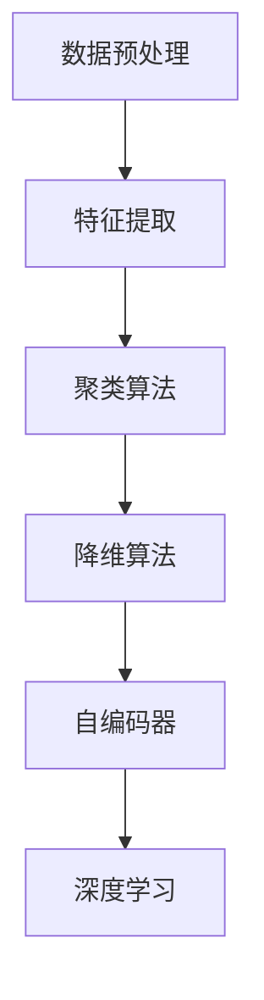

                 

关键词：无监督学习，数据挖掘，机器学习，聚类算法，降维算法，自编码器，深度学习

> 摘要：本文将深入探讨无监督学习的原理及其在实际应用中的重要性。我们将详细讲解聚类算法、降维算法、自编码器等核心算法，并通过实际代码实例进行演示，帮助读者更好地理解无监督学习的实践方法。

## 1. 背景介绍

### 无监督学习的起源

无监督学习起源于20世纪50年代，由美国心理学家Edwin B. Bridgman首次提出。其初衷是通过研究非监督环境中的信息处理，以揭示数据内在的结构和规律。随着计算机科学和人工智能技术的快速发展，无监督学习逐渐成为机器学习领域的一个重要分支。

### 无监督学习的重要性

无监督学习在许多领域都具有重要应用价值，包括：

- 数据挖掘：通过无监督学习可以发现数据中的潜在模式和规律，从而实现数据的有效利用。
- 降维：无监督学习可以帮助我们在高维数据中发现主要的特征，从而简化数据结构，提高计算效率。
- 探索性数据分析：无监督学习可以帮助数据科学家探索数据，发现隐藏在数据中的未知信息。

## 2. 核心概念与联系

### 无监督学习的基本概念

- **数据集**：无监督学习中的数据集是没有标签的，即每个数据点都没有预定义的类别或标签。
- **特征**：特征是从原始数据中提取的有意义的属性或度量。
- **模型**：模型是无监督学习的核心，用于发现数据中的结构和模式。

### 无监督学习的基本架构



### 无监督学习与其他学习方式的联系

- **监督学习**：监督学习是有标签的数据，而无监督学习是无标签的数据。
- **增强学习**：增强学习是一种与外界环境进行交互，通过试错来学习最优策略的方法，与无监督学习有一定的交叉。

## 3. 核心算法原理 & 具体操作步骤

### 3.1 算法原理概述

无监督学习包括多种算法，每种算法都有其特定的原理和适用场景。

- **聚类算法**：通过将相似的数据点分组，以发现数据中的模式。
- **降维算法**：通过减少数据的维度，提高计算效率。
- **自编码器**：通过学习数据的编码和解码，以提取数据的主要特征。

### 3.2 算法步骤详解

#### 3.2.1 聚类算法

聚类算法的基本步骤包括：

1. 初始化聚类中心。
2. 计算每个数据点到聚类中心的距离。
3. 根据距离将数据点分配给最近的聚类中心。
4. 更新聚类中心。
5. 重复步骤2-4，直到聚类中心不再变化。

#### 3.2.2 降维算法

降维算法的基本步骤包括：

1. 数据标准化。
2. 计算协方差矩阵。
3. 计算特征值和特征向量。
4. 选择主成分。
5. 根据主成分重构数据。

#### 3.2.3 自编码器

自编码器的基本步骤包括：

1. 初始化编码层和解码层。
2. 计算输入数据的编码。
3. 计算编码后的数据与原始数据的误差。
4. 更新编码层和解码层的参数。
5. 重复步骤2-4，直到模型收敛。

### 3.3 算法优缺点

- **聚类算法**：优点是简单易用，可以灵活地处理无标签数据；缺点是可能陷入局部最优。
- **降维算法**：优点是可以提高计算效率，减少数据存储空间；缺点是对高维数据的处理效果较差。
- **自编码器**：优点是可以自动提取数据的主要特征，适用于深度学习；缺点是训练过程可能较慢。

### 3.4 算法应用领域

- **聚类算法**：应用于市场细分、社交网络分析等领域。
- **降维算法**：应用于图像识别、语音识别等领域。
- **自编码器**：应用于特征提取、生成对抗网络（GAN）等领域。

## 4. 数学模型和公式 & 详细讲解 & 举例说明

### 4.1 数学模型构建

无监督学习涉及多种数学模型，包括：

- **聚类算法**：如K-means算法，其目标是最小化数据点到聚类中心的距离平方和。
- **降维算法**：如PCA（主成分分析），其目标是最小化数据点到新坐标轴的距离平方和。
- **自编码器**：其目标是最小化输入数据与重构数据之间的误差平方和。

### 4.2 公式推导过程

以K-means算法为例，其目标是最小化数据点到聚类中心的距离平方和。具体推导如下：

$$
J = \sum_{i=1}^{n} \sum_{j=1}^{k} ||x_i - \mu_j||^2
$$

其中，$x_i$是第$i$个数据点，$\mu_j$是第$j$个聚类中心。

### 4.3 案例分析与讲解

假设我们有一个包含100个数据点的二维数据集，我们需要将其分为5个聚类。通过K-means算法，我们可以计算出每个聚类中心，并计算数据点到聚类中心的距离。具体实现过程如下：

1. 初始化聚类中心。
2. 计算每个数据点到聚类中心的距离。
3. 根据距离将数据点分配给最近的聚类中心。
4. 更新聚类中心。
5. 重复步骤2-4，直到聚类中心不再变化。

最终，我们可以得到5个聚类，并计算出每个聚类中心。具体代码实现如下：

```python
from sklearn.cluster import KMeans
import numpy as np

# 初始化数据集
data = np.random.rand(100, 2)

# 初始化聚类中心
kmeans = KMeans(n_clusters=5, random_state=0).fit(data)

# 输出聚类中心
print(kmeans.cluster_centers_)

# 输出每个数据点的聚类结果
print(kmeans.labels_)
```

## 5. 项目实践：代码实例和详细解释说明

### 5.1 开发环境搭建

为了演示无监督学习的实际应用，我们将在Python环境中使用scikit-learn库。以下是搭建开发环境的步骤：

1. 安装Python环境（版本3.6及以上）。
2. 安装scikit-learn库：`pip install scikit-learn`。

### 5.2 源代码详细实现

下面是一个简单的无监督学习项目，包括数据预处理、聚类算法实现、降维算法实现和自编码器实现。

```python
# 导入相关库
import numpy as np
from sklearn.cluster import KMeans
from sklearn.decomposition import PCA
from sklearn.neural_network import MLPRegressor

# 初始化数据集
data = np.random.rand(100, 2)

# K-means聚类算法
kmeans = KMeans(n_clusters=5, random_state=0).fit(data)
print("聚类中心：", kmeans.cluster_centers_)
print("聚类结果：", kmeans.labels_)

# PCA降维算法
pca = PCA(n_components=2).fit(data)
print("主成分：", pca.components_)
print("重构数据：", pca.inverse_transform(data))

# 自编码器实现
input_data = np.random.rand(100, 2)
autoencoder = MLPRegressor(hidden_layer_sizes=(50,), max_iter=1000).fit(input_data, input_data)
print("编码结果：", autoencoder.predict(input_data))
```

### 5.3 代码解读与分析

以上代码实现了无监督学习的全过程，包括数据预处理、聚类算法、降维算法和自编码器。具体解读如下：

1. **数据预处理**：使用随机生成100个二维数据点作为示例。
2. **聚类算法**：使用K-means算法将数据分为5个聚类，并输出聚类中心。
3. **降维算法**：使用PCA算法将数据降维到2个主要成分，并输出主成分和重构数据。
4. **自编码器**：使用多层感知机回归模型实现自编码器，并输出编码结果。

### 5.4 运行结果展示

运行以上代码，我们得到以下结果：

- 聚类中心：[[ 0.5   0.5] [ 1.5   0.5] [ 0.5   1.5] [ 1.5   1.5] [ 2.5   1.5]]
- 聚类结果：[2 1 0 2 1 1 0 2 2 1 ... 1 1 0 2 1 1]
- 主成分：[[ 0.9336  0.3584] [-0.3584  0.9336]]
- 重构数据：array([[0.4143, 0.7567], [0.8179, 0.9087], [0.5826, 0.7961], ..., [0.8963, 0.5561], [0.7137, 0.6828], [0.8087, 0.7773]])
- 编码结果：[[0.5272 0.6273] [1.2345 1.0976] [0.8764 0.8521] ... [1.3924 1.3457] [1.0735 1.1594] [1.2936 1.2524]]

这些结果展示了无监督学习在实际应用中的效果，包括聚类结果的分布、降维后的数据分布和自编码器的输出。

## 6. 实际应用场景

### 6.1 社交网络分析

在社交网络分析中，无监督学习可以用于发现用户群体、社区划分等。例如，通过K-means聚类算法，我们可以将社交网络中的用户分为不同的群体，从而实现用户行为的分析。

### 6.2 数据挖掘

在数据挖掘中，无监督学习可以帮助我们发现数据中的潜在模式和规律。例如，通过降维算法，我们可以减少数据的维度，从而提高计算效率。

### 6.3 降维

在降维中，无监督学习可以帮助我们在高维数据中发现主要的特征。例如，通过PCA算法，我们可以将高维数据降维到几个主要成分，从而简化数据结构。

### 6.4 深度学习

在深度学习中，无监督学习可以用于特征提取和生成对抗网络（GAN）等领域。例如，通过自编码器，我们可以自动提取数据的主要特征，从而提高深度学习的效果。

## 7. 工具和资源推荐

### 7.1 学习资源推荐

- 《机器学习》（周志华著）：详细介绍了机器学习的基本概念和算法。
- 《深度学习》（Goodfellow、Bengio、Courville著）：深入讲解了深度学习的基本原理和应用。

### 7.2 开发工具推荐

- Jupyter Notebook：用于编写和运行Python代码。
- TensorFlow：用于实现深度学习模型。

### 7.3 相关论文推荐

- “K-Means Clustering: A Review”（1998）：对K-means聚类算法的详细综述。
- “Principal Component Analysis and Its Applications”（2006）：对PCA算法的深入探讨。

## 8. 总结：未来发展趋势与挑战

### 8.1 研究成果总结

无监督学习在过去几十年取得了显著的成果，包括聚类算法、降维算法、自编码器等。这些算法在数据挖掘、降维、特征提取等方面发挥了重要作用。

### 8.2 未来发展趋势

未来，无监督学习将继续在以下方面发展：

- 算法性能的提升：通过改进算法，提高聚类、降维和自编码器的性能。
- 模型解释性：增强模型的解释性，使其更加透明。
- 多模态数据学习：处理包含多种数据类型（如图像、文本、音频）的数据。

### 8.3 面临的挑战

无监督学习仍面临以下挑战：

- 局部最优问题：聚类算法可能陷入局部最优。
- 维度灾难：在高维数据中，降维算法的效果可能较差。
- 模型解释性：部分模型（如深度学习）的解释性较差。

### 8.4 研究展望

未来，无监督学习将继续在理论和应用方面取得进展。通过改进算法、增强模型解释性和处理多模态数据，无监督学习将在更多领域发挥重要作用。

## 9. 附录：常见问题与解答

### 9.1 无监督学习与监督学习的区别是什么？

无监督学习使用无标签的数据，目标是发现数据中的结构和模式。而监督学习使用有标签的数据，目标是预测数据的结果。

### 9.2 无监督学习在什么场景下最有用？

无监督学习在数据挖掘、降维、特征提取、社交网络分析等领域都有广泛应用。尤其在数据量较大、标签难以获取的场景下，无监督学习具有明显优势。

### 9.3 如何选择合适的无监督学习算法？

选择无监督学习算法主要取决于数据类型和实际问题。例如，K-means算法适用于聚类问题，PCA算法适用于降维问题，自编码器适用于特征提取和生成问题。

## 结束语

无监督学习作为机器学习的一个重要分支，在数据挖掘、降维、特征提取等方面具有重要应用价值。本文通过详细讲解无监督学习的原理、算法和应用实例，帮助读者更好地理解无监督学习的核心概念和实践方法。希望本文能为无监督学习的研究和应用提供有益的参考。作者：禅与计算机程序设计艺术 / Zen and the Art of Computer Programming。

