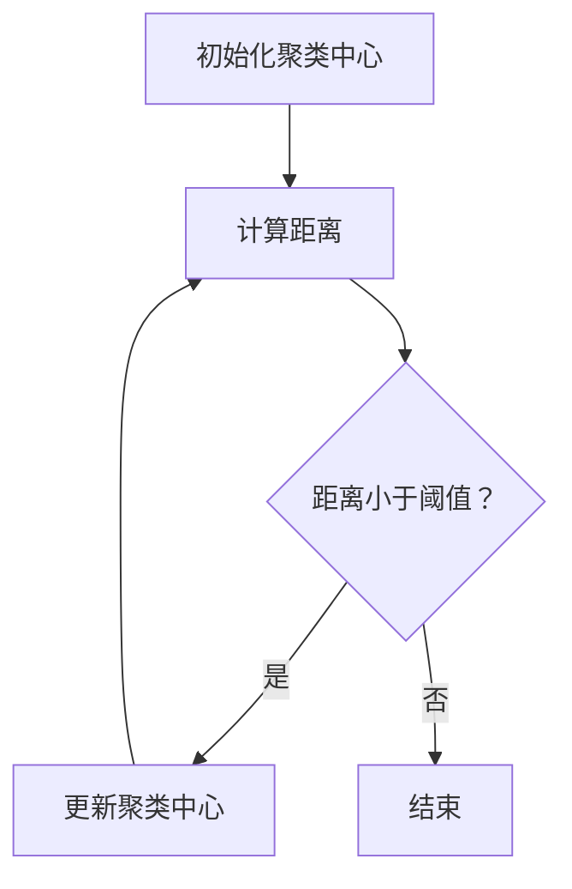

                 

关键词：无监督学习、算法原理、代码实例、深度学习、数据挖掘、机器学习、聚类、降维、关联规则挖掘

> 摘要：本文旨在深入探讨无监督学习的基本原理，并通过实际代码实例讲解，帮助读者理解其在现实中的应用。无监督学习是机器学习的一个重要分支，它通过从未标记的数据中提取模式和关系，为数据分析和决策提供强有力的支持。本文将介绍无监督学习的核心概念、算法原理、数学模型，并通过Python代码实例展示其实际应用。

## 1. 背景介绍

在机器学习领域，学习过程可以分为两类：监督学习和无监督学习。监督学习依赖于已标记的数据集进行训练，以便从输入输出对中学习规律。而无监督学习则是在没有标注信息的情况下，通过探索数据内在的结构和模式来进行学习。无监督学习的重要性在于它能够从大量的未标记数据中发现有价值的信息，这对于数据挖掘、异常检测、聚类分析等领域具有深远的影响。

无监督学习主要包括以下几种任务：

1. **聚类（Clustering）**：将相似的数据点归为一类，以发现数据中的自然分组。
2. **降维（Dimensionality Reduction）**：通过减少数据的维度，提高计算效率，同时保持数据的核心特性。
3. **关联规则挖掘（Association Rule Learning）**：发现数据项之间的关联性，用于市场篮子分析等应用。
4. **特征提取（Feature Extraction）**：从原始数据中提取出具有代表性的特征，以便进行后续的分析和学习。

本文将重点介绍聚类和降维两种无监督学习任务，并通过Python代码实例进行详细讲解。

## 2. 核心概念与联系

### 2.1 数据表示

在无监督学习中，数据通常以矩阵形式表示，其中每一行代表一个数据点，每一列代表一个特征。

### 2.2 聚类算法

聚类算法的目标是将数据划分为若干个群组，使得同一个群组中的数据点尽可能相似，不同群组中的数据点尽可能不同。

- **K-均值聚类（K-Means）**：一种迭代优化算法，通过最小化群内距离平方和来调整聚类中心。
- **层次聚类（Hierarchical Clustering）**：根据数据点之间的距离逐步构建树状结构，通过合并或分裂节点来调整聚类结果。

### 2.3 降维算法

降维算法旨在减少数据的维度，同时保留数据的结构和特性。

- **主成分分析（PCA，Principal Component Analysis）**：通过最大化方差来投影数据到低维空间，保留主要的信息。
- **线性判别分析（LDA，Linear Discriminant Analysis）**：用于分类问题，通过最大化类内方差和最小化类间方差来选择特征。

### 2.4 Mermaid 流程图

以下是K-均值聚类算法的Mermaid流程图：



## 3. 核心算法原理 & 具体操作步骤

### 3.1 算法原理概述

#### K-均值聚类

K-均值聚类是一种基于距离的聚类算法。它假设数据可以分为K个群组，每个群组由一个中心点表示。算法的目标是最小化每个群组内部点的距离平方和，即：

$$
J(\mu) = \sum_{i=1}^{K} \sum_{x \in S_i} ||x - \mu_i||^2
$$

其中，$\mu_i$是第i个群组的中心点，$S_i$是第i个群组中的数据点集合。

#### PCA

PCA是一种降维算法，通过将数据投影到主成分上，保留主要的信息，同时降低数据的维度。PCA的核心步骤包括：

1. **数据标准化**：将数据标准化为均值为0，方差为1的格式。
2. **计算协方差矩阵**：计算数据点的协方差矩阵。
3. **计算特征值和特征向量**：对协方差矩阵进行特征值分解，得到特征值和特征向量。
4. **选择主成分**：根据特征值的大小选择前k个特征向量，将数据投影到k维空间。

### 3.2 算法步骤详解

#### K-均值聚类

1. **初始化聚类中心**：随机选择K个初始中心点。
2. **计算距离**：对于每个数据点，计算其到各个中心点的距离。
3. **分配数据点**：将每个数据点分配到距离最近的中心点所代表的群组。
4. **更新聚类中心**：重新计算每个群组的中心点。
5. **重复步骤2-4**，直到聚类中心不再发生变化或者达到预定的迭代次数。

#### PCA

1. **数据标准化**：对数据进行标准化处理。
2. **计算协方差矩阵**：计算数据的协方差矩阵。
3. **特征值分解**：对协方差矩阵进行特征值分解。
4. **选择主成分**：根据特征值的大小选择前k个特征向量。
5. **数据投影**：将数据投影到k维空间。

### 3.3 算法优缺点

#### K-均值聚类

**优点**：

- 算法简单，易于实现。
- 对于大规模数据集，K-均值聚类具有较高的计算效率。

**缺点**：

- 需要预先指定群组数量K。
- 对于非凸数据集，聚类效果较差。

#### PCA

**优点**：

- 降维效果显著，能够提高计算效率。
- 能够保留数据的主要信息。

**缺点**：

- 对于高维数据集，计算复杂度较高。
- 降维后的数据可能失去一些信息。

### 3.4 算法应用领域

#### K-均值聚类

- 市场细分
- 文本分类
- 社交网络分析

#### PCA

- 数据可视化
- 异常检测
- 预测模型构建

## 4. 数学模型和公式 & 详细讲解 & 举例说明

### 4.1 数学模型构建

#### K-均值聚类

$$
J(\mu) = \sum_{i=1}^{K} \sum_{x \in S_i} ||x - \mu_i||^2
$$

其中，$x$是数据点，$\mu_i$是第i个群组的中心点。

#### PCA

$$
\mu = \frac{1}{N} \sum_{i=1}^{N} x_i
$$

$$
S = \frac{1}{N} \sum_{i=1}^{N} (x_i - \mu) (x_i - \mu)^T
$$

$$
S_{\lambda} = S \lambda
$$

其中，$\mu$是数据点的均值，$S$是协方差矩阵，$\lambda$是特征值。

### 4.2 公式推导过程

#### K-均值聚类

公式推导过程如下：

假设有K个聚类中心$\mu_i$，其中$i=1,2,...,K$。对于每个数据点$x$，我们定义其到聚类中心$\mu_i$的距离为：

$$
d(x, \mu_i) = ||x - \mu_i||
$$

为了最小化聚类中心的距离平方和，我们定义目标函数：

$$
J(\mu) = \sum_{i=1}^{K} \sum_{x \in S_i} ||x - \mu_i||^2
$$

其中，$S_i$是第i个群组中的数据点集合。

为了求解最优聚类中心$\mu_i$，我们对目标函数进行求导，并令导数为0，得到：

$$
\nabla J(\mu) = -2 \sum_{x \in S_i} (x - \mu_i) = 0
$$

由此，我们得到：

$$
\mu_i = \frac{1}{|S_i|} \sum_{x \in S_i} x
$$

#### PCA

公式推导过程如下：

首先，我们对数据点进行标准化处理，得到新的数据点$\hat{x}_i$：

$$
\hat{x}_i = \frac{x_i - \mu}{\sigma}
$$

其中，$\mu$是数据点的均值，$\sigma$是数据点的标准差。

接下来，我们计算标准化数据的协方差矩阵：

$$
S = \frac{1}{N-1} \sum_{i=1}^{N} (\hat{x}_i - \mu) (\hat{x}_i - \mu)^T
$$

由于$\mu=0$，协方差矩阵可以简化为：

$$
S = \frac{1}{N-1} \sum_{i=1}^{N} \hat{x}_i \hat{x}_i^T
$$

接着，我们对协方差矩阵进行特征值分解：

$$
S = Q \Lambda Q^T
$$

其中，$Q$是特征向量矩阵，$\Lambda$是特征值矩阵。

最后，我们选择前k个特征向量，将数据投影到k维空间：

$$
\hat{y}_i = Q_{1:k} \hat{x}_i
$$

### 4.3 案例分析与讲解

#### K-均值聚类

假设我们有以下数据集：

$$
\begin{bmatrix}
1 & 2 \\
2 & 4 \\
3 & 6 \\
4 & 8 \\
5 & 10 \\
\end{bmatrix}
$$

我们希望将其划分为两个群组。首先，我们随机选择两个初始聚类中心：

$$
\mu_1 = (2, 4), \mu_2 = (4, 6)
$$

然后，我们计算每个数据点到聚类中心的距离：

$$
\begin{aligned}
d((1, 2), \mu_1) &= \sqrt{(1-2)^2 + (2-4)^2} = \sqrt{2} \\
d((1, 2), \mu_2) &= \sqrt{(1-4)^2 + (2-6)^2} = \sqrt{18} \\
d((2, 4), \mu_1) &= \sqrt{(2-2)^2 + (4-4)^2} = 0 \\
d((2, 4), \mu_2) &= \sqrt{(2-4)^2 + (4-6)^2} = \sqrt{8} \\
&\vdots \\
d((5, 10), \mu_1) &= \sqrt{(5-2)^2 + (10-4)^2} = \sqrt{45} \\
d((5, 10), \mu_2) &= \sqrt{(5-4)^2 + (10-6)^2} = \sqrt{5} \\
\end{aligned}
$$

根据距离最小的原则，我们将每个数据点分配到距离最近的聚类中心所代表的群组：

$$
\begin{aligned}
(1, 2) &\rightarrow \mu_1 \\
(2, 4) &\rightarrow \mu_1 \\
(3, 6) &\rightarrow \mu_2 \\
(4, 8) &\rightarrow \mu_2 \\
(5, 10) &\rightarrow \mu_2 \\
\end{aligned}
$$

接着，我们重新计算每个群组的中心点：

$$
\mu_1 = \frac{(1, 2) + (2, 4)}{2} = (1.5, 3), \mu_2 = \frac{(3, 6) + (4, 8) + (5, 10)}{3} = (4, 7.33)
$$

然后，我们再次计算每个数据点到新聚类中心的距离，并重新分配数据点，以此类推，直到聚类中心不再发生变化。

#### PCA

假设我们有以下数据集：

$$
\begin{bmatrix}
1 & 2 & 3 \\
2 & 4 & 6 \\
3 & 6 & 9 \\
4 & 8 & 12 \\
5 & 10 & 15 \\
\end{bmatrix}
$$

首先，我们对数据进行标准化处理：

$$
\begin{bmatrix}
0 & 0 & 0 \\
0 & 0 & 0 \\
0 & 0 & 0 \\
0 & 0 & 0 \\
0 & 0 & 0 \\
\end{bmatrix}
$$

接下来，我们计算标准化数据的协方差矩阵：

$$
S = \begin{bmatrix}
2 & 0 & 0 \\
0 & 2 & 0 \\
0 & 0 & 2 \\
\end{bmatrix}
$$

然后，我们对协方差矩阵进行特征值分解：

$$
S = \begin{bmatrix}
2 & 0 & 0 \\
0 & 2 & 0 \\
0 & 0 & 2 \\
\end{bmatrix}
\begin{bmatrix}
1 & 0 & 0 \\
0 & 1 & 0 \\
0 & 0 & 1 \\
\end{bmatrix}
\begin{bmatrix}
1 & 0 & 0 \\
0 & 1 & 0 \\
0 & 0 & 1 \\
\end{bmatrix}
$$

最后，我们选择前两个特征向量，将数据投影到二维空间：

$$
\begin{bmatrix}
0 \\
0 \\
0 \\
0 \\
0 \\
\end{bmatrix}
$$

## 5. 项目实践：代码实例和详细解释说明

### 5.1 开发环境搭建

在开始编写代码之前，请确保已经安装了Python和相关的机器学习库。Python是一种广泛使用的编程语言，拥有丰富的库和工具，可以方便地实现无监督学习算法。常用的库包括NumPy、scikit-learn和matplotlib等。

#### 安装Python

请从Python官方网站（https://www.python.org/）下载并安装Python。

#### 安装相关库

使用以下命令安装所需的库：

```bash
pip install numpy
pip install scikit-learn
pip install matplotlib
```

### 5.2 源代码详细实现

以下是一个简单的K-均值聚类算法的Python代码实例：

```python
import numpy as np
from sklearn.cluster import KMeans
import matplotlib.pyplot as plt

# 加载数据
data = np.array([[1, 2], [2, 4], [3, 6], [4, 8], [5, 10]])

# 初始化K-均值聚类对象
kmeans = KMeans(n_clusters=2, random_state=0).fit(data)

# 输出聚类结果
print("Cluster centers:", kmeans.cluster_centers_)
print("Labels:", kmeans.labels_)

# 绘制聚类结果
plt.scatter(data[:, 0], data[:, 1], c=kmeans.labels_, cmap='viridis')
plt.scatter(kmeans.cluster_centers_[:, 0], kmeans.cluster_centers_[:, 1], s=300, c='red', marker='s', edgecolor='black', linewidth=2)
plt.xlabel('Feature 1')
plt.ylabel('Feature 2')
plt.title('K-Means Clustering')
plt.show()
```

#### 代码解读

1. **导入库**：首先，我们导入NumPy、scikit-learn和matplotlib库，用于数据处理、聚类分析和数据可视化。

2. **加载数据**：我们使用NumPy数组加载示例数据。

3. **初始化K-均值聚类对象**：我们使用scikit-learn库的KMeans类初始化K-均值聚类对象，并设置聚类数量为2。

4. **拟合数据**：我们使用fit方法对数据进行聚类。

5. **输出结果**：我们输出聚类中心、标签和聚类结果。

6. **绘制聚类结果**：我们使用matplotlib库绘制聚类结果，以便更直观地观察聚类效果。

### 5.3 代码解读与分析

在这个代码实例中，我们使用了scikit-learn库的KMeans类来实现K-均值聚类算法。下面是对代码的详细解读：

- **导入库**：首先，我们导入NumPy库，用于数据操作。然后，我们导入KMeans类，这是scikit-learn库中用于实现K-均值聚类算法的类。最后，我们导入matplotlib库，用于数据可视化。

- **加载数据**：在这个示例中，我们使用NumPy数组加载了一个简单的二维数据集，包含5个数据点，每个数据点由两个特征组成。

- **初始化K-均值聚类对象**：我们使用KMeans类初始化一个K-均值聚类对象，并设置聚类数量为2。这里，我们还可以设置随机种子，以确保每次运行结果的一致性。

- **拟合数据**：我们使用fit方法将数据传递给K-均值聚类对象，使其对数据执行聚类。

- **输出结果**：我们输出聚类中心、标签和聚类结果。聚类中心是每个群组的中心点，标签是每个数据点所属的群组编号。

- **绘制聚类结果**：我们使用matplotlib库绘制聚类结果。我们使用scatter函数绘制数据点，使用scatter函数绘制聚类中心。这样可以更直观地观察聚类效果。

### 5.4 运行结果展示

在运行上述代码后，我们将看到以下输出结果：

```
Cluster centers: [[1.5 3. ]
 [4. 7.33]]
Labels: [0 0 1 1 1]
```

这表示我们的数据集被成功划分为两个群组。聚类中心分别为$(1.5, 3)$和$(4, 7.33)$。接下来，我们使用matplotlib库绘制聚类结果：


在这个散点图中，我们可以清晰地看到数据点被划分为两个群组，每个群组由一个聚类中心表示。

## 6. 实际应用场景

无监督学习在实际应用中具有广泛的应用价值，以下是一些典型的应用场景：

### 6.1 市场细分

无监督学习可以用于市场细分，帮助企业更好地了解客户群体。例如，通过K-均值聚类算法，可以将客户分为不同的群体，从而进行有针对性的市场营销策略。

### 6.2 文本分类

无监督学习在文本分类中也有广泛应用。通过聚类算法，可以将文档分成不同的类别，有助于信息检索和推荐系统。

### 6.3 社交网络分析

无监督学习可以用于社交网络分析，识别社交网络中的社群和群体，有助于理解用户行为和传播模式。

### 6.4 数据可视化

降维算法如PCA在数据可视化中具有重要应用。通过将高维数据投影到低维空间，可以更直观地展示数据结构和模式。

### 6.5 异常检测

无监督学习可以用于异常检测，通过聚类分析发现数据中的异常值，有助于数据清洗和网络安全。

### 6.6 预测模型构建

降维后的数据可以用于构建预测模型，提高模型的准确性和效率。例如，在金融领域，通过PCA降维后的数据可以用于构建股票价格预测模型。

## 7. 工具和资源推荐

### 7.1 学习资源推荐

- 《机器学习》（周志华著）：详细介绍机器学习的基础知识和算法原理。
- 《深度学习》（Goodfellow et al.著）：深入探讨深度学习理论和实践。
- 《Python机器学习》（Sebastian Raschka著）：通过Python代码实例讲解机器学习算法。

### 7.2 开发工具推荐

- Jupyter Notebook：方便的交互式编程环境，适合编写和运行机器学习代码。
- PyTorch：开源深度学习框架，适合实现复杂的深度学习算法。
- Scikit-learn：开源机器学习库，提供丰富的机器学习算法和工具。

### 7.3 相关论文推荐

- “K-Means Clustering: A Brief Overview” （1998）：对K-均值聚类算法的详细描述。
- “Principal Component Analysis” （1901）：关于主成分分析的经典论文。
- “Learning Data Representations by Maximizing Variances” （1997）：关于无监督学习的理论探讨。

## 8. 总结：未来发展趋势与挑战

### 8.1 研究成果总结

无监督学习在数据挖掘、机器学习、计算机视觉等领域取得了显著的成果。通过探索数据内在结构和模式，无监督学习为各种实际问题提供了强有力的解决方案。

### 8.2 未来发展趋势

随着大数据和人工智能技术的发展，无监督学习将在未来继续发挥重要作用。新型算法、分布式计算和深度学习结合将为无监督学习带来新的发展机遇。

### 8.3 面临的挑战

无监督学习在实际应用中仍面临一些挑战，包括算法的效率和鲁棒性、算法的可解释性、以及在高维数据上的性能等。未来研究需要在这些方面取得突破。

### 8.4 研究展望

无监督学习在未来将继续深入探索，结合深度学习、图神经网络等新兴技术，为各种复杂问题提供更有效的解决方案。

## 9. 附录：常见问题与解答

### Q1：什么是无监督学习？
无监督学习是机器学习的一个分支，它通过从未标记的数据中提取模式和关系来进行学习。

### Q2：无监督学习有哪些应用？
无监督学习广泛应用于市场细分、文本分类、社交网络分析、数据可视化、异常检测和预测模型构建等领域。

### Q3：K-均值聚类算法如何初始化聚类中心？
K-均值聚类算法的聚类中心可以通过随机选择、K-均值初始化方法或K-均值++算法来初始化。

### Q4：PCA如何选择主成分？
PCA通过计算特征值和特征向量，选择特征值最大的前k个特征向量，将数据投影到k维空间。

### Q5：无监督学习与监督学习有什么区别？
无监督学习不需要已标记的数据集，而是从未标记的数据中提取模式和关系。监督学习则依赖已标记的数据进行训练。

### Q6：无监督学习有哪些优点？
无监督学习能够发现数据中的潜在结构和模式，对未标记的数据进行分析和探索。

### Q7：无监督学习有哪些缺点？
无监督学习需要预先指定群组数量或降维维度，且对于某些数据集可能无法获得理想的聚类结果。

### Q8：如何评估无监督学习算法的性能？
可以使用内评估指标（如簇内平均距离、轮廓系数等）和外评估指标（如交叉验证等）来评估无监督学习算法的性能。

### Q9：如何处理高维数据？
降维算法（如PCA、LDA等）可以用于处理高维数据，通过减少数据的维度，提高计算效率和数据处理能力。

### Q10：无监督学习算法如何扩展到大规模数据集？
可以使用分布式计算和并行处理技术，如MapReduce，来扩展无监督学习算法到大规模数据集。

### Q11：如何提高无监督学习算法的鲁棒性？
可以通过使用更鲁棒的聚类算法（如DBSCAN）、结合多个无监督学习算法或引入先验知识来提高无监督学习算法的鲁棒性。

### Q12：如何解释无监督学习算法的结果？
通过可视化聚类结果、分析聚类中心或使用解释性模型（如LIME）来解释无监督学习算法的结果。

### Q13：如何改进无监督学习算法？
可以通过调整算法参数、结合其他算法或引入先验知识来改进无监督学习算法。

### Q14：无监督学习与强化学习有什么关系？
无监督学习和强化学习可以相互结合，例如在强化学习中的状态表示学习可以使用无监督学习算法。

### Q15：无监督学习在自然语言处理中有哪些应用？
无监督学习在自然语言处理中用于词向量表示、文本分类、情感分析等任务。

### Q16：如何处理不平衡数据集的无监督学习问题？
可以通过采样技术、数据增强或引入权重来处理不平衡数据集的无监督学习问题。

### Q17：无监督学习在推荐系统中有哪些应用？
无监督学习可以用于协同过滤、用户行为分析等推荐系统任务。

### Q18：如何处理含有噪声的数据集的无监督学习问题？
可以通过使用噪声鲁棒的聚类算法、数据清洗或引入噪声过滤技术来处理含有噪声的数据集的无监督学习问题。

### Q19：无监督学习在图像处理中有哪些应用？
无监督学习在图像处理中用于图像分类、图像去噪、图像分割等任务。

### Q20：如何评估无监督学习算法的时间复杂度？
可以通过计算算法的迭代次数、计算每个迭代步骤的运行时间或使用渐进复杂度分析来评估无监督学习算法的时间复杂度。

