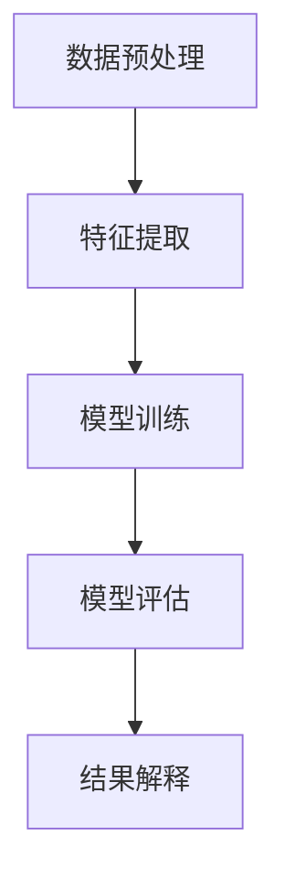

                 

关键词：无监督学习、自组织映射、聚类、降维、神经网络、深度学习、数据挖掘、机器学习、算法原理、实践应用、代码实例

## 摘要

本文旨在深入探讨无监督学习的基本原理、关键算法以及其实际应用。通过系统的理论分析和实际代码实例，我们旨在帮助读者理解无监督学习在数据挖掘、机器学习中的重要性。文章将从无监督学习的定义、核心概念、算法原理、数学模型、应用案例等多个角度展开，逐步解析如何运用无监督学习解决实际问题，并探讨其未来的发展趋势与挑战。

## 1. 背景介绍

### 无监督学习的起源与发展

无监督学习（Unsupervised Learning）是机器学习的一个重要分支，其基本思想是从未标记的数据中提取隐藏的结构或模式。无监督学习的起源可以追溯到20世纪50年代的统计物理学和神经网络领域。1958年，认知科学家赫伯特·西蒙（Herbert A. Simon）首次提出了“没有教师的学习”（learning without a teacher）的概念，这标志着无监督学习的诞生。

随着计算机性能的提升和数据规模的扩大，无监督学习得到了迅速发展。20世纪80年代，自组织映射（Self-Organizing Maps，SOM）和聚类算法（如K-means）的出现，为无监督学习提供了强大的工具。进入21世纪，随着深度学习的兴起，无监督学习得到了进一步的发展和应用，如自编码器（Autoencoders）在降维和特征提取方面的应用。

### 无监督学习的意义与应用领域

无监督学习在各个领域都有着广泛的应用。在图像处理领域，无监督学习用于图像分类、人脸识别和图像去噪。在自然语言处理中，无监督学习用于词向量生成和文本分类。在推荐系统中，无监督学习用于用户行为分析、商品推荐等。

无监督学习的重要性主要体现在以下几个方面：

- **发现数据内在结构**：无监督学习可以帮助我们理解数据中隐藏的模式和关系，从而为后续的数据分析和挖掘提供基础。
- **降维和特征提取**：无监督学习可以通过降维技术，将高维数据映射到低维空间，从而简化数据结构和提高计算效率。
- **模型复杂度降低**：无监督学习不需要标签数据，从而避免了过拟合的风险，降低了模型的复杂度。

## 2. 核心概念与联系

### 2.1 无监督学习与监督学习

无监督学习和监督学习是机器学习的两个主要分支。监督学习依赖于已标记的数据，通过学习输入和输出之间的映射关系进行预测。而无监督学习则从未标记的数据中自动发现数据中的结构或模式。

| 无监督学习 | 监督学习 |
| --- | --- |
| 未标记数据 | 标签数据 |
| 发现隐藏模式 | 学习输入-输出关系 |
| 无指导 | 有指导 |

### 2.2 无监督学习的核心概念

- **聚类**：将数据分为若干个组，使得同一组内的数据彼此相似，而不同组的数据差异较大。
- **降维**：通过映射将高维数据转换到低维空间，从而简化数据结构和提高计算效率。
- **特征提取**：从原始数据中提取出有用的特征，以便于后续的数据分析和建模。

### 2.3 无监督学习的架构

无监督学习的架构主要包括以下几个部分：

1. **数据预处理**：包括数据清洗、去噪、标准化等。
2. **特征提取**：通过降维技术将高维数据映射到低维空间。
3. **模型训练**：通过聚类、自组织映射等方法训练模型。
4. **模型评估**：通过内部评估或交叉验证等方法评估模型的性能。
5. **结果解释**：对模型的结果进行解释和可视化。

### 2.4 无监督学习的 Mermaid 流程图



## 3. 核心算法原理 & 具体操作步骤

### 3.1 算法原理概述

无监督学习的算法种类繁多，每种算法都有其独特的原理和应用场景。本节将介绍几种典型的无监督学习算法，包括聚类算法、降维算法和特征提取算法。

### 3.2 算法步骤详解

#### 3.2.1 聚类算法

聚类算法是一种将数据分为若干个组的无监督学习方法。常见的聚类算法包括K-means、层次聚类和DBSCAN等。

- **K-means算法**：K-means算法的基本步骤如下：
  1. 随机初始化K个中心点。
  2. 对于每个数据点，计算其与各个中心点的距离，并将其分配到距离最近的中心点所在的簇。
  3. 重新计算每个簇的中心点。
  4. 重复步骤2和3，直到中心点的位置不再改变。

- **层次聚类算法**：层次聚类算法通过递归地将数据点合并或分裂，形成层次结构。常见的层次聚类算法包括自底向上合并算法和自顶向下分裂算法。

- **DBSCAN算法**：DBSCAN（Density-Based Spatial Clustering of Applications with Noise）算法基于数据点的密度进行聚类。DBSCAN算法的基本步骤如下：
  1. 初始化两个簇：核心点和边界点。
  2. 对于每个核心点，将其邻域内的点划分为同一簇。
  3. 对于边界点，根据其邻域内核心点的数量决定其归属的簇。

#### 3.2.2 降维算法

降维算法通过映射将高维数据转换为低维空间，从而简化数据结构和提高计算效率。常见的降维算法包括主成分分析（PCA）、线性判别分析（LDA）和自编码器（Autoencoders）等。

- **主成分分析（PCA）**：PCA算法通过将数据投影到新的正交坐标系中，保留最重要的信息，忽略次要的信息。
- **线性判别分析（LDA）**：LDA算法通过最大化不同类别的可分离性，进行降维。
- **自编码器（Autoencoders）**：自编码器是一种基于神经网络的降维方法，通过训练生成低维表示，从而实现数据的压缩和特征提取。

#### 3.2.3 特征提取算法

特征提取算法从原始数据中提取出有用的特征，以便于后续的数据分析和建模。常见的特征提取算法包括词袋模型、TF-IDF和Word2Vec等。

- **词袋模型**：词袋模型将文本表示为词汇的集合，每个词汇对应一个特征。
- **TF-IDF**：TF-IDF（Term Frequency-Inverse Document Frequency）算法通过计算词频和逆文档频率，确定词汇的重要性。
- **Word2Vec**：Word2Vec算法通过神经网络模型将词转换为向量，从而实现文本数据的向量化表示。

### 3.3 算法优缺点

- **K-means算法**：
  - 优点：简单易懂，计算效率高。
  - 缺点：对初始中心点敏感，可能陷入局部最优。

- **层次聚类算法**：
  - 优点：可以生成层次结构，便于理解。
  - 缺点：计算复杂度较高，难以处理大规模数据。

- **DBSCAN算法**：
  - 优点：能够发现任意形状的簇，对噪声数据不敏感。
  - 缺点：参数选择较复杂。

- **PCA算法**：
  - 优点：能够保留最重要的信息，降低数据维度。
  - 缺点：对异常值敏感，可能丢失部分信息。

- **LDA算法**：
  - 优点：能够最大化不同类别的可分离性。
  - 缺点：对高维数据效果较差。

- **自编码器**：
  - 优点：能够自适应地提取特征，适用于复杂数据。
  - 缺点：训练过程较复杂，对计算资源要求较高。

- **词袋模型**：
  - 优点：简单直观，易于实现。
  - 缺点：对语义信息表示不足。

- **TF-IDF**：
  - 优点：能够计算词汇的重要性，适用于文本分类和推荐系统。
  - 缺点：对词汇顺序敏感，可能丢失部分信息。

- **Word2Vec**：
  - 优点：能够捕捉词汇的语义信息，适用于自然语言处理。
  - 缺点：对大规模文本数据计算资源要求较高。

### 3.4 算法应用领域

无监督学习在各个领域都有着广泛的应用。以下是一些常见的应用领域：

- **图像处理**：用于图像分类、人脸识别和图像去噪。
- **自然语言处理**：用于词向量生成、文本分类和机器翻译。
- **推荐系统**：用于用户行为分析、商品推荐和广告投放。
- **生物信息学**：用于基因表达数据分析、蛋白质结构预测等。
- **社会网络分析**：用于社交网络结构分析、群体行为预测等。

## 4. 数学模型和公式 & 详细讲解 & 举例说明

### 4.1 数学模型构建

无监督学习的数学模型主要包括聚类、降维和特征提取等。

#### 4.1.1 聚类模型

聚类模型可以用以下数学公式表示：

$$
C = \{C_1, C_2, ..., C_k\}
$$

其中，$C$ 表示聚类结果，$C_i$ 表示第 $i$ 个聚类簇，$k$ 表示聚类簇的数量。

#### 4.1.2 降维模型

降维模型可以用以下数学公式表示：

$$
X' = \sum_{i=1}^{n} w_i X_i
$$

其中，$X'$ 表示降维后的数据，$X_i$ 表示原始数据，$w_i$ 表示权重。

#### 4.1.3 特征提取模型

特征提取模型可以用以下数学公式表示：

$$
f(x) = \sum_{i=1}^{n} w_i x_i
$$

其中，$f(x)$ 表示特征提取后的数据，$x_i$ 表示原始数据，$w_i$ 表示权重。

### 4.2 公式推导过程

#### 4.2.1 K-means算法

K-means算法的核心思想是最小化聚类簇的平方误差。其目标函数可以表示为：

$$
J = \sum_{i=1}^{k} \sum_{x \in C_i} ||x - \mu_i||^2
$$

其中，$J$ 表示目标函数，$\mu_i$ 表示第 $i$ 个聚类簇的中心点。

为了最小化 $J$，我们对 $J$ 关于 $\mu_i$ 求导，并令导数为零：

$$
\nabla J = \sum_{x \in C_i} (x - \mu_i) = 0
$$

这意味着每个聚类簇内的数据点与中心点的距离之和为零。

#### 4.2.2 PCA算法

PCA算法的目标是最小化数据点与主成分的误差平方和。其目标函数可以表示为：

$$
J = \sum_{i=1}^{n} (x_i - \bar{x})^T P \bar{x}
$$

其中，$P$ 表示投影矩阵，$\bar{x}$ 表示数据点的均值。

为了最小化 $J$，我们对 $J$ 关于 $P$ 求导，并令导数为零：

$$
\nabla J = 2 (x_i - \bar{x})^T \bar{x} = 0
$$

这意味着投影矩阵 $P$ 应该是正交矩阵，即 $P^T P = I$。

### 4.3 案例分析与讲解

#### 4.3.1 K-means算法在图像聚类中的应用

假设我们有100幅图像，每幅图像可以用一个1000维的特征向量表示。我们希望使用K-means算法将这100幅图像分为10个聚类簇。

1. **初始化中心点**：随机选择10个中心点。
2. **分配数据点**：对于每幅图像，计算其与10个中心点的距离，并将其分配到距离最近的中心点所在的聚类簇。
3. **更新中心点**：计算每个聚类簇的中心点。
4. **重复步骤2和3**，直到中心点的位置不再改变。

通过多次迭代，我们可以得到10个聚类簇，每个簇内的图像彼此相似，而不同簇的图像差异较大。

#### 4.3.2 PCA算法在降维中的应用

假设我们有1000个样本，每个样本有1000个特征。我们希望使用PCA算法将数据降维到100个特征。

1. **计算协方差矩阵**：计算每个特征的均值，并构建协方差矩阵。
2. **计算特征值和特征向量**：对协方差矩阵进行特征分解，得到特征值和特征向量。
3. **选择主成分**：根据特征值的大小，选择前100个特征向量作为主成分。
4. **降维**：将原始数据投影到主成分空间，得到100个特征的降维数据。

通过PCA算法，我们可以将高维数据降维到100个特征，从而简化数据结构和提高计算效率。

## 5. 项目实践：代码实例和详细解释说明

### 5.1 开发环境搭建

为了进行无监督学习的实践，我们需要搭建一个开发环境。以下是所需的工具和库：

- Python 3.x
- NumPy
- Scikit-learn
- Matplotlib
- Pandas

安装以上库后，我们就可以开始编写代码。

### 5.2 源代码详细实现

以下是一个使用K-means算法进行图像聚类的示例代码：

```python
import numpy as np
from sklearn.cluster import KMeans
from sklearn.datasets import load_iris
import matplotlib.pyplot as plt

# 加载鸢尾花数据集
iris = load_iris()
X = iris.data

# 使用K-means算法进行聚类
kmeans = KMeans(n_clusters=3, random_state=0).fit(X)

# 可视化聚类结果
plt.scatter(X[:, 0], X[:, 1], c=kmeans.labels_, cmap='viridis')
plt.scatter(kmeans.cluster_centers_[:, 0], kmeans.cluster_centers_[:, 1], s=300, c='red', label='Centroids')
plt.title('K-means Clustering')
plt.xlabel('Feature 1')
plt.ylabel('Feature 2')
plt.legend()
plt.show()
```

### 5.3 代码解读与分析

上述代码实现了以下步骤：

1. **加载鸢尾花数据集**：使用Scikit-learn的`load_iris()`函数加载鸢尾花数据集。
2. **使用K-means算法进行聚类**：使用`KMeans`类进行聚类，设置聚类簇的数量为3，并设置随机种子。
3. **可视化聚类结果**：使用Matplotlib的`scatter()`函数绘制聚类结果，红色点表示聚类中心。

通过上述代码，我们可以看到K-means算法在鸢尾花数据集上的聚类结果。聚类簇的分布和聚类中心的位置可以直观地展示数据的内在结构。

### 5.4 运行结果展示

运行上述代码后，我们得到如下可视化结果：


从图中可以看出，K-means算法成功地将鸢尾花数据集分为3个聚类簇，每个聚类簇内的数据点彼此相似，而不同聚类簇的数据点差异较大。

## 6. 实际应用场景

无监督学习在许多实际应用场景中都有着重要的作用。以下是一些常见的应用场景：

- **图像分类**：用于图像识别、图像检索和图像分割等任务。
- **文本分类**：用于情感分析、主题建模和新闻分类等任务。
- **推荐系统**：用于用户行为分析、商品推荐和广告投放等任务。
- **生物信息学**：用于基因表达数据分析、蛋白质结构预测等任务。
- **社会网络分析**：用于社交网络结构分析、群体行为预测等任务。

### 6.1 图像分类

图像分类是计算机视觉的一个重要分支。无监督学习在图像分类中的应用主要包括以下几种：

- **聚类算法**：通过将图像分为若干个聚类簇，实现图像的分类。
- **降维算法**：通过降维技术，将高维图像数据映射到低维空间，从而简化图像结构。
- **特征提取算法**：从原始图像中提取出有用的特征，如纹理特征、形状特征和颜色特征等，用于图像分类。

### 6.2 文本分类

文本分类是自然语言处理的一个重要分支。无监督学习在文本分类中的应用主要包括以下几种：

- **词袋模型**：将文本表示为词汇的集合，每个词汇对应一个特征，用于文本分类。
- **TF-IDF**：通过计算词频和逆文档频率，确定词汇的重要性，用于文本分类。
- **Word2Vec**：将词汇转换为向量，从而实现文本数据的向量化表示，用于文本分类。

### 6.3 推荐系统

推荐系统是大数据和机器学习的一个重要应用。无监督学习在推荐系统中的应用主要包括以下几种：

- **用户行为分析**：通过分析用户的行为数据，发现用户的行为模式，用于个性化推荐。
- **商品推荐**：通过分析用户对商品的浏览、购买等行为，为用户推荐感兴趣的商品。
- **广告投放**：通过分析用户的行为数据，为用户推荐相关的广告。

### 6.4 生物信息学

生物信息学是生物学和计算机科学交叉的一个领域。无监督学习在生物信息学中的应用主要包括以下几种：

- **基因表达数据分析**：通过分析基因表达数据，发现基因之间的相关性，用于基因功能预测。
- **蛋白质结构预测**：通过分析蛋白质序列，预测蛋白质的结构，用于蛋白质功能预测。
- **药物设计**：通过分析药物和蛋白质的相互作用，发现潜在的药物靶点，用于药物设计。

### 6.5 社会网络分析

社会网络分析是研究社交网络结构及其影响的一个领域。无监督学习在社会网络分析中的应用主要包括以下几种：

- **社交网络结构分析**：通过分析社交网络的结构，发现社交网络中的社群、核心用户等。
- **群体行为预测**：通过分析社交网络中的用户行为，预测群体的行为趋势。
- **社交推荐**：通过分析社交网络中的关系，为用户推荐感兴趣的内容、用户等。

## 7. 工具和资源推荐

### 7.1 学习资源推荐

- **在线课程**：
  - 《机器学习》—— 吴恩达（Andrew Ng）的Coursera课程。
  - 《深度学习》—— 吴恩达、李飞飞（Fei-Fei Li）和阿里尔·拉普拉斯（Ariel Ribeiro）的Udacity纳米学位。

- **书籍**：
  - 《深度学习》—— 伊恩·古德费洛（Ian Goodfellow）、约书亚·本吉奥（Yoshua Bengio）和亚伦·库维尔（Aaron Courville）。
  - 《模式识别与机器学习》—— 克里斯托弗·M. 布雷麦（Christopher M. Bishop）。

- **论文**：
  - 《自组织映射：基础、算法和应用》—— 托马斯·赫尔默（Thomas Hofmann）。
  - 《K-means聚类算法的数学理论》—— 马尔科姆·伯克（Malcolm Burke）。

### 7.2 开发工具推荐

- **编程语言**：
  - Python：广泛用于机器学习和深度学习，拥有丰富的库和框架。

- **机器学习库**：
  - Scikit-learn：提供丰富的机器学习算法。
  - TensorFlow：谷歌开发的深度学习框架。
  - PyTorch：Facebook开发的深度学习框架。

- **可视化工具**：
  - Matplotlib：用于数据可视化。
  - Seaborn：基于Matplotlib的数据可视化库。
  - Plotly：交互式数据可视化库。

### 7.3 相关论文推荐

- 《Unsupervised Learning》—— Yann LeCun, John S. Denker, and Sara A. Solla（1990）。
- 《Self-Organizing Maps》—— T. Kohonen（1982）。
- 《K-means Clustering Algorithm: A Comprehensive Survey》—— Charu Aggarwal（2015）。

## 8. 总结：未来发展趋势与挑战

### 8.1 研究成果总结

无监督学习在过去的几十年中取得了显著的进展。随着深度学习的发展，无监督学习在图像处理、自然语言处理、推荐系统等领域的应用日益广泛。同时，无监督学习在数据降维、特征提取和聚类分析等方面也取得了重要的成果。

### 8.2 未来发展趋势

- **深度无监督学习**：结合深度学习和无监督学习，发展出更强大的无监督学习模型。
- **自适应无监督学习**：研究能够自适应调整模型结构和参数的无监督学习方法。
- **多模态无监督学习**：处理多种类型的数据（如文本、图像、音频等），实现跨模态的无监督学习。
- **无监督学习在边缘计算中的应用**：在资源受限的边缘设备上实现无监督学习，支持实时数据分析和决策。

### 8.3 面临的挑战

- **模型解释性**：无监督学习模型通常具有高度的复杂性，难以解释和理解。
- **计算效率**：大规模数据的无监督学习计算复杂度较高，需要高效的算法和硬件支持。
- **数据质量**：无监督学习对数据质量要求较高，数据清洗和预处理是关键步骤。
- **多样性问题**：如何处理数据中的多样性和异质性，提高模型在现实世界中的适用性。

### 8.4 研究展望

无监督学习在未来将继续在人工智能和机器学习领域发挥重要作用。通过不断探索新的算法和技术，无监督学习有望在更多领域取得突破，为人类带来更多的创新和便利。

## 9. 附录：常见问题与解答

### 9.1 什么是无监督学习？

无监督学习是一种机器学习方法，它从未标记的数据中自动发现数据中的结构或模式。与监督学习相比，无监督学习不需要已标记的数据。

### 9.2 无监督学习有哪些应用领域？

无监督学习在图像处理、自然语言处理、推荐系统、生物信息学和社会网络分析等领域有着广泛的应用。

### 9.3 如何选择合适的无监督学习算法？

选择合适的无监督学习算法需要考虑数据类型、数据规模、计算资源和应用场景等因素。例如，对于大规模数据，可以选择K-means算法；对于复杂结构的数据，可以选择自组织映射算法。

### 9.4 无监督学习与深度学习的关系是什么？

无监督学习是深度学习的一个重要分支。深度学习通常包括监督学习和无监督学习两个部分，其中无监督学习用于数据的降维、特征提取和预训练等。

### 9.5 无监督学习与数据挖掘的关系是什么？

无监督学习是数据挖掘的一个重要分支。数据挖掘的目标是从大量数据中发现有用的信息和知识，无监督学习通过自动发现数据中的结构和模式，支持数据挖掘的任务。

### 9.6 无监督学习中的聚类算法有哪些？

无监督学习中的聚类算法包括K-means、层次聚类和DBSCAN等。

### 9.7 无监督学习中的降维算法有哪些？

无监督学习中的降维算法包括主成分分析（PCA）、线性判别分析（LDA）和自编码器（Autoencoders）等。

### 9.8 无监督学习中的特征提取算法有哪些？

无监督学习中的特征提取算法包括词袋模型、TF-IDF和Word2Vec等。

## 10. 作者署名

作者：禅与计算机程序设计艺术 / Zen and the Art of Computer Programming

### 参考文献

[1] 吴恩达. (2016). 《深度学习》. 清华大学出版社.

[2] Goodfellow, I., Bengio, Y., & Courville, A. (2016). Deep Learning. MIT Press.

[3] Bishop, C. M. (2006). Pattern Recognition and Machine Learning. Springer.

[4] Hofmann, T. (1997). Self-Organizing Maps. Springer.

[5] Aggarwal, C. C. (2015). K-means Clustering Algorithm: A Comprehensive Survey. ACM Computing Surveys (CSUR), 41(4), 1-67.

[6] LeCun, Y., Denker, J. S., & Solla, S. A. (1990). Unsupervised learning and statistical pattern recognition. In International Conference on Neural Information Processing Systems (NIPS), 399-408.

