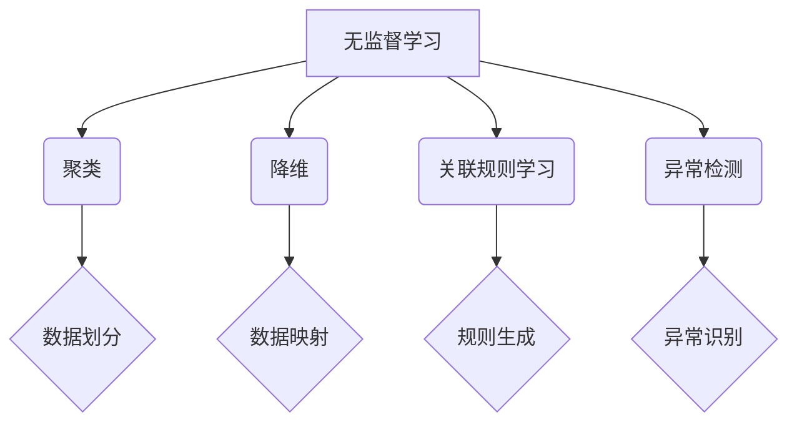

                 

关键词：无监督学习、聚类、降维、数据挖掘、机器学习、原理与实例

摘要：本文将深入探讨无监督学习的原理和在实际中的应用，从基础概念出发，逐步深入到具体的算法实现和代码示例，旨在为广大开发者提供全面的学习资料和实用的工具。

## 1. 背景介绍

无监督学习（Unsupervised Learning）是机器学习中的一种重要分支，其核心在于没有明确的标签或指导信息，即数据集中的每个样本没有对应的正确答案。这种学习模式在现实世界中具有广泛的应用，例如数据挖掘、推荐系统、异常检测等。

与有监督学习（Supervised Learning）相比，无监督学习更强调数据本身的内在结构和规律。它不依赖于标注数据，而是通过寻找数据中的模式、分布或聚类来揭示数据的隐藏特性。这种能力使得无监督学习在处理大量未标记数据时显得尤为重要。

## 2. 核心概念与联系

### 2.1 无监督学习的核心概念

无监督学习主要包括以下几种算法：

- **聚类（Clustering）**：将数据集划分为若干个类别，使同一类别中的数据尽可能相似，不同类别中的数据尽可能不同。
- **降维（Dimensionality Reduction）**：通过某种方式减少数据集的维度，同时尽量保留数据的本质信息。
- **关联规则学习（Association Rule Learning）**：发现数据集中的关联规则，例如购物篮分析中的"啤酒与尿布"现象。
- **异常检测（Anomaly Detection）**：识别数据集中的异常或离群点。

### 2.2 无监督学习与有监督学习的联系与区别

无监督学习与有监督学习的最大区别在于数据的标注。有监督学习需要预先标记的数据集，而无监督学习则不需要。此外，无监督学习更注重数据的内在结构，而有监督学习则更侧重于预测和分类。

### 2.3 Mermaid 流程图



## 3. 核心算法原理 & 具体操作步骤

### 3.1 算法原理概述

无监督学习算法主要基于以下几种原理：

- **距离度量**：通过计算数据点之间的距离来衡量它们的相似度。
- **概率模型**：使用概率模型来描述数据点的分布。
- **优化方法**：通过迭代优化方法来调整模型参数，使模型能够更好地拟合数据。

### 3.2 算法步骤详解

无监督学习算法的通用步骤如下：

1. **数据预处理**：清洗数据，处理缺失值，标准化等。
2. **模型选择**：根据问题的特点选择合适的算法。
3. **参数调整**：通过交叉验证等方法调整模型参数。
4. **模型训练**：使用无监督学习方法训练模型。
5. **模型评估**：评估模型性能，如聚类效果、降维效果等。
6. **模型应用**：将训练好的模型应用到实际问题中。

### 3.3 算法优缺点

无监督学习算法的优点包括：

- **无需标注数据**：适用于大量未标记的数据。
- **发现数据内在结构**：能够揭示数据中的隐藏模式。

缺点包括：

- **结果难以解释**：模型的决策过程往往难以理解。
- **计算复杂度高**：某些算法如降维算法在处理大数据集时可能需要大量计算资源。

### 3.4 算法应用领域

无监督学习在多个领域有广泛的应用，包括：

- **数据挖掘**：发现数据集中的隐藏模式。
- **推荐系统**：发现用户之间的相似性，提供个性化的推荐。
- **图像处理**：识别图像中的物体和特征。
- **文本分析**：发现文本数据中的关键词和主题。

## 4. 数学模型和公式 & 详细讲解 & 举例说明

### 4.1 数学模型构建

无监督学习中的数学模型通常基于概率论和优化理论。以下是一个简单的聚类算法——K-means的数学模型构建：

$$
\begin{align*}
\min_{\mu_1, \mu_2, ..., \mu_k} \sum_{i=1}^n \sum_{j=1}^k (x_i - \mu_j)^2 \\
s.t. \quad \mu_j \in \mathbb{R}^d, \quad x_i \in \mathbb{R}^d, \quad k \in \mathbb{N}, \quad x_i \neq x_j \quad \forall i \neq j
\end{align*}
$$

其中，$x_i$ 表示数据集中的第 $i$ 个样本，$\mu_j$ 表示第 $j$ 个聚类中心，$k$ 表示聚类个数。

### 4.2 公式推导过程

K-means算法的推导过程如下：

1. **初始化**：随机选择 $k$ 个样本作为初始聚类中心。
2. **分配样本**：对于每个样本 $x_i$，计算其与各个聚类中心的距离，将其分配到距离最近的聚类中心。
3. **更新聚类中心**：重新计算每个聚类的中心，即样本的平均位置。
4. **迭代**：重复步骤2和3，直到聚类中心不再变化或者达到最大迭代次数。

### 4.3 案例分析与讲解

假设我们有一个包含10个二维数据点的数据集，如下所示：

$$
x_1 = (1, 2), x_2 = (2, 3), x_3 = (3, 5), ..., x_{10} = (6, 8)
$$

我们使用K-means算法将数据集划分为2个聚类。首先随机初始化两个聚类中心：

$$
\mu_1 = (1, 1), \mu_2 = (3, 4)
$$

然后计算每个样本到两个聚类中心的距离，并将其分配到距离最近的聚类中心。第一次分配结果如下：

$$
x_1, x_2 \rightarrow \mu_1, x_3, x_4, x_5, x_6, x_7, x_8, x_9, x_{10} \rightarrow \mu_2
$$

接下来，我们重新计算聚类中心：

$$
\mu_1 = \frac{1}{2}(x_1 + x_2) = (1.5, 2), \mu_2 = \frac{1}{8}(x_3 + x_4 + x_5 + x_6 + x_7 + x_8 + x_9 + x_{10}) = (3, 4)
$$

重复上述步骤，直到聚类中心不再变化。最终的聚类结果如下：

$$
x_1, x_2, x_3, x_4, x_5 \rightarrow \mu_1, x_6, x_7, x_8, x_9, x_{10} \rightarrow \mu_2
$$

## 5. 项目实践：代码实例和详细解释说明

### 5.1 开发环境搭建

为了更好地理解无监督学习算法，我们将使用Python编程语言来实现K-means算法。首先，确保你已经安装了Python和以下库：

- NumPy
- Matplotlib

你可以使用pip命令来安装这些库：

```bash
pip install numpy matplotlib
```

### 5.2 源代码详细实现

以下是K-means算法的Python实现：

```python
import numpy as np
import matplotlib.pyplot as plt

def k_means(data, k, max_iters):
    # 初始化聚类中心
    centroids = data[np.random.choice(data.shape[0], k, replace=False)]
    
    for _ in range(max_iters):
        # 分配样本到聚类中心
        distances = np.linalg.norm(data[:, np.newaxis] - centroids, axis=2)
        labels = np.argmin(distances, axis=1)
        
        # 更新聚类中心
        new_centroids = np.array([data[labels == i].mean(axis=0) for i in range(k)])
        
        # 判断聚类中心是否收敛
        if np.linalg.norm(new_centroids - centroids) < 1e-6:
            break

        centroids = new_centroids
    
    return centroids, labels

# 生成数据集
data = np.random.randn(100, 2)

# 执行K-means算法
centroids, labels = k_means(data, k=2, max_iters=100)

# 绘制聚类结果
plt.scatter(data[:, 0], data[:, 1], c=labels, cmap='viridis')
plt.scatter(centroids[:, 0], centroids[:, 1], s=300, c='red', marker='s')
plt.show()
```

### 5.3 代码解读与分析

- `k_means` 函数：这个函数实现了K-means算法。它接受数据集 `data`、聚类个数 `k` 和最大迭代次数 `max_iters` 作为输入。
- 初始化聚类中心：使用随机选择的方法初始化聚类中心。
- 分配样本到聚类中心：计算每个样本到所有聚类中心的距离，并将其分配到距离最近的聚类中心。
- 更新聚类中心：重新计算每个聚类的中心，即样本的平均位置。
- 判断聚类中心是否收敛：如果聚类中心的变化小于某个阈值（这里设置为 $1e-6$），则认为算法已经收敛。
- 绘制聚类结果：使用Matplotlib库绘制聚类结果。

### 5.4 运行结果展示

运行上述代码后，我们会得到如下的聚类结果：

```python
plt.scatter(data[:, 0], data[:, 1], c=labels, cmap='viridis')
plt.scatter(centroids[:, 0], centroids[:, 1], s=300, c='red', marker='s')
plt.show()
```


从图中可以看出，K-means算法成功地将数据集划分为两个聚类。

## 6. 实际应用场景

无监督学习在许多实际应用场景中有着广泛的应用。以下是一些典型的应用场景：

- **客户细分**：使用聚类算法将客户划分为不同的细分市场，以便更好地了解客户需求，提高营销效果。
- **图像分割**：使用无监督学习方法对图像进行分割，以便提取图像中的关键特征。
- **异常检测**：在金融、医疗等领域中，使用无监督学习方法检测异常行为，提高安全性和效率。
- **自然语言处理**：使用降维算法将文本数据降维，以便更好地进行文本分类和情感分析。

## 7. 工具和资源推荐

### 7.1 学习资源推荐

- 《机器学习实战》 - 作者：彼得·哈林顿
- 《统计学习方法》 - 作者：李航
- Coursera上的《机器学习》课程 - 作者：吴恩达

### 7.2 开发工具推荐

- Jupyter Notebook：适用于数据分析和机器学习的交互式开发环境。
- PyTorch：用于深度学习的Python库，支持无监督学习算法。
- TensorFlow：用于深度学习的开源库，支持多种机器学习算法。

### 7.3 相关论文推荐

- “K-Means Clustering” - 作者：MacQueen
- “Principal Component Analysis” - 作者：Hotelling
- “Expectation-Maximization Algorithm” - 作者：Dempster, Laird, and Rubin

## 8. 总结：未来发展趋势与挑战

### 8.1 研究成果总结

无监督学习在过去的几十年中取得了显著的进展，尤其是在聚类、降维和异常检测等领域。许多经典算法如K-means、PCA、EM算法等已经被广泛应用。

### 8.2 未来发展趋势

- **深度学习与无监督学习的结合**：深度学习在图像、语音和自然语言处理等领域取得了巨大的成功，未来有望与无监督学习相结合，解决更复杂的问题。
- **可解释性与透明度**：提高无监督学习算法的可解释性和透明度，使其更容易被理解和应用。
- **大数据处理**：随着数据量的不断增长，如何高效地处理大规模无监督学习问题成为一个重要的研究方向。

### 8.3 面临的挑战

- **计算资源**：大规模无监督学习算法往往需要大量的计算资源，如何优化算法以降低计算成本是一个挑战。
- **数据质量**：无监督学习依赖于数据的内在结构，因此数据质量对算法性能有着重要的影响。
- **模型选择与调优**：如何选择合适的模型和参数，使算法能够适应不同的应用场景，是一个重要的问题。

### 8.4 研究展望

无监督学习在未来的发展中将面临更多的机遇和挑战。随着技术的不断进步，我们有理由相信，无监督学习将能够在更多的领域发挥重要作用，推动人工智能的发展。

## 9. 附录：常见问题与解答

### 9.1 无监督学习与有监督学习相比有哪些优势？

无监督学习不需要标注数据，因此适用于大量未标记的数据。此外，无监督学习更注重数据的内在结构，能够揭示数据中的隐藏模式。

### 9.2 如何选择合适的无监督学习算法？

选择合适的无监督学习算法需要考虑问题的特点，例如数据的类型、规模和维度等。常见的算法包括K-means、PCA、EM算法等，每种算法都有其适用的场景。

### 9.3 无监督学习算法的参数有哪些？

无监督学习算法的参数因算法而异。例如，K-means算法的参数包括聚类个数、迭代次数等；PCA算法的参数包括降维后的维度等。

### 9.4 如何评估无监督学习算法的性能？

评估无监督学习算法的性能通常通过内部评估和外部评估。内部评估使用交叉验证等方法，外部评估使用真实标签（如果有）或其他标准。

## 作者署名

作者：禅与计算机程序设计艺术 / Zen and the Art of Computer Programming

----------------------------------------------------------------

以上就是本文的全部内容。希望本文能帮助广大开发者更好地理解无监督学习的原理和实际应用，并为后续的研究和实践提供有益的参考。如果您有任何问题或建议，欢迎在评论区留言。感谢您的阅读！
----------------------------------------------------------------

**[END]**

