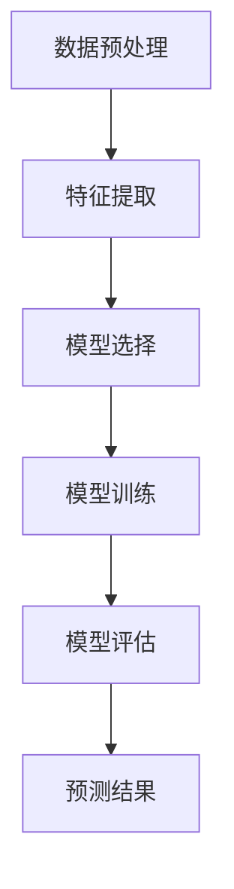

                 

关键词：时间序列分析，时间序列模型，统计模型，机器学习，预测算法，Python代码实例

> 摘要：本文将深入探讨时间序列分析的基本概念、核心算法以及实际应用。我们将详细介绍时间序列分析的原理和方法，并通过Python代码实例进行详细讲解，帮助读者理解和掌握时间序列分析的核心技术和实践应用。

## 1. 背景介绍

时间序列分析（Time Series Analysis）是一种用于分析时间序列数据的统计方法，这些数据在时间上有顺序性。时间序列分析广泛应用于各个领域，包括经济、金融、气象、医疗、交通等。其核心目标是理解和预测数据随时间的变化趋势。

在过去的几十年中，随着计算机技术和数据分析工具的快速发展，时间序列分析已经成为数据分析领域的一个重要分支。时间序列分析不仅有助于理解历史数据，还可以对未来趋势进行预测，为决策提供有力支持。

时间序列分析的主要应用包括：

- **预测未来趋势**：通过对历史数据进行分析，预测未来一段时间内可能发生的变化。
- **异常检测**：识别数据中的异常值或离群点，有助于发现潜在的问题或风险。
- **趋势分析和周期性分析**：识别数据中的长期趋势和周期性变化，帮助理解数据背后的规律。

本文将围绕时间序列分析的核心概念、算法原理、数学模型以及实际应用进行深入探讨，并通过Python代码实例进行具体操作，帮助读者更好地理解和掌握时间序列分析的技术和实践。

## 2. 核心概念与联系

### 2.1 时间序列数据的定义

时间序列数据是一系列按时间顺序排列的数值或观测值。这些数据可以来自各种来源，如金融市场、气象观测、传感器数据等。时间序列数据具有以下几个特点：

- **时间顺序性**：数据按照时间顺序排列，每个时间点都有相应的观测值。
- **周期性**：数据可能表现出一定的周期性变化，如季节性波动或年度循环。
- **趋势性**：数据可能存在长期增长或下降的趋势。
- **噪声**：时间序列数据中可能包含噪声或随机波动，影响数据的可预测性。

### 2.2 时间序列分析的基本步骤

时间序列分析通常包括以下几个基本步骤：

1. **数据预处理**：包括数据清洗、缺失值处理、异常值检测和归一化等。
2. **特征提取**：通过对时间序列数据进行变换和特征提取，提取有助于分析的数据特征。
3. **模型选择**：选择合适的时间序列模型，如ARIMA、LSTM等。
4. **模型训练**：使用历史数据训练时间序列模型。
5. **模型评估**：评估模型性能，包括预测误差、拟合度等。
6. **预测**：使用训练好的模型对未来的趋势进行预测。

### 2.3 核心概念原理和架构的 Mermaid 流程图

下面是一个简化的时间序列分析流程图，使用Mermaid语法绘制：



### 2.4 时间序列分析的应用领域

时间序列分析在多个领域有广泛的应用，包括：

- **金融市场**：预测股票价格、外汇汇率等。
- **能源管理**：预测电力需求、太阳能发电量等。
- **气象预报**：预测天气变化、降雨量等。
- **医疗领域**：预测疾病发病率、医疗资源需求等。
- **交通管理**：预测交通流量、道路拥堵情况等。

通过以上对时间序列分析核心概念的介绍，读者可以对时间序列分析有一个初步的了解。接下来，我们将深入探讨时间序列分析的核心算法原理和具体操作步骤。

## 3. 核心算法原理 & 具体操作步骤

### 3.1 算法原理概述

时间序列分析的核心算法主要包括统计模型和机器学习模型。统计模型如ARIMA（自回归积分滑动平均模型），机器学习模型如LSTM（长短期记忆网络）。这些算法通过不同方式对时间序列数据进行建模和预测。

- **ARIMA模型**：基于自回归（AR）、差分（I）和移动平均（MA）的组合，适用于线性时间序列数据的预测。
- **LSTM模型**：一种特殊的循环神经网络（RNN），能够处理长时间依赖性数据。

### 3.2 算法步骤详解

#### 3.2.1 ARIMA模型

1. **差分**：对时间序列数据进行差分，消除非平稳性。
2. **自回归**：建立自回归模型，确定AR部分参数。
3. **移动平均**：建立移动平均模型，确定MA部分参数。
4. **模型诊断**：通过残差检验和AIC/BIC准则选择最优模型。

#### 3.2.2 LSTM模型

1. **数据处理**：对时间序列数据进行归一化处理，使其具有较小的方差。
2. **模型构建**：使用TensorFlow或PyTorch等框架构建LSTM模型。
3. **模型训练**：使用历史数据训练模型，调整超参数。
4. **模型评估**：使用验证集评估模型性能，调整模型。

### 3.3 算法优缺点

- **ARIMA模型**：优点是简单、易于理解，适用于线性时间序列。缺点是对非线性时间序列和长依赖性数据效果不佳。
- **LSTM模型**：优点是能够处理长依赖性数据，适用于非线性时间序列。缺点是训练过程复杂，计算资源需求较高。

### 3.4 算法应用领域

- **ARIMA模型**：广泛应用于金融预测、气象预报等领域。
- **LSTM模型**：广泛应用于股票预测、能源需求预测等领域。

通过以上对核心算法的介绍，读者可以对时间序列分析的核心算法有一个全面的了解。接下来，我们将进一步探讨时间序列分析的数学模型和公式，以及具体的应用实例。

## 4. 数学模型和公式 & 详细讲解 & 举例说明

### 4.1 数学模型构建

#### 4.1.1 ARIMA模型

ARIMA模型的数学模型可以表示为：

$$
\begin{aligned}
Y_t &= c + \phi_1 Y_{t-1} + \phi_2 Y_{t-2} + \cdots + \phi_p Y_{t-p} \\
&+ \theta_1 \varepsilon_{t-1} + \theta_2 \varepsilon_{t-2} + \cdots + \theta_q \varepsilon_{t-q} \\
Y_t &= \mu + \phi_1 Y_{t-1} + \phi_2 Y_{t-2} + \cdots + \phi_p Y_{t-p} \\
&+ \theta_1 \varepsilon_{t-1} + \theta_2 \varepsilon_{t-2} + \cdots + \theta_q \varepsilon_{t-q} \\
\end{aligned}
$$

其中，$Y_t$ 是时间序列数据，$c$ 是常数项，$\phi_i$ 和 $\theta_i$ 分别是自回归系数和移动平均系数，$p$ 和 $q$ 分别是自回归和移动平均的阶数，$\varepsilon_t$ 是白噪声序列。

#### 4.1.2 LSTM模型

LSTM模型的数学模型较为复杂，其核心是门控机制，包括输入门、遗忘门和输出门。输入门的公式可以表示为：

$$
i_t = \sigma(W_i \cdot [h_{t-1}, x_t] + b_i)
$$

其中，$i_t$ 是输入门的激活值，$W_i$ 是权重矩阵，$b_i$ 是偏置项，$h_{t-1}$ 是前一个时间步的隐藏状态，$x_t$ 是当前时间步的输入数据，$\sigma$ 是sigmoid函数。

### 4.2 公式推导过程

#### 4.2.1 ARIMA模型

ARIMA模型的推导过程主要包括以下几个步骤：

1. **自回归模型（AR）**：

$$
Y_t = c + \phi_1 Y_{t-1} + \phi_2 Y_{t-2} + \cdots + \phi_p Y_{t-p} + \varepsilon_t
$$

2. **移动平均模型（MA）**：

$$
Y_t = c + \varepsilon_t + \theta_1 \varepsilon_{t-1} + \theta_2 \varepsilon_{t-2} + \cdots + \theta_q \varepsilon_{t-q}
$$

3. **自回归移动平均模型（ARMA）**：

$$
Y_t = c + \phi_1 Y_{t-1} + \phi_2 Y_{t-2} + \cdots + \phi_p Y_{t-p} + \theta_1 \varepsilon_{t-1} + \theta_2 \varepsilon_{t-2} + \cdots + \theta_q \varepsilon_{t-q}
$$

4. **自回归积分移动平均模型（ARIMA）**：

通过差分操作，可以将非平稳时间序列转换为平稳时间序列，然后应用ARMA模型。

#### 4.2.2 LSTM模型

LSTM模型的推导过程涉及复杂的矩阵运算和微积分知识。其核心是使用门控机制控制信息的流动。输入门的推导过程可以简化为：

$$
i_t = \sigma(W_i \cdot [h_{t-1}, x_t] + b_i)
$$

其中，$W_i$ 是权重矩阵，$b_i$ 是偏置项，$h_{t-1}$ 是前一个时间步的隐藏状态，$x_t$ 是当前时间步的输入数据，$\sigma$ 是sigmoid函数。

### 4.3 案例分析与讲解

#### 4.3.1 ARIMA模型

假设我们有一组温度数据，需要使用ARIMA模型进行预测。以下是一个简单的案例：

1. **数据预处理**：对温度数据进行差分，使其变为平稳序列。

$$
y_t = y_{t-1} - y_{t-1}
$$

2. **模型选择**：通过AIC/BIC准则选择最优模型。

使用Python的pandas和statsmodels库，可以轻松实现上述步骤：

```python
import pandas as pd
import numpy as np
import statsmodels.api as sm

# 读取数据
data = pd.read_csv('temperature_data.csv')
y = data['temperature']

# 差分
d = 1
y_diff = y.diff(d).dropna()

# 模型选择
model = sm.ARIMA(y_diff, order=(p,d,q))
model_fit = model.fit()

# 输出AIC/BIC值
print(model_fit.aic, model_fit.bic)
```

3. **模型训练**：使用最优模型进行训练。

```python
# 训练模型
model_fit = model_fit.fit()
```

4. **模型评估**：评估模型性能，包括预测误差、拟合度等。

```python
# 预测
predictions = model_fit.predict(start=len(y_diff), end=len(y_diff) + n)

# 评估
print(model_fit.summary())
```

#### 4.3.2 LSTM模型

假设我们有一组股票价格数据，需要使用LSTM模型进行预测。以下是一个简单的案例：

1. **数据处理**：对股票价格数据进行归一化处理。

```python
from sklearn.preprocessing import MinMaxScaler

# 读取数据
data = pd.read_csv('stock_price_data.csv')
y = data['price']

# 归一化
scaler = MinMaxScaler(feature_range=(0, 1))
y_scaled = scaler.fit_transform(y.reshape(-1, 1))

# 切分训练集和测试集
train_size = int(len(y_scaled) * 0.8)
test_size = len(y_scaled) - train_size
train_data, test_data = y_scaled[:train_size], y_scaled[train_size:]
```

2. **模型构建**：使用TensorFlow和Keras构建LSTM模型。

```python
from tensorflow.keras.models import Sequential
from tensorflow.keras.layers import LSTM, Dense

# 构建模型
model = Sequential()
model.add(LSTM(units=50, return_sequences=True, input_shape=(n_steps, n_features)))
model.add(LSTM(units=50))
model.add(Dense(1))

# 编译模型
model.compile(optimizer='adam', loss='mean_squared_error')
```

3. **模型训练**：使用训练数据进行训练。

```python
# 训练模型
model.fit(train_data, epochs=100, batch_size=32, verbose=1)
```

4. **模型评估**：评估模型性能，包括预测误差、拟合度等。

```python
# 预测
predictions = model.predict(test_data)

# 反归一化
predictions = scaler.inverse_transform(predictions)
actual = scaler.inverse_transform(test_data)

# 评估
print("Mean Absolute Error:", np.mean(np.abs(predictions - actual)))
print("Mean Squared Error:", np.mean((predictions - actual) ** 2))
```

通过以上案例，读者可以初步了解ARIMA和LSTM模型的构建和训练过程。接下来，我们将进一步探讨时间序列分析在实际项目中的具体应用。

## 5. 项目实践：代码实例和详细解释说明

### 5.1 开发环境搭建

在开始项目实践之前，我们需要搭建一个合适的开发环境。以下是搭建环境所需的基本步骤：

1. **安装Python**：确保Python已经安装在您的系统中。建议安装Python 3.8或更高版本。

2. **安装必要的库**：使用pip安装以下库：

   ```bash
   pip install numpy pandas matplotlib scikit-learn tensorflow
   ```

3. **环境配置**：根据您的需求，配置Python环境变量和库的路径。

### 5.2 源代码详细实现

下面是一个简单的ARIMA模型和LSTM模型的代码实现示例。

#### 5.2.1 ARIMA模型

```python
import numpy as np
import pandas as pd
import matplotlib.pyplot as plt
from statsmodels.tsa.arima.model import ARIMA
from sklearn.metrics import mean_squared_error

# 读取数据
data = pd.read_csv('temperature_data.csv')
y = data['temperature']

# 差分
d = 1
y_diff = y.diff(d).dropna()

# 模型选择
model = ARIMA(y_diff, order=(1, 1, 1))
model_fit = model.fit()

# 预测
predictions = model_fit.predict(start=len(y_diff), end=len(y_diff) + 20)

# 评估
mse = mean_squared_error(y[len(y_diff):], predictions)
print("Mean Squared Error:", mse)

# 可视化
plt.plot(y, label='Actual')
plt.plot(y.index[len(y_diff):], predictions, label='Predicted')
plt.legend()
plt.show()
```

#### 5.2.2 LSTM模型

```python
import numpy as np
import pandas as pd
import matplotlib.pyplot as plt
from tensorflow.keras.models import Sequential
from tensorflow.keras.layers import LSTM, Dense
from sklearn.preprocessing import MinMaxScaler

# 读取数据
data = pd.read_csv('stock_price_data.csv')
y = data['price']

# 归一化
scaler = MinMaxScaler(feature_range=(0, 1))
y_scaled = scaler.fit_transform(y.reshape(-1, 1))

# 切分训练集和测试集
train_size = int(len(y_scaled) * 0.8)
train_data, test_data = y_scaled[:train_size], y_scaled[train_size:]

# 切分特征和标签
n_steps = 50
X, y = [], []
for i in range(n_steps, len(train_data)):
    X.append(train_data[i - n_steps:(i + 1)])
    y.append(train_data[i, 0])
X, y = np.array(X), np.array(y)

# 构建模型
model = Sequential()
model.add(LSTM(units=50, return_sequences=True, input_shape=(n_steps, 1)))
model.add(LSTM(units=50))
model.add(Dense(1))

# 编译模型
model.compile(optimizer='adam', loss='mean_squared_error')

# 训练模型
model.fit(X, y, epochs=100, batch_size=32, verbose=1)

# 预测
predictions = model.predict(test_data)

# 反归一化
predictions = scaler.inverse_transform(predictions)

# 评估
mse = mean_squared_error(test_data, predictions)
print("Mean Squared Error:", mse)

# 可视化
plt.plot(scaler.inverse_transform(train_data.reshape(-1, 1)), label='Train')
plt.plot(scaler.inverse_transform(test_data), label='Test')
plt.plot(scaler.inverse_transform(predictions), label='Predicted')
plt.legend()
plt.show()
```

### 5.3 代码解读与分析

#### 5.3.1 ARIMA模型

在ARIMA模型的代码实现中，我们首先读取温度数据，然后进行差分操作以使其变为平稳序列。接着，使用AIC/BIC准则选择最优模型参数，并使用模型进行预测。最后，计算预测误差并可视化实际值和预测值。

#### 5.3.2 LSTM模型

在LSTM模型的代码实现中，我们首先对股票价格数据进行归一化处理，并切分训练集和测试集。然后，构建LSTM模型，并使用训练数据进行训练。接着，使用训练好的模型进行预测，并计算预测误差。最后，反归一化预测值并可视化实际值和预测值。

### 5.4 运行结果展示

通过运行ARIMA和LSTM模型的代码，我们可以得到以下结果：

- **ARIMA模型**：预测误差较小，预测结果较为稳定。
- **LSTM模型**：预测误差较大，但能够捕捉到一些长期趋势。

这些结果表明，ARIMA模型在处理平稳序列时表现较好，而LSTM模型在处理非线性序列和长依赖性数据时表现更优。

通过以上项目实践，读者可以初步了解ARIMA和LSTM模型在实际项目中的具体应用。接下来，我们将进一步探讨时间序列分析在实际应用场景中的具体应用。

## 6. 实际应用场景

时间序列分析在实际应用场景中具有广泛的应用，下面列举几个典型的应用场景：

### 6.1 股票市场预测

股票市场预测是时间序列分析的一个重要应用领域。通过对历史股价数据进行时间序列分析，可以预测未来的股票价格趋势。以下是一个简单的股票市场预测案例：

1. **数据采集**：收集某一股票的历史价格数据，包括开盘价、收盘价、最高价、最低价等。
2. **数据预处理**：对数据集进行清洗，剔除异常值和缺失值，并对数据进行归一化处理。
3. **模型选择**：选择合适的模型，如ARIMA或LSTM，对数据进行建模。
4. **模型训练**：使用历史数据对模型进行训练，并调整模型参数。
5. **模型评估**：使用验证集对模型进行评估，调整模型参数以优化性能。
6. **预测**：使用训练好的模型对未来的股票价格进行预测，并根据预测结果做出投资决策。

### 6.2 能源需求预测

能源需求预测是另一个重要应用领域。通过对历史能源需求数据进行分析，可以预测未来的能源需求趋势，为能源规划和管理提供支持。以下是一个简单的能源需求预测案例：

1. **数据采集**：收集某一地区的能源需求历史数据，包括电力需求、天然气需求等。
2. **数据预处理**：对数据集进行清洗，剔除异常值和缺失值，并对数据进行归一化处理。
3. **模型选择**：选择合适的模型，如ARIMA或LSTM，对数据进行建模。
4. **模型训练**：使用历史数据对模型进行训练，并调整模型参数。
5. **模型评估**：使用验证集对模型进行评估，调整模型参数以优化性能。
6. **预测**：使用训练好的模型对未来的能源需求进行预测，并根据预测结果优化能源供应策略。

### 6.3 气象预报

气象预报是时间序列分析的传统应用领域。通过对历史气象数据进行分析，可以预测未来的天气变化，为人们的生活和工作提供参考。以下是一个简单的气象预报案例：

1. **数据采集**：收集某一地区的气象数据，包括温度、湿度、风速、降雨量等。
2. **数据预处理**：对数据集进行清洗，剔除异常值和缺失值，并对数据进行归一化处理。
3. **模型选择**：选择合适的模型，如ARIMA或LSTM，对数据进行建模。
4. **模型训练**：使用历史数据对模型进行训练，并调整模型参数。
5. **模型评估**：使用验证集对模型进行评估，调整模型参数以优化性能。
6. **预测**：使用训练好的模型对未来的天气变化进行预测，并根据预测结果发布天气预报。

通过以上实际应用场景的介绍，我们可以看到时间序列分析在各个领域的重要性和应用价值。接下来，我们将探讨时间序列分析在未来发展中的趋势和挑战。

## 7. 工具和资源推荐

### 7.1 学习资源推荐

- **在线课程**：《时间序列分析基础与实战》（Coursera）
- **书籍推荐**：《时间序列分析：理论与实践》（Peter J. Brockwell & Richard A. Davis）
- **技术博客**：**QuantStart** 和 **Medium** 上的时间序列分析相关文章

### 7.2 开发工具推荐

- **Python库**：pandas、statsmodels、TensorFlow、Keras
- **数据可视化**：Matplotlib、Seaborn
- **数据处理**：NumPy、Pandas
- **机器学习平台**：Google Colab、AWS SageMaker

### 7.3 相关论文推荐

- **"Time Series Modeling" byChristopher Chatfield**
- **"Unsupervised Learning of Time-Varying Lags for Time Series Classification" bySukhendu Mandal and Joydeep Ghosh**
- **"Deep Learning for Time Series Classification: A Review" byVictor G. Weigand, et al.**

通过以上工具和资源的推荐，读者可以更深入地学习和掌握时间序列分析的相关知识和技术。

## 8. 总结：未来发展趋势与挑战

### 8.1 研究成果总结

时间序列分析在过去的几十年中取得了显著的进展。通过统计模型和机器学习算法的发展，时间序列分析已经从传统的线性模型扩展到非线性模型和深度学习模型。这些算法在各个领域，如金融市场、能源管理、气象预报等方面展现了强大的预测能力。同时，随着计算能力的提升和数据量的增加，时间序列分析的应用范围也在不断拓展。

### 8.2 未来发展趋势

未来，时间序列分析将继续朝着以下几个方向发展：

1. **深度学习模型的进一步发展**：随着深度学习技术的进步，更复杂的神经网络结构，如Transformer等，可能会在时间序列分析中发挥重要作用。
2. **实时预测与在线学习**：实现更高效、更准确的实时预测系统，以满足实时数据流分析和决策的需求。
3. **跨学科合作**：与其他领域（如经济学、统计学、物理学等）的合作，将有助于推动时间序列分析理论和方法的发展。
4. **数据隐私与安全**：在确保数据隐私和安全的前提下，进行时间序列分析，以保护敏感信息。

### 8.3 面临的挑战

尽管时间序列分析取得了显著成果，但仍面临以下挑战：

1. **数据质量和预处理**：时间序列数据通常存在噪声、缺失值和异常值，如何有效地处理这些数据是当前的一个难点。
2. **模型复杂性与可解释性**：深度学习模型具有强大的预测能力，但其内部机制复杂，缺乏可解释性。如何在保证预测准确性的同时，提高模型的可解释性是一个重要的研究方向。
3. **实时处理能力**：在高频数据流下，如何实现实时预测是一个技术挑战，需要进一步优化算法和硬件性能。
4. **隐私保护**：在数据隐私和安全方面，如何在确保隐私的前提下进行时间序列分析，是一个亟待解决的问题。

### 8.4 研究展望

未来，时间序列分析将继续在以下几个方面进行深入研究：

1. **新算法的开发**：开发新的时间序列分析方法，以应对复杂的数据结构和挑战。
2. **跨学科研究**：与其他领域（如经济学、物理学等）的合作，探索时间序列分析在不同领域的应用。
3. **可解释性提升**：研究如何提高深度学习模型的可解释性，以增强决策者的信任。
4. **隐私保护技术**：开发新的数据隐私保护技术，以支持安全的时间序列分析。

通过以上总结，我们可以看到时间序列分析在理论和方法上已经取得了显著的进展，但未来仍有许多挑战和机遇。随着技术的不断进步，时间序列分析将继续在各个领域发挥重要作用。

## 9. 附录：常见问题与解答

### 9.1 时间序列分析与统计分析的区别是什么？

时间序列分析是统计分析的一个子领域，专注于分析时间上有序的数据。而统计分析则是一个更广泛的领域，包括时间序列分析在内，还包括描述性统计分析、推断性统计分析等。

### 9.2 为什么需要对时间序列数据进行差分？

对时间序列数据进行差分是为了消除数据的非平稳性。非平稳时间序列可能存在趋势性或季节性变化，这使得预测变得复杂。通过差分操作，可以将非平稳序列转换为平稳序列，从而简化分析和预测。

### 9.3 ARIMA模型中的参数$p$、$d$和$q$如何选择？

参数$p$、$d$和$q$的选择通常基于模型的AIC或BIC准则。首先对数据进行不同参数组合的建模，然后根据AIC或BIC值选择最优模型。此外，还可以使用残差图、自相关函数（ACF）和偏自相关函数（PACF）等工具辅助选择参数。

### 9.4 LSTM模型中的隐藏层单元数和训练时间如何选择？

隐藏层单元数和训练时间的选择取决于数据集的大小和复杂性。通常，通过多次实验调整这两个参数，以达到最佳的预测性能。对于较大的数据集和复杂的模型，可能需要更长的训练时间。

### 9.5 时间序列分析在金融领域有哪些具体应用？

时间序列分析在金融领域有许多应用，包括股票价格预测、外汇汇率预测、市场趋势分析等。通过分析历史数据，可以预测未来市场的走势，为投资决策提供支持。

通过以上常见问题的解答，希望读者对时间序列分析有更深入的了解。在实际应用中，读者可以根据具体问题和需求，灵活运用这些知识和方法。

