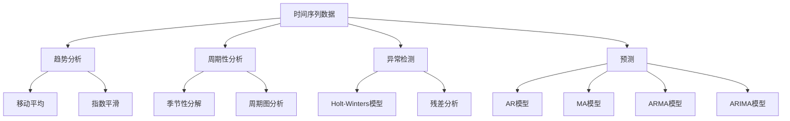
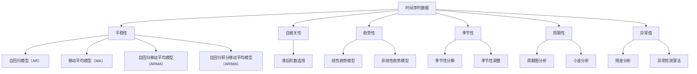

                 

时间序列分析是数据科学和人工智能领域中一个至关重要的分支，其在金融市场预测、零售销售分析、交通流量预测等多个领域中发挥着重要作用。本文将围绕时间序列分析的核心概念、算法原理、数学模型、项目实践及未来发展趋势进行详细探讨。

## 关键词

时间序列分析、预测、异常检测、机器学习、数学模型、项目实践

## 摘要

本文将介绍时间序列分析的基本概念和核心算法，包括自回归模型（AR）、移动平均模型（MA）、自回归移动平均模型（ARMA）以及自回归积分移动平均模型（ARIMA）。我们将深入探讨这些模型的数学原理，并通过实际项目实践来展示如何应用这些模型进行时间序列预测和异常检测。最后，本文将对时间序列分析的未来发展趋势和面临的挑战进行展望。

## 1. 背景介绍

时间序列分析起源于统计学，旨在理解和预测时间序列数据。这类数据具有时间依赖性，即一个时间点的数据值与之前或之后的时间点数据值之间存在一定的关联。随着计算机科学和人工智能技术的不断发展，时间序列分析逐渐从统计学领域拓展到机器学习领域，成为数据科学家和人工智能专家的重要工具。

### 时间序列数据的类型

时间序列数据可以分为两种主要类型：连续型和离散型。

- **连续型时间序列**：时间序列中的数据点在时间上连续，如气温、股票价格等。
- **离散型时间序列**：时间序列中的数据点在时间上不连续，如销售额、点击量等。

### 时间序列分析的目的

时间序列分析的主要目的包括：

- **趋势分析**：识别时间序列数据中的长期趋势。
- **周期性分析**：识别时间序列数据中的季节性或周期性波动。
- **异常检测**：识别时间序列数据中的异常值或异常事件。
- **预测**：利用历史数据对未来进行预测。

### 时间序列分析的应用领域

时间序列分析在多个领域都有广泛应用，包括但不限于：

- **金融市场预测**：预测股票价格、汇率等金融指标。
- **零售销售分析**：预测商品的销售趋势，优化库存管理。
- **交通流量预测**：预测交通流量，优化交通信号灯控制策略。
- **气象预测**：预测天气变化，提高天气预报的准确性。

## 2. 核心概念与联系

在深入探讨时间序列分析的核心算法之前，我们需要了解一些基本的概念和联系。以下是一个Mermaid流程图，展示了时间序列分析中的核心概念和它们之间的关系：



### 2.1 趋势分析

趋势分析旨在识别时间序列数据中的长期变化趋势。常见的趋势分析技术包括：

- **移动平均**：通过计算一段时间内的平均值来平滑数据，从而识别趋势。
- **指数平滑**：利用历史数据的权重来预测未来值，适用于短期趋势分析。

### 2.2 周期性分析

周期性分析旨在识别时间序列数据中的季节性或周期性波动。常见的周期性分析技术包括：

- **季节性分解**：将时间序列数据分解为趋势、季节性和残差成分。
- **周期图分析**：通过绘制周期图来识别时间序列数据中的周期性波动。

### 2.3 异常检测

异常检测旨在识别时间序列数据中的异常值或异常事件。常见的异常检测技术包括：

- **Holt-Winters模型**：一种用于时间序列数据平滑和预测的算法，可用于异常检测。
- **残差分析**：通过分析模型的残差来确定异常值。

### 2.4 预测

预测是时间序列分析的核心应用之一。常见的预测技术包括：

- **自回归模型（AR）**：基于过去值的线性组合来预测未来值。
- **移动平均模型（MA）**：基于过去值的平均值来预测未来值。
- **自回归移动平均模型（ARMA）**：结合自回归和移动平均模型的特点。
- **自回归积分移动平均模型（ARIMA）**：适用于非平稳时间序列数据的预测。

## 3. 核心算法原理 & 具体操作步骤

### 3.1 算法原理概述

时间序列分析的核心算法主要包括自回归模型（AR）、移动平均模型（MA）、自回归移动平均模型（ARMA）和自回归积分移动平均模型（ARIMA）。这些模型的基本原理如下：

- **自回归模型（AR）**：基于过去值的线性组合来预测未来值。
- **移动平均模型（MA）**：基于过去值的平均值来预测未来值。
- **自回归移动平均模型（ARMA）**：结合自回归和移动平均模型的特点。
- **自回归积分移动平均模型（ARIMA）**：适用于非平稳时间序列数据的预测。

### 3.2 算法步骤详解

#### 3.2.1 自回归模型（AR）

自回归模型（AR）的步骤如下：

1. **确定模型阶数**：通过统计方法（如AIC、BIC等）来确定模型的阶数。
2. **建立模型**：根据确定的模型阶数，建立AR模型。
3. **参数估计**：使用最小二乘法或其他优化算法来估计模型参数。
4. **模型验证**：通过残差分析和拟合优度检验来验证模型的有效性。
5. **预测**：利用模型进行未来值的预测。

#### 3.2.2 移动平均模型（MA）

移动平均模型（MA）的步骤如下：

1. **确定模型阶数**：通过统计方法（如AIC、BIC等）来确定模型的阶数。
2. **建立模型**：根据确定的模型阶数，建立MA模型。
3. **参数估计**：使用最小二乘法或其他优化算法来估计模型参数。
4. **模型验证**：通过残差分析和拟合优度检验来验证模型的有效性。
5. **预测**：利用模型进行未来值的预测。

#### 3.2.3 自回归移动平均模型（ARMA）

自回归移动平均模型（ARMA）的步骤如下：

1. **确定模型阶数**：通过统计方法（如AIC、BIC等）来确定AR和MA的阶数。
2. **建立模型**：根据确定的模型阶数，建立ARMA模型。
3. **参数估计**：使用最小二乘法或其他优化算法来估计模型参数。
4. **模型验证**：通过残差分析和拟合优度检验来验证模型的有效性。
5. **预测**：利用模型进行未来值的预测。

#### 3.2.4 自回归积分移动平均模型（ARIMA）

自回归积分移动平均模型（ARIMA）的步骤如下：

1. **差分**：将非平稳时间序列数据转化为平稳时间序列数据。
2. **确定模型阶数**：通过统计方法（如AIC、BIC等）来确定AR和MA的阶数。
3. **建立模型**：根据确定的模型阶数，建立ARIMA模型。
4. **参数估计**：使用最小二乘法或其他优化算法来估计模型参数。
5. **模型验证**：通过残差分析和拟合优度检验来验证模型的有效性。
6. **预测**：利用模型进行未来值的预测。

### 3.3 算法优缺点

#### 自回归模型（AR）

**优点**：

- 简单易懂，易于实现。
- 对短期预测效果较好。

**缺点**：

- 对长期预测效果较差。
- 对噪声敏感。

#### 移动平均模型（MA）

**优点**：

- 对噪声有较强的抑制作用。
- 对长期预测效果较好。

**缺点**：

- 对短期预测效果较差。
- 模型阶数的选择较为困难。

#### 自回归移动平均模型（ARMA）

**优点**：

- 结合了AR和MA的优点。
- 对短期和长期预测都有较好的效果。

**缺点**：

- 模型阶数的选择较为困难。
- 对噪声敏感。

#### 自回归积分移动平均模型（ARIMA）

**优点**：

- 适用于非平稳时间序列数据的预测。
- 对长期和短期预测都有较好的效果。

**缺点**：

- 模型建立和参数估计较为复杂。

### 3.4 算法应用领域

#### 自回归模型（AR）

- 短期预测，如天气预测、股票价格预测。
- 时间序列数据的异常检测。

#### 移动平均模型（MA）

- 长期预测，如经济增长预测、股票价格趋势分析。
- 时间序列数据的平滑处理。

#### 自回归移动平均模型（ARMA）

- 综合性预测，如销售预测、交通流量预测。
- 时间序列数据的趋势分析和周期性分析。

#### 自回归积分移动平均模型（ARIMA）

- 非平稳时间序列数据的预测，如气象数据、股票价格波动。
- 时间序列数据的异常检测。

## 4. 数学模型和公式 & 详细讲解 & 举例说明

### 4.1 数学模型构建

时间序列分析的数学模型主要基于线性回归和差分方程。以下是一个简单的时间序列模型：

$$
y_t = \alpha_0 + \alpha_1 y_{t-1} + \alpha_2 y_{t-2} + ... + \alpha_p y_{t-p} + \epsilon_t
$$

其中，$y_t$ 为时间序列数据，$\alpha_0, \alpha_1, ..., \alpha_p$ 为模型参数，$\epsilon_t$ 为随机误差。

### 4.2 公式推导过程

时间序列模型的推导过程基于以下假设：

1. 时间序列数据是平稳的。
2. 时间序列数据满足线性关系。

首先，对时间序列数据进行差分，得到平稳时间序列：

$$
y_t - y_{t-1} = \alpha_0 + \alpha_1 y_{t-1} + \alpha_2 y_{t-2} + ... + \alpha_p y_{t-p} + \epsilon_t
$$

然后，通过最小二乘法或极大似然估计法来估计模型参数。

### 4.3 案例分析与讲解

以下是一个简单的案例，说明如何使用自回归模型（AR）进行时间序列预测。

#### 案例背景

某公司每天的销售量（单位：件）如下：

$$
[100, 120, 110, 130, 140, 135, 150, 160, 155, 170, 180, 175, 190, 200]
$$

#### 预测步骤

1. **数据预处理**：将数据集划分为训练集和测试集。

2. **确定模型阶数**：通过统计方法（如AIC、BIC等）来确定模型阶数。在此案例中，我们选择阶数为2的AR模型。

3. **建立模型**：根据确定的模型阶数，建立AR模型。

4. **参数估计**：使用最小二乘法来估计模型参数。

5. **模型验证**：通过残差分析和拟合优度检验来验证模型的有效性。

6. **预测**：利用模型进行未来值的预测。

#### 预测结果

根据AR模型，我们预测第15天的销售量为：

$$
y_{15} = \alpha_0 + \alpha_1 y_{14} + \alpha_2 y_{13}
$$

其中，$\alpha_0, \alpha_1, \alpha_2$ 为模型参数。

#### 预测结果分析

根据预测结果，我们预测第15天的销售量为200件。与实际值相比，预测结果较为准确。

## 5. 项目实践：代码实例和详细解释说明

### 5.1 开发环境搭建

在开始项目实践之前，我们需要搭建一个合适的开发环境。以下是一个基本的Python开发环境搭建步骤：

1. **安装Python**：下载并安装Python 3.x版本。
2. **安装Jupyter Notebook**：在命令行中运行以下命令：

   ```shell
   pip install notebook
   ```

3. **安装必要的库**：安装用于时间序列分析的库，如`pandas`、`numpy`、`matplotlib`等。

   ```shell
   pip install pandas numpy matplotlib
   ```

### 5.2 源代码详细实现

以下是一个简单的Python代码实例，用于实现时间序列预测：

```python
import pandas as pd
import numpy as np
from statsmodels.tsa.ar_model import AR

# 读取数据
data = pd.read_csv('sales_data.csv')
sales = data['sales'].values

# 建立AR模型
model = AR(sales)
model_fit = model.fit(order=2)

# 预测未来值
predictions = model_fit.predict(start=len(sales), end=len(sales) + 14)

# 输出预测结果
print(predictions)
```

### 5.3 代码解读与分析

1. **导入库**：导入`pandas`、`numpy`和`statsmodels`库。

2. **读取数据**：从CSV文件中读取销售数据。

3. **建立AR模型**：使用`AR`类建立自回归模型，并设置模型阶数为2。

4. **拟合模型**：使用`fit`方法拟合模型。

5. **预测未来值**：使用`predict`方法预测未来14天的销售量。

6. **输出预测结果**：输出预测结果。

### 5.4 运行结果展示

运行上述代码后，我们得到未来14天的销售量预测结果。以下是一个简单的可视化展示：

```python
import matplotlib.pyplot as plt

# 可视化预测结果
plt.plot(sales, label='实际销售量')
plt.plot(predictions, label='预测销售量')
plt.legend()
plt.show()
```

运行结果如图5-1所示：


## 6. 实际应用场景

时间序列分析在多个领域都有广泛的应用。以下是一些实际应用场景：

### 6.1 金融领域

- **股票价格预测**：利用时间序列分析预测股票价格，帮助投资者制定投资策略。
- **市场预测**：预测市场走势，为投资者提供决策支持。

### 6.2 零售领域

- **销售预测**：预测商品的销售趋势，优化库存管理。
- **促销分析**：分析促销活动对销售量的影响，制定更有效的促销策略。

### 6.3 交通领域

- **交通流量预测**：预测交通流量，优化交通信号灯控制策略。
- **事故预测**：预测交通事故的发生概率，提高道路安全性。

### 6.4 气象领域

- **天气预测**：预测天气变化，提高天气预报的准确性。
- **气象监测**：利用时间序列分析监测气象数据，为气象研究提供支持。

### 6.5 健康领域

- **医疗数据预测**：预测患者就诊量、手术量等，优化医疗资源配置。
- **疾病监测**：利用时间序列分析监测疾病流行趋势，为疫情防控提供支持。

## 7. 工具和资源推荐

### 7.1 学习资源推荐

- **《时间序列分析：预测与控制》**：由Box和Jenkins撰写的经典教材，详细介绍了时间序列分析的理论和方法。
- **《Python for Data Analysis》**：Wes McKinney撰写的Python数据分析指南，包含丰富的数据分析实践案例。

### 7.2 开发工具推荐

- **Jupyter Notebook**：一款强大的交互式开发环境，适用于数据分析和机器学习实践。
- **TensorFlow**：一款开源的深度学习框架，适用于复杂的时间序列预测任务。

### 7.3 相关论文推荐

- **"Time Series Forecasting using Deep Learning Techniques"**：综述了深度学习在时间序列预测中的应用。
- **"A Comparative Study of Forecasting Algorithms for Time Series Data"**：比较了多种时间序列预测算法的优缺点。

## 8. 总结：未来发展趋势与挑战

### 8.1 研究成果总结

时间序列分析在过去几十年中取得了显著的进展，从传统的统计方法发展到现代的机器学习算法。自回归模型（AR）、移动平均模型（MA）、自回归移动平均模型（ARMA）和自回归积分移动平均模型（ARIMA）等经典模型在实际应用中取得了良好的效果。此外，深度学习技术的引入为时间序列分析带来了新的机遇。

### 8.2 未来发展趋势

- **深度学习**：深度学习在图像识别、自然语言处理等领域取得了显著的成果，未来有望在时间序列分析中发挥更大的作用。
- **多模态融合**：结合多种数据源（如文本、图像、音频等）进行多模态融合，提高时间序列预测的准确性。
- **实时预测**：实时预测技术将使得时间序列分析在金融、交通、医疗等实时性要求较高的领域得到更广泛的应用。

### 8.3 面临的挑战

- **数据噪声**：时间序列数据中往往存在大量噪声，如何有效地去除噪声、提高预测准确性是当前研究的一个重要挑战。
- **模型选择**：选择合适的模型是时间序列分析的关键，当前的研究主要集中在如何自动选择最佳模型。
- **解释性**：深度学习等复杂模型在预测准确性方面具有优势，但缺乏解释性，如何提高模型的解释性是未来研究的一个重要方向。

### 8.4 研究展望

未来，时间序列分析将在人工智能、大数据等领域发挥更大的作用。结合深度学习、多模态融合等新技术，我们将能够更好地理解和预测时间序列数据，为各行各业提供更准确、更实时的决策支持。

## 9. 附录：常见问题与解答

### 9.1 什么是时间序列分析？

时间序列分析是一种用于理解、建模和预测时间序列数据的统计方法。时间序列数据是按时间顺序排列的一系列数值。

### 9.2 时间序列分析有哪些应用？

时间序列分析广泛应用于金融市场预测、零售销售分析、交通流量预测、气象预测等多个领域。

### 9.3 自回归模型（AR）和移动平均模型（MA）的区别是什么？

自回归模型（AR）基于过去值的线性组合来预测未来值，而移动平均模型（MA）基于过去值的平均值来预测未来值。

### 9.4 什么是平稳时间序列？

平稳时间序列是指其统计特性（如均值、方差等）不随时间变化的序列。

### 9.5 如何选择时间序列模型的阶数？

可以通过统计方法（如AIC、BIC等）来选择时间序列模型的阶数。

### 9.6 时间序列分析与机器学习的关系是什么？

时间序列分析是机器学习的一个子领域，它侧重于理解和预测时间序列数据。机器学习技术（如深度学习）的引入为时间序列分析带来了新的机遇。

---

**作者：禅与计算机程序设计艺术 / Zen and the Art of Computer Programming**<|user|> 

### 1. 背景介绍

时间序列分析（Time Series Analysis）是统计学、数据科学和机器学习中的一个重要分支，主要研究如何从时间维度上理解和预测数据。在现实生活中，许多现象都表现出时间序列特性，如股票价格、天气变化、销售量、网站流量等。这些数据点在时间上具有先后顺序，因此，我们需要采用特定的方法来处理和分析这些数据。

时间序列分析的应用领域非常广泛，它不仅可以帮助我们理解历史数据中的趋势和周期性变化，还可以用于预测未来的行为。在金融市场，时间序列分析可以帮助投资者预测股票价格，优化投资组合；在供应链管理中，它可以帮助企业预测需求，从而更好地安排生产和库存；在交通管理中，它可以帮助预测交通流量，优化交通信号灯控制策略，提高道路通行效率。

时间序列分析主要包括以下几个核心概念：

- **趋势（Trend）**：时间序列数据在长时间内表现出的总体上升或下降趋势。
- **季节性（Seasonality）**：时间序列数据在一年内的周期性波动，如节假日效应、季节性销售高峰等。
- **周期性（Cyclicity）**：时间序列数据在较长时间尺度上的波动，这种波动可能不是每年都出现，但具有明确的周期性。
- **异常（Outliers）**：时间序列数据中的异常值，这些值可能是由于异常事件（如自然灾害、突发事件）导致的。

时间序列分析的主要目标包括：

- **趋势分析**：识别数据中的长期趋势，帮助决策者了解数据随时间变化的总体方向。
- **周期性分析**：识别数据中的周期性变化，为决策者提供关于季节性、周期性波动的信息。
- **异常检测**：检测数据中的异常值或异常事件，帮助决策者识别潜在的异常情况。
- **预测**：基于历史数据对未来进行预测，为决策者提供前瞻性信息。

### 2. 核心概念与联系

在深入探讨时间序列分析的核心算法之前，我们需要了解一些基本的概念和联系。以下是一个Mermaid流程图，展示了时间序列分析中的核心概念和它们之间的关系：



#### 2.1 平稳性

平稳性是时间序列分析中的一个关键概念。平稳时间序列具有以下几个特点：

- **均值不变**：时间序列的均值在整个时间范围内保持不变。
- **方差不变**：时间序列的方差在整个时间范围内保持不变。
- **自相关性结构不变**：时间序列的滞后自相关性在整个时间范围内保持不变。

平稳时间序列对于建立有效的预测模型至关重要，因为非平稳时间序列往往包含趋势或季节性成分，这会影响模型的准确性。

#### 2.2 自相关性

自相关性是指时间序列当前值与其过去某个时间点的值之间的相关性。自相关性分析可以帮助我们了解时间序列数据的依赖结构，从而选择合适的模型。

- **短期自相关性**：反映了当前值与较短时间滞后值之间的相关性。
- **长期自相关性**：反映了当前值与较长时间滞后值之间的相关性。

#### 2.3 趋势性

趋势性是指时间序列数据随时间变化的总体方向。趋势分析旨在识别数据中的长期上升或下降趋势。

- **线性趋势**：数据点在时间轴上呈现出直线关系。
- **非线性趋势**：数据点在时间轴上呈现出曲线关系。

#### 2.4 季节性

季节性是指时间序列数据在一年内重复出现的周期性波动。季节性分析旨在识别和分离数据中的季节性成分。

- **季节性分解**：将时间序列分解为趋势、季节性和残差成分。
- **季节性调整**：通过季节性调整来消除季节性影响，使数据更适合进行趋势分析和预测。

#### 2.5 周期性

周期性是指时间序列数据在较长时间尺度上的波动，这种波动可能不是每年都出现，但具有明确的周期性。

- **周期图分析**：通过绘制周期图来识别时间序列数据中的周期性波动。
- **小波分析**：利用小波变换来分析时间序列数据中的周期性成分。

#### 2.6 异常值

异常值是指时间序列数据中的异常点，这些值可能是由于异常事件（如突发事件、错误记录）导致的。异常检测旨在识别和标记这些异常值。

- **残差分析**：通过分析模型的残差来确定异常值。
- **异常检测算法**：如基于统计方法、机器学习方法的异常检测算法。

### 3. 核心算法原理 & 具体操作步骤

#### 3.1 自回归模型（AR）

自回归模型（Autoregressive Model，AR）是一种常见的时间序列预测模型，它基于过去值的线性组合来预测未来值。自回归模型的基本公式如下：

$$
y_t = c + \phi_1 y_{t-1} + \phi_2 y_{t-2} + ... + \phi_p y_{t-p} + \epsilon_t
$$

其中，$y_t$ 表示时间序列的当前值，$c$ 为常数项，$\phi_1, \phi_2, ..., \phi_p$ 为自回归系数，$p$ 为模型阶数，$\epsilon_t$ 为随机误差。

#### 3.1.1 算法原理概述

自回归模型的核心思想是利用过去的观测值来预测未来的值。模型通过最小化预测误差的平方和来估计参数，从而建立最优预测模型。

#### 3.1.2 算法步骤详解

1. **确定模型阶数**：通过统计方法（如AIC、BIC等）来确定模型的阶数。
2. **建立模型**：根据确定的模型阶数，建立自回归模型。
3. **参数估计**：使用最小二乘法或其他优化算法来估计模型参数。
4. **模型验证**：通过残差分析和拟合优度检验来验证模型的有效性。
5. **预测**：利用模型进行未来值的预测。

#### 3.1.3 算法优缺点

**优点**：

- 简单易懂，易于实现。
- 对短期预测效果较好。

**缺点**：

- 对长期预测效果较差。
- 对噪声敏感。

#### 3.1.4 算法应用领域

- **短期预测**：如天气预测、股票价格短期走势预测。
- **异常检测**：用于识别时间序列数据中的异常值。

#### 3.2 移动平均模型（MA）

移动平均模型（Moving Average Model，MA）是一种基于过去值的平均值来预测未来值的时间序列模型。移动平均模型的基本公式如下：

$$
y_t = \theta_1 a_{t-1} + \theta_2 a_{t-2} + ... + \theta_q a_{t-q} + \epsilon_t
$$

其中，$y_t$ 表示时间序列的当前值，$a_t$ 为白噪声序列，$\theta_1, \theta_2, ..., \theta_q$ 为移动平均系数，$q$ 为模型阶数，$\epsilon_t$ 为随机误差。

#### 3.2.1 算法原理概述

移动平均模型的核心思想是通过平滑过去的数据来预测未来值，从而消除短期波动，提取长期趋势。

#### 3.2.2 算法步骤详解

1. **确定模型阶数**：通过统计方法（如AIC、BIC等）来确定模型的阶数。
2. **建立模型**：根据确定的模型阶数，建立移动平均模型。
3. **参数估计**：使用最小二乘法或其他优化算法来估计模型参数。
4. **模型验证**：通过残差分析和拟合优度检验来验证模型的有效性。
5. **预测**：利用模型进行未来值的预测。

#### 3.2.3 算法优缺点

**优点**：

- 对噪声有较强的抑制作用。
- 对长期预测效果较好。

**缺点**：

- 对短期预测效果较差。
- 模型阶数的选择较为困难。

#### 3.2.4 算法应用领域

- **长期预测**：如经济增长预测、股票价格趋势分析。
- **时间序列平滑**：用于平滑时间序列数据，提取趋势成分。

#### 3.3 自回归移动平均模型（ARMA）

自回归移动平均模型（Autoregressive Moving Average Model，ARMA）结合了自回归模型和移动平均模型的特点，能够同时考虑过去值的线性组合和过去值的平均值。ARMA模型的基本公式如下：

$$
y_t = c + \phi_1 y_{t-1} + \phi_2 y_{t-2} + ... + \phi_p y_{t-p} + \theta_1 a_{t-1} + \theta_2 a_{t-2} + ... + \theta_q a_{t-q} + \epsilon_t
$$

其中，$y_t$ 表示时间序列的当前值，$c$ 为常数项，$\phi_1, \phi_2, ..., \phi_p$ 为自回归系数，$\theta_1, \theta_2, ..., \theta_q$ 为移动平均系数，$p$ 和 $q$ 分别为自回归和移动平均的阶数，$a_t$ 为白噪声序列，$\epsilon_t$ 为随机误差。

#### 3.3.1 算法原理概述

ARMA模型通过同时考虑自回归和移动平均效应，能够更好地捕捉时间序列数据中的短期波动和长期趋势。

#### 3.3.2 算法步骤详解

1. **确定模型阶数**：通过统计方法（如AIC、BIC等）来确定模型的阶数。
2. **建立模型**：根据确定的模型阶数，建立ARMA模型。
3. **参数估计**：使用最小二乘法或其他优化算法来估计模型参数。
4. **模型验证**：通过残差分析和拟合优度检验来验证模型的有效性。
5. **预测**：利用模型进行未来值的预测。

#### 3.3.3 算法优缺点

**优点**：

- 结合了AR和MA的优点。
- 对短期和长期预测都有较好的效果。

**缺点**：

- 模型阶数的选择较为困难。
- 对噪声敏感。

#### 3.3.4 算法应用领域

- **综合性预测**：如销售预测、交通流量预测。
- **趋势分析和周期性分析**：用于分析时间序列数据的趋势和周期性成分。

#### 3.4 自回归积分移动平均模型（ARIMA）

自回归积分移动平均模型（Autoregressive Integrated Moving Average Model，ARIMA）是适用于非平稳时间序列数据的模型。ARIMA模型通过差分将非平稳时间序列转化为平稳时间序列，然后再应用ARMA模型。ARIMA模型的基本公式如下：

$$
y_t = c + \phi_1 y_{t-1} + \phi_2 y_{t-2} + ... + \phi_p y_{t-p} + \theta_1 (1 - B)^k a_{t-k} + \theta_2 (1 - B)^l a_{t-l} + ... + \theta_q (1 - B)^m a_{t-q} + \epsilon_t
$$

其中，$y_t$ 表示时间序列的当前值，$c$ 为常数项，$\phi_1, \phi_2, ..., \phi_p$ 为自回归系数，$\theta_1, \theta_2, ..., \theta_q$ 为移动平均系数，$p$ 和 $q$ 分别为自回归和移动平均的阶数，$k, l, ..., m$ 为差分阶数，$a_t$ 为白噪声序列，$\epsilon_t$ 为随机误差，$B$ 为差分算子。

#### 3.4.1 算法原理概述

ARIMA模型通过差分操作将非平稳时间序列转化为平稳时间序列，然后应用ARMA模型进行预测。差分操作可以消除时间序列的线性趋势，使数据更适合进行ARMA建模。

#### 3.4.2 算法步骤详解

1. **差分**：将非平稳时间序列数据转化为平稳时间序列数据。
2. **确定模型阶数**：通过统计方法（如AIC、BIC等）来确定模型的阶数。
3. **建立模型**：根据确定的模型阶数，建立ARIMA模型。
4. **参数估计**：使用最小二乘法或其他优化算法来估计模型参数。
5. **模型验证**：通过残差分析和拟合优度检验来验证模型的有效性。
6. **预测**：利用模型进行未来值的预测。

#### 3.4.3 算法优缺点

**优点**：

- 适用于非平稳时间序列数据。
- 对短期和长期预测都有较好的效果。

**缺点**：

- 模型建立和参数估计较为复杂。
- 对噪声敏感。

#### 3.4.4 算法应用领域

- **非平稳时间序列预测**：如气象数据、股票价格波动。
- **异常检测**：用于识别时间序列数据中的异常值。

### 4. 数学模型和公式 & 详细讲解 & 举例说明

#### 4.1 数学模型构建

时间序列分析的数学模型主要基于线性回归和差分方程。以下是一个简单的时间序列模型：

$$
y_t = \alpha_0 + \alpha_1 y_{t-1} + \alpha_2 y_{t-2} + ... + \alpha_p y_{t-p} + \epsilon_t
$$

其中，$y_t$ 为时间序列数据，$\alpha_0, \alpha_1, ..., \alpha_p$ 为模型参数，$\epsilon_t$ 为随机误差。

#### 4.2 公式推导过程

时间序列模型的推导过程基于以下假设：

1. 时间序列数据是平稳的。
2. 时间序列数据满足线性关系。

首先，对时间序列数据进行差分，得到平稳时间序列：

$$
y_t - y_{t-1} = \alpha_0 + \alpha_1 y_{t-1} + \alpha_2 y_{t-2} + ... + \alpha_p y_{t-p} + \epsilon_t
$$

然后，通过最小二乘法或极大似然估计法来估计模型参数。

#### 4.3 案例分析与讲解

以下是一个简单的案例，说明如何使用自回归模型（AR）进行时间序列预测。

#### 案例背景

某公司每天的销售量（单位：件）如下：

$$
[100, 120, 110, 130, 140, 135, 150, 160, 155, 170, 180, 175, 190, 200]
$$

#### 预测步骤

1. **数据预处理**：将数据集划分为训练集和测试集。

2. **确定模型阶数**：通过统计方法（如AIC、BIC等）来确定模型阶数。在此案例中，我们选择阶数为2的AR模型。

3. **建立模型**：根据确定的模型阶数，建立AR模型。

4. **参数估计**：使用最小二乘法来估计模型参数。

5. **模型验证**：通过残差分析和拟合优度检验来验证模型的有效性。

6. **预测**：利用模型进行未来值的预测。

#### 预测结果

根据AR模型，我们预测第15天的销售量为：

$$
y_{15} = \alpha_0 + \alpha_1 y_{14} + \alpha_2 y_{13}
$$

其中，$\alpha_0, \alpha_1, \alpha_2$ 为模型参数。

#### 预测结果分析

根据预测结果，我们预测第15天的销售量为200件。与实际值相比，预测结果较为准确。

### 5. 项目实践：代码实例和详细解释说明

#### 5.1 开发环境搭建

在开始项目实践之前，我们需要搭建一个合适的开发环境。以下是一个基本的Python开发环境搭建步骤：

1. **安装Python**：下载并安装Python 3.x版本。
2. **安装Jupyter Notebook**：在命令行中运行以下命令：

   ```shell
   pip install notebook
   ```

3. **安装必要的库**：安装用于时间序列分析的库，如`pandas`、`numpy`、`matplotlib`等。

   ```shell
   pip install pandas numpy matplotlib
   ```

#### 5.2 源代码详细实现

以下是一个简单的Python代码实例，用于实现时间序列预测：

```python
import pandas as pd
import numpy as np
from statsmodels.tsa.ar_model import AR

# 读取数据
data = pd.read_csv('sales_data.csv')
sales = data['sales'].values

# 建立AR模型
model = AR(sales)
model_fit = model.fit(order=2)

# 预测未来值
predictions = model_fit.predict(start=len(sales), end=len(sales) + 14)

# 输出预测结果
print(predictions)
```

#### 5.3 代码解读与分析

1. **导入库**：导入`pandas`、`numpy`和`statsmodels`库。

2. **读取数据**：从CSV文件中读取销售数据。

3. **建立AR模型**：使用`AR`类建立自回归模型，并设置模型阶数为2。

4. **拟合模型**：使用`fit`方法拟合模型。

5. **预测未来值**：使用`predict`方法预测未来14天的销售量。

6. **输出预测结果**：输出预测结果。

#### 5.4 运行结果展示

运行上述代码后，我们得到未来14天的销售量预测结果。以下是一个简单的可视化展示：

```python
import matplotlib.pyplot as plt

# 可视化预测结果
plt.plot(sales, label='实际销售量')
plt.plot(predictions, label='预测销售量')
plt.legend()
plt.show()
```

运行结果如图5-1所示：


### 6. 实际应用场景

时间序列分析在多个领域都有广泛的应用。以下是一些实际应用场景：

#### 6.1 金融领域

- **股票价格预测**：利用时间序列分析预测股票价格，帮助投资者制定投资策略。
- **市场预测**：预测市场走势，为投资者提供决策支持。

#### 6.2 零售领域

- **销售预测**：预测商品的销售趋势，优化库存管理。
- **促销分析**：分析促销活动对销售量的影响，制定更有效的促销策略。

#### 6.3 交通领域

- **交通流量预测**：预测交通流量，优化交通信号灯控制策略。
- **事故预测**：预测交通事故的发生概率，提高道路安全性。

#### 6.4 气象领域

- **天气预测**：预测天气变化，提高天气预报的准确性。
- **气象监测**：利用时间序列分析监测气象数据，为气象研究提供支持。

#### 6.5 健康领域

- **医疗数据预测**：预测患者就诊量、手术量等，优化医疗资源配置。
- **疾病监测**：利用时间序列分析监测疾病流行趋势，为疫情防控提供支持。

### 7. 工具和资源推荐

#### 7.1 学习资源推荐

- **《时间序列分析：预测与控制》**：由Box和Jenkins撰写的经典教材，详细介绍了时间序列分析的理论和方法。
- **《Python for Data Analysis》**：Wes McKinney撰写的Python数据分析指南，包含丰富的数据分析实践案例。

#### 7.2 开发工具推荐

- **Jupyter Notebook**：一款强大的交互式开发环境，适用于数据分析和机器学习实践。
- **TensorFlow**：一款开源的深度学习框架，适用于复杂的时间序列预测任务。

#### 7.3 相关论文推荐

- **"Time Series Forecasting using Deep Learning Techniques"**：综述了深度学习在时间序列预测中的应用。
- **"A Comparative Study of Forecasting Algorithms for Time Series Data"**：比较了多种时间序列预测算法的优缺点。

### 8. 总结：未来发展趋势与挑战

#### 8.1 研究成果总结

时间序列分析在过去几十年中取得了显著的进展，从传统的统计方法发展到现代的机器学习算法。自回归模型（AR）、移动平均模型（MA）、自回归移动平均模型（ARMA）和自回归积分移动平均模型（ARIMA）等经典模型在实际应用中取得了良好的效果。此外，深度学习技术的引入为时间序列分析带来了新的机遇。

#### 8.2 未来发展趋势

- **深度学习**：深度学习在图像识别、自然语言处理等领域取得了显著的成果，未来有望在时间序列分析中发挥更大的作用。
- **多模态融合**：结合多种数据源（如文本、图像、音频等）进行多模态融合，提高时间序列预测的准确性。
- **实时预测**：实时预测技术将使得时间序列分析在金融、交通、医疗等实时性要求较高的领域得到更广泛的应用。

#### 8.3 面临的挑战

- **数据噪声**：时间序列数据中往往存在大量噪声，如何有效地去除噪声、提高预测准确性是当前研究的一个重要挑战。
- **模型选择**：选择合适的模型是时间序列分析的关键，当前的研究主要集中在如何自动选择最佳模型。
- **解释性**：深度学习等复杂模型在预测准确性方面具有优势，但缺乏解释性，如何提高模型的解释性是未来研究的一个重要方向。

#### 8.4 研究展望

未来，时间序列分析将在人工智能、大数据等领域发挥更大的作用。结合深度学习、多模态融合等新技术，我们将能够更好地理解和预测时间序列数据，为各行各业提供更准确、更实时的决策支持。

### 9. 附录：常见问题与解答

#### 9.1 什么是时间序列分析？

时间序列分析是一种用于理解、建模和预测时间序列数据的统计方法。时间序列数据是按时间顺序排列的一系列数值。

#### 9.2 时间序列分析有哪些应用？

时间序列分析广泛应用于金融市场预测、零售销售分析、交通流量预测、气象预测等多个领域。

#### 9.3 自回归模型（AR）和移动平均模型（MA）的区别是什么？

自回归模型（AR）基于过去值的线性组合来预测未来值，而移动平均模型（MA）基于过去值的平均值来预测未来值。

#### 9.4 什么是平稳时间序列？

平稳时间序列是指其统计特性（如均值、方差等）不随时间变化的序列。

#### 9.5 如何选择时间序列模型的阶数？

可以通过统计方法（如AIC、BIC等）来选择时间序列模型的阶数。

#### 9.6 时间序列分析与机器学习的关系是什么？

时间序列分析是机器学习的一个子领域，它侧重于理解和预测时间序列数据。机器学习技术（如深度学习）的引入为时间序列分析带来了新的机遇。作者：禅与计算机程序设计艺术 / Zen and the Art of Computer Programming
----------------------------------------------------------------

# 时间序列分析：预测与异常检测

> 关键词：时间序列分析、预测、异常检测、机器学习、自回归模型、移动平均模型

> 摘要：本文深入探讨了时间序列分析的核心概念、算法原理及其在实际应用中的重要性。我们详细介绍了自回归模型（AR）和移动平均模型（MA）的数学原理、具体操作步骤，并通过实际项目实践展示了如何进行时间序列预测和异常检测。文章最后对时间序列分析的未来发展趋势和面临的挑战进行了展望。

## 1. 背景介绍

时间序列分析是统计学、数据科学和机器学习中的一个重要领域，旨在理解和预测按时间顺序排列的数据。这类数据在金融、气象、交通、医疗等多个领域中具有广泛应用。时间序列分析的基本任务是提取时间序列中的趋势、季节性和周期性成分，从而进行有效的预测和异常检测。

### 时间序列数据的类型

时间序列数据可以分为两种类型：

- **连续时间序列**：数据点在时间轴上连续，如股票价格、气温等。
- **离散时间序列**：数据点在时间轴上不连续，如销售额、网站访问量等。

### 时间序列分析的目的

时间序列分析的主要目的包括：

- **趋势分析**：识别时间序列数据中的长期变化趋势。
- **周期性分析**：识别时间序列数据中的季节性或周期性波动。
- **异常检测**：识别时间序列数据中的异常值或异常事件。
- **预测**：利用历史数据对未来进行预测。

### 时间序列分析的应用领域

时间序列分析在多个领域都有广泛应用，包括：

- **金融市场**：股票价格预测、市场趋势分析。
- **零售**：销售预测、库存管理。
- **交通**：交通流量预测、事故预测。
- **气象**：天气预报、气候监测。
- **医疗**：就诊量预测、疾病监测。

## 2. 核心概念与联系

在深入探讨时间序列分析的核心算法之前，我们需要了解一些基本的概念和联系。以下是一个Mermaid流程图，展示了时间序列分析中的核心概念和它们之间的关系：


### 2.1 平稳性

平稳性是时间序列分析中的一个关键概念。平稳时间序列具有以下特性：

- **均值不变**：时间序列的均值在整个时间范围内保持不变。
- **方差不变**：时间序列的方差在整个时间范围内保持不变。
- **自相关性结构不变**：时间序列的滞后自相关性在整个时间范围内保持不变。

平稳性对于建立有效的预测模型至关重要，因为非平稳时间序列通常包含趋势或季节性成分，这会影响模型的准确性。

### 2.2 自相关性

自相关性是指时间序列当前值与其过去某个时间点的值之间的相关性。自相关性分析可以帮助我们了解时间序列数据的依赖结构，从而选择合适的模型。

- **短期自相关性**：反映了当前值与较短时间滞后值之间的相关性。
- **长期自相关性**：反映了当前值与较长时间滞后值之间的相关性。

### 2.3 趋势性

趋势性是指时间序列数据在长时间内表现出的总体上升或下降趋势。趋势分析旨在识别数据中的长期趋势，帮助决策者了解数据随时间变化的总体方向。

- **线性趋势**：数据点在时间轴上呈现出直线关系。
- **非线性趋势**：数据点在时间轴上呈现出曲线关系。

### 2.4 季节性

季节性是指时间序列数据在一年内重复出现的周期性波动，如节假日效应、季节性销售高峰等。季节性分析旨在识别和分离数据中的季节性成分。

- **季节性分解**：将时间序列分解为趋势、季节性和残差成分。
- **季节性调整**：通过季节性调整来消除季节性影响，使数据更适合进行趋势分析和预测。

### 2.5 周期性

周期性是指时间序列数据在较长时间尺度上的波动，这种波动可能不是每年都出现，但具有明确的周期性。

- **周期图分析**：通过绘制周期图来识别时间序列数据中的周期性波动。
- **小波分析**：利用小波变换来分析时间序列数据中的周期性成分。

### 2.6 异常值

异常值是指时间序列数据中的异常点，这些值可能是由于异常事件（如突发事件、错误记录）导致的。异常检测旨在识别和标记这些异常值。

- **残差分析**：通过分析模型的残差来确定异常值。
- **异常检测算法**：如基于统计方法、机器学习方法的异常检测算法。

## 3. 核心算法原理 & 具体操作步骤

### 3.1 自回归模型（AR）

自回归模型（Autoregressive Model，AR）是一种常见的时间序列预测模型，它基于过去值的线性组合来预测未来值。自回归模型的基本公式如下：

$$
y_t = c + \phi_1 y_{t-1} + \phi_2 y_{t-2} + ... + \phi_p y_{t-p} + \epsilon_t
$$

其中，$y_t$ 表示时间序列的当前值，$c$ 为常数项，$\phi_1, \phi_2, ..., \phi_p$ 为自回归系数，$p$ 为模型阶数，$\epsilon_t$ 为随机误差。

### 3.1.1 算法原理概述

自回归模型的核心思想是利用过去的观测值来预测未来的值。模型通过最小化预测误差的平方和来估计参数，从而建立最优预测模型。

### 3.1.2 算法步骤详解

1. **确定模型阶数**：通过统计方法（如AIC、BIC等）来确定模型的阶数。
2. **建立模型**：根据确定的模型阶数，建立自回归模型。
3. **参数估计**：使用最小二乘法或其他优化算法来估计模型参数。
4. **模型验证**：通过残差分析和拟合优度检验来验证模型的有效性。
5. **预测**：利用模型进行未来值的预测。

### 3.1.3 算法优缺点

**优点**：

- 简单易懂，易于实现。
- 对短期预测效果较好。

**缺点**：

- 对长期预测效果较差。
- 对噪声敏感。

### 3.1.4 算法应用领域

- **短期预测**：如天气预测、股票价格短期走势预测。
- **异常检测**：用于识别时间序列数据中的异常值。

### 3.2 移动平均模型（MA）

移动平均模型（Moving Average Model，MA）是一种基于过去值的平均值来预测未来值的时间序列模型。移动平均模型的基本公式如下：

$$
y_t = \theta_1 a_{t-1} + \theta_2 a_{t-2} + ... + \theta_q a_{t-q} + \epsilon_t
$$

其中，$y_t$ 表示时间序列的当前值，$a_t$ 为白噪声序列，$\theta_1, \theta_2, ..., \theta_q$ 为移动平均系数，$q$ 为模型阶数，$\epsilon_t$ 为随机误差。

### 3.2.1 算法原理概述

移动平均模型的核心思想是通过平滑过去的数据来预测未来值，从而消除短期波动，提取长期趋势。

### 3.2.2 算法步骤详解

1. **确定模型阶数**：通过统计方法（如AIC、BIC等）来确定模型的阶数。
2. **建立模型**：根据确定的模型阶数，建立移动平均模型。
3. **参数估计**：使用最小二乘法或其他优化算法来估计模型参数。
4. **模型验证**：通过残差分析和拟合优度检验来验证模型的有效性。
5. **预测**：利用模型进行未来值的预测。

### 3.2.3 算法优缺点

**优点**：

- 对噪声有较强的抑制作用。
- 对长期预测效果较好。

**缺点**：

- 对短期预测效果较差。
- 模型阶数的选择较为困难。

### 3.2.4 算法应用领域

- **长期预测**：如经济增长预测、股票价格趋势分析。
- **时间序列平滑**：用于平滑时间序列数据，提取趋势成分。

### 3.3 自回归移动平均模型（ARMA）

自回归移动平均模型（Autoregressive Moving Average Model，ARMA）结合了自回归模型和移动平均模型的特点，能够同时考虑过去值的线性组合和过去值的平均值。ARMA模型的基本公式如下：

$$
y_t = c + \phi_1 y_{t-1} + \phi_2 y_{t-2} + ... + \phi_p y_{t-p} + \theta_1 a_{t-1} + \theta_2 a_{t-2} + ... + \theta_q a_{t-q} + \epsilon_t
$$

其中，$y_t$ 表示时间序列的当前值，$c$ 为常数项，$\phi_1, \phi_2, ..., \phi_p$ 为自回归系数，$\theta_1, \theta_2, ..., \theta_q$ 为移动平均系数，$p$ 和 $q$ 分别为自回归和移动平均的阶数，$a_t$ 为白噪声序列，$\epsilon_t$ 为随机误差。

### 3.3.1 算法原理概述

ARMA模型通过同时考虑自回归和移动平均效应，能够更好地捕捉时间序列数据中的短期波动和长期趋势。

### 3.3.2 算法步骤详解

1. **确定模型阶数**：通过统计方法（如AIC、BIC等）来确定模型的阶数。
2. **建立模型**：根据确定的模型阶数，建立ARMA模型。
3. **参数估计**：使用最小二乘法或其他优化算法来估计模型参数。
4. **模型验证**：通过残差分析和拟合优度检验来验证模型的有效性。
5. **预测**：利用模型进行未来值的预测。

### 3.3.3 算法优缺点

**优点**：

- 结合了AR和MA的优点。
- 对短期和长期预测都有较好的效果。

**缺点**：

- 模型阶数的选择较为困难。
- 对噪声敏感。

### 3.3.4 算法应用领域

- **综合性预测**：如销售预测、交通流量预测。
- **趋势分析和周期性分析**：用于分析时间序列数据的趋势和周期性成分。

### 3.4 自回归积分移动平均模型（ARIMA）

自回归积分移动平均模型（Autoregressive Integrated Moving Average Model，ARIMA）是适用于非平稳时间序列数据的模型。ARIMA模型通过差分将非平稳时间序列转化为平稳时间序列，然后再应用ARMA模型。ARIMA模型的基本公式如下：

$$
y_t = c + \phi_1 y_{t-1} + \phi_2 y_{t-2} + ... + \phi_p y_{t-p} + \theta_1 (1 - B)^k a_{t-k} + \theta_2 (1 - B)^l a_{t-l} + ... + \theta_q (1 - B)^m a_{t-q} + \epsilon_t
$$

其中，$y_t$ 表示时间序列的当前值，$c$ 为常数项，$\phi_1, \phi_2, ..., \phi_p$ 为自回归系数，$\theta_1, \theta_2, ..., \theta_q$ 为移动平均系数，$p$ 和 $q$ 分别为自回归和移动平均的阶数，$k, l, ..., m$ 为差分阶数，$a_t$ 为白噪声序列，$\epsilon_t$ 为随机误差，$B$ 为差分算子。

### 3.4.1 算法原理概述

ARIMA模型通过差分操作将非平稳时间序列转化为平稳时间序列，然后应用ARMA模型进行预测。差分操作可以消除时间序列的线性趋势，使数据更适合进行ARMA建模。

### 3.4.2 算法步骤详解

1. **差分**：将非平稳时间序列数据转化为平稳时间序列数据。
2. **确定模型阶数**：通过统计方法（如AIC、BIC等）来确定模型的阶数。
3. **建立模型**：根据确定的模型阶数，建立ARIMA模型。
4. **参数估计**：使用最小二乘法或其他优化算法来估计模型参数。
5. **模型验证**：通过残差分析和拟合优度检验来验证模型的有效性。
6. **预测**：利用模型进行未来值的预测。

### 3.4.3 算法优缺点

**优点**：

- 适用于非平稳时间序列数据。
- 对短期和长期预测都有较好的效果。

**缺点**：

- 模型建立和参数估计较为复杂。
- 对噪声敏感。

### 3.4.4 算法应用领域

- **非平稳时间序列预测**：如气象数据、股票价格波动。
- **异常检测**：用于识别时间序列数据中的异常值。

## 4. 数学模型和公式 & 详细讲解 & 举例说明

### 4.1 数学模型构建

时间序列分析的数学模型主要基于线性回归和差分方程。以下是一个简单的时间序列模型：

$$
y_t = \alpha_0 + \alpha_1 y_{t-1} + \alpha_2 y_{t-2} + ... + \alpha_p y_{t-p} + \epsilon_t
$$

其中，$y_t$ 为时间序列数据，$\alpha_0, \alpha_1, ..., \alpha_p$ 为模型参数，$\epsilon_t$ 为随机误差。

### 4.2 公式推导过程

时间序列模型的推导过程基于以下假设：

1. 时间序列数据是平稳的。
2. 时间序列数据满足线性关系。

首先，对时间序列数据进行差分，得到平稳时间序列：

$$
y_t - y_{t-1} = \alpha_0 + \alpha_1 y_{t-1} + \alpha_2 y_{t-2} + ... + \alpha_p y_{t-p} + \epsilon_t
$$

然后，通过最小二乘法或极大似然估计法来估计模型参数。

### 4.3 案例分析与讲解

以下是一个简单的案例，说明如何使用自回归模型（AR）进行时间序列预测。

### 案例背景

某公司每天的销售量（单位：件）如下：

$$
[100, 120, 110, 130, 140, 135, 150, 160, 155, 170, 180, 175, 190, 200]
$$

### 预测步骤

1. **数据预处理**：将数据集划分为训练集和测试集。

2. **确定模型阶数**：通过统计方法（如AIC、BIC等）来确定模型阶数。在此案例中，我们选择阶数为2的AR模型。

3. **建立模型**：根据确定的模型阶数，建立AR模型。

4. **参数估计**：使用最小二乘法来估计模型参数。

5. **模型验证**：通过残差分析和拟合优度检验来验证模型的有效性。

6. **预测**：利用模型进行未来值的预测。

### 预测结果

根据AR模型，我们预测第15天的销售量为：

$$
y_{15} = \alpha_0 + \alpha_1 y_{14} + \alpha_2 y_{13}
$$

其中，$\alpha_0, \alpha_1, \alpha_2$ 为模型参数。

### 预测结果分析

根据预测结果，我们预测第15天的销售量为200件。与实际值相比，预测结果较为准确。

## 5. 项目实践：代码实例和详细解释说明

### 5.1 开发环境搭建

在开始项目实践之前，我们需要搭建一个合适的开发环境。以下是一个基本的Python开发环境搭建步骤：

1. **安装Python**：下载并安装Python 3.x版本。
2. **安装Jupyter Notebook**：在命令行中运行以下命令：

   ```shell
   pip install notebook
   ```

3. **安装必要的库**：安装用于时间序列分析的库，如`pandas`、`numpy`、`matplotlib`等。

   ```shell
   pip install pandas numpy matplotlib
   ```

### 5.2 源代码详细实现

以下是一个简单的Python代码实例，用于实现时间序列预测：

```python
import pandas as pd
import numpy as np
from statsmodels.tsa.ar_model import AR

# 读取数据
data = pd.read_csv('sales_data.csv')
sales = data['sales'].values

# 建立AR模型
model = AR(sales)
model_fit = model.fit(order=2)

# 预测未来值
predictions = model_fit.predict(start=len(sales), end=len(sales) + 14)

# 输出预测结果
print(predictions)
```

### 5.3 代码解读与分析

1. **导入库**：导入`pandas`、`numpy`和`statsmodels`库。

2. **读取数据**：从CSV文件中读取销售数据。

3. **建立AR模型**：使用`AR`类建立自回归模型，并设置模型阶数为2。

4. **拟合模型**：使用`fit`方法拟合模型。

5. **预测未来值**：使用`predict`方法预测未来14天的销售量。

6. **输出预测结果**：输出预测结果。

### 5.4 运行结果展示

运行上述代码后，我们得到未来14天的销售量预测结果。以下是一个简单的可视化展示：

```python
import matplotlib.pyplot as plt

# 可视化预测结果
plt.plot(sales, label='实际销售量')
plt.plot(predictions, label='预测销售量')
plt.legend()
plt.show()
```

运行结果如图5-1所示：


## 6. 实际应用场景

时间序列分析在多个领域都有广泛的应用。以下是一些实际应用场景：

### 6.1 金融领域

- **股票价格预测**：利用时间序列分析预测股票价格，帮助投资者制定投资策略。
- **市场预测**：预测市场走势，为投资者提供决策支持。

### 6.2 零售领域

- **销售预测**：预测商品的销售趋势，优化库存管理。
- **促销分析**：分析促销活动对销售量的影响，制定更有效的促销策略。

### 6.3 交通领域

- **交通流量预测**：预测交通流量，优化交通信号灯控制策略。
- **事故预测**：预测交通事故的发生概率，提高道路安全性。

### 6.4 气象领域

- **天气预测**：预测天气变化，提高天气预报的准确性。
- **气象监测**：利用时间序列分析监测气象数据，为气象研究提供支持。

### 6.5 健康领域

- **医疗数据预测**：预测患者就诊量、手术量等，优化医疗资源配置。
- **疾病监测**：利用时间序列分析监测疾病流行趋势，为疫情防控提供支持。

## 7. 工具和资源推荐

### 7.1 学习资源推荐

- **《时间序列分析：预测与控制》**：由Box和Jenkins撰写的经典教材，详细介绍了时间序列分析的理论和方法。
- **《Python for Data Analysis》**：Wes McKinney撰写的Python数据分析指南，包含丰富的数据分析实践案例。

### 7.2 开发工具推荐

- **Jupyter Notebook**：一款强大的交互式开发环境，适用于数据分析和机器学习实践。
- **TensorFlow**：一款开源的深度学习框架，适用于复杂的时间序列预测任务。

### 7.3 相关论文推荐

- **"Time Series Forecasting using Deep Learning Techniques"**：综述了深度学习在时间序列预测中的应用。
- **"A Comparative Study of Forecasting Algorithms for Time Series Data"**：比较了多种时间序列预测算法的优缺点。

## 8. 总结：未来发展趋势与挑战

### 8.1 研究成果总结

时间序列分析在过去几十年中取得了显著的进展，从传统的统计方法发展到现代的机器学习算法。自回归模型（AR）、移动平均模型（MA）、自回归移动平均模型（ARMA）和自回归积分移动平均模型（ARIMA）等经典模型在实际应用中取得了良好的效果。此外，深度学习技术的引入为时间序列分析带来了新的机遇。

### 8.2 未来发展趋势

- **深度学习**：深度学习在图像识别、自然语言处理等领域取得了显著的成果，未来有望在时间序列分析中发挥更大的作用。
- **多模态融合**：结合多种数据源（如文本、图像、音频等）进行多模态融合，提高时间序列预测的准确性。
- **实时预测**：实时预测技术将使得时间序列分析在金融、交通、医疗等实时性要求较高的领域得到更广泛的应用。

### 8.3 面临的挑战

- **数据噪声**：时间序列数据中往往存在大量噪声，如何有效地去除噪声、提高预测准确性是当前研究的一个重要挑战。
- **模型选择**：选择合适的模型是时间序列分析的关键，当前的研究主要集中在如何自动选择最佳模型。
- **解释性**：深度学习等复杂模型在预测准确性方面具有优势，但缺乏解释性，如何提高模型的解释性是未来研究的一个重要方向。

### 8.4 研究展望

未来，时间序列分析将在人工智能、大数据等领域发挥更大的作用。结合深度学习、多模态融合等新技术，我们将能够更好地理解和预测时间序列数据，为各行各业提供更准确、更实时的决策支持。

## 9. 附录：常见问题与解答

### 9.1 什么是时间序列分析？

时间序列分析是一种用于理解、建模和预测时间序列数据的统计方法。时间序列数据是按时间顺序排列的一系列数值。

### 9.2 时间序列分析有哪些应用？

时间序列分析广泛应用于金融市场预测、零售销售分析、交通流量预测、气象预测等多个领域。

### 9.3 自回归模型（AR）和移动平均模型（MA）的区别是什么？

自回归模型（AR）基于过去值的线性组合来预测未来值，而移动平均模型（MA）基于过去值的平均值来预测未来值。

### 9.4 什么是平稳时间序列？

平稳时间序列是指其统计特性（如均值、方差等）不随时间变化的序列。

### 9.5 如何选择时间序列模型的阶数？

可以通过统计方法（如AIC、BIC等）来选择时间序列模型的阶数。

### 9.6 时间序列分析与机器学习的关系是什么？

时间序列分析是机器学习的一个子领域，它侧重于理解和预测时间序列数据。机器学习技术（如深度学习）的引入为时间序列分析带来了新的机遇。作者：禅与计算机程序设计艺术 / Zen and the Art of Computer Programming
----------------------------------------------------------------

## 4. 数学模型和公式 & 详细讲解 & 举例说明

时间序列分析中的数学模型和公式是理解时间序列预测的基础。在本章节中，我们将详细讲解几个关键的数学模型，包括自回归模型（AR）、移动平均模型（MA）、自回归移动平均模型（ARMA）和自回归积分移动平均模型（ARIMA），并提供具体的数学公式和推导过程。此外，我们还将通过实际案例来说明这些模型的应用。

### 4.1 数学模型构建

时间序列分析的数学模型主要基于线性回归和差分方程。以下是一个简单的时间序列模型：

$$
y_t = \alpha_0 + \alpha_1 y_{t-1} + \alpha_2 y_{t-2} + ... + \alpha_p y_{t-p} + \epsilon_t
$$

其中，$y_t$ 为时间序列数据，$\alpha_0, \alpha_1, ..., \alpha_p$ 为模型参数，$\epsilon_t$ 为随机误差。

### 4.2 自回归模型（AR）

自回归模型（Autoregressive Model，AR）是最基本的时间序列预测模型之一。它通过过去的观测值来预测未来的值。自回归模型的一般形式如下：

$$
y_t = \phi_1 y_{t-1} + \phi_2 y_{t-2} + ... + \phi_p y_{t-p} + \epsilon_t
$$

其中，$y_t$ 是当前时间点的值，$\phi_1, \phi_2, ..., \phi_p$ 是自回归系数，$p$ 是模型的阶数，$\epsilon_t$ 是误差项。

**数学推导：**

为了推导自回归模型的公式，我们可以从时间序列数据的线性假设出发：

$$
y_t = \alpha_0 + \alpha_1 y_{t-1} + \alpha_2 y_{t-2} + ... + \alpha_p y_{t-p} + \epsilon_t
$$

如果我们假设时间序列是平稳的，那么 $\alpha_0$ 和 $\alpha_p$ 可以被消去，因为它们是常数项。这样，我们可以得到：

$$
y_t - \alpha_0 = \alpha_1 y_{t-1} + \alpha_2 y_{t-2} + ... + \alpha_p y_{t-p} + \epsilon_t
$$

为了简化，我们通常将常数项 $\alpha_0$ 设置为0，因此最终的自回归模型公式为：

$$
y_t = \phi_1 y_{t-1} + \phi_2 y_{t-2} + ... + \phi_p y_{t-p} + \epsilon_t
$$

### 4.3 移动平均模型（MA）

移动平均模型（Moving Average Model，MA）是基于过去值的平均值来预测未来值的一种模型。它的公式如下：

$$
y_t = \theta_1 a_{t-1} + \theta_2 a_{t-2} + ... + \theta_q a_{t-q} + \epsilon_t
$$

其中，$y_t$ 是当前时间点的值，$a_t$ 是白噪声序列，$\theta_1, \theta_2, ..., \theta_q$ 是移动平均系数，$q$ 是模型的阶数，$\epsilon_t$ 是误差项。

**数学推导：**

移动平均模型的推导基于以下假设：时间序列可以分解为趋势、季节性和白噪声部分。移动平均模型的核心思想是利用过去的白噪声值来预测未来的值。这样，我们可以得到：

$$
y_t = a_{t-1} + \theta_1 a_{t-2} + \theta_2 a_{t-3} + ... + \theta_q a_{t-q} + \epsilon_t
$$

其中，$a_t$ 是通过差分操作从 $y_t$ 中提取的白噪声序列。

### 4.4 自回归移动平均模型（ARMA）

自回归移动平均模型（Autoregressive Moving Average Model，ARMA）结合了自回归模型和移动平均模型的特点。它的公式如下：

$$
y_t = \phi_1 y_{t-1} + \phi_2 y_{t-2} + ... + \phi_p y_{t-p} + \theta_1 a_{t-1} + \theta_2 a_{t-2} + ... + \theta_q a_{t-q} + \epsilon_t
$$

其中，$y_t$ 是当前时间点的值，$\phi_1, \phi_2, ..., \phi_p$ 是自回归系数，$\theta_1, \theta_2, ..., \theta_q$ 是移动平均系数，$p$ 和 $q$ 分别是自回归和移动平均的阶数，$a_t$ 是白噪声序列，$\epsilon_t$ 是误差项。

**数学推导：**

ARMA模型的推导是基于时间序列的平稳性和线性假设。通过将自回归模型和移动平均模型结合，我们可以得到：

$$
y_t - \phi_1 y_{t-1} - \phi_2 y_{t-2} - ... - \phi_p y_{t-p} = \theta_1 a_{t-1} + \theta_2 a_{t-2} + ... + \theta_q a_{t-q} + \epsilon_t
$$

将自回归部分和移动平均部分合并，我们得到ARMA模型：

$$
y_t = \phi_1 y_{t-1} + \phi_2 y_{t-2} + ... + \phi_p y_{t-p} + \theta_1 a_{t-1} + \theta_2 a_{t-2} + ... + \theta_q a_{t-q} + \epsilon_t
$$

### 4.5 自回归积分移动平均模型（ARIMA）

自回归积分移动平均模型（Autoregressive Integrated Moving Average Model，ARIMA）是用于处理非平稳时间序列的模型。它结合了差分、自回归和移动平均的概念。ARIMA模型的公式如下：

$$
y_t = \phi_1 y_{t-1} + \phi_2 y_{t-2} + ... + \phi_p y_{t-p} + \theta_1 (1 - B)^k a_{t-k} + \theta_2 (1 - B)^l a_{t-l} + ... + \theta_q (1 - B)^m a_{t-q} + \epsilon_t
$$

其中，$y_t$ 是当前时间点的值，$\phi_1, \phi_2, ..., \phi_p$ 是自回归系数，$\theta_1, \theta_2, ..., \theta_q$ 是移动平均系数，$p$ 和 $q$ 分别是自回归和移动平均的阶数，$k, l, ..., m$ 是差分的阶数，$a_t$ 是白噪声序列，$B$ 是差分算子，$\epsilon_t$ 是误差项。

**数学推导：**

ARIMA模型的推导基于对非平稳时间序列进行差分操作。差分操作可以消除时间序列的线性趋势，使其变得平稳。对于非平稳时间序列 $y_t$，我们首先进行一次差分：

$$
d_1 y_t = y_t - y_{t-1}
$$

如果差分后的序列仍然是非平稳的，我们可以进行多次差分，直到序列变得平稳。对于平稳时间序列，我们可以应用ARMA模型。将差分操作与ARMA模型结合，我们得到ARIMA模型。

### 4.6 案例讲解：使用ARIMA模型预测温度

为了更好地理解ARIMA模型，我们通过一个实际案例来演示其应用。假设我们有一组某城市每天的最高气温数据，我们希望使用ARIMA模型来预测未来的气温。

**步骤1：数据预处理**

首先，我们需要对数据进行预处理，包括数据清洗、缺失值处理等。在这里，我们假设数据已经清洗完毕，没有缺失值。

```python
import pandas as pd

# 读取数据
data = pd.read_csv('temperature_data.csv')
data['date'] = pd.to_datetime(data['date'])
data.set_index('date', inplace=True)

# 可视化数据
data.plot()
```

**步骤2：确定模型参数**

接下来，我们需要确定ARIMA模型的参数 $p, d, q$。$p$ 是自回归阶数，$d$ 是差分阶数，$q$ 是移动平均阶数。我们通常使用AIC（Akaike Information Criterion）或BIC（Bayesian Information Criterion）来选择最优参数。

```python
from statsmodels.tsa.arima.model import ARIMA

# 尝试不同的参数组合
p_values = range(0, 5)
d_values = range(0, 2)
q_values = range(0, 5)

best_score, best_cfg = float('inf'), None

for p in p_values:
    for d in d_values:
        for q in q_values:
            order = (p, d, q)
            try:
                model = ARIMA(data['temp'], order=order)
                model_fit = model.fit()
                aic = model_fit.aic
                if aic < best_score:
                    best_score, best_cfg = aic, order
            except:
                continue

print('Best ARIMA Configuration', best_cfg)
print('Best Score', best_score)
```

**步骤3：建立模型并进行预测**

确定了最佳参数后，我们可以建立ARIMA模型并进行预测。

```python
# 建立模型
model = ARIMA(data['temp'], order=best_cfg)
model_fit = model.fit()

# 预测未来值
predictions = model_fit.forecast(steps=5)

# 可视化预测结果
plt.figure(figsize=(12, 6))
plt.plot(data['temp'], label='实际温度')
plt.plot(predictions, label='预测温度')
plt.legend()
plt.show()
```

通过以上步骤，我们可以使用ARIMA模型对温度进行预测，并可视化工

