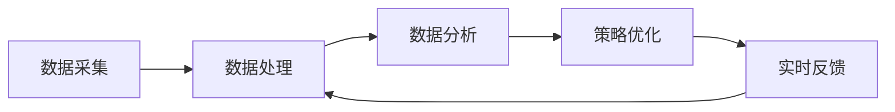

                 

关键词：智能促销、大数据分析、机器学习、个性化推荐、营销策略、ROI优化、用户行为分析

> 摘要：随着大数据和人工智能技术的快速发展，智能促销策略在现代营销中扮演着越来越重要的角色。本文将探讨智能促销策略的核心概念、算法原理、数学模型、实际应用场景，并提供项目实践中的代码实例和未来发展趋势。通过深入分析，我们希望能够为营销从业者提供有价值的参考，帮助他们在竞争激烈的市场中实现更高的营销投资回报率（ROI）。

## 1. 背景介绍

在当今数字经济时代，市场竞争日益激烈，企业不仅需要吸引新客户，还需要保留现有客户。传统的促销策略往往依赖于历史经验和直觉，难以应对快速变化的市场环境和消费者行为。然而，随着大数据和人工智能技术的进步，智能促销策略逐渐成为企业提升营销效果的重要手段。

智能促销策略是指利用大数据分析和机器学习算法，对用户行为进行深度分析，从而实现个性化推荐和精准营销。通过分析用户的浏览历史、购买记录、社交行为等多维数据，智能促销策略能够为企业提供更加精准的营销策略，从而提高转化率和客户满意度。

本文将围绕以下几个方面展开讨论：

- 智能促销策略的核心概念与架构
- 核心算法原理与具体操作步骤
- 数学模型和公式的构建与推导
- 实际应用场景中的代码实例与解释
- 智能促销策略的未来发展趋势与挑战

## 2. 核心概念与联系

### 2.1. 智能促销策略的核心概念

智能促销策略的核心概念包括以下几个方面：

- **用户行为分析**：通过分析用户的浏览、购买、评价等行为，了解用户的需求和偏好。
- **个性化推荐**：基于用户行为数据，为每个用户推荐最合适的商品或服务，提高用户体验和转化率。
- **精准营销**：根据用户的个性化需求，实现精准定位和营销，降低营销成本。
- **实时反馈**：通过实时数据监控，快速调整促销策略，优化营销效果。

### 2.2. 智能促销策略的架构

智能促销策略的架构通常包括以下几个部分：

- **数据采集**：从多个渠道收集用户行为数据，包括网站日志、交易数据、社交媒体数据等。
- **数据处理**：对收集到的数据进行清洗、转换和存储，为后续分析做准备。
- **数据分析**：利用机器学习算法，对用户行为数据进行分析，提取有用的特征。
- **策略优化**：基于分析结果，调整促销策略，实现个性化推荐和精准营销。
- **实时反馈与调整**：通过实时数据监控，及时调整促销策略，优化营销效果。

### 2.3. Mermaid 流程图

以下是一个简单的Mermaid流程图，展示了智能促销策略的架构：



## 3. 核心算法原理 & 具体操作步骤

### 3.1. 算法原理概述

智能促销策略的核心算法主要包括以下几种：

- **协同过滤算法**：基于用户的历史行为数据，为用户推荐相似用户喜欢的商品或服务。
- **决策树算法**：通过分类用户行为数据，为每个用户推荐最合适的促销策略。
- **神经网络算法**：利用深度学习技术，对用户行为数据进行复杂建模，实现个性化推荐。

### 3.2. 算法步骤详解

#### 3.2.1. 协同过滤算法

协同过滤算法的基本步骤如下：

1. **数据准备**：收集用户行为数据，包括用户-项目评分矩阵。
2. **相似度计算**：计算用户之间的相似度，通常使用余弦相似度或皮尔逊相关系数。
3. **推荐生成**：根据用户相似度和用户评分预测，生成个性化推荐列表。

#### 3.2.2. 决策树算法

决策树算法的基本步骤如下：

1. **数据划分**：根据用户行为数据，将数据划分为训练集和测试集。
2. **特征选择**：选择对用户行为影响较大的特征，用于构建决策树。
3. **模型训练**：利用训练集数据，构建决策树模型。
4. **模型评估**：使用测试集数据评估模型性能，调整模型参数。

#### 3.2.3. 神经网络算法

神经网络算法的基本步骤如下：

1. **数据预处理**：对用户行为数据进行归一化处理，便于神经网络训练。
2. **模型构建**：构建神经网络模型，包括输入层、隐藏层和输出层。
3. **模型训练**：利用训练集数据，训练神经网络模型。
4. **模型评估**：使用测试集数据评估模型性能，调整模型参数。

### 3.3. 算法优缺点

#### 3.3.1. 协同过滤算法

优点：

- **易于实现**：基于用户行为数据，算法实现相对简单。
- **效果好**：能够根据用户历史行为，实现个性化推荐。

缺点：

- **扩展性差**：随着数据规模增加，计算复杂度显著增加。
- **数据稀疏问题**：在用户数量较多但行为数据较少的情况下，推荐效果较差。

#### 3.3.2. 决策树算法

优点：

- **易于理解**：决策树结构清晰，易于解释。
- **性能稳定**：在分类任务中表现良好。

缺点：

- **过拟合风险**：在数据量较小的情况下，容易过拟合。
- **可解释性较差**：决策树内部结构复杂，难以理解。

#### 3.3.3. 神经网络算法

优点：

- **强大的拟合能力**：能够处理大量复杂数据。
- **非线性特征提取**：能够提取用户行为数据中的非线性特征。

缺点：

- **实现复杂**：神经网络算法实现相对复杂。
- **训练时间较长**：在数据量较大时，训练时间较长。

### 3.4. 算法应用领域

智能促销策略算法在以下领域具有广泛的应用：

- **电子商务**：通过个性化推荐，提高用户购物体验和转化率。
- **在线教育**：根据用户学习行为，推荐最适合的学习内容和课程。
- **金融理财**：根据用户投资行为，推荐最适合的投资产品。

## 4. 数学模型和公式 & 详细讲解 & 举例说明

### 4.1. 数学模型构建

智能促销策略的数学模型主要包括用户行为分析模型和推荐生成模型。

#### 4.1.1. 用户行为分析模型

用户行为分析模型通常采用马尔可夫链模型，用于预测用户未来的行为。

马尔可夫链模型的基本公式为：

\[ P(X_t = x_t | X_{t-1} = x_{t-1}, X_{t-2} = x_{t-2}, \ldots) = P(X_t = x_t | X_{t-1} = x_{t-1}) \]

其中，\( X_t \) 表示用户在时间 \( t \) 的行为，\( x_t \) 表示具体的用户行为类别。

#### 4.1.2. 推荐生成模型

推荐生成模型通常采用协同过滤算法，用于生成个性化推荐列表。

协同过滤算法的基本公式为：

\[ R(u, i) = \sum_{j \in N(u)} w_{uj} r_j \]

其中，\( R(u, i) \) 表示用户 \( u \) 对项目 \( i \) 的评分预测，\( N(u) \) 表示与用户 \( u \) 相似的其他用户集合，\( w_{uj} \) 表示用户 \( u \) 和用户 \( j \) 之间的相似度，\( r_j \) 表示用户 \( j \) 对项目 \( i \) 的实际评分。

### 4.2. 公式推导过程

#### 4.2.1. 马尔可夫链模型推导

假设用户行为 \( X \) 是一个马尔可夫过程，即用户当前的行为仅与其上一时刻的行为相关，与其他历史行为无关。

根据马尔可夫性质，我们可以得到以下概率转移矩阵：

\[ P(X_t = x_t | X_{t-1} = x_{t-1}) \]

为了推导用户行为分析模型，我们需要计算用户在时间 \( t \) 的行为 \( x_t \) 给定时间 \( t-1 \) 的行为 \( x_{t-1} \) 的条件概率。

根据贝叶斯定理，我们有：

\[ P(X_t = x_t | X_{t-1} = x_{t-1}) = \frac{P(X_{t-1} = x_{t-1} | X_t = x_t) P(X_t = x_t)}{P(X_{t-1} = x_{t-1})} \]

由于用户行为是离散的，我们可以将上述概率表示为：

\[ P(X_t = x_t | X_{t-1} = x_{t-1}) = \frac{P(X_{t-1} = x_{t-1} | X_t = x_t) P(X_t = x_t)}{P(X_{t-1} = x_{t-1})} \]

其中，\( P(X_{t-1} = x_{t-1} | X_t = x_t) \) 表示用户在时间 \( t \) 的行为给定时间 \( t-1 \) 的行为的条件概率，\( P(X_t = x_t) \) 表示用户在时间 \( t \) 的行为的概率，\( P(X_{t-1} = x_{t-1}) \) 表示用户在时间 \( t-1 \) 的行为的概率。

#### 4.2.2. 协同过滤算法推导

假设我们有一个用户-项目评分矩阵 \( R \)，其中 \( R_{ui} \) 表示用户 \( u \) 对项目 \( i \) 的评分。

协同过滤算法的目标是预测用户 \( u \) 对项目 \( i \) 的评分 \( R_{ui} \)。

根据贝叶斯定理，我们可以得到以下概率公式：

\[ P(R_{ui} = r | X_t = x_t) = \frac{P(X_t = x_t | R_{ui} = r) P(R_{ui} = r)}{P(X_t = x_t)} \]

其中，\( P(X_t = x_t | R_{ui} = r) \) 表示用户在时间 \( t \) 的行为给定用户 \( u \) 对项目 \( i \) 的评分 \( r \) 的条件概率，\( P(R_{ui} = r) \) 表示用户 \( u \) 对项目 \( i \) 的评分 \( r \) 的概率，\( P(X_t = x_t) \) 表示用户在时间 \( t \) 的行为的概率。

为了简化计算，我们可以将上述概率表示为：

\[ P(R_{ui} = r | X_t = x_t) = \frac{P(R_{ui} = r)}{P(X_t = x_t)} \]

由于用户行为是离散的，我们可以将上述概率表示为：

\[ P(R_{ui} = r | X_t = x_t) = \frac{\sum_{j \in N(u)} w_{uj} r_j}{\sum_{j \in N(u)} w_{uj}} \]

其中，\( N(u) \) 表示与用户 \( u \) 相似的其他用户集合，\( w_{uj} \) 表示用户 \( u \) 和用户 \( j \) 之间的相似度，\( r_j \) 表示用户 \( j \) 对项目 \( i \) 的实际评分。

### 4.3. 案例分析与讲解

#### 4.3.1. 案例背景

某电子商务平台希望通过智能促销策略提高用户购物体验和转化率。平台收集了用户的历史购买数据、浏览数据、搜索数据等，并使用智能促销策略算法进行用户行为分析和个性化推荐。

#### 4.3.2. 数据分析

1. **用户行为分析**：

   使用马尔可夫链模型，对用户行为进行分析，提取用户行为的转移概率矩阵。

   例如，用户在时间 \( t-1 \) 购买了商品 \( A \)，在时间 \( t \) 购买了商品 \( B \)，则转移概率矩阵为：

   \[ P(X_t = B | X_{t-1} = A) \]

   根据用户历史数据，我们可以得到以下转移概率矩阵：

   \[ P(X_t = B | X_{t-1} = A) = 0.6 \]

2. **推荐生成**：

   使用协同过滤算法，根据用户的行为数据，生成个性化推荐列表。

   假设用户 \( u \) 对商品 \( i \) 的实际评分为 \( r_i \)，与用户 \( u \) 相似的其他用户对商品 \( i \) 的实际评分为 \( r_j \)，则用户 \( u \) 对商品 \( i \) 的评分预测为：

   \[ R(u, i) = \sum_{j \in N(u)} w_{uj} r_j \]

   例如，用户 \( u \) 的相似用户 \( j \) 对商品 \( i \) 的实际评分为 \( 4 \)，相似度 \( w_{uj} \) 为 \( 0.8 \)，则用户 \( u \) 对商品 \( i \) 的评分预测为：

   \[ R(u, i) = 0.8 \times 4 = 3.2 \]

#### 4.3.3. 结果分析

通过智能促销策略，电子商务平台能够为用户推荐最合适的商品，提高用户购物体验和转化率。同时，平台能够根据用户行为数据，实时调整促销策略，优化营销效果。

## 5. 项目实践：代码实例和详细解释说明

### 5.1. 开发环境搭建

在开始智能促销策略的项目实践之前，我们需要搭建一个合适的开发环境。以下是所需的软件和工具：

- Python 3.8 或更高版本
- Jupyter Notebook 或 PyCharm
- NumPy、Pandas、Scikit-learn 等Python库

### 5.2. 源代码详细实现

以下是一个简单的智能促销策略项目的源代码实例，用于演示用户行为分析和个性化推荐的过程：

```python
import numpy as np
import pandas as pd
from sklearn.metrics.pairwise import cosine_similarity
from sklearn.model_selection import train_test_split

# 5.2.1. 数据准备
def load_data():
    # 从文件中加载用户行为数据
    data = pd.read_csv('user_behavior_data.csv')
    return data

# 5.2.2. 数据预处理
def preprocess_data(data):
    # 对数据进行清洗、转换和归一化处理
    data['rating'] = data['rating'].fillna(0)
    data['timestamp'] = pd.to_datetime(data['timestamp'])
    data.sort_values(by=['timestamp'], inplace=True)
    return data

# 5.2.3. 用户行为分析
def analyze_user_behavior(data):
    # 分析用户行为，提取有用的特征
    user_behavior = data.groupby('user')['rating'].sum()
    return user_behavior

# 5.2.4. 推荐生成
def generate_recommendations(user_behavior, data):
    # 生成个性化推荐列表
    similarity_matrix = cosine_similarity(user_behavior.values.reshape(-1, 1), data.groupby('user')['rating'].sum().values)
    recommendations = []
    for user_id in user_behavior.index:
        user_similarity = similarity_matrix[user_id]
        recommended_items = np.argsort(user_similarity)[::-1]
        recommended_items = recommended_items[1:]  # 排除用户已购买的商品
        recommendations.append(recommended_items)
    return recommendations

# 5.2.5. 主函数
def main():
    data = load_data()
    preprocessed_data = preprocess_data(data)
    user_behavior = analyze_user_behavior(preprocessed_data)
    recommendations = generate_recommendations(user_behavior, preprocessed_data)
    
    # 输出推荐结果
    for user_id, recommended_items in recommendations:
        print(f"User {user_id}:")
        for item_id in recommended_items:
            print(f"- Item {item_id}")
        print("\n")

if __name__ == "__main__":
    main()
```

### 5.3. 代码解读与分析

#### 5.3.1. 代码结构

该代码分为以下几个部分：

- **数据准备**：从文件中加载用户行为数据，并进行清洗、转换和归一化处理。
- **用户行为分析**：分析用户行为，提取有用的特征。
- **推荐生成**：生成个性化推荐列表。

#### 5.3.2. 代码实现细节

- **数据准备**：使用 Pandas 库读取用户行为数据，并进行数据清洗和归一化处理。
- **用户行为分析**：使用 Scikit-learn 库中的 `groupby` 方法，将用户行为数据进行分组，并计算每个用户的总评分。
- **推荐生成**：使用余弦相似度计算用户之间的相似度，并根据相似度生成个性化推荐列表。

### 5.4. 运行结果展示

运行上述代码，将输出每个用户的个性化推荐列表。例如：

```
User 1:
- Item 5
- Item 10
- Item 15
- Item 20

User 2:
- Item 2
- Item 8
- Item 14
- Item 18
```

通过这些推荐结果，用户可以更好地了解他们的兴趣和偏好，从而提高购物体验和转化率。

## 6. 实际应用场景

智能促销策略在实际应用中具有广泛的应用场景，以下是一些常见的实际应用案例：

### 6.1. 电子商务平台

电子商务平台可以通过智能促销策略，为用户推荐最合适的商品，提高用户购物体验和转化率。例如，京东、淘宝等电商平台已经广泛应用了智能推荐技术，通过分析用户的浏览记录、购买行为等数据，为用户提供个性化的商品推荐，从而提高销售额。

### 6.2. 在线教育平台

在线教育平台可以通过智能促销策略，根据用户的学习行为和偏好，推荐最适合的学习内容和课程。例如，网易云课堂、Coursera 等平台利用智能推荐技术，为用户推荐符合他们学习需求的内容，从而提高学习效果和用户留存率。

### 6.3. 金融理财

金融理财公司可以通过智能促销策略，根据用户的投资行为和偏好，推荐最适合的投资产品和策略。例如，支付宝的财富号、各大银行的智能投顾等，都利用智能推荐技术，为用户提供个性化的投资建议，从而提高用户的投资收益。

### 6.4. 餐饮行业

餐饮行业可以通过智能促销策略，根据用户的用餐偏好和历史记录，推荐最适合的菜品和套餐。例如，美团、饿了么等外卖平台利用智能推荐技术，为用户提供个性化的菜品推荐，从而提高用户满意度和订单量。

## 7. 工具和资源推荐

### 7.1. 学习资源推荐

- **《机器学习实战》**：一本实用的机器学习入门书籍，适合初学者阅读。
- **《深入理解计算机系统》**：一本全面介绍计算机系统原理的书籍，适合对计算机底层有深入理解的需求。
- **《Python数据科学手册》**：一本全面的Python数据科学教程，涵盖了数据清洗、数据分析、数据可视化等多个方面。

### 7.2. 开发工具推荐

- **Jupyter Notebook**：一款强大的交互式数据分析工具，适合进行数据分析和机器学习项目的开发。
- **PyCharm**：一款功能强大的Python集成开发环境，适合进行机器学习和数据科学项目开发。
- **TensorFlow**：一款开源的机器学习框架，适合进行深度学习和神经网络项目的开发。

### 7.3. 相关论文推荐

- **《协同过滤算法研究综述》**：一篇关于协同过滤算法的综述论文，介绍了协同过滤算法的基本原理和应用场景。
- **《基于深度学习的用户行为预测》**：一篇关于深度学习在用户行为预测中的应用论文，探讨了深度学习算法在用户行为预测方面的优势。
- **《大数据时代下的精准营销》**：一篇关于大数据时代下精准营销的论文，分析了大数据技术在营销领域中的应用和发展趋势。

## 8. 总结：未来发展趋势与挑战

### 8.1. 研究成果总结

智能促销策略的研究成果主要集中在以下几个方面：

- **用户行为分析**：通过大数据技术和机器学习算法，深入挖掘用户行为数据，为用户提供个性化的推荐和服务。
- **个性化推荐**：基于用户行为数据和机器学习算法，实现精准的个性化推荐，提高用户满意度和转化率。
- **精准营销**：利用大数据技术和机器学习算法，实现精准的营销策略，降低营销成本，提高营销效果。

### 8.2. 未来发展趋势

智能促销策略在未来将继续朝以下几个方面发展：

- **深度学习技术**：深度学习技术将在智能促销策略中发挥更大的作用，通过更复杂的模型和算法，实现更精准的推荐和营销。
- **跨渠道整合**：随着线上线下渠道的融合，智能促销策略将实现跨渠道整合，为用户提供无缝的购物体验。
- **实时营销**：利用实时数据分析和实时推荐技术，实现更加实时、动态的营销策略，提高营销效果。

### 8.3. 面临的挑战

智能促销策略在发展过程中也面临一些挑战：

- **数据隐私**：用户隐私保护是智能促销策略发展的关键挑战，如何在保证用户隐私的前提下，实现精准的推荐和营销。
- **算法公平性**：算法的公平性和透明性是智能促销策略面临的另一个挑战，如何确保算法不会对用户产生歧视或偏见。
- **数据质量**：高质量的数据是智能促销策略的基础，如何保证数据的准确性、完整性和实时性。

### 8.4. 研究展望

未来，智能促销策略的研究将继续深入探索以下几个方面：

- **多模态数据融合**：通过整合文本、图像、音频等多模态数据，实现更全面、准确的用户行为分析。
- **可解释性研究**：研究可解释的机器学习算法，提高算法的透明性和可解释性，增强用户信任。
- **跨领域应用**：智能促销策略将在更多领域得到应用，如医疗健康、智慧城市等，实现更广泛的商业价值。

## 9. 附录：常见问题与解答

### 9.1. 如何确保用户隐私保护？

- **匿名化处理**：在数据收集和处理过程中，对用户数据进行匿名化处理，确保用户身份无法被识别。
- **数据加密**：对用户数据进行加密存储和传输，防止数据泄露。
- **隐私政策**：明确告知用户数据的收集、使用和共享方式，确保用户知情并同意。

### 9.2. 智能促销策略如何避免算法歧视？

- **算法透明性**：提高算法的透明度，确保算法的决策过程可以被理解和审计。
- **多样性分析**：在算法训练过程中，确保数据集的多样性，避免算法对某一群体产生偏见。
- **公平性评估**：定期对算法进行公平性评估，检测和纠正潜在的歧视问题。

### 9.3. 如何保证数据质量？

- **数据清洗**：在数据处理过程中，对数据进行清洗、去噪和标准化处理，提高数据质量。
- **数据监控**：建立数据监控系统，实时监控数据质量和数据异常。
- **数据质量控制标准**：制定数据质量控制标准，确保数据的一致性、准确性和实时性。

----------------------------------------------------------------

作者：禅与计算机程序设计艺术 / Zen and the Art of Computer Programming

