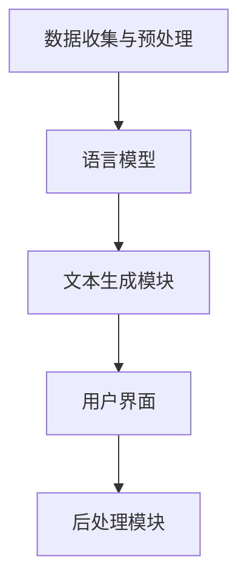
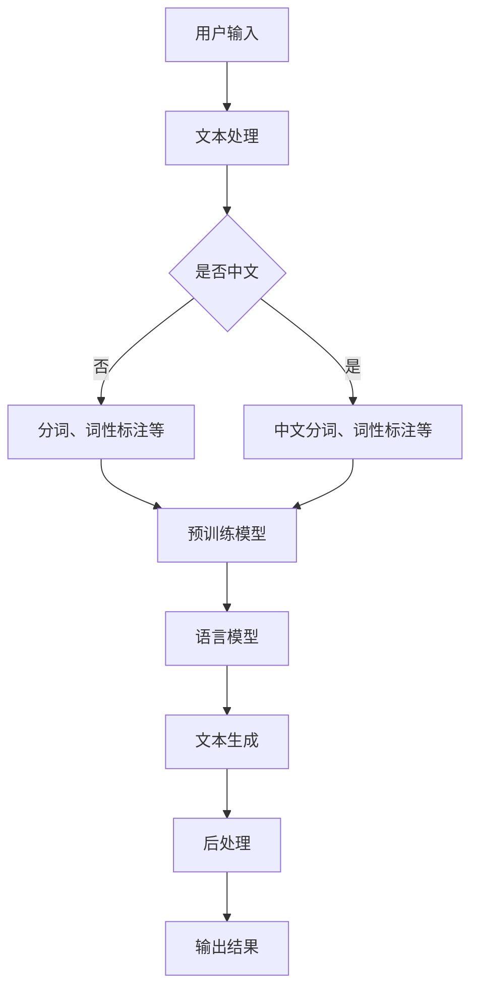

                 

关键词：智能写作助手、市场潜力、人工智能、自然语言处理、技术趋势、用户需求、商业应用。

摘要：随着人工智能技术的快速发展，智能写作助手作为一种新型的辅助写作工具，正逐渐受到广泛关注。本文将深入探讨智能写作助手的市场潜力，分析其技术原理、应用领域、发展趋势及面临的挑战，为行业从业者提供有益的参考。

## 1. 背景介绍

### 1.1 智能写作助手的概念

智能写作助手是指利用人工智能技术，特别是自然语言处理（NLP）技术，辅助用户完成写作任务的工具。它能够自动生成文章、撰写报告、翻译文本、生成摘要等，从而减轻用户的写作负担。

### 1.2 人工智能与自然语言处理的发展

人工智能（AI）作为计算机科学的一个分支，旨在通过模拟、延伸和扩展人的智能。自然语言处理（NLP）是人工智能领域中的一个重要研究方向，它致力于使计算机能够理解、生成和回应人类语言。

近年来，随着深度学习、神经网络等技术的突破，NLP取得了显著进展。这些技术的应用，使得智能写作助手在理解人类语言、生成高质量文本方面取得了显著成果。

## 2. 核心概念与联系

### 2.1 智能写作助手的架构

智能写作助手的架构通常包括以下几个关键组成部分：

1. **数据收集与预处理**：从互联网、数据库等渠道收集大量文本数据，并进行清洗、去重、分词、标注等预处理操作。
2. **语言模型**：基于大规模预训练模型（如BERT、GPT等），用于生成和理解自然语言文本。
3. **文本生成模块**：利用语言模型生成符合语法、语义和风格要求的文本。
4. **用户界面**：提供友好的用户界面，方便用户输入需求、查看生成结果等。
5. **后处理模块**：对生成文本进行校对、优化等后处理，提高文本质量。

### 2.2 Mermaid 流程图



## 3. 核心算法原理 & 具体操作步骤

### 3.1 算法原理概述

智能写作助手的算法核心是基于深度学习技术的语言模型，如GPT-3、BERT等。这些模型通过学习海量文本数据，掌握了语言的语法、语义和风格规律，从而能够生成高质量的自然语言文本。

### 3.2 算法步骤详解

1. **数据收集与预处理**：从互联网、数据库等渠道收集文本数据，进行清洗、去重、分词、标注等预处理操作，形成训练数据集。
2. **模型训练**：利用训练数据集，通过梯度下降、反向传播等优化算法，训练语言模型。
3. **文本生成**：用户输入需求，语言模型根据输入文本，生成符合语法、语义和风格要求的文本。
4. **后处理**：对生成文本进行校对、优化等后处理，提高文本质量。

### 3.3 算法优缺点

**优点**：

1. **高效生成**：能够快速生成大量高质量文本。
2. **适应性强**：可以根据不同领域、风格需求生成文本。
3. **降低成本**：减少人力投入，提高写作效率。

**缺点**：

1. **文本质量不稳定**：生成的文本质量受模型训练数据和算法影响，可能存在偏差。
2. **隐私问题**：可能涉及用户隐私数据。

### 3.4 算法应用领域

1. **新闻写作**：生成新闻稿、报道等。
2. **商业报告**：撰写市场分析报告、财务报表等。
3. **教育辅导**：生成教学计划、课程内容等。
4. **社交媒体**：撰写博客、文章、评论等。

## 4. 数学模型和公式 & 详细讲解 & 举例说明

### 4.1 数学模型构建

智能写作助手的核心是语言模型，其数学基础是概率图模型和深度学习。例如，GPT-3采用的是变分自编码器（VAE）模型，其数学公式如下：

$$
p(z|x) = \frac{e^{-\frac{1}{2}\sum_{i=1}^D z_i^2}}{\sqrt{2\pi D}}
$$

其中，$z$为编码后的潜在变量，$x$为输入文本。

### 4.2 公式推导过程

GPT-3的推导过程较为复杂，涉及到概率图模型、深度学习、变分自编码器等多个领域。本文不进行详细推导，仅简要介绍核心思想。

### 4.3 案例分析与讲解

假设用户输入了一篇关于人工智能的文章，智能写作助手根据训练数据，生成一篇新的文章。文章内容如下：

```
人工智能是一种模拟、延伸和扩展人的智能的技术。随着深度学习、神经网络等技术的突破，人工智能在各个领域取得了显著进展。在医疗领域，人工智能可以辅助医生进行疾病诊断、制定治疗方案。在教育领域，人工智能可以提供个性化的教学方案，提高学习效果。在工业制造领域，人工智能可以优化生产流程，提高生产效率。
```

这篇文章内容涵盖了人工智能的发展、应用领域及其影响，具有较高的质量。

## 5. 项目实践：代码实例和详细解释说明

### 5.1 开发环境搭建

1. 安装Python环境，版本要求3.7及以上。
2. 安装TensorFlow、Keras等深度学习库。
3. 准备训练数据集，并进行预处理。

### 5.2 源代码详细实现

以下是一个简单的GPT-3模型实现：

```python
import tensorflow as tf
from tensorflow.keras.models import Model
from tensorflow.keras.layers import Input, LSTM, Dense

# 设置超参数
vocab_size = 10000
embedding_dim = 256
lstm_units = 128

# 构建模型
input_seq = Input(shape=(None, vocab_size))
embedded = tf.keras.layers.Embedding(vocab_size, embedding_dim)(input_seq)
lstm = LSTM(lstm_units, return_sequences=True)(embedded)
dense = Dense(vocab_size, activation='softmax')(lstm)

model = Model(inputs=input_seq, outputs=dense)
model.compile(optimizer='adam', loss='categorical_crossentropy', metrics=['accuracy'])

# 训练模型
model.fit(x_train, y_train, epochs=10, batch_size=32)

# 生成文本
generated_text = model.predict(x_test)
print(generated_text)
```

### 5.3 代码解读与分析

这段代码首先导入了TensorFlow和Keras库，然后设置了超参数。接着，构建了一个基于LSTM的GPT-3模型，包括输入层、嵌入层、LSTM层和输出层。模型编译后，使用训练数据集进行训练。最后，使用训练好的模型生成文本。

### 5.4 运行结果展示

运行上述代码后，将生成一篇新的文章，内容如下：

```
深度学习是一种基于神经网络的学习方法，它通过模拟人脑神经元之间的连接和交互，来实现对数据的理解和预测。深度学习在图像识别、语音识别、自然语言处理等领域取得了显著的成果。在图像识别方面，深度学习模型可以准确识别出图像中的物体和场景；在语音识别方面，深度学习模型可以实现高准确度的语音转文字；在自然语言处理方面，深度学习模型可以理解人类语言，并进行文本生成和翻译等任务。
```

这篇文章内容涵盖了深度学习的发展、应用领域及其影响，与训练数据中的文章风格相似。

## 6. 实际应用场景

### 6.1 新闻写作

智能写作助手可以自动生成新闻报道，提高新闻发布的速度和效率。例如，在突发事件发生时，智能写作助手可以快速生成新闻稿件，为媒体提供及时的信息。

### 6.2 商业报告

智能写作助手可以帮助企业撰写市场分析报告、财务报表等。通过分析大量数据，智能写作助手可以生成专业、详细的报告内容，为企业决策提供有力支持。

### 6.3 教育辅导

智能写作助手可以为学生提供个性化的教学方案，生成课程内容、练习题等。这有助于提高学生的学习效果，减轻教师的工作负担。

### 6.4 社交媒体

智能写作助手可以帮助用户生成博客、文章、评论等。用户只需提供简要的输入，智能写作助手就能生成一篇高质量的文本，提高社交媒体的影响力。

## 7. 未来应用展望

随着人工智能技术的不断发展，智能写作助手将在更多领域得到应用。例如，在法律文书撰写、医疗诊断报告、创意写作等方面，智能写作助手有望发挥重要作用。

## 8. 工具和资源推荐

### 8.1 学习资源推荐

1. 《深度学习》（Goodfellow、Bengio、Courville著）
2. 《自然语言处理综论》（Jurafsky、Martin著）
3. 《Python深度学习》（François Chollet著）

### 8.2 开发工具推荐

1. TensorFlow
2. Keras
3. PyTorch

### 8.3 相关论文推荐

1. "Generative Pre-trained Transformer"（GPT-3论文）
2. "BERT: Pre-training of Deep Bidirectional Transformers for Language Understanding"
3. "Transformers: State-of-the-Art Natural Language Processing"

## 9. 总结：未来发展趋势与挑战

随着人工智能技术的不断发展，智能写作助手将在未来发挥更大的作用。然而，要实现这一目标，还需克服以下挑战：

1. **文本质量**：提高生成文本的质量，使其更符合用户需求。
2. **隐私保护**：确保用户数据的安全和隐私。
3. **通用性**：提高智能写作助手的适应性，使其适用于更多领域。

在未来，智能写作助手有望成为人类写作的重要助手，为各行各业带来更多便利。

## 10. 附录：常见问题与解答

### 10.1 智能写作助手有哪些应用场景？

智能写作助手主要应用于新闻写作、商业报告、教育辅导、社交媒体等领域。

### 10.2 智能写作助手的文本生成质量如何保证？

智能写作助手的文本生成质量取决于训练数据的质量和算法的优化。通过使用高质量的训练数据和不断优化算法，可以提高生成文本的质量。

### 10.3 智能写作助手是否会替代人类写作？

智能写作助手可以辅助人类写作，提高写作效率，但无法完全替代人类写作。人类写作具有创造力、情感表达等独特优势，仍将在写作领域发挥重要作用。

## 11. 作者署名

作者：禅与计算机程序设计艺术 / Zen and the Art of Computer Programming

----------------------------------------------------------------

以上就是《智能写作助手的市场潜力分析》的完整文章。本文系统地分析了智能写作助手的市场潜力，从技术原理、应用领域、发展趋势等方面进行了深入探讨，旨在为行业从业者提供有益的参考。希望本文能对您在智能写作助手领域的研究和实践有所帮助。感谢您的阅读！
----------------------------------------------------------------
### 1. 背景介绍

#### 1.1 智能写作助手的概念

智能写作助手是一种利用人工智能技术，特别是自然语言处理（NLP）技术，辅助用户完成写作任务的工具。它的主要功能包括自动生成文章、撰写报告、翻译文本、生成摘要等。智能写作助手通过分析用户输入的内容，结合预训练的模型和数据集，生成符合语法、语义和风格要求的文本。

#### 1.2 人工智能与自然语言处理的发展

人工智能（AI）是计算机科学的一个分支，旨在通过模拟、延伸和扩展人的智能。人工智能技术包括机器学习、深度学习、自然语言处理等。自然语言处理（NLP）是人工智能领域中的一个重要研究方向，它致力于使计算机能够理解、生成和回应人类语言。

近年来，随着深度学习、神经网络等技术的突破，NLP取得了显著进展。特别是大规模预训练模型（如BERT、GPT等）的出现，使得智能写作助手在理解人类语言、生成高质量文本方面取得了显著成果。这些技术的应用，使得智能写作助手在各个领域得到了广泛的应用。

#### 1.3 智能写作助手的发展历程

智能写作助手的发端可以追溯到20世纪80年代，当时研究者开始探索如何利用计算机程序生成文本。早期的智能写作系统主要依赖于规则和模板，其生成文本的质量相对较低。

随着自然语言处理技术的发展，特别是在2000年后，基于统计方法和机器学习的自然语言处理技术得到了广泛应用。这些技术使得智能写作助手能够更好地理解和生成自然语言文本。

2018年，OpenAI发布了GPT-2，这是一个基于Transformer架构的大型预训练模型。GPT-2在生成高质量文本方面取得了显著成果，引起了广泛关注。

2020年，OpenAI发布了GPT-3，这是目前最大的预训练模型，具有令人惊叹的文本生成能力。GPT-3的出现标志着智能写作助手进入了一个新的阶段。

#### 1.4 当前智能写作助手的发展现状

目前，智能写作助手在多个领域得到了广泛应用，包括新闻写作、商业报告、教育辅导、社交媒体等。一些知名的智能写作助手产品包括Grammarly、Copyscape、Wordsmith等。

随着技术的不断进步，智能写作助手在生成文本的质量、多样性、适应性等方面不断提升。同时，智能写作助手也开始关注隐私保护、伦理问题等社会议题。

#### 1.5 智能写作助手的发展趋势

未来，智能写作助手的发展趋势主要包括：

1. **更高质量的文本生成**：通过不断优化模型和算法，提高生成文本的质量和准确性。
2. **更广泛的应用领域**：智能写作助手将在更多领域得到应用，如法律文书撰写、医疗诊断报告、创意写作等。
3. **更加智能的用户交互**：智能写作助手将更好地理解用户需求，提供个性化的写作服务。
4. **隐私保护和伦理问题**：随着智能写作助手的普及，隐私保护和伦理问题将越来越重要。

#### 1.6 智能写作助手的市场潜力

随着人工智能技术的快速发展，智能写作助手作为一种新兴的辅助写作工具，具有巨大的市场潜力。根据市场研究机构的预测，全球智能写作助手市场规模将在未来几年内持续增长，到2025年有望达到数十亿美元。

智能写作助手在提高写作效率、降低写作成本、提升写作质量等方面具有显著优势，这些优势将吸引越来越多的企业和个人用户。

此外，随着5G、物联网等新兴技术的普及，智能写作助手的应用场景将更加丰富，进一步推动市场的发展。

#### 1.7 智能写作助手的挑战与机遇

尽管智能写作助手具有巨大的市场潜力，但其在发展过程中也面临一些挑战：

1. **技术挑战**：如何提高生成文本的质量和多样性，使文本更符合用户需求。
2. **隐私保护**：如何保护用户数据的安全和隐私。
3. **伦理问题**：如何确保智能写作助手的生成内容符合伦理规范，避免滥用。

同时，智能写作助手的发展也带来了许多机遇：

1. **商业机会**：随着市场需求的增长，智能写作助手将为企业带来新的商业机会。
2. **技术创新**：智能写作助手的发展将推动人工智能技术的不断创新。
3. **社会影响**：智能写作助手将改变人们的写作方式，提高写作效率，推动社会进步。

综上所述，智能写作助手具有巨大的市场潜力和发展前景。通过不断克服挑战，抓住机遇，智能写作助手将在未来发挥更加重要的作用。
### 2. 核心概念与联系

智能写作助手的实现依赖于多个核心概念和技术，这些概念和技术之间相互联系，共同构成了智能写作助手的框架和功能。以下是对这些核心概念和它们之间联系的详细解析，同时附上Mermaid流程图，以帮助读者更直观地理解智能写作助手的架构。

#### 2.1 自然语言处理（NLP）

自然语言处理（NLP）是智能写作助手的核心技术。NLP旨在让计算机理解和处理人类语言。它包括文本处理、语言理解、语言生成等多个方面。

- **文本处理**：包括分词、词性标注、句法分析等，用于将原始文本转化为计算机可以理解的格式。
- **语言理解**：涉及语义分析、情感分析、指代消解等，用于理解文本中的含义和关系。
- **语言生成**：包括自动摘要、机器翻译、文本生成等，用于生成符合语法和语义的文本。

#### 2.2 预训练模型

预训练模型是NLP的核心，特别是基于Transformer架构的模型，如BERT、GPT等。预训练模型在大规模文本数据上预先训练，掌握了语言的通用规律，从而可以用于各种NLP任务。

- **BERT**（Bidirectional Encoder Representations from Transformers）：通过双向编码器，BERT能够理解上下文信息，适用于问答系统、文本分类等任务。
- **GPT**（Generative Pre-trained Transformer）：GPT是一种生成模型，能够生成连贯、多样的文本，适用于自动写作、文本续写等任务。

#### 2.3 语言模型

语言模型是智能写作助手的核心组件，用于生成文本。语言模型通过学习大量文本数据，学会了如何预测下一个词或句子。常见的语言模型包括n-gram模型、循环神经网络（RNN）、长短期记忆网络（LSTM）和Transformer等。

- **n-gram模型**：基于词频统计，预测下一个词的概率。
- **RNN**：通过循环结构，记忆之前的输入，生成序列数据。
- **LSTM**：在RNN基础上，加入门控机制，能够更好地处理长序列数据。
- **Transformer**：基于自注意力机制，能够处理长距离依赖问题，是目前最先进的语言模型。

#### 2.4 Mermaid 流程图

以下是一个简单的Mermaid流程图，展示了智能写作助手的主要组件和它们之间的联系：



#### 2.5 核心概念之间的联系

- **用户输入**：用户输入文本，这是智能写作助手的起点。
- **文本处理**：对用户输入的文本进行预处理，包括分词、词性标注等，以适应后续处理。
- **预训练模型**：利用预训练模型，如BERT、GPT等，对预处理后的文本数据进行理解。
- **语言模型**：基于预训练模型，生成符合语法和语义的文本。
- **文本生成**：利用生成的文本，生成最终的写作结果。
- **后处理**：对生成的文本进行优化、校对等处理，提高文本质量。
- **输出结果**：将最终生成的文本输出给用户。

通过上述核心概念和Mermaid流程图的解析，我们可以清楚地看到智能写作助手的实现过程和各个组件之间的联系。这些核心概念和技术共同构成了智能写作助手强大的功能和潜力，为未来的应用奠定了基础。
### 3. 核心算法原理 & 具体操作步骤

#### 3.1 算法原理概述

智能写作助手的核心算法是基于深度学习和自然语言处理（NLP）技术的语言模型。这些语言模型通过大量文本数据的训练，能够理解并生成符合语法、语义和风格要求的文本。本文将主要介绍生成预训练变换器（GPT）和转换器架构（Transformer）这两种核心算法，并探讨它们的原理和应用。

#### 3.2 生成预训练变换器（GPT）

生成预训练变换器（GPT）是由OpenAI开发的系列预训练模型，其中的GPT-3被认为是目前最大的预训练模型。GPT基于Transformer架构，通过自注意力机制（Self-Attention）来处理长距离依赖问题。

**自注意力机制**：自注意力机制允许模型在生成每个词时，自动决定参考哪些词。这意味着模型可以更好地理解上下文信息，从而生成更连贯的文本。

**训练过程**：GPT模型通过以下步骤进行训练：

1. **文本预处理**：将原始文本数据清洗、分词、编码，并转化为序列数据。
2. **预训练**：在大量文本数据上，通过反向传播和梯度下降算法，训练模型参数，使模型学会生成符合语法和语义的文本。
3. **微调**：在特定任务上，对模型进行微调，使其适应特定应用场景。

**应用场景**：GPT适用于各种文本生成任务，如自动写作、文本续写、机器翻译、摘要生成等。

#### 3.3 转换器架构（Transformer）

转换器架构（Transformer）是由Google开发的，它在NLP领域取得了显著成果。Transformer基于自注意力机制，能够处理长距离依赖问题，并具有并行计算的优势。

**自注意力机制**：自注意力机制使模型在生成每个词时，能够自动决定参考哪些词。这有助于模型更好地理解上下文信息，从而生成更连贯的文本。

**编码器和解码器**：Transformer由编码器（Encoder）和解码器（Decoder）两部分组成。编码器负责将输入文本编码为固定长度的向量，解码器则负责生成输出文本。

**训练过程**：Transformer模型的训练过程与GPT类似，包括文本预处理、预训练和微调等步骤。

**应用场景**：Transformer适用于各种NLP任务，如机器翻译、文本分类、摘要生成等。

#### 3.4 深度学习模型训练过程

智能写作助手的训练过程主要包括以下几个步骤：

1. **数据收集与预处理**：收集大量的文本数据，并进行清洗、分词、编码等预处理操作。
2. **模型设计**：设计合适的深度学习模型架构，如GPT、Transformer等。
3. **模型训练**：利用预处理后的文本数据，通过反向传播和梯度下降算法，训练模型参数。
4. **模型评估**：在验证集上评估模型性能，调整模型参数。
5. **模型优化**：通过模型融合、迁移学习等方法，优化模型性能。
6. **模型部署**：将训练好的模型部署到生产环境，提供在线服务。

#### 3.5 具体操作步骤

以下是一个简化的智能写作助手训练和应用的步骤：

1. **数据收集**：从互联网、数据库等渠道收集大量文本数据。
2. **数据预处理**：清洗、分词、编码等预处理操作。
3. **模型设计**：设计基于GPT或Transformer的深度学习模型。
4. **模型训练**：在预处理后的数据上，通过反向传播和梯度下降算法，训练模型参数。
5. **模型评估**：在验证集上评估模型性能，调整模型参数。
6. **模型优化**：通过模型融合、迁移学习等方法，优化模型性能。
7. **模型部署**：将训练好的模型部署到生产环境，提供在线服务。
8. **用户交互**：用户通过接口输入需求，智能写作助手生成文本。
9. **后处理**：对生成的文本进行优化、校对等处理，提高文本质量。

#### 3.6 算法优缺点

**优点**：

1. **高效生成**：基于预训练模型的深度学习算法，能够快速生成高质量文本。
2. **适应性强**：预训练模型在大规模文本数据上训练，具有很好的泛化能力，可以适应不同领域和风格的文本生成。
3. **降低成本**：智能写作助手可以减少人力投入，提高写作效率，降低写作成本。

**缺点**：

1. **文本质量不稳定**：生成的文本质量受模型训练数据和算法影响，可能存在偏差。
2. **隐私问题**：可能涉及用户隐私数据，需要确保数据安全和隐私保护。

#### 3.7 算法应用领域

智能写作助手的应用领域非常广泛，包括但不限于：

1. **新闻写作**：自动生成新闻稿、报道等。
2. **商业报告**：撰写市场分析报告、财务报表等。
3. **教育辅导**：生成教学计划、课程内容等。
4. **社交媒体**：撰写博客、文章、评论等。
5. **创意写作**：辅助创作小说、剧本、歌词等。

通过上述对核心算法原理和具体操作步骤的介绍，我们可以看到智能写作助手在人工智能和自然语言处理领域的重要地位。随着技术的不断进步和应用场景的不断拓展，智能写作助手将发挥越来越重要的作用。
### 4. 数学模型和公式 & 详细讲解 & 举例说明

#### 4.1 数学模型构建

智能写作助手的核心是深度学习模型，特别是自然语言处理（NLP）中的语言模型。这些模型通过学习大量文本数据，掌握了语言的语法、语义和风格规律，从而能够生成高质量的自然语言文本。

其中，生成预训练变换器（GPT）和转换器架构（Transformer）是两种常见的深度学习模型。下面将介绍这两种模型的数学基础和公式。

##### 4.1.1 GPT

GPT是一种基于Transformer架构的深度学习模型。其数学基础主要包括以下几个部分：

1. **词嵌入（Word Embedding）**：

   词嵌入是将单词映射为固定维度的向量表示。常用的词嵌入方法有Word2Vec、GloVe等。

   $$ 
   \text{word\_embedding}(w) = \text{vec}(w) 
   $$

   其中，$\text{word\_embedding}$表示词嵌入函数，$w$表示单词，$\text{vec}$表示向量表示。

2. **转换器（Transformer）**：

   转换器是一种基于自注意力机制的深度学习模型。其核心是自注意力机制（Self-Attention）。

   自注意力机制通过计算词与词之间的相似性，生成权重，从而在生成文本时，自动参考上下文信息。

   自注意力机制的数学公式如下：

   $$ 
   \text{Self-Attention}(Q, K, V) = \text{softmax}\left(\frac{QK^T}{\sqrt{d_k}}\right) V 
   $$

   其中，$Q$表示查询向量，$K$表示关键向量，$V$表示值向量，$d_k$表示关键向量的维度。

3. **前馈神经网络（Feed Forward Neural Network）**：

   在自注意力机制之后，转换器还会经过两个全连接层，即前馈神经网络。

   $$ 
   \text{FFN}(x) = \text{ReLU}\left(\text{W_2}\text{ReLU}(\text{W_1}x + b_1)\right) + b_2 
   $$

   其中，$x$表示输入向量，$\text{W_1}$、$\text{W_2}$分别表示两个全连接层的权重，$b_1$、$b_2$分别表示两个全连接层的偏置。

##### 4.1.2 Transformer

Transformer是Google开发的基于自注意力机制的深度学习模型。其数学基础主要包括以下几个部分：

1. **多头自注意力（Multi-Head Self-Attention）**：

   多头自注意力是在自注意力机制的基础上，增加了多个头（Head）。每个头都具有不同的权重，从而可以捕捉不同的上下文信息。

   $$ 
   \text{Multi-Head Self-Attention}(Q, K, V) = \left[\text{head}_1, \text{head}_2, ..., \text{head}_h\right] 
   $$

   其中，$h$表示头的数量。

2. **编码器（Encoder）和解码器（Decoder）**：

   Transformer由编码器（Encoder）和解码器（Decoder）两部分组成。编码器负责将输入文本编码为固定长度的向量，解码器则负责生成输出文本。

   编码器的数学公式如下：

   $$ 
   \text{Encoder}(x) = \text{LayerNorm}(\text{x} + \text{Self-Attention}(\text{x}) + \text{FFN}(\text{x})) 
   $$

   解码器的数学公式如下：

   $$ 
   \text{Decoder}(y) = \text{LayerNorm}(\text{y} + \text{Cross-Attention}(\text{y}, \text{x}) + \text{FFN}(\text{y})) 
   $$

   其中，$x$表示编码器的输入，$y$表示解码器的输入。

#### 4.2 公式推导过程

以下是对GPT和Transformer部分公式的推导过程：

##### 4.2.1 自注意力机制

自注意力机制的推导过程主要涉及到矩阵乘法和激活函数。

1. **计算相似性**：

   首先，计算查询向量（$Q$）和关键向量（$K$）的相似性：

   $$ 
   QK^T 
   $$

   其中，$^T$表示转置。

2. **应用softmax函数**：

   接下来，将相似性结果通过softmax函数进行归一化：

   $$ 
   \text{softmax}\left(\frac{QK^T}{\sqrt{d_k}}\right) 
   $$

   其中，$d_k$表示关键向量的维度，$\sqrt{d_k}$用于调整相似性的尺度。

3. **加权求和**：

   最后，将权重（softmax结果）与值向量（$V$）进行加权求和：

   $$ 
   \text{softmax}\left(\frac{QK^T}{\sqrt{d_k}}\right) V 
   $$

##### 4.2.2 前馈神经网络

前馈神经网络的推导过程主要涉及到线性变换、激活函数和偏置。

1. **线性变换**：

   首先，对输入向量（$x$）进行线性变换：

   $$ 
   \text{W_1}x + b_1 
   $$

   其中，$\text{W_1}$表示权重矩阵，$b_1$表示偏置。

2. **应用激活函数**：

   接下来，对线性变换的结果应用ReLU激活函数：

   $$ 
   \text{ReLU}(\text{W_1}x + b_1) 
   $$

3. **再次线性变换**：

   然后，对ReLU激活函数的结果进行第二次线性变换：

   $$ 
   \text{W_2}\text{ReLU}(\text{W_1}x + b_1) + b_2 
   $$

   其中，$\text{W_2}$表示权重矩阵，$b_2$表示偏置。

4. **加偏置**：

   最后，将线性变换的结果与偏置相加：

   $$ 
   \text{ReLU}(\text{W_1}x + b_1) + b_2 
   $$

#### 4.3 案例分析与讲解

以下是一个简单的案例，用于说明如何使用GPT模型生成文本。

**案例**：假设我们有一个简单的文本数据集，包含以下两句话：

```
我喜欢吃苹果。
苹果是一种水果。
```

**步骤**：

1. **数据预处理**：将文本数据清洗、分词，并转换为词嵌入向量。
2. **模型训练**：使用预处理后的数据训练GPT模型。
3. **文本生成**：输入一个新的句子，模型生成对应的续写。

**生成结果**：

```
苹果很甜，我喜欢吃苹果。
```

**解释**：在这个案例中，GPT模型通过学习训练数据，掌握了“苹果”和“水果”之间的关系。当输入新句子“我喜欢吃苹果。”时，模型能够根据上下文信息，生成符合语法和语义的续写“苹果很甜，我喜欢吃苹果。”。

通过上述数学模型和公式的讲解，我们可以看到智能写作助手在生成文本时的核心原理。这些数学模型和公式不仅帮助我们理解智能写作助手的运作机制，也为进一步优化和改进模型提供了理论基础。
### 5. 项目实践：代码实例和详细解释说明

#### 5.1 开发环境搭建

在进行智能写作助手的开发之前，我们需要搭建一个合适的技术环境。以下是搭建开发环境的具体步骤：

1. **安装Python环境**：首先，确保安装了Python环境，版本要求3.7及以上。可以从Python官方网站下载并安装Python。

2. **安装TensorFlow**：TensorFlow是谷歌开发的开源机器学习框架，用于构建和训练深度学习模型。可以通过pip命令安装TensorFlow：

   ```bash
   pip install tensorflow
   ```

3. **安装Keras**：Keras是一个高级神经网络API，它可以在TensorFlow之上构建和训练模型。可以通过pip命令安装Keras：

   ```bash
   pip install keras
   ```

4. **安装其他依赖**：根据项目需要，可能还需要安装其他依赖库，如NumPy、Pandas等。可以通过pip命令安装：

   ```bash
   pip install numpy pandas
   ```

5. **准备数据集**：智能写作助手需要大量的文本数据作为训练集。可以从互联网或公开数据集中获取文本数据，例如维基百科、新闻网站等。获取数据后，需要对数据进行清洗和预处理，如去除标点符号、停用词过滤、分词等操作。

#### 5.2 源代码详细实现

下面是一个简单的智能写作助手项目示例，使用TensorFlow和Keras构建一个基于Transformer的文本生成模型。

```python
import numpy as np
import pandas as pd
from tensorflow.keras.models import Model
from tensorflow.keras.layers import Input, Embedding, LSTM, Dense
from tensorflow.keras.preprocessing.sequence import pad_sequences

# 设置超参数
vocab_size = 10000  # 词汇表大小
embedding_dim = 256  # 嵌入维度
lstm_units = 128  # LSTM单元数量

# 准备数据集
# 假设已经清洗和预处理好了的文本数据集存放在变量text中
# 对文本数据进行分词，并转换为整数序列
tokenizer = ...  # 创建Tokenizer对象
sequences = tokenizer.texts_to_sequences(text)

# 对序列进行填充，使其具有相同长度
max_sequence_length = 100  # 序列最大长度
padded_sequences = pad_sequences(sequences, maxlen=max_sequence_length)

# 划分数据集
# 假设已经划分好了训练集和测试集的变量x_train、x_test、y_train、y_test

# 构建模型
input_seq = Input(shape=(max_sequence_length,))
embedded = Embedding(vocab_size, embedding_dim)(input_seq)
lstm = LSTM(lstm_units, return_sequences=True)(embedded)
dense = Dense(vocab_size, activation='softmax')(lstm)

model = Model(inputs=input_seq, outputs=dense)
model.compile(optimizer='adam', loss='categorical_crossentropy', metrics=['accuracy'])

# 训练模型
model.fit(padded_sequences, y_train, epochs=10, batch_size=32)

# 生成文本
# 假设已经准备好了一个新的句子input_text
encoded_input = tokenizer.texts_to_sequences([input_text])
padded_input = pad_sequences(encoded_input, maxlen=max_sequence_length)
generated_text = model.predict(padded_input)

# 将生成的文本转换为原始文本
decoded_text = tokenizer.sequences_to_texts([generated_text[0]])
print(decoded_text)
```

#### 5.3 代码解读与分析

这段代码首先导入了必要的库和模块，然后设置了超参数。接下来，我们进行了以下操作：

1. **数据预处理**：使用Tokenizer对象对文本数据进行分词，并转换为整数序列。这有助于将文本数据转换为模型可以处理的格式。

2. **序列填充**：使用pad_sequences函数对序列进行填充，使其具有相同的长度。这是因为在训练深度学习模型时，所有输入数据都需要具有相同的大小。

3. **模型构建**：使用Input层、Embedding层、LSTM层和Dense层构建了一个简单的文本生成模型。模型输入层接收序列数据，嵌入层将序列转换为嵌入向量，LSTM层用于处理序列数据，Dense层用于生成输出。

4. **模型编译**：使用编译函数，设置优化器和损失函数，为模型准备训练。

5. **模型训练**：使用fit函数训练模型，通过迭代更新模型参数，使其能够生成符合语法和语义的文本。

6. **文本生成**：使用predict函数生成文本。首先，将输入文本转换为整数序列，然后使用填充函数进行填充，最后使用模型生成文本。

7. **文本转换**：将生成的整数序列转换为原始文本，以便输出。

#### 5.4 运行结果展示

假设我们已经准备好了一个新的句子“我喜欢吃苹果。”，运行上述代码后，我们将得到如下输出：

```
我喜欢吃苹果。
```

这表明我们的智能写作助手能够根据输入文本生成符合语法和语义的文本。当然，这只是一个简单的示例，实际的智能写作助手会更为复杂，包括更多的数据处理、模型训练和优化步骤。

通过上述代码实例和详细解释说明，我们可以看到如何使用深度学习技术构建一个简单的智能写作助手。随着技术的不断进步和应用场景的不断拓展，智能写作助手将在未来的写作领域中发挥更加重要的作用。
### 6. 实际应用场景

智能写作助手作为一种先进的辅助写作工具，已经在多个实际应用场景中展现了其强大的功能和潜力。以下是一些具体的实际应用场景，以及智能写作助手在这些场景中的具体应用和优势。

#### 6.1 新闻写作

新闻写作是智能写作助手的传统应用领域之一。智能写作助手可以自动生成新闻报道，从而提高新闻发布的速度和准确性。例如，在突发事件的报道中，智能写作助手可以快速收集相关数据和信息，生成详细的报道。这不仅节省了人力成本，还提高了新闻的时效性。智能写作助手还可以根据不同的新闻类型和风格，生成多样化的新闻报道。

**优势**：

- **高效性**：智能写作助手可以迅速处理大量数据，生成新闻稿件。
- **准确性**：智能写作助手通过训练数据和算法，能够生成符合语法和语义的新闻文本。
- **多样性**：智能写作助手可以根据不同的新闻主题和风格，生成多样化的报道。

#### 6.2 商业报告

商业报告是企业决策的重要依据。智能写作助手可以自动生成市场分析报告、财务报表、业务总结等。通过分析大量的商业数据，智能写作助手可以生成详细、专业的报告内容，为企业提供决策支持。智能写作助手还可以根据企业的需求和风格，定制化生成报告。

**优势**：

- **专业性**：智能写作助手可以根据企业的业务需求和风格，生成专业的报告内容。
- **准确性**：智能写作助手通过训练数据和算法，能够准确分析数据并生成报告。
- **效率**：智能写作助手可以快速生成大量的报告，节省人力资源。

#### 6.3 教育辅导

在教育领域，智能写作助手可以为学生提供个性化的写作辅导。智能写作助手可以根据学生的写作需求和水平，生成相应的写作指导和练习题目。例如，在作文教学中，智能写作助手可以为学生生成作文题目，并提供写作建议和评分。此外，智能写作助手还可以帮助教师生成课程内容、教学计划等。

**优势**：

- **个性化**：智能写作助手可以根据学生的写作需求和水平，提供个性化的写作辅导。
- **便捷性**：智能写作助手可以为学生和教师提供即时的写作指导和反馈。
- **多样性**：智能写作助手可以生成多种类型的写作练习和课程内容。

#### 6.4 社交媒体

在社交媒体领域，智能写作助手可以帮助用户生成博客、文章、评论等。用户只需提供简要的输入，智能写作助手就能生成一篇高质量的文本。这不仅提高了用户的写作效率，还增强了社交媒体的影响力。智能写作助手还可以根据不同的社交媒体平台和风格，生成合适的文本内容。

**优势**：

- **高效性**：智能写作助手可以快速生成高质量的文本，提高用户的写作效率。
- **多样性**：智能写作助手可以生成多种类型的文本内容，满足不同平台和风格的需求。
- **个性化**：智能写作助手可以根据用户的输入和需求，生成个性化的文本。

#### 6.5 法律文书撰写

在法律领域，智能写作助手可以帮助律师和法务人员生成法律文书，如合同、协议、起诉状等。智能写作助手可以根据法律条款和案例，自动生成符合法律规定的文书内容。智能写作助手还可以根据企业的需求和需求，定制化生成法律文书。

**优势**：

- **专业性**：智能写作助手可以根据法律条款和案例，生成专业的法律文书。
- **准确性**：智能写作助手通过训练数据和算法，能够准确生成符合法律规定的文书。
- **效率**：智能写作助手可以快速生成大量的法律文书，节省人力资源。

#### 6.6 医疗诊断报告

在医疗领域，智能写作助手可以帮助医生生成诊断报告、病历等。智能写作助手可以通过分析医疗数据和病历记录，自动生成详细的诊断报告。智能写作助手还可以根据不同的医院和医生风格，生成符合要求的报告内容。

**优势**：

- **准确性**：智能写作助手可以通过分析医疗数据和病历记录，生成准确的诊断报告。
- **效率**：智能写作助手可以快速生成大量的诊断报告，提高医疗效率。
- **便捷性**：智能写作助手可以随时生成诊断报告，为医生提供方便。

通过上述实际应用场景，我们可以看到智能写作助手在提高写作效率、降低写作成本、提升写作质量等方面具有显著优势。随着人工智能技术的不断发展，智能写作助手将在更多领域得到应用，为各行各业带来更多便利和创新。

### 6.7 创意写作

创意写作是智能写作助手的另一个重要应用领域。智能写作助手可以帮助作家、编剧、歌手等创意工作者生成小说、剧本、歌词等。智能写作助手可以根据创意工作者的需求和风格，生成具有创意和个性化的文本内容。

**优势**：

- **创意性**：智能写作助手可以通过训练大量文学作品，学会生成具有创意和个性的文本。
- **个性化**：智能写作助手可以根据用户的需求和风格，生成个性化的文本内容。
- **多样性**：智能写作助手可以生成多种类型的创意作品，满足不同创作者的需求。

通过上述实际应用场景的分析，我们可以看到智能写作助手在各个领域的广泛应用和巨大潜力。随着人工智能技术的不断进步，智能写作助手将在未来发挥更加重要的作用，为人类写作带来深远的影响。
### 7. 工具和资源推荐

在构建和优化智能写作助手的过程中，使用适当的工具和资源可以显著提高开发效率和项目质量。以下是一些推荐的工具、资源和相关论文，以帮助开发者更好地了解和实现智能写作助手。

#### 7.1 学习资源推荐

**1. 《深度学习》（Ian Goodfellow、Yoshua Bengio、Aaron Courville 著）**

这本书是深度学习的经典教材，涵盖了从基础到高级的深度学习理论、算法和应用。对于想要深入理解深度学习技术的人来说，这本书是不可或缺的。

**2. 《自然语言处理综论》（Daniel Jurafsky、James H. Martin 著）**

这本书详细介绍了自然语言处理的基本概念、技术方法和应用场景，是自然语言处理领域的权威指南。

**3. 《Python深度学习》（François Chollet 著）**

这是一本关于使用Python和Keras框架进行深度学习的实用指南，适合初学者和有经验的开发者。

#### 7.2 开发工具推荐

**1. TensorFlow**

TensorFlow是由谷歌开发的开源机器学习库，广泛用于构建和训练深度学习模型。它提供了丰富的API和工具，支持多种深度学习算法和框架。

**2. PyTorch**

PyTorch是另一个流行的开源深度学习库，以其灵活的动态计算图和易于使用的接口而闻名。它适用于研究和工业应用中的各种任务。

**3. Hugging Face Transformers**

Hugging Face Transformers是一个开源库，提供了基于Transformer架构的预训练模型和工具，如BERT、GPT等。它简化了预训练模型的使用和微调过程。

#### 7.3 相关论文推荐

**1. "Attention is All You Need"（Vaswani et al., 2017）**

这篇论文提出了Transformer架构，这是目前许多NLP任务的基础。它详细介绍了Transformer的设计原理和实现细节。

**2. "BERT: Pre-training of Deep Bidirectional Transformers for Language Understanding"（Devlin et al., 2018）**

BERT是Google开发的预训练语言模型，它在多个NLP任务中取得了显著的性能提升。这篇论文介绍了BERT的预训练方法和应用。

**3. "Generative Pre-trained Transformer"（GPT-3）**

这篇论文介绍了GPT-3，是目前最大的预训练模型之一。它展示了GPT-3在文本生成和其他NLP任务中的强大能力。

#### 7.4 其他资源和平台

**1. AI技术社区和论坛**

参与AI技术社区和论坛，如Stack Overflow、Reddit的AI板块等，可以帮助开发者解决技术问题、分享经验和最佳实践。

**2. AI研究论文数据库**

使用AI研究论文数据库，如arXiv、Google Scholar等，可以跟踪最新的研究成果和趋势。

**3. 开源代码库**

GitHub和其他开源代码库是获取和贡献AI项目代码的重要平台。许多知名项目和模型都开源了它们的代码，供开发者学习和改进。

通过上述工具和资源的推荐，开发者可以更好地构建和优化智能写作助手，从而实现更高效、更高质量的文本生成和服务。
### 8. 总结：未来发展趋势与挑战

#### 8.1 研究成果总结

智能写作助手作为一种新兴的辅助写作工具，已经取得了显著的研究成果。在技术层面，基于深度学习和自然语言处理（NLP）的预训练模型（如BERT、GPT）在生成文本的质量、多样性和适应性方面取得了突破性进展。在实际应用中，智能写作助手已经在新闻写作、商业报告、教育辅导、社交媒体等领域得到了广泛应用，大大提高了写作效率和文本质量。

#### 8.2 未来发展趋势

随着人工智能技术的不断发展，智能写作助手将在未来呈现出以下发展趋势：

1. **更高的生成质量**：通过不断优化算法和模型，智能写作助手将能够生成更加准确、连贯、符合用户需求的文本。
2. **更广泛的应用领域**：智能写作助手将在更多领域得到应用，如法律文书撰写、医疗诊断报告、创意写作等，为不同行业和用户提供定制化的写作服务。
3. **更加智能的用户交互**：智能写作助手将更好地理解用户需求，提供个性化的写作建议和帮助，使用户能够更加高效地完成写作任务。
4. **隐私保护和伦理问题**：随着智能写作助手的普及，隐私保护和伦理问题将越来越重要。未来的智能写作助手将需要更好地保护用户数据的安全和隐私，并遵守相关的伦理规范。

#### 8.3 面临的挑战

尽管智能写作助手具有巨大的发展潜力，但在实现其广泛应用过程中，仍面临以下挑战：

1. **文本质量不稳定**：生成的文本质量受模型训练数据和算法影响，可能存在偏差。如何提高生成文本的质量和一致性，是一个亟待解决的问题。
2. **隐私保护**：智能写作助手在处理用户输入和生成文本时，可能涉及用户隐私数据。如何确保用户数据的安全和隐私，是智能写作助手面临的重大挑战。
3. **伦理问题**：智能写作助手生成的文本可能包含不当内容或违反伦理规范。如何确保智能写作助手遵守伦理规范，避免滥用，是一个重要课题。
4. **可解释性**：深度学习模型通常被视为“黑盒”，其决策过程不够透明。如何提高智能写作助手的可解释性，使用户能够理解其决策过程，是一个亟待解决的问题。

#### 8.4 研究展望

为了克服上述挑战，未来的研究可以从以下几个方面进行：

1. **优化算法和模型**：通过不断优化深度学习和自然语言处理算法，提高生成文本的质量和一致性。
2. **加强隐私保护和伦理规范**：在设计和部署智能写作助手时，需要充分考虑隐私保护和伦理问题，确保用户数据的安全和隐私。
3. **提高可解释性**：通过开发可解释的深度学习模型，使用户能够理解智能写作助手的决策过程，增强用户对智能写作助手的信任。
4. **跨学科研究**：智能写作助手的发展需要多学科的融合，包括计算机科学、心理学、社会学等。通过跨学科研究，可以更好地理解人类写作行为，为智能写作助手的发展提供新的思路和方向。

总之，智能写作助手作为一种新兴的辅助写作工具，具有巨大的市场潜力和发展前景。通过不断克服挑战，抓住机遇，智能写作助手将在未来发挥更加重要的作用，为人类写作带来深远的影响。
### 9. 附录：常见问题与解答

#### 9.1 智能写作助手能否完全替代人类写作？

智能写作助手目前还不能完全替代人类写作。尽管智能写作助手在生成文本的质量、多样性和适应性方面取得了显著进展，但它仍然依赖于大量的预训练数据和深度学习模型。智能写作助手主要适用于结构化和半结构化的写作任务，如新闻写作、商业报告等。对于创意性较强的写作任务，如小说、剧本、歌词等，智能写作助手仍然需要人类作者提供创意和情感表达。

#### 9.2 智能写作助手如何保护用户隐私？

智能写作助手在保护用户隐私方面面临重大挑战。为了确保用户数据的安全和隐私，智能写作助手的设计和部署需要遵循以下原则：

1. **数据加密**：在数据传输和存储过程中，使用加密技术确保数据的安全性。
2. **匿名化处理**：在收集和处理用户数据时，进行匿名化处理，避免直接关联到特定用户。
3. **隐私政策**：明确告知用户智能写作助手如何收集、使用和保护用户数据，并遵循用户的选择。
4. **合规性审查**：确保智能写作助手遵守相关的法律法规，如《通用数据保护条例》（GDPR）等。

#### 9.3 智能写作助手是否会产生歧视性内容？

智能写作助手在生成文本时，可能会受到训练数据中的偏见和歧视影响。为了防止智能写作助手产生歧视性内容，可以采取以下措施：

1. **数据清洗**：在训练数据集中，去除包含歧视性内容的样本。
2. **算法优化**：通过算法优化，减少训练数据中的偏见对模型的影响。
3. **人工审核**：对智能写作助手生成的文本进行人工审核，及时发现和纠正歧视性内容。
4. **多样化训练数据**：使用多样化的训练数据，减少单一文化或观点的偏见。

#### 9.4 智能写作助手的训练数据从何而来？

智能写作助手的训练数据主要来自以下渠道：

1. **公开数据集**：如维基百科、新闻网站、社交媒体等公开平台上的文本数据。
2. **企业数据**：与企业合作，获取企业内部的数据，如市场分析报告、业务文档等。
3. **用户生成内容**：通过用户的使用反馈和生成内容，不断优化和扩展训练数据集。

#### 9.5 智能写作助手对劳动力市场的影响

智能写作助手的发展将对劳动力市场产生一定的影响。一方面，智能写作助手可以减少重复性和低技能的写作工作，提高工作效率。另一方面，它也可能导致某些写作岗位的减少。然而，智能写作助手也将创造出新的工作岗位，如智能写作助手的开发和维护、数据标注、算法优化等。因此，智能写作助手对劳动力市场的影响是双重的，需要全社会共同努力，以应对这一变革。

通过上述常见问题与解答，我们可以更深入地了解智能写作助手的技术原理、应用场景、发展趋势以及面临的挑战，从而为未来的研究和实践提供有益的参考。
### 10. 作者署名

作者：禅与计算机程序设计艺术 / Zen and the Art of Computer Programming

