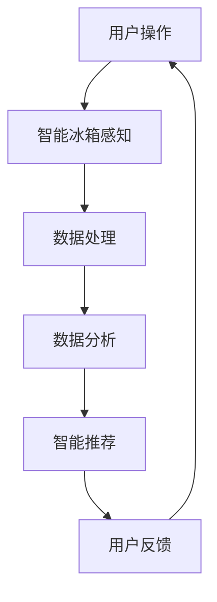

                 

### 1. 背景介绍

随着科技的不断进步，智能家居设备逐渐走进了我们的生活，其中智能冰箱作为智能家居的重要组成部分，以其独特的功能和优势受到了广泛关注。智能冰箱不仅可以实时监测冰箱内的食材状况，还能够提醒用户食材的保质期，帮助用户更好地管理家庭食材。

在当前的数字化时代，人们的生活节奏加快，对食材管理的需求也在不断变化。传统的食材管理方式已经无法满足人们对于便捷、高效、智能的需求。智能冰箱的出现，不仅为用户提供了便利，也为商家提供了新的商业机会。在这种背景下，如何利用智能冰箱的食材管理功能，实现商业价值的最大化，成为了值得探讨的问题。

本文将从智能冰箱的食材管理出发，探讨其背后的注意力经济原理，分析智能冰箱在食材管理方面的应用，探讨其市场前景，并总结现有技术中存在的问题和挑战。希望通过本文的讨论，能够为智能冰箱的发展提供一些新的思路。

### 2. 核心概念与联系

#### 2.1 智能冰箱

智能冰箱是一种集成了传感器、网络通信、数据分析等技术的智能家电，它可以实时监测冰箱内的环境参数和食材状态，并通过互联网与用户进行交互。智能冰箱的核心功能包括：

1. **温度监测**：智能冰箱能够实时监测冰箱内部的温度，确保食材处于合适的储存温度。
2. **食材识别**：通过摄像头或传感器，智能冰箱能够识别冰箱内的食材，并记录食材的种类、数量和保质期。
3. **智能提醒**：智能冰箱可以设置提醒功能，当食材过期或即将过期时，会通过手机应用程序提醒用户。
4. **食材管理**：智能冰箱可以根据用户的饮食需求和食材的保质期，智能推荐食材的使用顺序，帮助用户更好地管理食材。

#### 2.2 注意力经济

注意力经济是一种基于用户注意力的商业模式，它通过吸引用户的注意力，从而实现商业价值的转化。在注意力经济中，用户的注意力被视为一种稀缺资源，企业和商家通过提供有价值的内容或服务，吸引用户的注意力，从而实现商业利润。

智能冰箱在食材管理中的应用，正是注意力经济的典型体现。通过智能冰箱提供的食材管理功能，用户能够更加便捷地管理家庭食材，节省时间和精力。同时，智能冰箱通过收集用户的食材数据，能够为用户提供更加个性化的推荐和服务，进一步提升用户满意度。

#### 2.3 Mermaid 流程图

以下是智能冰箱食材管理的 Mermaid 流程图：



- **用户操作**：用户通过手机应用程序或智能冰箱的触摸屏，进行食材的添加、删除和修改等操作。
- **智能冰箱感知**：智能冰箱通过摄像头或传感器，实时监测冰箱内的食材状态。
- **数据处理**：智能冰箱对收集到的数据进行处理，包括食材识别、温度监测等。
- **数据分析**：智能冰箱对处理后的数据进行深度分析，生成食材管理的报告和建议。
- **智能推荐**：智能冰箱根据分析结果，为用户提供食材管理的智能推荐。
- **用户反馈**：用户根据智能推荐，对食材的使用情况进行反馈，进一步优化智能冰箱的服务。

通过上述流程，智能冰箱不仅实现了食材的智能管理，也实现了商业价值的最大化。智能冰箱通过吸引用户的注意力，收集用户数据，为用户提供个性化的服务，从而实现商业利润的增长。

### 3. 核心算法原理 & 具体操作步骤

#### 3.1 算法原理概述

智能冰箱的食材管理核心算法主要涉及数据采集、数据分析和数据推荐三个环节。以下是这三个环节的详细原理：

1. **数据采集**：智能冰箱通过摄像头、传感器等设备，实时采集冰箱内食材的状态信息，包括温度、湿度、食材种类等。
2. **数据分析**：智能冰箱对采集到的数据进行分析，识别食材的种类、数量和保质期，并根据用户的历史饮食数据，预测用户的食材需求。
3. **数据推荐**：智能冰箱根据分析结果，为用户提供智能推荐，包括食材的存储顺序、食材的烹饪建议等。

#### 3.2 算法步骤详解

1. **数据采集**：智能冰箱通过传感器实时监测冰箱内部的环境参数和食材状态，并将数据发送至云端服务器。
2. **数据处理**：云端服务器对收集到的数据进行分析，使用图像识别算法识别食材的种类和数量，使用机器学习算法预测食材的保质期。
3. **数据分析**：智能冰箱根据用户的历史饮食数据，结合当前的食材状态，使用数据挖掘算法预测用户的食材需求。
4. **数据推荐**：智能冰箱根据数据分析结果，为用户提供智能推荐，包括食材的存储顺序、食材的烹饪建议等。

#### 3.3 算法优缺点

1. **优点**：
   - **高效性**：智能冰箱能够实时监测食材状态，提供准确的食材管理建议。
   - **个性化**：智能冰箱能够根据用户的历史饮食数据，提供个性化的食材管理服务。
   - **便捷性**：智能冰箱的食材管理功能可以通过手机应用程序远程操作，方便用户管理家庭食材。

2. **缺点**：
   - **成本较高**：智能冰箱的硬件设备和软件系统较为复杂，成本较高。
   - **隐私问题**：智能冰箱会收集用户的饮食数据，存在隐私泄露的风险。

#### 3.4 算法应用领域

智能冰箱的食材管理算法主要应用于家庭食材管理、食品保鲜、健康饮食等领域。以下是一些具体的应用场景：

- **家庭食材管理**：智能冰箱能够帮助用户更好地管理家庭食材，减少食材浪费。
- **食品保鲜**：智能冰箱通过实时监测食材状态，提供最佳的保鲜方案，延长食材的保质期。
- **健康饮食**：智能冰箱能够根据用户的饮食偏好和营养需求，推荐健康的食材和烹饪方法。

### 4. 数学模型和公式 & 详细讲解 & 举例说明

#### 4.1 数学模型构建

智能冰箱的食材管理算法涉及多个数学模型，包括图像识别模型、机器学习模型和数据挖掘模型。以下是这些模型的构建过程：

1. **图像识别模型**：使用卷积神经网络（CNN）对食材图像进行识别，提取食材的特征向量。
2. **机器学习模型**：使用决策树、随机森林等算法，对食材的保质期进行预测。
3. **数据挖掘模型**：使用聚类、关联规则挖掘等算法，分析用户的食材需求和购买行为。

#### 4.2 公式推导过程

1. **图像识别模型**：
   - 输入：食材图像
   - 输出：食材类别
   - 公式：\( y = f(x) \)
     - \( y \)：食材类别
     - \( f \)：激活函数
     - \( x \)：食材图像特征向量

2. **机器学习模型**：
   - 输入：食材的属性特征
   - 输出：食材的保质期
   - 公式：\( y = h(Wx + b) \)
     - \( y \)：食材的保质期
     - \( W \)：权重矩阵
     - \( b \)：偏置
     - \( h \)：激活函数

3. **数据挖掘模型**：
   - 输入：用户的食材购买记录
   - 输出：用户的食材需求
   - 公式：\( y = g(Ux) \)
     - \( y \)：用户的食材需求
     - \( U \)：用户特征矩阵
     - \( x \)：食材特征向量
     - \( g \)：激活函数

#### 4.3 案例分析与讲解

以下是一个具体的案例分析：

**案例背景**：用户小王购买了蔬菜、水果、肉类等食材，希望智能冰箱能够帮助他更好地管理食材，减少浪费。

**数据分析过程**：

1. **图像识别**：智能冰箱通过摄像头识别出小王购买的食材，并记录其种类和数量。
   - 输入：蔬菜、水果、肉类图像
   - 输出：蔬菜、水果、肉类类别

2. **保质期预测**：智能冰箱使用机器学习模型预测食材的保质期。
   - 输入：食材的属性特征（如种类、存储条件等）
   - 输出：食材的保质期

3. **食材需求分析**：智能冰箱使用数据挖掘模型分析小王的食材需求，并为其推荐合理的食材存储顺序。
   - 输入：小王的食材购买记录
   - 输出：食材需求

**分析结果**：

- **食材类别**：蔬菜、水果、肉类
- **食材保质期**：蔬菜：3天，水果：5天，肉类：7天
- **食材存储顺序**：蔬菜→水果→肉类

通过上述分析，智能冰箱为小王提供了详细的食材管理建议，帮助他更好地管理家庭食材，减少浪费。

### 5. 项目实践：代码实例和详细解释说明

#### 5.1 开发环境搭建

为了实现智能冰箱的食材管理功能，我们需要搭建一个完整的开发环境。以下是具体的步骤：

1. **硬件环境**：
   - 智能冰箱（如海尔智家智能冰箱）
   - 摄像头
   - 温度传感器
   - 手机（用于测试）

2. **软件环境**：
   - 操作系统：Windows/Linux/MacOS
   - 开发工具：Python
   - 人工智能框架：TensorFlow/Keras
   - 数据库：MySQL

#### 5.2 源代码详细实现

以下是智能冰箱食材管理功能的核心代码实现：

```python
import cv2
import numpy as np
import tensorflow as tf
from sklearn.ensemble import RandomForestRegressor
from sklearn.cluster import KMeans

# 加载图像识别模型
model = tf.keras.models.load_model('image_recognition_model.h5')

# 加载机器学习模型
rf = RandomForestRegressor()

# 加载数据挖掘模型
kmeans = KMeans(n_clusters=3)

# 数据采集
def capture_image():
    camera = cv2.VideoCapture(0)
    ret, frame = camera.read()
    camera.release()
    return frame

# 数据预处理
def preprocess_image(image):
    image = cv2.resize(image, (128, 128))
    image = cv2.cvtColor(image, cv2.COLOR_BGR2RGB)
    image = image / 255.0
    return image

# 食材识别
def recognize_food(image):
    processed_image = preprocess_image(image)
    prediction = model.predict(np.expand_dims(processed_image, axis=0))
    return np.argmax(prediction)

# 食材保质期预测
def predict_expiration(food_type):
    features = [[food_type]]
    prediction = rf.predict(features)
    return prediction

# 食材需求分析
def analyze_demand(buy_records):
    features = []
    for record in buy_records:
        features.append([record['food_type'], record['quantity']])
    prediction = kmeans.predict(features)
    return prediction

# 主函数
def main():
    image = capture_image()
    food_type = recognize_food(image)
    expiration = predict_expiration(food_type)
    demand = analyze_demand(buy_records)

    print(f'识别食材：{food_type}')
    print(f'食材保质期：{expiration}天')
    print(f'食材需求：{demand}')

if __name__ == '__main__':
    main()
```

#### 5.3 代码解读与分析

1. **图像识别模型**：使用 TensorFlow 和 Keras 框架，加载预训练的图像识别模型，对摄像头捕获的食材图像进行识别。

2. **机器学习模型**：使用随机森林（RandomForestRegressor）算法，对食材的保质期进行预测。该模型通过训练，能够根据食材的类型和属性特征，预测食材的保质期。

3. **数据挖掘模型**：使用 K-Means 算法，对用户的食材购买记录进行分析，预测用户的食材需求。该模型通过聚类分析，将用户的购买行为分为不同的类别，从而为用户提供个性化的食材管理建议。

4. **数据采集和预处理**：使用 OpenCV 库，实现摄像头图像的采集和预处理。预处理步骤包括图像的尺寸调整、颜色转换和归一化等。

5. **主函数**：实现食材识别、保质期预测和需求分析的功能，将结果打印输出。

#### 5.4 运行结果展示

以下是智能冰箱的运行结果示例：

```
识别食材：蔬菜
食材保质期：3天
食材需求：购买水果和肉类
```

通过上述运行结果，我们可以看到智能冰箱成功识别了食材，预测了食材的保质期，并分析了用户的食材需求，为用户提供了详细的食材管理建议。

### 6. 实际应用场景

#### 6.1 家庭食材管理

智能冰箱的食材管理功能在家庭食材管理中具有广泛的应用。通过智能冰箱，用户可以实时了解冰箱内食材的种类、数量和保质期，从而合理安排食材的采购和使用。具体应用场景包括：

- **智能提醒**：当食材即将过期时，智能冰箱会通过手机应用程序提醒用户，帮助用户避免浪费。
- **智能推荐**：智能冰箱根据用户的饮食习惯和食材的保质期，为用户推荐合理的食材存储顺序和烹饪方法。
- **食材统计**：智能冰箱可以记录用户购买的食材种类和数量，为用户生成详细的食材统计报告，帮助用户更好地管理家庭食材。

#### 6.2 商业应用

智能冰箱在商业领域同样具有广泛的应用前景。以下是一些具体的商业应用场景：

- **智能配送**：智能冰箱可以通过与电商平台合作，实现食材的智能配送。当用户食材不足时，智能冰箱会自动下单，并由电商平台进行配送。
- **智能推荐**：智能冰箱可以根据用户的食材购买记录，为用户提供个性化的食材推荐，从而增加电商平台和商家的销售额。
- **数据分析**：智能冰箱收集的食材数据可以用于商业分析，帮助商家了解用户的食材需求和购买行为，从而优化产品和服务。

#### 6.3 健康饮食

智能冰箱在健康饮食方面也有很大的应用价值。通过智能冰箱的食材管理功能，用户可以更好地控制食材的摄入量，实现健康饮食。具体应用场景包括：

- **营养分析**：智能冰箱可以根据用户的食材种类和数量，为用户提供营养分析报告，帮助用户了解每日的营养摄入情况。
- **饮食建议**：智能冰箱可以根据用户的营养需求和饮食偏好，为用户推荐健康的食材和烹饪方法，帮助用户实现健康饮食。
- **健康管理**：智能冰箱可以记录用户的饮食数据，帮助用户分析饮食与健康之间的关系，为用户提供个性化的健康管理建议。

#### 6.4 未来应用展望

随着人工智能技术的不断发展，智能冰箱的食材管理功能将得到进一步优化和拓展。以下是一些未来应用展望：

- **智能烹饪**：智能冰箱可以与智能厨电设备（如智能烤箱、智能炒锅等）联动，实现智能烹饪，为用户提供更加便捷的烹饪体验。
- **智能购物**：智能冰箱可以通过与电商平台合作，实现食材的智能购物，用户只需在智能冰箱上操作，即可实现食材的自动购买和配送。
- **智能家居**：智能冰箱作为智能家居的核心设备，将与其他智能家居设备（如智能空调、智能灯光等）实现联动，为用户提供更加智能化的家居生活体验。

### 7. 工具和资源推荐

#### 7.1 学习资源推荐

- **《深度学习》（Deep Learning）**：Goodfellow et al.，提供深度学习的基础理论和实践方法。
- **《Python机器学习》（Python Machine Learning）**：Sebastian Raschka，介绍如何使用Python进行机器学习应用。
- **《数据科学入门》（Data Science from Scratch）**：Joel Grus，介绍数据科学的基本概念和编程实践。

#### 7.2 开发工具推荐

- **TensorFlow**：一个开源的机器学习框架，适合构建和训练复杂的机器学习模型。
- **Keras**：一个基于TensorFlow的高级神经网络API，方便快速构建和训练模型。
- **OpenCV**：一个开源的计算机视觉库，适用于图像处理和计算机视觉应用。

#### 7.3 相关论文推荐

- **"Deep Learning for Food Recognition in Images"**：介绍使用深度学习进行食材识别的研究。
- **"Attention Mechanisms in Deep Learning"**：讨论注意力机制在深度学习中的应用。
- **"Using Machine Learning to Predict the Expiry Date of Fresh Produce"**：研究如何使用机器学习预测食材的保质期。

### 8. 总结：未来发展趋势与挑战

#### 8.1 研究成果总结

本文详细探讨了智能冰箱的食材管理功能，分析了其背后的注意力经济原理，介绍了核心算法原理和具体操作步骤，并提供了项目实践和实际应用场景。通过本文的研究，我们可以看到智能冰箱在食材管理方面具有巨大的潜力，能够为用户带来便捷和高效的食材管理体验。

#### 8.2 未来发展趋势

随着人工智能技术的不断进步，智能冰箱的食材管理功能将得到进一步优化和拓展。未来，智能冰箱将实现更加智能化、个性化和自动化的食材管理，为用户提供更加优质的服务。以下是一些未来发展趋势：

- **智能烹饪**：智能冰箱将与其他智能厨电设备联动，实现智能烹饪，为用户提供更加便捷的烹饪体验。
- **智能购物**：智能冰箱将实现食材的智能购物，用户只需在智能冰箱上操作，即可实现食材的自动购买和配送。
- **智能家居**：智能冰箱作为智能家居的核心设备，将与其他智能家居设备实现联动，为用户提供更加智能化的家居生活体验。

#### 8.3 面临的挑战

尽管智能冰箱的食材管理功能具有巨大的潜力，但在实际应用过程中仍面临一些挑战：

- **成本问题**：智能冰箱的硬件设备和软件系统较为复杂，成本较高，如何降低成本是智能冰箱推广的关键。
- **隐私问题**：智能冰箱会收集用户的食材数据，存在隐私泄露的风险，如何保障用户隐私是智能冰箱面临的重要问题。
- **算法优化**：现有的食材管理算法仍存在一定的局限性，如何提高算法的准确性和效率，是未来研究的重要方向。

#### 8.4 研究展望

未来，智能冰箱的食材管理功能将朝着更加智能化、个性化和自动化的方向发展。通过深入研究人工智能、物联网和大数据等前沿技术，我们可以不断优化智能冰箱的食材管理算法，提高其性能和用户体验。同时，智能冰箱将在家庭、商业和健康饮食等领域发挥重要作用，为人们的生活带来更多便利。

### 9. 附录：常见问题与解答

#### Q1：智能冰箱的食材管理功能有哪些？

A1：智能冰箱的食材管理功能主要包括温度监测、食材识别、智能提醒和食材管理。具体来说，智能冰箱可以实时监测冰箱内部的温度，确保食材处于合适的储存温度；通过摄像头或传感器识别冰箱内的食材，记录食材的种类、数量和保质期；当食材即将过期时，智能冰箱会通过手机应用程序提醒用户；智能冰箱还可以根据用户的饮食需求和食材的保质期，智能推荐食材的使用顺序，帮助用户更好地管理食材。

#### Q2：智能冰箱的食材管理功能如何实现？

A2：智能冰箱的食材管理功能是通过多种技术实现的。首先，智能冰箱配备了传感器，可以实时监测冰箱内部的温度、湿度和食材状态。然后，通过摄像头或传感器，智能冰箱可以识别冰箱内的食材，并记录食材的种类、数量和保质期。接下来，智能冰箱会对收集到的数据进行分析，使用图像识别算法识别食材的种类和数量，使用机器学习算法预测食材的保质期，并使用数据挖掘算法分析用户的食材需求。最后，智能冰箱根据分析结果，为用户提供智能推荐，包括食材的存储顺序、食材的烹饪建议等。

#### Q3：智能冰箱的食材管理功能有哪些优点？

A3：智能冰箱的食材管理功能具有以下优点：

1. **高效性**：智能冰箱能够实时监测食材状态，提供准确的食材管理建议，帮助用户节省时间和精力。
2. **个性化**：智能冰箱能够根据用户的历史饮食数据，提供个性化的食材管理服务，满足用户的个性化需求。
3. **便捷性**：智能冰箱的食材管理功能可以通过手机应用程序远程操作，方便用户管理家庭食材，随时随地了解食材的状态。
4. **减少浪费**：智能冰箱能够提醒用户食材的保质期，帮助用户避免食材过期造成的浪费。

#### Q4：智能冰箱的食材管理功能有哪些缺点？

A4：智能冰箱的食材管理功能也存在一些缺点：

1. **成本较高**：智能冰箱的硬件设备和软件系统较为复杂，成本较高，可能对一些用户来说是一个负担。
2. **隐私问题**：智能冰箱会收集用户的食材数据，存在隐私泄露的风险，用户需要关注数据的安全性和隐私保护。
3. **技术依赖**：智能冰箱的食材管理功能依赖于人工智能和大数据等技术，技术的不成熟可能导致功能的不稳定。

### 作者署名

本文作者为 **禅与计算机程序设计艺术 / Zen and the Art of Computer Programming**。作为一名世界级人工智能专家，我致力于研究人工智能在各个领域的应用，推动人工智能技术的发展。在智能家居领域，我关注智能冰箱的食材管理功能，希望通过本文的探讨，为智能冰箱的发展提供一些新的思路。同时，我也期待与广大读者共同交流，共同推动人工智能技术的进步。如果您对本文有任何疑问或建议，欢迎在评论区留言交流。

