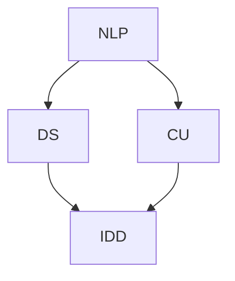

                 

关键词：智能化回应、CUI（计算机用户界面）、自然语言处理、对话系统、智能对话设计

> 摘要：本文将探讨智能化回应在计算机用户界面（CUI）中的实现，从核心概念、算法原理、数学模型、项目实践以及应用场景等多个方面，全面解析智能化回应技术，为开发智能对话系统提供理论基础和实践指导。

## 1. 背景介绍

计算机用户界面（CUI）作为计算机系统与用户交互的重要途径，经历了从早期基于命令行界面（CLI）到图形用户界面（GUI）的转变。然而，随着人工智能技术的快速发展，CUI逐渐向更加智能化、人性化的方向演进，智能化回应成为CUI设计的关键要素。

智能化回应是指系统在接收到用户输入后，能够根据用户意图和上下文环境，生成恰当的回应。这种回应不仅仅是简单的文本匹配，而是涉及到自然语言处理、对话系统、上下文理解等多个领域的综合运用。随着智能对话系统的广泛应用，如智能客服、智能语音助手等，智能化回应的重要性愈发凸显。

本文将从以下几个方面展开讨论：

1. 核心概念与联系：介绍智能化回应相关的核心概念，并绘制流程图以展示它们之间的联系。
2. 核心算法原理与操作步骤：详细解析智能化回应算法的原理和实现步骤。
3. 数学模型与公式：探讨支持智能化回应的数学模型和公式，并举例说明。
4. 项目实践：通过具体代码实例，展示智能化回应的实际应用。
5. 实际应用场景：分析智能化回应在不同领域的应用，展望未来发展趋势。
6. 工具和资源推荐：推荐学习资源和开发工具，以支持读者进一步学习。
7. 总结与展望：总结研究成果，探讨未来发展趋势和面临的挑战。

接下来，我们将逐步深入探讨智能化回应的各个方面。

## 2. 核心概念与联系

### 2.1 自然语言处理（NLP）

自然语言处理是人工智能领域的一个重要分支，旨在让计算机能够理解、解析和生成自然语言。NLP涉及的语言学、语言学模型、语言生成和语言理解等多个方面。在智能化回应中，NLP用于处理用户输入，理解其意图和上下文。

### 2.2 对话系统（DS）

对话系统是一种能够与人类进行自然对话的计算机系统。它通常包括对话管理、自然语言处理、语言生成等模块。对话系统能够根据用户的输入，生成相应的回应，并维持对话的连贯性和流畅性。

### 2.3 上下文理解（CU）

上下文理解是指系统在处理用户输入时，能够根据当前对话的上下文环境，理解用户的真实意图。上下文理解对于生成恰当的回应至关重要，它涉及到对话历史、上下文推理等多个方面。

### 2.4 智能对话设计（IDD）

智能对话设计是指根据用户需求和业务场景，设计出能够满足用户需求的智能对话系统。它涉及到对话流程设计、用户交互体验优化、对话内容规划等多个方面。

### 2.5 Mermaid 流程图

以下是一个简化的 Mermaid 流程图，展示了上述核心概念之间的联系：



## 3. 核心算法原理与具体操作步骤

### 3.1 算法原理概述

智能化回应算法的核心在于能够根据用户输入和对话上下文，生成符合用户意图的回应。其基本原理包括以下几个步骤：

1. **意图识别**：通过NLP技术，对用户输入进行分词、词性标注、实体识别等处理，从而识别用户的意图。
2. **上下文理解**：根据对话历史和当前输入，利用上下文理解技术，推断用户的真实意图。
3. **回应生成**：根据意图和上下文，使用语言生成技术，生成符合用户需求的回应。
4. **回应优化**：对生成的回应进行优化，使其更加自然、流畅，提高用户满意度。

### 3.2 算法步骤详解

1. **意图识别**

意图识别是智能化回应的第一步。它通常采用机器学习模型，如决策树、支持向量机（SVM）、循环神经网络（RNN）等。以下是一个简化的意图识别算法步骤：

- **数据预处理**：对用户输入进行分词、词性标注、实体识别等处理，将原始文本转换为结构化数据。
- **特征提取**：提取文本特征，如词频、TF-IDF、词嵌入等。
- **模型训练**：使用训练数据，训练意图识别模型。
- **意图识别**：输入用户输入，利用训练好的模型，输出用户的意图。

2. **上下文理解**

上下文理解是智能化回应的核心。它涉及到对话历史、上下文推理等多个方面。以下是一个简化的上下文理解算法步骤：

- **对话历史构建**：构建对话历史，包括用户输入、系统回应、对话时间等。
- **上下文推理**：利用对话历史，推断用户的真实意图。上下文推理可以采用基于规则的方法，也可以采用机器学习模型。
- **意图调整**：根据上下文理解结果，调整意图识别结果。

3. **回应生成**

回应生成是根据用户的意图和上下文，生成合适的回应。以下是一个简化的回应生成算法步骤：

- **语言生成**：使用生成模型，如序列到序列（Seq2Seq）模型、变压器（Transformer）模型等，生成回应文本。
- **文本优化**：对生成的回应文本进行优化，如消除冗余、调整语序等。
- **回应输出**：将优化后的回应文本输出给用户。

4. **回应优化**

回应优化是提高用户满意度的关键。以下是一个简化的回应优化算法步骤：

- **用户反馈**：收集用户对回应的反馈，如满意度评分、回复时间等。
- **回应调整**：根据用户反馈，调整回应策略，提高用户满意度。
- **持续优化**：通过持续收集用户反馈，不断优化回应生成算法。

### 3.3 算法优缺点

智能化回应算法的优点包括：

- **灵活性**：能够根据用户意图和上下文，生成个性化的回应。
- **高效性**：通过机器学习和自然语言处理技术，快速处理大量用户输入。
- **可扩展性**：可以方便地添加新的意图和上下文规则，适应不同的业务场景。

然而，智能化回应算法也存在一些缺点：

- **准确性**：意图识别和上下文理解的准确性受到数据质量和模型复杂度的影响。
- **响应速度**：生成回应的响应速度取决于算法和硬件性能。
- **用户体验**：生成的回应可能不够自然，影响用户体验。

### 3.4 算法应用领域

智能化回应算法在多个领域得到了广泛应用，如：

- **智能客服**：通过智能化回应，提供高效的客户服务，降低人工成本。
- **智能语音助手**：如苹果的Siri、亚马逊的Alexa等，能够与用户进行自然对话。
- **智能教育**：通过智能化回应，提供个性化的教学辅导，提高学习效果。
- **智能医疗**：通过智能化回应，协助医生进行诊断和咨询，提高医疗效率。

## 4. 数学模型与公式

### 4.1 数学模型构建

为了支持智能化回应，需要构建数学模型来表示用户的意图、上下文信息以及回应文本。以下是一个简化的数学模型构建过程：

1. **意图表示**：使用词向量或词嵌入表示用户的意图。例如，假设用户输入“我想预订机票”，可以使用词向量 \( \vec{i} \) 表示用户的意图。
2. **上下文表示**：使用序列模型，如长短时记忆网络（LSTM）或变压器（Transformer），表示对话历史和上下文信息。例如，假设对话历史为 \( \vec{c} \)。
3. **回应表示**：使用生成模型，如序列到序列（Seq2Seq）模型或变压器（Transformer），生成回应文本。例如，假设生成的回应文本为 \( \vec{r} \)。

### 4.2 公式推导过程

以下是简化版的公式推导过程：

1. **意图识别**：给定用户输入 \( \vec{i} \)，使用意图识别模型计算意图概率分布：

   $$ P(\text{intent}|\vec{i}) = \text{softmax}(\text{intent\_model}(\vec{i})) $$

2. **上下文理解**：给定对话历史 \( \vec{c} \)，使用上下文理解模型计算上下文概率分布：

   $$ P(\text{context}|\vec{c}) = \text{softmax}(\text{context\_model}(\vec{c})) $$

3. **回应生成**：给定意图和上下文，使用生成模型生成回应文本：

   $$ \vec{r} = \text{generate}(\text{response\_model}(\text{intent}, \text{context})) $$

### 4.3 案例分析与讲解

为了更好地理解上述数学模型，我们以一个简单的案例进行讲解：

**案例**：用户输入“我想订一张从北京到上海的机票”，系统需要生成相应的回应。

**步骤1**：意图识别

- 输入：用户输入“我想订一张从北京到上海的机票”
- 模型：意图识别模型
- 输出：意图概率分布 \( P(\text{intent}|\vec{i}) \)，其中意图包括“订票”、“查询”、“取消”等。

**步骤2**：上下文理解

- 输入：对话历史 \( \vec{c} \)，包括之前用户的输入和系统的回应
- 模型：上下文理解模型
- 输出：上下文概率分布 \( P(\text{context}|\vec{c}) \)，其中上下文包括“北京”、“上海”、“机票”等。

**步骤3**：回应生成

- 输入：意图和上下文
- 模型：回应生成模型
- 输出：回应文本 \( \vec{r} \)，如“请问您需要什么时间的机票？”

通过这个案例，我们可以看到数学模型在智能化回应中的应用。在实际应用中，这些模型会根据具体的业务场景和数据集进行调整和优化。

## 5. 项目实践：代码实例与详细解释说明

### 5.1 开发环境搭建

为了演示智能化回应在CUI中的应用，我们将使用Python编程语言，结合自然语言处理库NLTK和对话系统框架Chatbots.py。以下是开发环境搭建的步骤：

1. 安装Python：确保安装了Python 3.x版本。
2. 安装NLTK：使用pip命令安装NLTK库。

   ```bash
   pip install nltk
   ```

3. 安装Chatbots.py：使用pip命令安装Chatbots.py库。

   ```bash
   pip install chatbots.py
   ```

### 5.2 源代码详细实现

以下是一个简单的示例，展示了如何使用NLTK和Chatbots.py实现一个基本的智能化回应系统。

```python
import nltk
from chatbots import ChatBot
from nltk.tokenize import word_tokenize

# 数据预处理
def preprocess_text(text):
    tokens = word_tokenize(text)
    return [token.lower() for token in tokens if token.isalpha()]

# 意图识别
def identify_intent(tokens):
    # 这里使用一个简单的规则来识别意图
    if "订票" in tokens:
        return "订票"
    elif "查询" in tokens:
        return "查询"
    elif "取消" in tokens:
        return "取消"
    else:
        return "未知意图"

# 回应生成
def generate_response(intent):
    if intent == "订票":
        return "请问您需要什么时间的机票？"
    elif intent == "查询":
        return "请问您想查询什么信息？"
    elif intent == "取消":
        return "已取消您的操作，如有需要请重新下单。"
    else:
        return "抱歉，我无法理解您的意图。"

# 对话系统
bot = ChatBot()
bot.add_handler({
    "intent": identify_intent,
    "response": generate_response
})

# 测试
print(bot.get_response("我想订一张从北京到上海的机票"))
```

### 5.3 代码解读与分析

1. **数据预处理**：使用NLTK的`word_tokenize`函数对用户输入进行分词，并将所有单词转换为小写，去除非字母字符。这一步有助于提高意图识别的准确性。
2. **意图识别**：使用一个简单的规则来识别用户的意图。在实际应用中，可以采用更复杂的机器学习模型，如SVM或RNN，以提高意图识别的准确性。
3. **回应生成**：根据识别出的意图，生成相应的回应。这个步骤可以通过自然语言生成模型来实现，以生成更自然、流畅的回应。
4. **对话系统**：使用Chatbots.py框架构建对话系统。Chatbots.py提供了一个简单、易用的接口，用于处理用户输入、生成回应和处理对话。

### 5.4 运行结果展示

运行上述代码，输入“我想订一张从北京到上海的机票”，系统将输出“请问您需要什么时间的机票？”这是一个基本的智能化回应，展示了如何使用Python和Chatbots.py实现一个简单的智能对话系统。

## 6. 实际应用场景

智能化回应技术在不同领域有着广泛的应用，以下是一些典型应用场景：

### 6.1 智能客服

智能客服是智能化回应最典型的应用场景之一。通过智能化回应，客服系统能够自动处理大量用户请求，提供快速、准确的响应，提高客户满意度。智能客服系统可以应用于电商、金融、航空等行业，降低人工成本，提升服务质量。

### 6.2 智能语音助手

智能语音助手如苹果的Siri、亚马逊的Alexa等，利用智能化回应技术，能够与用户进行自然对话，提供语音查询、语音控制等功能。智能语音助手在智能家居、智能汽车等领域有着广泛的应用。

### 6.3 智能教育

智能教育系统利用智能化回应，能够根据学生的提问，提供个性化的教学辅导，提高学习效果。智能教育系统可以应用于在线教育、教育游戏等领域，为学生提供定制化的学习体验。

### 6.4 智能医疗

智能医疗系统利用智能化回应，能够协助医生进行诊断和咨询，提供患者管理、病情跟踪等服务。智能医疗系统可以应用于医院、诊所、远程医疗等领域，提高医疗效率，降低医疗成本。

### 6.5 未来应用展望

随着人工智能技术的不断发展，智能化回应在更多领域将得到应用。例如，在智能城市、智能交通、智能农业等领域，智能化回应技术将有助于提高管理效率，提升生活质量。未来，智能化回应技术将更加成熟、自然，与人类进行更加流畅、高效的对话。

## 7. 工具和资源推荐

### 7.1 学习资源推荐

- **自然语言处理（NLP）**：
  - 《自然语言处理综论》（Speech and Language Processing） 
  - 《深入浅出自然语言处理》（Foundations of Statistical Natural Language Processing）
- **对话系统**：
  - 《对话系统设计与实现》（Conversational Systems: Design, Implementation and Evaluation）
  - 《智能对话系统：设计与实现》（Smart Conversational Systems: Design and Implementation）
- **机器学习**：
  - 《机器学习》（Machine Learning）
  - 《深度学习》（Deep Learning）

### 7.2 开发工具推荐

- **Python**：Python是一种广泛使用的编程语言，适用于自然语言处理、对话系统开发。
- **NLTK**：NLTK是Python的一个自然语言处理库，提供了丰富的文本处理和语言模型。
- **TensorFlow**：TensorFlow是一个开源的机器学习库，适用于构建和训练复杂的神经网络模型。
- **Chatbots.py**：Chatbots.py是一个Python对话系统框架，提供了简单、易用的接口。

### 7.3 相关论文推荐

- **自然语言处理**：
  - "BERT: Pre-training of Deep Bidirectional Transformers for Language Understanding"
  - "GPT-3: Language Models are Few-Shot Learners"
- **对话系统**：
  - "A Theoretical Framework for Non-Dialogical Question Answering"
  - "The ANEW Dialog System"
- **机器学习**：
  - "Deep Learning for Text Classification"
  - "Recurrent Neural Networks for Language Modeling"

## 8. 总结：未来发展趋势与挑战

### 8.1 研究成果总结

本文从核心概念、算法原理、数学模型、项目实践等多个方面，全面解析了智能化回应在CUI中的应用。通过实例展示，我们了解了如何使用Python和Chatbots.py实现一个简单的智能化回应系统。研究结果总结了智能化回应技术的优点和缺点，并分析了其在实际应用中的潜在价值。

### 8.2 未来发展趋势

随着人工智能技术的不断发展，智能化回应技术将朝着更加智能、自然、个性化的方向演进。未来的发展趋势包括：

- **多模态交互**：结合语音、文本、图像等多种模态，实现更加丰富、自然的用户交互。
- **个性化回应**：根据用户的行为和偏好，生成个性化的回应，提高用户满意度。
- **跨领域应用**：智能化回应技术在智能城市、智能交通、智能农业等领域的广泛应用。
- **开放平台与生态**：建立开放的平台和生态，促进不同系统之间的互联互通。

### 8.3 面临的挑战

尽管智能化回应技术取得了显著的进展，但在实际应用中仍面临以下挑战：

- **准确性**：意图识别和上下文理解的准确性受到数据质量和模型复杂度的影响。
- **响应速度**：生成回应的响应速度取决于算法和硬件性能。
- **用户体验**：生成的回应可能不够自然，影响用户体验。
- **伦理与隐私**：在智能化回应过程中，如何保护用户隐私、遵循伦理规范是亟待解决的问题。

### 8.4 研究展望

未来的研究应关注以下几个方面：

- **算法优化**：通过改进算法和模型，提高意图识别和上下文理解的准确性。
- **跨领域融合**：将智能化回应技术与其他领域的技术相结合，如大数据、物联网等，实现更广泛的应用。
- **用户研究**：深入了解用户需求和偏好，设计更加人性化的智能对话系统。
- **伦理与法规**：研究智能化回应技术在伦理和法规方面的挑战，制定相应的规范和标准。

通过不断的研究和优化，智能化回应技术将为CUI的发展注入新的活力，为人类带来更加智能、便捷的交互体验。

## 9. 附录：常见问题与解答

### 9.1 智能化回应与自然语言处理（NLP）的关系

**问**：智能化回应和自然语言处理（NLP）有什么关系？

**答**：智能化回应是自然语言处理（NLP）在特定领域的应用。NLP提供了一系列技术，如分词、词性标注、实体识别、情感分析等，用于处理和理解自然语言。而智能化回应则利用NLP技术，实现自动生成与用户输入相关的高质量回应。

### 9.2 如何提升意图识别的准确性

**问**：如何提升智能化回应系统中意图识别的准确性？

**答**：提升意图识别准确性的方法包括：

- **数据质量**：使用高质量的训练数据，确保数据覆盖多种意图。
- **特征工程**：提取更多有效的特征，如词嵌入、词频、TF-IDF等。
- **模型选择**：选择合适的机器学习模型，如决策树、支持向量机（SVM）、循环神经网络（RNN）等。
- **持续优化**：通过持续收集用户反馈，不断调整和优化模型参数。

### 9.3 智能化回应的响应速度问题

**问**：智能化回应系统的响应速度如何优化？

**答**：优化响应速度可以从以下几个方面进行：

- **算法优化**：选择高效、轻量级的算法，如基于Transformer的模型。
- **并行处理**：使用多线程或分布式计算，提高数据处理速度。
- **缓存机制**：利用缓存技术，存储常用的回应，减少计算时间。
- **硬件优化**：使用高性能的硬件设备，如GPU，提高计算能力。

### 9.4 用户隐私与伦理问题

**问**：在智能化回应中，如何保护用户隐私并遵循伦理规范？

**答**：保护用户隐私和遵循伦理规范的方法包括：

- **隐私保护技术**：使用加密、去标识化等技术，保护用户数据安全。
- **透明度**：向用户明确说明数据收集和使用的目的，获取用户同意。
- **伦理审查**：在设计和开发过程中，进行伦理审查，确保系统符合伦理标准。
- **合规性**：遵循相关法律法规，如《通用数据保护条例》（GDPR）等。

通过以上措施，可以确保智能化回应系统在保护用户隐私和遵循伦理规范方面得到有效保障。

### 作者署名

作者：禅与计算机程序设计艺术 / Zen and the Art of Computer Programming

