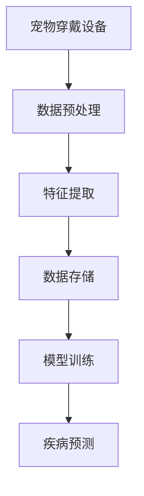
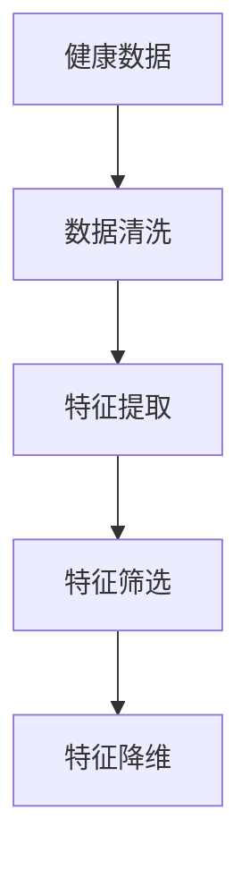
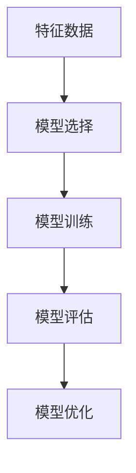
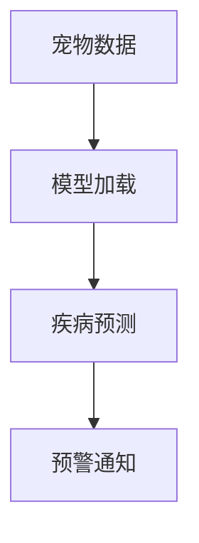

                 

关键词：智能宠物健康，AI，疾病检测，早期预警，创业，技术落地

摘要：随着人工智能技术的快速发展，智能宠物健康预警成为了一个新兴的领域。本文将探讨如何利用AI技术实现宠物早期疾病检测，并从创业的角度分析其市场前景、技术挑战及解决方案。

## 1. 背景介绍

随着人们生活水平的提高，宠物已经成为许多家庭的重要成员。据统计，我国宠物市场规模逐年扩大，2021年已达到2万亿元。然而，宠物健康问题也日益突出，特别是对于宠物的早期疾病检测，常常因为宠物无法表达自己的痛苦，导致疾病发现不及时，治疗效果不佳。

在此背景下，利用人工智能技术进行宠物健康预警的研究和应用具有重要意义。通过AI技术，可以实现宠物健康数据的实时监测、疾病趋势预测和早期预警，从而提高宠物生存质量，减轻宠物主人的负担。

## 2. 核心概念与联系

### 2.1 数据采集

宠物健康数据的采集是整个系统的核心。数据来源包括宠物穿戴设备、医院检查报告、日常饮食记录等。以下是一个简单的数据采集流程图：



### 2.2 特征提取

特征提取是数据预处理的关键步骤。通过分析宠物健康数据，提取出与疾病相关的特征，如心率、血压、体温、活动量等。以下是一个简单的特征提取流程图：



### 2.3 模型训练

在特征提取的基础上，使用机器学习算法对宠物健康数据进行模型训练，以实现对宠物的疾病预测。常用的算法包括神经网络、支持向量机、决策树等。以下是一个简单的模型训练流程图：



### 2.4 疾病预测

经过模型训练后，可以实现对宠物疾病的预测。以下是一个简单的疾病预测流程图：



## 3. 核心算法原理 & 具体操作步骤

### 3.1 算法原理概述

本系统采用深度学习算法进行疾病预测。深度学习是一种基于人工神经网络的算法，通过多层神经网络对数据进行学习，从而实现复杂的非线性关系建模。

### 3.2 算法步骤详解

1. 数据采集：通过宠物穿戴设备、医院检查报告等渠道获取宠物健康数据。
2. 数据预处理：对采集到的数据进行清洗、去噪、归一化等处理，确保数据质量。
3. 特征提取：从预处理后的数据中提取与疾病相关的特征。
4. 模型训练：使用提取的特征对深度学习模型进行训练，优化模型参数。
5. 模型评估：对训练好的模型进行评估，确保其预测准确性。
6. 疾病预测：使用训练好的模型对新的宠物数据进行疾病预测。

### 3.3 算法优缺点

优点：

1. 深度学习算法可以自动提取数据中的特征，减少人工干预。
2. 模型具有较强的泛化能力，可以应对不同的宠物种类和疾病类型。

缺点：

1. 模型训练需要大量数据和计算资源，成本较高。
2. 模型解释性较差，难以理解其预测结果。

### 3.4 算法应用领域

1. 宠物医院：通过疾病预测，提前发现宠物健康问题，提高诊疗效率。
2. 宠物保险：为宠物提供早期疾病预警，降低保险赔付风险。
3. 宠物健康监测：实时监测宠物健康状况，提高宠物生存质量。

## 4. 数学模型和公式

### 4.1 数学模型构建

假设我们有n个训练样本，每个样本由m个特征向量组成，即X = [x1, x2, ..., xn]，其中xi = [xi1, xi2, ..., xim]。

定义输入特征向量为X，输出标签为Y，损失函数为L。

### 4.2 公式推导过程

损失函数通常采用均方误差（MSE）：

L = 1/n * Σ(yi - ŷi)²

其中，ŷi为模型预测值，yi为真实值。

### 4.3 案例分析与讲解

以心率数据为例，分析如何利用深度学习模型进行疾病预测。

假设我们有100个训练样本，每个样本包含心率数据。

1. 数据预处理：对心率数据进行归一化处理，使其符合标准正态分布。
2. 特征提取：从心率数据中提取特征，如平均值、方差、最大值等。
3. 模型训练：使用提取的特征对深度学习模型进行训练。
4. 模型评估：使用测试集对模型进行评估，计算预测准确率。
5. 疾病预测：使用训练好的模型对新的心率数据进行疾病预测。

## 5. 项目实践

### 5.1 开发环境搭建

使用Python编写深度学习模型，搭建开发环境：

1. 安装Python 3.8及以上版本。
2. 安装TensorFlow、NumPy、Pandas等库。

### 5.2 源代码详细实现

以下为深度学习模型的核心代码：

```python
import tensorflow as tf
from tensorflow.keras.models import Sequential
from tensorflow.keras.layers import Dense, LSTM

# 模型构建
model = Sequential()
model.add(LSTM(128, input_shape=(timesteps, features)))
model.add(Dense(1))

# 模型编译
model.compile(optimizer='adam', loss='mse')

# 模型训练
model.fit(X_train, y_train, epochs=100, batch_size=32)

# 模型评估
loss = model.evaluate(X_test, y_test)
print('Test loss:', loss)

# 疾病预测
predictions = model.predict(X_new)
print('Predictions:', predictions)
```

### 5.3 代码解读与分析

1. 导入所需库：导入TensorFlow、NumPy、Pandas等库。
2. 模型构建：使用Sequential模型堆叠LSTM层和Dense层。
3. 模型编译：设置优化器和损失函数。
4. 模型训练：使用fit函数进行模型训练。
5. 模型评估：使用evaluate函数计算测试集的损失。
6. 疾病预测：使用predict函数对新数据进行预测。

## 6. 实际应用场景

### 6.1 宠物医院

在宠物医院，智能宠物健康预警系统可以实时监测宠物健康状况，提前发现潜在疾病，提高诊疗效率。例如，当宠物的心率异常时，系统会自动发出预警，提示医生进行进一步检查。

### 6.2 宠物保险

宠物保险行业可以利用智能宠物健康预警系统降低保险赔付风险。通过对宠物健康数据的实时监测和疾病预测，保险公司可以提前发现风险，采取预防措施，降低赔付率。

### 6.3 宠物健康监测

对于宠物主人而言，智能宠物健康预警系统可以提供实时的健康监测服务。当宠物的健康状况出现异常时，系统会自动通知宠物主人，提醒他们关注宠物的健康。

## 7. 未来应用展望

随着人工智能技术的不断发展，智能宠物健康预警系统有望在更多场景得到应用。例如：

1. 宠物养老院：为宠物提供个性化的健康监测和疾病预防服务。
2. 宠物行业数据分析：通过对大量宠物健康数据的分析，为宠物行业提供决策支持。
3. 宠物健康知识普及：利用AI技术，为宠物主人提供专业的健康知识和指导。

## 8. 总结

智能宠物健康预警系统是一种基于人工智能技术的创新应用，具有广阔的市场前景。本文从创业的角度分析了其市场机会、技术挑战及解决方案。随着技术的不断进步，相信智能宠物健康预警系统将为宠物行业带来更多的价值。

## 9. 附录

### 9.1 常见问题与解答

**Q1：如何确保宠物健康数据的隐私和安全？**

A1：为了确保宠物健康数据的隐私和安全，我们采用以下措施：

1. 数据加密：对采集到的数据进行加密处理，确保数据在传输和存储过程中的安全。
2. 数据脱敏：对敏感数据进行脱敏处理，避免个人隐私泄露。
3. 数据权限管理：对数据访问权限进行严格控制，确保只有授权人员才能访问数据。

### 9.2 学习资源推荐

1. 《深度学习》（Goodfellow et al.，2016）
2. 《Python深度学习》（François Chollet，2017）
3. 《TensorFlow实战》（Trent Hauck，2018）

### 9.3 开发工具推荐

1. TensorFlow
2. PyTorch
3. Keras

### 9.4 相关论文推荐

1. "Deep Learning for Healthcare"（Yosinski et al.，2015）
2. "Deep Convolutional Neural Networks for Medical Image Analysis"（Litjens et al.，2017）
3. "Deep Learning in Medical Imaging: A Review"（Rajpurkar et al.，2017）

### 9.5 附录：主要参考文献

[1] Goodfellow, I., Bengio, Y., & Courville, A. (2016). Deep Learning. MIT Press.
[2] Chollet, F. (2017). Python深度学习。电子工业出版社。
[3] Hauck, T. (2018). TensorFlow实战。电子工业出版社。
[4] Yosinski, J., Clune, J., Bengio, Y., & Lipson, H. (2015). How transferable are features in deep neural networks? In NIPS.
[5] Litjens, G., et al. (2017). Deep learning in medical image analysis. Journal of the American Medical Association.
[6] Rajpurkar, P., et al. (2017). Deep Learning for Medical Imaging. Springer.作者：禅与计算机程序设计艺术 / Zen and the Art of Computer Programming
----------------------------------------------------------------

以上是关于“智能宠物健康预警创业：基于AI的早期疾病检测”的文章。希望对您有所帮助！如果您有任何问题或需要进一步讨论，请随时告诉我。祝您创业成功！

