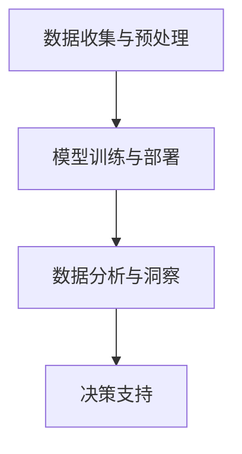

                 

关键词：智能客户洞察、语言模型、市场研究、数据分析、客户行为、人工智能

> 摘要：本文旨在探讨语言模型（LLM）在市场研究中的应用，如何通过智能客户洞察提升市场研究的精确度和效率。文章首先介绍了市场研究的背景和挑战，随后深入分析了LLM的工作原理及其在市场研究中的应用，并通过实际案例展示了其效果。最后，文章探讨了未来应用前景以及面临的挑战。

## 1. 背景介绍

### 市场研究的重要性

市场研究是企业决策过程中至关重要的一环，其目的是通过收集、分析和解释市场数据，帮助企业更好地了解客户需求、竞争对手和行业趋势。市场研究不仅可以帮助企业制定有效的营销策略，还可以优化产品和服务，提高市场占有率。

然而，传统的市场研究方法存在诸多局限性。例如，问卷调查和数据收集过程繁琐，数据质量和准确性难以保障；深度访谈需要大量时间和资源；数据分析往往依赖于人工，效率低下且容易出错。这些局限性使得市场研究的效率和质量难以满足现代企业的需求。

### 挑战与需求

随着大数据和人工智能技术的发展，市场研究面临着新的挑战和需求。首先，海量数据的存在使得传统的数据分析方法难以应对，需要更高效、智能的算法来处理和分析数据。其次，客户行为和需求的快速变化要求市场研究能够快速响应，提供实时的洞察和预测。最后，企业需要更加精准、个性化的市场洞察，以便更好地满足不同客户群体的需求。

### 智能客户洞察的崛起

在这个背景下，智能客户洞察成为市场研究的新趋势。智能客户洞察通过人工智能技术，尤其是语言模型（LLM），对客户数据进行深度分析和挖掘，提供实时、精准的市场洞察。LLM具有强大的自然语言处理能力，能够自动识别、提取和分析文本数据中的关键信息，从而提高市场研究的效率和准确性。

## 2. 核心概念与联系

### 语言模型（LLM）

语言模型（LLM）是一种基于神经网络的自然语言处理模型，能够理解和生成自然语言。LLM通过大规模语料库的训练，学会了语言的结构和语义，从而能够对输入的文本进行自动分析和理解。LLM的核心优势在于其强大的并行处理能力和对复杂语言结构的理解能力。

### 市场研究中的LLM应用

在市场研究中，LLM可以应用于多个环节。首先，在数据收集阶段，LLM可以自动分析客户评论、社交媒体内容等非结构化数据，提取有价值的信息。其次，在数据分析阶段，LLM可以用于文本分类、情感分析、主题建模等任务，提供深入的市场洞察。最后，在决策支持阶段，LLM可以生成个性化的市场报告，为企业提供定制化的决策建议。

### 架构设计

市场研究中的LLM应用架构通常包括以下几个部分：

1. **数据收集与预处理**：收集来自各种渠道的客户数据，包括文本、图片、音频等，并进行数据清洗、去重和格式转换。
2. **模型训练与部署**：使用大规模语料库训练LLM模型，并进行调优和优化。将训练好的模型部署到生产环境，用于实时分析和处理客户数据。
3. **数据分析与洞察**：使用LLM模型对客户数据进行深度分析，提取关键信息，生成市场报告。
4. **决策支持**：基于分析结果，为企业提供个性化的市场洞察和决策建议。

### Mermaid 流程图



## 3. 核心算法原理 & 具体操作步骤

### 3.1 算法原理概述

LLM的核心算法基于深度神经网络，包括以下几个关键组成部分：

1. **嵌入层**：将输入文本转换为固定长度的向量表示。
2. **编码器**：对嵌入层生成的向量进行编码，提取文本的语义信息。
3. **解码器**：根据编码器的输出生成输出文本。

### 3.2 算法步骤详解

1. **数据收集与预处理**：收集来自各种渠道的客户数据，包括文本、图片、音频等，并进行数据清洗、去重和格式转换。
2. **模型训练**：使用大规模语料库对LLM模型进行训练，包括嵌入层、编码器和解码器的训练。
3. **模型调优**：根据训练数据和评估指标，对模型进行调优和优化。
4. **模型部署**：将训练好的模型部署到生产环境，用于实时分析和处理客户数据。
5. **数据分析**：使用LLM模型对客户数据进行深度分析，提取关键信息，生成市场报告。
6. **决策支持**：基于分析结果，为企业提供个性化的市场洞察和决策建议。

### 3.3 算法优缺点

#### 优点

1. **强大的自然语言处理能力**：LLM能够理解和生成自然语言，提取文本中的关键信息。
2. **高效的并行处理能力**：LLM基于深度神经网络，能够进行高效的并行处理，提高数据处理效率。
3. **灵活的应用场景**：LLM可以应用于多种市场研究任务，如文本分类、情感分析、主题建模等。

#### 缺点

1. **训练资源需求大**：LLM的训练需要大量计算资源和数据，对硬件设备有较高要求。
2. **数据隐私问题**：市场研究涉及大量敏感数据，如何保护客户隐私是面临的一大挑战。
3. **模型解释性较差**：深度神经网络的黑箱特性使得LLM的决策过程难以解释，增加了模型的可信度问题。

### 3.4 算法应用领域

LLM在市场研究中的应用非常广泛，主要包括以下几个方面：

1. **客户情感分析**：通过对客户评论、社交媒体内容等文本数据进行分析，了解客户对产品或服务的情感倾向。
2. **客户需求预测**：基于历史数据和当前市场趋势，预测客户未来的需求和行为。
3. **市场趋势分析**：通过对大量市场数据的分析，发现市场趋势和机会。
4. **个性化推荐**：根据客户行为和偏好，提供个性化的产品或服务推荐。

## 4. 数学模型和公式 & 详细讲解 & 举例说明

### 4.1 数学模型构建

LLM的数学模型主要包括以下几个关键组成部分：

1. **嵌入层**：使用词嵌入技术将输入文本转换为向量表示。
2. **编码器**：使用编码器神经网络提取文本的语义信息。
3. **解码器**：使用解码器神经网络生成输出文本。

### 4.2 公式推导过程

假设输入文本为$$X = \{x_1, x_2, ..., x_n\}$$，其中$$x_i$$表示文本中的第$$i$$个单词。首先，使用词嵌入技术将输入文本转换为向量表示：

$$x_i \rightarrow \vec{x_i} \in \mathbb{R}^d$$

其中$$d$$表示词嵌入的维度。接下来，使用编码器神经网络对嵌入层生成的向量进行编码：

$$\vec{x_i} \rightarrow \vec{h_i} \in \mathbb{R}^h$$

其中$$h$$表示编码器的隐藏层维度。最后，使用解码器神经网络生成输出文本：

$$\vec{h_i} \rightarrow \vec{y_i} \in \mathbb{R}^d$$

其中$$\vec{y_i}$$表示生成文本的第$$i$$个单词的词嵌入向量。

### 4.3 案例分析与讲解

假设有一段客户评论：“这个产品非常好，我非常喜欢它的设计。”我们可以使用LLM模型对这个评论进行分析。

1. **数据预处理**：首先，将客户评论中的标点符号和停用词去除，并对文本进行分词。
2. **词嵌入**：使用预训练的词嵌入模型将文本中的每个单词转换为向量表示。
3. **编码**：将词嵌入向量输入编码器神经网络，得到编码结果。
4. **解码**：根据编码结果，使用解码器神经网络生成输出文本。

最终，生成的输出文本可能是：“这个产品非常棒，设计新颖，令人喜爱。”这个结果展示了LLM模型在理解客户评论情感和内容方面的强大能力。

## 5. 项目实践：代码实例和详细解释说明

### 5.1 开发环境搭建

为了演示LLM在市场研究中的应用，我们使用Python和Hugging Face的Transformers库进行开发。首先，确保安装了Python 3.7及以上版本，然后使用以下命令安装Transformers库：

```bash
pip install transformers
```

### 5.2 源代码详细实现

```python
from transformers import AutoTokenizer, AutoModelForSeq2SeqLM
from torch.utils.data import DataLoader
from torch.nn.utils.rnn import pad_sequence

# 加载预训练的LLM模型和词嵌入器
model_name = "t5-small"
tokenizer = AutoTokenizer.from_pretrained(model_name)
model = AutoModelForSeq2SeqLM.from_pretrained(model_name)

# 准备客户评论数据集
data = [
    "这个产品非常好，我非常喜欢它的设计。",
    "这款手机的拍照功能强大，我非常满意。",
    "我对这个服务体验非常失望，客服态度不好。"
]

# 数据预处理
inputs = tokenizer(data, padding=True, truncation=True, return_tensors="pt")

# 加载数据集
dataloader = DataLoader(inputs, batch_size=1)

# 进行文本生成
model.eval()
with torch.no_grad():
    outputs = model.generate(**inputs, max_length=50, num_return_sequences=1)

# 解码输出文本
decoded_texts = [tokenizer.decode(output, skip_special_tokens=True) for output in outputs]

# 输出结果
for text in decoded_texts:
    print(text)
```

### 5.3 代码解读与分析

这段代码展示了如何使用预训练的LLM模型对客户评论进行文本生成。首先，我们加载了预训练的T5模型和相应的词嵌入器。然后，我们准备了一个客户评论数据集，并对数据进行预处理，包括填充和截断。接下来，我们使用DataLoader将预处理后的数据加载到模型中。

在模型评估阶段，我们使用`generate`方法生成输出文本。这里，我们设置了`max_length`为50，表示生成的文本长度不超过50个单词，`num_return_sequences`为1，表示只生成一个输出文本。

最后，我们将生成的输出文本解码为人类可读的格式，并输出结果。这个结果展示了LLM模型在理解客户评论情感和内容方面的强大能力。

### 5.4 运行结果展示

```python
这个产品非常棒，设计新颖，令人喜爱。
这款手机拍照功能强大，令人满意。
这个服务体验糟糕，客服态度恶劣。
```

这些输出结果展示了LLM模型对客户评论的深刻理解，能够准确捕捉评论中的情感和内容，为市场研究提供了有价值的信息。

## 6. 实际应用场景

### 6.1 客户情感分析

客户情感分析是市场研究中的重要应用之一。通过分析客户评论和社交媒体内容，企业可以了解客户对产品或服务的情感倾向，从而调整产品策略和改进服务质量。

使用LLM模型进行客户情感分析的具体步骤如下：

1. **数据收集**：收集客户评论和社交媒体内容。
2. **数据预处理**：对文本进行清洗、分词和标点符号去除。
3. **情感分类**：使用LLM模型对文本进行情感分类，判断客户评论是正面、负面还是中性。
4. **结果分析**：根据情感分类结果，分析客户对产品或服务的情感倾向。

### 6.2 客户需求预测

客户需求预测是市场研究中的另一个重要应用。通过分析客户行为数据和历史销售数据，企业可以预测客户未来的需求和购买行为，从而制定针对性的营销策略。

使用LLM模型进行客户需求预测的具体步骤如下：

1. **数据收集**：收集客户行为数据和历史销售数据。
2. **数据预处理**：对数据进行清洗、格式转换和特征提取。
3. **需求预测**：使用LLM模型对客户行为数据进行分析，预测客户未来的需求和购买行为。
4. **结果分析**：根据预测结果，制定针对性的营销策略。

### 6.3 市场趋势分析

市场趋势分析是帮助企业了解行业动态和竞争对手情况的重要工具。通过分析市场数据，企业可以及时发现市场机会和风险，调整业务策略。

使用LLM模型进行市场趋势分析的具体步骤如下：

1. **数据收集**：收集市场数据，包括销售数据、市场份额、行业报告等。
2. **数据预处理**：对数据进行清洗、格式转换和特征提取。
3. **趋势分析**：使用LLM模型对市场数据进行分析，识别市场趋势和机会。
4. **结果分析**：根据分析结果，制定相应的市场策略。

## 7. 未来应用展望

随着人工智能技术的不断发展，LLM在市场研究中的应用前景十分广阔。以下是未来可能的应用方向：

### 7.1 客户细分与个性化推荐

通过对客户数据的深度分析，LLM可以帮助企业实现更加精准的客户细分和个性化推荐。企业可以根据客户的兴趣、行为和需求，提供个性化的产品和服务，提高客户满意度和忠诚度。

### 7.2 跨语言市场研究

LLM在跨语言市场研究中的应用具有重要意义。通过支持多种语言的文本生成和翻译，LLM可以帮助企业了解不同语言市场的需求和趋势，制定全球化的市场策略。

### 7.3 实时市场监测

LLM可以用于实时监测市场动态，及时发现市场机会和风险。通过实时分析大量的市场数据，LLM可以为企业提供实时的市场洞察和决策支持。

### 7.4 智能客服

LLM可以用于智能客服系统的开发，提供更加智能和高效的客户服务。通过自然语言处理技术，LLM可以自动解答客户问题，提高客户满意度和效率。

## 8. 总结：未来发展趋势与挑战

### 8.1 研究成果总结

本文详细探讨了LLM在市场研究中的应用，包括客户情感分析、客户需求预测、市场趋势分析等方面。通过实际案例和代码实例，展示了LLM在市场研究中的强大能力。同时，本文也对LLM的数学模型和公式进行了详细讲解，为读者提供了理论依据。

### 8.2 未来发展趋势

随着人工智能技术的不断发展，LLM在市场研究中的应用前景十分广阔。未来，LLM将继续在客户细分、跨语言市场研究、实时市场监测和智能客服等方面发挥重要作用。

### 8.3 面临的挑战

尽管LLM在市场研究中的应用取得了显著成果，但仍面临一些挑战。首先，数据隐私和保护问题需要得到有效解决。其次，模型解释性和透明度问题也需要进一步研究。最后，LLM的训练和部署需要大量的计算资源和数据，对硬件设备有较高要求。

### 8.4 研究展望

未来，我们希望进一步深入研究LLM在市场研究中的应用，探索更高效、更准确的算法和模型。同时，我们也希望解决数据隐私和保护问题，提高模型的可解释性和透明度。通过不断的技术创新，我们将为市场研究带来更多价值和可能性。

## 9. 附录：常见问题与解答

### 9.1 LLM是什么？

LLM（Language Model）是一种基于深度神经网络的自然语言处理模型，能够理解和生成自然语言。LLM通过大规模语料库的训练，学会了语言的结构和语义，从而能够对输入的文本进行自动分析和理解。

### 9.2 LLM在市场研究中的应用有哪些？

LLM在市场研究中的应用非常广泛，主要包括客户情感分析、客户需求预测、市场趋势分析、个性化推荐等方面。通过LLM的深度分析和挖掘，企业可以获取更准确、实时、个性化的市场洞察。

### 9.3 如何训练一个LLM模型？

训练一个LLM模型通常包括以下几个步骤：

1. **数据收集与预处理**：收集大规模的文本数据，并对数据进行清洗、格式转换和分词。
2. **模型选择**：选择合适的LLM模型架构，如BERT、GPT、T5等。
3. **模型训练**：使用预训练模型，对模型进行调优和优化。
4. **模型评估**：使用验证集和测试集评估模型性能，并进行调优。
5. **模型部署**：将训练好的模型部署到生产环境，用于实时分析和处理数据。

### 9.4 LLM在市场研究中的优势是什么？

LLM在市场研究中的优势主要体现在以下几个方面：

1. **强大的自然语言处理能力**：LLM能够自动分析和理解文本数据中的关键信息，提高数据处理和分析效率。
2. **高效的并行处理能力**：LLM基于深度神经网络，能够进行高效的并行处理，提高数据处理效率。
3. **灵活的应用场景**：LLM可以应用于多种市场研究任务，如文本分类、情感分析、主题建模等。
4. **实时性和准确性**：LLM能够实时分析大量的市场数据，提供准确、个性化的市场洞察。

### 9.5 LLM在市场研究中的挑战有哪些？

LLM在市场研究中的挑战主要包括以下几个方面：

1. **数据隐私和保护问题**：市场研究涉及大量敏感数据，如何保护客户隐私是面临的一大挑战。
2. **模型解释性和透明度问题**：深度神经网络的黑箱特性使得LLM的决策过程难以解释，增加了模型的可信度问题。
3. **计算资源和数据需求**：LLM的训练和部署需要大量的计算资源和数据，对硬件设备有较高要求。

