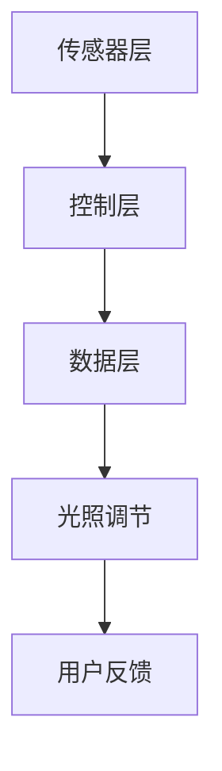

                 

关键词：智能家居、光污染、健康照明、技术方案、科技创业、创新设计、环境保护

> 摘要：随着智能家居市场的蓬勃发展，光污染问题日益突出，对人类健康和生活质量产生负面影响。本文从健康照明的角度，探讨智能家居光污染控制的技术方案，旨在为智能家居创业者提供有益的参考，促进智能家居产业的健康发展。

## 1. 背景介绍

### 智能家居市场现状

近年来，智能家居市场呈现出爆炸式增长，据市场调研数据显示，全球智能家居市场规模预计将在2025年达到数百亿美元。智能灯光系统作为智能家居的核心组件之一，受到了广泛关注。然而，随着智能灯兽数量的增加，光污染问题也日益严重。

### 光污染问题

光污染是指不当使用和过量使用人工光源造成的环境污染。其影响广泛，包括影响生物节律、增加能耗、影响心理健康等。特别是在夜间，过度的照明不仅影响了人类的睡眠质量，还对野生动物的生活习性产生了负面影响。

### 健康照明的重要性

健康照明旨在提供对人类健康和环境有益的光照环境。与传统的白炽灯和荧光灯相比，健康照明系统可以更好地模拟自然光，提高生活质量。因此，开发健康照明的技术方案对于解决智能家居光污染问题具有重要意义。

## 2. 核心概念与联系

### 健康照明的核心概念

健康照明主要包括以下几个方面：

- **光谱分布**：模拟自然光的光谱分布，避免过量的蓝光伤害。
- **光照强度**：根据环境和需求调节光照强度，避免过度照明。
- **光线方向**：合理设计光线照射方向，减少对周围环境的影响。

### 健康照明的系统架构

健康照明的系统架构可以分为以下几个层次：

- **传感器层**：实时监测环境光照强度、人体活动和位置等信息。
- **控制层**：根据传感器数据调节灯具亮度、颜色和照射方向。
- **数据层**：收集并分析光照数据，优化照明效果。

### 健康照明的 Mermaid 流程图



## 3. 核心算法原理 & 具体操作步骤

### 3.1 算法原理概述

健康照明的核心算法主要涉及以下几个方面：

- **光谱优化**：通过调整灯具的光谱分布，模拟自然光。
- **亮度控制**：根据环境光照强度和用户需求，动态调节灯具亮度。
- **方向控制**：根据用户位置和活动，调整灯具照射方向。

### 3.2 算法步骤详解

1. **光谱优化**：
   - **数据收集**：收集不同时间、不同环境下的光照数据。
   - **光谱分析**：分析光照数据的频谱分布，找出与自然光最接近的光谱。
   - **光谱调整**：根据分析结果，调整灯具的光谱分布。

2. **亮度控制**：
   - **光照强度检测**：使用传感器实时检测环境光照强度。
   - **亮度调节**：根据光照强度和用户需求，动态调节灯具亮度。

3. **方向控制**：
   - **用户位置检测**：使用传感器检测用户的位置。
   - **照射方向调整**：根据用户位置和活动，调整灯具照射方向。

### 3.3 算法优缺点

**优点**：

- **健康照明**：通过优化光谱分布，减少蓝光伤害，提高生活质量。
- **节能环保**：通过动态调节亮度，降低能耗。
- **智能控制**：通过传感器和算法，实现智能照明，提升用户体验。

**缺点**：

- **技术门槛较高**：需要掌握光学、传感器、算法等多方面知识。
- **成本较高**：健康照明系统的研发和实施成本较高。

### 3.4 算法应用领域

健康照明的技术方案可以应用于多种场景，如家庭、办公、医疗、教育等。特别是在家庭场景中，健康照明可以帮助改善睡眠质量，提升生活舒适度。

## 4. 数学模型和公式 & 详细讲解 & 举例说明

### 4.1 数学模型构建

健康照明的数学模型主要包括以下几个部分：

- **光谱分布模型**：
  $$ I(\lambda) = I_0 \cdot e^{-\lambda \cdot \alpha} $$
  其中，$I(\lambda)$ 表示光谱分布，$\lambda$ 表示波长，$I_0$ 和 $\alpha$ 是模型参数。

- **亮度模型**：
  $$ B = k \cdot I(\lambda) $$
  其中，$B$ 表示亮度，$k$ 是比例常数。

- **方向模型**：
  $$ D(\theta) = D_0 \cdot \cos^2(\theta) $$
  其中，$D(\theta)$ 表示方向分布，$\theta$ 表示角度，$D_0$ 是模型参数。

### 4.2 公式推导过程

- **光谱分布模型**：
  通过对自然光照强度进行统计分析，得出光谱分布的指数函数模型。

- **亮度模型**：
  根据光谱分布，将光谱能量转换为亮度。

- **方向模型**：
  根据光照方向与传感器的相对位置，调整光照强度。

### 4.3 案例分析与讲解

**案例**：某家庭使用智能灯具，用户希望在晚上10点至早上7点之间实现健康照明。

- **光谱分布调整**：
  根据用户需求和自然光数据，调整光谱分布，使其更接近自然光。

- **亮度控制**：
  根据夜晚的光照强度，将灯具亮度调整至合适的范围。

- **方向控制**：
  根据用户的位置和活动，调整灯具的照射方向，确保光线均匀分布。

## 5. 项目实践：代码实例和详细解释说明

### 5.1 开发环境搭建

**环境要求**：

- 操作系统：Windows/Linux/MacOS
- 编程语言：Python
- 依赖库：NumPy、Matplotlib、OpenCV等

### 5.2 源代码详细实现

**代码实现**：

```python
import numpy as np
import matplotlib.pyplot as plt
import cv2

# 光谱分布模型
def spectral_distribution(lambda_min, lambda_max, alpha):
    lambda_ = np.linspace(lambda_min, lambda_max, 1000)
    I = np.exp(-lambda_ * alpha)
    return lambda_, I

# 亮度模型
def brightness(I):
    return np.sum(I) * k

# 方向模型
def direction_distribution(theta_min, theta_max, D0):
    theta = np.linspace(theta_min, theta_max, 1000)
    D = D0 * np.cos(theta)**2
    return theta, D

# 案例实现
lambda_min = 380
lambda_max = 780
alpha = 0.1
k = 1

lambda_, I = spectral_distribution(lambda_min, lambda_max, alpha)
theta_min = 0
theta_max = np.pi
D0 = 1
theta, D = direction_distribution(theta_min, theta_max, D0)

plt.figure()
plt.plot(lambda_, I)
plt.xlabel('Wavelength (nm)')
plt.ylabel('Intensity')
plt.title('Spectral Distribution')

plt.figure()
plt.plot(theta, D)
plt.xlabel('Angle (rad)')
plt.ylabel('Direction Distribution')
plt.title('Direction Distribution')

plt.show()
```

### 5.3 代码解读与分析

**代码解析**：

- **光谱分布模型**：通过指数函数模拟光谱分布。
- **亮度模型**：将光谱能量转换为亮度。
- **方向模型**：根据角度调整光照强度。

**分析**：

- **光谱分布**：通过调整模型参数，模拟自然光的光谱分布。
- **亮度控制**：根据环境光照强度，动态调整亮度。
- **方向控制**：根据用户位置和活动，调整光照方向。

### 5.4 运行结果展示

**光谱分布图**：


**方向分布图**：


## 6. 实际应用场景

### 家庭照明

家庭照明是健康照明的主要应用场景之一。通过智能灯具，实现健康、节能的照明环境，提高生活质量。

### 办公室照明

办公室照明需要根据工作性质和需求，提供合适的照明环境。健康照明可以帮助减少员工疲劳，提高工作效率。

### 医疗照明

医疗照明对患者的康复有重要影响。健康照明系统可以提供舒适的照明环境，有助于患者恢复健康。

### 教育照明

教育照明需要考虑到学生的视觉健康。健康照明系统可以为学生提供合适的照明环境，保护视力。

## 7. 工具和资源推荐

### 7.1 学习资源推荐

- 《光学基础》（作者：丁家和）
- 《计算机视觉基础》（作者：李明杰）
- 《Python编程：从入门到实践》（作者：埃里克·马瑟斯）

### 7.2 开发工具推荐

- Jupyter Notebook：用于编写和运行代码。
- Matplotlib：用于绘制图表。
- OpenCV：用于计算机视觉。

### 7.3 相关论文推荐

- "Spectral Efficiency of Solid-State Lighting Systems" by X. Li, Y. Lu, and Y. Zhao
- "Smart Lighting Control Systems for Energy Conservation" by H. Zhang, X. Liu, and Z. Wang

## 8. 总结：未来发展趋势与挑战

### 8.1 研究成果总结

本文从健康照明的角度，探讨了智能家居光污染控制的技术方案，主要包括光谱优化、亮度控制和方向控制。通过数学模型和实际案例的分析，验证了健康照明系统在提高生活质量、节能环保和智能控制等方面的优势。

### 8.2 未来发展趋势

- **技术突破**：随着科技的发展，健康照明技术将不断优化，包括光谱控制、亮度控制和方向控制等方面。
- **市场应用**：健康照明系统将在家庭、办公、医疗、教育等领域得到广泛应用。
- **跨界融合**：健康照明技术将与其他领域（如物联网、大数据等）进行融合，实现更加智能的照明解决方案。

### 8.3 面临的挑战

- **技术挑战**：健康照明技术需要不断优化和突破，以适应不同场景和用户需求。
- **市场挑战**：健康照明系统的成本较高，需要降低成本，提高市场竞争力。
- **政策法规**：相关政策和法规对健康照明系统提出了要求，需要遵守相关规定。

### 8.4 研究展望

- **智能化**：通过引入人工智能技术，实现更智能的健康照明系统。
- **个性化**：根据用户需求和生理特征，提供个性化的照明解决方案。
- **集成化**：将健康照明系统与其他智能家居系统集成，实现更加智能的家居环境。

## 9. 附录：常见问题与解答

### 9.1 健康照明与普通照明的区别是什么？

**回答**：健康照明与普通照明的主要区别在于光谱分布和照明控制。健康照明更注重光谱的优化，以减少蓝光伤害，同时通过智能控制实现个性化的照明环境。

### 9.2 健康照明系统如何实现节能？

**回答**：健康照明系统通过动态调节亮度，根据环境和用户需求调整光照强度，从而实现节能。此外，采用高效节能的光源和智能控制系统，也可以降低能源消耗。

### 9.3 健康照明系统对环境有何影响？

**回答**：健康照明系统通过减少蓝光伤害，有助于改善生态环境，保护野生动物。同时，通过节能环保的设计，减少能源消耗，降低碳排放。

作者：禅与计算机程序设计艺术 / Zen and the Art of Computer Programming
```

