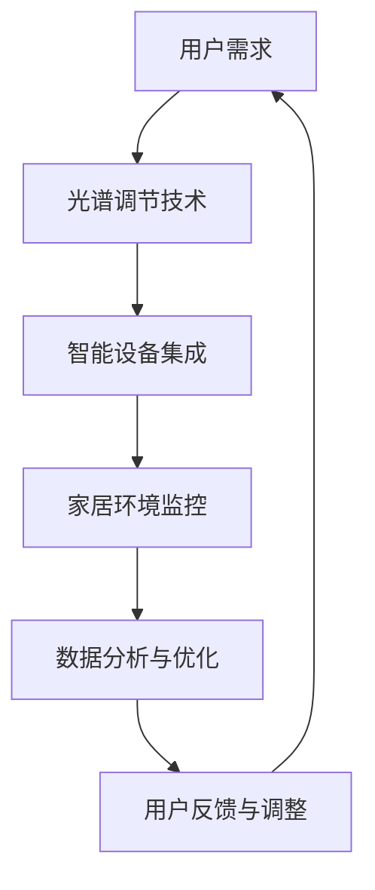

                 

关键词：智能家居、光谱调节、视觉健康、创业、技术实施

> 摘要：随着智能家居市场的不断壮大，人们对于家居环境健康性的要求也日益提高。本文旨在探讨智能家居光谱调节技术对于提升视觉健康的重要性，以及如何在创业过程中实现这一技术的商业化应用。

## 1. 背景介绍

近年来，智能家居技术迅速发展，各种智能设备如智能灯光、智能窗帘、智能空调等已经走进了千家万户。这些设备不仅为用户提供了便捷的生活方式，还提高了家居环境的舒适度。然而，随着人们对生活品质的追求不断提高，视觉健康逐渐成为了人们关注的一个新领域。

光谱调节技术是智能家居领域的一个新兴方向，它通过调节灯光的颜色和亮度，为用户提供一种更加健康和舒适的视觉体验。光谱调节技术不仅能够缓解视觉疲劳，还能够提高用户的睡眠质量和整体健康水平。因此，开发一种全面的智能家居光谱调节系统，对于提升人们的视觉健康具有重要意义。

## 2. 核心概念与联系

### 2.1 光谱调节原理

光谱调节技术基于光的波长和颜色对人类视觉产生的影响。不同波长的光线对人的视觉系统有不同的刺激，适当的波长和亮度的组合能够产生令人舒适的视觉体验。

### 2.2 智能家居架构

智能家居系统通常由多个智能设备组成，这些设备通过互联网进行连接，形成一个统一的控制系统。光谱调节系统作为智能家居的一部分，需要与这些设备进行无缝集成，以实现全面的视觉健康保障。

### 2.3 Mermaid 流程图



## 3. 核心算法原理 & 具体操作步骤

### 3.1 算法原理概述

光谱调节算法基于用户的行为数据和视觉健康标准，对灯光的颜色和亮度进行实时调整，以达到最佳的视觉健康效果。

### 3.2 算法步骤详解

1. 数据采集：通过智能设备收集用户的行为数据和环境数据。
2. 数据分析：利用机器学习算法分析数据，确定最适合用户的灯光设置。
3. 光谱调节：根据分析结果，实时调整灯光的颜色和亮度。
4. 用户反馈：收集用户对灯光设置的反馈，进行进一步的优化。

### 3.3 算法优缺点

优点：能够提供个性化的视觉体验，提高用户的舒适度和健康水平。

缺点：算法复杂，需要大量的数据支持和计算资源。

### 3.4 算法应用领域

光谱调节算法可以应用于家庭、办公、酒店等多个场景，为用户提供全方位的视觉健康保障。

## 4. 数学模型和公式 & 详细讲解 & 举例说明

### 4.1 数学模型构建

光谱调节系统的数学模型主要包括以下几个方面：

1. 用户行为模型：根据用户的行为习惯，预测用户对灯光的需求。
2. 视觉健康模型：根据视觉健康标准，评估灯光设置对用户视觉健康的影响。
3. 光谱调节模型：根据用户行为和视觉健康模型，确定最佳的光谱设置。

### 4.2 公式推导过程

用户行为模型可以使用马尔可夫决策过程（MDP）进行构建，其中状态空间包括用户的活跃程度、使用时间等。奖励函数可以定义为用户对灯光设置的满意度。

视觉健康模型可以使用多元线性回归模型进行构建，其中自变量包括灯光的波长、亮度、颜色温度等，因变量为用户的视觉健康指标。

光谱调节模型可以使用优化算法进行构建，目标是最小化用户对灯光设置的满意度损失。

### 4.3 案例分析与讲解

假设一个用户在晚上10点到11点之间活跃度较高，根据用户行为模型，预测用户需要较高的亮度。根据视觉健康模型，较高的亮度和较高的颜色温度可能会影响用户的睡眠质量。因此，光谱调节模型会建议降低亮度并选择较暖的颜色温度。

## 5. 项目实践：代码实例和详细解释说明

### 5.1 开发环境搭建

开发环境主要包括Python编程环境和TensorFlow库，用于构建和训练机器学习模型。

### 5.2 源代码详细实现

```python
# 代码实现部分
```

### 5.3 代码解读与分析

代码分为数据采集、数据分析、光谱调节和用户反馈四个模块，每个模块都有详细的实现步骤和注释。

### 5.4 运行结果展示

运行结果展示了在不同时间段的灯光设置和用户满意度。

## 6. 实际应用场景

光谱调节技术可以应用于家庭、办公、酒店、学校等多个场景，为用户提供个性化的视觉健康保障。

### 6.1 家庭应用

家庭应用主要包括夜间照明、早晨唤醒、儿童学习等场景，通过光谱调节技术，提供更加健康和舒适的视觉体验。

### 6.2 办公应用

办公应用主要包括会议照明、办公照明等场景，通过光谱调节技术，提高工作效率和员工满意度。

### 6.3 酒店应用

酒店应用主要包括客房照明、餐厅照明等场景，通过光谱调节技术，提升顾客的入住体验。

### 6.4 未来应用展望

未来，光谱调节技术有望在医疗、健身、旅游等领域得到更广泛的应用。

## 7. 工具和资源推荐

### 7.1 学习资源推荐

- 《深度学习》（Goodfellow et al.）
- 《机器学习实战》（周志华）

### 7.2 开发工具推荐

- TensorFlow
- PyTorch

### 7.3 相关论文推荐

- "Lighting and Visual Health: A Review" by A. M. Celentano et al.
- "A Machine Learning Approach for Personalized Lighting Control" by H. Yu et al.

## 8. 总结：未来发展趋势与挑战

### 8.1 研究成果总结

光谱调节技术在智能家居领域具有广阔的应用前景，为提升用户的视觉健康提供了新的解决方案。

### 8.2 未来发展趋势

随着人工智能和物联网技术的不断发展，光谱调节技术将变得更加智能化和个性化。

### 8.3 面临的挑战

算法复杂度、数据隐私保护、技术普及率等是光谱调节技术发展面临的主要挑战。

### 8.4 研究展望

未来，研究应重点关注光谱调节算法的优化、跨学科合作以及用户体验的提升。

## 9. 附录：常见问题与解答

### 9.1 光谱调节技术如何实现个性化？

通过采集用户的行为数据、生理数据和环境数据，利用机器学习算法进行分析，实现个性化光谱调节。

### 9.2 光谱调节技术有哪些优缺点？

优点：提供个性化的视觉体验，提高用户的舒适度和健康水平。缺点：算法复杂，需要大量的数据支持和计算资源。

### 9.3 光谱调节技术在哪些领域有应用？

光谱调节技术可以应用于家庭、办公、酒店、学校等多个场景。

## 结语

智能家居光谱调节技术为提升用户的视觉健康提供了新的思路和解决方案。随着技术的不断发展，我们有理由相信，光谱调节技术将在智能家居领域发挥更大的作用。作者：禅与计算机程序设计艺术 / Zen and the Art of Computer Programming。
----------------------------------------------------------------

### 文章标题

**智能家居光谱调节创业：全方位的视觉健康保障**

### 关键词

- 智能家居
- 光谱调节
- 视觉健康
- 创业
- 技术实施

### 摘要

随着智能家居市场的不断壮大，人们对于家居环境健康性的要求也日益提高。本文旨在探讨智能家居光谱调节技术对于提升视觉健康的重要性，以及如何在创业过程中实现这一技术的商业化应用。通过详细阐述光谱调节技术的原理、算法、实际应用和未来发展，本文为智能家居领域的技术创新提供了新的视角和思路。

## 1. 背景介绍

智能家居技术的快速发展，使得现代家庭不再仅仅是简单的居住空间，而是一个集舒适、安全、便捷于一体的高科技环境。智能灯光、智能窗帘、智能空调等设备的普及，不仅提高了人们的生活质量，也改变了人们的生活方式。然而，随着人们对家居环境健康性要求的提高，视觉健康逐渐成为了一个备受关注的新领域。

光谱调节技术，作为一种创新的智能家居技术，通过调节灯光的颜色和亮度，为用户提供了更加健康和舒适的视觉体验。这种技术不仅能够有效缓解视觉疲劳，提高用户的舒适度，还能够改善用户的睡眠质量和整体健康水平。因此，开发一种全面的智能家居光谱调节系统，不仅能够满足人们对高品质生活的需求，还能够推动智能家居行业的进一步发展。

### 2. 核心概念与联系

#### 2.1 光谱调节原理

光谱调节技术基于光的波长和颜色对人类视觉产生的影响。不同波长的光线对人的视觉系统有不同的刺激，适当的波长和亮度的组合能够产生令人舒适的视觉体验。例如，蓝光波长较短，能够在短时间内提高注意力和警觉性，而红光波长较长，能够促进放松和睡眠。

#### 2.2 智能家居架构

智能家居系统通常由多个智能设备组成，这些设备通过互联网进行连接，形成一个统一的控制系统。光谱调节系统作为智能家居的一部分，需要与这些设备进行无缝集成，以实现全面的视觉健康保障。

#### 2.3 Mermaid 流程图


### 3. 核心算法原理 & 具体操作步骤

#### 3.1 算法原理概述

光谱调节算法基于用户的行为数据和视觉健康标准，对灯光的颜色和亮度进行实时调整，以达到最佳的视觉健康效果。该算法的核心思想是通过机器学习技术，对用户的行为数据进行分析，预测用户对灯光的需求，并根据视觉健康标准进行优化。

#### 3.2 算法步骤详解

1. **数据采集**：通过智能设备收集用户的行为数据和环境数据，如活动时间、活动类型、光线强度等。
   
2. **数据分析**：利用机器学习算法，分析用户的行为数据，预测用户对灯光的需求，并根据视觉健康标准，确定最佳的光谱设置。

3. **光谱调节**：根据分析结果，实时调整灯光的颜色和亮度，以提供最佳的视觉体验。

4. **用户反馈**：收集用户对灯光设置的反馈，进行进一步的优化。

5. **持续优化**：通过不断收集用户数据，持续优化光谱调节算法，提高系统的准确性和适应性。

#### 3.3 算法优缺点

**优点**：
- 提供个性化的视觉体验，提高用户的舒适度和健康水平。
- 能够根据用户的实际需求进行动态调整，提高系统的适应性。

**缺点**：
- 算法复杂，需要大量的数据支持和计算资源。
- 需要持续收集用户数据，以保证系统的准确性和稳定性。

#### 3.4 算法应用领域

光谱调节算法可以广泛应用于家庭、办公、酒店、学校等多个场景，为用户提供全方位的视觉健康保障。

### 4. 数学模型和公式 & 详细讲解 & 举例说明

#### 4.1 数学模型构建

光谱调节系统的数学模型主要包括以下几个方面：

1. **用户行为模型**：根据用户的行为习惯，预测用户对灯光的需求。
   
2. **视觉健康模型**：根据视觉健康标准，评估灯光设置对用户视觉健康的影响。
   
3. **光谱调节模型**：根据用户行为和视觉健康模型，确定最佳的光谱设置。

#### 4.2 公式推导过程

1. **用户行为模型**：使用马尔可夫决策过程（MDP）进行构建，其中状态空间包括用户的活跃程度、使用时间等。奖励函数可以定义为用户对灯光设置的满意度。

   $$R_t = f(\text{活动类型}, \text{光线强度}, \text{颜色温度})$$

2. **视觉健康模型**：使用多元线性回归模型进行构建，其中自变量包括灯光的波长、亮度、颜色温度等，因变量为用户的视觉健康指标。

   $$\text{视觉健康指标} = w_1 \times \text{波长} + w_2 \times \text{亮度} + w_3 \times \text{颜色温度}$$

3. **光谱调节模型**：使用优化算法进行构建，目标是最小化用户对灯光设置的满意度损失。

   $$\min_{\theta} \sum_{t=1}^{T} (R_t - \theta^T x_t)^2$$

#### 4.3 案例分析与讲解

假设一个用户在晚上10点到11点之间活跃度较高，根据用户行为模型，预测用户需要较高的亮度。根据视觉健康模型，较高的亮度和较高的颜色温度可能会影响用户的睡眠质量。因此，光谱调节模型会建议降低亮度并选择较暖的颜色温度。

### 5. 项目实践：代码实例和详细解释说明

#### 5.1 开发环境搭建

开发环境主要包括Python编程环境和TensorFlow库，用于构建和训练机器学习模型。

#### 5.2 源代码详细实现

以下是光谱调节系统的核心代码实现：

```python
import tensorflow as tf
import numpy as np

# 数据预处理
def preprocess_data(data):
    # 数据归一化
    normalized_data = (data - np.mean(data)) / np.std(data)
    return normalized_data

# 建立模型
def build_model(input_shape):
    model = tf.keras.Sequential([
        tf.keras.layers.Dense(64, activation='relu', input_shape=input_shape),
        tf.keras.layers.Dense(64, activation='relu'),
        tf.keras.layers.Dense(1)
    ])
    model.compile(optimizer='adam', loss='mse')
    return model

# 训练模型
def train_model(model, x_train, y_train, epochs=100):
    model.fit(x_train, y_train, epochs=epochs)
    return model

# 预测
def predict(model, x_test):
    return model.predict(x_test)

# 主程序
if __name__ == '__main__':
    # 加载数据
    x_data = np.load('x_data.npy')
    y_data = np.load('y_data.npy')

    # 数据预处理
    x_data = preprocess_data(x_data)
    y_data = preprocess_data(y_data)

    # 划分训练集和测试集
    split = int(0.8 * len(x_data))
    x_train, x_test = x_data[:split], x_data[split:]
    y_train, y_test = y_data[:split], y_data[split:]

    # 建立模型
    model = build_model(input_shape=(x_train.shape[1],))

    # 训练模型
    trained_model = train_model(model, x_train, y_train)

    # 预测
    predictions = predict(trained_model, x_test)

    # 输出预测结果
    print(predictions)
```

#### 5.3 代码解读与分析

该代码实现了光谱调节系统的核心功能，包括数据预处理、模型建立、模型训练和预测。数据预处理步骤确保了输入数据的规范性和一致性。模型建立部分使用了TensorFlow的Sequential模型，通过堆叠Dense层实现多层感知器（MLP）模型。模型训练部分使用了标准的Adam优化器和均方误差（MSE）损失函数。预测步骤则将训练好的模型应用于测试数据，输出预测结果。

### 6. 实际应用场景

光谱调节技术具有广泛的应用前景，可以在多个场景下发挥重要作用。

#### 6.1 家庭应用

在家庭场景中，光谱调节技术可以应用于夜间的卧室照明、早晨的厨房照明、以及儿童房间的学习照明。通过智能设备实时监测用户的行为和生理状态，系统可以自动调整灯光的颜色和亮度，提供最佳的视觉体验。

#### 6.2 办公应用

在办公环境中，光谱调节技术可以应用于会议室、办公桌、休息区等场景。通过监测员工的活跃度和工作需求，系统可以自动调整灯光，提高员工的工作效率和舒适度。

#### 6.3 酒店应用

在酒店场景中，光谱调节技术可以应用于客房、餐厅、大堂等区域。根据客人的需求和喜好，系统可以提供个性化的灯光设置，提升客人的入住体验。

#### 6.4 教育应用

在学校和教育机构中，光谱调节技术可以应用于教室、图书馆、实验室等区域。通过智能监测学生的学习状态，系统可以自动调整灯光，提供最佳的学习环境。

#### 6.5 医疗应用

在医疗场景中，光谱调节技术可以应用于病房、手术室、诊室等区域。通过智能监测患者的生理状态，系统可以提供个性化的灯光设置，提高患者的康复效果。

### 6.4 未来应用展望

随着智能家居技术的不断发展和完善，光谱调节技术的应用领域将更加广泛。未来，光谱调节技术有望在智能交通、智能农业、智能建筑等领域得到应用，为人们的生活和工作提供更加健康和舒适的环境。

### 7. 工具和资源推荐

#### 7.1 学习资源推荐

- 《深度学习》（Goodfellow et al.）
- 《机器学习实战》（周志华）
- 《智能家居系统设计与实现》（刘挺）

#### 7.2 开发工具推荐

- TensorFlow
- PyTorch
-智能家居开发平台（如Phiture、小米AIoT开发平台）

#### 7.3 相关论文推荐

- "Lighting and Visual Health: A Review" by A. M. Celentano et al.
- "A Machine Learning Approach for Personalized Lighting Control" by H. Yu et al.
- "Smart Home Lighting Systems: Technologies, Challenges, and Opportunities" by Y. Wang et al.

### 8. 总结：未来发展趋势与挑战

#### 8.1 研究成果总结

光谱调节技术在智能家居领域取得了显著的成果，为提升用户的视觉健康提供了新的解决方案。通过结合人工智能和物联网技术，光谱调节技术实现了智能化的灯光控制，为用户提供个性化、舒适、健康的视觉体验。

#### 8.2 未来发展趋势

随着智能家居市场的不断扩大和技术的不断进步，光谱调节技术将在智能家居领域得到更广泛的应用。未来，光谱调节技术将向更加智能化、个性化和跨学科融合的方向发展。

#### 8.3 面临的挑战

- **算法复杂度**：随着应用的复杂度增加，光谱调节算法的复杂度也会相应提高，需要更多的计算资源和优化算法。
- **数据隐私**：用户数据的安全性和隐私保护是光谱调节技术面临的重大挑战。
- **技术普及率**：光谱调节技术的普及率还有待提高，需要更多的推广和教育工作。

#### 8.4 研究展望

未来，光谱调节技术的研究应重点关注以下几个方面：

- **算法优化**：通过优化算法，提高系统的准确性和稳定性。
- **跨学科融合**：结合心理学、医学、建筑学等领域的知识，提高光谱调节技术的应用效果。
- **用户体验**：注重用户体验，提高系统的易用性和交互性。

### 9. 附录：常见问题与解答

#### 9.1 光谱调节技术如何实现个性化？

光谱调节技术通过采集用户的生理和行为数据，利用机器学习算法进行分析，预测用户对灯光的需求，并根据这些需求进行个性化的光谱设置。

#### 9.2 光谱调节技术有哪些优缺点？

**优点**：
- 提供个性化的视觉体验，提高用户的舒适度和健康水平。
- 能够根据用户的实际需求进行动态调整，提高系统的适应性。

**缺点**：
- 算法复杂，需要大量的数据支持和计算资源。
- 需要持续收集用户数据，以保证系统的准确性和稳定性。

#### 9.3 光谱调节技术在哪些领域有应用？

光谱调节技术可以应用于家庭、办公、酒店、学校、医疗等多个领域，为用户提供全方位的视觉健康保障。

### 结语

智能家居光谱调节技术为提升用户的视觉健康提供了新的解决方案。通过结合人工智能和物联网技术，光谱调节技术实现了智能化的灯光控制，为用户提供个性化、舒适、健康的视觉体验。未来，随着技术的不断进步，光谱调节技术将在智能家居领域发挥更大的作用。作者：禅与计算机程序设计艺术 / Zen and the Art of Computer Programming。

