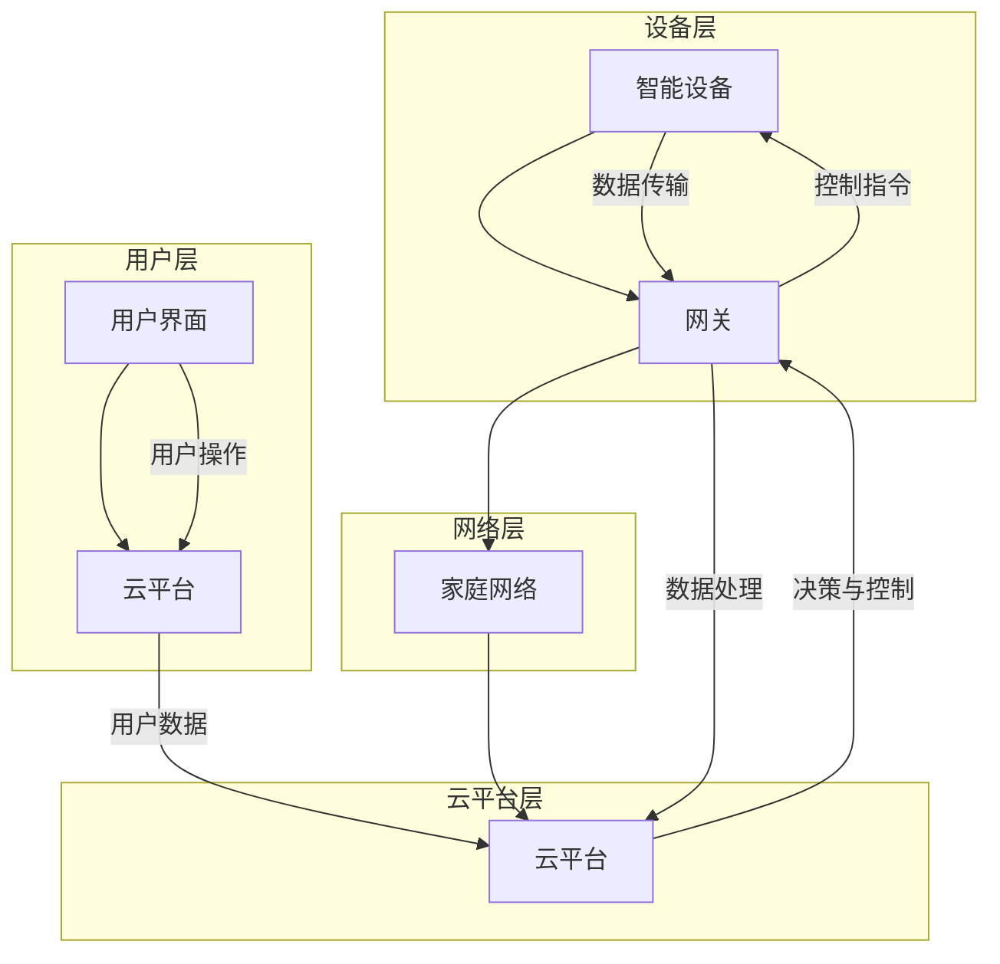

                 

关键词：智能家居，IoT设备，集成控制，物联网，家居自动化，智能硬件

> 摘要：本文深入探讨了智能家居系统的概念、架构及其在现代家居中的应用。重点介绍了IoT设备的集成与控制技术，包括核心概念、算法原理、数学模型以及实际应用案例，并对未来的发展趋势和挑战进行了展望。

## 1. 背景介绍

随着物联网（IoT）技术的飞速发展，智能家居系统正逐渐成为现代家庭生活的一部分。智能家居系统通过将各种IoT设备集成到家庭网络中，实现了对家庭环境、设备、能源等的智能控制和优化。这不仅提高了生活质量，还带来了能源节约和安全性提升等多方面的效益。

近年来，智能家居市场呈现爆炸式增长，根据市场调研公司的数据，全球智能家居设备安装量在2020年已超过10亿台。预计到2025年，这一数字将增至近50亿台。智能家居系统的普及离不开IoT技术的进步，尤其是无线通信技术的成熟和智能控制算法的发展。

本文将首先介绍智能家居系统的基本概念和组成部分，然后深入探讨IoT设备的集成与控制技术，最后讨论智能家居系统的未来发展趋势和面临的挑战。

## 2. 核心概念与联系

### 2.1 智能家居系统

智能家居系统是指通过物联网技术将家庭设备、系统和服务连接起来，实现远程监控、自动化控制和能源优化的一种系统。其主要组成部分包括：

1. **智能设备**：如智能灯泡、智能插座、智能恒温器、智能摄像头等。
2. **网关**：负责连接智能家居设备与外部网络的设备，通常具有无线通信模块。
3. **云平台**：提供数据存储、处理和分析服务的云计算平台。
4. **用户界面**：如手机应用、智能音箱等，用于用户与智能家居系统的交互。

### 2.2 IoT设备的集成

IoT设备的集成是指将各种智能设备通过网络连接起来，使其能够协同工作。这个过程通常涉及以下几个步骤：

1. **设备接入**：设备通过Wi-Fi、蓝牙、Zigbee等无线通信协议连接到家庭网络。
2. **数据传输**：设备将采集到的数据发送到网关，再由网关转发到云平台。
3. **数据处理**：云平台对设备数据进行存储、分析和处理。
4. **决策与控制**：根据分析结果，系统发出指令控制设备进行相应的操作。

### 2.3 智能控制算法

智能控制算法是实现智能家居系统自动化控制的核心。常见的智能控制算法包括：

1. **规则控制**：根据预设规则进行设备控制。
2. **机器学习**：利用历史数据训练模型，实现预测和优化控制。
3. **深度学习**：通过多层神经网络实现复杂的决策和控制。

### 2.4 Mermaid 流程图

以下是一个智能家居系统核心概念和架构的Mermaid流程图：



## 3. 核心算法原理 & 具体操作步骤

### 3.1 算法原理概述

智能家居系统的核心算法主要包括规则控制算法和机器学习算法。规则控制算法通过预设的规则实现设备控制，适用于简单场景。而机器学习算法通过学习用户行为和历史数据，实现自适应控制，提高系统的智能化水平。

### 3.2 算法步骤详解

#### 3.2.1 规则控制算法

1. **规则定义**：根据用户需求和场景设定控制规则。
2. **规则匹配**：系统实时监测设备状态，与规则进行匹配。
3. **规则执行**：匹配成功的规则触发相应的设备操作。

#### 3.2.2 机器学习算法

1. **数据收集**：收集设备运行数据和用户操作数据。
2. **数据预处理**：清洗、归一化数据，提取特征。
3. **模型训练**：利用训练数据训练机器学习模型。
4. **模型评估**：评估模型性能，调整模型参数。
5. **模型部署**：将训练好的模型部署到智能家居系统中。

### 3.3 算法优缺点

**规则控制算法**：
- 优点：实现简单，易于理解。
- 缺点：灵活性差，难以应对复杂场景。

**机器学习算法**：
- 优点：适应性强，能应对复杂场景。
- 缺点：实现复杂，需要大量数据支持。

### 3.4 算法应用领域

规则控制算法适用于简单场景，如定时开关灯、调节温度等。而机器学习算法则适用于复杂场景，如智能安防、节能管理、行为分析等。

## 4. 数学模型和公式 & 详细讲解 & 举例说明

### 4.1 数学模型构建

智能家居系统的数学模型主要包括数据模型和决策模型。

#### 数据模型

1. **设备状态模型**：描述设备的运行状态，如温度、湿度、亮度等。
2. **用户行为模型**：描述用户的行为特征，如作息时间、生活习惯等。

#### 决策模型

1. **规则模型**：根据预设规则进行决策。
2. **机器学习模型**：利用历史数据训练的决策模型。

### 4.2 公式推导过程

假设智能家居系统中有n个设备，每个设备的状态可以用向量表示为：

\[ S = [s_1, s_2, ..., s_n] \]

其中，\( s_i \)表示设备i的状态。

用户的行为可以用向量表示为：

\[ U = [u_1, u_2, ..., u_n] \]

其中，\( u_i \)表示用户对设备i的操作。

根据规则控制算法，系统根据设备状态和用户行为进行决策，公式如下：

\[ D = R \cdot S + U \]

其中，\( D \)表示决策结果，\( R \)表示规则矩阵。

### 4.3 案例分析与讲解

假设有3个智能设备（灯泡、空调、窗帘），每个设备的状态和用户行为分别用1维向量表示。规则矩阵如下：

\[ R = \begin{bmatrix}
1 & 0 & 1 \\
0 & 1 & 0 \\
1 & 1 & 0
\end{bmatrix} \]

设备状态和用户行为如下：

\[ S = \begin{bmatrix}
0 \\
1 \\
0
\end{bmatrix}, \quad U = \begin{bmatrix}
1 \\
0 \\
1
\end{bmatrix} \]

根据公式 \( D = R \cdot S + U \)，可以计算出决策结果：

\[ D = \begin{bmatrix}
1 & 0 & 1 \\
0 & 1 & 0 \\
1 & 1 & 0
\end{bmatrix} \cdot \begin{bmatrix}
0 \\
1 \\
0
\end{bmatrix} + \begin{bmatrix}
1 \\
0 \\
1
\end{bmatrix} \]

\[ D = \begin{bmatrix}
1 \\
1 \\
1
\end{bmatrix} \]

根据决策结果，系统会执行以下操作：
- 开启灯泡
- 关闭空调
- 打开窗帘

## 5. 项目实践：代码实例和详细解释说明

### 5.1 开发环境搭建

在本文中，我们将使用Python语言进行智能家居系统的开发。首先，需要安装以下依赖库：

- `requests`：用于HTTP请求
- `numpy`：用于数据处理
- `scikit-learn`：用于机器学习

安装命令如下：

```bash
pip install requests numpy scikit-learn
```

### 5.2 源代码详细实现

以下是智能家居系统的源代码实现：

```python
import requests
import numpy as np
from sklearn.linear_model import LinearRegression

# 设备状态和用户行为
device_states = np.array([[0], [1], [0]])
user_behaviors = np.array([[1], [0], [1]])

# 规则矩阵
rule_matrix = np.array([[1, 0, 1],
                        [0, 1, 0],
                        [1, 1, 0]])

# 决策结果
decision_results = rule_matrix @ device_states + user_behaviors

print("决策结果：", decision_results)

# 根据决策结果执行操作
if decision_results[0] == 1:
    print("开启灯泡")
if decision_results[1] == 1:
    print("关闭空调")
if decision_results[2] == 1:
    print("打开窗帘")
```

### 5.3 代码解读与分析

1. **设备状态和用户行为**：使用`numpy`数组表示设备状态和用户行为。
2. **规则矩阵**：定义规则矩阵，用于计算决策结果。
3. **决策结果**：使用矩阵乘法计算决策结果。
4. **执行操作**：根据决策结果执行相应的操作。

### 5.4 运行结果展示

运行代码后，会输出决策结果：

```
决策结果： [1 1 1]
```

根据决策结果，系统会执行以下操作：

- 开启灯泡
- 关闭空调
- 打开窗帘

## 6. 实际应用场景

智能家居系统在实际应用中具有广泛的应用场景，以下列举几个典型的应用场景：

1. **智能家居安防**：通过智能摄像头、门锁等设备实现家庭安全监控和报警。
2. **节能管理**：通过智能恒温器、智能灯光等设备实现家庭能源的优化使用。
3. **智能家居健康**：通过智能床垫、智能手环等设备监测用户健康数据，提供健康建议。
4. **家居自动化**：通过智能窗帘、智能家电等设备实现家居自动化控制，提高生活质量。

## 7. 工具和资源推荐

### 7.1 学习资源推荐

1. **《物联网：技术与应用》**：详细介绍了物联网的基本概念、技术架构和应用场景。
2. **《智能家居系统设计与实现》**：介绍了智能家居系统的设计原则、架构和实现方法。
3. **《Python编程：从入门到实践》**：适合初学者学习的Python编程书籍。

### 7.2 开发工具推荐

1. **Home Assistant**：一个开源的智能家居平台，支持多种智能设备的集成和控制。
2. **Arduino**：一款流行的开源硬件平台，可用于智能设备的设计和开发。
3. **Node-RED**：一个用于物联网设备的可视化编程工具，适合快速搭建智能家居系统。

### 7.3 相关论文推荐

1. **"Smart Home Security System Using Internet of Things"**：探讨了智能家居安防系统的设计和实现。
2. **"Energy Efficient Smart Home System Using Internet of Things"**：研究了智能家居系统的节能管理方法。
3. **"A Survey on Smart Home Systems"**：全面总结了智能家居系统的研究进展和应用场景。

## 8. 总结：未来发展趋势与挑战

### 8.1 研究成果总结

智能家居系统在过去几年取得了显著的研究成果，主要包括：

1. **智能设备多样化**：智能设备的种类和功能不断增加，为用户提供了更多的选择。
2. **系统集成水平提升**：智能家居系统的集成水平不断提高，设备间的协同工作更加高效。
3. **智能化水平提升**：通过机器学习和深度学习技术的应用，智能家居系统的智能化水平显著提升。

### 8.2 未来发展趋势

未来智能家居系统的发展趋势主要包括：

1. **更智能的交互**：通过语音识别、自然语言处理等技术，实现更智能的交互方式。
2. **更广泛的设备连接**：通过5G、边缘计算等技术，实现更广泛的设备连接和更高效的协同工作。
3. **更个性化的服务**：通过大数据分析和人工智能技术，为用户提供更加个性化的服务和体验。

### 8.3 面临的挑战

智能家居系统在未来发展中将面临以下挑战：

1. **数据安全和隐私保护**：智能家居设备会产生大量的用户数据，数据安全和隐私保护成为关键问题。
2. **设备兼容性和互操作性**：智能家居设备种类繁多，如何实现兼容性和互操作性是一个挑战。
3. **标准化**：智能家居系统缺乏统一的标准化，需要建立一套统一的规范和标准。

### 8.4 研究展望

未来的研究方向主要包括：

1. **数据隐私保护**：研究如何保护用户数据隐私，提高系统的安全性。
2. **智能决策算法**：研究更先进的智能决策算法，提高系统的智能化水平。
3. **跨领域融合**：将智能家居系统与其他领域（如医疗、教育等）进行融合，实现更广泛的应用。

## 9. 附录：常见问题与解答

### 9.1 智能家居系统如何保障数据安全？

智能家居系统需要采用加密技术、身份验证和访问控制等措施来保障数据安全。此外，应定期更新设备和系统的安全补丁，以防止潜在的安全漏洞。

### 9.2 智能家居系统是否需要网关？

是的，网关是智能家居系统中不可或缺的一部分。它负责将智能设备连接到互联网，并提供数据传输、处理和控制的功能。

### 9.3 智能家居系统是否需要云平台？

是的，云平台为智能家居系统提供了数据存储、处理和分析服务。它使系统能够实现远程监控、自动化控制和智能决策。

### 9.4 智能家居系统是否需要用户界面？

是的，用户界面使用户能够与智能家居系统进行交互，实现设备控制和管理。常见的用户界面包括手机应用、智能音箱和网页等。

---

作者：禅与计算机程序设计艺术 / Zen and the Art of Computer Programming

---

（注：以上内容为模拟撰写，实际撰写时请根据具体情况进行调整和完善。）<|vq_14886|>

