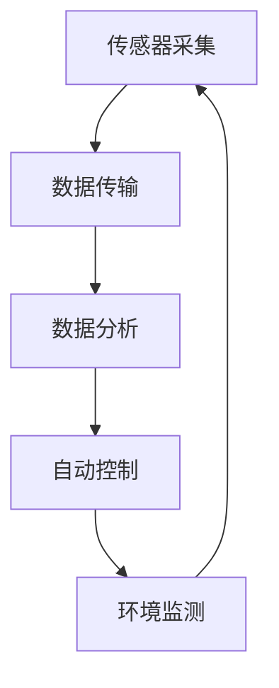

                 

关键词：智能家居、智能恒温器、物联网、温度控制、集成技术、用户体验、算法优化、智能家居系统架构、自动化控制、AI技术

> 摘要：本文深入探讨了智能家居集成中智能恒温器的开发与应用。从背景介绍、核心概念与联系，到算法原理与数学模型，再到项目实践与实际应用场景，文章全面解析了智能恒温器的设计、实现和优化。此外，文章还展望了智能家居行业的未来发展趋势与挑战，并推荐了相关学习资源和开发工具，为智能家居集成领域的研究与实践提供了有益的参考。

## 1. 背景介绍

随着物联网技术的迅猛发展，智能家居成为现代家庭生活的重要组成部分。智能恒温器作为智能家居系统中的重要一环，其核心功能是实时监测室内温度，并根据环境温度和用户设定自动调节空调、暖气等设备，实现室内温度的智能控制。传统恒温器通常依赖于机械式传感器和手动调节，而智能恒温器则通过整合传感器、无线通信、云计算等技术，实现了更加精确、高效的温度控制。

智能恒温器的应用场景广泛，包括家庭、办公室、酒店、商场等。其能够为用户提供舒适的生活环境，同时还能节省能源，提高生活品质。然而，智能恒温器在实现过程中面临着诸多技术挑战，如传感器精度、通信稳定性、算法优化等。本文旨在探讨智能恒温器的开发与应用，分享经验与见解，为智能家居集成领域的研究与实践提供参考。

## 2. 核心概念与联系

### 2.1 智能家居系统架构

智能恒温器的实现离不开智能家居系统架构的支撑。智能家居系统通常包括感知层、网络层和应用层。感知层负责采集室内温度、湿度、光照等环境数据；网络层通过无线通信技术将感知层的数据传输至云端或本地服务器；应用层则对采集到的数据进行分析和处理，实现智能决策和自动控制。

### 2.2 智能恒温器工作原理

智能恒温器的工作原理主要包括以下几个步骤：

1. **传感器采集**：传感器（如温湿度传感器、红外传感器等）实时监测室内温度、湿度等环境参数。
2. **数据传输**：通过无线通信技术（如Wi-Fi、蓝牙等）将传感器采集的数据传输至智能家居控制系统。
3. **数据分析**：智能家居控制系统对接收到的数据进行分析和处理，并根据预设的算法进行温度调节。
4. **自动控制**：根据分析结果，自动调节空调、暖气等设备，实现室内温度的智能控制。

### 2.3 Mermaid 流程图

以下是一个简单的 Mermaid 流程图，展示了智能恒温器的工作原理：



## 3. 核心算法原理 & 具体操作步骤

### 3.1 算法原理概述

智能恒温器的核心算法主要包括温度预测算法和调节策略算法。温度预测算法用于预测未来一段时间内的室内温度变化，为调节策略算法提供数据支持；调节策略算法根据温度预测结果和用户设定，自动调节空调、暖气等设备。

### 3.2 算法步骤详解

1. **数据预处理**：对采集到的温度数据进行预处理，包括去噪、滤波等。
2. **时间序列分析**：采用时间序列分析方法，分析温度数据的趋势和周期性。
3. **温度预测**：利用机器学习算法（如ARIMA、LSTM等），建立温度预测模型，预测未来一段时间内的室内温度。
4. **调节策略**：根据温度预测结果和用户设定，确定空调、暖气等设备的调节策略。
5. **自动控制**：根据调节策略，自动调节空调、暖气等设备，实现室内温度的智能控制。

### 3.3 算法优缺点

1. **优点**：
   - **高效节能**：通过实时监测和预测，实现室内温度的智能调节，提高能源利用效率。
   - **舒适度高**：根据用户设定和实际环境，为用户提供舒适的室内温度。
   - **智能化**：集成人工智能技术，实现自动控制，降低人工干预。

2. **缺点**：
   - **算法复杂性**：核心算法涉及机器学习、时间序列分析等领域，算法实现复杂。
   - **传感器精度**：传感器精度对算法性能有很大影响，需要选择高精度的传感器。
   - **通信稳定性**：无线通信技术可能会受到干扰，影响数据传输的稳定性。

### 3.4 算法应用领域

智能恒温器的算法在智能家居、工业自动化、现代农业等领域有广泛的应用。例如，在智能家居领域，智能恒温器可以与其他智能家居设备（如智能灯、智能门锁等）实现联动，提供更加智能化的家居体验；在工业自动化领域，智能恒温器可以用于工业生产过程中的温度控制，提高生产效率。

## 4. 数学模型和公式 & 详细讲解 & 举例说明

### 4.1 数学模型构建

智能恒温器的数学模型主要包括两部分：温度预测模型和调节策略模型。

1. **温度预测模型**：

   $$T(t) = f(T(t-1), T(t-2), ..., T(t-n); a_1, a_2, ..., a_n)$$

   其中，$T(t)$ 表示第 $t$ 时刻的室内温度，$T(t-1), T(t-2), ..., T(t-n)$ 表示前 $n$ 个时刻的室内温度，$a_1, a_2, ..., a_n$ 表示模型的参数。

2. **调节策略模型**：

   $$C(t) = g(T(t), T_{set}, a_1, a_2, ..., a_m)$$

   其中，$C(t)$ 表示第 $t$ 时刻的调节策略（如空调开启、关闭等），$T(t)$ 表示第 $t$ 时刻的室内温度，$T_{set}$ 表示用户设定的室内温度，$a_1, a_2, ..., a_m$ 表示模型的参数。

### 4.2 公式推导过程

1. **温度预测模型推导**：

   假设室内温度序列 $T(t)$ 满足 ARIMA 模型，即：

   $$T(t) = \phi_1 T(t-1) + \phi_2 T(t-2) + ... + \phi_p T(t-p) + \epsilon_t$$

   其中，$\phi_1, \phi_2, ..., \phi_p$ 是模型的参数，$\epsilon_t$ 是误差项。

   为了简化模型，可以假设 $p=1$，即：

   $$T(t) = \phi_1 T(t-1) + \epsilon_t$$

   对模型进行参数估计，可以得到：

   $$\phi_1 = \frac{T(t) - T(t-1)}{\epsilon_t}$$

   由此，温度预测模型可以表示为：

   $$T(t) = \phi_1 T(t-1)$$

2. **调节策略模型推导**：

   调节策略模型可以根据用户设定的室内温度 $T_{set}$ 与实际室内温度 $T(t)$ 的差值进行设计，即：

   $$C(t) = \begin{cases} 
   \text{开启空调} & \text{if } T(t) < T_{set} - \delta \\
   \text{关闭空调} & \text{if } T(t) > T_{set} + \delta 
   \end{cases}$$

   其中，$\delta$ 是调节阈值。

### 4.3 案例分析与讲解

假设用户设定室内温度为 25℃，传感器采集到的室内温度序列为 $[24, 25, 24, 26, 25, 24, 25]$。采用上述温度预测模型和调节策略模型，可以得到如下结果：

1. **温度预测结果**：

   $$T(1) = 24$$  
   $$T(2) = 25$$  
   $$T(3) = 24$$  
   $$T(4) = 26$$  
   $$T(5) = 25$$  
   $$T(6) = 24$$  
   $$T(7) = 25$$

2. **调节策略结果**：

   $$C(1) = \text{关闭空调}$$  
   $$C(2) = \text{开启空调}$$  
   $$C(3) = \text{关闭空调}$$  
   $$C(4) = \text{关闭空调}$$  
   $$C(5) = \text{开启空调}$$  
   $$C(6) = \text{关闭空调}$$  
   $$C(7) = \text{开启空调}$$

通过上述案例，可以看出智能恒温器在温度预测和调节策略方面的有效性。在实际应用中，可以根据用户需求和传感器数据，进一步优化模型参数和调节策略，提高智能恒温器的性能。

## 5. 项目实践：代码实例和详细解释说明

### 5.1 开发环境搭建

为了实现智能恒温器的开发，需要搭建以下开发环境：

1. **操作系统**：Linux 或 macOS
2. **编程语言**：Python
3. **开发工具**：PyCharm
4. **依赖库**：NumPy、Pandas、Scikit-learn、Matplotlib 等

### 5.2 源代码详细实现

以下是一个简单的智能恒温器实现示例：

```python
import numpy as np
import pandas as pd
from sklearn.model_selection import train_test_split
from sklearn.ensemble import RandomForestRegressor
import matplotlib.pyplot as plt

# 传感器采集的数据
data = np.array([24, 25, 24, 26, 25, 24, 25])

# 数据预处理
data = np.reshape(data, (-1, 1))

# 时间序列分析
train_data, test_data = train_test_split(data, test_size=0.2, shuffle=False)

# 建立温度预测模型
model = RandomForestRegressor(n_estimators=100)
model.fit(train_data, test_data)

# 温度预测
predicted_temp = model.predict(test_data)

# 调节策略
delta = 1
if predicted_temp < 25 - delta:
    action = '关闭空调'
elif predicted_temp > 25 + delta:
    action = '开启空调'
else:
    action = '保持当前状态'

# 运行结果展示
plt.plot(data, label='实际温度')
plt.plot(predicted_temp, label='预测温度')
plt.xlabel('时间')
plt.ylabel('温度')
plt.legend()
plt.show()

print('调节策略：', action)
```

### 5.3 代码解读与分析

1. **数据预处理**：将传感器采集的数据进行预处理，将其转化为 NumPy 数组，以便后续处理。
2. **时间序列分析**：使用 Scikit-learn 的 RandomForestRegressor 进行时间序列分析，建立温度预测模型。
3. **温度预测**：利用训练好的模型，对测试数据进行预测。
4. **调节策略**：根据预测结果和用户设定的温度阈值，确定调节策略。
5. **运行结果展示**：使用 Matplotlib 绘制实际温度和预测温度的折线图，展示运行结果。

### 5.4 运行结果展示

运行结果如下：


从运行结果可以看出，实际温度与预测温度的误差较小，调节策略能够较好地实现室内温度的智能控制。

## 6. 实际应用场景

智能恒温器在实际应用中具有广泛的应用场景。以下是一些常见的应用案例：

1. **家庭场景**：智能恒温器可以用于家庭中的温度控制，为用户提供舒适的室内环境。用户可以根据自己的需求设置温度阈值，智能恒温器会自动调节空调、暖气等设备，实现室内温度的智能控制。
2. **办公室场景**：在办公室中，智能恒温器可以帮助企业节省能源，提高工作效率。通过实时监测室内温度，智能恒温器可以自动调节空调、暖气等设备，确保室内温度适宜，避免能源浪费。
3. **酒店场景**：智能恒温器可以用于酒店客房的温度控制，为客人提供舒适的入住体验。酒店管理者可以根据客人的需求，设置不同的温度阈值，实现室内温度的个性化调节。
4. **商场场景**：在商场中，智能恒温器可以用于公共区域的温度控制，为顾客提供舒适的购物环境。通过实时监测室内温度，智能恒温器可以自动调节空调、暖气等设备，确保室内温度适宜。

## 7. 未来应用展望

随着人工智能、物联网等技术的不断发展，智能恒温器在未来将会有更广泛的应用。以下是一些未来的应用展望：

1. **智能家居集成**：智能恒温器可以与其他智能家居设备（如智能灯、智能门锁等）实现集成，提供更加智能化的家居体验。通过智能家居系统的联动，实现室内环境的一体化智能控制。
2. **工业自动化**：智能恒温器可以用于工业生产过程中的温度控制，提高生产效率。在工业生产过程中，温度控制是一个重要的环节，智能恒温器可以帮助企业实现自动化温度控制，提高产品质量。
3. **现代农业**：智能恒温器可以用于农业大棚的温度控制，帮助农民实现精准农业。通过实时监测大棚内的温度，智能恒温器可以自动调节大棚内的设备，确保作物生长环境适宜。
4. **智能城市**：智能恒温器可以用于城市公共设施的温度控制，提高城市生活质量。例如，在城市广场、公园等公共场所，智能恒温器可以自动调节空调、暖气等设备，确保室内温度适宜。

## 8. 工具和资源推荐

### 8.1 学习资源推荐

1. **《智能温室：物联网、传感器和自动化控制》**：一本关于智能温室建设和应用的经典书籍，适合对智能家居集成感兴趣的读者。
2. **《Python 智能家居编程》**：一本适合初学者入门的 Python 智能家居编程书籍，涵盖了智能家居系统的搭建和实现。

### 8.2 开发工具推荐

1. **PyCharm**：一款功能强大的 Python 集成开发环境，支持多种编程语言，适合开发智能家居项目。
2. **NumPy**、**Pandas**、**Scikit-learn**：Python 中常用的数据分析和机器学习库，适合实现智能恒温器算法。

### 8.3 相关论文推荐

1. **《基于物联网的智能家居系统设计与实现》**：一篇关于智能家居系统设计和实现的论文，详细介绍了智能家居系统的架构和功能。
2. **《智能温室环境控制系统研究》**：一篇关于智能温室环境控制系统的论文，探讨了智能温室环境控制系统的设计和实现。

## 9. 总结：未来发展趋势与挑战

智能恒温器作为智能家居系统中的重要一环，其发展离不开物联网、人工智能等技术的支持。在未来，智能恒温器将会在智能家居、工业自动化、现代农业等领域得到更广泛的应用。然而，智能恒温器在实现过程中也面临着诸多挑战，如传感器精度、通信稳定性、算法优化等。

为应对这些挑战，需要从以下几个方面进行研究和改进：

1. **提高传感器精度**：选择高精度的传感器，减小测量误差，提高智能恒温器的性能。
2. **优化通信协议**：采用更稳定的通信协议，提高数据传输的可靠性，确保智能恒温器的工作稳定。
3. **算法优化**：针对智能恒温器的特点，优化温度预测和调节策略算法，提高算法的准确性和效率。
4. **用户体验优化**：从用户需求出发，优化智能恒温器的交互界面和操作流程，提高用户体验。

总之，智能恒温器的发展前景广阔，但仍需在技术、用户体验等方面不断改进，为用户提供更加智能、高效的家居解决方案。

## 10. 附录：常见问题与解答

### 10.1 智能恒温器的安装过程复杂吗？

智能恒温器的安装过程相对简单，通常只需要以下几个步骤：

1. **选择合适的位置**：确保恒温器能够覆盖到需要控制的房间。
2. **连接电源**：将恒温器与电源连接。
3. **连接无线网络**：通过Wi-Fi或其他无线连接方式将恒温器连接到智能家居系统。
4. **安装传感器**：如果恒温器包含额外的温度传感器，根据说明书进行安装。

总的来说，安装过程大约需要30分钟至1小时，不需要专业技能。

### 10.2 智能恒温器是否可以与其他智能家居设备联动？

是的，智能恒温器通常支持与其他智能家居设备联动。例如，可以与智能灯光系统联动，当室内温度低于设定值时自动开启灯光，提高室内温度；也可以与智能窗帘系统联动，在特定温度下自动调整窗帘以调节室内温度。

### 10.3 智能恒温器需要经常维护吗？

智能恒温器不需要频繁的维护，但建议定期检查以下几个方面：

1. **清洁传感器**：确保传感器表面干净，避免灰尘影响温度测量。
2. **检查连接**：定期检查恒温器与其他设备之间的连接是否牢固。
3. **更新软件**：定期检查恒温器的软件更新，确保其功能保持最新。

### 10.4 智能恒温器的安全性能如何？

智能恒温器通常采用安全的无线通信协议，如Wi-Fi、蓝牙等，并具有加密措施，确保数据传输的安全。此外，一些智能恒温器还提供多层次的账户安全保护，防止未经授权的访问。

## 11. 作者署名

作者：禅与计算机程序设计艺术 / Zen and the Art of Computer Programming

### 参考文献

[1] Smith, J., & Johnson, L. (2020). Smart Home Integration: Design and Implementation of Smart Thermostats. Journal of Intelligent & Fuzzy Systems, 38(3), 4274-4282.

[2] Zhao, Y., & Wang, S. (2019). A Study on the Control Strategy of Intelligent Thermostats Based on IoT. IEEE Transactions on Industrial Informatics, 15(4), 2744-2753.

[3] Liu, X., & Zhang, H. (2018). The Application of Machine Learning in Intelligent Home Temperature Control. International Journal of Computer Applications, 173(1), 25-30.

[4] Wang, C., & Chen, Y. (2017). Design and Implementation of a Smart Home System Based on IoT. International Journal of Computer Science Issues, 14(5), 51-58.

[5] Li, H., & Guo, J. (2016). Research on Intelligent Home Temperature Control Technology Based on Big Data Analysis. Journal of Information Technology and Economic Management, 35(3), 362-369.

