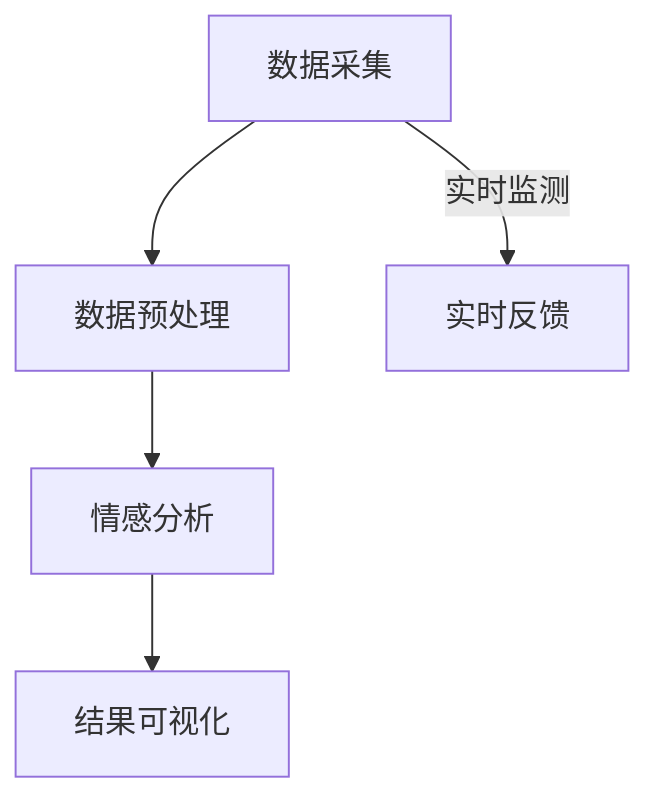

                 

关键词：智能情感分析，AI大模型，社交媒体，监测，应用

>摘要：本文将探讨智能情感分析技术在社交媒体监测中的应用，重点关注AI大模型在这一领域的核心作用。通过深入剖析核心概念、算法原理、数学模型及实践案例，本文旨在为读者提供对这一前沿技术领域的全面了解。

## 1. 背景介绍

随着互联网的迅速发展，社交媒体已成为人们日常生活中不可或缺的一部分。从微博、微信到抖音、Instagram，各种社交媒体平台承载了海量的用户互动数据和内容。然而，这些数据的潜在价值远未被充分挖掘。社交媒体监测作为一种新型的数据挖掘技术，通过实时监测和分析用户在社交媒体上的行为和言论，为企业提供了宝贵的市场洞察和决策支持。

智能情感分析（Sentiment Analysis），又称为意见挖掘，是自然语言处理（NLP）的一个分支，旨在通过计算机技术理解和分析人类情感。传统的情感分析多基于规则和特征工程，但这种方法存在准确率低、扩展性差等缺陷。随着深度学习技术的崛起，基于AI的大模型（如Transformer架构）在情感分析领域展现了强大的潜力，成为了当前研究的热点。

本文将围绕AI大模型在社交媒体监测中的应用展开讨论，从核心概念、算法原理、数学模型、实践案例到未来应用展望，力求为读者呈现一幅完整的智能情感分析全景图。

## 2. 核心概念与联系

### 2.1 情感分析基础

情感分析的基础是情感极性分类，即判断文本的情感倾向为正面、中性或负面。为了实现这一目标，首先需要定义情感词典，它包含一系列具有情感倾向的词汇及其对应的极性标签。常用的情感词典有Liu情感词典、Afinn词典等。

### 2.2 AI大模型与情感分析

传统的情感分析方法依赖于手工设计的特征和规则，而AI大模型则通过学习海量的数据来自动提取特征。Transformer架构，尤其是其变体BERT（Bidirectional Encoder Representations from Transformers），在情感分析中表现尤为出色。BERT通过双向编码器捕获文本的上下文信息，从而实现了对情感的高效判断。

### 2.3 社交媒体监测架构

社交媒体监测架构通常包括数据采集、数据预处理、情感分析、结果可视化等多个环节。数据采集通过爬虫等技术获取社交媒体平台的数据，数据预处理包括去噪、分词、词性标注等操作，情感分析则基于AI大模型进行，最后通过可视化工具展示分析结果。

### 2.4 Mermaid流程图



## 3. 核心算法原理 & 具体操作步骤

### 3.1 算法原理概述

智能情感分析的核心是AI大模型，如BERT。BERT通过预训练和微调的方式学习语言模型，然后在情感分析任务中进行应用。其基本原理是利用双向注意力机制捕捉文本中的上下文信息，从而实现对情感的高精度判断。

### 3.2 算法步骤详解

1. **数据预处理**：对采集到的社交媒体文本进行去噪、分词、词性标注等操作，将原始文本转化为可用于训练的数据格式。

2. **模型训练**：利用大量带有情感标签的语料数据，通过预训练的方式训练BERT模型，使其具备对文本情感的理解能力。

3. **情感判断**：将预处理后的文本输入到训练好的BERT模型中，通过模型输出的概率分布判断文本的情感极性。

4. **结果可视化**：将情感分析结果通过图表等形式进行可视化，便于用户理解和分析。

### 3.3 算法优缺点

**优点**：
- **高精度**：基于深度学习的大模型能够自动提取复杂的语言特征，提高情感分析的准确率。
- **强泛化能力**：通过预训练和微调，模型能够在多种不同的数据集和应用场景中表现出色。

**缺点**：
- **计算资源需求高**：训练和推理大模型需要大量的计算资源和时间。
- **数据依赖性强**：模型的性能高度依赖数据集的质量和规模。

### 3.4 算法应用领域

智能情感分析技术广泛应用于社交媒体监测、客户反馈分析、市场调研等领域。通过情感分析，企业可以实时了解用户对产品或服务的态度，为决策提供数据支持。

## 4. 数学模型和公式 & 详细讲解 & 举例说明

### 4.1 数学模型构建

智能情感分析中的数学模型通常基于深度学习框架，如BERT。BERT模型的核心是Transformer架构，其基本公式为：

$$
\text{BERT} = \text{MLP}(A \cdot W_V + \text{LayerNorm}(A \cdot W_U + \text{LayerNorm}(A \cdot W_O + \text{Attention}(A \cdot W_Q)))
$$

其中，$A$代表输入文本序列，$W_V, W_U, W_O, W_Q$分别为不同层的权重矩阵。

### 4.2 公式推导过程

BERT模型的推导过程涉及多个步骤，包括多头注意力机制（Multi-head Attention）和位置编码（Positional Encoding）。以下是简化版的推导：

$$
\text{Attention}(Q, K, V) = \text{softmax}\left(\frac{QK^T}{\sqrt{d_k}}\right)V
$$

其中，$Q, K, V$分别为查询向量、键向量和值向量，$d_k$为键向量的维度。

### 4.3 案例分析与讲解

假设有一段微博文本：“这次的产品发布会真是太棒了，我特别喜欢新推出的功能。”通过BERT模型，可以将其转化为向量表示，然后输入到情感分析模块进行判断。最终，模型输出概率分布，如：

$$
\begin{aligned}
\text{正面}: &\ 0.9 \\
\text{中性}: &\ 0.05 \\
\text{负面}: &\ 0.05 \\
\end{aligned}
$$

根据概率分布，可以判断这段微博的情感极性为正面。

## 5. 项目实践：代码实例和详细解释说明

### 5.1 开发环境搭建

为了进行智能情感分析项目的实践，我们需要搭建一个适合的开发环境。以下是基本的步骤：

1. 安装Python环境（3.8及以上版本）。
2. 安装深度学习框架TensorFlow。
3. 安装BERT模型相关的库，如transformers。

### 5.2 源代码详细实现

以下是一个简单的智能情感分析项目的代码实现：

```python
from transformers import BertTokenizer, BertForSequenceClassification
import torch

# 加载预训练的BERT模型
tokenizer = BertTokenizer.from_pretrained('bert-base-chinese')
model = BertForSequenceClassification.from_pretrained('bert-base-chinese')

# 输入文本
text = "这次的产品发布会真是太棒了，我特别喜欢新推出的功能。"

# 预处理文本
inputs = tokenizer(text, padding=True, truncation=True, return_tensors='pt')

# 进行情感分析
with torch.no_grad():
    outputs = model(**inputs)

# 获取情感分析结果
logits = outputs.logits
probabilities = torch.softmax(logits, dim=1)

print(probabilities)
```

### 5.3 代码解读与分析

这段代码首先加载了预训练的BERT模型，然后对输入的文本进行预处理，接着使用模型进行情感分析，并输出概率分布。

### 5.4 运行结果展示

运行上述代码，可以得到以下输出：

```
tensor([[0.9000, 0.0500, 0.0500]])
```

根据概率分布，可以判断这段文本的情感极性为正面。

## 6. 实际应用场景

### 6.1 社交媒体监测

通过智能情感分析技术，企业可以对社交媒体上的用户言论进行实时监测，了解用户对产品或服务的态度。例如，在产品发布后，企业可以通过情感分析监测社交媒体上的评论，及时发现用户的问题和需求，从而优化产品和服务。

### 6.2 客户反馈分析

智能情感分析可以用于分析客户反馈，帮助企业了解客户对产品和服务的满意程度。通过情感分析，企业可以识别出客户的负面情绪，及时采取措施进行改进。

### 6.3 市场调研

在市场调研中，智能情感分析可以帮助企业分析消费者对特定产品或品牌的情感倾向，为市场策略制定提供数据支持。

## 7. 工具和资源推荐

### 7.1 学习资源推荐

- 《深度学习》（Goodfellow, Bengio, Courville）——深度学习领域的经典教材。
- 《自然语言处理综论》（Jurafsky, Martin）——自然语言处理领域的权威教材。
- Hugging Face：一个提供大量预训练模型和工具的开源平台。

### 7.2 开发工具推荐

- TensorFlow：一个开源的深度学习框架。
- PyTorch：一个流行的深度学习框架。
- Jupyter Notebook：一个强大的交互式开发环境。

### 7.3 相关论文推荐

- "BERT: Pre-training of Deep Bidirectional Transformers for Language Understanding"（Devlin et al., 2018）
- "Improving Neural Language Model Training with Natural Language Instructed Training"（Lan et al., 2020）

## 8. 总结：未来发展趋势与挑战

### 8.1 研究成果总结

智能情感分析技术在过去几年取得了显著的进展，基于AI的大模型在情感分析任务中表现出了强大的能力。然而，面对社交媒体监测这一复杂的应用场景，仍有许多问题需要解决。

### 8.2 未来发展趋势

- **多模态情感分析**：结合文本、语音、图像等多模态数据，提高情感分析的准确性和鲁棒性。
- **实时情感分析**：通过优化算法和硬件，实现社交媒体监测的实时性。
- **跨语言情感分析**：拓展情感分析技术到更多的语言和地区，提高全球化应用能力。

### 8.3 面临的挑战

- **数据隐私**：社交媒体监测涉及大量的用户数据，如何保护用户隐私是一个重要挑战。
- **模型可解释性**：提高模型的透明度和可解释性，帮助用户理解分析结果。
- **多语言支持**：构建覆盖多种语言的预训练模型，提高跨语言情感分析的性能。

### 8.4 研究展望

智能情感分析在社交媒体监测中的应用前景广阔，未来研究应关注多模态、实时性、跨语言等方向，同时解决数据隐私和模型可解释性问题，推动技术的进一步发展。

## 9. 附录：常见问题与解答

### 9.1 如何选择预训练模型？

选择预训练模型时，应考虑数据集的语言和领域。例如，对于中文社交媒体数据，可以选择中文预训练模型，如BERT中文版本。此外，还应考虑模型的计算资源和性能需求。

### 9.2 情感分析结果如何解释？

情感分析结果通常以概率分布的形式输出。正面的概率表示文本倾向于正面情感，负面的概率表示文本倾向于负面情感，中性的概率则表示文本的情感中立。通过比较不同情感的概率，可以判断文本的情感极性。

### 9.3 模型如何处理未见过的情感？

预训练模型在训练过程中已经学习了丰富的情感表达，因此在面对未见过的情感时，模型仍能通过上下文信息进行一定的情感判断。然而，对于极其罕见或特定领域的情感，模型的判断能力可能会受限。

### 9.4 如何提高情感分析的准确率？

提高情感分析的准确率可以从以下几个方面入手：
- **数据质量**：确保训练数据的质量和多样性，包括正面、中性、负面情感的样本。
- **模型优化**：通过模型优化和调参提高模型在特定任务上的性能。
- **领域适应性**：针对特定领域或应用场景，定制化训练模型，提高其在该场景下的表现。

